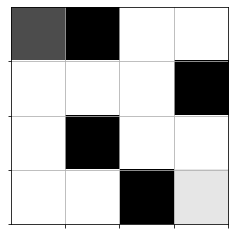

# Reinforcement Learning Mouse Model of Maze Discovery

SYDE 552

Winter 2023

April 21st 2023


### Importing neccesary libraries for data creation and visualization


```python
import matplotlib.pyplot as plt
%matplotlib inline
import numpy as np
from keras.models import Sequential
from keras.layers.core import Dense, Activation
from keras.optimizers import SGD , Adam, RMSprop
from keras.layers.activation.prelu import PReLU
from random import randint
import os, sys, time, datetime, json, random
```

### Code for simulating a rat in a maze with actions, agent and reward


```python
# dcreate the colors
visited_mark = 0.8  # Cells visited by the rat will be painted by gray 0.8
mouse_mark = 0.5  # The current rat cell will be painteg by gray 0.5

# numerically assign valus to possible actions
# assume rat cannot move diagonal
LEFT = 0
UP = 1
RIGHT = 2
DOWN = 3

# Actions dictionary
actions_dict: dict[int, str] = {
    LEFT: "left",
    UP: "up",
    RIGHT: "right",
    DOWN: "down",
}

num_actions: int = len(actions_dict)

# Exploration factor
#  one of every 10 moves the agent takes a completely random action
epsilon: float = 1 / 10


# maze is a 2d Numpy array of floats between 0.0 to 1.0
# 1.0 corresponds to a free cell, and 0.0 an occupied cell
# mouse = (row, col) initial mouse position (defaults to (0,0))


class Qmaze(object):
    def __init__(
        self,
        maze: list,
        mouse: list = (0, 0),
        valid_penalty: float = -0.04,
        invalid_penality: float = -0.75,
        visited_penality: float = -0.25,
    ):
        self._maze = np.array(maze)
        nrows, ncols = self._maze.shape
        self._valid_penality = valid_penalty
        self._invalid_penality = invalid_penality
        self._visited_penality = visited_penality

        # target cell where the "cheese" is
        # the default behaviour is that the cheese is always in the
        # bottom right corner of the maze
        self.target = (nrows - 1, ncols - 1)

        # create free cells
        self.free_cells = [
            (r, c)
            for r in range(nrows)
            for c in range(ncols)
            if self._maze[r, c] == 1.0
        ]
        # remove the target from the "free cells"
        self.free_cells.remove(self.target)

        # throw an exception if there is no way to get to the target cell
        if self._maze[self.target] == 0.0:
            raise Exception("Invalid maze: target cell cannot be blocked!")

        # throw an exception if the mouse is not started on a free cell
        if not mouse in self.free_cells:
            raise Exception("Invalid mouse Location: must sit on a free cell")
        self.reset(mouse)

    def reset(self, mouse):
        self.mouse = mouse
        self.maze = np.copy(self._maze)
        nrows, ncols = self.maze.shape
        row, col = mouse
        self.maze[row, col] = mouse_mark
        self.state = (row, col, "start")
        self.min_reward = -0.5 * self.maze.size
        self.total_reward = 0
        self.visited = set()

    def update_state(self, action):
        nrows, ncols = self.maze.shape
        nrow, ncol, nmode = mouse_row, mouse_col, mode = self.state

        if self.maze[mouse_row, mouse_col] > 0.0:
            self.visited.add((mouse_row, mouse_col))  # mark visited cell

        valid_actions = self.valid_actions()

        if not valid_actions:
            nmode = "blocked"
        elif action in valid_actions:
            nmode = "valid"
            if action == LEFT:
                ncol -= 1
            elif action == UP:
                nrow -= 1
            if action == RIGHT:
                ncol += 1
            elif action == DOWN:
                nrow += 1
        else:  # invalid action, no change mouse position
            mode = "invalid"

        # new state
        self.state = (nrow, ncol, nmode)

    def get_reward(self):
        mouse_row, mouse_col, mode = self.state
        nrows, ncols = self.maze.shape
        valid_penalty = self._valid_penality
        invalid_penalty = self._invalid_penality
        visited_penalty = self._visited_penality
        if mouse_row == nrows - 1 and mouse_col == ncols - 1:
            return 1.0
        if mode == "blocked":
            return self.min_reward - 1
        if (mouse_row, mouse_col) in self.visited:
            return visited_penalty
        if mode == "invalid":
            return invalid_penalty
        if mode == "valid":
            return valid_penalty

    def act(self, action: int):
        self.update_state(action)
        reward = self.get_reward()
        self.total_reward += reward
        status = self.trial_status()
        env_state = self.observe()
        return env_state, reward, status

    def observe(self):
        canvas = self.create_environment()
        env_state = canvas.reshape((1, -1))
        return env_state

    def create_environment(self):
        canvas = np.copy(self.maze)
        nrows, ncols = self.maze.shape
        # clear all visual marks
        for r in range(nrows):
            for c in range(ncols):
                if canvas[r, c] > 0.0:
                    canvas[r, c] = 1.0
        # draw the mouse
        row, col, valid = self.state
        canvas[row, col] = mouse_mark
        return canvas

    def trial_status(self):
        if self.total_reward < self.min_reward:
            return "lose"
        mouse_row, mouse_col, mode = self.state
        nrows, ncols = self.maze.shape
        if mouse_row == nrows - 1 and mouse_col == ncols - 1:
            return "win"
        return "not_over"

    def valid_actions(self, cell=None):
        if cell is None:
            row, col, _ = self.state
        else:
            row, col = cell
        actions = [0, 1, 2, 3]
        nrows, ncols = self.maze.shape
        if row == 0:
            actions.remove(1)
        elif row == nrows - 1:
            actions.remove(3)

        if col == 0:
            actions.remove(0)
        elif col == ncols - 1:
            actions.remove(2)

        if row > 0 and self.maze[row - 1, col] == 0.0:
            actions.remove(1)
        if row < nrows - 1 and self.maze[row + 1, col] == 0.0:
            actions.remove(3)

        if col > 0 and self.maze[row, col - 1] == 0.0:
            actions.remove(0)
        if col < ncols - 1 and self.maze[row, col + 1] == 0.0:
            actions.remove(2)

        return actions


# show 8x8 maze | WALL = BLACK | MOUSE = DARK GRAY | PATH = LIGHT GRAY | CHEESE = VERY LIGHT GRAY
def show(qmaze: Qmaze):
    plt.grid("on")
    nrows, ncols = qmaze.maze.shape
    ax = plt.gca()
    ax.set_xticks(np.arange(0.5, nrows, 1))
    ax.set_yticks(np.arange(0.5, ncols, 1))
    ax.set_xticklabels([])
    ax.set_yticklabels([])
    canvas = np.copy(qmaze.maze)
    for row, col in qmaze.visited:
        canvas[row, col] = 0.6
    mouse_row, mouse_col, _ = qmaze.state
    canvas[mouse_row, mouse_col] = 0.3  # mouse cell
    canvas[nrows - 1, ncols - 1] = 0.9  # cheese cell
    img = plt.imshow(canvas, interpolation="none", cmap="gray")
    return img
```

## Generate Random Maze

Applying Depth First Search (DFS) to generate random maze based on entrance and exit (aka cheese) location adapted from https://www.geeksforgeeks.org/random-acyclic-maze-generator-with-given-entry-and-exit-point/


```python
# Class to define structure of a node
class Node:
    def __init__(self, value=None, next_element=None):
        self.val = value
        self.next = next_element


# Class to implement a stack
class stack:
    # Constructor
    def __init__(self):
        self.head = None
        self.length = 0

    # Put an item on the top of the stack
    def insert(self, data):
        self.head = Node(data, self.head)
        self.length += 1

    # Return the top position of the stack
    def pop(self):
        if self.length == 0:
            return None
        else:
            returned = self.head.val
            self.head = self.head.next
            self.length -= 1
            return returned

    # Return False if the stack is empty
    # and true otherwise
    def not_empty(self):
        return bool(self.length)

    # Return the top position of the stack
    def top(self):
        return self.head.val


def generate_random_maze(
    rows: int = 4,
    columns: int = 4,
    initial_point: list = (0, 0),
    final_point: list = (3, 3),
):
    ROWS, COLS = rows, columns

    # Array with only walls (where paths will
    # be created)
    maze = list(list(0 for _ in range(COLS)) for _ in range(ROWS))

    # Auxiliary matrices to avoid cycles
    seen = list(list(False for _ in range(COLS)) for _ in range(ROWS))
    previous = list(list((-1, -1) for _ in range(COLS)) for _ in range(ROWS))

    S = stack()

    # Insert initial position
    S.insert(initial_point)

    # Keep walking on the graph using dfs
    # until we have no more paths to traverse
    # (create)
    while S.not_empty():
        # Remove the position of the Stack
        # and mark it as seen
        x, y = S.pop()
        seen[x][y] = True

        # This is to avoid cycles with adj positions
        if (x + 1 < ROWS) and maze[x + 1][y] == 1 and previous[x][y] != (x + 1, y):
            continue
        if (0 < x) and maze[x - 1][y] == 1 and previous[x][y] != (x - 1, y):
            continue
        if (y + 1 < COLS) and maze[x][y + 1] == 1 and previous[x][y] != (x, y + 1):
            continue
        if (y > 0) and maze[x][y - 1] == 1 and previous[x][y] != (x, y - 1):
            continue

        # Mark as walkable position
        maze[x][y] = 1

        # Array to shuffle neighbours before
        # insertion
        to_stack = []

        # Before inserting any position,
        # check if it is in the boundaries of
        # the maze
        # and if it were seen (to avoid cycles)

        # If adj position is valid and was not seen yet
        if (x + 1 < ROWS) and seen[x + 1][y] == False:
            # Mark the adj position as seen
            seen[x + 1][y] = True

            # Memorize the position to insert the
            # position in the stack
            to_stack.append((x + 1, y))

            # Memorize the current position as its
            # previous position on the path
            previous[x + 1][y] = (x, y)

        if (0 < x) and seen[x - 1][y] == False:
            # Mark the adj position as seen
            seen[x - 1][y] = True

            # Memorize the position to insert the
            # position in the stack
            to_stack.append((x - 1, y))

            # Memorize the current position as its
            # previous position on the path
            previous[x - 1][y] = (x, y)

        if (y + 1 < COLS) and seen[x][y + 1] == False:
            # Mark the adj position as seen
            seen[x][y + 1] = True

            # Memorize the position to insert the
            # position in the stack
            to_stack.append((x, y + 1))

            # Memorize the current position as its
            # previous position on the path
            previous[x][y + 1] = (x, y)

        if (y > 0) and seen[x][y - 1] == False:
            # Mark the adj position as seen
            seen[x][y - 1] = True

            # Memorize the position to insert the
            # position in the stack
            to_stack.append((x, y - 1))

            # Memorize the current position as its
            # previous position on the path
            previous[x][y - 1] = (x, y)

        # Indicates if Pf is a neighbour position
        pf_flag = False
        while len(to_stack):
            # Remove random position
            neighbour = to_stack.pop(randint(0, len(to_stack) - 1))

            # Is the final position,
            # remember that by marking the flag
            if neighbour == final_point:
                pf_flag = True

            # Put on the top of the stack
            else:
                S.insert(neighbour)

        # This way, Pf will be on the top
        if pf_flag:
            S.insert(final_point)

    # Mark the initial position
    x0, y0 = initial_point
    xf, yf = final_point
    maze[x0][y0] = 1
    maze[xf][yf] = 1

    # Return maze formed by the traversed path
    return np.asarray(maze, dtype="float")


# Test Run to ensure that function is working correctly
test_cols = 8
test_rows = 8
test_init_point = (0, 0)
test_final_point = (7, 7)

test_maze = generate_random_maze(
    rows=test_rows,
    columns=test_cols,
    initial_point=test_init_point,
    final_point=test_final_point,
)
# check that the shape generated is correct
assert test_maze.shape == (test_cols, test_rows)
```

### Generating a maze array and initializing a Qmaze


```python
maze = generate_random_maze(2, 2, (0, 0), (1, 1))
qmaze = Qmaze(maze=maze)
show(qmaze)
```


    <matplotlib.image.AxesImage at 0x12e786790>


    

    


```python
class Model(object):
    def __init__(self, maze: list, learning_rate: float = 0.001):
        model = Sequential()
        model.add(Dense(maze.size, input_shape=(maze.size,)))
        model.add(PReLU())
        model.add(Dense(maze.size))
        model.add(PReLU())
        model.add(Dense(num_actions))
        model.compile(optimizer="adam", loss="mse")
        self.model = model

    def get_model(self):
        return self.model
```

## Create a Trial

Create an `Trial` class that accepts a trained neural network which calculates the next action, a Qmaze and the initial cell that the mouse is in.


```python
class Trial:
    def __init__(self, model: Model, qmaze: Qmaze, mouse_cell: list):
        self._qmaze = qmaze
        self._model = model
        self.mouse_cell = mouse_cell

    def run(self):
        print("running trial...")
        mouse_cell = self._get_mouse_cell()
        self._qmaze.reset(mouse_cell)
        env_state = self._qmaze.observe()
        while True:
            prev_env_state = env_state
            Q = self._model.get_model().predict(prev_env_state)
            action = np.argmax(Q[0])
            _, _, status = self._qmaze.act(action)
            if status == "win":
                return True
            elif status == "lose":
                return False

    # For small mazes we can allow ourselves to perform a completion check in which we simulate all possible
    # games and check if our model wins the all. This is not practical for large mazes as it slows down training.
    def check(self):
        self._qmaze = self._get_maze()
        for cell in self._qmaze.free_cells:
            if not self._qmaze.valid_actions(cell):
                return False
            if not self.run():
                return False
        return True

    def _get_maze(self):
        return self._qmaze

    def _get_model(self):
        return self._model

    def _get_mouse_cell(self):
        return self.mouse_cell
```

## Creating a Class to Model the Experience of the Mouse

Create an `Experience` class that collects the experience of `Experiments` within a `list` of memory. It retreives a `model`, a `max_memory` which defines the maximum amount of experiments that the mouse can _remember_ and a `discount` factor which represents the instantanious uncertainty in the _Bellman equation for stochastic environments_.


```python
class Experience(object):
    def __init__(self, model: Model, max_memory: int = 8, discount: float = 95 / 100):
        self.model = model
        self.max_memory = max_memory
        self.discount = discount
        self.memory = list()
        self.actions = model.get_model().output_shape[-1]

    def remember(self, trial):
        self.memory.append(trial)
        if len(self.memory) > self.max_memory:
            # delete the first element of the memory list if we exceed the max memory
            del self.memory[0]

    def predict(self, env_state):
        return self.model.get_model().predict(env_state)[0]

    def data(self, data_size: int = 10):
        environment_size = self.memory[0][0].shape[1]
        memory_size = len(self.memory)
        data_size = min(memory_size, data_size)
        inputs = np.zeros((data_size, environment_size))
        targets = np.zeros((data_size, self.actions))
        for idx, jdx in enumerate(
            np.random.choice(range(memory_size), data_size, replace=False)
        ):
            env_state, action, reward, env_state_next, trial_over = self.memory[jdx]
            inputs[idx] = env_state
            # There should be no target values for actions not taken.
            targets[idx] = self.predict(env_state)
            # Q_sa = derived policy = max quality env/action = max_a' Q(s', a')
            Q_sa = np.max(self.predict(env_state_next))
            if trial_over:
                targets[idx, action] = reward
            else:
                # reward + gamma * max_a' Q(s', a')
                targets[idx, action] = reward + self.discount * Q_sa
        return inputs, targets
```

# Q-Training Algorithm for Reinforcement Learning of Mouse
The algorithm accepts the a `number_epoch` which is the number of epochs, the maximum memory `max_memory` which is the maximum number of trials kept in memory and the `data_size` which is the number of  samples in training epoch. This is the number of trials randomly selected from the mouse's experience


```python
# This is a small utility for printing readable time strings:
def format_time(seconds):
    if seconds < 400:
        s = float(seconds)
        return "%.1f seconds" % (s,)
    elif seconds < 4000:
        m = seconds / 60.0
        return "%.2f minutes" % (m,)
    else:
        h = seconds / 3600.0
        return "%.2f hours" % (h,)
```


```python
class Experiment(object):
    def __init__(self, maze=generate_random_maze(), model_learning_rate: int = 0.001):
        qmaze = Qmaze(maze)
        model = Model(maze, learning_rate=model_learning_rate)
        trial = Trial(model, qmaze, (0, 0))
        self.qmaze = qmaze
        self.model = model
        self.trial = trial

    def train(self, **opt):
        show(self.qmaze)
        print("training....")
        global epsilon
        number_epoch = opt.get("epochs", 15000)
        max_memory = opt.get("max_memory", 8)
        data_size = opt.get("data_size", 25)
        name = opt.get("name", "model")
        start_time = datetime.datetime.now()

        # Initialize experience replay object
        experience = Experience(self.model, max_memory=max_memory)

        completion_history = []  # history of win/lose game
        number_free_cells = len(self.qmaze.free_cells)
        hsize = self.qmaze.maze.size // 2  # history window size
        win_rate = 0.0
        imctr = 1

        for epoch in range(number_epoch):
            loss = 0.0
            mouse_cell = random.choice(self.qmaze.free_cells)
            self.qmaze.reset(mouse_cell)
            trial_over = False

            # get initial env_state (1d flattened canvas)
            env_state = self.qmaze.observe()

            n_trials = 0
            while not trial_over:
                valid_actions = self.qmaze.valid_actions()
                if not valid_actions:
                    break
                prev_env_state = env_state
                # Get next action
                if np.random.rand() < epsilon:
                    action = random.choice(valid_actions)
                else:
                    action = np.argmax(experience.predict(prev_env_state))

                # Apply action, get reward and new env_state
                env_state, reward, status = self.qmaze.act(action)
                if status == "win":
                    completion_history.append(1)
                    trial_over = True
                elif status == "lose":
                    completion_history.append(0)
                    trial_over = True
                else:
                    trial_over = False

                # Store trial (experience)
                trial = [prev_env_state, action, reward, env_state, trial_over]
                experience.remember(trial)
                n_trials += 1

                # Train neural network model
                inputs, targets = experience.data(data_size=data_size)
                self.model.model.fit(
                    inputs,
                    targets,
                    epochs=1,
                    batch_size=16,
                )
                loss = self.model.model.evaluate(inputs, targets, verbose=0)

            if len(completion_history) > hsize:
                win_rate = sum(completion_history[-hsize:]) / hsize

            dt = datetime.datetime.now() - start_time
            t = format_time(dt.total_seconds())
            template = "Epoch: {:03d}/{:d} | Loss: {:.4f} | Trials: {:d} | Win count: {:d} | Win rate: {:.3f} | time: {}"
            print(
                template.format(
                    epoch,
                    number_epoch - 1,
                    loss,
                    n_trials,
                    sum(completion_history),
                    win_rate,
                    t,
                )
            )
            # we simply check if training has exhausted all free cells and if in all
            # cases the agent won
            if win_rate > 0.9:
                epsilon = 0.05

            if sum(completion_history[-hsize:]) == hsize:  # and self.trial.check():
                print("Reached 100%% win rate at epoch: %d" % (epoch,))
                break

        # Save trained model weights and architecture, this will be used by the visualization code
        h5file = name + ".h5"
        json_file = name + ".json"
        self.model.get_model().save_weights(h5file, overwrite=True)
        with open(json_file, "w") as outfile:
            json.dump(self.model.get_model().to_json(), outfile)
        end_time = datetime.datetime.now()
        dt = datetime.datetime.now() - start_time
        seconds = dt.total_seconds()
        t = format_time(seconds)
        print("files: %s, %s" % (h5file, json_file))
        print(
            "n_epoch: %d, max_mem: %d, data: %d, time: %s"
            % (epoch, max_memory, data_size, t)
        )
        return seconds
```

## Train the Model


```python
experiment = Experiment()

experiment.train()

```

    training....
    1/1 [==============================] - 0s 63ms/step
    1/1 [==============================] - 0s 19ms/step
    1/1 [==============================] - 0s 19ms/step
    1/1 [==============================] - 1s 861ms/step - loss: 0.0168
    1/1 [==============================] - 0s 22ms/step
    1/1 [==============================] - 0s 23ms/step
    1/1 [==============================] - 0s 19ms/step
    1/1 [==============================] - 0s 20ms/step
    1/1 [==============================] - 0s 62ms/step
    1/1 [==============================] - 0s 4ms/step - loss: 0.0166
    1/1 [==============================] - 0s 27ms/step
    1/1 [==============================] - 0s 21ms/step
    1/1 [==============================] - 0s 31ms/step
    1/1 [==============================] - 0s 28ms/step
    1/1 [==============================] - 0s 22ms/step
    1/1 [==============================] - 0s 19ms/step
    1/1 [==============================] - 0s 18ms/step
    1/1 [==============================] - 0s 4ms/step - loss: 0.0165
    1/1 [==============================] - 0s 26ms/step
    1/1 [==============================] - 0s 18ms/step
    1/1 [==============================] - 0s 21ms/step
    1/1 [==============================] - 0s 27ms/step
    1/1 [==============================] - 0s 19ms/step
    1/1 [==============================] - 0s 18ms/step
    1/1 [==============================] - 0s 18ms/step
    1/1 [==============================] - 0s 24ms/step
    1/1 [==============================] - 0s 21ms/step
    1/1 [==============================] - 0s 4ms/step - loss: 0.0164
    1/1 [==============================] - 0s 29ms/step
    1/1 [==============================] - 0s 27ms/step
    1/1 [==============================] - 0s 20ms/step
    1/1 [==============================] - 0s 24ms/step
    1/1 [==============================] - 0s 20ms/step
    1/1 [==============================] - 0s 17ms/step
    1/1 [==============================] - 0s 17ms/step
    1/1 [==============================] - 0s 18ms/step
    1/1 [==============================] - 0s 18ms/step
    1/1 [==============================] - 0s 18ms/step
    1/1 [==============================] - 0s 3ms/step - loss: 0.0176
    1/1 [==============================] - 0s 17ms/step
    1/1 [==============================] - 0s 19ms/step
    1/1 [==============================] - 0s 17ms/step
    1/1 [==============================] - 0s 18ms/step
    1/1 [==============================] - 0s 18ms/step
    1/1 [==============================] - 0s 18ms/step
    1/1 [==============================] - 0s 18ms/step
    1/1 [==============================] - 0s 17ms/step
    1/1 [==============================] - 0s 18ms/step
    1/1 [==============================] - 0s 19ms/step
    1/1 [==============================] - 0s 21ms/step
    1/1 [==============================] - 0s 18ms/step
    1/1 [==============================] - 0s 20ms/step
    1/1 [==============================] - 0s 27ms/step - loss: 0.0166
    1/1 [==============================] - 0s 17ms/step
    1/1 [==============================] - 0s 18ms/step
    1/1 [==============================] - 0s 18ms/step
    1/1 [==============================] - 0s 17ms/step
    1/1 [==============================] - 0s 17ms/step
    1/1 [==============================] - 0s 18ms/step
    1/1 [==============================] - 0s 18ms/step
    1/1 [==============================] - 0s 18ms/step
    1/1 [==============================] - 0s 19ms/step
    1/1 [==============================] - 0s 19ms/step
    1/1 [==============================] - 0s 21ms/step
    1/1 [==============================] - 0s 18ms/step
    1/1 [==============================] - 0s 18ms/step
    1/1 [==============================] - 0s 19ms/step
    1/1 [==============================] - 0s 20ms/step
    1/1 [==============================] - 0s 3ms/step - loss: 0.0159
    1/1 [==============================] - 0s 18ms/step
    1/1 [==============================] - 0s 18ms/step
    1/1 [==============================] - 0s 19ms/step
    1/1 [==============================] - 0s 19ms/step
    1/1 [==============================] - 0s 19ms/step
    1/1 [==============================] - 0s 44ms/step
    1/1 [==============================] - 0s 18ms/step
    1/1 [==============================] - 0s 18ms/step
    1/1 [==============================] - 0s 18ms/step
    1/1 [==============================] - 0s 26ms/step
    1/1 [==============================] - 0s 17ms/step
    1/1 [==============================] - 0s 18ms/step
    1/1 [==============================] - 0s 18ms/step
    1/1 [==============================] - 0s 18ms/step
    1/1 [==============================] - 0s 18ms/step
    1/1 [==============================] - 0s 18ms/step
    1/1 [==============================] - 0s 18ms/step
    1/1 [==============================] - 0s 3ms/step - loss: 0.0154
    1/1 [==============================] - 0s 17ms/step
    1/1 [==============================] - 0s 19ms/step
    1/1 [==============================] - 0s 17ms/step
    1/1 [==============================] - 0s 19ms/step
    1/1 [==============================] - 0s 17ms/step
    1/1 [==============================] - 0s 17ms/step
    1/1 [==============================] - 0s 18ms/step
    1/1 [==============================] - 0s 18ms/step
    1/1 [==============================] - 0s 17ms/step
    1/1 [==============================] - 0s 53ms/step
    1/1 [==============================] - 0s 19ms/step
    1/1 [==============================] - 0s 24ms/step
    1/1 [==============================] - 0s 18ms/step
    1/1 [==============================] - 0s 21ms/step
    1/1 [==============================] - 0s 20ms/step
    1/1 [==============================] - 0s 18ms/step
    1/1 [==============================] - 0s 17ms/step
    1/1 [==============================] - 0s 3ms/step - loss: 0.0149
    1/1 [==============================] - 0s 22ms/step
    1/1 [==============================] - 0s 19ms/step
    1/1 [==============================] - 0s 21ms/step
    1/1 [==============================] - 0s 19ms/step
    1/1 [==============================] - 0s 19ms/step
    1/1 [==============================] - 0s 20ms/step
    1/1 [==============================] - 0s 19ms/step
    1/1 [==============================] - 0s 16ms/step
    1/1 [==============================] - 0s 18ms/step
    1/1 [==============================] - 0s 18ms/step
    1/1 [==============================] - 0s 17ms/step
    1/1 [==============================] - 0s 18ms/step
    1/1 [==============================] - 0s 17ms/step
    1/1 [==============================] - 0s 20ms/step
    1/1 [==============================] - 0s 16ms/step
    1/1 [==============================] - 0s 16ms/step
    1/1 [==============================] - 0s 16ms/step
    1/1 [==============================] - 0s 4ms/step - loss: 0.0145
    1/1 [==============================] - 0s 16ms/step
    1/1 [==============================] - 0s 16ms/step
    1/1 [==============================] - 0s 17ms/step
    1/1 [==============================] - 0s 17ms/step
    1/1 [==============================] - 0s 16ms/step
    1/1 [==============================] - 0s 18ms/step
    1/1 [==============================] - 0s 17ms/step
    1/1 [==============================] - 0s 18ms/step
    1/1 [==============================] - 0s 17ms/step
    1/1 [==============================] - 0s 17ms/step
    1/1 [==============================] - 0s 17ms/step
    1/1 [==============================] - 0s 17ms/step
    1/1 [==============================] - 0s 17ms/step
    1/1 [==============================] - 0s 38ms/step
    1/1 [==============================] - 0s 16ms/step
    1/1 [==============================] - 0s 17ms/step
    1/1 [==============================] - 0s 17ms/step
    1/1 [==============================] - 0s 4ms/step - loss: 0.0141
    1/1 [==============================] - 0s 16ms/step
    1/1 [==============================] - 0s 17ms/step
    1/1 [==============================] - 0s 17ms/step
    1/1 [==============================] - 0s 17ms/step
    1/1 [==============================] - 0s 21ms/step
    1/1 [==============================] - 0s 16ms/step
    1/1 [==============================] - 0s 16ms/step
    1/1 [==============================] - 0s 17ms/step
    1/1 [==============================] - 0s 17ms/step
    1/1 [==============================] - 0s 16ms/step
    1/1 [==============================] - 0s 16ms/step
    1/1 [==============================] - 0s 17ms/step
    1/1 [==============================] - 0s 16ms/step
    1/1 [==============================] - 0s 17ms/step
    1/1 [==============================] - 0s 17ms/step
    1/1 [==============================] - 0s 26ms/step
    1/1 [==============================] - 0s 16ms/step
    1/1 [==============================] - 0s 3ms/step - loss: 0.0139
    1/1 [==============================] - 0s 57ms/step
    1/1 [==============================] - 0s 17ms/step
    1/1 [==============================] - 0s 17ms/step
    1/1 [==============================] - 0s 16ms/step
    1/1 [==============================] - 0s 17ms/step
    1/1 [==============================] - 0s 17ms/step
    1/1 [==============================] - 0s 16ms/step
    1/1 [==============================] - 0s 17ms/step
    1/1 [==============================] - 0s 16ms/step
    1/1 [==============================] - 0s 17ms/step
    1/1 [==============================] - 0s 18ms/step
    1/1 [==============================] - 0s 17ms/step
    1/1 [==============================] - 0s 17ms/step
    1/1 [==============================] - 0s 17ms/step
    1/1 [==============================] - 0s 23ms/step
    1/1 [==============================] - 0s 17ms/step
    1/1 [==============================] - 0s 17ms/step
    1/1 [==============================] - 0s 3ms/step - loss: 0.0157
    1/1 [==============================] - 0s 15ms/step
    1/1 [==============================] - 0s 17ms/step
    1/1 [==============================] - 0s 18ms/step
    1/1 [==============================] - 0s 17ms/step
    1/1 [==============================] - 0s 55ms/step
    1/1 [==============================] - 0s 16ms/step
    1/1 [==============================] - 0s 17ms/step
    1/1 [==============================] - 0s 17ms/step
    1/1 [==============================] - 0s 16ms/step
    1/1 [==============================] - 0s 17ms/step
    1/1 [==============================] - 0s 17ms/step
    1/1 [==============================] - 0s 16ms/step
    1/1 [==============================] - 0s 17ms/step
    1/1 [==============================] - 0s 17ms/step
    1/1 [==============================] - 0s 17ms/step
    1/1 [==============================] - 0s 19ms/step
    1/1 [==============================] - 0s 16ms/step
    1/1 [==============================] - 0s 3ms/step - loss: 0.0130
    1/1 [==============================] - 0s 16ms/step
    1/1 [==============================] - 0s 16ms/step
    1/1 [==============================] - 0s 21ms/step
    1/1 [==============================] - 0s 17ms/step
    1/1 [==============================] - 0s 16ms/step
    1/1 [==============================] - 0s 17ms/step
    1/1 [==============================] - 0s 16ms/step
    1/1 [==============================] - 0s 23ms/step
    1/1 [==============================] - 0s 32ms/step
    1/1 [==============================] - 0s 17ms/step
    1/1 [==============================] - 0s 17ms/step
    1/1 [==============================] - 0s 16ms/step
    1/1 [==============================] - 0s 18ms/step
    1/1 [==============================] - 0s 17ms/step
    1/1 [==============================] - 0s 16ms/step
    1/1 [==============================] - 0s 17ms/step
    1/1 [==============================] - 0s 16ms/step
    1/1 [==============================] - 0s 3ms/step - loss: 0.0097
    1/1 [==============================] - 0s 16ms/step
    1/1 [==============================] - 0s 17ms/step
    1/1 [==============================] - 0s 16ms/step
    1/1 [==============================] - 0s 17ms/step
    1/1 [==============================] - 0s 17ms/step
    1/1 [==============================] - 0s 17ms/step
    1/1 [==============================] - 0s 16ms/step
    1/1 [==============================] - 0s 17ms/step
    1/1 [==============================] - 0s 17ms/step
    1/1 [==============================] - 0s 17ms/step
    1/1 [==============================] - 0s 16ms/step
    1/1 [==============================] - 0s 17ms/step
    1/1 [==============================] - 0s 67ms/step
    1/1 [==============================] - 0s 17ms/step
    1/1 [==============================] - 0s 16ms/step
    1/1 [==============================] - 0s 16ms/step
    1/1 [==============================] - 0s 16ms/step
    1/1 [==============================] - 0s 4ms/step - loss: 0.0088
    1/1 [==============================] - 0s 16ms/step
    1/1 [==============================] - 0s 17ms/step
    1/1 [==============================] - 0s 18ms/step
    1/1 [==============================] - 0s 17ms/step
    1/1 [==============================] - 0s 16ms/step
    1/1 [==============================] - 0s 17ms/step
    1/1 [==============================] - 0s 17ms/step
    1/1 [==============================] - 0s 17ms/step
    1/1 [==============================] - 0s 17ms/step
    1/1 [==============================] - 0s 16ms/step
    1/1 [==============================] - 0s 16ms/step
    1/1 [==============================] - 0s 17ms/step
    1/1 [==============================] - 0s 23ms/step
    1/1 [==============================] - 0s 17ms/step
    1/1 [==============================] - 0s 19ms/step
    1/1 [==============================] - 0s 37ms/step
    1/1 [==============================] - 0s 17ms/step
    1/1 [==============================] - 0s 3ms/step - loss: 0.0084
    1/1 [==============================] - 0s 16ms/step
    1/1 [==============================] - 0s 17ms/step
    1/1 [==============================] - 0s 18ms/step
    1/1 [==============================] - 0s 17ms/step
    1/1 [==============================] - 0s 17ms/step
    1/1 [==============================] - 0s 16ms/step
    1/1 [==============================] - 0s 16ms/step
    1/1 [==============================] - 0s 19ms/step
    1/1 [==============================] - 0s 17ms/step
    1/1 [==============================] - 0s 16ms/step
    1/1 [==============================] - 0s 17ms/step
    1/1 [==============================] - 0s 17ms/step
    1/1 [==============================] - 0s 17ms/step
    1/1 [==============================] - 0s 18ms/step
    1/1 [==============================] - 0s 16ms/step
    1/1 [==============================] - 0s 18ms/step
    1/1 [==============================] - 0s 16ms/step
    1/1 [==============================] - 0s 28ms/step - loss: 0.0086
    1/1 [==============================] - 0s 18ms/step
    1/1 [==============================] - 0s 17ms/step
    1/1 [==============================] - 0s 16ms/step
    1/1 [==============================] - 0s 17ms/step
    1/1 [==============================] - 0s 17ms/step
    1/1 [==============================] - 0s 17ms/step
    1/1 [==============================] - 0s 17ms/step
    1/1 [==============================] - 0s 18ms/step
    1/1 [==============================] - 0s 16ms/step
    1/1 [==============================] - 0s 18ms/step
    1/1 [==============================] - 0s 17ms/step
    1/1 [==============================] - 0s 16ms/step
    1/1 [==============================] - 0s 16ms/step
    1/1 [==============================] - 0s 16ms/step
    1/1 [==============================] - 0s 17ms/step
    1/1 [==============================] - 0s 17ms/step
    1/1 [==============================] - 0s 20ms/step
    1/1 [==============================] - 0s 3ms/step - loss: 0.0092
    1/1 [==============================] - 0s 16ms/step
    1/1 [==============================] - 0s 17ms/step
    1/1 [==============================] - 0s 17ms/step
    1/1 [==============================] - 0s 17ms/step
    1/1 [==============================] - 0s 45ms/step
    1/1 [==============================] - 0s 16ms/step
    1/1 [==============================] - 0s 16ms/step
    1/1 [==============================] - 0s 17ms/step
    1/1 [==============================] - 0s 16ms/step
    1/1 [==============================] - 0s 16ms/step
    1/1 [==============================] - 0s 16ms/step
    1/1 [==============================] - 0s 16ms/step
    1/1 [==============================] - 0s 17ms/step
    1/1 [==============================] - 0s 16ms/step
    1/1 [==============================] - 0s 18ms/step
    1/1 [==============================] - 0s 16ms/step
    1/1 [==============================] - 0s 16ms/step
    1/1 [==============================] - 0s 4ms/step - loss: 0.0097
    1/1 [==============================] - 0s 16ms/step
    1/1 [==============================] - 0s 16ms/step
    1/1 [==============================] - 0s 16ms/step
    1/1 [==============================] - 0s 17ms/step
    1/1 [==============================] - 0s 18ms/step
    1/1 [==============================] - 0s 41ms/step
    1/1 [==============================] - 0s 16ms/step
    1/1 [==============================] - 0s 17ms/step
    1/1 [==============================] - 0s 18ms/step
    1/1 [==============================] - 0s 17ms/step
    1/1 [==============================] - 0s 16ms/step
    1/1 [==============================] - 0s 16ms/step
    1/1 [==============================] - 0s 17ms/step
    1/1 [==============================] - 0s 16ms/step
    1/1 [==============================] - 0s 17ms/step
    1/1 [==============================] - 0s 16ms/step
    1/1 [==============================] - 0s 16ms/step
    1/1 [==============================] - 0s 3ms/step - loss: 0.0106
    1/1 [==============================] - 0s 16ms/step
    1/1 [==============================] - 0s 23ms/step
    1/1 [==============================] - 0s 17ms/step
    1/1 [==============================] - 0s 17ms/step
    1/1 [==============================] - 0s 16ms/step
    1/1 [==============================] - 0s 17ms/step
    1/1 [==============================] - 0s 55ms/step
    1/1 [==============================] - 0s 16ms/step
    1/1 [==============================] - 0s 17ms/step
    1/1 [==============================] - 0s 16ms/step
    1/1 [==============================] - 0s 16ms/step
    1/1 [==============================] - 0s 16ms/step
    1/1 [==============================] - 0s 17ms/step
    1/1 [==============================] - 0s 17ms/step
    1/1 [==============================] - 0s 17ms/step
    1/1 [==============================] - 0s 17ms/step
    1/1 [==============================] - 0s 15ms/step
    1/1 [==============================] - 0s 3ms/step - loss: 0.0121
    1/1 [==============================] - 0s 16ms/step
    1/1 [==============================] - 0s 23ms/step
    1/1 [==============================] - 0s 16ms/step
    1/1 [==============================] - 0s 16ms/step
    1/1 [==============================] - 0s 16ms/step
    1/1 [==============================] - 0s 17ms/step
    1/1 [==============================] - 0s 16ms/step
    1/1 [==============================] - 0s 18ms/step
    1/1 [==============================] - 0s 17ms/step
    1/1 [==============================] - 0s 17ms/step
    1/1 [==============================] - 0s 36ms/step
    1/1 [==============================] - 0s 17ms/step
    1/1 [==============================] - 0s 18ms/step
    1/1 [==============================] - 0s 17ms/step
    1/1 [==============================] - 0s 16ms/step
    1/1 [==============================] - 0s 17ms/step
    1/1 [==============================] - 0s 17ms/step
    1/1 [==============================] - 0s 3ms/step - loss: 0.0139
    1/1 [==============================] - 0s 17ms/step
    1/1 [==============================] - 0s 16ms/step
    1/1 [==============================] - 0s 16ms/step
    1/1 [==============================] - 0s 23ms/step
    1/1 [==============================] - 0s 17ms/step
    1/1 [==============================] - 0s 17ms/step
    1/1 [==============================] - 0s 16ms/step
    1/1 [==============================] - 0s 18ms/step
    1/1 [==============================] - 0s 17ms/step
    1/1 [==============================] - 0s 28ms/step
    1/1 [==============================] - 0s 17ms/step
    1/1 [==============================] - 0s 16ms/step
    1/1 [==============================] - 0s 16ms/step
    1/1 [==============================] - 0s 17ms/step
    1/1 [==============================] - 0s 16ms/step
    1/1 [==============================] - 0s 17ms/step
    1/1 [==============================] - 0s 17ms/step
    1/1 [==============================] - 0s 4ms/step - loss: 0.0144
    1/1 [==============================] - 0s 17ms/step
    1/1 [==============================] - 0s 16ms/step
    1/1 [==============================] - 0s 17ms/step
    1/1 [==============================] - 0s 16ms/step
    1/1 [==============================] - 0s 18ms/step
    1/1 [==============================] - 0s 27ms/step
    1/1 [==============================] - 0s 17ms/step
    1/1 [==============================] - 0s 17ms/step
    1/1 [==============================] - 0s 16ms/step
    1/1 [==============================] - 0s 17ms/step
    1/1 [==============================] - 0s 39ms/step
    1/1 [==============================] - 0s 16ms/step
    1/1 [==============================] - 0s 18ms/step
    1/1 [==============================] - 0s 18ms/step
    1/1 [==============================] - 0s 18ms/step
    1/1 [==============================] - 0s 18ms/step
    1/1 [==============================] - 0s 19ms/step
    1/1 [==============================] - 0s 4ms/step - loss: 0.0148
    1/1 [==============================] - 0s 17ms/step
    1/1 [==============================] - 0s 19ms/step
    1/1 [==============================] - 0s 17ms/step
    1/1 [==============================] - 0s 17ms/step
    1/1 [==============================] - 0s 16ms/step
    1/1 [==============================] - 0s 17ms/step
    1/1 [==============================] - 0s 16ms/step
    1/1 [==============================] - 0s 21ms/step
    1/1 [==============================] - 0s 17ms/step
    1/1 [==============================] - 0s 44ms/step
    1/1 [==============================] - 0s 17ms/step
    1/1 [==============================] - 0s 18ms/step
    1/1 [==============================] - 0s 17ms/step
    1/1 [==============================] - 0s 16ms/step
    1/1 [==============================] - 0s 18ms/step
    1/1 [==============================] - 0s 17ms/step
    1/1 [==============================] - 0s 17ms/step
    1/1 [==============================] - 0s 3ms/step - loss: 0.0128
    1/1 [==============================] - 0s 16ms/step
    1/1 [==============================] - 0s 16ms/step
    1/1 [==============================] - 0s 17ms/step
    1/1 [==============================] - 0s 18ms/step
    1/1 [==============================] - 0s 22ms/step
    1/1 [==============================] - 0s 17ms/step
    1/1 [==============================] - 0s 16ms/step
    1/1 [==============================] - 0s 16ms/step
    1/1 [==============================] - 0s 17ms/step
    1/1 [==============================] - 0s 24ms/step
    1/1 [==============================] - 0s 23ms/step
    1/1 [==============================] - 0s 25ms/step
    1/1 [==============================] - 0s 16ms/step
    1/1 [==============================] - 0s 17ms/step
    1/1 [==============================] - 0s 17ms/step
    1/1 [==============================] - 0s 17ms/step
    1/1 [==============================] - 0s 17ms/step
    1/1 [==============================] - 0s 4ms/step - loss: 0.0129
    1/1 [==============================] - 0s 15ms/step
    1/1 [==============================] - 0s 16ms/step
    1/1 [==============================] - 0s 18ms/step
    1/1 [==============================] - 0s 18ms/step
    1/1 [==============================] - 0s 17ms/step
    1/1 [==============================] - 0s 17ms/step
    1/1 [==============================] - 0s 16ms/step
    1/1 [==============================] - 0s 16ms/step
    1/1 [==============================] - 0s 55ms/step
    1/1 [==============================] - 0s 16ms/step
    1/1 [==============================] - 0s 16ms/step
    1/1 [==============================] - 0s 18ms/step
    1/1 [==============================] - 0s 17ms/step
    1/1 [==============================] - 0s 17ms/step
    1/1 [==============================] - 0s 18ms/step
    1/1 [==============================] - 0s 17ms/step
    1/1 [==============================] - 0s 17ms/step
    1/1 [==============================] - 0s 3ms/step - loss: 0.0110
    1/1 [==============================] - 0s 16ms/step
    1/1 [==============================] - 0s 17ms/step
    1/1 [==============================] - 0s 17ms/step
    1/1 [==============================] - 0s 17ms/step
    1/1 [==============================] - 0s 17ms/step
    1/1 [==============================] - 0s 16ms/step
    1/1 [==============================] - 0s 16ms/step
    1/1 [==============================] - 0s 41ms/step
    1/1 [==============================] - 0s 16ms/step
    1/1 [==============================] - 0s 17ms/step
    1/1 [==============================] - 0s 17ms/step
    1/1 [==============================] - 0s 19ms/step
    1/1 [==============================] - 0s 17ms/step
    1/1 [==============================] - 0s 17ms/step
    1/1 [==============================] - 0s 17ms/step
    1/1 [==============================] - 0s 17ms/step
    1/1 [==============================] - 0s 17ms/step
    1/1 [==============================] - 0s 3ms/step - loss: 0.0116
    1/1 [==============================] - 0s 16ms/step
    1/1 [==============================] - 0s 17ms/step
    1/1 [==============================] - 0s 17ms/step
    1/1 [==============================] - 0s 18ms/step
    1/1 [==============================] - 0s 16ms/step
    1/1 [==============================] - 0s 42ms/step
    1/1 [==============================] - 0s 16ms/step
    1/1 [==============================] - 0s 17ms/step
    1/1 [==============================] - 0s 17ms/step
    1/1 [==============================] - 0s 17ms/step
    1/1 [==============================] - 0s 16ms/step
    1/1 [==============================] - 0s 17ms/step
    1/1 [==============================] - 0s 21ms/step
    1/1 [==============================] - 0s 18ms/step
    1/1 [==============================] - 0s 16ms/step
    1/1 [==============================] - 0s 17ms/step
    1/1 [==============================] - 0s 17ms/step
    1/1 [==============================] - 0s 4ms/step - loss: 0.0109
    1/1 [==============================] - 0s 16ms/step
    1/1 [==============================] - 0s 16ms/step
    1/1 [==============================] - 0s 17ms/step
    1/1 [==============================] - 0s 74ms/step
    1/1 [==============================] - 0s 19ms/step
    1/1 [==============================] - 0s 17ms/step
    1/1 [==============================] - 0s 17ms/step
    1/1 [==============================] - 0s 19ms/step
    1/1 [==============================] - 0s 16ms/step
    1/1 [==============================] - 0s 17ms/step
    1/1 [==============================] - 0s 17ms/step
    1/1 [==============================] - 0s 17ms/step
    1/1 [==============================] - 0s 18ms/step
    1/1 [==============================] - 0s 18ms/step
    1/1 [==============================] - 0s 20ms/step
    1/1 [==============================] - 0s 16ms/step
    1/1 [==============================] - 0s 17ms/step
    1/1 [==============================] - 0s 5ms/step - loss: 0.0121
    1/1 [==============================] - 0s 16ms/step
    1/1 [==============================] - 0s 17ms/step
    1/1 [==============================] - 0s 17ms/step
    1/1 [==============================] - 0s 16ms/step
    1/1 [==============================] - 0s 18ms/step
    1/1 [==============================] - 0s 16ms/step
    1/1 [==============================] - 0s 16ms/step
    1/1 [==============================] - 0s 17ms/step
    1/1 [==============================] - 0s 17ms/step
    1/1 [==============================] - 0s 17ms/step
    1/1 [==============================] - 0s 17ms/step
    1/1 [==============================] - 0s 17ms/step
    1/1 [==============================] - 0s 17ms/step
    1/1 [==============================] - 0s 17ms/step
    1/1 [==============================] - 0s 17ms/step
    1/1 [==============================] - 0s 19ms/step
    1/1 [==============================] - 0s 20ms/step
    1/1 [==============================] - 0s 36ms/step - loss: 0.0123
    1/1 [==============================] - 0s 16ms/step
    1/1 [==============================] - 0s 17ms/step
    1/1 [==============================] - 0s 17ms/step
    1/1 [==============================] - 0s 17ms/step
    1/1 [==============================] - 0s 16ms/step
    1/1 [==============================] - 0s 17ms/step
    1/1 [==============================] - 0s 17ms/step
    1/1 [==============================] - 0s 17ms/step
    1/1 [==============================] - 0s 17ms/step
    1/1 [==============================] - 0s 18ms/step
    1/1 [==============================] - 0s 16ms/step
    1/1 [==============================] - 0s 16ms/step
    1/1 [==============================] - 0s 16ms/step
    1/1 [==============================] - 0s 17ms/step
    1/1 [==============================] - 0s 16ms/step
    1/1 [==============================] - 0s 22ms/step
    1/1 [==============================] - 0s 17ms/step
    1/1 [==============================] - 0s 4ms/step - loss: 0.0135
    1/1 [==============================] - 0s 16ms/step
    1/1 [==============================] - 0s 17ms/step
    1/1 [==============================] - 0s 17ms/step
    1/1 [==============================] - 0s 17ms/step
    1/1 [==============================] - 0s 22ms/step
    1/1 [==============================] - 0s 17ms/step
    1/1 [==============================] - 0s 17ms/step
    1/1 [==============================] - 0s 17ms/step
    1/1 [==============================] - 0s 17ms/step
    1/1 [==============================] - 0s 16ms/step
    1/1 [==============================] - 0s 18ms/step
    1/1 [==============================] - 0s 16ms/step
    1/1 [==============================] - 0s 16ms/step
    1/1 [==============================] - 0s 17ms/step
    1/1 [==============================] - 0s 17ms/step
    1/1 [==============================] - 0s 17ms/step
    1/1 [==============================] - 0s 16ms/step
    1/1 [==============================] - 0s 4ms/step - loss: 0.0150
    1/1 [==============================] - 0s 16ms/step
    1/1 [==============================] - 0s 19ms/step
    1/1 [==============================] - 0s 16ms/step
    1/1 [==============================] - 0s 20ms/step
    1/1 [==============================] - 0s 16ms/step
    1/1 [==============================] - 0s 17ms/step
    1/1 [==============================] - 0s 18ms/step
    1/1 [==============================] - 0s 16ms/step
    1/1 [==============================] - 0s 17ms/step
    1/1 [==============================] - 0s 17ms/step
    1/1 [==============================] - 0s 16ms/step
    1/1 [==============================] - 0s 17ms/step
    1/1 [==============================] - 0s 16ms/step
    1/1 [==============================] - 0s 37ms/step
    1/1 [==============================] - 0s 16ms/step
    1/1 [==============================] - 0s 16ms/step
    1/1 [==============================] - 0s 17ms/step
    1/1 [==============================] - 0s 3ms/step - loss: 0.0145
    1/1 [==============================] - 0s 16ms/step
    1/1 [==============================] - 0s 17ms/step
    1/1 [==============================] - 0s 17ms/step
    1/1 [==============================] - 0s 17ms/step
    1/1 [==============================] - 0s 17ms/step
    1/1 [==============================] - 0s 22ms/step
    1/1 [==============================] - 0s 17ms/step
    1/1 [==============================] - 0s 17ms/step
    1/1 [==============================] - 0s 16ms/step
    1/1 [==============================] - 0s 17ms/step
    1/1 [==============================] - 0s 16ms/step
    1/1 [==============================] - 0s 17ms/step
    1/1 [==============================] - 0s 17ms/step
    1/1 [==============================] - 0s 17ms/step
    1/1 [==============================] - 0s 48ms/step
    1/1 [==============================] - 0s 17ms/step
    1/1 [==============================] - 0s 4ms/step - loss: 0.0125
    Epoch: 000/14999 | Loss: 0.0113 | Trials: 36 | Win count: 0 | Win rate: 0.000 | time: 32.1 seconds
    1/1 [==============================] - 0s 17ms/step
    1/1 [==============================] - 0s 17ms/step
    1/1 [==============================] - 0s 17ms/step
    1/1 [==============================] - 0s 17ms/step
    1/1 [==============================] - 0s 17ms/step
    1/1 [==============================] - 0s 17ms/step
    1/1 [==============================] - 0s 16ms/step
    1/1 [==============================] - 0s 17ms/step
    1/1 [==============================] - 0s 20ms/step
    1/1 [==============================] - 0s 17ms/step
    1/1 [==============================] - 0s 17ms/step
    1/1 [==============================] - 0s 17ms/step
    1/1 [==============================] - 0s 61ms/step
    1/1 [==============================] - 0s 19ms/step
    1/1 [==============================] - 0s 17ms/step
    1/1 [==============================] - 0s 23ms/step
    1/1 [==============================] - 0s 16ms/step
    1/1 [==============================] - 0s 3ms/step - loss: 0.0121
    1/1 [==============================] - 0s 15ms/step
    1/1 [==============================] - 0s 20ms/step
    1/1 [==============================] - 0s 17ms/step
    1/1 [==============================] - 0s 16ms/step
    1/1 [==============================] - 0s 16ms/step
    1/1 [==============================] - 0s 16ms/step
    1/1 [==============================] - 0s 16ms/step
    1/1 [==============================] - 0s 16ms/step
    1/1 [==============================] - 0s 16ms/step
    1/1 [==============================] - 0s 22ms/step
    1/1 [==============================] - 0s 17ms/step
    1/1 [==============================] - 0s 16ms/step
    1/1 [==============================] - 0s 17ms/step
    1/1 [==============================] - 0s 16ms/step
    1/1 [==============================] - 0s 51ms/step
    1/1 [==============================] - 0s 17ms/step
    1/1 [==============================] - 0s 16ms/step
    1/1 [==============================] - 0s 3ms/step - loss: 0.0113
    1/1 [==============================] - 0s 16ms/step
    1/1 [==============================] - 0s 16ms/step
    1/1 [==============================] - 0s 17ms/step
    1/1 [==============================] - 0s 17ms/step
    1/1 [==============================] - 0s 18ms/step
    1/1 [==============================] - 0s 17ms/step
    1/1 [==============================] - 0s 17ms/step
    1/1 [==============================] - 0s 18ms/step
    1/1 [==============================] - 0s 16ms/step
    1/1 [==============================] - 0s 17ms/step
    1/1 [==============================] - 0s 17ms/step
    1/1 [==============================] - 0s 21ms/step
    1/1 [==============================] - 0s 17ms/step
    1/1 [==============================] - 0s 43ms/step
    1/1 [==============================] - 0s 17ms/step
    1/1 [==============================] - 0s 17ms/step
    1/1 [==============================] - 0s 16ms/step
    1/1 [==============================] - 0s 3ms/step - loss: 0.0118
    1/1 [==============================] - 0s 16ms/step
    1/1 [==============================] - 0s 17ms/step
    1/1 [==============================] - 0s 17ms/step
    1/1 [==============================] - 0s 17ms/step
    1/1 [==============================] - 0s 16ms/step
    1/1 [==============================] - 0s 17ms/step
    1/1 [==============================] - 0s 17ms/step
    1/1 [==============================] - 0s 18ms/step
    1/1 [==============================] - 0s 17ms/step
    1/1 [==============================] - 0s 21ms/step
    1/1 [==============================] - 0s 17ms/step
    1/1 [==============================] - 0s 17ms/step
    1/1 [==============================] - 0s 45ms/step
    1/1 [==============================] - 0s 35ms/step
    1/1 [==============================] - 0s 16ms/step
    1/1 [==============================] - 0s 17ms/step
    1/1 [==============================] - 0s 17ms/step
    1/1 [==============================] - 0s 3ms/step - loss: 0.0118
    1/1 [==============================] - 0s 16ms/step
    1/1 [==============================] - 0s 16ms/step
    1/1 [==============================] - 0s 16ms/step
    1/1 [==============================] - 0s 17ms/step
    1/1 [==============================] - 0s 17ms/step
    1/1 [==============================] - 0s 17ms/step
    1/1 [==============================] - 0s 16ms/step
    1/1 [==============================] - 0s 16ms/step
    1/1 [==============================] - 0s 17ms/step
    1/1 [==============================] - 0s 16ms/step
    1/1 [==============================] - 0s 45ms/step
    1/1 [==============================] - 0s 16ms/step
    1/1 [==============================] - 0s 16ms/step
    1/1 [==============================] - 0s 16ms/step
    1/1 [==============================] - 0s 16ms/step
    1/1 [==============================] - 0s 31ms/step
    1/1 [==============================] - 0s 17ms/step
    1/1 [==============================] - 0s 3ms/step - loss: 0.0129
    1/1 [==============================] - 0s 16ms/step
    1/1 [==============================] - 0s 19ms/step
    1/1 [==============================] - 0s 19ms/step
    1/1 [==============================] - 0s 17ms/step
    1/1 [==============================] - 0s 18ms/step
    1/1 [==============================] - 0s 18ms/step
    1/1 [==============================] - 0s 16ms/step
    1/1 [==============================] - 0s 18ms/step
    1/1 [==============================] - 0s 35ms/step
    1/1 [==============================] - 0s 18ms/step
    1/1 [==============================] - 0s 16ms/step
    1/1 [==============================] - 0s 16ms/step
    1/1 [==============================] - 0s 16ms/step
    1/1 [==============================] - 0s 17ms/step
    1/1 [==============================] - 0s 16ms/step
    1/1 [==============================] - 0s 18ms/step
    1/1 [==============================] - 0s 16ms/step
    1/1 [==============================] - 0s 3ms/step - loss: 0.0128
    1/1 [==============================] - 0s 16ms/step
    1/1 [==============================] - 0s 16ms/step
    1/1 [==============================] - 0s 17ms/step
    1/1 [==============================] - 0s 17ms/step
    1/1 [==============================] - 0s 16ms/step
    1/1 [==============================] - 0s 16ms/step
    1/1 [==============================] - 0s 52ms/step
    1/1 [==============================] - 0s 22ms/step
    1/1 [==============================] - 0s 18ms/step
    1/1 [==============================] - 0s 17ms/step
    1/1 [==============================] - 0s 17ms/step
    1/1 [==============================] - 0s 17ms/step
    1/1 [==============================] - 0s 16ms/step
    1/1 [==============================] - 0s 17ms/step
    1/1 [==============================] - 0s 17ms/step
    1/1 [==============================] - 0s 16ms/step
    1/1 [==============================] - 0s 16ms/step
    1/1 [==============================] - 0s 4ms/step - loss: 0.0127
    1/1 [==============================] - 0s 16ms/step
    1/1 [==============================] - 0s 17ms/step
    1/1 [==============================] - 0s 16ms/step
    1/1 [==============================] - 0s 17ms/step
    1/1 [==============================] - 0s 49ms/step
    1/1 [==============================] - 0s 17ms/step
    1/1 [==============================] - 0s 17ms/step
    1/1 [==============================] - 0s 17ms/step
    1/1 [==============================] - 0s 17ms/step
    1/1 [==============================] - 0s 17ms/step
    1/1 [==============================] - 0s 17ms/step
    1/1 [==============================] - 0s 17ms/step
    1/1 [==============================] - 0s 16ms/step
    1/1 [==============================] - 0s 17ms/step
    1/1 [==============================] - 0s 17ms/step
    1/1 [==============================] - 0s 17ms/step
    1/1 [==============================] - 0s 17ms/step
    1/1 [==============================] - 0s 3ms/step - loss: 0.0144
    1/1 [==============================] - 0s 19ms/step
    1/1 [==============================] - 0s 54ms/step
    1/1 [==============================] - 0s 17ms/step
    1/1 [==============================] - 0s 17ms/step
    1/1 [==============================] - 0s 17ms/step
    1/1 [==============================] - 0s 16ms/step
    1/1 [==============================] - 0s 17ms/step
    1/1 [==============================] - 0s 16ms/step
    1/1 [==============================] - 0s 16ms/step
    1/1 [==============================] - 0s 17ms/step
    1/1 [==============================] - 0s 17ms/step
    1/1 [==============================] - 0s 17ms/step
    1/1 [==============================] - 0s 17ms/step
    1/1 [==============================] - 0s 16ms/step
    1/1 [==============================] - 0s 17ms/step
    1/1 [==============================] - 0s 17ms/step
    1/1 [==============================] - 0s 46ms/step
    1/1 [==============================] - 0s 3ms/step - loss: 0.0143
    1/1 [==============================] - 0s 16ms/step
    1/1 [==============================] - 0s 16ms/step
    1/1 [==============================] - 0s 25ms/step
    1/1 [==============================] - 0s 17ms/step
    1/1 [==============================] - 0s 17ms/step
    1/1 [==============================] - 0s 17ms/step
    1/1 [==============================] - 0s 17ms/step
    1/1 [==============================] - 0s 17ms/step
    1/1 [==============================] - 0s 17ms/step
    1/1 [==============================] - 0s 17ms/step
    1/1 [==============================] - 0s 17ms/step
    1/1 [==============================] - 0s 17ms/step
    1/1 [==============================] - 0s 16ms/step
    1/1 [==============================] - 0s 62ms/step
    1/1 [==============================] - 0s 17ms/step
    1/1 [==============================] - 0s 17ms/step
    1/1 [==============================] - 0s 17ms/step
    1/1 [==============================] - 0s 3ms/step - loss: 0.0142
    1/1 [==============================] - 0s 16ms/step
    1/1 [==============================] - 0s 18ms/step
    1/1 [==============================] - 0s 18ms/step
    1/1 [==============================] - 0s 16ms/step
    1/1 [==============================] - 0s 23ms/step
    1/1 [==============================] - 0s 17ms/step
    1/1 [==============================] - 0s 17ms/step
    1/1 [==============================] - 0s 17ms/step
    1/1 [==============================] - 0s 23ms/step
    1/1 [==============================] - 0s 17ms/step
    1/1 [==============================] - 0s 16ms/step
    1/1 [==============================] - 0s 16ms/step
    1/1 [==============================] - 0s 16ms/step
    1/1 [==============================] - 0s 16ms/step
    1/1 [==============================] - 0s 16ms/step
    1/1 [==============================] - 0s 16ms/step
    1/1 [==============================] - 0s 16ms/step
    1/1 [==============================] - 0s 4ms/step - loss: 0.0107
    1/1 [==============================] - 0s 15ms/step
    1/1 [==============================] - 0s 16ms/step
    1/1 [==============================] - 0s 16ms/step
    1/1 [==============================] - 0s 16ms/step
    1/1 [==============================] - 0s 42ms/step
    1/1 [==============================] - 0s 17ms/step
    1/1 [==============================] - 0s 16ms/step
    1/1 [==============================] - 0s 16ms/step
    1/1 [==============================] - 0s 16ms/step
    1/1 [==============================] - 0s 16ms/step
    1/1 [==============================] - 0s 16ms/step
    1/1 [==============================] - 0s 16ms/step
    1/1 [==============================] - 0s 16ms/step
    1/1 [==============================] - 0s 16ms/step
    1/1 [==============================] - 0s 17ms/step
    1/1 [==============================] - 0s 16ms/step
    1/1 [==============================] - 0s 16ms/step
    1/1 [==============================] - 0s 3ms/step - loss: 0.0077
    1/1 [==============================] - 0s 16ms/step
    1/1 [==============================] - 0s 16ms/step
    1/1 [==============================] - 0s 17ms/step
    1/1 [==============================] - 0s 17ms/step
    1/1 [==============================] - 0s 16ms/step
    1/1 [==============================] - 0s 17ms/step
    1/1 [==============================] - 0s 16ms/step
    1/1 [==============================] - 0s 17ms/step
    1/1 [==============================] - 0s 16ms/step
    1/1 [==============================] - 0s 20ms/step
    1/1 [==============================] - 0s 18ms/step
    1/1 [==============================] - 0s 18ms/step
    1/1 [==============================] - 0s 16ms/step
    1/1 [==============================] - 0s 17ms/step
    1/1 [==============================] - 0s 49ms/step
    1/1 [==============================] - 0s 18ms/step
    1/1 [==============================] - 0s 17ms/step
    1/1 [==============================] - 0s 3ms/step - loss: 0.0058
    1/1 [==============================] - 0s 22ms/step
    1/1 [==============================] - 0s 19ms/step
    1/1 [==============================] - 0s 18ms/step
    1/1 [==============================] - 0s 18ms/step
    1/1 [==============================] - 0s 19ms/step
    1/1 [==============================] - 0s 28ms/step
    1/1 [==============================] - 0s 22ms/step
    1/1 [==============================] - 0s 25ms/step
    1/1 [==============================] - 0s 23ms/step
    1/1 [==============================] - 0s 107ms/step
    1/1 [==============================] - 0s 22ms/step
    1/1 [==============================] - 0s 21ms/step
    1/1 [==============================] - 0s 18ms/step
    1/1 [==============================] - 0s 18ms/step
    1/1 [==============================] - 0s 18ms/step
    1/1 [==============================] - 0s 18ms/step
    1/1 [==============================] - 0s 18ms/step
    1/1 [==============================] - 0s 3ms/step - loss: 0.0057
    1/1 [==============================] - 0s 16ms/step
    1/1 [==============================] - 0s 18ms/step
    1/1 [==============================] - 0s 18ms/step
    1/1 [==============================] - 0s 19ms/step
    1/1 [==============================] - 0s 17ms/step
    1/1 [==============================] - 0s 54ms/step
    1/1 [==============================] - 0s 18ms/step
    1/1 [==============================] - 0s 18ms/step
    1/1 [==============================] - 0s 17ms/step
    1/1 [==============================] - 0s 18ms/step
    1/1 [==============================] - 0s 18ms/step
    1/1 [==============================] - 0s 19ms/step
    1/1 [==============================] - 0s 22ms/step
    1/1 [==============================] - 0s 18ms/step
    1/1 [==============================] - 0s 17ms/step
    1/1 [==============================] - 0s 18ms/step
    1/1 [==============================] - 0s 17ms/step
    1/1 [==============================] - 0s 4ms/step - loss: 0.0061
    1/1 [==============================] - 0s 17ms/step
    1/1 [==============================] - 0s 17ms/step
    1/1 [==============================] - 0s 18ms/step
    1/1 [==============================] - 0s 18ms/step
    1/1 [==============================] - 0s 17ms/step
    1/1 [==============================] - 0s 28ms/step
    1/1 [==============================] - 0s 17ms/step
    1/1 [==============================] - 0s 17ms/step
    1/1 [==============================] - 0s 17ms/step
    1/1 [==============================] - 0s 16ms/step
    1/1 [==============================] - 0s 17ms/step
    1/1 [==============================] - 0s 18ms/step
    1/1 [==============================] - 0s 18ms/step
    1/1 [==============================] - 0s 24ms/step
    1/1 [==============================] - 0s 17ms/step
    1/1 [==============================] - 0s 17ms/step
    1/1 [==============================] - 0s 3ms/step - loss: 0.0054
    1/1 [==============================] - 0s 16ms/step
    1/1 [==============================] - 0s 16ms/step
    1/1 [==============================] - 0s 17ms/step
    1/1 [==============================] - 0s 17ms/step
    1/1 [==============================] - 0s 17ms/step
    1/1 [==============================] - 0s 17ms/step
    1/1 [==============================] - 0s 17ms/step
    1/1 [==============================] - 0s 16ms/step
    1/1 [==============================] - 0s 17ms/step
    1/1 [==============================] - 0s 16ms/step
    1/1 [==============================] - 0s 57ms/step
    1/1 [==============================] - 0s 17ms/step
    1/1 [==============================] - 0s 17ms/step
    1/1 [==============================] - 0s 17ms/step
    1/1 [==============================] - 0s 25ms/step
    1/1 [==============================] - 0s 17ms/step
    1/1 [==============================] - 0s 17ms/step
    1/1 [==============================] - 0s 3ms/step - loss: 0.0082
    1/1 [==============================] - 0s 15ms/step
    1/1 [==============================] - 0s 17ms/step
    1/1 [==============================] - 0s 16ms/step
    1/1 [==============================] - 0s 17ms/step
    1/1 [==============================] - 0s 16ms/step
    1/1 [==============================] - 0s 16ms/step
    1/1 [==============================] - 0s 16ms/step
    1/1 [==============================] - 0s 16ms/step
    1/1 [==============================] - 0s 17ms/step
    1/1 [==============================] - 0s 54ms/step
    1/1 [==============================] - 0s 20ms/step
    1/1 [==============================] - 0s 16ms/step
    1/1 [==============================] - 0s 16ms/step
    1/1 [==============================] - 0s 17ms/step
    1/1 [==============================] - 0s 16ms/step
    1/1 [==============================] - 0s 24ms/step
    1/1 [==============================] - 0s 17ms/step
    1/1 [==============================] - 0s 3ms/step - loss: 0.0094
    1/1 [==============================] - 0s 15ms/step
    1/1 [==============================] - 0s 17ms/step
    1/1 [==============================] - 0s 16ms/step
    1/1 [==============================] - 0s 16ms/step
    1/1 [==============================] - 0s 16ms/step
    1/1 [==============================] - 0s 16ms/step
    1/1 [==============================] - 0s 16ms/step
    1/1 [==============================] - 0s 16ms/step
    1/1 [==============================] - 0s 56ms/step
    1/1 [==============================] - 0s 18ms/step
    1/1 [==============================] - 0s 16ms/step
    1/1 [==============================] - 0s 16ms/step
    1/1 [==============================] - 0s 17ms/step
    1/1 [==============================] - 0s 17ms/step
    1/1 [==============================] - 0s 16ms/step
    1/1 [==============================] - 0s 17ms/step
    1/1 [==============================] - 0s 21ms/step
    1/1 [==============================] - 0s 3ms/step - loss: 0.0111
    1/1 [==============================] - 0s 16ms/step
    1/1 [==============================] - 0s 17ms/step
    1/1 [==============================] - 0s 16ms/step
    1/1 [==============================] - 0s 17ms/step
    1/1 [==============================] - 0s 16ms/step
    1/1 [==============================] - 0s 17ms/step
    1/1 [==============================] - 0s 16ms/step
    1/1 [==============================] - 0s 43ms/step
    1/1 [==============================] - 0s 18ms/step
    1/1 [==============================] - 0s 16ms/step
    1/1 [==============================] - 0s 17ms/step
    1/1 [==============================] - 0s 16ms/step
    1/1 [==============================] - 0s 17ms/step
    1/1 [==============================] - 0s 16ms/step
    1/1 [==============================] - 0s 16ms/step
    1/1 [==============================] - 0s 15ms/step
    1/1 [==============================] - 0s 19ms/step
    1/1 [==============================] - 0s 4ms/step - loss: 0.0129
    1/1 [==============================] - 0s 15ms/step
    1/1 [==============================] - 0s 16ms/step
    1/1 [==============================] - 0s 17ms/step
    1/1 [==============================] - 0s 17ms/step
    1/1 [==============================] - 0s 16ms/step
    1/1 [==============================] - 0s 47ms/step
    1/1 [==============================] - 0s 17ms/step
    1/1 [==============================] - 0s 17ms/step
    1/1 [==============================] - 0s 16ms/step
    1/1 [==============================] - 0s 18ms/step
    1/1 [==============================] - 0s 19ms/step
    1/1 [==============================] - 0s 16ms/step
    1/1 [==============================] - 0s 16ms/step
    1/1 [==============================] - 0s 17ms/step
    1/1 [==============================] - 0s 16ms/step
    1/1 [==============================] - 0s 16ms/step
    1/1 [==============================] - 0s 16ms/step
    1/1 [==============================] - 0s 3ms/step - loss: 0.0141
    1/1 [==============================] - 0s 19ms/step
    1/1 [==============================] - 0s 17ms/step
    1/1 [==============================] - 0s 17ms/step
    1/1 [==============================] - 0s 18ms/step
    1/1 [==============================] - 0s 17ms/step
    1/1 [==============================] - 0s 17ms/step
    1/1 [==============================] - 0s 17ms/step
    1/1 [==============================] - 0s 17ms/step
    1/1 [==============================] - 0s 62ms/step
    1/1 [==============================] - 0s 17ms/step
    1/1 [==============================] - 0s 27ms/step
    1/1 [==============================] - 0s 18ms/step
    1/1 [==============================] - 0s 17ms/step
    1/1 [==============================] - 0s 17ms/step
    1/1 [==============================] - 0s 18ms/step
    1/1 [==============================] - 0s 18ms/step
    1/1 [==============================] - 0s 17ms/step
    1/1 [==============================] - 0s 3ms/step - loss: 0.0140
    1/1 [==============================] - 0s 17ms/step
    1/1 [==============================] - 0s 18ms/step
    1/1 [==============================] - 0s 17ms/step
    1/1 [==============================] - 0s 17ms/step
    1/1 [==============================] - 0s 17ms/step
    1/1 [==============================] - 0s 17ms/step
    1/1 [==============================] - 0s 17ms/step
    1/1 [==============================] - 0s 17ms/step
    1/1 [==============================] - 0s 17ms/step
    1/1 [==============================] - 0s 17ms/step
    1/1 [==============================] - 0s 18ms/step
    1/1 [==============================] - 0s 48ms/step
    1/1 [==============================] - 0s 18ms/step
    1/1 [==============================] - 0s 16ms/step
    1/1 [==============================] - 0s 17ms/step
    1/1 [==============================] - 0s 17ms/step
    1/1 [==============================] - 0s 18ms/step
    1/1 [==============================] - 0s 3ms/step - loss: 0.0140
    1/1 [==============================] - 0s 16ms/step
    1/1 [==============================] - 0s 20ms/step
    1/1 [==============================] - 0s 19ms/step
    1/1 [==============================] - 0s 16ms/step
    1/1 [==============================] - 0s 16ms/step
    1/1 [==============================] - 0s 17ms/step
    1/1 [==============================] - 0s 17ms/step
    1/1 [==============================] - 0s 17ms/step
    1/1 [==============================] - 0s 17ms/step
    1/1 [==============================] - 0s 47ms/step
    1/1 [==============================] - 0s 18ms/step
    1/1 [==============================] - 0s 17ms/step
    1/1 [==============================] - 0s 17ms/step
    1/1 [==============================] - 0s 17ms/step
    1/1 [==============================] - 0s 17ms/step
    1/1 [==============================] - 0s 17ms/step
    1/1 [==============================] - 0s 16ms/step
    1/1 [==============================] - 0s 4ms/step - loss: 0.0153
    1/1 [==============================] - 0s 16ms/step
    1/1 [==============================] - 0s 24ms/step
    1/1 [==============================] - 0s 17ms/step
    1/1 [==============================] - 0s 17ms/step
    1/1 [==============================] - 0s 16ms/step
    1/1 [==============================] - 0s 17ms/step
    1/1 [==============================] - 0s 17ms/step
    1/1 [==============================] - 0s 41ms/step
    1/1 [==============================] - 0s 17ms/step
    1/1 [==============================] - 0s 16ms/step
    1/1 [==============================] - 0s 17ms/step
    1/1 [==============================] - 0s 16ms/step
    1/1 [==============================] - 0s 17ms/step
    1/1 [==============================] - 0s 17ms/step
    1/1 [==============================] - 0s 17ms/step
    1/1 [==============================] - 0s 17ms/step
    1/1 [==============================] - 0s 17ms/step
    1/1 [==============================] - 0s 3ms/step - loss: 0.0126
    1/1 [==============================] - 0s 16ms/step
    1/1 [==============================] - 0s 16ms/step
    1/1 [==============================] - 0s 16ms/step
    1/1 [==============================] - 0s 16ms/step
    1/1 [==============================] - 0s 19ms/step
    1/1 [==============================] - 0s 16ms/step
    1/1 [==============================] - 0s 16ms/step
    1/1 [==============================] - 0s 17ms/step
    1/1 [==============================] - 0s 62ms/step
    1/1 [==============================] - 0s 16ms/step
    1/1 [==============================] - 0s 16ms/step
    1/1 [==============================] - 0s 16ms/step
    1/1 [==============================] - 0s 16ms/step
    1/1 [==============================] - 0s 16ms/step
    1/1 [==============================] - 0s 16ms/step
    1/1 [==============================] - 0s 17ms/step
    1/1 [==============================] - 0s 17ms/step
    1/1 [==============================] - 0s 3ms/step - loss: 0.0098
    1/1 [==============================] - 0s 16ms/step
    1/1 [==============================] - 0s 21ms/step
    1/1 [==============================] - 0s 17ms/step
    1/1 [==============================] - 0s 17ms/step
    1/1 [==============================] - 0s 16ms/step
    1/1 [==============================] - 0s 17ms/step
    1/1 [==============================] - 0s 16ms/step
    1/1 [==============================] - 0s 17ms/step
    1/1 [==============================] - 0s 53ms/step
    1/1 [==============================] - 0s 22ms/step
    1/1 [==============================] - 0s 20ms/step
    1/1 [==============================] - 0s 17ms/step
    1/1 [==============================] - 0s 16ms/step
    1/1 [==============================] - 0s 16ms/step
    1/1 [==============================] - 0s 17ms/step
    1/1 [==============================] - 0s 16ms/step
    1/1 [==============================] - 0s 17ms/step
    1/1 [==============================] - 0s 3ms/step - loss: 0.0085
    1/1 [==============================] - 0s 16ms/step
    1/1 [==============================] - 0s 17ms/step
    1/1 [==============================] - 0s 17ms/step
    1/1 [==============================] - 0s 16ms/step
    1/1 [==============================] - 0s 16ms/step
    1/1 [==============================] - 0s 16ms/step
    1/1 [==============================] - 0s 17ms/step
    1/1 [==============================] - 0s 16ms/step
    1/1 [==============================] - 0s 25ms/step
    1/1 [==============================] - 0s 18ms/step
    1/1 [==============================] - 0s 19ms/step
    1/1 [==============================] - 0s 17ms/step
    1/1 [==============================] - 0s 17ms/step
    1/1 [==============================] - 0s 16ms/step
    1/1 [==============================] - 0s 17ms/step
    1/1 [==============================] - 0s 16ms/step
    1/1 [==============================] - 0s 16ms/step
    1/1 [==============================] - 0s 3ms/step - loss: 0.0086
    1/1 [==============================] - 0s 16ms/step
    1/1 [==============================] - 0s 16ms/step
    1/1 [==============================] - 0s 16ms/step
    1/1 [==============================] - 0s 17ms/step
    1/1 [==============================] - 0s 17ms/step
    1/1 [==============================] - 0s 17ms/step
    1/1 [==============================] - 0s 17ms/step
    1/1 [==============================] - 0s 17ms/step
    1/1 [==============================] - 0s 18ms/step
    1/1 [==============================] - 0s 16ms/step
    1/1 [==============================] - 0s 55ms/step
    1/1 [==============================] - 0s 16ms/step
    1/1 [==============================] - 0s 16ms/step
    1/1 [==============================] - 0s 17ms/step
    1/1 [==============================] - 0s 17ms/step
    1/1 [==============================] - 0s 16ms/step
    1/1 [==============================] - 0s 26ms/step
    1/1 [==============================] - 0s 3ms/step - loss: 0.0093
    1/1 [==============================] - 0s 16ms/step
    1/1 [==============================] - 0s 19ms/step
    1/1 [==============================] - 0s 20ms/step
    1/1 [==============================] - 0s 17ms/step
    1/1 [==============================] - 0s 17ms/step
    1/1 [==============================] - 0s 16ms/step
    1/1 [==============================] - 0s 17ms/step
    1/1 [==============================] - 0s 17ms/step
    1/1 [==============================] - 0s 17ms/step
    1/1 [==============================] - 0s 17ms/step
    1/1 [==============================] - 0s 17ms/step
    1/1 [==============================] - 0s 18ms/step
    1/1 [==============================] - 0s 16ms/step
    1/1 [==============================] - 0s 16ms/step
    1/1 [==============================] - 0s 16ms/step
    1/1 [==============================] - 0s 18ms/step
    1/1 [==============================] - 0s 17ms/step
    1/1 [==============================] - 0s 5ms/step - loss: 0.0105
    1/1 [==============================] - 0s 16ms/step
    1/1 [==============================] - 0s 18ms/step
    1/1 [==============================] - 0s 17ms/step
    1/1 [==============================] - 0s 17ms/step
    1/1 [==============================] - 0s 17ms/step
    1/1 [==============================] - 0s 17ms/step
    1/1 [==============================] - 0s 19ms/step
    1/1 [==============================] - 0s 15ms/step
    1/1 [==============================] - 0s 16ms/step
    1/1 [==============================] - 0s 17ms/step
    1/1 [==============================] - 0s 16ms/step
    1/1 [==============================] - 0s 44ms/step
    1/1 [==============================] - 0s 16ms/step
    1/1 [==============================] - 0s 17ms/step
    1/1 [==============================] - 0s 17ms/step
    1/1 [==============================] - 0s 16ms/step
    1/1 [==============================] - 0s 18ms/step
    1/1 [==============================] - 0s 4ms/step - loss: 0.0119
    1/1 [==============================] - 0s 16ms/step
    1/1 [==============================] - 0s 18ms/step
    1/1 [==============================] - 0s 18ms/step
    1/1 [==============================] - 0s 17ms/step
    1/1 [==============================] - 0s 17ms/step
    1/1 [==============================] - 0s 18ms/step
    1/1 [==============================] - 0s 16ms/step
    1/1 [==============================] - 0s 17ms/step
    1/1 [==============================] - 0s 17ms/step
    1/1 [==============================] - 0s 17ms/step
    1/1 [==============================] - 0s 20ms/step
    1/1 [==============================] - 0s 27ms/step
    1/1 [==============================] - 0s 18ms/step
    1/1 [==============================] - 0s 17ms/step
    1/1 [==============================] - 0s 17ms/step
    1/1 [==============================] - 0s 16ms/step
    1/1 [==============================] - 0s 16ms/step
    1/1 [==============================] - 0s 4ms/step - loss: 0.0133
    1/1 [==============================] - 0s 16ms/step
    1/1 [==============================] - 0s 17ms/step
    1/1 [==============================] - 0s 17ms/step
    1/1 [==============================] - 0s 17ms/step
    1/1 [==============================] - 0s 17ms/step
    1/1 [==============================] - 0s 17ms/step
    1/1 [==============================] - 0s 16ms/step
    1/1 [==============================] - 0s 17ms/step
    1/1 [==============================] - 0s 26ms/step
    1/1 [==============================] - 0s 17ms/step
    1/1 [==============================] - 0s 17ms/step
    1/1 [==============================] - 0s 33ms/step
    1/1 [==============================] - 0s 17ms/step
    1/1 [==============================] - 0s 17ms/step
    1/1 [==============================] - 0s 16ms/step
    1/1 [==============================] - 0s 18ms/step
    1/1 [==============================] - 0s 19ms/step
    1/1 [==============================] - 0s 4ms/step - loss: 0.0133
    1/1 [==============================] - 0s 16ms/step
    1/1 [==============================] - 0s 16ms/step
    1/1 [==============================] - 0s 17ms/step
    1/1 [==============================] - 0s 17ms/step
    1/1 [==============================] - 0s 16ms/step
    1/1 [==============================] - 0s 27ms/step
    1/1 [==============================] - 0s 17ms/step
    1/1 [==============================] - 0s 17ms/step
    1/1 [==============================] - 0s 17ms/step
    1/1 [==============================] - 0s 17ms/step
    1/1 [==============================] - 0s 16ms/step
    1/1 [==============================] - 0s 59ms/step
    1/1 [==============================] - 0s 17ms/step
    1/1 [==============================] - 0s 16ms/step
    1/1 [==============================] - 0s 17ms/step
    1/1 [==============================] - 0s 16ms/step
    1/1 [==============================] - 0s 22ms/step
    1/1 [==============================] - 0s 4ms/step - loss: 0.0132
    1/1 [==============================] - 0s 15ms/step
    1/1 [==============================] - 0s 17ms/step
    1/1 [==============================] - 0s 16ms/step
    1/1 [==============================] - 0s 29ms/step
    1/1 [==============================] - 0s 16ms/step
    1/1 [==============================] - 0s 16ms/step
    1/1 [==============================] - 0s 17ms/step
    1/1 [==============================] - 0s 17ms/step
    1/1 [==============================] - 0s 17ms/step
    1/1 [==============================] - 0s 17ms/step
    1/1 [==============================] - 0s 18ms/step
    1/1 [==============================] - 0s 17ms/step
    1/1 [==============================] - 0s 17ms/step
    1/1 [==============================] - 0s 17ms/step
    1/1 [==============================] - 0s 58ms/step
    1/1 [==============================] - 0s 16ms/step
    1/1 [==============================] - 0s 3ms/step - loss: 0.0127
    Epoch: 001/14999 | Loss: 0.0109 | Trials: 35 | Win count: 0 | Win rate: 0.000 | time: 65.4 seconds
    1/1 [==============================] - 0s 16ms/step
    1/1 [==============================] - 0s 34ms/step
    1/1 [==============================] - 0s 17ms/step
    1/1 [==============================] - 0s 16ms/step
    1/1 [==============================] - 0s 17ms/step
    1/1 [==============================] - 0s 17ms/step
    1/1 [==============================] - 0s 18ms/step
    1/1 [==============================] - 0s 18ms/step
    1/1 [==============================] - 0s 17ms/step
    1/1 [==============================] - 0s 16ms/step
    1/1 [==============================] - 0s 16ms/step
    1/1 [==============================] - 0s 16ms/step
    1/1 [==============================] - 0s 17ms/step
    1/1 [==============================] - 0s 19ms/step
    1/1 [==============================] - 0s 16ms/step
    1/1 [==============================] - 0s 17ms/step
    1/1 [==============================] - 0s 17ms/step
    1/1 [==============================] - 0s 4ms/step - loss: 0.0126
    1/1 [==============================] - 0s 16ms/step
    1/1 [==============================] - 0s 16ms/step
    1/1 [==============================] - 0s 54ms/step
    1/1 [==============================] - 0s 17ms/step
    1/1 [==============================] - 0s 17ms/step
    1/1 [==============================] - 0s 17ms/step
    1/1 [==============================] - 0s 17ms/step
    1/1 [==============================] - 0s 17ms/step
    1/1 [==============================] - 0s 17ms/step
    1/1 [==============================] - 0s 17ms/step
    1/1 [==============================] - 0s 17ms/step
    1/1 [==============================] - 0s 17ms/step
    1/1 [==============================] - 0s 17ms/step
    1/1 [==============================] - 0s 17ms/step
    1/1 [==============================] - 0s 29ms/step
    1/1 [==============================] - 0s 18ms/step
    1/1 [==============================] - 0s 19ms/step
    1/1 [==============================] - 0s 4ms/step - loss: 0.0099
    1/1 [==============================] - 0s 20ms/step
    1/1 [==============================] - 0s 19ms/step
    1/1 [==============================] - 0s 17ms/step
    1/1 [==============================] - 0s 18ms/step
    1/1 [==============================] - 0s 41ms/step
    1/1 [==============================] - 0s 19ms/step
    1/1 [==============================] - 0s 18ms/step
    1/1 [==============================] - 0s 17ms/step
    1/1 [==============================] - 0s 17ms/step
    1/1 [==============================] - 0s 17ms/step
    1/1 [==============================] - 0s 18ms/step
    1/1 [==============================] - 0s 17ms/step
    1/1 [==============================] - 0s 17ms/step
    1/1 [==============================] - 0s 18ms/step
    1/1 [==============================] - 0s 17ms/step
    1/1 [==============================] - 0s 17ms/step
    1/1 [==============================] - 0s 17ms/step
    1/1 [==============================] - 0s 3ms/step - loss: 0.0077
    1/1 [==============================] - 0s 21ms/step
    1/1 [==============================] - 0s 17ms/step
    1/1 [==============================] - 0s 17ms/step
    1/1 [==============================] - 0s 17ms/step
    1/1 [==============================] - 0s 18ms/step
    1/1 [==============================] - 0s 17ms/step
    1/1 [==============================] - 0s 46ms/step
    1/1 [==============================] - 0s 17ms/step
    1/1 [==============================] - 0s 21ms/step
    1/1 [==============================] - 0s 17ms/step
    1/1 [==============================] - 0s 17ms/step
    1/1 [==============================] - 0s 18ms/step
    1/1 [==============================] - 0s 17ms/step
    1/1 [==============================] - 0s 17ms/step
    1/1 [==============================] - 0s 17ms/step
    1/1 [==============================] - 0s 17ms/step
    1/1 [==============================] - 0s 18ms/step
    1/1 [==============================] - 0s 3ms/step - loss: 0.0060
    1/1 [==============================] - 0s 16ms/step
    1/1 [==============================] - 0s 19ms/step
    1/1 [==============================] - 0s 17ms/step
    1/1 [==============================] - 0s 17ms/step
    1/1 [==============================] - 0s 17ms/step
    1/1 [==============================] - 0s 25ms/step
    1/1 [==============================] - 0s 17ms/step
    1/1 [==============================] - 0s 17ms/step
    1/1 [==============================] - 0s 49ms/step
    1/1 [==============================] - 0s 18ms/step
    1/1 [==============================] - 0s 18ms/step
    1/1 [==============================] - 0s 17ms/step
    1/1 [==============================] - 0s 28ms/step
    1/1 [==============================] - 0s 19ms/step
    1/1 [==============================] - 0s 16ms/step
    1/1 [==============================] - 0s 17ms/step
    1/1 [==============================] - 0s 17ms/step
    1/1 [==============================] - 0s 4ms/step - loss: 0.0063
    1/1 [==============================] - 0s 16ms/step
    1/1 [==============================] - 0s 17ms/step
    1/1 [==============================] - 0s 26ms/step
    1/1 [==============================] - 0s 18ms/step
    1/1 [==============================] - 0s 18ms/step
    1/1 [==============================] - 0s 17ms/step
    1/1 [==============================] - 0s 17ms/step
    1/1 [==============================] - 0s 18ms/step
    1/1 [==============================] - 0s 16ms/step
    1/1 [==============================] - 0s 17ms/step
    1/1 [==============================] - 0s 17ms/step
    1/1 [==============================] - 0s 16ms/step
    1/1 [==============================] - 0s 16ms/step
    1/1 [==============================] - 0s 18ms/step
    1/1 [==============================] - 0s 19ms/step
    1/1 [==============================] - 0s 18ms/step
    1/1 [==============================] - 0s 17ms/step
    1/1 [==============================] - 0s 4ms/step - loss: 0.0070
    1/1 [==============================] - 0s 16ms/step
    1/1 [==============================] - 0s 17ms/step
    1/1 [==============================] - 0s 17ms/step
    1/1 [==============================] - 0s 17ms/step
    1/1 [==============================] - 0s 18ms/step
    1/1 [==============================] - 0s 17ms/step
    1/1 [==============================] - 0s 17ms/step
    1/1 [==============================] - 0s 17ms/step
    1/1 [==============================] - 0s 17ms/step
    1/1 [==============================] - 0s 17ms/step
    1/1 [==============================] - 0s 17ms/step
    1/1 [==============================] - 0s 82ms/step
    1/1 [==============================] - 0s 31ms/step
    1/1 [==============================] - 0s 16ms/step
    1/1 [==============================] - 0s 18ms/step
    1/1 [==============================] - 0s 18ms/step
    1/1 [==============================] - 0s 17ms/step
    1/1 [==============================] - 0s 3ms/step - loss: 0.0080
    1/1 [==============================] - 0s 17ms/step
    1/1 [==============================] - 0s 19ms/step
    1/1 [==============================] - 0s 18ms/step
    1/1 [==============================] - 0s 17ms/step
    1/1 [==============================] - 0s 18ms/step
    1/1 [==============================] - 0s 18ms/step
    1/1 [==============================] - 0s 18ms/step
    1/1 [==============================] - 0s 18ms/step
    1/1 [==============================] - 0s 18ms/step
    1/1 [==============================] - 0s 24ms/step
    1/1 [==============================] - 0s 24ms/step
    1/1 [==============================] - 0s 18ms/step
    1/1 [==============================] - 0s 62ms/step
    1/1 [==============================] - 0s 19ms/step
    1/1 [==============================] - 0s 17ms/step
    1/1 [==============================] - 0s 19ms/step
    1/1 [==============================] - 0s 17ms/step
    1/1 [==============================] - 0s 3ms/step - loss: 0.0070
    1/1 [==============================] - 0s 17ms/step
    1/1 [==============================] - 0s 19ms/step
    1/1 [==============================] - 0s 18ms/step
    1/1 [==============================] - 0s 18ms/step
    1/1 [==============================] - 0s 18ms/step
    1/1 [==============================] - 0s 29ms/step
    1/1 [==============================] - 0s 18ms/step
    1/1 [==============================] - 0s 19ms/step
    1/1 [==============================] - 0s 17ms/step
    1/1 [==============================] - 0s 41ms/step
    1/1 [==============================] - 0s 28ms/step
    1/1 [==============================] - 0s 25ms/step
    1/1 [==============================] - 0s 17ms/step
    1/1 [==============================] - 0s 18ms/step
    1/1 [==============================] - 0s 18ms/step
    1/1 [==============================] - 0s 18ms/step
    1/1 [==============================] - 0s 19ms/step
    1/1 [==============================] - 0s 4ms/step - loss: 0.0080
    1/1 [==============================] - 0s 18ms/step
    1/1 [==============================] - 0s 17ms/step
    1/1 [==============================] - 0s 19ms/step
    1/1 [==============================] - 0s 25ms/step
    1/1 [==============================] - 0s 19ms/step
    1/1 [==============================] - 0s 18ms/step
    1/1 [==============================] - 0s 18ms/step
    1/1 [==============================] - 0s 18ms/step
    1/1 [==============================] - 0s 19ms/step
    1/1 [==============================] - 0s 18ms/step
    1/1 [==============================] - 0s 19ms/step
    1/1 [==============================] - 0s 21ms/step
    1/1 [==============================] - 0s 41ms/step
    1/1 [==============================] - 0s 17ms/step
    1/1 [==============================] - 0s 26ms/step
    1/1 [==============================] - 0s 17ms/step
    1/1 [==============================] - 0s 18ms/step
    1/1 [==============================] - 0s 3ms/step - loss: 0.0095
    1/1 [==============================] - 0s 17ms/step
    1/1 [==============================] - 0s 17ms/step
    1/1 [==============================] - 0s 18ms/step
    1/1 [==============================] - 0s 17ms/step
    1/1 [==============================] - 0s 18ms/step
    1/1 [==============================] - 0s 19ms/step
    1/1 [==============================] - 0s 19ms/step
    1/1 [==============================] - 0s 17ms/step
    1/1 [==============================] - 0s 18ms/step
    1/1 [==============================] - 0s 18ms/step
    1/1 [==============================] - 0s 25ms/step
    1/1 [==============================] - 0s 18ms/step
    1/1 [==============================] - 0s 18ms/step
    1/1 [==============================] - 0s 18ms/step
    1/1 [==============================] - 0s 19ms/step
    1/1 [==============================] - 0s 19ms/step
    1/1 [==============================] - 0s 17ms/step
    1/1 [==============================] - 0s 4ms/step - loss: 0.0110
    1/1 [==============================] - 0s 17ms/step
    1/1 [==============================] - 0s 17ms/step
    1/1 [==============================] - 0s 17ms/step
    1/1 [==============================] - 0s 18ms/step
    1/1 [==============================] - 0s 18ms/step
    1/1 [==============================] - 0s 20ms/step
    1/1 [==============================] - 0s 23ms/step
    1/1 [==============================] - 0s 21ms/step
    1/1 [==============================] - 0s 18ms/step
    1/1 [==============================] - 0s 17ms/step
    1/1 [==============================] - 0s 17ms/step
    1/1 [==============================] - 0s 17ms/step
    1/1 [==============================] - 0s 18ms/step
    1/1 [==============================] - 0s 18ms/step
    1/1 [==============================] - 0s 19ms/step
    1/1 [==============================] - 0s 17ms/step
    1/1 [==============================] - 0s 51ms/step
    1/1 [==============================] - 0s 4ms/step - loss: 0.0117
    1/1 [==============================] - 0s 18ms/step
    1/1 [==============================] - 0s 18ms/step
    1/1 [==============================] - 0s 22ms/step
    1/1 [==============================] - 0s 19ms/step
    1/1 [==============================] - 0s 18ms/step
    1/1 [==============================] - 0s 18ms/step
    1/1 [==============================] - 0s 18ms/step
    1/1 [==============================] - 0s 18ms/step
    1/1 [==============================] - 0s 18ms/step
    1/1 [==============================] - 0s 17ms/step
    1/1 [==============================] - 0s 19ms/step
    1/1 [==============================] - 0s 20ms/step
    1/1 [==============================] - 0s 17ms/step
    1/1 [==============================] - 0s 18ms/step
    1/1 [==============================] - 0s 18ms/step
    1/1 [==============================] - 0s 17ms/step
    1/1 [==============================] - 0s 22ms/step
    1/1 [==============================] - 0s 4ms/step - loss: 0.0107
    1/1 [==============================] - 0s 17ms/step
    1/1 [==============================] - 0s 18ms/step
    1/1 [==============================] - 0s 17ms/step
    1/1 [==============================] - 0s 19ms/step
    1/1 [==============================] - 0s 17ms/step
    1/1 [==============================] - 0s 43ms/step
    1/1 [==============================] - 0s 19ms/step
    1/1 [==============================] - 0s 16ms/step
    1/1 [==============================] - 0s 17ms/step
    1/1 [==============================] - 0s 18ms/step
    1/1 [==============================] - 0s 18ms/step
    1/1 [==============================] - 0s 26ms/step
    1/1 [==============================] - 0s 18ms/step
    1/1 [==============================] - 0s 18ms/step
    1/1 [==============================] - 0s 17ms/step
    1/1 [==============================] - 0s 17ms/step
    1/1 [==============================] - 0s 17ms/step
    1/1 [==============================] - 0s 4ms/step - loss: 0.0102
    1/1 [==============================] - 0s 16ms/step
    1/1 [==============================] - 0s 17ms/step
    1/1 [==============================] - 0s 17ms/step
    1/1 [==============================] - 0s 18ms/step
    1/1 [==============================] - 0s 17ms/step
    1/1 [==============================] - 0s 26ms/step
    1/1 [==============================] - 0s 18ms/step
    1/1 [==============================] - 0s 43ms/step
    1/1 [==============================] - 0s 19ms/step
    1/1 [==============================] - 0s 22ms/step
    1/1 [==============================] - 0s 19ms/step
    1/1 [==============================] - 0s 18ms/step
    1/1 [==============================] - 0s 17ms/step
    1/1 [==============================] - 0s 18ms/step
    1/1 [==============================] - 0s 17ms/step
    1/1 [==============================] - 0s 19ms/step
    1/1 [==============================] - 0s 18ms/step
    1/1 [==============================] - 0s 3ms/step - loss: 0.0101
    1/1 [==============================] - 0s 17ms/step
    1/1 [==============================] - 0s 18ms/step
    1/1 [==============================] - 0s 21ms/step
    1/1 [==============================] - 0s 18ms/step
    1/1 [==============================] - 0s 19ms/step
    1/1 [==============================] - 0s 18ms/step
    1/1 [==============================] - 0s 18ms/step
    1/1 [==============================] - 0s 19ms/step
    1/1 [==============================] - 0s 18ms/step
    1/1 [==============================] - 0s 45ms/step
    1/1 [==============================] - 0s 17ms/step
    1/1 [==============================] - 0s 17ms/step
    1/1 [==============================] - 0s 23ms/step
    1/1 [==============================] - 0s 18ms/step
    1/1 [==============================] - 0s 17ms/step
    1/1 [==============================] - 0s 19ms/step
    1/1 [==============================] - 0s 17ms/step
    1/1 [==============================] - 0s 3ms/step - loss: 0.0099
    1/1 [==============================] - 0s 18ms/step
    1/1 [==============================] - 0s 18ms/step
    1/1 [==============================] - 0s 18ms/step
    1/1 [==============================] - 0s 17ms/step
    1/1 [==============================] - 0s 17ms/step
    1/1 [==============================] - 0s 18ms/step
    1/1 [==============================] - 0s 18ms/step
    1/1 [==============================] - 0s 18ms/step
    1/1 [==============================] - 0s 17ms/step
    1/1 [==============================] - 0s 17ms/step
    1/1 [==============================] - 0s 18ms/step
    1/1 [==============================] - 0s 17ms/step
    1/1 [==============================] - 0s 18ms/step
    1/1 [==============================] - 0s 18ms/step
    1/1 [==============================] - 0s 28ms/step
    1/1 [==============================] - 0s 24ms/step
    1/1 [==============================] - 0s 20ms/step
    1/1 [==============================] - 0s 4ms/step - loss: 0.0096
    1/1 [==============================] - 0s 17ms/step
    1/1 [==============================] - 0s 27ms/step
    1/1 [==============================] - 0s 19ms/step
    1/1 [==============================] - 0s 17ms/step
    1/1 [==============================] - 0s 18ms/step
    1/1 [==============================] - 0s 20ms/step
    1/1 [==============================] - 0s 34ms/step
    1/1 [==============================] - 0s 36ms/step
    1/1 [==============================] - 0s 26ms/step
    1/1 [==============================] - 0s 23ms/step
    1/1 [==============================] - 0s 21ms/step
    1/1 [==============================] - 0s 30ms/step
    1/1 [==============================] - 0s 21ms/step
    1/1 [==============================] - 0s 20ms/step
    1/1 [==============================] - 0s 71ms/step
    1/1 [==============================] - 0s 24ms/step
    1/1 [==============================] - 0s 29ms/step
    1/1 [==============================] - 0s 3ms/step - loss: 0.0096
    1/1 [==============================] - 0s 23ms/step
    1/1 [==============================] - 0s 22ms/step
    1/1 [==============================] - 0s 20ms/step
    1/1 [==============================] - 0s 20ms/step
    1/1 [==============================] - 0s 23ms/step
    1/1 [==============================] - 0s 47ms/step
    1/1 [==============================] - 0s 27ms/step
    1/1 [==============================] - 0s 28ms/step
    1/1 [==============================] - 0s 24ms/step
    1/1 [==============================] - 0s 21ms/step
    1/1 [==============================] - 0s 20ms/step
    1/1 [==============================] - 0s 84ms/step
    1/1 [==============================] - 0s 22ms/step
    1/1 [==============================] - 0s 29ms/step
    1/1 [==============================] - 0s 23ms/step
    1/1 [==============================] - 0s 21ms/step
    1/1 [==============================] - 0s 36ms/step
    1/1 [==============================] - 0s 4ms/step - loss: 0.0099
    1/1 [==============================] - 0s 21ms/step
    1/1 [==============================] - 0s 104ms/step
    1/1 [==============================] - 0s 38ms/step
    1/1 [==============================] - 0s 29ms/step
    1/1 [==============================] - 0s 21ms/step
    1/1 [==============================] - 0s 22ms/step
    1/1 [==============================] - 0s 22ms/step
    1/1 [==============================] - 0s 20ms/step
    1/1 [==============================] - 0s 23ms/step
    1/1 [==============================] - 0s 20ms/step
    1/1 [==============================] - 0s 21ms/step
    1/1 [==============================] - 0s 34ms/step
    1/1 [==============================] - 0s 23ms/step
    1/1 [==============================] - 0s 20ms/step
    1/1 [==============================] - 0s 19ms/step
    1/1 [==============================] - 0s 19ms/step
    1/1 [==============================] - 0s 18ms/step
    1/1 [==============================] - 0s 4ms/step - loss: 0.0100
    1/1 [==============================] - 0s 18ms/step
    1/1 [==============================] - 0s 19ms/step
    1/1 [==============================] - 0s 37ms/step
    1/1 [==============================] - 0s 19ms/step
    1/1 [==============================] - 0s 18ms/step
    1/1 [==============================] - 0s 18ms/step
    1/1 [==============================] - 0s 18ms/step
    1/1 [==============================] - 0s 18ms/step
    1/1 [==============================] - 0s 17ms/step
    1/1 [==============================] - 0s 19ms/step
    1/1 [==============================] - 0s 20ms/step
    1/1 [==============================] - 0s 19ms/step
    1/1 [==============================] - 0s 18ms/step
    1/1 [==============================] - 0s 17ms/step
    1/1 [==============================] - 0s 21ms/step
    1/1 [==============================] - 0s 18ms/step
    1/1 [==============================] - 0s 31ms/step
    1/1 [==============================] - 0s 4ms/step - loss: 0.0104
    1/1 [==============================] - 0s 18ms/step
    1/1 [==============================] - 0s 18ms/step
    1/1 [==============================] - 0s 22ms/step
    1/1 [==============================] - 0s 19ms/step
    1/1 [==============================] - 0s 20ms/step
    1/1 [==============================] - 0s 19ms/step
    1/1 [==============================] - 0s 18ms/step
    1/1 [==============================] - 0s 21ms/step
    1/1 [==============================] - 0s 25ms/step
    1/1 [==============================] - 0s 75ms/step
    1/1 [==============================] - 0s 18ms/step
    1/1 [==============================] - 0s 18ms/step
    1/1 [==============================] - 0s 20ms/step
    1/1 [==============================] - 0s 19ms/step
    1/1 [==============================] - 0s 18ms/step
    1/1 [==============================] - 0s 20ms/step
    1/1 [==============================] - 0s 18ms/step
    1/1 [==============================] - 0s 3ms/step - loss: 0.0110
    1/1 [==============================] - 0s 19ms/step
    1/1 [==============================] - 0s 18ms/step
    1/1 [==============================] - 0s 17ms/step
    1/1 [==============================] - 0s 27ms/step
    1/1 [==============================] - 0s 18ms/step
    1/1 [==============================] - 0s 18ms/step
    1/1 [==============================] - 0s 17ms/step
    1/1 [==============================] - 0s 17ms/step
    1/1 [==============================] - 0s 62ms/step
    1/1 [==============================] - 0s 20ms/step
    1/1 [==============================] - 0s 18ms/step
    1/1 [==============================] - 0s 17ms/step
    1/1 [==============================] - 0s 19ms/step
    1/1 [==============================] - 0s 18ms/step
    1/1 [==============================] - 0s 21ms/step
    1/1 [==============================] - 0s 18ms/step
    1/1 [==============================] - 0s 52ms/step
    1/1 [==============================] - 0s 3ms/step - loss: 0.0116
    1/1 [==============================] - 0s 18ms/step
    1/1 [==============================] - 0s 18ms/step
    1/1 [==============================] - 0s 18ms/step
    1/1 [==============================] - 0s 18ms/step
    1/1 [==============================] - 0s 18ms/step
    1/1 [==============================] - 0s 17ms/step
    1/1 [==============================] - 0s 17ms/step
    1/1 [==============================] - 0s 17ms/step
    1/1 [==============================] - 0s 17ms/step
    1/1 [==============================] - 0s 17ms/step
    1/1 [==============================] - 0s 17ms/step
    1/1 [==============================] - 0s 16ms/step
    1/1 [==============================] - 0s 17ms/step
    1/1 [==============================] - 0s 17ms/step
    1/1 [==============================] - 0s 57ms/step
    1/1 [==============================] - 0s 17ms/step
    1/1 [==============================] - 0s 17ms/step
    1/1 [==============================] - 0s 3ms/step - loss: 0.0114
    1/1 [==============================] - 0s 16ms/step
    1/1 [==============================] - 0s 21ms/step
    1/1 [==============================] - 0s 16ms/step
    1/1 [==============================] - 0s 16ms/step
    1/1 [==============================] - 0s 41ms/step
    1/1 [==============================] - 0s 18ms/step
    1/1 [==============================] - 0s 16ms/step
    1/1 [==============================] - 0s 16ms/step
    1/1 [==============================] - 0s 16ms/step
    1/1 [==============================] - 0s 16ms/step
    1/1 [==============================] - 0s 16ms/step
    1/1 [==============================] - 0s 17ms/step
    1/1 [==============================] - 0s 19ms/step
    1/1 [==============================] - 0s 42ms/step
    1/1 [==============================] - 0s 16ms/step
    1/1 [==============================] - 0s 16ms/step
    1/1 [==============================] - 0s 18ms/step
    1/1 [==============================] - 0s 3ms/step - loss: 0.0101
    1/1 [==============================] - 0s 17ms/step
    1/1 [==============================] - 0s 16ms/step
    1/1 [==============================] - 0s 16ms/step
    1/1 [==============================] - 0s 49ms/step
    1/1 [==============================] - 0s 16ms/step
    1/1 [==============================] - 0s 18ms/step
    1/1 [==============================] - 0s 25ms/step
    1/1 [==============================] - 0s 18ms/step
    1/1 [==============================] - 0s 17ms/step
    1/1 [==============================] - 0s 17ms/step
    1/1 [==============================] - 0s 17ms/step
    1/1 [==============================] - 0s 17ms/step
    1/1 [==============================] - 0s 18ms/step
    1/1 [==============================] - 0s 89ms/step
    1/1 [==============================] - 0s 18ms/step
    1/1 [==============================] - 0s 20ms/step
    1/1 [==============================] - 0s 31ms/step
    1/1 [==============================] - 0s 3ms/step - loss: 0.0092
    1/1 [==============================] - 0s 17ms/step
    1/1 [==============================] - 0s 17ms/step
    1/1 [==============================] - 0s 19ms/step
    1/1 [==============================] - 0s 17ms/step
    1/1 [==============================] - 0s 17ms/step
    1/1 [==============================] - 0s 56ms/step
    1/1 [==============================] - 0s 18ms/step
    1/1 [==============================] - 0s 17ms/step
    1/1 [==============================] - 0s 20ms/step
    1/1 [==============================] - 0s 18ms/step
    1/1 [==============================] - 0s 19ms/step
    1/1 [==============================] - 0s 19ms/step
    1/1 [==============================] - 0s 18ms/step
    1/1 [==============================] - 0s 18ms/step
    1/1 [==============================] - 0s 82ms/step
    1/1 [==============================] - 0s 18ms/step
    1/1 [==============================] - 0s 18ms/step
    1/1 [==============================] - 0s 3ms/step - loss: 0.0081
    1/1 [==============================] - 0s 17ms/step
    1/1 [==============================] - 0s 20ms/step
    1/1 [==============================] - 0s 19ms/step
    1/1 [==============================] - 0s 19ms/step
    1/1 [==============================] - 0s 18ms/step
    1/1 [==============================] - 0s 18ms/step
    1/1 [==============================] - 0s 18ms/step
    1/1 [==============================] - 0s 18ms/step
    1/1 [==============================] - 0s 19ms/step
    1/1 [==============================] - 0s 20ms/step
    1/1 [==============================] - 0s 18ms/step
    1/1 [==============================] - 0s 19ms/step
    1/1 [==============================] - 0s 19ms/step
    1/1 [==============================] - 0s 18ms/step
    1/1 [==============================] - 0s 60ms/step
    1/1 [==============================] - 0s 19ms/step
    1/1 [==============================] - 0s 21ms/step
    1/1 [==============================] - 0s 4ms/step - loss: 0.0087
    1/1 [==============================] - 0s 18ms/step
    1/1 [==============================] - 0s 19ms/step
    1/1 [==============================] - 0s 18ms/step
    1/1 [==============================] - 0s 19ms/step
    1/1 [==============================] - 0s 56ms/step
    1/1 [==============================] - 0s 18ms/step
    1/1 [==============================] - 0s 18ms/step
    1/1 [==============================] - 0s 18ms/step
    1/1 [==============================] - 0s 24ms/step
    1/1 [==============================] - 0s 19ms/step
    1/1 [==============================] - 0s 18ms/step
    1/1 [==============================] - 0s 18ms/step
    1/1 [==============================] - 0s 79ms/step
    1/1 [==============================] - 0s 22ms/step
    1/1 [==============================] - 0s 18ms/step
    1/1 [==============================] - 0s 19ms/step
    1/1 [==============================] - 0s 18ms/step
    1/1 [==============================] - 0s 4ms/step - loss: 0.0088
    1/1 [==============================] - 0s 18ms/step
    1/1 [==============================] - 0s 18ms/step
    1/1 [==============================] - 0s 51ms/step
    1/1 [==============================] - 0s 21ms/step
    1/1 [==============================] - 0s 19ms/step
    1/1 [==============================] - 0s 18ms/step
    1/1 [==============================] - 0s 18ms/step
    1/1 [==============================] - 0s 18ms/step
    1/1 [==============================] - 0s 18ms/step
    1/1 [==============================] - 0s 18ms/step
    1/1 [==============================] - 0s 41ms/step
    1/1 [==============================] - 0s 19ms/step
    1/1 [==============================] - 0s 17ms/step
    1/1 [==============================] - 0s 25ms/step
    1/1 [==============================] - 0s 18ms/step
    1/1 [==============================] - 0s 18ms/step
    1/1 [==============================] - 0s 17ms/step
    1/1 [==============================] - 0s 3ms/step - loss: 0.0094
    1/1 [==============================] - 0s 18ms/step
    1/1 [==============================] - 0s 19ms/step
    1/1 [==============================] - 0s 18ms/step
    1/1 [==============================] - 0s 17ms/step
    1/1 [==============================] - 0s 23ms/step
    1/1 [==============================] - 0s 27ms/step
    1/1 [==============================] - 0s 19ms/step
    1/1 [==============================] - 0s 17ms/step
    1/1 [==============================] - 0s 38ms/step
    1/1 [==============================] - 0s 19ms/step
    1/1 [==============================] - 0s 18ms/step
    1/1 [==============================] - 0s 17ms/step
    1/1 [==============================] - 0s 17ms/step
    1/1 [==============================] - 0s 17ms/step
    1/1 [==============================] - 0s 17ms/step
    1/1 [==============================] - 0s 17ms/step
    1/1 [==============================] - 0s 17ms/step
    1/1 [==============================] - 0s 4ms/step - loss: 0.0103
    1/1 [==============================] - 0s 17ms/step
    1/1 [==============================] - 0s 17ms/step
    1/1 [==============================] - 0s 17ms/step
    1/1 [==============================] - 0s 17ms/step
    1/1 [==============================] - 0s 18ms/step
    1/1 [==============================] - 0s 17ms/step
    1/1 [==============================] - 0s 21ms/step
    1/1 [==============================] - 0s 17ms/step
    1/1 [==============================] - 0s 43ms/step
    1/1 [==============================] - 0s 30ms/step
    1/1 [==============================] - 0s 17ms/step
    1/1 [==============================] - 0s 18ms/step
    1/1 [==============================] - 0s 17ms/step
    1/1 [==============================] - 0s 17ms/step
    1/1 [==============================] - 0s 17ms/step
    1/1 [==============================] - 0s 17ms/step
    1/1 [==============================] - 0s 16ms/step
    1/1 [==============================] - 0s 3ms/step - loss: 0.0112
    1/1 [==============================] - 0s 16ms/step
    1/1 [==============================] - 0s 16ms/step
    1/1 [==============================] - 0s 16ms/step
    1/1 [==============================] - 0s 19ms/step
    1/1 [==============================] - 0s 17ms/step
    1/1 [==============================] - 0s 16ms/step
    1/1 [==============================] - 0s 17ms/step
    1/1 [==============================] - 0s 53ms/step
    1/1 [==============================] - 0s 16ms/step
    1/1 [==============================] - 0s 16ms/step
    1/1 [==============================] - 0s 16ms/step
    1/1 [==============================] - 0s 17ms/step
    1/1 [==============================] - 0s 16ms/step
    1/1 [==============================] - 0s 16ms/step
    1/1 [==============================] - 0s 20ms/step
    1/1 [==============================] - 0s 16ms/step
    1/1 [==============================] - 0s 27ms/step
    1/1 [==============================] - 0s 4ms/step - loss: 0.0102
    1/1 [==============================] - 0s 15ms/step
    1/1 [==============================] - 0s 16ms/step
    1/1 [==============================] - 0s 16ms/step
    1/1 [==============================] - 0s 16ms/step
    1/1 [==============================] - 0s 16ms/step
    1/1 [==============================] - 0s 21ms/step
    1/1 [==============================] - 0s 18ms/step
    1/1 [==============================] - 0s 35ms/step
    1/1 [==============================] - 0s 17ms/step
    1/1 [==============================] - 0s 16ms/step
    1/1 [==============================] - 0s 16ms/step
    1/1 [==============================] - 0s 16ms/step
    1/1 [==============================] - 0s 18ms/step
    1/1 [==============================] - 0s 18ms/step
    1/1 [==============================] - 0s 19ms/step
    1/1 [==============================] - 0s 18ms/step
    1/1 [==============================] - 0s 43ms/step
    1/1 [==============================] - 0s 3ms/step - loss: 0.0089
    1/1 [==============================] - 0s 17ms/step
    1/1 [==============================] - 0s 18ms/step
    1/1 [==============================] - 0s 17ms/step
    1/1 [==============================] - 0s 17ms/step
    1/1 [==============================] - 0s 17ms/step
    1/1 [==============================] - 0s 17ms/step
    1/1 [==============================] - 0s 17ms/step
    1/1 [==============================] - 0s 41ms/step
    1/1 [==============================] - 0s 18ms/step
    1/1 [==============================] - 0s 17ms/step
    1/1 [==============================] - 0s 23ms/step
    1/1 [==============================] - 0s 18ms/step
    1/1 [==============================] - 0s 19ms/step
    1/1 [==============================] - 0s 18ms/step
    1/1 [==============================] - 0s 18ms/step
    1/1 [==============================] - 0s 18ms/step
    1/1 [==============================] - 0s 55ms/step
    1/1 [==============================] - 0s 4ms/step - loss: 0.0251
    Epoch: 002/14999 | Loss: 0.0244 | Trials: 35 | Win count: 0 | Win rate: 0.000 | time: 104.2 seconds
    1/1 [==============================] - 0s 17ms/step
    1/1 [==============================] - 0s 26ms/step
    1/1 [==============================] - 0s 18ms/step
    1/1 [==============================] - 0s 18ms/step
    1/1 [==============================] - 0s 18ms/step
    1/1 [==============================] - 0s 17ms/step
    1/1 [==============================] - 0s 17ms/step
    1/1 [==============================] - 0s 51ms/step
    1/1 [==============================] - 0s 18ms/step
    1/1 [==============================] - 0s 17ms/step
    1/1 [==============================] - 0s 17ms/step
    1/1 [==============================] - 0s 18ms/step
    1/1 [==============================] - 0s 25ms/step
    1/1 [==============================] - 0s 19ms/step
    1/1 [==============================] - 0s 18ms/step
    1/1 [==============================] - 0s 18ms/step
    1/1 [==============================] - 0s 24ms/step
    1/1 [==============================] - 0s 4ms/step - loss: 0.0251
    1/1 [==============================] - 0s 17ms/step
    1/1 [==============================] - 0s 17ms/step
    1/1 [==============================] - 0s 17ms/step
    1/1 [==============================] - 0s 18ms/step
    1/1 [==============================] - 0s 22ms/step
    1/1 [==============================] - 0s 17ms/step
    1/1 [==============================] - 0s 18ms/step
    1/1 [==============================] - 0s 17ms/step
    1/1 [==============================] - 0s 16ms/step
    1/1 [==============================] - 0s 22ms/step
    1/1 [==============================] - 0s 17ms/step
    1/1 [==============================] - 0s 17ms/step
    1/1 [==============================] - 0s 17ms/step
    1/1 [==============================] - 0s 23ms/step
    1/1 [==============================] - 0s 17ms/step
    1/1 [==============================] - 0s 17ms/step
    1/1 [==============================] - 0s 17ms/step
    1/1 [==============================] - 0s 3ms/step - loss: 0.0260
    1/1 [==============================] - 0s 16ms/step
    1/1 [==============================] - 0s 17ms/step
    1/1 [==============================] - 0s 16ms/step
    1/1 [==============================] - 0s 16ms/step
    1/1 [==============================] - 0s 17ms/step
    1/1 [==============================] - 0s 17ms/step
    1/1 [==============================] - 0s 66ms/step
    1/1 [==============================] - 0s 17ms/step
    1/1 [==============================] - 0s 17ms/step
    1/1 [==============================] - 0s 16ms/step
    1/1 [==============================] - 0s 16ms/step
    1/1 [==============================] - 0s 18ms/step
    1/1 [==============================] - 0s 17ms/step
    1/1 [==============================] - 0s 16ms/step
    1/1 [==============================] - 0s 16ms/step
    1/1 [==============================] - 0s 41ms/step
    1/1 [==============================] - 0s 36ms/step
    1/1 [==============================] - 0s 3ms/step - loss: 0.0272
    1/1 [==============================] - 0s 16ms/step
    1/1 [==============================] - 0s 16ms/step
    1/1 [==============================] - 0s 16ms/step
    1/1 [==============================] - 0s 16ms/step
    1/1 [==============================] - 0s 17ms/step
    1/1 [==============================] - 0s 16ms/step
    1/1 [==============================] - 0s 51ms/step
    1/1 [==============================] - 0s 22ms/step
    1/1 [==============================] - 0s 18ms/step
    1/1 [==============================] - 0s 18ms/step
    1/1 [==============================] - 0s 17ms/step
    1/1 [==============================] - 0s 17ms/step
    1/1 [==============================] - 0s 16ms/step
    1/1 [==============================] - 0s 18ms/step
    1/1 [==============================] - 0s 16ms/step
    1/1 [==============================] - 0s 56ms/step
    1/1 [==============================] - 0s 16ms/step
    1/1 [==============================] - 0s 3ms/step - loss: 0.0286
    1/1 [==============================] - 0s 17ms/step
    1/1 [==============================] - 0s 18ms/step
    1/1 [==============================] - 0s 18ms/step
    1/1 [==============================] - 0s 17ms/step
    1/1 [==============================] - 0s 18ms/step
    1/1 [==============================] - 0s 44ms/step
    1/1 [==============================] - 0s 18ms/step
    1/1 [==============================] - 0s 19ms/step
    1/1 [==============================] - 0s 17ms/step
    1/1 [==============================] - 0s 21ms/step
    1/1 [==============================] - 0s 18ms/step
    1/1 [==============================] - 0s 17ms/step
    1/1 [==============================] - 0s 19ms/step
    1/1 [==============================] - 0s 18ms/step
    1/1 [==============================] - 0s 78ms/step
    1/1 [==============================] - 0s 18ms/step
    1/1 [==============================] - 0s 19ms/step
    1/1 [==============================] - 0s 3ms/step - loss: 0.0297
    1/1 [==============================] - 0s 24ms/step
    1/1 [==============================] - 0s 18ms/step
    1/1 [==============================] - 0s 18ms/step
    1/1 [==============================] - 0s 19ms/step
    1/1 [==============================] - 0s 19ms/step
    1/1 [==============================] - 0s 36ms/step
    1/1 [==============================] - 0s 17ms/step
    1/1 [==============================] - 0s 20ms/step
    1/1 [==============================] - 0s 21ms/step
    1/1 [==============================] - 0s 19ms/step
    1/1 [==============================] - 0s 17ms/step
    1/1 [==============================] - 0s 23ms/step
    1/1 [==============================] - 0s 19ms/step
    1/1 [==============================] - 0s 18ms/step
    1/1 [==============================] - 0s 89ms/step
    1/1 [==============================] - 0s 18ms/step
    1/1 [==============================] - 0s 18ms/step
    1/1 [==============================] - 0s 3ms/step - loss: 0.0310
    1/1 [==============================] - 0s 19ms/step
    1/1 [==============================] - 0s 18ms/step
    1/1 [==============================] - 0s 18ms/step
    1/1 [==============================] - 0s 22ms/step
    1/1 [==============================] - 0s 18ms/step
    1/1 [==============================] - 0s 19ms/step
    1/1 [==============================] - 0s 18ms/step
    1/1 [==============================] - 0s 20ms/step
    1/1 [==============================] - 0s 21ms/step
    1/1 [==============================] - 0s 18ms/step
    1/1 [==============================] - 0s 19ms/step
    1/1 [==============================] - 0s 18ms/step
    1/1 [==============================] - 0s 24ms/step
    1/1 [==============================] - 0s 20ms/step
    1/1 [==============================] - 0s 57ms/step
    1/1 [==============================] - 0s 18ms/step
    1/1 [==============================] - 0s 18ms/step
    1/1 [==============================] - 0s 3ms/step - loss: 0.0327
    1/1 [==============================] - 0s 18ms/step
    1/1 [==============================] - 0s 18ms/step
    1/1 [==============================] - 0s 18ms/step
    1/1 [==============================] - 0s 63ms/step
    1/1 [==============================] - 0s 19ms/step
    1/1 [==============================] - 0s 19ms/step
    1/1 [==============================] - 0s 19ms/step
    1/1 [==============================] - 0s 20ms/step
    1/1 [==============================] - 0s 23ms/step
    1/1 [==============================] - 0s 25ms/step
    1/1 [==============================] - 0s 20ms/step
    1/1 [==============================] - 0s 51ms/step
    1/1 [==============================] - 0s 19ms/step
    1/1 [==============================] - 0s 19ms/step
    1/1 [==============================] - 0s 18ms/step
    1/1 [==============================] - 0s 24ms/step
    1/1 [==============================] - 0s 21ms/step
    1/1 [==============================] - 0s 5ms/step - loss: 0.0093
    1/1 [==============================] - 0s 18ms/step
    1/1 [==============================] - 0s 18ms/step
    1/1 [==============================] - 0s 95ms/step
    1/1 [==============================] - 0s 19ms/step
    1/1 [==============================] - 0s 18ms/step
    1/1 [==============================] - 0s 19ms/step
    1/1 [==============================] - 0s 19ms/step
    1/1 [==============================] - 0s 18ms/step
    1/1 [==============================] - 0s 67ms/step
    1/1 [==============================] - 0s 28ms/step
    1/1 [==============================] - 0s 18ms/step
    1/1 [==============================] - 0s 18ms/step
    1/1 [==============================] - 0s 18ms/step
    1/1 [==============================] - 0s 18ms/step
    1/1 [==============================] - 0s 18ms/step
    1/1 [==============================] - 0s 19ms/step
    1/1 [==============================] - 0s 21ms/step
    1/1 [==============================] - 0s 4ms/step - loss: 0.0087
    1/1 [==============================] - 0s 18ms/step
    1/1 [==============================] - 0s 20ms/step
    1/1 [==============================] - 0s 18ms/step
    1/1 [==============================] - 0s 18ms/step
    1/1 [==============================] - 0s 18ms/step
    1/1 [==============================] - 0s 19ms/step
    1/1 [==============================] - 0s 18ms/step
    1/1 [==============================] - 0s 18ms/step
    1/1 [==============================] - 0s 18ms/step
    1/1 [==============================] - 0s 23ms/step
    1/1 [==============================] - 0s 42ms/step
    1/1 [==============================] - 0s 18ms/step
    1/1 [==============================] - 0s 17ms/step
    1/1 [==============================] - 0s 17ms/step
    1/1 [==============================] - 0s 18ms/step
    1/1 [==============================] - 0s 19ms/step
    1/1 [==============================] - 0s 18ms/step
    1/1 [==============================] - 0s 3ms/step - loss: 0.0068
    1/1 [==============================] - 0s 19ms/step
    1/1 [==============================] - 0s 65ms/step
    1/1 [==============================] - 0s 23ms/step
    1/1 [==============================] - 0s 18ms/step
    1/1 [==============================] - 0s 18ms/step
    1/1 [==============================] - 0s 18ms/step
    1/1 [==============================] - 0s 20ms/step
    1/1 [==============================] - 0s 19ms/step
    1/1 [==============================] - 0s 19ms/step
    1/1 [==============================] - 0s 110ms/step
    1/1 [==============================] - 0s 18ms/step
    1/1 [==============================] - 0s 18ms/step
    1/1 [==============================] - 0s 26ms/step
    1/1 [==============================] - 0s 19ms/step
    1/1 [==============================] - 0s 18ms/step
    1/1 [==============================] - 0s 18ms/step
    1/1 [==============================] - 0s 42ms/step
    1/1 [==============================] - 0s 3ms/step - loss: 0.0059
    1/1 [==============================] - 0s 18ms/step
    1/1 [==============================] - 0s 18ms/step
    1/1 [==============================] - 0s 19ms/step
    1/1 [==============================] - 0s 18ms/step
    1/1 [==============================] - 0s 25ms/step
    1/1 [==============================] - 0s 18ms/step
    1/1 [==============================] - 0s 19ms/step
    1/1 [==============================] - 0s 18ms/step
    1/1 [==============================] - 0s 18ms/step
    1/1 [==============================] - 0s 18ms/step
    1/1 [==============================] - 0s 18ms/step
    1/1 [==============================] - 0s 17ms/step
    1/1 [==============================] - 0s 78ms/step
    1/1 [==============================] - 0s 24ms/step
    1/1 [==============================] - 0s 20ms/step
    1/1 [==============================] - 0s 19ms/step
    1/1 [==============================] - 0s 20ms/step
    1/1 [==============================] - 0s 3ms/step - loss: 0.0057
    1/1 [==============================] - 0s 18ms/step
    1/1 [==============================] - 0s 18ms/step
    1/1 [==============================] - 0s 18ms/step
    1/1 [==============================] - 0s 29ms/step
    1/1 [==============================] - 0s 29ms/step
    1/1 [==============================] - 0s 21ms/step
    1/1 [==============================] - 0s 18ms/step
    1/1 [==============================] - 0s 19ms/step
    1/1 [==============================] - 0s 19ms/step
    1/1 [==============================] - 0s 48ms/step
    1/1 [==============================] - 0s 18ms/step
    1/1 [==============================] - 0s 18ms/step
    1/1 [==============================] - 0s 19ms/step
    1/1 [==============================] - 0s 18ms/step
    1/1 [==============================] - 0s 19ms/step
    1/1 [==============================] - 0s 19ms/step
    1/1 [==============================] - 0s 50ms/step
    1/1 [==============================] - 0s 4ms/step - loss: 0.0060
    1/1 [==============================] - 0s 18ms/step
    1/1 [==============================] - 0s 18ms/step
    1/1 [==============================] - 0s 18ms/step
    1/1 [==============================] - 0s 18ms/step
    1/1 [==============================] - 0s 26ms/step
    1/1 [==============================] - 0s 26ms/step
    1/1 [==============================] - 0s 22ms/step
    1/1 [==============================] - 0s 18ms/step
    1/1 [==============================] - 0s 18ms/step
    1/1 [==============================] - 0s 18ms/step
    1/1 [==============================] - 0s 27ms/step
    1/1 [==============================] - 0s 18ms/step
    1/1 [==============================] - 0s 18ms/step
    1/1 [==============================] - 0s 52ms/step
    1/1 [==============================] - 0s 17ms/step
    1/1 [==============================] - 0s 18ms/step
    1/1 [==============================] - 0s 20ms/step
    1/1 [==============================] - 0s 4ms/step - loss: 0.0067
    1/1 [==============================] - 0s 18ms/step
    1/1 [==============================] - 0s 17ms/step
    1/1 [==============================] - 0s 35ms/step
    1/1 [==============================] - 0s 18ms/step
    1/1 [==============================] - 0s 18ms/step
    1/1 [==============================] - 0s 27ms/step
    1/1 [==============================] - 0s 18ms/step
    1/1 [==============================] - 0s 18ms/step
    1/1 [==============================] - 0s 18ms/step
    1/1 [==============================] - 0s 18ms/step
    1/1 [==============================] - 0s 52ms/step
    1/1 [==============================] - 0s 18ms/step
    1/1 [==============================] - 0s 17ms/step
    1/1 [==============================] - 0s 26ms/step
    1/1 [==============================] - 0s 18ms/step
    1/1 [==============================] - 0s 17ms/step
    1/1 [==============================] - 0s 18ms/step
    1/1 [==============================] - 0s 21ms/step - loss: 0.0075
    1/1 [==============================] - 0s 17ms/step
    1/1 [==============================] - 0s 17ms/step
    1/1 [==============================] - 0s 17ms/step
    1/1 [==============================] - 0s 17ms/step
    1/1 [==============================] - 0s 17ms/step
    1/1 [==============================] - 0s 31ms/step
    1/1 [==============================] - 0s 62ms/step
    1/1 [==============================] - 0s 17ms/step
    1/1 [==============================] - 0s 17ms/step
    1/1 [==============================] - 0s 17ms/step
    1/1 [==============================] - 0s 17ms/step
    1/1 [==============================] - 0s 17ms/step
    1/1 [==============================] - 0s 18ms/step
    1/1 [==============================] - 0s 36ms/step
    1/1 [==============================] - 0s 66ms/step
    1/1 [==============================] - 0s 23ms/step
    1/1 [==============================] - 0s 21ms/step
    1/1 [==============================] - 0s 4ms/step - loss: 0.0083
    1/1 [==============================] - 0s 22ms/step
    1/1 [==============================] - 0s 21ms/step
    1/1 [==============================] - 0s 20ms/step
    1/1 [==============================] - 0s 19ms/step
    1/1 [==============================] - 0s 33ms/step
    1/1 [==============================] - 0s 19ms/step
    1/1 [==============================] - 0s 19ms/step
    1/1 [==============================] - 0s 19ms/step
    1/1 [==============================] - 0s 19ms/step
    1/1 [==============================] - 0s 19ms/step
    1/1 [==============================] - 0s 23ms/step
    1/1 [==============================] - 0s 22ms/step
    1/1 [==============================] - 0s 23ms/step
    1/1 [==============================] - 0s 27ms/step
    1/1 [==============================] - 0s 19ms/step
    1/1 [==============================] - 0s 20ms/step
    1/1 [==============================] - 0s 3ms/step - loss: 0.0073
    1/1 [==============================] - 0s 18ms/step
    1/1 [==============================] - 0s 20ms/step
    1/1 [==============================] - 0s 22ms/step
    1/1 [==============================] - 0s 25ms/step
    1/1 [==============================] - 0s 31ms/step
    1/1 [==============================] - 0s 24ms/step
    1/1 [==============================] - 0s 19ms/step
    1/1 [==============================] - 0s 18ms/step
    1/1 [==============================] - 0s 18ms/step
    1/1 [==============================] - 0s 21ms/step
    1/1 [==============================] - 0s 19ms/step
    1/1 [==============================] - 0s 27ms/step
    1/1 [==============================] - 0s 21ms/step
    1/1 [==============================] - 0s 21ms/step
    1/1 [==============================] - 0s 25ms/step
    1/1 [==============================] - 0s 21ms/step
    1/1 [==============================] - 0s 243ms/step
    1/1 [==============================] - 0s 5ms/step - loss: 0.0054
    1/1 [==============================] - 0s 19ms/step
    1/1 [==============================] - 0s 18ms/step
    1/1 [==============================] - 0s 20ms/step
    1/1 [==============================] - 0s 20ms/step
    1/1 [==============================] - 0s 18ms/step
    1/1 [==============================] - 0s 23ms/step
    1/1 [==============================] - 0s 21ms/step
    1/1 [==============================] - 0s 30ms/step
    1/1 [==============================] - 0s 29ms/step
    1/1 [==============================] - 0s 19ms/step
    1/1 [==============================] - 0s 18ms/step
    1/1 [==============================] - 0s 21ms/step
    1/1 [==============================] - 0s 18ms/step
    1/1 [==============================] - 0s 18ms/step
    1/1 [==============================] - 0s 18ms/step
    1/1 [==============================] - 0s 18ms/step
    1/1 [==============================] - 0s 28ms/step
    1/1 [==============================] - 0s 4ms/step - loss: 0.0039
    1/1 [==============================] - 0s 19ms/step
    1/1 [==============================] - 0s 19ms/step
    1/1 [==============================] - 0s 18ms/step
    1/1 [==============================] - 0s 17ms/step
    1/1 [==============================] - 0s 16ms/step
    1/1 [==============================] - 0s 18ms/step
    1/1 [==============================] - 0s 35ms/step
    1/1 [==============================] - 0s 21ms/step
    1/1 [==============================] - 0s 23ms/step
    1/1 [==============================] - 0s 19ms/step
    1/1 [==============================] - 0s 18ms/step
    1/1 [==============================] - 0s 19ms/step
    1/1 [==============================] - 0s 18ms/step
    1/1 [==============================] - 0s 20ms/step
    1/1 [==============================] - 0s 22ms/step
    1/1 [==============================] - 0s 18ms/step
    1/1 [==============================] - 0s 18ms/step
    1/1 [==============================] - 0s 3ms/step - loss: 0.0035
    1/1 [==============================] - 0s 21ms/step
    1/1 [==============================] - 0s 20ms/step
    1/1 [==============================] - 0s 69ms/step
    1/1 [==============================] - 0s 20ms/step
    1/1 [==============================] - 0s 18ms/step
    1/1 [==============================] - 0s 19ms/step
    1/1 [==============================] - 0s 19ms/step
    1/1 [==============================] - 0s 19ms/step
    1/1 [==============================] - 0s 19ms/step
    1/1 [==============================] - 0s 18ms/step
    1/1 [==============================] - 0s 55ms/step
    1/1 [==============================] - 0s 20ms/step
    1/1 [==============================] - 0s 17ms/step
    1/1 [==============================] - 0s 17ms/step
    1/1 [==============================] - 0s 17ms/step
    1/1 [==============================] - 0s 18ms/step
    1/1 [==============================] - 0s 18ms/step
    1/1 [==============================] - 0s 3ms/step - loss: 0.0034
    1/1 [==============================] - 0s 17ms/step
    1/1 [==============================] - 0s 17ms/step
    1/1 [==============================] - 0s 23ms/step
    1/1 [==============================] - 0s 19ms/step
    1/1 [==============================] - 0s 17ms/step
    1/1 [==============================] - 0s 17ms/step
    1/1 [==============================] - 0s 17ms/step
    1/1 [==============================] - 0s 49ms/step
    1/1 [==============================] - 0s 17ms/step
    1/1 [==============================] - 0s 17ms/step
    1/1 [==============================] - 0s 17ms/step
    1/1 [==============================] - 0s 24ms/step
    1/1 [==============================] - 0s 17ms/step
    1/1 [==============================] - 0s 18ms/step
    1/1 [==============================] - 0s 17ms/step
    1/1 [==============================] - 0s 42ms/step
    1/1 [==============================] - 0s 16ms/step
    1/1 [==============================] - 0s 3ms/step - loss: 0.0041
    1/1 [==============================] - 0s 16ms/step
    1/1 [==============================] - 0s 21ms/step
    1/1 [==============================] - 0s 16ms/step
    1/1 [==============================] - 0s 17ms/step
    1/1 [==============================] - 0s 16ms/step
    1/1 [==============================] - 0s 16ms/step
    1/1 [==============================] - 0s 57ms/step
    1/1 [==============================] - 0s 16ms/step
    1/1 [==============================] - 0s 16ms/step
    1/1 [==============================] - 0s 26ms/step
    1/1 [==============================] - 0s 16ms/step
    1/1 [==============================] - 0s 16ms/step
    1/1 [==============================] - 0s 16ms/step
    1/1 [==============================] - 0s 28ms/step
    1/1 [==============================] - 0s 16ms/step
    1/1 [==============================] - 0s 15ms/step
    1/1 [==============================] - 0s 16ms/step
    1/1 [==============================] - 0s 3ms/step - loss: 0.0051
    1/1 [==============================] - 0s 17ms/step
    1/1 [==============================] - 0s 16ms/step
    1/1 [==============================] - 0s 36ms/step
    1/1 [==============================] - 0s 16ms/step
    1/1 [==============================] - 0s 16ms/step
    1/1 [==============================] - 0s 16ms/step
    1/1 [==============================] - 0s 17ms/step
    1/1 [==============================] - 0s 16ms/step
    1/1 [==============================] - 0s 22ms/step
    1/1 [==============================] - 0s 17ms/step
    1/1 [==============================] - 0s 58ms/step
    1/1 [==============================] - 0s 16ms/step
    1/1 [==============================] - 0s 16ms/step
    1/1 [==============================] - 0s 16ms/step
    1/1 [==============================] - 0s 16ms/step
    1/1 [==============================] - 0s 17ms/step
    1/1 [==============================] - 0s 26ms/step
    1/1 [==============================] - 0s 4ms/step - loss: 0.0062
    1/1 [==============================] - 0s 15ms/step
    1/1 [==============================] - 0s 17ms/step
    1/1 [==============================] - 0s 16ms/step
    1/1 [==============================] - 0s 17ms/step
    1/1 [==============================] - 0s 17ms/step
    1/1 [==============================] - 0s 24ms/step
    1/1 [==============================] - 0s 16ms/step
    1/1 [==============================] - 0s 16ms/step
    1/1 [==============================] - 0s 18ms/step
    1/1 [==============================] - 0s 22ms/step
    1/1 [==============================] - 0s 19ms/step
    1/1 [==============================] - 0s 16ms/step
    1/1 [==============================] - 0s 17ms/step
    1/1 [==============================] - 0s 17ms/step
    1/1 [==============================] - 0s 85ms/step
    1/1 [==============================] - 0s 17ms/step
    1/1 [==============================] - 0s 17ms/step
    1/1 [==============================] - 0s 4ms/step - loss: 0.0064
    1/1 [==============================] - 0s 17ms/step
    1/1 [==============================] - 0s 19ms/step
    1/1 [==============================] - 0s 51ms/step
    1/1 [==============================] - 0s 19ms/step
    1/1 [==============================] - 0s 21ms/step
    1/1 [==============================] - 0s 17ms/step
    1/1 [==============================] - 0s 17ms/step
    1/1 [==============================] - 0s 18ms/step
    1/1 [==============================] - 0s 18ms/step
    1/1 [==============================] - 0s 53ms/step
    1/1 [==============================] - 0s 18ms/step
    1/1 [==============================] - 0s 33ms/step
    1/1 [==============================] - 0s 18ms/step
    1/1 [==============================] - 0s 16ms/step
    1/1 [==============================] - 0s 17ms/step
    1/1 [==============================] - 0s 19ms/step
    1/1 [==============================] - 0s 18ms/step
    1/1 [==============================] - 0s 7ms/step - loss: 0.0056
    1/1 [==============================] - 0s 18ms/step
    1/1 [==============================] - 0s 18ms/step
    1/1 [==============================] - 0s 33ms/step
    1/1 [==============================] - 0s 22ms/step
    1/1 [==============================] - 0s 21ms/step
    1/1 [==============================] - 0s 18ms/step
    1/1 [==============================] - 0s 18ms/step
    1/1 [==============================] - 0s 112ms/step
    1/1 [==============================] - 0s 25ms/step
    1/1 [==============================] - 0s 19ms/step
    1/1 [==============================] - 0s 18ms/step
    1/1 [==============================] - 0s 34ms/step
    1/1 [==============================] - 0s 19ms/step
    1/1 [==============================] - 0s 18ms/step
    1/1 [==============================] - 0s 47ms/step
    1/1 [==============================] - 0s 18ms/step
    1/1 [==============================] - 0s 18ms/step
    1/1 [==============================] - 0s 3ms/step - loss: 0.0064
    1/1 [==============================] - 0s 18ms/step
    1/1 [==============================] - 0s 20ms/step
    1/1 [==============================] - 0s 57ms/step
    1/1 [==============================] - 0s 19ms/step
    1/1 [==============================] - 0s 19ms/step
    1/1 [==============================] - 0s 18ms/step
    1/1 [==============================] - 0s 47ms/step
    1/1 [==============================] - 0s 27ms/step
    1/1 [==============================] - 0s 19ms/step
    1/1 [==============================] - 0s 28ms/step
    1/1 [==============================] - 0s 18ms/step
    1/1 [==============================] - 0s 31ms/step
    1/1 [==============================] - 0s 18ms/step
    1/1 [==============================] - 0s 18ms/step
    1/1 [==============================] - 0s 18ms/step
    1/1 [==============================] - 0s 18ms/step
    1/1 [==============================] - 0s 18ms/step
    1/1 [==============================] - 0s 11ms/step - loss: 0.0070
    1/1 [==============================] - 0s 17ms/step
    1/1 [==============================] - 0s 29ms/step
    1/1 [==============================] - 0s 19ms/step
    1/1 [==============================] - 0s 18ms/step
    1/1 [==============================] - 0s 18ms/step
    1/1 [==============================] - 0s 19ms/step
    1/1 [==============================] - 0s 18ms/step
    1/1 [==============================] - 0s 43ms/step
    1/1 [==============================] - 0s 17ms/step
    1/1 [==============================] - 0s 17ms/step
    1/1 [==============================] - 0s 18ms/step
    1/1 [==============================] - 0s 18ms/step
    1/1 [==============================] - 0s 18ms/step
    1/1 [==============================] - 0s 18ms/step
    1/1 [==============================] - 0s 17ms/step
    1/1 [==============================] - 0s 41ms/step
    1/1 [==============================] - 0s 18ms/step
    1/1 [==============================] - 0s 3ms/step - loss: 0.0061
    1/1 [==============================] - 0s 23ms/step
    1/1 [==============================] - 0s 28ms/step
    1/1 [==============================] - 0s 21ms/step
    1/1 [==============================] - 0s 17ms/step
    1/1 [==============================] - 0s 17ms/step
    1/1 [==============================] - 0s 56ms/step
    1/1 [==============================] - 0s 19ms/step
    1/1 [==============================] - 0s 17ms/step
    1/1 [==============================] - 0s 17ms/step
    1/1 [==============================] - 0s 32ms/step
    1/1 [==============================] - 0s 19ms/step
    1/1 [==============================] - 0s 19ms/step
    1/1 [==============================] - 0s 62ms/step
    1/1 [==============================] - 0s 18ms/step
    1/1 [==============================] - 0s 18ms/step
    1/1 [==============================] - 0s 16ms/step
    1/1 [==============================] - 0s 28ms/step
    1/1 [==============================] - 0s 4ms/step - loss: 0.0044
    1/1 [==============================] - 0s 22ms/step
    1/1 [==============================] - 0s 54ms/step
    1/1 [==============================] - 0s 17ms/step
    1/1 [==============================] - 0s 18ms/step
    1/1 [==============================] - 0s 18ms/step
    1/1 [==============================] - 0s 18ms/step
    1/1 [==============================] - 0s 40ms/step
    1/1 [==============================] - 0s 19ms/step
    1/1 [==============================] - 0s 29ms/step
    1/1 [==============================] - 0s 18ms/step
    1/1 [==============================] - 0s 18ms/step
    1/1 [==============================] - 0s 18ms/step
    1/1 [==============================] - 0s 17ms/step
    1/1 [==============================] - 0s 38ms/step
    1/1 [==============================] - 0s 19ms/step
    1/1 [==============================] - 0s 26ms/step
    1/1 [==============================] - 0s 18ms/step
    1/1 [==============================] - 0s 3ms/step - loss: 0.0036
    1/1 [==============================] - 0s 22ms/step
    1/1 [==============================] - 0s 18ms/step
    1/1 [==============================] - 0s 18ms/step
    1/1 [==============================] - 0s 17ms/step
    1/1 [==============================] - 0s 18ms/step
    1/1 [==============================] - 0s 19ms/step
    1/1 [==============================] - 0s 18ms/step
    1/1 [==============================] - 0s 22ms/step
    1/1 [==============================] - 0s 17ms/step
    1/1 [==============================] - 0s 18ms/step
    1/1 [==============================] - 0s 47ms/step
    1/1 [==============================] - 0s 19ms/step
    1/1 [==============================] - 0s 18ms/step
    1/1 [==============================] - 0s 19ms/step
    1/1 [==============================] - 0s 18ms/step
    1/1 [==============================] - 0s 30ms/step
    1/1 [==============================] - 0s 35ms/step
    1/1 [==============================] - 0s 4ms/step - loss: 0.0036
    1/1 [==============================] - 0s 17ms/step
    1/1 [==============================] - 0s 17ms/step
    1/1 [==============================] - 0s 18ms/step
    1/1 [==============================] - 0s 18ms/step
    1/1 [==============================] - 0s 18ms/step
    1/1 [==============================] - 0s 47ms/step
    1/1 [==============================] - 0s 23ms/step
    1/1 [==============================] - 0s 17ms/step
    1/1 [==============================] - 0s 17ms/step
    1/1 [==============================] - 0s 18ms/step
    1/1 [==============================] - 0s 18ms/step
    1/1 [==============================] - 0s 18ms/step
    1/1 [==============================] - 0s 65ms/step
    1/1 [==============================] - 0s 19ms/step
    1/1 [==============================] - 0s 27ms/step
    1/1 [==============================] - 0s 19ms/step
    1/1 [==============================] - 0s 3ms/step - loss: 0.0033
    1/1 [==============================] - 0s 18ms/step
    1/1 [==============================] - 0s 17ms/step
    1/1 [==============================] - 0s 61ms/step
    1/1 [==============================] - 0s 17ms/step
    1/1 [==============================] - 0s 30ms/step
    1/1 [==============================] - 0s 18ms/step
    1/1 [==============================] - 0s 18ms/step
    1/1 [==============================] - 0s 18ms/step
    1/1 [==============================] - 0s 17ms/step
    1/1 [==============================] - 0s 47ms/step
    1/1 [==============================] - 0s 19ms/step
    1/1 [==============================] - 0s 18ms/step
    1/1 [==============================] - 0s 17ms/step
    1/1 [==============================] - 0s 32ms/step
    1/1 [==============================] - 0s 17ms/step
    1/1 [==============================] - 0s 17ms/step
    1/1 [==============================] - 0s 53ms/step
    1/1 [==============================] - 0s 3ms/step - loss: 0.0844
    Epoch: 003/14999 | Loss: 0.0865 | Trials: 34 | Win count: 0 | Win rate: 0.000 | time: 145.5 seconds
    1/1 [==============================] - 0s 16ms/step
    1/1 [==============================] - 0s 17ms/step
    1/1 [==============================] - 0s 33ms/step
    1/1 [==============================] - 0s 17ms/step
    1/1 [==============================] - 0s 17ms/step
    1/1 [==============================] - 0s 60ms/step
    1/1 [==============================] - 0s 20ms/step
    1/1 [==============================] - 0s 17ms/step
    1/1 [==============================] - 0s 17ms/step
    1/1 [==============================] - 0s 18ms/step
    1/1 [==============================] - 0s 17ms/step
    1/1 [==============================] - 0s 18ms/step
    1/1 [==============================] - 0s 69ms/step
    1/1 [==============================] - 0s 19ms/step
    1/1 [==============================] - 0s 17ms/step
    1/1 [==============================] - 0s 17ms/step
    1/1 [==============================] - 0s 17ms/step
    1/1 [==============================] - 0s 4ms/step - loss: 0.0872
    1/1 [==============================] - 0s 19ms/step
    1/1 [==============================] - 0s 130ms/step
    1/1 [==============================] - 0s 18ms/step
    1/1 [==============================] - 0s 18ms/step
    1/1 [==============================] - 0s 17ms/step
    1/1 [==============================] - 0s 18ms/step
    1/1 [==============================] - 0s 19ms/step
    1/1 [==============================] - 0s 54ms/step
    1/1 [==============================] - 0s 22ms/step
    1/1 [==============================] - 0s 18ms/step
    1/1 [==============================] - 0s 18ms/step
    1/1 [==============================] - 0s 19ms/step
    1/1 [==============================] - 0s 18ms/step
    1/1 [==============================] - 0s 97ms/step
    1/1 [==============================] - 0s 19ms/step
    1/1 [==============================] - 0s 19ms/step
    1/1 [==============================] - 0s 19ms/step
    1/1 [==============================] - 0s 4ms/step - loss: 0.0891
    1/1 [==============================] - 0s 18ms/step
    1/1 [==============================] - 0s 19ms/step
    1/1 [==============================] - 0s 30ms/step
    1/1 [==============================] - 0s 20ms/step
    1/1 [==============================] - 0s 20ms/step
    1/1 [==============================] - 0s 18ms/step
    1/1 [==============================] - 0s 18ms/step
    1/1 [==============================] - 0s 18ms/step
    1/1 [==============================] - 0s 24ms/step
    1/1 [==============================] - 0s 18ms/step
    1/1 [==============================] - 0s 57ms/step
    1/1 [==============================] - 0s 19ms/step
    1/1 [==============================] - 0s 18ms/step
    1/1 [==============================] - 0s 18ms/step
    1/1 [==============================] - 0s 18ms/step
    1/1 [==============================] - 0s 18ms/step
    1/1 [==============================] - 0s 18ms/step
    1/1 [==============================] - 0s 3ms/step - loss: 0.0895
    1/1 [==============================] - 0s 18ms/step
    1/1 [==============================] - 0s 18ms/step
    1/1 [==============================] - 0s 18ms/step
    1/1 [==============================] - 0s 18ms/step
    1/1 [==============================] - 0s 33ms/step
    1/1 [==============================] - 0s 21ms/step
    1/1 [==============================] - 0s 17ms/step
    1/1 [==============================] - 0s 18ms/step
    1/1 [==============================] - 0s 17ms/step
    1/1 [==============================] - 0s 17ms/step
    1/1 [==============================] - 0s 50ms/step
    1/1 [==============================] - 0s 17ms/step
    1/1 [==============================] - 0s 18ms/step
    1/1 [==============================] - 0s 17ms/step
    1/1 [==============================] - 0s 18ms/step
    1/1 [==============================] - 0s 30ms/step
    1/1 [==============================] - 0s 16ms/step
    1/1 [==============================] - 0s 5ms/step - loss: 0.0893
    1/1 [==============================] - 0s 19ms/step
    1/1 [==============================] - 0s 18ms/step
    1/1 [==============================] - 0s 17ms/step
    1/1 [==============================] - 0s 17ms/step
    1/1 [==============================] - 0s 91ms/step
    1/1 [==============================] - 0s 20ms/step
    1/1 [==============================] - 0s 17ms/step
    1/1 [==============================] - 0s 17ms/step
    1/1 [==============================] - 0s 17ms/step
    1/1 [==============================] - 0s 17ms/step
    1/1 [==============================] - 0s 51ms/step
    1/1 [==============================] - 0s 18ms/step
    1/1 [==============================] - 0s 21ms/step
    1/1 [==============================] - 0s 17ms/step
    1/1 [==============================] - 0s 17ms/step
    1/1 [==============================] - 0s 17ms/step
    1/1 [==============================] - 0s 3ms/step - loss: 0.0881
    1/1 [==============================] - 0s 16ms/step
    1/1 [==============================] - 0s 17ms/step
    1/1 [==============================] - 0s 18ms/step
    1/1 [==============================] - 0s 16ms/step
    1/1 [==============================] - 0s 18ms/step
    1/1 [==============================] - 0s 27ms/step
    1/1 [==============================] - 0s 17ms/step
    1/1 [==============================] - 0s 16ms/step
    1/1 [==============================] - 0s 19ms/step
    1/1 [==============================] - 0s 20ms/step
    1/1 [==============================] - 0s 17ms/step
    1/1 [==============================] - 0s 63ms/step
    1/1 [==============================] - 0s 17ms/step
    1/1 [==============================] - 0s 19ms/step
    1/1 [==============================] - 0s 17ms/step
    1/1 [==============================] - 0s 18ms/step
    1/1 [==============================] - 0s 19ms/step
    1/1 [==============================] - 0s 5ms/step - loss: 0.3424
    Epoch: 004/14999 | Loss: 0.3342 | Trials: 6 | Win count: 1 | Win rate: 0.000 | time: 152.8 seconds
    1/1 [==============================] - 0s 17ms/step
    1/1 [==============================] - 0s 20ms/step
    1/1 [==============================] - 0s 17ms/step
    1/1 [==============================] - 0s 43ms/step
    1/1 [==============================] - 0s 20ms/step
    1/1 [==============================] - 0s 17ms/step
    1/1 [==============================] - 0s 21ms/step
    1/1 [==============================] - 0s 17ms/step
    1/1 [==============================] - 0s 18ms/step
    1/1 [==============================] - 0s 19ms/step
    1/1 [==============================] - 0s 19ms/step
    1/1 [==============================] - 0s 78ms/step
    1/1 [==============================] - 0s 19ms/step
    1/1 [==============================] - 0s 19ms/step
    1/1 [==============================] - 0s 18ms/step
    1/1 [==============================] - 0s 19ms/step
    1/1 [==============================] - 0s 17ms/step
    1/1 [==============================] - 0s 16ms/step - loss: 0.3335
    1/1 [==============================] - 0s 19ms/step
    1/1 [==============================] - 0s 18ms/step
    1/1 [==============================] - 0s 18ms/step
    1/1 [==============================] - 0s 18ms/step
    1/1 [==============================] - 0s 18ms/step
    1/1 [==============================] - 0s 51ms/step
    1/1 [==============================] - 0s 17ms/step
    1/1 [==============================] - 0s 17ms/step
    1/1 [==============================] - 0s 27ms/step
    1/1 [==============================] - 0s 17ms/step
    1/1 [==============================] - 0s 17ms/step
    1/1 [==============================] - 0s 62ms/step
    1/1 [==============================] - 0s 17ms/step
    1/1 [==============================] - 0s 17ms/step
    1/1 [==============================] - 0s 17ms/step
    1/1 [==============================] - 0s 26ms/step
    1/1 [==============================] - 0s 18ms/step
    1/1 [==============================] - 0s 3ms/step - loss: 0.2473
    1/1 [==============================] - 0s 18ms/step
    1/1 [==============================] - 0s 18ms/step
    1/1 [==============================] - 0s 18ms/step
    1/1 [==============================] - 0s 17ms/step
    1/1 [==============================] - 0s 17ms/step
    1/1 [==============================] - 0s 47ms/step
    1/1 [==============================] - 0s 41ms/step
    1/1 [==============================] - 0s 17ms/step
    1/1 [==============================] - 0s 17ms/step
    1/1 [==============================] - 0s 16ms/step
    1/1 [==============================] - 0s 17ms/step
    1/1 [==============================] - 0s 47ms/step
    1/1 [==============================] - 0s 27ms/step
    1/1 [==============================] - 0s 16ms/step
    1/1 [==============================] - 0s 22ms/step
    1/1 [==============================] - 0s 17ms/step
    1/1 [==============================] - 0s 18ms/step
    1/1 [==============================] - 0s 14ms/step - loss: 0.2386
    1/1 [==============================] - 0s 16ms/step
    1/1 [==============================] - 0s 17ms/step
    1/1 [==============================] - 0s 17ms/step
    1/1 [==============================] - 0s 17ms/step
    1/1 [==============================] - 0s 25ms/step
    1/1 [==============================] - 0s 62ms/step
    1/1 [==============================] - 0s 18ms/step
    1/1 [==============================] - 0s 21ms/step
    1/1 [==============================] - 0s 17ms/step
    1/1 [==============================] - 0s 19ms/step
    1/1 [==============================] - 0s 19ms/step
    1/1 [==============================] - 0s 32ms/step
    1/1 [==============================] - 0s 17ms/step
    1/1 [==============================] - 0s 35ms/step
    1/1 [==============================] - 0s 18ms/step
    1/1 [==============================] - 0s 18ms/step
    1/1 [==============================] - 0s 18ms/step
    1/1 [==============================] - 0s 10ms/step - loss: 0.2295
    1/1 [==============================] - 0s 19ms/step
    1/1 [==============================] - 0s 19ms/step
    1/1 [==============================] - 0s 42ms/step
    1/1 [==============================] - 0s 19ms/step
    1/1 [==============================] - 0s 19ms/step
    1/1 [==============================] - 0s 41ms/step
    1/1 [==============================] - 0s 23ms/step
    1/1 [==============================] - 0s 19ms/step
    1/1 [==============================] - 0s 21ms/step
    1/1 [==============================] - 0s 22ms/step
    1/1 [==============================] - 0s 20ms/step
    1/1 [==============================] - 0s 88ms/step
    1/1 [==============================] - 0s 22ms/step
    1/1 [==============================] - 0s 18ms/step
    1/1 [==============================] - 0s 19ms/step
    1/1 [==============================] - 0s 19ms/step
    1/1 [==============================] - 0s 20ms/step
    1/1 [==============================] - 0s 25ms/step - loss: 0.2204
    1/1 [==============================] - 0s 32ms/step
    1/1 [==============================] - 0s 47ms/step
    1/1 [==============================] - 0s 34ms/step
    1/1 [==============================] - 0s 31ms/step
    1/1 [==============================] - 0s 24ms/step
    1/1 [==============================] - 0s 26ms/step
    1/1 [==============================] - 0s 47ms/step
    1/1 [==============================] - 0s 28ms/step
    1/1 [==============================] - 0s 30ms/step
    1/1 [==============================] - 0s 30ms/step
    1/1 [==============================] - 0s 21ms/step
    1/1 [==============================] - 0s 23ms/step
    1/1 [==============================] - 0s 24ms/step
    1/1 [==============================] - 0s 28ms/step
    1/1 [==============================] - 0s 56ms/step
    1/1 [==============================] - 0s 24ms/step
    1/1 [==============================] - 0s 66ms/step
    1/1 [==============================] - 0s 6ms/step - loss: 0.2114
    1/1 [==============================] - 0s 19ms/step
    1/1 [==============================] - 0s 21ms/step
    1/1 [==============================] - 0s 22ms/step
    1/1 [==============================] - 0s 21ms/step
    1/1 [==============================] - 0s 79ms/step
    1/1 [==============================] - 0s 25ms/step
    1/1 [==============================] - 0s 23ms/step
    1/1 [==============================] - 0s 23ms/step
    1/1 [==============================] - 0s 29ms/step
    1/1 [==============================] - 0s 32ms/step
    1/1 [==============================] - 0s 21ms/step
    1/1 [==============================] - 0s 21ms/step
    1/1 [==============================] - 0s 31ms/step
    1/1 [==============================] - 0s 22ms/step
    1/1 [==============================] - 0s 21ms/step
    1/1 [==============================] - 0s 20ms/step
    1/1 [==============================] - 0s 21ms/step
    1/1 [==============================] - 0s 4ms/step - loss: 0.2019
    1/1 [==============================] - 0s 19ms/step
    1/1 [==============================] - 0s 20ms/step
    1/1 [==============================] - 0s 31ms/step
    1/1 [==============================] - 0s 25ms/step
    1/1 [==============================] - 0s 19ms/step
    1/1 [==============================] - 0s 27ms/step
    1/1 [==============================] - 0s 40ms/step
    1/1 [==============================] - 0s 20ms/step
    1/1 [==============================] - 0s 19ms/step
    1/1 [==============================] - 0s 24ms/step
    1/1 [==============================] - 0s 20ms/step
    1/1 [==============================] - 0s 18ms/step
    1/1 [==============================] - 0s 20ms/step
    1/1 [==============================] - 0s 21ms/step
    1/1 [==============================] - 0s 26ms/step
    1/1 [==============================] - 0s 24ms/step
    1/1 [==============================] - 0s 30ms/step
    1/1 [==============================] - 0s 5ms/step - loss: 0.0079
    1/1 [==============================] - 0s 20ms/step
    1/1 [==============================] - 0s 20ms/step
    1/1 [==============================] - 0s 17ms/step
    1/1 [==============================] - 0s 17ms/step
    1/1 [==============================] - 0s 17ms/step
    1/1 [==============================] - 0s 17ms/step
    1/1 [==============================] - 0s 45ms/step
    1/1 [==============================] - 0s 20ms/step
    1/1 [==============================] - 0s 20ms/step
    1/1 [==============================] - 0s 19ms/step
    1/1 [==============================] - 0s 22ms/step
    1/1 [==============================] - 0s 21ms/step
    1/1 [==============================] - 0s 22ms/step
    1/1 [==============================] - 0s 21ms/step
    1/1 [==============================] - 0s 20ms/step
    1/1 [==============================] - 0s 20ms/step
    1/1 [==============================] - 0s 4ms/step - loss: 0.0107
    1/1 [==============================] - 0s 20ms/step
    1/1 [==============================] - 0s 20ms/step
    1/1 [==============================] - 0s 19ms/step
    1/1 [==============================] - 0s 19ms/step
    1/1 [==============================] - 0s 20ms/step
    1/1 [==============================] - 0s 18ms/step
    1/1 [==============================] - 0s 17ms/step
    1/1 [==============================] - 0s 17ms/step
    1/1 [==============================] - 0s 17ms/step
    1/1 [==============================] - 0s 17ms/step
    1/1 [==============================] - 0s 75ms/step
    1/1 [==============================] - 0s 22ms/step
    1/1 [==============================] - 0s 20ms/step
    1/1 [==============================] - 0s 20ms/step
    1/1 [==============================] - 0s 25ms/step
    1/1 [==============================] - 0s 19ms/step
    1/1 [==============================] - 0s 19ms/step
    1/1 [==============================] - 0s 4ms/step - loss: 0.0110
    1/1 [==============================] - 0s 19ms/step
    1/1 [==============================] - 0s 19ms/step
    1/1 [==============================] - 0s 19ms/step
    1/1 [==============================] - 0s 17ms/step
    1/1 [==============================] - 0s 17ms/step
    1/1 [==============================] - 0s 17ms/step
    1/1 [==============================] - 0s 21ms/step
    1/1 [==============================] - 0s 24ms/step
    1/1 [==============================] - 0s 31ms/step
    1/1 [==============================] - 0s 18ms/step
    1/1 [==============================] - 0s 17ms/step
    1/1 [==============================] - 0s 17ms/step
    1/1 [==============================] - 0s 18ms/step
    1/1 [==============================] - 0s 58ms/step
    1/1 [==============================] - 0s 30ms/step
    1/1 [==============================] - 0s 20ms/step
    1/1 [==============================] - 0s 38ms/step
    1/1 [==============================] - 0s 3ms/step - loss: 0.0111
    1/1 [==============================] - 0s 18ms/step
    1/1 [==============================] - 0s 19ms/step
    1/1 [==============================] - 0s 18ms/step
    1/1 [==============================] - 0s 19ms/step
    1/1 [==============================] - 0s 21ms/step
    1/1 [==============================] - 0s 21ms/step
    1/1 [==============================] - 0s 17ms/step
    1/1 [==============================] - 0s 18ms/step
    1/1 [==============================] - 0s 18ms/step
    1/1 [==============================] - 0s 18ms/step
    1/1 [==============================] - 0s 18ms/step
    1/1 [==============================] - 0s 20ms/step
    1/1 [==============================] - 0s 18ms/step
    1/1 [==============================] - 0s 21ms/step
    1/1 [==============================] - 0s 121ms/step
    1/1 [==============================] - 0s 23ms/step
    1/1 [==============================] - 0s 5ms/step - loss: 0.0148
    1/1 [==============================] - 0s 20ms/step
    1/1 [==============================] - 0s 22ms/step
    1/1 [==============================] - 0s 52ms/step
    1/1 [==============================] - 0s 24ms/step
    1/1 [==============================] - 0s 19ms/step
    1/1 [==============================] - 0s 20ms/step
    1/1 [==============================] - 0s 19ms/step
    1/1 [==============================] - 0s 19ms/step
    1/1 [==============================] - 0s 18ms/step
    1/1 [==============================] - 0s 19ms/step
    1/1 [==============================] - 0s 21ms/step
    1/1 [==============================] - 0s 19ms/step
    1/1 [==============================] - 0s 19ms/step
    1/1 [==============================] - 0s 19ms/step
    1/1 [==============================] - 0s 20ms/step
    1/1 [==============================] - 0s 109ms/step
    1/1 [==============================] - 0s 23ms/step
    1/1 [==============================] - 0s 4ms/step - loss: 0.0148
    1/1 [==============================] - 0s 21ms/step
    1/1 [==============================] - 0s 20ms/step
    1/1 [==============================] - 0s 20ms/step
    1/1 [==============================] - 0s 19ms/step
    1/1 [==============================] - 0s 19ms/step
    1/1 [==============================] - 0s 18ms/step
    1/1 [==============================] - 0s 66ms/step
    1/1 [==============================] - 0s 31ms/step
    1/1 [==============================] - 0s 23ms/step
    1/1 [==============================] - 0s 20ms/step
    1/1 [==============================] - 0s 19ms/step
    1/1 [==============================] - 0s 21ms/step
    1/1 [==============================] - 0s 20ms/step
    1/1 [==============================] - 0s 57ms/step
    1/1 [==============================] - 0s 19ms/step
    1/1 [==============================] - 0s 19ms/step
    1/1 [==============================] - 0s 19ms/step
    1/1 [==============================] - 0s 3ms/step - loss: 0.0146
    1/1 [==============================] - 0s 18ms/step
    1/1 [==============================] - 0s 19ms/step
    1/1 [==============================] - 0s 18ms/step
    1/1 [==============================] - 0s 18ms/step
    1/1 [==============================] - 0s 49ms/step
    1/1 [==============================] - 0s 19ms/step
    1/1 [==============================] - 0s 19ms/step
    1/1 [==============================] - 0s 19ms/step
    1/1 [==============================] - 0s 19ms/step
    1/1 [==============================] - 0s 18ms/step
    1/1 [==============================] - 0s 18ms/step
    1/1 [==============================] - 0s 18ms/step
    1/1 [==============================] - 0s 18ms/step
    1/1 [==============================] - 0s 60ms/step
    1/1 [==============================] - 0s 16ms/step
    1/1 [==============================] - 0s 17ms/step
    1/1 [==============================] - 0s 16ms/step
    1/1 [==============================] - 0s 3ms/step - loss: 0.0141
    1/1 [==============================] - 0s 19ms/step
    1/1 [==============================] - 0s 19ms/step
    1/1 [==============================] - 0s 18ms/step
    1/1 [==============================] - 0s 29ms/step
    1/1 [==============================] - 0s 75ms/step
    1/1 [==============================] - 0s 22ms/step
    1/1 [==============================] - 0s 68ms/step
    1/1 [==============================] - 0s 21ms/step
    1/1 [==============================] - 0s 25ms/step
    1/1 [==============================] - 0s 21ms/step
    1/1 [==============================] - 0s 22ms/step
    1/1 [==============================] - 0s 21ms/step
    1/1 [==============================] - 0s 20ms/step
    1/1 [==============================] - 0s 19ms/step
    1/1 [==============================] - 0s 21ms/step
    1/1 [==============================] - 0s 21ms/step
    1/1 [==============================] - 0s 24ms/step
    1/1 [==============================] - 0s 4ms/step - loss: 0.0136
    1/1 [==============================] - 0s 21ms/step
    1/1 [==============================] - 0s 23ms/step
    1/1 [==============================] - 0s 23ms/step
    1/1 [==============================] - 0s 22ms/step
    1/1 [==============================] - 0s 20ms/step
    1/1 [==============================] - 0s 100ms/step
    1/1 [==============================] - 0s 21ms/step
    1/1 [==============================] - 0s 21ms/step
    1/1 [==============================] - 0s 19ms/step
    1/1 [==============================] - 0s 20ms/step
    1/1 [==============================] - 0s 20ms/step
    1/1 [==============================] - 0s 20ms/step
    1/1 [==============================] - 0s 19ms/step
    1/1 [==============================] - 0s 22ms/step
    1/1 [==============================] - 0s 20ms/step
    1/1 [==============================] - 0s 20ms/step
    1/1 [==============================] - 0s 19ms/step
    1/1 [==============================] - 0s 4ms/step - loss: 0.0113
    1/1 [==============================] - 0s 31ms/step
    1/1 [==============================] - 0s 23ms/step
    1/1 [==============================] - 0s 30ms/step
    1/1 [==============================] - 0s 24ms/step
    1/1 [==============================] - 0s 24ms/step
    1/1 [==============================] - 0s 23ms/step
    1/1 [==============================] - 0s 47ms/step
    1/1 [==============================] - 0s 21ms/step
    1/1 [==============================] - 0s 24ms/step
    1/1 [==============================] - 0s 21ms/step
    1/1 [==============================] - 0s 20ms/step
    1/1 [==============================] - 0s 20ms/step
    1/1 [==============================] - 0s 19ms/step
    1/1 [==============================] - 0s 54ms/step
    1/1 [==============================] - 0s 26ms/step
    1/1 [==============================] - 0s 23ms/step
    1/1 [==============================] - 0s 24ms/step
    1/1 [==============================] - 0s 4ms/step - loss: 0.0108
    1/1 [==============================] - 0s 19ms/step
    1/1 [==============================] - 0s 48ms/step
    1/1 [==============================] - 0s 20ms/step
    1/1 [==============================] - 0s 21ms/step
    1/1 [==============================] - 0s 19ms/step
    1/1 [==============================] - 0s 20ms/step
    1/1 [==============================] - 0s 20ms/step
    1/1 [==============================] - 0s 34ms/step
    1/1 [==============================] - 0s 19ms/step
    1/1 [==============================] - 0s 18ms/step
    1/1 [==============================] - 0s 18ms/step
    1/1 [==============================] - 0s 19ms/step
    1/1 [==============================] - 0s 19ms/step
    1/1 [==============================] - 0s 37ms/step
    1/1 [==============================] - 0s 18ms/step
    1/1 [==============================] - 0s 19ms/step
    1/1 [==============================] - 0s 18ms/step
    1/1 [==============================] - 0s 3ms/step - loss: 0.0102
    1/1 [==============================] - 0s 18ms/step
    1/1 [==============================] - 0s 18ms/step
    1/1 [==============================] - 0s 53ms/step
    1/1 [==============================] - 0s 18ms/step
    1/1 [==============================] - 0s 19ms/step
    1/1 [==============================] - 0s 17ms/step
    1/1 [==============================] - 0s 18ms/step
    1/1 [==============================] - 0s 57ms/step
    1/1 [==============================] - 0s 17ms/step
    1/1 [==============================] - 0s 18ms/step
    1/1 [==============================] - 0s 18ms/step
    1/1 [==============================] - 0s 17ms/step
    1/1 [==============================] - 0s 26ms/step
    1/1 [==============================] - 0s 18ms/step
    1/1 [==============================] - 0s 18ms/step
    1/1 [==============================] - 0s 17ms/step
    1/1 [==============================] - 0s 17ms/step
    1/1 [==============================] - 0s 13ms/step - loss: 0.0085
    1/1 [==============================] - 0s 20ms/step
    1/1 [==============================] - 0s 21ms/step
    1/1 [==============================] - 0s 17ms/step
    1/1 [==============================] - 0s 17ms/step
    1/1 [==============================] - 0s 17ms/step
    1/1 [==============================] - 0s 43ms/step
    1/1 [==============================] - 0s 17ms/step
    1/1 [==============================] - 0s 17ms/step
    1/1 [==============================] - 0s 16ms/step
    1/1 [==============================] - 0s 17ms/step
    1/1 [==============================] - 0s 16ms/step
    1/1 [==============================] - 0s 17ms/step
    1/1 [==============================] - 0s 18ms/step
    1/1 [==============================] - 0s 17ms/step
    1/1 [==============================] - 0s 18ms/step
    1/1 [==============================] - 0s 64ms/step
    1/1 [==============================] - 0s 17ms/step
    1/1 [==============================] - 0s 4ms/step - loss: 0.0084
    1/1 [==============================] - 0s 17ms/step
    1/1 [==============================] - 0s 17ms/step
    1/1 [==============================] - 0s 52ms/step
    1/1 [==============================] - 0s 18ms/step
    1/1 [==============================] - 0s 17ms/step
    1/1 [==============================] - 0s 17ms/step
    1/1 [==============================] - 0s 17ms/step
    1/1 [==============================] - 0s 47ms/step
    1/1 [==============================] - 0s 17ms/step
    1/1 [==============================] - 0s 17ms/step
    1/1 [==============================] - 0s 17ms/step
    1/1 [==============================] - 0s 17ms/step
    1/1 [==============================] - 0s 26ms/step
    1/1 [==============================] - 0s 17ms/step
    1/1 [==============================] - 0s 17ms/step
    1/1 [==============================] - 0s 17ms/step
    1/1 [==============================] - 0s 16ms/step
    1/1 [==============================] - 0s 13ms/step - loss: 0.0083
    1/1 [==============================] - 0s 17ms/step
    1/1 [==============================] - 0s 18ms/step
    1/1 [==============================] - 0s 22ms/step
    1/1 [==============================] - 0s 18ms/step
    1/1 [==============================] - 0s 18ms/step
    1/1 [==============================] - 0s 19ms/step
    1/1 [==============================] - 0s 34ms/step
    1/1 [==============================] - 0s 20ms/step
    1/1 [==============================] - 0s 19ms/step
    1/1 [==============================] - 0s 69ms/step
    1/1 [==============================] - 0s 18ms/step
    1/1 [==============================] - 0s 18ms/step
    1/1 [==============================] - 0s 18ms/step
    1/1 [==============================] - 0s 18ms/step
    1/1 [==============================] - 0s 64ms/step
    1/1 [==============================] - 0s 19ms/step
    1/1 [==============================] - 0s 18ms/step
    1/1 [==============================] - 0s 3ms/step - loss: 0.0082
    1/1 [==============================] - 0s 18ms/step
    1/1 [==============================] - 0s 68ms/step
    1/1 [==============================] - 0s 18ms/step
    1/1 [==============================] - 0s 18ms/step
    1/1 [==============================] - 0s 18ms/step
    1/1 [==============================] - 0s 19ms/step
    1/1 [==============================] - 0s 62ms/step
    1/1 [==============================] - 0s 20ms/step
    1/1 [==============================] - 0s 19ms/step
    1/1 [==============================] - 0s 19ms/step
    1/1 [==============================] - 0s 18ms/step
    1/1 [==============================] - 0s 47ms/step
    1/1 [==============================] - 0s 18ms/step
    1/1 [==============================] - 0s 18ms/step
    1/1 [==============================] - 0s 18ms/step
    1/1 [==============================] - 0s 19ms/step
    1/1 [==============================] - 0s 21ms/step
    1/1 [==============================] - 0s 4ms/step - loss: 0.0081
    1/1 [==============================] - 0s 18ms/step
    1/1 [==============================] - 0s 19ms/step
    1/1 [==============================] - 0s 18ms/step
    1/1 [==============================] - 0s 33ms/step
    1/1 [==============================] - 0s 19ms/step
    1/1 [==============================] - 0s 19ms/step
    1/1 [==============================] - 0s 19ms/step
    1/1 [==============================] - 0s 19ms/step
    1/1 [==============================] - 0s 66ms/step
    1/1 [==============================] - 0s 18ms/step
    1/1 [==============================] - 0s 18ms/step
    1/1 [==============================] - 0s 18ms/step
    1/1 [==============================] - 0s 17ms/step
    1/1 [==============================] - 0s 43ms/step
    1/1 [==============================] - 0s 19ms/step
    1/1 [==============================] - 0s 19ms/step
    1/1 [==============================] - 0s 18ms/step
    1/1 [==============================] - 0s 3ms/step - loss: 0.0079
    1/1 [==============================] - 0s 17ms/step
    1/1 [==============================] - 0s 17ms/step
    1/1 [==============================] - 0s 18ms/step
    1/1 [==============================] - 0s 17ms/step
    1/1 [==============================] - 0s 18ms/step
    1/1 [==============================] - 0s 46ms/step
    1/1 [==============================] - 0s 17ms/step
    1/1 [==============================] - 0s 20ms/step
    1/1 [==============================] - 0s 17ms/step
    1/1 [==============================] - 0s 18ms/step
    1/1 [==============================] - 0s 16ms/step
    1/1 [==============================] - 0s 16ms/step
    1/1 [==============================] - 0s 17ms/step
    1/1 [==============================] - 0s 16ms/step
    1/1 [==============================] - 0s 17ms/step
    1/1 [==============================] - 0s 50ms/step
    1/1 [==============================] - 0s 18ms/step
    1/1 [==============================] - 0s 4ms/step - loss: 0.0078
    1/1 [==============================] - 0s 16ms/step
    1/1 [==============================] - 0s 16ms/step
    1/1 [==============================] - 0s 43ms/step
    1/1 [==============================] - 0s 22ms/step
    1/1 [==============================] - 0s 17ms/step
    1/1 [==============================] - 0s 17ms/step
    1/1 [==============================] - 0s 16ms/step
    1/1 [==============================] - 0s 31ms/step
    1/1 [==============================] - 0s 18ms/step
    1/1 [==============================] - 0s 16ms/step
    1/1 [==============================] - 0s 17ms/step
    1/1 [==============================] - 0s 17ms/step
    1/1 [==============================] - 0s 29ms/step
    1/1 [==============================] - 0s 16ms/step
    1/1 [==============================] - 0s 17ms/step
    1/1 [==============================] - 0s 17ms/step
    1/1 [==============================] - 0s 26ms/step
    1/1 [==============================] - 0s 3ms/step - loss: 0.0077
    1/1 [==============================] - 0s 16ms/step
    1/1 [==============================] - 0s 17ms/step
    1/1 [==============================] - 0s 17ms/step
    1/1 [==============================] - 0s 16ms/step
    1/1 [==============================] - 0s 18ms/step
    1/1 [==============================] - 0s 67ms/step
    1/1 [==============================] - 0s 17ms/step
    1/1 [==============================] - 0s 17ms/step
    1/1 [==============================] - 0s 20ms/step
    1/1 [==============================] - 0s 18ms/step
    1/1 [==============================] - 0s 52ms/step
    1/1 [==============================] - 0s 19ms/step
    1/1 [==============================] - 0s 17ms/step
    1/1 [==============================] - 0s 18ms/step
    1/1 [==============================] - 0s 17ms/step
    1/1 [==============================] - 0s 83ms/step
    1/1 [==============================] - 0s 18ms/step
    1/1 [==============================] - 0s 3ms/step - loss: 0.0075
    1/1 [==============================] - 0s 18ms/step
    1/1 [==============================] - 0s 18ms/step
    1/1 [==============================] - 0s 33ms/step
    1/1 [==============================] - 0s 18ms/step
    1/1 [==============================] - 0s 18ms/step
    1/1 [==============================] - 0s 18ms/step
    1/1 [==============================] - 0s 19ms/step
    1/1 [==============================] - 0s 62ms/step
    1/1 [==============================] - 0s 23ms/step
    1/1 [==============================] - 0s 19ms/step
    1/1 [==============================] - 0s 20ms/step
    1/1 [==============================] - 0s 18ms/step
    1/1 [==============================] - 0s 46ms/step
    1/1 [==============================] - 0s 20ms/step
    1/1 [==============================] - 0s 19ms/step
    1/1 [==============================] - 0s 19ms/step
    1/1 [==============================] - 0s 21ms/step
    1/1 [==============================] - 0s 5ms/step - loss: 0.0073
    1/1 [==============================] - 0s 19ms/step
    1/1 [==============================] - 0s 19ms/step
    1/1 [==============================] - 0s 20ms/step
    1/1 [==============================] - 0s 19ms/step
    1/1 [==============================] - 0s 19ms/step
    1/1 [==============================] - 0s 59ms/step
    1/1 [==============================] - 0s 18ms/step
    1/1 [==============================] - 0s 20ms/step
    1/1 [==============================] - 0s 20ms/step
    1/1 [==============================] - 0s 20ms/step
    1/1 [==============================] - 0s 50ms/step
    1/1 [==============================] - 0s 19ms/step
    1/1 [==============================] - 0s 19ms/step
    1/1 [==============================] - 0s 21ms/step
    1/1 [==============================] - 0s 20ms/step
    1/1 [==============================] - 0s 60ms/step
    1/1 [==============================] - 0s 19ms/step
    1/1 [==============================] - 0s 3ms/step - loss: 0.0072
    1/1 [==============================] - 0s 19ms/step
    1/1 [==============================] - 0s 19ms/step
    1/1 [==============================] - 0s 45ms/step
    1/1 [==============================] - 0s 19ms/step
    1/1 [==============================] - 0s 19ms/step
    1/1 [==============================] - 0s 19ms/step
    1/1 [==============================] - 0s 19ms/step
    1/1 [==============================] - 0s 130ms/step
    1/1 [==============================] - 0s 19ms/step
    1/1 [==============================] - 0s 21ms/step
    1/1 [==============================] - 0s 19ms/step
    1/1 [==============================] - 0s 18ms/step
    1/1 [==============================] - 0s 38ms/step
    1/1 [==============================] - 0s 19ms/step
    1/1 [==============================] - 0s 18ms/step
    1/1 [==============================] - 0s 19ms/step
    1/1 [==============================] - 0s 19ms/step
    1/1 [==============================] - 0s 12ms/step - loss: 0.0062
    1/1 [==============================] - 0s 17ms/step
    1/1 [==============================] - 0s 18ms/step
    1/1 [==============================] - 0s 19ms/step
    1/1 [==============================] - 0s 19ms/step
    1/1 [==============================] - 0s 19ms/step
    1/1 [==============================] - 0s 59ms/step
    1/1 [==============================] - 0s 22ms/step
    1/1 [==============================] - 0s 18ms/step
    1/1 [==============================] - 0s 19ms/step
    1/1 [==============================] - 0s 19ms/step
    1/1 [==============================] - 0s 23ms/step
    1/1 [==============================] - 0s 18ms/step
    1/1 [==============================] - 0s 18ms/step
    1/1 [==============================] - 0s 17ms/step
    1/1 [==============================] - 0s 19ms/step
    1/1 [==============================] - 0s 48ms/step
    1/1 [==============================] - 0s 4ms/step - loss: 0.0045
    1/1 [==============================] - 0s 17ms/step
    1/1 [==============================] - 0s 34ms/step
    1/1 [==============================] - 0s 23ms/step
    1/1 [==============================] - 0s 20ms/step
    1/1 [==============================] - 0s 20ms/step
    1/1 [==============================] - 0s 19ms/step
    1/1 [==============================] - 0s 19ms/step
    1/1 [==============================] - 0s 18ms/step
    1/1 [==============================] - 0s 82ms/step
    1/1 [==============================] - 0s 18ms/step
    1/1 [==============================] - 0s 18ms/step
    1/1 [==============================] - 0s 19ms/step
    1/1 [==============================] - 0s 18ms/step
    1/1 [==============================] - 0s 43ms/step
    1/1 [==============================] - 0s 18ms/step
    1/1 [==============================] - 0s 18ms/step
    1/1 [==============================] - 0s 19ms/step
    1/1 [==============================] - 0s 4ms/step - loss: 0.0693
    Epoch: 005/14999 | Loss: 0.0696 | Trials: 33 | Win count: 1 | Win rate: 0.000 | time: 194.6 seconds
    1/1 [==============================] - 0s 22ms/step
    1/1 [==============================] - 0s 19ms/step
    1/1 [==============================] - 0s 19ms/step
    1/1 [==============================] - 0s 21ms/step
    1/1 [==============================] - 0s 19ms/step
    1/1 [==============================] - 0s 55ms/step
    1/1 [==============================] - 0s 18ms/step
    1/1 [==============================] - 0s 17ms/step
    1/1 [==============================] - 0s 19ms/step
    1/1 [==============================] - 0s 19ms/step
    1/1 [==============================] - 0s 19ms/step
    1/1 [==============================] - 0s 89ms/step
    1/1 [==============================] - 0s 49ms/step
    1/1 [==============================] - 0s 21ms/step
    1/1 [==============================] - 0s 22ms/step
    1/1 [==============================] - 0s 25ms/step
    1/1 [==============================] - 0s 23ms/step
    1/1 [==============================] - 0s 4ms/step - loss: 0.0696
    1/1 [==============================] - 0s 24ms/step
    1/1 [==============================] - 0s 22ms/step
    1/1 [==============================] - 0s 21ms/step
    1/1 [==============================] - 0s 33ms/step
    1/1 [==============================] - 0s 26ms/step
    1/1 [==============================] - 0s 23ms/step
    1/1 [==============================] - 0s 31ms/step
    1/1 [==============================] - 0s 21ms/step
    1/1 [==============================] - 0s 23ms/step
    1/1 [==============================] - 0s 23ms/step
    1/1 [==============================] - 0s 21ms/step
    1/1 [==============================] - 0s 22ms/step
    1/1 [==============================] - 0s 23ms/step
    1/1 [==============================] - 0s 19ms/step
    1/1 [==============================] - 0s 22ms/step
    1/1 [==============================] - 0s 76ms/step
    1/1 [==============================] - 0s 19ms/step
    1/1 [==============================] - 0s 3ms/step - loss: 0.0703
    1/1 [==============================] - 0s 19ms/step
    1/1 [==============================] - 0s 19ms/step
    1/1 [==============================] - 0s 19ms/step
    1/1 [==============================] - 0s 19ms/step
    1/1 [==============================] - 0s 18ms/step
    1/1 [==============================] - 0s 19ms/step
    1/1 [==============================] - 0s 18ms/step
    1/1 [==============================] - 0s 18ms/step
    1/1 [==============================] - 0s 17ms/step
    1/1 [==============================] - 0s 19ms/step
    1/1 [==============================] - 0s 19ms/step
    1/1 [==============================] - 0s 19ms/step
    1/1 [==============================] - 0s 20ms/step
    1/1 [==============================] - 0s 18ms/step
    1/1 [==============================] - 0s 19ms/step
    1/1 [==============================] - 0s 60ms/step
    1/1 [==============================] - 0s 22ms/step
    1/1 [==============================] - 0s 3ms/step - loss: 0.0705
    1/1 [==============================] - 0s 17ms/step
    1/1 [==============================] - 0s 17ms/step
    1/1 [==============================] - 0s 17ms/step
    1/1 [==============================] - 0s 17ms/step
    1/1 [==============================] - 0s 17ms/step
    1/1 [==============================] - 0s 17ms/step
    1/1 [==============================] - 0s 17ms/step
    1/1 [==============================] - 0s 17ms/step
    1/1 [==============================] - 0s 16ms/step
    1/1 [==============================] - 0s 17ms/step
    1/1 [==============================] - 0s 18ms/step
    1/1 [==============================] - 0s 18ms/step
    1/1 [==============================] - 0s 17ms/step
    1/1 [==============================] - 0s 27ms/step
    1/1 [==============================] - 0s 112ms/step
    1/1 [==============================] - 0s 17ms/step
    1/1 [==============================] - 0s 16ms/step
    1/1 [==============================] - 0s 4ms/step - loss: 0.0705
    1/1 [==============================] - 0s 16ms/step
    1/1 [==============================] - 0s 18ms/step
    1/1 [==============================] - 0s 17ms/step
    1/1 [==============================] - 0s 16ms/step
    1/1 [==============================] - 0s 18ms/step
    1/1 [==============================] - 0s 17ms/step
    1/1 [==============================] - 0s 17ms/step
    1/1 [==============================] - 0s 18ms/step
    1/1 [==============================] - 0s 17ms/step
    1/1 [==============================] - 0s 17ms/step
    1/1 [==============================] - 0s 17ms/step
    1/1 [==============================] - 0s 17ms/step
    1/1 [==============================] - 0s 17ms/step
    1/1 [==============================] - 0s 32ms/step
    1/1 [==============================] - 0s 15ms/step
    1/1 [==============================] - 0s 16ms/step
    1/1 [==============================] - 0s 17ms/step
    1/1 [==============================] - 0s 3ms/step - loss: 0.0701
    1/1 [==============================] - 0s 17ms/step
    1/1 [==============================] - 0s 17ms/step
    1/1 [==============================] - 0s 18ms/step
    1/1 [==============================] - 0s 17ms/step
    1/1 [==============================] - 0s 17ms/step
    1/1 [==============================] - 0s 17ms/step
    1/1 [==============================] - 0s 18ms/step
    1/1 [==============================] - 0s 18ms/step
    1/1 [==============================] - 0s 17ms/step
    1/1 [==============================] - 0s 18ms/step
    1/1 [==============================] - 0s 17ms/step
    1/1 [==============================] - 0s 18ms/step
    1/1 [==============================] - 0s 17ms/step
    1/1 [==============================] - 0s 63ms/step
    1/1 [==============================] - 0s 16ms/step
    1/1 [==============================] - 0s 16ms/step
    1/1 [==============================] - 0s 3ms/step - loss: 0.0682
    1/1 [==============================] - 0s 19ms/step
    1/1 [==============================] - 0s 22ms/step
    1/1 [==============================] - 0s 29ms/step
    1/1 [==============================] - 0s 21ms/step
    1/1 [==============================] - 0s 21ms/step
    1/1 [==============================] - 0s 22ms/step
    1/1 [==============================] - 0s 18ms/step
    1/1 [==============================] - 0s 18ms/step
    1/1 [==============================] - 0s 23ms/step
    1/1 [==============================] - 0s 22ms/step
    1/1 [==============================] - 0s 19ms/step
    1/1 [==============================] - 0s 36ms/step
    1/1 [==============================] - 0s 18ms/step
    1/1 [==============================] - 0s 17ms/step
    1/1 [==============================] - 0s 17ms/step
    1/1 [==============================] - 0s 18ms/step
    1/1 [==============================] - 0s 17ms/step
    1/1 [==============================] - 0s 3ms/step - loss: 0.0676
    1/1 [==============================] - 0s 17ms/step
    1/1 [==============================] - 0s 43ms/step
    1/1 [==============================] - 0s 17ms/step
    1/1 [==============================] - 0s 17ms/step
    1/1 [==============================] - 0s 17ms/step
    1/1 [==============================] - 0s 20ms/step
    1/1 [==============================] - 0s 24ms/step
    1/1 [==============================] - 0s 18ms/step
    1/1 [==============================] - 0s 17ms/step
    1/1 [==============================] - 0s 47ms/step
    1/1 [==============================] - 0s 17ms/step
    1/1 [==============================] - 0s 17ms/step
    1/1 [==============================] - 0s 16ms/step
    1/1 [==============================] - 0s 17ms/step
    1/1 [==============================] - 0s 17ms/step
    1/1 [==============================] - 0s 48ms/step
    1/1 [==============================] - 0s 17ms/step
    1/1 [==============================] - 0s 3ms/step - loss: 0.0060
    1/1 [==============================] - 0s 17ms/step
    1/1 [==============================] - 0s 17ms/step
    1/1 [==============================] - 0s 50ms/step
    1/1 [==============================] - 0s 18ms/step
    1/1 [==============================] - 0s 18ms/step
    1/1 [==============================] - 0s 19ms/step
    1/1 [==============================] - 0s 20ms/step
    1/1 [==============================] - 0s 18ms/step
    1/1 [==============================] - 0s 29ms/step
    1/1 [==============================] - 0s 18ms/step
    1/1 [==============================] - 0s 18ms/step
    1/1 [==============================] - 0s 18ms/step
    1/1 [==============================] - 0s 18ms/step
    1/1 [==============================] - 0s 51ms/step
    1/1 [==============================] - 0s 18ms/step
    1/1 [==============================] - 0s 22ms/step
    1/1 [==============================] - 0s 18ms/step
    1/1 [==============================] - 0s 3ms/step - loss: 0.0070
    1/1 [==============================] - 0s 18ms/step
    1/1 [==============================] - 0s 31ms/step
    1/1 [==============================] - 0s 18ms/step
    1/1 [==============================] - 0s 17ms/step
    1/1 [==============================] - 0s 18ms/step
    1/1 [==============================] - 0s 18ms/step
    1/1 [==============================] - 0s 27ms/step
    1/1 [==============================] - 0s 27ms/step
    1/1 [==============================] - 0s 18ms/step
    1/1 [==============================] - 0s 18ms/step
    1/1 [==============================] - 0s 37ms/step
    1/1 [==============================] - 0s 17ms/step
    1/1 [==============================] - 0s 18ms/step
    1/1 [==============================] - 0s 18ms/step
    1/1 [==============================] - 0s 18ms/step
    1/1 [==============================] - 0s 29ms/step
    1/1 [==============================] - 0s 6ms/step - loss: 0.0062
    1/1 [==============================] - 0s 20ms/step
    1/1 [==============================] - 0s 24ms/step
    1/1 [==============================] - 0s 70ms/step
    1/1 [==============================] - 0s 20ms/step
    1/1 [==============================] - 0s 22ms/step
    1/1 [==============================] - 0s 23ms/step
    1/1 [==============================] - 0s 18ms/step
    1/1 [==============================] - 0s 20ms/step
    1/1 [==============================] - 0s 25ms/step
    1/1 [==============================] - 0s 21ms/step
    1/1 [==============================] - 0s 19ms/step
    1/1 [==============================] - 0s 20ms/step
    1/1 [==============================] - 0s 100ms/step
    1/1 [==============================] - 0s 23ms/step
    1/1 [==============================] - 0s 22ms/step
    1/1 [==============================] - 0s 19ms/step
    1/1 [==============================] - 0s 18ms/step
    1/1 [==============================] - 0s 3ms/step - loss: 0.0063
    1/1 [==============================] - 0s 18ms/step
    1/1 [==============================] - 0s 19ms/step
    1/1 [==============================] - 0s 19ms/step
    1/1 [==============================] - 0s 19ms/step
    1/1 [==============================] - 0s 18ms/step
    1/1 [==============================] - 0s 18ms/step
    1/1 [==============================] - 0s 19ms/step
    1/1 [==============================] - 0s 18ms/step
    1/1 [==============================] - 0s 18ms/step
    1/1 [==============================] - 0s 18ms/step
    1/1 [==============================] - 0s 50ms/step
    1/1 [==============================] - 0s 18ms/step
    1/1 [==============================] - 0s 17ms/step
    1/1 [==============================] - 0s 18ms/step
    1/1 [==============================] - 0s 18ms/step
    1/1 [==============================] - 0s 19ms/step
    1/1 [==============================] - 0s 21ms/step
    1/1 [==============================] - 0s 5ms/step - loss: 0.0061
    1/1 [==============================] - 0s 17ms/step
    1/1 [==============================] - 0s 18ms/step
    1/1 [==============================] - 0s 18ms/step
    1/1 [==============================] - 0s 20ms/step
    1/1 [==============================] - 0s 18ms/step
    1/1 [==============================] - 0s 18ms/step
    1/1 [==============================] - 0s 18ms/step
    1/1 [==============================] - 0s 18ms/step
    1/1 [==============================] - 0s 54ms/step
    1/1 [==============================] - 0s 17ms/step
    1/1 [==============================] - 0s 17ms/step
    1/1 [==============================] - 0s 17ms/step
    1/1 [==============================] - 0s 16ms/step
    1/1 [==============================] - 0s 17ms/step
    1/1 [==============================] - 0s 17ms/step
    1/1 [==============================] - 0s 17ms/step
    1/1 [==============================] - 0s 17ms/step
    1/1 [==============================] - 0s 3ms/step - loss: 0.0059
    1/1 [==============================] - 0s 16ms/step
    1/1 [==============================] - 0s 17ms/step
    1/1 [==============================] - 0s 17ms/step
    1/1 [==============================] - 0s 16ms/step
    1/1 [==============================] - 0s 17ms/step
    1/1 [==============================] - 0s 27ms/step
    1/1 [==============================] - 0s 17ms/step
    1/1 [==============================] - 0s 57ms/step
    1/1 [==============================] - 0s 16ms/step
    1/1 [==============================] - 0s 16ms/step
    1/1 [==============================] - 0s 17ms/step
    1/1 [==============================] - 0s 16ms/step
    1/1 [==============================] - 0s 19ms/step
    1/1 [==============================] - 0s 19ms/step
    1/1 [==============================] - 0s 18ms/step
    1/1 [==============================] - 0s 22ms/step
    1/1 [==============================] - 0s 20ms/step
    1/1 [==============================] - 0s 5ms/step - loss: 0.0065
    1/1 [==============================] - 0s 18ms/step
    1/1 [==============================] - 0s 24ms/step
    1/1 [==============================] - 0s 28ms/step
    1/1 [==============================] - 0s 22ms/step
    1/1 [==============================] - 0s 21ms/step
    1/1 [==============================] - 0s 75ms/step
    1/1 [==============================] - 0s 43ms/step
    1/1 [==============================] - 0s 19ms/step
    1/1 [==============================] - 0s 21ms/step
    1/1 [==============================] - 0s 22ms/step
    1/1 [==============================] - 0s 19ms/step
    1/1 [==============================] - 0s 19ms/step
    1/1 [==============================] - 0s 19ms/step
    1/1 [==============================] - 0s 19ms/step
    1/1 [==============================] - 0s 18ms/step
    1/1 [==============================] - 0s 18ms/step
    1/1 [==============================] - 0s 20ms/step
    1/1 [==============================] - 0s 3ms/step - loss: 0.0063
    1/1 [==============================] - 0s 19ms/step
    1/1 [==============================] - 0s 22ms/step
    1/1 [==============================] - 0s 23ms/step
    1/1 [==============================] - 0s 21ms/step
    1/1 [==============================] - 0s 19ms/step
    1/1 [==============================] - 0s 57ms/step
    1/1 [==============================] - 0s 26ms/step
    1/1 [==============================] - 0s 21ms/step
    1/1 [==============================] - 0s 20ms/step
    1/1 [==============================] - 0s 20ms/step
    1/1 [==============================] - 0s 18ms/step
    1/1 [==============================] - 0s 18ms/step
    1/1 [==============================] - 0s 19ms/step
    1/1 [==============================] - 0s 19ms/step
    1/1 [==============================] - 0s 22ms/step
    1/1 [==============================] - 0s 21ms/step
    1/1 [==============================] - 0s 21ms/step
    1/1 [==============================] - 0s 4ms/step - loss: 0.0062
    1/1 [==============================] - 0s 18ms/step
    1/1 [==============================] - 0s 19ms/step
    1/1 [==============================] - 0s 19ms/step
    1/1 [==============================] - 0s 19ms/step
    1/1 [==============================] - 0s 44ms/step
    1/1 [==============================] - 0s 20ms/step
    1/1 [==============================] - 0s 19ms/step
    1/1 [==============================] - 0s 21ms/step
    1/1 [==============================] - 0s 22ms/step
    1/1 [==============================] - 0s 22ms/step
    1/1 [==============================] - 0s 30ms/step
    1/1 [==============================] - 0s 21ms/step
    1/1 [==============================] - 0s 23ms/step
    1/1 [==============================] - 0s 18ms/step
    1/1 [==============================] - 0s 19ms/step
    1/1 [==============================] - 0s 31ms/step
    1/1 [==============================] - 0s 20ms/step
    1/1 [==============================] - 0s 3ms/step - loss: 0.0061
    1/1 [==============================] - 0s 17ms/step
    1/1 [==============================] - 0s 19ms/step
    1/1 [==============================] - 0s 64ms/step
    1/1 [==============================] - 0s 59ms/step
    1/1 [==============================] - 0s 24ms/step
    1/1 [==============================] - 0s 19ms/step
    1/1 [==============================] - 0s 21ms/step
    1/1 [==============================] - 0s 20ms/step
    1/1 [==============================] - 0s 20ms/step
    1/1 [==============================] - 0s 32ms/step
    1/1 [==============================] - 0s 24ms/step
    1/1 [==============================] - 0s 22ms/step
    1/1 [==============================] - 0s 19ms/step
    1/1 [==============================] - 0s 19ms/step
    1/1 [==============================] - 0s 34ms/step
    1/1 [==============================] - 0s 20ms/step
    1/1 [==============================] - 0s 4ms/step - loss: 0.0060
    1/1 [==============================] - 0s 18ms/step
    1/1 [==============================] - 0s 20ms/step
    1/1 [==============================] - 0s 69ms/step
    1/1 [==============================] - 0s 18ms/step
    1/1 [==============================] - 0s 31ms/step
    1/1 [==============================] - 0s 23ms/step
    1/1 [==============================] - 0s 21ms/step
    1/1 [==============================] - 0s 19ms/step
    1/1 [==============================] - 0s 20ms/step
    1/1 [==============================] - 0s 19ms/step
    1/1 [==============================] - 0s 23ms/step
    1/1 [==============================] - 0s 23ms/step
    1/1 [==============================] - 0s 20ms/step
    1/1 [==============================] - 0s 24ms/step
    1/1 [==============================] - 0s 20ms/step
    1/1 [==============================] - 0s 23ms/step
    1/1 [==============================] - 0s 6ms/step - loss: 0.0074
    1/1 [==============================] - 0s 17ms/step
    1/1 [==============================] - 0s 21ms/step
    1/1 [==============================] - 0s 18ms/step
    1/1 [==============================] - 0s 22ms/step
    1/1 [==============================] - 0s 33ms/step
    1/1 [==============================] - 0s 55ms/step
    1/1 [==============================] - 0s 22ms/step
    1/1 [==============================] - 0s 30ms/step
    1/1 [==============================] - 0s 26ms/step
    1/1 [==============================] - 0s 19ms/step
    1/1 [==============================] - 0s 19ms/step
    1/1 [==============================] - 0s 19ms/step
    1/1 [==============================] - 0s 19ms/step
    1/1 [==============================] - 0s 23ms/step
    1/1 [==============================] - 0s 21ms/step
    1/1 [==============================] - 0s 82ms/step
    1/1 [==============================] - 0s 42ms/step
    1/1 [==============================] - 0s 3ms/step - loss: 0.0071
    1/1 [==============================] - 0s 18ms/step
    1/1 [==============================] - 0s 19ms/step
    1/1 [==============================] - 0s 19ms/step
    1/1 [==============================] - 0s 18ms/step
    1/1 [==============================] - 0s 19ms/step
    1/1 [==============================] - 0s 19ms/step
    1/1 [==============================] - 0s 19ms/step
    1/1 [==============================] - 0s 19ms/step
    1/1 [==============================] - 0s 19ms/step
    1/1 [==============================] - 0s 19ms/step
    1/1 [==============================] - 0s 21ms/step
    1/1 [==============================] - 0s 18ms/step
    1/1 [==============================] - 0s 18ms/step
    1/1 [==============================] - 0s 19ms/step
    1/1 [==============================] - 0s 75ms/step
    1/1 [==============================] - 0s 18ms/step
    1/1 [==============================] - 0s 18ms/step
    1/1 [==============================] - 0s 3ms/step - loss: 0.0066
    1/1 [==============================] - 0s 17ms/step
    1/1 [==============================] - 0s 19ms/step
    1/1 [==============================] - 0s 18ms/step
    1/1 [==============================] - 0s 18ms/step
    1/1 [==============================] - 0s 18ms/step
    1/1 [==============================] - 0s 17ms/step
    1/1 [==============================] - 0s 17ms/step
    1/1 [==============================] - 0s 18ms/step
    1/1 [==============================] - 0s 17ms/step
    1/1 [==============================] - 0s 18ms/step
    1/1 [==============================] - 0s 20ms/step
    1/1 [==============================] - 0s 23ms/step
    1/1 [==============================] - 0s 55ms/step
    1/1 [==============================] - 0s 29ms/step
    1/1 [==============================] - 0s 19ms/step
    1/1 [==============================] - 0s 19ms/step
    1/1 [==============================] - 0s 21ms/step
    1/1 [==============================] - 0s 5ms/step - loss: 0.0056
    1/1 [==============================] - 0s 18ms/step
    1/1 [==============================] - 0s 19ms/step
    1/1 [==============================] - 0s 19ms/step
    1/1 [==============================] - 0s 19ms/step
    1/1 [==============================] - 0s 18ms/step
    1/1 [==============================] - 0s 19ms/step
    1/1 [==============================] - 0s 18ms/step
    1/1 [==============================] - 0s 17ms/step
    1/1 [==============================] - 0s 28ms/step
    1/1 [==============================] - 0s 18ms/step
    1/1 [==============================] - 0s 17ms/step
    1/1 [==============================] - 0s 18ms/step
    1/1 [==============================] - 0s 18ms/step
    1/1 [==============================] - 0s 17ms/step
    1/1 [==============================] - 0s 17ms/step
    1/1 [==============================] - 0s 30ms/step
    1/1 [==============================] - 0s 17ms/step
    1/1 [==============================] - 0s 3ms/step - loss: 0.0054
    1/1 [==============================] - 0s 17ms/step
    1/1 [==============================] - 0s 18ms/step
    1/1 [==============================] - 0s 18ms/step
    1/1 [==============================] - 0s 17ms/step
    1/1 [==============================] - 0s 33ms/step
    1/1 [==============================] - 0s 20ms/step
    1/1 [==============================] - 0s 18ms/step
    1/1 [==============================] - 0s 16ms/step
    1/1 [==============================] - 0s 17ms/step
    1/1 [==============================] - 0s 17ms/step
    1/1 [==============================] - 0s 17ms/step
    1/1 [==============================] - 0s 50ms/step
    1/1 [==============================] - 0s 17ms/step
    1/1 [==============================] - 0s 16ms/step
    1/1 [==============================] - 0s 20ms/step
    1/1 [==============================] - 0s 19ms/step
    1/1 [==============================] - 0s 18ms/step
    1/1 [==============================] - 0s 4ms/step - loss: 0.0048
    1/1 [==============================] - 0s 22ms/step
    1/1 [==============================] - 0s 109ms/step
    1/1 [==============================] - 0s 36ms/step
    1/1 [==============================] - 0s 23ms/step
    1/1 [==============================] - 0s 19ms/step
    1/1 [==============================] - 0s 20ms/step
    1/1 [==============================] - 0s 19ms/step
    1/1 [==============================] - 0s 20ms/step
    1/1 [==============================] - 0s 21ms/step
    1/1 [==============================] - 0s 21ms/step
    1/1 [==============================] - 0s 28ms/step
    1/1 [==============================] - 0s 22ms/step
    1/1 [==============================] - 0s 24ms/step
    1/1 [==============================] - 0s 20ms/step
    1/1 [==============================] - 0s 22ms/step
    1/1 [==============================] - 0s 85ms/step
    1/1 [==============================] - 0s 28ms/step
    1/1 [==============================] - 0s 3ms/step - loss: 0.0079
    1/1 [==============================] - 0s 19ms/step
    1/1 [==============================] - 0s 21ms/step
    1/1 [==============================] - 0s 20ms/step
    1/1 [==============================] - 0s 19ms/step
    1/1 [==============================] - 0s 21ms/step
    1/1 [==============================] - 0s 19ms/step
    1/1 [==============================] - 0s 19ms/step
    1/1 [==============================] - 0s 19ms/step
    1/1 [==============================] - 0s 19ms/step
    1/1 [==============================] - 0s 18ms/step
    1/1 [==============================] - 0s 18ms/step
    1/1 [==============================] - 0s 18ms/step
    1/1 [==============================] - 0s 19ms/step
    1/1 [==============================] - 0s 40ms/step
    1/1 [==============================] - 0s 18ms/step
    1/1 [==============================] - 0s 18ms/step
    1/1 [==============================] - 0s 18ms/step
    1/1 [==============================] - 0s 3ms/step - loss: 0.0060
    1/1 [==============================] - 0s 21ms/step
    1/1 [==============================] - 0s 23ms/step
    1/1 [==============================] - 0s 19ms/step
    1/1 [==============================] - 0s 26ms/step
    1/1 [==============================] - 0s 19ms/step
    1/1 [==============================] - 0s 23ms/step
    1/1 [==============================] - 0s 20ms/step
    1/1 [==============================] - 0s 23ms/step
    1/1 [==============================] - 0s 20ms/step
    1/1 [==============================] - 0s 29ms/step
    1/1 [==============================] - 0s 25ms/step
    1/1 [==============================] - 0s 72ms/step
    1/1 [==============================] - 0s 45ms/step
    1/1 [==============================] - 0s 27ms/step
    1/1 [==============================] - 0s 19ms/step
    1/1 [==============================] - 0s 30ms/step
    1/1 [==============================] - 0s 19ms/step
    1/1 [==============================] - 0s 3ms/step - loss: 0.0061
    1/1 [==============================] - 0s 19ms/step
    1/1 [==============================] - 0s 22ms/step
    1/1 [==============================] - 0s 23ms/step
    1/1 [==============================] - 0s 29ms/step
    1/1 [==============================] - 0s 19ms/step
    1/1 [==============================] - 0s 20ms/step
    1/1 [==============================] - 0s 20ms/step
    1/1 [==============================] - 0s 21ms/step
    1/1 [==============================] - 0s 27ms/step
    1/1 [==============================] - 0s 19ms/step
    1/1 [==============================] - 0s 23ms/step
    1/1 [==============================] - 0s 24ms/step
    1/1 [==============================] - 0s 20ms/step
    1/1 [==============================] - 0s 28ms/step
    1/1 [==============================] - 0s 20ms/step
    1/1 [==============================] - 0s 18ms/step
    1/1 [==============================] - 0s 23ms/step
    1/1 [==============================] - 0s 3ms/step - loss: 0.0067
    1/1 [==============================] - 0s 18ms/step
    1/1 [==============================] - 0s 38ms/step
    1/1 [==============================] - 0s 25ms/step
    1/1 [==============================] - 0s 30ms/step
    1/1 [==============================] - 0s 20ms/step
    1/1 [==============================] - 0s 19ms/step
    1/1 [==============================] - 0s 20ms/step
    1/1 [==============================] - 0s 91ms/step
    1/1 [==============================] - 0s 18ms/step
    1/1 [==============================] - 0s 18ms/step
    1/1 [==============================] - 0s 19ms/step
    1/1 [==============================] - 0s 20ms/step
    1/1 [==============================] - 0s 20ms/step
    1/1 [==============================] - 0s 44ms/step
    1/1 [==============================] - 0s 24ms/step
    1/1 [==============================] - 0s 24ms/step
    1/1 [==============================] - 0s 23ms/step
    1/1 [==============================] - 0s 6ms/step - loss: 0.0074
    1/1 [==============================] - 0s 18ms/step
    1/1 [==============================] - 0s 18ms/step
    1/1 [==============================] - 0s 19ms/step
    1/1 [==============================] - 0s 19ms/step
    1/1 [==============================] - 0s 68ms/step
    1/1 [==============================] - 0s 17ms/step
    1/1 [==============================] - 0s 18ms/step
    1/1 [==============================] - 0s 17ms/step
    1/1 [==============================] - 0s 19ms/step
    1/1 [==============================] - 0s 22ms/step
    1/1 [==============================] - 0s 21ms/step
    1/1 [==============================] - 0s 23ms/step
    1/1 [==============================] - 0s 32ms/step
    1/1 [==============================] - 0s 37ms/step
    1/1 [==============================] - 0s 24ms/step
    1/1 [==============================] - 0s 19ms/step
    1/1 [==============================] - 0s 19ms/step
    1/1 [==============================] - 0s 4ms/step - loss: 0.0080
    1/1 [==============================] - 0s 17ms/step
    1/1 [==============================] - 0s 19ms/step
    1/1 [==============================] - 0s 65ms/step
    1/1 [==============================] - 0s 19ms/step
    1/1 [==============================] - 0s 22ms/step
    1/1 [==============================] - 0s 19ms/step
    1/1 [==============================] - 0s 28ms/step
    1/1 [==============================] - 0s 18ms/step
    1/1 [==============================] - 0s 20ms/step
    1/1 [==============================] - 0s 21ms/step
    1/1 [==============================] - 0s 24ms/step
    1/1 [==============================] - 0s 24ms/step
    1/1 [==============================] - 0s 22ms/step
    1/1 [==============================] - 0s 25ms/step
    1/1 [==============================] - 0s 20ms/step
    1/1 [==============================] - 0s 17ms/step
    1/1 [==============================] - 0s 18ms/step
    1/1 [==============================] - 0s 3ms/step - loss: 0.0085
    1/1 [==============================] - 0s 17ms/step
    1/1 [==============================] - 0s 17ms/step
    1/1 [==============================] - 0s 17ms/step
    1/1 [==============================] - 0s 17ms/step
    1/1 [==============================] - 0s 18ms/step
    1/1 [==============================] - 0s 18ms/step
    1/1 [==============================] - 0s 19ms/step
    1/1 [==============================] - 0s 28ms/step
    1/1 [==============================] - 0s 20ms/step
    1/1 [==============================] - 0s 19ms/step
    1/1 [==============================] - 0s 20ms/step
    1/1 [==============================] - 0s 18ms/step
    1/1 [==============================] - 0s 18ms/step
    1/1 [==============================] - 0s 30ms/step
    1/1 [==============================] - 0s 17ms/step
    1/1 [==============================] - 0s 20ms/step
    1/1 [==============================] - 0s 3ms/step - loss: 0.0084
    1/1 [==============================] - 0s 17ms/step
    1/1 [==============================] - 0s 17ms/step
    1/1 [==============================] - 0s 30ms/step
    1/1 [==============================] - 0s 20ms/step
    1/1 [==============================] - 0s 19ms/step
    1/1 [==============================] - 0s 25ms/step
    1/1 [==============================] - 0s 25ms/step
    1/1 [==============================] - 0s 22ms/step
    1/1 [==============================] - 0s 26ms/step
    1/1 [==============================] - 0s 23ms/step
    1/1 [==============================] - 0s 24ms/step
    1/1 [==============================] - 0s 21ms/step
    1/1 [==============================] - 0s 19ms/step
    1/1 [==============================] - 0s 23ms/step
    1/1 [==============================] - 0s 29ms/step
    1/1 [==============================] - 0s 36ms/step
    1/1 [==============================] - 0s 21ms/step
    1/1 [==============================] - 0s 4ms/step - loss: 0.0042
    1/1 [==============================] - 0s 17ms/step
    1/1 [==============================] - 0s 28ms/step
    1/1 [==============================] - 0s 19ms/step
    1/1 [==============================] - 0s 17ms/step
    1/1 [==============================] - 0s 18ms/step
    1/1 [==============================] - 0s 18ms/step
    1/1 [==============================] - 0s 19ms/step
    1/1 [==============================] - 0s 45ms/step
    1/1 [==============================] - 0s 21ms/step
    1/1 [==============================] - 0s 21ms/step
    1/1 [==============================] - 0s 18ms/step
    1/1 [==============================] - 0s 70ms/step
    1/1 [==============================] - 0s 20ms/step
    1/1 [==============================] - 0s 20ms/step
    1/1 [==============================] - 0s 29ms/step
    1/1 [==============================] - 0s 20ms/step
    1/1 [==============================] - 0s 19ms/step
    1/1 [==============================] - 0s 4ms/step - loss: 0.0041
    1/1 [==============================] - 0s 17ms/step
    1/1 [==============================] - 0s 21ms/step
    1/1 [==============================] - 0s 27ms/step
    1/1 [==============================] - 0s 18ms/step
    1/1 [==============================] - 0s 19ms/step
    1/1 [==============================] - 0s 22ms/step
    1/1 [==============================] - 0s 20ms/step
    1/1 [==============================] - 0s 19ms/step
    1/1 [==============================] - 0s 30ms/step
    1/1 [==============================] - 0s 36ms/step
    1/1 [==============================] - 0s 20ms/step
    1/1 [==============================] - 0s 19ms/step
    1/1 [==============================] - 0s 18ms/step
    1/1 [==============================] - 0s 29ms/step
    1/1 [==============================] - 0s 19ms/step
    1/1 [==============================] - 0s 19ms/step
    1/1 [==============================] - 0s 21ms/step
    1/1 [==============================] - 0s 4ms/step - loss: 0.0040
    1/1 [==============================] - 0s 17ms/step
    1/1 [==============================] - 0s 31ms/step
    1/1 [==============================] - 0s 20ms/step
    1/1 [==============================] - 0s 19ms/step
    1/1 [==============================] - 0s 19ms/step
    1/1 [==============================] - 0s 21ms/step
    1/1 [==============================] - 0s 62ms/step
    1/1 [==============================] - 0s 46ms/step
    1/1 [==============================] - 0s 22ms/step
    1/1 [==============================] - 0s 20ms/step
    1/1 [==============================] - 0s 22ms/step
    1/1 [==============================] - 0s 21ms/step
    1/1 [==============================] - 0s 18ms/step
    1/1 [==============================] - 0s 18ms/step
    1/1 [==============================] - 0s 18ms/step
    1/1 [==============================] - 0s 18ms/step
    1/1 [==============================] - 0s 19ms/step
    1/1 [==============================] - 0s 4ms/step - loss: 0.1583
    Epoch: 006/14999 | Loss: 0.1585 | Trials: 36 | Win count: 1 | Win rate: 0.000 | time: 235.6 seconds
    1/1 [==============================] - 0s 18ms/step
    1/1 [==============================] - 0s 19ms/step
    1/1 [==============================] - 0s 20ms/step
    1/1 [==============================] - 0s 75ms/step
    1/1 [==============================] - 0s 18ms/step
    1/1 [==============================] - 0s 20ms/step
    1/1 [==============================] - 0s 27ms/step
    1/1 [==============================] - 0s 19ms/step
    1/1 [==============================] - 0s 21ms/step
    1/1 [==============================] - 0s 19ms/step
    1/1 [==============================] - 0s 20ms/step
    1/1 [==============================] - 0s 18ms/step
    1/1 [==============================] - 0s 31ms/step
    1/1 [==============================] - 0s 21ms/step
    1/1 [==============================] - 0s 19ms/step
    1/1 [==============================] - 0s 19ms/step
    1/1 [==============================] - 0s 19ms/step
    1/1 [==============================] - 0s 3ms/step - loss: 0.1584
    1/1 [==============================] - 0s 18ms/step
    1/1 [==============================] - 0s 18ms/step
    1/1 [==============================] - 0s 19ms/step
    1/1 [==============================] - 0s 18ms/step
    1/1 [==============================] - 0s 20ms/step
    1/1 [==============================] - 0s 20ms/step
    1/1 [==============================] - 0s 28ms/step
    1/1 [==============================] - 0s 18ms/step
    1/1 [==============================] - 0s 18ms/step
    1/1 [==============================] - 0s 19ms/step
    1/1 [==============================] - 0s 19ms/step
    1/1 [==============================] - 0s 19ms/step
    1/1 [==============================] - 0s 29ms/step
    1/1 [==============================] - 0s 19ms/step
    1/1 [==============================] - 0s 19ms/step
    1/1 [==============================] - 0s 67ms/step
    1/1 [==============================] - 0s 4ms/step - loss: 0.1693
    1/1 [==============================] - 0s 17ms/step
    1/1 [==============================] - 0s 30ms/step
    1/1 [==============================] - 0s 19ms/step
    1/1 [==============================] - 0s 20ms/step
    1/1 [==============================] - 0s 17ms/step
    1/1 [==============================] - 0s 20ms/step
    1/1 [==============================] - 0s 18ms/step
    1/1 [==============================] - 0s 27ms/step
    1/1 [==============================] - 0s 18ms/step
    1/1 [==============================] - 0s 21ms/step
    1/1 [==============================] - 0s 21ms/step
    1/1 [==============================] - 0s 19ms/step
    1/1 [==============================] - 0s 28ms/step
    1/1 [==============================] - 0s 68ms/step
    1/1 [==============================] - 0s 17ms/step
    1/1 [==============================] - 0s 19ms/step
    1/1 [==============================] - 0s 5ms/step - loss: 0.1670
    1/1 [==============================] - 0s 17ms/step
    1/1 [==============================] - 0s 28ms/step
    1/1 [==============================] - 0s 20ms/step
    1/1 [==============================] - 0s 19ms/step
    1/1 [==============================] - 0s 20ms/step
    1/1 [==============================] - 0s 18ms/step
    1/1 [==============================] - 0s 16ms/step
    1/1 [==============================] - 0s 26ms/step
    1/1 [==============================] - 0s 20ms/step
    1/1 [==============================] - 0s 17ms/step
    1/1 [==============================] - 0s 17ms/step
    1/1 [==============================] - 0s 51ms/step
    1/1 [==============================] - 0s 16ms/step
    1/1 [==============================] - 0s 18ms/step
    1/1 [==============================] - 0s 19ms/step
    1/1 [==============================] - 0s 19ms/step
    1/1 [==============================] - 0s 17ms/step
    1/1 [==============================] - 0s 3ms/step - loss: 0.1621
    1/1 [==============================] - 0s 16ms/step
    1/1 [==============================] - 0s 21ms/step
    1/1 [==============================] - 0s 17ms/step
    1/1 [==============================] - 0s 18ms/step
    1/1 [==============================] - 0s 18ms/step
    1/1 [==============================] - 0s 19ms/step
    1/1 [==============================] - 0s 26ms/step
    1/1 [==============================] - 0s 21ms/step
    1/1 [==============================] - 0s 34ms/step
    1/1 [==============================] - 0s 19ms/step
    1/1 [==============================] - 0s 20ms/step
    1/1 [==============================] - 0s 18ms/step
    1/1 [==============================] - 0s 30ms/step
    1/1 [==============================] - 0s 21ms/step
    1/1 [==============================] - 0s 17ms/step
    1/1 [==============================] - 0s 18ms/step
    1/1 [==============================] - 0s 20ms/step
    1/1 [==============================] - 0s 3ms/step - loss: 0.1565
    1/1 [==============================] - 0s 16ms/step
    1/1 [==============================] - 0s 18ms/step
    1/1 [==============================] - 0s 18ms/step
    1/1 [==============================] - 0s 70ms/step
    1/1 [==============================] - 0s 21ms/step
    1/1 [==============================] - 0s 18ms/step
    1/1 [==============================] - 0s 33ms/step
    1/1 [==============================] - 0s 18ms/step
    1/1 [==============================] - 0s 18ms/step
    1/1 [==============================] - 0s 19ms/step
    1/1 [==============================] - 0s 18ms/step
    1/1 [==============================] - 0s 18ms/step
    1/1 [==============================] - 0s 24ms/step
    1/1 [==============================] - 0s 19ms/step
    1/1 [==============================] - 0s 18ms/step
    1/1 [==============================] - 0s 19ms/step
    1/1 [==============================] - 0s 17ms/step
    1/1 [==============================] - 0s 3ms/step - loss: 0.1500
    1/1 [==============================] - 0s 17ms/step
    1/1 [==============================] - 0s 20ms/step
    1/1 [==============================] - 0s 17ms/step
    1/1 [==============================] - 0s 18ms/step
    1/1 [==============================] - 0s 21ms/step
    1/1 [==============================] - 0s 17ms/step
    1/1 [==============================] - 0s 22ms/step
    1/1 [==============================] - 0s 23ms/step
    1/1 [==============================] - 0s 19ms/step
    1/1 [==============================] - 0s 19ms/step
    1/1 [==============================] - 0s 19ms/step
    1/1 [==============================] - 0s 20ms/step
    1/1 [==============================] - 0s 37ms/step
    1/1 [==============================] - 0s 17ms/step
    1/1 [==============================] - 0s 19ms/step
    1/1 [==============================] - 0s 91ms/step
    1/1 [==============================] - 0s 4ms/step - loss: 0.1502
    1/1 [==============================] - 0s 17ms/step
    1/1 [==============================] - 0s 30ms/step
    1/1 [==============================] - 0s 18ms/step
    1/1 [==============================] - 0s 19ms/step
    1/1 [==============================] - 0s 20ms/step
    1/1 [==============================] - 0s 18ms/step
    1/1 [==============================] - 0s 18ms/step
    1/1 [==============================] - 0s 17ms/step
    1/1 [==============================] - 0s 17ms/step
    1/1 [==============================] - 0s 19ms/step
    1/1 [==============================] - 0s 18ms/step
    1/1 [==============================] - 0s 19ms/step
    1/1 [==============================] - 0s 20ms/step
    1/1 [==============================] - 0s 60ms/step
    1/1 [==============================] - 0s 20ms/step
    1/1 [==============================] - 0s 18ms/step
    1/1 [==============================] - 0s 18ms/step
    1/1 [==============================] - 0s 3ms/step - loss: 0.3292
    Epoch: 007/14999 | Loss: 0.3145 | Trials: 8 | Win count: 2 | Win rate: 0.000 | time: 244.1 seconds
    1/1 [==============================] - 0s 16ms/step
    1/1 [==============================] - 0s 32ms/step
    1/1 [==============================] - 0s 20ms/step
    1/1 [==============================] - 0s 18ms/step
    1/1 [==============================] - 0s 19ms/step
    1/1 [==============================] - 0s 18ms/step
    1/1 [==============================] - 0s 19ms/step
    1/1 [==============================] - 0s 30ms/step
    1/1 [==============================] - 0s 21ms/step
    1/1 [==============================] - 0s 19ms/step
    1/1 [==============================] - 0s 27ms/step
    1/1 [==============================] - 0s 28ms/step
    1/1 [==============================] - 0s 21ms/step
    1/1 [==============================] - 0s 17ms/step
    1/1 [==============================] - 0s 20ms/step
    1/1 [==============================] - 0s 19ms/step
    1/1 [==============================] - 0s 18ms/step
    1/1 [==============================] - 0s 3ms/step - loss: 0.3146
    1/1 [==============================] - 0s 16ms/step
    1/1 [==============================] - 0s 28ms/step
    1/1 [==============================] - 0s 19ms/step
    1/1 [==============================] - 0s 19ms/step
    1/1 [==============================] - 0s 18ms/step
    1/1 [==============================] - 0s 20ms/step
    1/1 [==============================] - 0s 70ms/step
    1/1 [==============================] - 0s 35ms/step
    1/1 [==============================] - 0s 19ms/step
    1/1 [==============================] - 0s 19ms/step
    1/1 [==============================] - 0s 19ms/step
    1/1 [==============================] - 0s 19ms/step
    1/1 [==============================] - 0s 18ms/step
    1/1 [==============================] - 0s 23ms/step
    1/1 [==============================] - 0s 19ms/step
    1/1 [==============================] - 0s 18ms/step
    1/1 [==============================] - 0s 19ms/step
    1/1 [==============================] - 0s 3ms/step - loss: 0.2849
    1/1 [==============================] - 0s 16ms/step
    1/1 [==============================] - 0s 33ms/step
    1/1 [==============================] - 0s 19ms/step
    1/1 [==============================] - 0s 61ms/step
    1/1 [==============================] - 0s 20ms/step
    1/1 [==============================] - 0s 18ms/step
    1/1 [==============================] - 0s 19ms/step
    1/1 [==============================] - 0s 31ms/step
    1/1 [==============================] - 0s 19ms/step
    1/1 [==============================] - 0s 20ms/step
    1/1 [==============================] - 0s 19ms/step
    1/1 [==============================] - 0s 19ms/step
    1/1 [==============================] - 0s 20ms/step
    1/1 [==============================] - 0s 17ms/step
    1/1 [==============================] - 0s 22ms/step
    1/1 [==============================] - 0s 25ms/step
    1/1 [==============================] - 0s 38ms/step
    1/1 [==============================] - 0s 3ms/step - loss: 0.2699
    1/1 [==============================] - 0s 17ms/step
    1/1 [==============================] - 0s 17ms/step
    1/1 [==============================] - 0s 18ms/step
    1/1 [==============================] - 0s 19ms/step
    1/1 [==============================] - 0s 19ms/step
    1/1 [==============================] - 0s 19ms/step
    1/1 [==============================] - 0s 31ms/step
    1/1 [==============================] - 0s 21ms/step
    1/1 [==============================] - 0s 17ms/step
    1/1 [==============================] - 0s 17ms/step
    1/1 [==============================] - 0s 18ms/step
    1/1 [==============================] - 0s 19ms/step
    1/1 [==============================] - 0s 25ms/step
    1/1 [==============================] - 0s 28ms/step
    1/1 [==============================] - 0s 21ms/step
    1/1 [==============================] - 0s 19ms/step
    1/1 [==============================] - 0s 20ms/step
    1/1 [==============================] - 0s 3ms/step - loss: 0.2546
    1/1 [==============================] - 0s 17ms/step
    1/1 [==============================] - 0s 19ms/step
    1/1 [==============================] - 0s 19ms/step
    1/1 [==============================] - 0s 18ms/step
    1/1 [==============================] - 0s 20ms/step
    1/1 [==============================] - 0s 19ms/step
    1/1 [==============================] - 0s 28ms/step
    1/1 [==============================] - 0s 18ms/step
    1/1 [==============================] - 0s 19ms/step
    1/1 [==============================] - 0s 73ms/step
    1/1 [==============================] - 0s 18ms/step
    1/1 [==============================] - 0s 21ms/step
    1/1 [==============================] - 0s 20ms/step
    1/1 [==============================] - 0s 20ms/step
    1/1 [==============================] - 0s 19ms/step
    1/1 [==============================] - 0s 19ms/step
    1/1 [==============================] - 0s 19ms/step
    1/1 [==============================] - 0s 3ms/step - loss: 0.2398
    1/1 [==============================] - 0s 18ms/step
    1/1 [==============================] - 0s 21ms/step
    1/1 [==============================] - 0s 20ms/step
    1/1 [==============================] - 0s 19ms/step
    1/1 [==============================] - 0s 20ms/step
    1/1 [==============================] - 0s 65ms/step
    1/1 [==============================] - 0s 29ms/step
    1/1 [==============================] - 0s 23ms/step
    1/1 [==============================] - 0s 22ms/step
    1/1 [==============================] - 0s 18ms/step
    1/1 [==============================] - 0s 19ms/step
    1/1 [==============================] - 0s 21ms/step
    1/1 [==============================] - 0s 29ms/step
    1/1 [==============================] - 0s 19ms/step
    1/1 [==============================] - 0s 19ms/step
    1/1 [==============================] - 0s 19ms/step
    1/1 [==============================] - 0s 18ms/step
    1/1 [==============================] - 0s 3ms/step - loss: 0.2257
    1/1 [==============================] - 0s 17ms/step
    1/1 [==============================] - 0s 101ms/step
    1/1 [==============================] - 0s 20ms/step
    1/1 [==============================] - 0s 20ms/step
    1/1 [==============================] - 0s 18ms/step
    1/1 [==============================] - 0s 18ms/step
    1/1 [==============================] - 0s 33ms/step
    1/1 [==============================] - 0s 18ms/step
    1/1 [==============================] - 0s 18ms/step
    1/1 [==============================] - 0s 19ms/step
    1/1 [==============================] - 0s 19ms/step
    1/1 [==============================] - 0s 19ms/step
    1/1 [==============================] - 0s 37ms/step
    1/1 [==============================] - 0s 20ms/step
    1/1 [==============================] - 0s 20ms/step
    1/1 [==============================] - 0s 62ms/step
    1/1 [==============================] - 0s 22ms/step
    1/1 [==============================] - 0s 4ms/step - loss: 0.2032
    1/1 [==============================] - 0s 19ms/step
    1/1 [==============================] - 0s 19ms/step
    1/1 [==============================] - 0s 20ms/step
    1/1 [==============================] - 0s 19ms/step
    1/1 [==============================] - 0s 19ms/step
    1/1 [==============================] - 0s 20ms/step
    1/1 [==============================] - 0s 49ms/step
    1/1 [==============================] - 0s 19ms/step
    1/1 [==============================] - 0s 19ms/step
    1/1 [==============================] - 0s 19ms/step
    1/1 [==============================] - 0s 19ms/step
    1/1 [==============================] - 0s 68ms/step
    1/1 [==============================] - 0s 41ms/step
    1/1 [==============================] - 0s 20ms/step
    1/1 [==============================] - 0s 17ms/step
    1/1 [==============================] - 0s 19ms/step
    1/1 [==============================] - 0s 19ms/step
    1/1 [==============================] - 0s 4ms/step - loss: 0.0073
    1/1 [==============================] - 0s 17ms/step
    1/1 [==============================] - 0s 19ms/step
    1/1 [==============================] - 0s 19ms/step
    1/1 [==============================] - 0s 20ms/step
    1/1 [==============================] - 0s 19ms/step
    1/1 [==============================] - 0s 30ms/step
    1/1 [==============================] - 0s 19ms/step
    1/1 [==============================] - 0s 58ms/step
    1/1 [==============================] - 0s 19ms/step
    1/1 [==============================] - 0s 20ms/step
    1/1 [==============================] - 0s 19ms/step
    1/1 [==============================] - 0s 25ms/step
    1/1 [==============================] - 0s 19ms/step
    1/1 [==============================] - 0s 19ms/step
    1/1 [==============================] - 0s 21ms/step
    1/1 [==============================] - 0s 19ms/step
    1/1 [==============================] - 0s 17ms/step
    1/1 [==============================] - 0s 3ms/step - loss: 0.0076
    1/1 [==============================] - 0s 17ms/step
    1/1 [==============================] - 0s 19ms/step
    1/1 [==============================] - 0s 19ms/step
    1/1 [==============================] - 0s 68ms/step
    1/1 [==============================] - 0s 38ms/step
    1/1 [==============================] - 0s 20ms/step
    1/1 [==============================] - 0s 17ms/step
    1/1 [==============================] - 0s 19ms/step
    1/1 [==============================] - 0s 19ms/step
    1/1 [==============================] - 0s 20ms/step
    1/1 [==============================] - 0s 34ms/step
    1/1 [==============================] - 0s 20ms/step
    1/1 [==============================] - 0s 17ms/step
    1/1 [==============================] - 0s 17ms/step
    1/1 [==============================] - 0s 19ms/step
    1/1 [==============================] - 0s 19ms/step
    1/1 [==============================] - 0s 33ms/step
    1/1 [==============================] - 0s 3ms/step - loss: 0.0078
    1/1 [==============================] - 0s 16ms/step
    1/1 [==============================] - 0s 18ms/step
    1/1 [==============================] - 0s 20ms/step
    1/1 [==============================] - 0s 20ms/step
    1/1 [==============================] - 0s 20ms/step
    1/1 [==============================] - 0s 20ms/step
    1/1 [==============================] - 0s 19ms/step
    1/1 [==============================] - 0s 19ms/step
    1/1 [==============================] - 0s 18ms/step
    1/1 [==============================] - 0s 29ms/step
    1/1 [==============================] - 0s 17ms/step
    1/1 [==============================] - 0s 18ms/step
    1/1 [==============================] - 0s 18ms/step
    1/1 [==============================] - 0s 61ms/step
    1/1 [==============================] - 0s 18ms/step
    1/1 [==============================] - 0s 38ms/step
    1/1 [==============================] - 0s 24ms/step
    1/1 [==============================] - 0s 3ms/step - loss: 0.0080
    1/1 [==============================] - 0s 16ms/step
    1/1 [==============================] - 0s 19ms/step
    1/1 [==============================] - 0s 19ms/step
    1/1 [==============================] - 0s 23ms/step
    1/1 [==============================] - 0s 18ms/step
    1/1 [==============================] - 0s 19ms/step
    1/1 [==============================] - 0s 18ms/step
    1/1 [==============================] - 0s 18ms/step
    1/1 [==============================] - 0s 72ms/step
    1/1 [==============================] - 0s 24ms/step
    1/1 [==============================] - 0s 17ms/step
    1/1 [==============================] - 0s 20ms/step
    1/1 [==============================] - 0s 19ms/step
    1/1 [==============================] - 0s 18ms/step
    1/1 [==============================] - 0s 28ms/step
    1/1 [==============================] - 0s 18ms/step
    1/1 [==============================] - 0s 18ms/step
    1/1 [==============================] - 0s 3ms/step - loss: 0.0081
    1/1 [==============================] - 0s 17ms/step
    1/1 [==============================] - 0s 19ms/step
    1/1 [==============================] - 0s 30ms/step
    1/1 [==============================] - 0s 20ms/step
    1/1 [==============================] - 0s 66ms/step
    1/1 [==============================] - 0s 19ms/step
    1/1 [==============================] - 0s 21ms/step
    1/1 [==============================] - 0s 21ms/step
    1/1 [==============================] - 0s 29ms/step
    1/1 [==============================] - 0s 19ms/step
    1/1 [==============================] - 0s 19ms/step
    1/1 [==============================] - 0s 19ms/step
    1/1 [==============================] - 0s 19ms/step
    1/1 [==============================] - 0s 20ms/step
    1/1 [==============================] - 0s 30ms/step
    1/1 [==============================] - 0s 21ms/step
    1/1 [==============================] - 0s 21ms/step
    1/1 [==============================] - 0s 3ms/step - loss: 0.0081
    1/1 [==============================] - 0s 17ms/step
    1/1 [==============================] - 0s 21ms/step
    1/1 [==============================] - 0s 29ms/step
    1/1 [==============================] - 0s 19ms/step
    1/1 [==============================] - 0s 18ms/step
    1/1 [==============================] - 0s 20ms/step
    1/1 [==============================] - 0s 19ms/step
    1/1 [==============================] - 0s 19ms/step
    1/1 [==============================] - 0s 28ms/step
    1/1 [==============================] - 0s 20ms/step
    1/1 [==============================] - 0s 20ms/step
    1/1 [==============================] - 0s 19ms/step
    1/1 [==============================] - 0s 18ms/step
    1/1 [==============================] - 0s 20ms/step
    1/1 [==============================] - 0s 86ms/step
    1/1 [==============================] - 0s 18ms/step
    1/1 [==============================] - 0s 20ms/step
    1/1 [==============================] - 0s 3ms/step - loss: 0.0081
    1/1 [==============================] - 0s 17ms/step
    1/1 [==============================] - 0s 34ms/step
    1/1 [==============================] - 0s 21ms/step
    1/1 [==============================] - 0s 21ms/step
    1/1 [==============================] - 0s 21ms/step
    1/1 [==============================] - 0s 20ms/step
    1/1 [==============================] - 0s 20ms/step
    1/1 [==============================] - 0s 31ms/step
    1/1 [==============================] - 0s 20ms/step
    1/1 [==============================] - 0s 21ms/step
    1/1 [==============================] - 0s 17ms/step
    1/1 [==============================] - 0s 18ms/step
    1/1 [==============================] - 0s 20ms/step
    1/1 [==============================] - 0s 28ms/step
    1/1 [==============================] - 0s 20ms/step
    1/1 [==============================] - 0s 21ms/step
    1/1 [==============================] - 0s 19ms/step
    1/1 [==============================] - 0s 3ms/step - loss: 0.0081
    1/1 [==============================] - 0s 16ms/step
    1/1 [==============================] - 0s 30ms/step
    1/1 [==============================] - 0s 21ms/step
    1/1 [==============================] - 0s 20ms/step
    1/1 [==============================] - 0s 19ms/step
    1/1 [==============================] - 0s 18ms/step
    1/1 [==============================] - 0s 67ms/step
    1/1 [==============================] - 0s 26ms/step
    1/1 [==============================] - 0s 25ms/step
    1/1 [==============================] - 0s 18ms/step
    1/1 [==============================] - 0s 18ms/step
    1/1 [==============================] - 0s 19ms/step
    1/1 [==============================] - 0s 18ms/step
    1/1 [==============================] - 0s 20ms/step
    1/1 [==============================] - 0s 19ms/step
    1/1 [==============================] - 0s 20ms/step
    1/1 [==============================] - 0s 19ms/step
    1/1 [==============================] - 0s 4ms/step - loss: 0.0080
    1/1 [==============================] - 0s 17ms/step
    1/1 [==============================] - 0s 28ms/step
    1/1 [==============================] - 0s 31ms/step
    1/1 [==============================] - 0s 17ms/step
    1/1 [==============================] - 0s 17ms/step
    1/1 [==============================] - 0s 19ms/step
    1/1 [==============================] - 0s 19ms/step
    1/1 [==============================] - 0s 39ms/step
    1/1 [==============================] - 0s 17ms/step
    1/1 [==============================] - 0s 21ms/step
    1/1 [==============================] - 0s 19ms/step
    1/1 [==============================] - 0s 19ms/step
    1/1 [==============================] - 0s 19ms/step
    1/1 [==============================] - 0s 29ms/step
    1/1 [==============================] - 0s 19ms/step
    1/1 [==============================] - 0s 18ms/step
    1/1 [==============================] - 0s 29ms/step - loss: 0.0444
    1/1 [==============================] - 0s 17ms/step
    1/1 [==============================] - 0s 40ms/step
    1/1 [==============================] - 0s 17ms/step
    1/1 [==============================] - 0s 17ms/step
    1/1 [==============================] - 0s 19ms/step
    1/1 [==============================] - 0s 20ms/step
    1/1 [==============================] - 0s 31ms/step
    1/1 [==============================] - 0s 21ms/step
    1/1 [==============================] - 0s 18ms/step
    1/1 [==============================] - 0s 19ms/step
    1/1 [==============================] - 0s 22ms/step
    1/1 [==============================] - 0s 20ms/step
    1/1 [==============================] - 0s 31ms/step
    1/1 [==============================] - 0s 70ms/step
    1/1 [==============================] - 0s 20ms/step
    1/1 [==============================] - 0s 26ms/step
    1/1 [==============================] - 0s 27ms/step
    1/1 [==============================] - 0s 3ms/step - loss: 0.0414
    1/1 [==============================] - 0s 17ms/step
    1/1 [==============================] - 0s 24ms/step
    1/1 [==============================] - 0s 23ms/step
    1/1 [==============================] - 0s 18ms/step
    1/1 [==============================] - 0s 18ms/step
    1/1 [==============================] - 0s 20ms/step
    1/1 [==============================] - 0s 30ms/step
    1/1 [==============================] - 0s 19ms/step
    1/1 [==============================] - 0s 18ms/step
    1/1 [==============================] - 0s 64ms/step
    1/1 [==============================] - 0s 19ms/step
    1/1 [==============================] - 0s 18ms/step
    1/1 [==============================] - 0s 26ms/step
    1/1 [==============================] - 0s 20ms/step
    1/1 [==============================] - 0s 18ms/step
    1/1 [==============================] - 0s 17ms/step
    1/1 [==============================] - 0s 18ms/step
    1/1 [==============================] - 0s 4ms/step - loss: 0.0384
    1/1 [==============================] - 0s 17ms/step
    1/1 [==============================] - 0s 21ms/step
    1/1 [==============================] - 0s 18ms/step
    1/1 [==============================] - 0s 18ms/step
    1/1 [==============================] - 0s 64ms/step
    1/1 [==============================] - 0s 20ms/step
    1/1 [==============================] - 0s 32ms/step
    1/1 [==============================] - 0s 19ms/step
    1/1 [==============================] - 0s 20ms/step
    1/1 [==============================] - 0s 18ms/step
    1/1 [==============================] - 0s 20ms/step
    1/1 [==============================] - 0s 24ms/step
    1/1 [==============================] - 0s 18ms/step
    1/1 [==============================] - 0s 19ms/step
    1/1 [==============================] - 0s 18ms/step
    1/1 [==============================] - 0s 21ms/step
    1/1 [==============================] - 0s 32ms/step
    1/1 [==============================] - 0s 3ms/step - loss: 0.0351
    1/1 [==============================] - 0s 17ms/step
    1/1 [==============================] - 0s 19ms/step
    1/1 [==============================] - 0s 19ms/step
    1/1 [==============================] - 0s 19ms/step
    1/1 [==============================] - 0s 28ms/step
    1/1 [==============================] - 0s 19ms/step
    1/1 [==============================] - 0s 18ms/step
    1/1 [==============================] - 0s 18ms/step
    1/1 [==============================] - 0s 19ms/step
    1/1 [==============================] - 0s 19ms/step
    1/1 [==============================] - 0s 28ms/step
    1/1 [==============================] - 0s 20ms/step
    1/1 [==============================] - 0s 22ms/step
    1/1 [==============================] - 0s 20ms/step
    1/1 [==============================] - 0s 72ms/step
    1/1 [==============================] - 0s 17ms/step
    1/1 [==============================] - 0s 21ms/step
    1/1 [==============================] - 0s 4ms/step - loss: 0.0316
    1/1 [==============================] - 0s 17ms/step
    1/1 [==============================] - 0s 19ms/step
    1/1 [==============================] - 0s 18ms/step
    1/1 [==============================] - 0s 19ms/step
    1/1 [==============================] - 0s 28ms/step
    1/1 [==============================] - 0s 19ms/step
    1/1 [==============================] - 0s 19ms/step
    1/1 [==============================] - 0s 20ms/step
    1/1 [==============================] - 0s 19ms/step
    1/1 [==============================] - 0s 19ms/step
    1/1 [==============================] - 0s 28ms/step
    1/1 [==============================] - 0s 27ms/step
    1/1 [==============================] - 0s 18ms/step
    1/1 [==============================] - 0s 19ms/step
    1/1 [==============================] - 0s 18ms/step
    1/1 [==============================] - 0s 19ms/step
    1/1 [==============================] - 0s 29ms/step
    1/1 [==============================] - 0s 3ms/step - loss: 0.0280
    1/1 [==============================] - 0s 16ms/step
    1/1 [==============================] - 0s 19ms/step
    1/1 [==============================] - 0s 19ms/step
    1/1 [==============================] - 0s 37ms/step
    1/1 [==============================] - 0s 22ms/step
    1/1 [==============================] - 0s 21ms/step
    1/1 [==============================] - 0s 30ms/step
    1/1 [==============================] - 0s 18ms/step
    1/1 [==============================] - 0s 29ms/step
    1/1 [==============================] - 0s 32ms/step
    1/1 [==============================] - 0s 20ms/step
    1/1 [==============================] - 0s 17ms/step
    1/1 [==============================] - 0s 19ms/step
    1/1 [==============================] - 0s 19ms/step
    1/1 [==============================] - 0s 19ms/step
    1/1 [==============================] - 0s 31ms/step
    1/1 [==============================] - 0s 20ms/step
    1/1 [==============================] - 0s 4ms/step - loss: 0.0245
    1/1 [==============================] - 0s 16ms/step
    1/1 [==============================] - 0s 19ms/step
    1/1 [==============================] - 0s 66ms/step
    1/1 [==============================] - 0s 17ms/step
    1/1 [==============================] - 0s 22ms/step
    1/1 [==============================] - 0s 21ms/step
    1/1 [==============================] - 0s 20ms/step
    1/1 [==============================] - 0s 19ms/step
    1/1 [==============================] - 0s 32ms/step
    1/1 [==============================] - 0s 17ms/step
    1/1 [==============================] - 0s 17ms/step
    1/1 [==============================] - 0s 19ms/step
    1/1 [==============================] - 0s 21ms/step
    1/1 [==============================] - 0s 33ms/step
    1/1 [==============================] - 0s 20ms/step
    1/1 [==============================] - 0s 20ms/step
    1/1 [==============================] - 0s 20ms/step
    1/1 [==============================] - 0s 4ms/step - loss: 0.0212
    1/1 [==============================] - 0s 17ms/step
    1/1 [==============================] - 0s 38ms/step
    1/1 [==============================] - 0s 18ms/step
    1/1 [==============================] - 0s 20ms/step
    1/1 [==============================] - 0s 19ms/step
    1/1 [==============================] - 0s 20ms/step
    1/1 [==============================] - 0s 30ms/step
    1/1 [==============================] - 0s 18ms/step
    1/1 [==============================] - 0s 18ms/step
    1/1 [==============================] - 0s 19ms/step
    1/1 [==============================] - 0s 19ms/step
    1/1 [==============================] - 0s 29ms/step
    1/1 [==============================] - 0s 18ms/step
    1/1 [==============================] - 0s 65ms/step
    1/1 [==============================] - 0s 20ms/step
    1/1 [==============================] - 0s 21ms/step
    1/1 [==============================] - 0s 38ms/step
    1/1 [==============================] - 0s 3ms/step - loss: 0.0067
    1/1 [==============================] - 0s 17ms/step
    1/1 [==============================] - 0s 21ms/step
    1/1 [==============================] - 0s 19ms/step
    1/1 [==============================] - 0s 32ms/step
    1/1 [==============================] - 0s 18ms/step
    1/1 [==============================] - 0s 20ms/step
    1/1 [==============================] - 0s 19ms/step
    1/1 [==============================] - 0s 19ms/step
    1/1 [==============================] - 0s 31ms/step
    1/1 [==============================] - 0s 56ms/step
    1/1 [==============================] - 0s 20ms/step
    1/1 [==============================] - 0s 20ms/step
    1/1 [==============================] - 0s 21ms/step
    1/1 [==============================] - 0s 29ms/step
    1/1 [==============================] - 0s 21ms/step
    1/1 [==============================] - 0s 20ms/step
    1/1 [==============================] - 0s 3ms/step - loss: 0.0116
    1/1 [==============================] - 0s 18ms/step
    1/1 [==============================] - 0s 33ms/step
    1/1 [==============================] - 0s 23ms/step
    1/1 [==============================] - 0s 21ms/step
    1/1 [==============================] - 0s 18ms/step
    1/1 [==============================] - 0s 68ms/step
    1/1 [==============================] - 0s 40ms/step
    1/1 [==============================] - 0s 19ms/step
    1/1 [==============================] - 0s 22ms/step
    1/1 [==============================] - 0s 21ms/step
    1/1 [==============================] - 0s 21ms/step
    1/1 [==============================] - 0s 33ms/step
    1/1 [==============================] - 0s 20ms/step
    1/1 [==============================] - 0s 20ms/step
    1/1 [==============================] - 0s 20ms/step
    1/1 [==============================] - 0s 22ms/step
    1/1 [==============================] - 0s 24ms/step
    1/1 [==============================] - 0s 3ms/step - loss: 0.0105
    1/1 [==============================] - 0s 18ms/step
    1/1 [==============================] - 0s 20ms/step
    1/1 [==============================] - 0s 22ms/step
    1/1 [==============================] - 0s 39ms/step
    1/1 [==============================] - 0s 26ms/step
    1/1 [==============================] - 0s 20ms/step
    1/1 [==============================] - 0s 27ms/step
    1/1 [==============================] - 0s 31ms/step
    1/1 [==============================] - 0s 39ms/step
    1/1 [==============================] - 0s 21ms/step
    1/1 [==============================] - 0s 22ms/step
    1/1 [==============================] - 0s 19ms/step
    1/1 [==============================] - 0s 20ms/step
    1/1 [==============================] - 0s 77ms/step
    1/1 [==============================] - 0s 18ms/step
    1/1 [==============================] - 0s 19ms/step
    1/1 [==============================] - 0s 20ms/step
    1/1 [==============================] - 0s 3ms/step - loss: 0.0099
    1/1 [==============================] - 0s 18ms/step
    1/1 [==============================] - 0s 20ms/step
    1/1 [==============================] - 0s 19ms/step
    1/1 [==============================] - 0s 19ms/step
    1/1 [==============================] - 0s 21ms/step
    1/1 [==============================] - 0s 38ms/step
    1/1 [==============================] - 0s 23ms/step
    1/1 [==============================] - 0s 20ms/step
    1/1 [==============================] - 0s 54ms/step
    1/1 [==============================] - 0s 22ms/step
    1/1 [==============================] - 0s 36ms/step
    1/1 [==============================] - 0s 20ms/step
    1/1 [==============================] - 0s 19ms/step
    1/1 [==============================] - 0s 19ms/step
    1/1 [==============================] - 0s 21ms/step
    1/1 [==============================] - 0s 31ms/step
    1/1 [==============================] - 0s 22ms/step
    1/1 [==============================] - 0s 3ms/step - loss: 0.0097
    1/1 [==============================] - 0s 17ms/step
    1/1 [==============================] - 0s 19ms/step
    1/1 [==============================] - 0s 46ms/step
    1/1 [==============================] - 0s 41ms/step
    1/1 [==============================] - 0s 19ms/step
    1/1 [==============================] - 0s 21ms/step
    1/1 [==============================] - 0s 21ms/step
    1/1 [==============================] - 0s 39ms/step
    1/1 [==============================] - 0s 18ms/step
    1/1 [==============================] - 0s 19ms/step
    1/1 [==============================] - 0s 19ms/step
    1/1 [==============================] - 0s 21ms/step
    1/1 [==============================] - 0s 18ms/step
    1/1 [==============================] - 0s 20ms/step
    1/1 [==============================] - 0s 19ms/step
    1/1 [==============================] - 0s 18ms/step
    1/1 [==============================] - 0s 27ms/step
    1/1 [==============================] - 0s 3ms/step - loss: 0.0074
    1/1 [==============================] - 0s 17ms/step
    1/1 [==============================] - 0s 23ms/step
    1/1 [==============================] - 0s 20ms/step
    1/1 [==============================] - 0s 20ms/step
    1/1 [==============================] - 0s 34ms/step
    1/1 [==============================] - 0s 19ms/step
    1/1 [==============================] - 0s 19ms/step
    1/1 [==============================] - 0s 19ms/step
    1/1 [==============================] - 0s 19ms/step
    1/1 [==============================] - 0s 29ms/step
    1/1 [==============================] - 0s 18ms/step
    1/1 [==============================] - 0s 19ms/step
    1/1 [==============================] - 0s 19ms/step
    1/1 [==============================] - 0s 70ms/step
    1/1 [==============================] - 0s 41ms/step
    1/1 [==============================] - 0s 19ms/step
    1/1 [==============================] - 0s 21ms/step
    1/1 [==============================] - 0s 3ms/step - loss: 0.0060
    1/1 [==============================] - 0s 16ms/step
    1/1 [==============================] - 0s 31ms/step
    1/1 [==============================] - 0s 19ms/step
    1/1 [==============================] - 0s 20ms/step
    1/1 [==============================] - 0s 18ms/step
    1/1 [==============================] - 0s 18ms/step
    1/1 [==============================] - 0s 26ms/step
    1/1 [==============================] - 0s 20ms/step
    1/1 [==============================] - 0s 68ms/step
    1/1 [==============================] - 0s 17ms/step
    1/1 [==============================] - 0s 17ms/step
    1/1 [==============================] - 0s 27ms/step
    1/1 [==============================] - 0s 19ms/step
    1/1 [==============================] - 0s 19ms/step
    1/1 [==============================] - 0s 23ms/step
    1/1 [==============================] - 0s 19ms/step
    1/1 [==============================] - 0s 32ms/step
    1/1 [==============================] - 0s 4ms/step - loss: 0.0060
    1/1 [==============================] - 0s 16ms/step
    1/1 [==============================] - 0s 20ms/step
    1/1 [==============================] - 0s 21ms/step
    1/1 [==============================] - 0s 101ms/step
    1/1 [==============================] - 0s 17ms/step
    1/1 [==============================] - 0s 20ms/step
    1/1 [==============================] - 0s 19ms/step
    1/1 [==============================] - 0s 22ms/step
    1/1 [==============================] - 0s 26ms/step
    1/1 [==============================] - 0s 21ms/step
    1/1 [==============================] - 0s 21ms/step
    1/1 [==============================] - 0s 21ms/step
    1/1 [==============================] - 0s 19ms/step
    1/1 [==============================] - 0s 32ms/step
    1/1 [==============================] - 0s 19ms/step
    1/1 [==============================] - 0s 19ms/step
    1/1 [==============================] - 0s 73ms/step
    1/1 [==============================] - 0s 3ms/step - loss: 0.0062
    1/1 [==============================] - 0s 17ms/step
    1/1 [==============================] - 0s 19ms/step
    1/1 [==============================] - 0s 19ms/step
    1/1 [==============================] - 0s 20ms/step
    1/1 [==============================] - 0s 22ms/step
    1/1 [==============================] - 0s 30ms/step
    1/1 [==============================] - 0s 22ms/step
    1/1 [==============================] - 0s 21ms/step
    1/1 [==============================] - 0s 20ms/step
    1/1 [==============================] - 0s 17ms/step
    1/1 [==============================] - 0s 31ms/step
    1/1 [==============================] - 0s 28ms/step
    1/1 [==============================] - 0s 20ms/step
    1/1 [==============================] - 0s 20ms/step
    1/1 [==============================] - 0s 20ms/step
    1/1 [==============================] - 0s 27ms/step
    1/1 [==============================] - 0s 19ms/step
    1/1 [==============================] - 0s 3ms/step - loss: 0.0040
    1/1 [==============================] - 0s 17ms/step
    1/1 [==============================] - 0s 25ms/step
    1/1 [==============================] - 0s 30ms/step
    1/1 [==============================] - 0s 19ms/step
    1/1 [==============================] - 0s 22ms/step
    1/1 [==============================] - 0s 17ms/step
    1/1 [==============================] - 0s 82ms/step
    1/1 [==============================] - 0s 18ms/step
    1/1 [==============================] - 0s 18ms/step
    1/1 [==============================] - 0s 20ms/step
    1/1 [==============================] - 0s 19ms/step
    1/1 [==============================] - 0s 30ms/step
    1/1 [==============================] - 0s 25ms/step
    1/1 [==============================] - 0s 22ms/step
    1/1 [==============================] - 0s 20ms/step
    1/1 [==============================] - 0s 29ms/step
    1/1 [==============================] - 0s 19ms/step
    1/1 [==============================] - 0s 4ms/step - loss: 0.0047
    1/1 [==============================] - 0s 17ms/step
    1/1 [==============================] - 0s 66ms/step
    1/1 [==============================] - 0s 41ms/step
    1/1 [==============================] - 0s 19ms/step
    1/1 [==============================] - 0s 18ms/step
    1/1 [==============================] - 0s 19ms/step
    1/1 [==============================] - 0s 32ms/step
    1/1 [==============================] - 0s 20ms/step
    1/1 [==============================] - 0s 22ms/step
    1/1 [==============================] - 0s 20ms/step
    1/1 [==============================] - 0s 20ms/step
    1/1 [==============================] - 0s 49ms/step
    1/1 [==============================] - 0s 23ms/step
    1/1 [==============================] - 0s 20ms/step
    1/1 [==============================] - 0s 71ms/step
    1/1 [==============================] - 0s 23ms/step
    1/1 [==============================] - 0s 18ms/step
    1/1 [==============================] - 0s 4ms/step - loss: 0.0631
    Epoch: 008/14999 | Loss: 0.0636 | Trials: 36 | Win count: 2 | Win rate: 0.250 | time: 283.8 seconds
    1/1 [==============================] - 0s 18ms/step
    1/1 [==============================] - 0s 19ms/step
    1/1 [==============================] - 0s 37ms/step
    1/1 [==============================] - 0s 20ms/step
    1/1 [==============================] - 0s 18ms/step
    1/1 [==============================] - 0s 19ms/step
    1/1 [==============================] - 0s 21ms/step
    1/1 [==============================] - 0s 28ms/step
    1/1 [==============================] - 0s 69ms/step
    1/1 [==============================] - 0s 22ms/step
    1/1 [==============================] - 0s 22ms/step
    1/1 [==============================] - 0s 21ms/step
    1/1 [==============================] - 0s 31ms/step
    1/1 [==============================] - 0s 21ms/step
    1/1 [==============================] - 0s 17ms/step
    1/1 [==============================] - 0s 19ms/step
    1/1 [==============================] - 0s 23ms/step
    1/1 [==============================] - 0s 14ms/step - loss: 0.0642
    1/1 [==============================] - 0s 16ms/step
    1/1 [==============================] - 0s 18ms/step
    1/1 [==============================] - 0s 18ms/step
    1/1 [==============================] - 0s 74ms/step
    1/1 [==============================] - 0s 46ms/step
    1/1 [==============================] - 0s 19ms/step
    1/1 [==============================] - 0s 20ms/step
    1/1 [==============================] - 0s 20ms/step
    1/1 [==============================] - 0s 19ms/step
    1/1 [==============================] - 0s 33ms/step
    1/1 [==============================] - 0s 18ms/step
    1/1 [==============================] - 0s 20ms/step
    1/1 [==============================] - 0s 19ms/step
    1/1 [==============================] - 0s 20ms/step
    1/1 [==============================] - 0s 35ms/step
    1/1 [==============================] - 0s 19ms/step
    1/1 [==============================] - 0s 65ms/step
    1/1 [==============================] - 0s 5ms/step - loss: 0.0655
    1/1 [==============================] - 0s 17ms/step
    1/1 [==============================] - 0s 32ms/step
    1/1 [==============================] - 0s 20ms/step
    1/1 [==============================] - 0s 19ms/step
    1/1 [==============================] - 0s 19ms/step
    1/1 [==============================] - 0s 20ms/step
    1/1 [==============================] - 0s 30ms/step
    1/1 [==============================] - 0s 18ms/step
    1/1 [==============================] - 0s 18ms/step
    1/1 [==============================] - 0s 22ms/step
    1/1 [==============================] - 0s 19ms/step
    1/1 [==============================] - 0s 109ms/step
    1/1 [==============================] - 0s 28ms/step
    1/1 [==============================] - 0s 17ms/step
    1/1 [==============================] - 0s 20ms/step
    1/1 [==============================] - 0s 19ms/step
    1/1 [==============================] - 0s 30ms/step
    1/1 [==============================] - 0s 4ms/step - loss: 0.0649
    1/1 [==============================] - 0s 17ms/step
    1/1 [==============================] - 0s 20ms/step
    1/1 [==============================] - 0s 19ms/step
    1/1 [==============================] - 0s 31ms/step
    1/1 [==============================] - 0s 18ms/step
    1/1 [==============================] - 0s 66ms/step
    1/1 [==============================] - 0s 23ms/step
    1/1 [==============================] - 0s 19ms/step
    1/1 [==============================] - 0s 27ms/step
    1/1 [==============================] - 0s 19ms/step
    1/1 [==============================] - 0s 21ms/step
    1/1 [==============================] - 0s 20ms/step
    1/1 [==============================] - 0s 18ms/step
    1/1 [==============================] - 0s 33ms/step
    1/1 [==============================] - 0s 19ms/step
    1/1 [==============================] - 0s 21ms/step
    1/1 [==============================] - 0s 18ms/step
    1/1 [==============================] - 0s 3ms/step - loss: 0.0656
    1/1 [==============================] - 0s 16ms/step
    1/1 [==============================] - 0s 22ms/step
    1/1 [==============================] - 0s 21ms/step
    1/1 [==============================] - 0s 18ms/step
    1/1 [==============================] - 0s 17ms/step
    1/1 [==============================] - 0s 29ms/step
    1/1 [==============================] - 0s 21ms/step
    1/1 [==============================] - 0s 19ms/step
    1/1 [==============================] - 0s 18ms/step
    1/1 [==============================] - 0s 21ms/step
    1/1 [==============================] - 0s 28ms/step
    1/1 [==============================] - 0s 20ms/step
    1/1 [==============================] - 0s 21ms/step
    1/1 [==============================] - 0s 68ms/step
    1/1 [==============================] - 0s 23ms/step
    1/1 [==============================] - 0s 38ms/step
    1/1 [==============================] - 0s 17ms/step
    1/1 [==============================] - 0s 3ms/step - loss: 0.0644
    1/1 [==============================] - 0s 16ms/step
    1/1 [==============================] - 0s 18ms/step
    1/1 [==============================] - 0s 27ms/step
    1/1 [==============================] - 0s 19ms/step
    1/1 [==============================] - 0s 23ms/step
    1/1 [==============================] - 0s 20ms/step
    1/1 [==============================] - 0s 19ms/step
    1/1 [==============================] - 0s 30ms/step
    1/1 [==============================] - 0s 69ms/step
    1/1 [==============================] - 0s 18ms/step
    1/1 [==============================] - 0s 18ms/step
    1/1 [==============================] - 0s 32ms/step
    1/1 [==============================] - 0s 18ms/step
    1/1 [==============================] - 0s 19ms/step
    1/1 [==============================] - 0s 19ms/step
    1/1 [==============================] - 0s 19ms/step
    1/1 [==============================] - 0s 41ms/step
    1/1 [==============================] - 0s 3ms/step - loss: 0.0640
    1/1 [==============================] - 0s 17ms/step
    1/1 [==============================] - 0s 22ms/step
    1/1 [==============================] - 0s 20ms/step
    1/1 [==============================] - 0s 18ms/step
    1/1 [==============================] - 0s 19ms/step
    1/1 [==============================] - 0s 20ms/step
    1/1 [==============================] - 0s 18ms/step
    1/1 [==============================] - 0s 19ms/step
    1/1 [==============================] - 0s 26ms/step
    1/1 [==============================] - 0s 19ms/step
    1/1 [==============================] - 0s 17ms/step
    1/1 [==============================] - 0s 19ms/step
    1/1 [==============================] - 0s 34ms/step
    1/1 [==============================] - 0s 18ms/step
    1/1 [==============================] - 0s 19ms/step
    1/1 [==============================] - 0s 18ms/step
    1/1 [==============================] - 0s 63ms/step
    1/1 [==============================] - 0s 3ms/step - loss: 0.0618
    1/1 [==============================] - 0s 17ms/step
    1/1 [==============================] - 0s 21ms/step
    1/1 [==============================] - 0s 20ms/step
    1/1 [==============================] - 0s 19ms/step
    1/1 [==============================] - 0s 30ms/step
    1/1 [==============================] - 0s 17ms/step
    1/1 [==============================] - 0s 18ms/step
    1/1 [==============================] - 0s 18ms/step
    1/1 [==============================] - 0s 22ms/step
    1/1 [==============================] - 0s 17ms/step
    1/1 [==============================] - 0s 17ms/step
    1/1 [==============================] - 0s 64ms/step
    1/1 [==============================] - 0s 17ms/step
    1/1 [==============================] - 0s 23ms/step
    1/1 [==============================] - 0s 31ms/step
    1/1 [==============================] - 0s 18ms/step
    1/1 [==============================] - 0s 19ms/step
    1/1 [==============================] - 0s 3ms/step - loss: 0.0065
    1/1 [==============================] - 0s 16ms/step
    1/1 [==============================] - 0s 32ms/step
    1/1 [==============================] - 0s 26ms/step
    1/1 [==============================] - 0s 20ms/step
    1/1 [==============================] - 0s 17ms/step
    1/1 [==============================] - 0s 68ms/step
    1/1 [==============================] - 0s 21ms/step
    1/1 [==============================] - 0s 19ms/step
    1/1 [==============================] - 0s 19ms/step
    1/1 [==============================] - 0s 18ms/step
    1/1 [==============================] - 0s 18ms/step
    1/1 [==============================] - 0s 31ms/step
    1/1 [==============================] - 0s 19ms/step
    1/1 [==============================] - 0s 18ms/step
    1/1 [==============================] - 0s 19ms/step
    1/1 [==============================] - 0s 18ms/step
    1/1 [==============================] - 0s 31ms/step
    1/1 [==============================] - 0s 6ms/step - loss: 0.0067
    1/1 [==============================] - 0s 16ms/step
    1/1 [==============================] - 0s 19ms/step
    1/1 [==============================] - 0s 31ms/step
    1/1 [==============================] - 0s 17ms/step
    1/1 [==============================] - 0s 23ms/step
    1/1 [==============================] - 0s 17ms/step
    1/1 [==============================] - 0s 17ms/step
    1/1 [==============================] - 0s 34ms/step
    1/1 [==============================] - 0s 19ms/step
    1/1 [==============================] - 0s 21ms/step
    1/1 [==============================] - 0s 18ms/step
    1/1 [==============================] - 0s 68ms/step
    1/1 [==============================] - 0s 38ms/step
    1/1 [==============================] - 0s 17ms/step
    1/1 [==============================] - 0s 18ms/step
    1/1 [==============================] - 0s 19ms/step
    1/1 [==============================] - 0s 21ms/step
    1/1 [==============================] - 0s 9ms/step - loss: 0.0065
    1/1 [==============================] - 0s 17ms/step
    1/1 [==============================] - 0s 19ms/step
    1/1 [==============================] - 0s 22ms/step
    1/1 [==============================] - 0s 20ms/step
    1/1 [==============================] - 0s 28ms/step
    1/1 [==============================] - 0s 61ms/step
    1/1 [==============================] - 0s 25ms/step
    1/1 [==============================] - 0s 21ms/step
    1/1 [==============================] - 0s 18ms/step
    1/1 [==============================] - 0s 36ms/step
    1/1 [==============================] - 0s 19ms/step
    1/1 [==============================] - 0s 25ms/step
    1/1 [==============================] - 0s 20ms/step
    1/1 [==============================] - 0s 19ms/step
    1/1 [==============================] - 0s 32ms/step
    1/1 [==============================] - 0s 19ms/step
    1/1 [==============================] - 0s 20ms/step
    1/1 [==============================] - 0s 45ms/step - loss: 0.0063
    1/1 [==============================] - 0s 17ms/step
    1/1 [==============================] - 0s 45ms/step
    1/1 [==============================] - 0s 21ms/step
    1/1 [==============================] - 0s 20ms/step
    1/1 [==============================] - 0s 33ms/step
    1/1 [==============================] - 0s 25ms/step
    1/1 [==============================] - 0s 53ms/step
    1/1 [==============================] - 0s 23ms/step
    1/1 [==============================] - 0s 22ms/step
    1/1 [==============================] - 0s 19ms/step
    1/1 [==============================] - 0s 20ms/step
    1/1 [==============================] - 0s 92ms/step
    1/1 [==============================] - 0s 21ms/step
    1/1 [==============================] - 0s 20ms/step
    1/1 [==============================] - 0s 23ms/step
    1/1 [==============================] - 0s 21ms/step
    1/1 [==============================] - 0s 30ms/step
    1/1 [==============================] - 0s 4ms/step - loss: 0.0066
    1/1 [==============================] - 0s 17ms/step
    1/1 [==============================] - 0s 19ms/step
    1/1 [==============================] - 0s 21ms/step
    1/1 [==============================] - 0s 29ms/step
    1/1 [==============================] - 0s 22ms/step
    1/1 [==============================] - 0s 70ms/step
    1/1 [==============================] - 0s 23ms/step
    1/1 [==============================] - 0s 22ms/step
    1/1 [==============================] - 0s 17ms/step
    1/1 [==============================] - 0s 18ms/step
    1/1 [==============================] - 0s 18ms/step
    1/1 [==============================] - 0s 19ms/step
    1/1 [==============================] - 0s 18ms/step
    1/1 [==============================] - 0s 32ms/step
    1/1 [==============================] - 0s 21ms/step
    1/1 [==============================] - 0s 20ms/step
    1/1 [==============================] - 0s 20ms/step
    1/1 [==============================] - 0s 38ms/step - loss: 0.0066
    1/1 [==============================] - 0s 18ms/step
    1/1 [==============================] - 0s 20ms/step
    1/1 [==============================] - 0s 20ms/step
    1/1 [==============================] - 0s 20ms/step
    1/1 [==============================] - 0s 32ms/step
    1/1 [==============================] - 0s 19ms/step
    1/1 [==============================] - 0s 20ms/step
    1/1 [==============================] - 0s 24ms/step
    1/1 [==============================] - 0s 40ms/step
    1/1 [==============================] - 0s 47ms/step
    1/1 [==============================] - 0s 21ms/step
    1/1 [==============================] - 0s 90ms/step
    1/1 [==============================] - 0s 23ms/step
    1/1 [==============================] - 0s 20ms/step
    1/1 [==============================] - 0s 30ms/step
    1/1 [==============================] - 0s 19ms/step
    1/1 [==============================] - 0s 19ms/step
    1/1 [==============================] - 0s 4ms/step - loss: 0.0071
    1/1 [==============================] - 0s 17ms/step
    1/1 [==============================] - 0s 31ms/step
    1/1 [==============================] - 0s 19ms/step
    1/1 [==============================] - 0s 18ms/step
    1/1 [==============================] - 0s 19ms/step
    1/1 [==============================] - 0s 84ms/step
    1/1 [==============================] - 0s 23ms/step
    1/1 [==============================] - 0s 26ms/step
    1/1 [==============================] - 0s 19ms/step
    1/1 [==============================] - 0s 20ms/step
    1/1 [==============================] - 0s 18ms/step
    1/1 [==============================] - 0s 21ms/step
    1/1 [==============================] - 0s 21ms/step
    1/1 [==============================] - 0s 20ms/step
    1/1 [==============================] - 0s 20ms/step
    1/1 [==============================] - 0s 32ms/step
    1/1 [==============================] - 0s 20ms/step
    1/1 [==============================] - 0s 37ms/step - loss: 0.0071
    1/1 [==============================] - 0s 18ms/step
    1/1 [==============================] - 0s 21ms/step
    1/1 [==============================] - 0s 34ms/step
    1/1 [==============================] - 0s 22ms/step
    1/1 [==============================] - 0s 19ms/step
    1/1 [==============================] - 0s 19ms/step
    1/1 [==============================] - 0s 21ms/step
    1/1 [==============================] - 0s 29ms/step
    1/1 [==============================] - 0s 22ms/step
    1/1 [==============================] - 0s 23ms/step
    1/1 [==============================] - 0s 20ms/step
    1/1 [==============================] - 0s 90ms/step
    1/1 [==============================] - 0s 18ms/step
    1/1 [==============================] - 0s 21ms/step
    1/1 [==============================] - 0s 21ms/step
    1/1 [==============================] - 0s 21ms/step
    1/1 [==============================] - 0s 11ms/step - loss: 0.0064
    1/1 [==============================] - 0s 17ms/step
    1/1 [==============================] - 0s 20ms/step
    1/1 [==============================] - 0s 20ms/step
    1/1 [==============================] - 0s 19ms/step
    1/1 [==============================] - 0s 33ms/step
    1/1 [==============================] - 0s 19ms/step
    1/1 [==============================] - 0s 59ms/step
    1/1 [==============================] - 0s 37ms/step
    1/1 [==============================] - 0s 21ms/step
    1/1 [==============================] - 0s 36ms/step
    1/1 [==============================] - 0s 19ms/step
    1/1 [==============================] - 0s 24ms/step
    1/1 [==============================] - 0s 23ms/step
    1/1 [==============================] - 0s 20ms/step
    1/1 [==============================] - 0s 37ms/step
    1/1 [==============================] - 0s 25ms/step
    1/1 [==============================] - 0s 21ms/step
    1/1 [==============================] - 0s 17ms/step - loss: 0.0062
    1/1 [==============================] - 0s 18ms/step
    1/1 [==============================] - 0s 85ms/step
    1/1 [==============================] - 0s 23ms/step
    1/1 [==============================] - 0s 20ms/step
    1/1 [==============================] - 0s 21ms/step
    1/1 [==============================] - 0s 17ms/step
    1/1 [==============================] - 0s 33ms/step
    1/1 [==============================] - 0s 19ms/step
    1/1 [==============================] - 0s 21ms/step
    1/1 [==============================] - 0s 17ms/step
    1/1 [==============================] - 0s 20ms/step
    1/1 [==============================] - 0s 36ms/step
    1/1 [==============================] - 0s 17ms/step
    1/1 [==============================] - 0s 75ms/step
    1/1 [==============================] - 0s 21ms/step
    1/1 [==============================] - 0s 23ms/step
    1/1 [==============================] - 0s 34ms/step
    1/1 [==============================] - 0s 4ms/step - loss: 0.0061
    1/1 [==============================] - 0s 17ms/step
    1/1 [==============================] - 0s 19ms/step
    1/1 [==============================] - 0s 19ms/step
    1/1 [==============================] - 0s 28ms/step
    1/1 [==============================] - 0s 18ms/step
    1/1 [==============================] - 0s 18ms/step
    1/1 [==============================] - 0s 18ms/step
    1/1 [==============================] - 0s 72ms/step
    1/1 [==============================] - 0s 35ms/step
    1/1 [==============================] - 0s 20ms/step
    1/1 [==============================] - 0s 18ms/step
    1/1 [==============================] - 0s 19ms/step
    1/1 [==============================] - 0s 19ms/step
    1/1 [==============================] - 0s 31ms/step
    1/1 [==============================] - 0s 19ms/step
    1/1 [==============================] - 0s 19ms/step
    1/1 [==============================] - 0s 20ms/step
    1/1 [==============================] - 0s 16ms/step - loss: 0.0061
    1/1 [==============================] - 0s 17ms/step
    1/1 [==============================] - 0s 64ms/step
    1/1 [==============================] - 0s 22ms/step
    1/1 [==============================] - 0s 20ms/step
    1/1 [==============================] - 0s 18ms/step
    1/1 [==============================] - 0s 19ms/step
    1/1 [==============================] - 0s 21ms/step
    1/1 [==============================] - 0s 20ms/step
    1/1 [==============================] - 0s 19ms/step
    1/1 [==============================] - 0s 36ms/step
    1/1 [==============================] - 0s 19ms/step
    1/1 [==============================] - 0s 19ms/step
    1/1 [==============================] - 0s 18ms/step
    1/1 [==============================] - 0s 92ms/step
    1/1 [==============================] - 0s 39ms/step
    1/1 [==============================] - 0s 22ms/step
    1/1 [==============================] - 0s 18ms/step
    1/1 [==============================] - 0s 3ms/step - loss: 0.0060
    1/1 [==============================] - 0s 17ms/step
    1/1 [==============================] - 0s 24ms/step
    1/1 [==============================] - 0s 17ms/step
    1/1 [==============================] - 0s 19ms/step
    1/1 [==============================] - 0s 18ms/step
    1/1 [==============================] - 0s 24ms/step
    1/1 [==============================] - 0s 19ms/step
    1/1 [==============================] - 0s 72ms/step
    1/1 [==============================] - 0s 21ms/step
    1/1 [==============================] - 0s 23ms/step
    1/1 [==============================] - 0s 36ms/step
    1/1 [==============================] - 0s 19ms/step
    1/1 [==============================] - 0s 20ms/step
    1/1 [==============================] - 0s 21ms/step
    1/1 [==============================] - 0s 20ms/step
    1/1 [==============================] - 0s 22ms/step
    1/1 [==============================] - 0s 22ms/step
    1/1 [==============================] - 0s 4ms/step - loss: 0.0058
    1/1 [==============================] - 0s 17ms/step
    1/1 [==============================] - 0s 67ms/step
    1/1 [==============================] - 0s 42ms/step
    1/1 [==============================] - 0s 20ms/step
    1/1 [==============================] - 0s 20ms/step
    1/1 [==============================] - 0s 19ms/step
    1/1 [==============================] - 0s 30ms/step
    1/1 [==============================] - 0s 19ms/step
    1/1 [==============================] - 0s 18ms/step
    1/1 [==============================] - 0s 20ms/step
    1/1 [==============================] - 0s 19ms/step
    1/1 [==============================] - 0s 34ms/step
    1/1 [==============================] - 0s 17ms/step
    1/1 [==============================] - 0s 73ms/step
    1/1 [==============================] - 0s 20ms/step
    1/1 [==============================] - 0s 21ms/step
    1/1 [==============================] - 0s 42ms/step
    1/1 [==============================] - 0s 4ms/step - loss: 0.0044
    1/1 [==============================] - 0s 23ms/step
    1/1 [==============================] - 0s 18ms/step
    1/1 [==============================] - 0s 19ms/step
    1/1 [==============================] - 0s 43ms/step
    1/1 [==============================] - 0s 21ms/step
    1/1 [==============================] - 0s 19ms/step
    1/1 [==============================] - 0s 20ms/step
    1/1 [==============================] - 0s 71ms/step
    1/1 [==============================] - 0s 23ms/step
    1/1 [==============================] - 0s 18ms/step
    1/1 [==============================] - 0s 16ms/step
    1/1 [==============================] - 0s 18ms/step
    1/1 [==============================] - 0s 19ms/step
    1/1 [==============================] - 0s 29ms/step
    1/1 [==============================] - 0s 18ms/step
    1/1 [==============================] - 0s 19ms/step
    1/1 [==============================] - 0s 3ms/step - loss: 0.0028
    1/1 [==============================] - 0s 16ms/step
    1/1 [==============================] - 0s 29ms/step
    1/1 [==============================] - 0s 38ms/step
    1/1 [==============================] - 0s 20ms/step
    1/1 [==============================] - 0s 17ms/step
    1/1 [==============================] - 0s 31ms/step
    1/1 [==============================] - 0s 18ms/step
    1/1 [==============================] - 0s 19ms/step
    1/1 [==============================] - 0s 18ms/step
    1/1 [==============================] - 0s 19ms/step
    1/1 [==============================] - 0s 33ms/step
    1/1 [==============================] - 0s 19ms/step
    1/1 [==============================] - 0s 21ms/step
    1/1 [==============================] - 0s 20ms/step
    1/1 [==============================] - 0s 68ms/step
    1/1 [==============================] - 0s 17ms/step
    1/1 [==============================] - 0s 3ms/step - loss: 0.0016
    1/1 [==============================] - 0s 23ms/step
    1/1 [==============================] - 0s 17ms/step
    1/1 [==============================] - 0s 18ms/step
    1/1 [==============================] - 0s 31ms/step
    1/1 [==============================] - 0s 19ms/step
    1/1 [==============================] - 0s 19ms/step
    1/1 [==============================] - 0s 20ms/step
    1/1 [==============================] - 0s 29ms/step
    1/1 [==============================] - 0s 18ms/step
    1/1 [==============================] - 0s 71ms/step
    1/1 [==============================] - 0s 20ms/step
    1/1 [==============================] - 0s 44ms/step
    1/1 [==============================] - 0s 21ms/step
    1/1 [==============================] - 0s 20ms/step
    1/1 [==============================] - 0s 19ms/step
    1/1 [==============================] - 0s 20ms/step
    1/1 [==============================] - 0s 31ms/step
    1/1 [==============================] - 0s 4ms/step - loss: 0.0016
    1/1 [==============================] - 0s 17ms/step
    1/1 [==============================] - 0s 19ms/step
    1/1 [==============================] - 0s 41ms/step
    1/1 [==============================] - 0s 61ms/step
    1/1 [==============================] - 0s 27ms/step
    1/1 [==============================] - 0s 30ms/step
    1/1 [==============================] - 0s 26ms/step
    1/1 [==============================] - 0s 40ms/step
    1/1 [==============================] - 0s 24ms/step
    1/1 [==============================] - 0s 25ms/step
    1/1 [==============================] - 0s 22ms/step
    1/1 [==============================] - 0s 27ms/step
    1/1 [==============================] - 0s 45ms/step
    1/1 [==============================] - 0s 30ms/step
    1/1 [==============================] - 0s 59ms/step
    1/1 [==============================] - 0s 29ms/step
    1/1 [==============================] - 0s 26ms/step
    1/1 [==============================] - 0s 5ms/step - loss: 0.0018
    1/1 [==============================] - 0s 18ms/step
    1/1 [==============================] - 0s 22ms/step
    1/1 [==============================] - 0s 24ms/step
    1/1 [==============================] - 0s 24ms/step
    1/1 [==============================] - 0s 42ms/step
    1/1 [==============================] - 0s 26ms/step
    1/1 [==============================] - 0s 27ms/step
    1/1 [==============================] - 0s 79ms/step
    1/1 [==============================] - 0s 23ms/step
    1/1 [==============================] - 0s 28ms/step
    1/1 [==============================] - 0s 24ms/step
    1/1 [==============================] - 0s 23ms/step
    1/1 [==============================] - 0s 24ms/step
    1/1 [==============================] - 0s 22ms/step
    1/1 [==============================] - 0s 42ms/step
    1/1 [==============================] - 0s 37ms/step
    1/1 [==============================] - 0s 26ms/step
    1/1 [==============================] - 0s 4ms/step - loss: 0.0022
    1/1 [==============================] - 0s 18ms/step
    1/1 [==============================] - 0s 85ms/step
    1/1 [==============================] - 0s 22ms/step
    1/1 [==============================] - 0s 25ms/step
    1/1 [==============================] - 0s 19ms/step
    1/1 [==============================] - 0s 22ms/step
    1/1 [==============================] - 0s 25ms/step
    1/1 [==============================] - 0s 24ms/step
    1/1 [==============================] - 0s 19ms/step
    1/1 [==============================] - 0s 20ms/step
    1/1 [==============================] - 0s 22ms/step
    1/1 [==============================] - 0s 31ms/step
    1/1 [==============================] - 0s 32ms/step
    1/1 [==============================] - 0s 19ms/step
    1/1 [==============================] - 0s 60ms/step
    1/1 [==============================] - 0s 22ms/step
    1/1 [==============================] - 0s 38ms/step
    1/1 [==============================] - 0s 4ms/step - loss: 0.0027
    1/1 [==============================] - 0s 17ms/step
    1/1 [==============================] - 0s 19ms/step
    1/1 [==============================] - 0s 31ms/step
    1/1 [==============================] - 0s 19ms/step
    1/1 [==============================] - 0s 22ms/step
    1/1 [==============================] - 0s 19ms/step
    1/1 [==============================] - 0s 19ms/step
    1/1 [==============================] - 0s 28ms/step
    1/1 [==============================] - 0s 19ms/step
    1/1 [==============================] - 0s 68ms/step
    1/1 [==============================] - 0s 19ms/step
    1/1 [==============================] - 0s 21ms/step
    1/1 [==============================] - 0s 38ms/step
    1/1 [==============================] - 0s 18ms/step
    1/1 [==============================] - 0s 20ms/step
    1/1 [==============================] - 0s 19ms/step
    1/1 [==============================] - 0s 19ms/step
    1/1 [==============================] - 0s 5ms/step - loss: 0.0025
    1/1 [==============================] - 0s 16ms/step
    1/1 [==============================] - 0s 19ms/step
    1/1 [==============================] - 0s 17ms/step
    1/1 [==============================] - 0s 19ms/step
    1/1 [==============================] - 0s 84ms/step
    1/1 [==============================] - 0s 19ms/step
    1/1 [==============================] - 0s 20ms/step
    1/1 [==============================] - 0s 18ms/step
    1/1 [==============================] - 0s 18ms/step
    1/1 [==============================] - 0s 39ms/step
    1/1 [==============================] - 0s 18ms/step
    1/1 [==============================] - 0s 18ms/step
    1/1 [==============================] - 0s 20ms/step
    1/1 [==============================] - 0s 29ms/step
    1/1 [==============================] - 0s 18ms/step
    1/1 [==============================] - 0s 18ms/step
    1/1 [==============================] - 0s 18ms/step
    1/1 [==============================] - 0s 4ms/step - loss: 0.0032
    1/1 [==============================] - 0s 16ms/step
    1/1 [==============================] - 0s 19ms/step
    1/1 [==============================] - 0s 19ms/step
    1/1 [==============================] - 0s 18ms/step
    1/1 [==============================] - 0s 18ms/step
    1/1 [==============================] - 0s 29ms/step
    1/1 [==============================] - 0s 21ms/step
    1/1 [==============================] - 0s 19ms/step
    1/1 [==============================] - 0s 19ms/step
    1/1 [==============================] - 0s 17ms/step
    1/1 [==============================] - 0s 29ms/step
    1/1 [==============================] - 0s 17ms/step
    1/1 [==============================] - 0s 66ms/step
    1/1 [==============================] - 0s 19ms/step
    1/1 [==============================] - 0s 17ms/step
    1/1 [==============================] - 0s 27ms/step
    1/1 [==============================] - 0s 3ms/step - loss: 0.0078
    1/1 [==============================] - 0s 17ms/step
    1/1 [==============================] - 0s 19ms/step
    1/1 [==============================] - 0s 20ms/step
    1/1 [==============================] - 0s 29ms/step
    1/1 [==============================] - 0s 22ms/step
    1/1 [==============================] - 0s 18ms/step
    1/1 [==============================] - 0s 21ms/step
    1/1 [==============================] - 0s 18ms/step
    1/1 [==============================] - 0s 73ms/step
    1/1 [==============================] - 0s 19ms/step
    1/1 [==============================] - 0s 17ms/step
    1/1 [==============================] - 0s 19ms/step
    1/1 [==============================] - 0s 18ms/step
    1/1 [==============================] - 0s 29ms/step
    1/1 [==============================] - 0s 18ms/step
    1/1 [==============================] - 0s 18ms/step
    1/1 [==============================] - 0s 17ms/step
    1/1 [==============================] - 0s 3ms/step - loss: 0.0086
    1/1 [==============================] - 0s 17ms/step
    1/1 [==============================] - 0s 18ms/step
    1/1 [==============================] - 0s 19ms/step
    1/1 [==============================] - 0s 65ms/step
    1/1 [==============================] - 0s 19ms/step
    1/1 [==============================] - 0s 30ms/step
    1/1 [==============================] - 0s 21ms/step
    1/1 [==============================] - 0s 20ms/step
    1/1 [==============================] - 0s 17ms/step
    1/1 [==============================] - 0s 19ms/step
    1/1 [==============================] - 0s 30ms/step
    1/1 [==============================] - 0s 20ms/step
    1/1 [==============================] - 0s 23ms/step
    1/1 [==============================] - 0s 16ms/step
    1/1 [==============================] - 0s 20ms/step
    1/1 [==============================] - 0s 37ms/step
    1/1 [==============================] - 0s 84ms/step
    1/1 [==============================] - 0s 3ms/step - loss: 0.0092
    1/1 [==============================] - 0s 16ms/step
    1/1 [==============================] - 0s 18ms/step
    1/1 [==============================] - 0s 27ms/step
    1/1 [==============================] - 0s 18ms/step
    1/1 [==============================] - 0s 19ms/step
    1/1 [==============================] - 0s 20ms/step
    1/1 [==============================] - 0s 30ms/step
    1/1 [==============================] - 0s 19ms/step
    1/1 [==============================] - 0s 21ms/step
    1/1 [==============================] - 0s 17ms/step
    1/1 [==============================] - 0s 67ms/step
    1/1 [==============================] - 0s 40ms/step
    1/1 [==============================] - 0s 20ms/step
    1/1 [==============================] - 0s 18ms/step
    1/1 [==============================] - 0s 26ms/step
    1/1 [==============================] - 0s 27ms/step
    1/1 [==============================] - 0s 24ms/step
    1/1 [==============================] - 0s 3ms/step - loss: 0.0097
    1/1 [==============================] - 0s 17ms/step
    1/1 [==============================] - 0s 32ms/step
    1/1 [==============================] - 0s 18ms/step
    1/1 [==============================] - 0s 27ms/step
    1/1 [==============================] - 0s 23ms/step
    1/1 [==============================] - 0s 65ms/step
    1/1 [==============================] - 0s 23ms/step
    1/1 [==============================] - 0s 20ms/step
    1/1 [==============================] - 0s 19ms/step
    1/1 [==============================] - 0s 32ms/step
    1/1 [==============================] - 0s 23ms/step
    1/1 [==============================] - 0s 19ms/step
    1/1 [==============================] - 0s 19ms/step
    1/1 [==============================] - 0s 20ms/step
    1/1 [==============================] - 0s 31ms/step
    1/1 [==============================] - 0s 22ms/step
    1/1 [==============================] - 0s 23ms/step
    1/1 [==============================] - 0s 3ms/step - loss: 0.0099
    1/1 [==============================] - 0s 18ms/step
    1/1 [==============================] - 0s 34ms/step
    1/1 [==============================] - 0s 19ms/step
    1/1 [==============================] - 0s 17ms/step
    1/1 [==============================] - 0s 21ms/step
    1/1 [==============================] - 0s 20ms/step
    1/1 [==============================] - 0s 27ms/step
    1/1 [==============================] - 0s 22ms/step
    1/1 [==============================] - 0s 29ms/step
    1/1 [==============================] - 0s 38ms/step
    1/1 [==============================] - 0s 19ms/step
    1/1 [==============================] - 0s 33ms/step
    1/1 [==============================] - 0s 20ms/step
    1/1 [==============================] - 0s 19ms/step
    1/1 [==============================] - 0s 20ms/step
    1/1 [==============================] - 0s 21ms/step
    1/1 [==============================] - 0s 36ms/step
    1/1 [==============================] - 0s 4ms/step - loss: 0.1273
    Epoch: 009/14999 | Loss: 0.1285 | Trials: 36 | Win count: 2 | Win rate: 0.250 | time: 325.6 seconds
    1/1 [==============================] - 0s 19ms/step
    1/1 [==============================] - 0s 19ms/step
    1/1 [==============================] - 0s 107ms/step
    1/1 [==============================] - 0s 19ms/step
    1/1 [==============================] - 0s 21ms/step
    1/1 [==============================] - 0s 22ms/step
    1/1 [==============================] - 0s 28ms/step
    1/1 [==============================] - 0s 20ms/step
    1/1 [==============================] - 0s 22ms/step
    1/1 [==============================] - 0s 18ms/step
    1/1 [==============================] - 0s 19ms/step
    1/1 [==============================] - 0s 33ms/step
    1/1 [==============================] - 0s 19ms/step
    1/1 [==============================] - 0s 67ms/step
    1/1 [==============================] - 0s 21ms/step
    1/1 [==============================] - 0s 23ms/step
    1/1 [==============================] - 0s 29ms/step
    1/1 [==============================] - 0s 4ms/step - loss: 0.1294
    1/1 [==============================] - 0s 17ms/step
    1/1 [==============================] - 0s 19ms/step
    1/1 [==============================] - 0s 50ms/step
    1/1 [==============================] - 0s 22ms/step
    1/1 [==============================] - 0s 22ms/step
    1/1 [==============================] - 0s 19ms/step
    1/1 [==============================] - 0s 59ms/step
    1/1 [==============================] - 0s 20ms/step
    1/1 [==============================] - 0s 17ms/step
    1/1 [==============================] - 0s 19ms/step
    1/1 [==============================] - 0s 38ms/step
    1/1 [==============================] - 0s 22ms/step
    1/1 [==============================] - 0s 21ms/step
    1/1 [==============================] - 0s 18ms/step
    1/1 [==============================] - 0s 22ms/step
    1/1 [==============================] - 0s 55ms/step
    1/1 [==============================] - 0s 31ms/step
    1/1 [==============================] - 0s 5ms/step - loss: 0.1280
    1/1 [==============================] - 0s 18ms/step
    1/1 [==============================] - 0s 35ms/step
    1/1 [==============================] - 0s 21ms/step
    1/1 [==============================] - 0s 24ms/step
    1/1 [==============================] - 0s 25ms/step
    1/1 [==============================] - 0s 44ms/step
    1/1 [==============================] - 0s 21ms/step
    1/1 [==============================] - 0s 20ms/step
    1/1 [==============================] - 0s 19ms/step
    1/1 [==============================] - 0s 29ms/step
    1/1 [==============================] - 0s 71ms/step
    1/1 [==============================] - 0s 21ms/step
    1/1 [==============================] - 0s 23ms/step
    1/1 [==============================] - 0s 39ms/step
    1/1 [==============================] - 0s 23ms/step
    1/1 [==============================] - 0s 18ms/step
    1/1 [==============================] - 0s 21ms/step
    1/1 [==============================] - 0s 4ms/step - loss: 0.1192
    1/1 [==============================] - 0s 18ms/step
    1/1 [==============================] - 0s 21ms/step
    1/1 [==============================] - 0s 23ms/step
    1/1 [==============================] - 0s 101ms/step
    1/1 [==============================] - 0s 20ms/step
    1/1 [==============================] - 0s 20ms/step
    1/1 [==============================] - 0s 19ms/step
    1/1 [==============================] - 0s 32ms/step
    1/1 [==============================] - 0s 20ms/step
    1/1 [==============================] - 0s 20ms/step
    1/1 [==============================] - 0s 21ms/step
    1/1 [==============================] - 0s 22ms/step
    1/1 [==============================] - 0s 38ms/step
    1/1 [==============================] - 0s 26ms/step
    1/1 [==============================] - 0s 88ms/step
    1/1 [==============================] - 0s 25ms/step
    1/1 [==============================] - 0s 29ms/step
    1/1 [==============================] - 0s 3ms/step - loss: 0.1144
    1/1 [==============================] - 0s 18ms/step
    1/1 [==============================] - 0s 24ms/step
    1/1 [==============================] - 0s 31ms/step
    1/1 [==============================] - 0s 24ms/step
    1/1 [==============================] - 0s 22ms/step
    1/1 [==============================] - 0s 23ms/step
    1/1 [==============================] - 0s 45ms/step
    1/1 [==============================] - 0s 77ms/step
    1/1 [==============================] - 0s 27ms/step
    1/1 [==============================] - 0s 22ms/step
    1/1 [==============================] - 0s 33ms/step
    1/1 [==============================] - 0s 20ms/step
    1/1 [==============================] - 0s 25ms/step
    1/1 [==============================] - 0s 23ms/step
    1/1 [==============================] - 0s 44ms/step
    1/1 [==============================] - 0s 25ms/step
    1/1 [==============================] - 0s 22ms/step
    1/1 [==============================] - 0s 3ms/step - loss: 0.1086
    1/1 [==============================] - 0s 18ms/step
    1/1 [==============================] - 0s 31ms/step
    1/1 [==============================] - 0s 20ms/step
    1/1 [==============================] - 0s 19ms/step
    1/1 [==============================] - 0s 20ms/step
    1/1 [==============================] - 0s 37ms/step
    1/1 [==============================] - 0s 22ms/step
    1/1 [==============================] - 0s 22ms/step
    1/1 [==============================] - 0s 20ms/step
    1/1 [==============================] - 0s 20ms/step
    1/1 [==============================] - 0s 88ms/step
    1/1 [==============================] - 0s 20ms/step
    1/1 [==============================] - 0s 19ms/step
    1/1 [==============================] - 0s 22ms/step
    1/1 [==============================] - 0s 25ms/step
    1/1 [==============================] - 0s 28ms/step
    1/1 [==============================] - 0s 31ms/step
    1/1 [==============================] - 0s 3ms/step - loss: 0.1021
    1/1 [==============================] - 0s 20ms/step
    1/1 [==============================] - 0s 22ms/step
    1/1 [==============================] - 0s 32ms/step
    1/1 [==============================] - 0s 61ms/step
    1/1 [==============================] - 0s 24ms/step
    1/1 [==============================] - 0s 18ms/step
    1/1 [==============================] - 0s 21ms/step
    1/1 [==============================] - 0s 33ms/step
    1/1 [==============================] - 0s 21ms/step
    1/1 [==============================] - 0s 18ms/step
    1/1 [==============================] - 0s 22ms/step
    1/1 [==============================] - 0s 19ms/step
    1/1 [==============================] - 0s 28ms/step
    1/1 [==============================] - 0s 21ms/step
    1/1 [==============================] - 0s 98ms/step
    1/1 [==============================] - 0s 22ms/step
    1/1 [==============================] - 0s 19ms/step
    1/1 [==============================] - 0s 10ms/step - loss: 0.0952
    1/1 [==============================] - 0s 17ms/step
    1/1 [==============================] - 0s 19ms/step
    1/1 [==============================] - 0s 21ms/step
    1/1 [==============================] - 0s 26ms/step
    1/1 [==============================] - 0s 90ms/step
    1/1 [==============================] - 0s 20ms/step
    1/1 [==============================] - 0s 25ms/step
    1/1 [==============================] - 0s 69ms/step
    1/1 [==============================] - 0s 19ms/step
    1/1 [==============================] - 0s 31ms/step
    1/1 [==============================] - 0s 19ms/step
    1/1 [==============================] - 0s 20ms/step
    1/1 [==============================] - 0s 19ms/step
    1/1 [==============================] - 0s 19ms/step
    1/1 [==============================] - 0s 31ms/step
    1/1 [==============================] - 0s 20ms/step
    1/1 [==============================] - 0s 20ms/step
    1/1 [==============================] - 0s 4ms/step - loss: 0.0052
    1/1 [==============================] - 0s 17ms/step
    1/1 [==============================] - 0s 41ms/step
    1/1 [==============================] - 0s 21ms/step
    1/1 [==============================] - 0s 20ms/step
    1/1 [==============================] - 0s 20ms/step
    1/1 [==============================] - 0s 19ms/step
    1/1 [==============================] - 0s 31ms/step
    1/1 [==============================] - 0s 21ms/step
    1/1 [==============================] - 0s 22ms/step
    1/1 [==============================] - 0s 21ms/step
    1/1 [==============================] - 0s 19ms/step
    1/1 [==============================] - 0s 88ms/step
    1/1 [==============================] - 0s 18ms/step
    1/1 [==============================] - 0s 21ms/step
    1/1 [==============================] - 0s 21ms/step
    1/1 [==============================] - 0s 19ms/step
    1/1 [==============================] - 0s 10ms/step - loss: 0.0099
    1/1 [==============================] - 0s 17ms/step
    1/1 [==============================] - 0s 20ms/step
    1/1 [==============================] - 0s 20ms/step
    1/1 [==============================] - 0s 21ms/step
    1/1 [==============================] - 0s 44ms/step
    1/1 [==============================] - 0s 100ms/step
    1/1 [==============================] - 0s 22ms/step
    1/1 [==============================] - 0s 19ms/step
    1/1 [==============================] - 0s 30ms/step
    1/1 [==============================] - 0s 20ms/step
    1/1 [==============================] - 0s 17ms/step
    1/1 [==============================] - 0s 20ms/step
    1/1 [==============================] - 0s 22ms/step
    1/1 [==============================] - 0s 31ms/step
    1/1 [==============================] - 0s 21ms/step
    1/1 [==============================] - 0s 20ms/step
    1/1 [==============================] - 0s 38ms/step
    1/1 [==============================] - 0s 4ms/step - loss: 0.0134
    1/1 [==============================] - 0s 19ms/step
    1/1 [==============================] - 0s 21ms/step
    1/1 [==============================] - 0s 19ms/step
    1/1 [==============================] - 0s 20ms/step
    1/1 [==============================] - 0s 19ms/step
    1/1 [==============================] - 0s 28ms/step
    1/1 [==============================] - 0s 21ms/step
    1/1 [==============================] - 0s 20ms/step
    1/1 [==============================] - 0s 19ms/step
    1/1 [==============================] - 0s 81ms/step
    1/1 [==============================] - 0s 22ms/step
    1/1 [==============================] - 0s 17ms/step
    1/1 [==============================] - 0s 19ms/step
    1/1 [==============================] - 0s 20ms/step
    1/1 [==============================] - 0s 44ms/step
    1/1 [==============================] - 0s 21ms/step
    1/1 [==============================] - 0s 20ms/step
    1/1 [==============================] - 0s 3ms/step - loss: 0.0138
    1/1 [==============================] - 0s 17ms/step
    1/1 [==============================] - 0s 33ms/step
    1/1 [==============================] - 0s 18ms/step
    1/1 [==============================] - 0s 23ms/step
    1/1 [==============================] - 0s 20ms/step
    1/1 [==============================] - 0s 20ms/step
    1/1 [==============================] - 0s 30ms/step
    1/1 [==============================] - 0s 20ms/step
    1/1 [==============================] - 0s 19ms/step
    1/1 [==============================] - 0s 21ms/step
    1/1 [==============================] - 0s 22ms/step
    1/1 [==============================] - 0s 30ms/step
    1/1 [==============================] - 0s 21ms/step
    1/1 [==============================] - 0s 100ms/step
    1/1 [==============================] - 0s 17ms/step
    1/1 [==============================] - 0s 18ms/step
    1/1 [==============================] - 0s 32ms/step
    1/1 [==============================] - 0s 5ms/step - loss: 0.0139
    1/1 [==============================] - 0s 21ms/step
    1/1 [==============================] - 0s 21ms/step
    1/1 [==============================] - 0s 21ms/step
    1/1 [==============================] - 0s 28ms/step
    1/1 [==============================] - 0s 23ms/step
    1/1 [==============================] - 0s 23ms/step
    1/1 [==============================] - 0s 93ms/step
    1/1 [==============================] - 0s 55ms/step
    1/1 [==============================] - 0s 43ms/step
    1/1 [==============================] - 0s 18ms/step
    1/1 [==============================] - 0s 20ms/step
    1/1 [==============================] - 0s 21ms/step
    1/1 [==============================] - 0s 33ms/step
    1/1 [==============================] - 0s 20ms/step
    1/1 [==============================] - 0s 20ms/step
    1/1 [==============================] - 0s 24ms/step
    1/1 [==============================] - 0s 3ms/step - loss: 0.0190
    1/1 [==============================] - 0s 17ms/step
    1/1 [==============================] - 0s 74ms/step
    1/1 [==============================] - 0s 19ms/step
    1/1 [==============================] - 0s 18ms/step
    1/1 [==============================] - 0s 20ms/step
    1/1 [==============================] - 0s 30ms/step
    1/1 [==============================] - 0s 23ms/step
    1/1 [==============================] - 0s 18ms/step
    1/1 [==============================] - 0s 21ms/step
    1/1 [==============================] - 0s 18ms/step
    1/1 [==============================] - 0s 23ms/step
    1/1 [==============================] - 0s 21ms/step
    1/1 [==============================] - 0s 68ms/step
    1/1 [==============================] - 0s 38ms/step
    1/1 [==============================] - 0s 22ms/step
    1/1 [==============================] - 0s 34ms/step
    1/1 [==============================] - 0s 19ms/step
    1/1 [==============================] - 0s 3ms/step - loss: 0.0206
    1/1 [==============================] - 0s 22ms/step
    1/1 [==============================] - 0s 22ms/step
    1/1 [==============================] - 0s 19ms/step
    1/1 [==============================] - 0s 18ms/step
    1/1 [==============================] - 0s 18ms/step
    1/1 [==============================] - 0s 85ms/step
    1/1 [==============================] - 0s 22ms/step
    1/1 [==============================] - 0s 23ms/step
    1/1 [==============================] - 0s 19ms/step
    1/1 [==============================] - 0s 18ms/step
    1/1 [==============================] - 0s 41ms/step
    1/1 [==============================] - 0s 22ms/step
    1/1 [==============================] - 0s 21ms/step
    1/1 [==============================] - 0s 20ms/step
    1/1 [==============================] - 0s 19ms/step
    1/1 [==============================] - 0s 34ms/step
    1/1 [==============================] - 0s 68ms/step
    1/1 [==============================] - 0s 4ms/step - loss: 0.0193
    1/1 [==============================] - 0s 17ms/step
    1/1 [==============================] - 0s 30ms/step
    1/1 [==============================] - 0s 22ms/step
    1/1 [==============================] - 0s 17ms/step
    1/1 [==============================] - 0s 21ms/step
    1/1 [==============================] - 0s 20ms/step
    1/1 [==============================] - 0s 26ms/step
    1/1 [==============================] - 0s 21ms/step
    1/1 [==============================] - 0s 22ms/step
    1/1 [==============================] - 0s 72ms/step
    1/1 [==============================] - 0s 43ms/step
    1/1 [==============================] - 0s 18ms/step
    1/1 [==============================] - 0s 19ms/step
    1/1 [==============================] - 0s 20ms/step
    1/1 [==============================] - 0s 20ms/step
    1/1 [==============================] - 0s 17ms/step
    1/1 [==============================] - 0s 22ms/step
    1/1 [==============================] - 0s 3ms/step - loss: 0.0176
    1/1 [==============================] - 0s 18ms/step
    1/1 [==============================] - 0s 33ms/step
    1/1 [==============================] - 0s 68ms/step
    1/1 [==============================] - 0s 23ms/step
    1/1 [==============================] - 0s 17ms/step
    1/1 [==============================] - 0s 20ms/step
    1/1 [==============================] - 0s 28ms/step
    1/1 [==============================] - 0s 20ms/step
    1/1 [==============================] - 0s 19ms/step
    1/1 [==============================] - 0s 21ms/step
    1/1 [==============================] - 0s 30ms/step
    1/1 [==============================] - 0s 27ms/step
    1/1 [==============================] - 0s 28ms/step
    1/1 [==============================] - 0s 58ms/step
    1/1 [==============================] - 0s 21ms/step
    1/1 [==============================] - 0s 18ms/step
    1/1 [==============================] - 0s 40ms/step
    1/1 [==============================] - 0s 3ms/step - loss: 0.0136
    1/1 [==============================] - 0s 18ms/step
    1/1 [==============================] - 0s 25ms/step
    1/1 [==============================] - 0s 20ms/step
    1/1 [==============================] - 0s 28ms/step
    1/1 [==============================] - 0s 21ms/step
    1/1 [==============================] - 0s 20ms/step
    1/1 [==============================] - 0s 84ms/step
    1/1 [==============================] - 0s 21ms/step
    1/1 [==============================] - 0s 31ms/step
    1/1 [==============================] - 0s 19ms/step
    1/1 [==============================] - 0s 19ms/step
    1/1 [==============================] - 0s 19ms/step
    1/1 [==============================] - 0s 19ms/step
    1/1 [==============================] - 0s 32ms/step
    1/1 [==============================] - 0s 21ms/step
    1/1 [==============================] - 0s 23ms/step
    1/1 [==============================] - 0s 22ms/step
    1/1 [==============================] - 0s 32ms/step - loss: 0.0097
    1/1 [==============================] - 0s 17ms/step
    1/1 [==============================] - 0s 20ms/step
    1/1 [==============================] - 0s 21ms/step
    1/1 [==============================] - 0s 18ms/step
    1/1 [==============================] - 0s 22ms/step
    1/1 [==============================] - 0s 19ms/step
    1/1 [==============================] - 0s 22ms/step
    1/1 [==============================] - 0s 20ms/step
    1/1 [==============================] - 0s 32ms/step
    1/1 [==============================] - 0s 21ms/step
    1/1 [==============================] - 0s 29ms/step
    1/1 [==============================] - 0s 23ms/step
    1/1 [==============================] - 0s 22ms/step
    1/1 [==============================] - 0s 30ms/step
    1/1 [==============================] - 0s 27ms/step
    1/1 [==============================] - 0s 23ms/step
    1/1 [==============================] - 0s 24ms/step
    1/1 [==============================] - 0s 4ms/step - loss: 0.0087
    1/1 [==============================] - 0s 18ms/step
    1/1 [==============================] - 0s 22ms/step
    1/1 [==============================] - 0s 20ms/step
    1/1 [==============================] - 0s 19ms/step
    1/1 [==============================] - 0s 70ms/step
    1/1 [==============================] - 0s 39ms/step
    1/1 [==============================] - 0s 20ms/step
    1/1 [==============================] - 0s 22ms/step
    1/1 [==============================] - 0s 24ms/step
    1/1 [==============================] - 0s 18ms/step
    1/1 [==============================] - 0s 25ms/step
    1/1 [==============================] - 0s 18ms/step
    1/1 [==============================] - 0s 28ms/step
    1/1 [==============================] - 0s 27ms/step
    1/1 [==============================] - 0s 22ms/step
    1/1 [==============================] - 0s 40ms/step
    1/1 [==============================] - 0s 69ms/step
    1/1 [==============================] - 0s 4ms/step - loss: 0.0079
    1/1 [==============================] - 0s 18ms/step
    1/1 [==============================] - 0s 26ms/step
    1/1 [==============================] - 0s 31ms/step
    1/1 [==============================] - 0s 18ms/step
    1/1 [==============================] - 0s 19ms/step
    1/1 [==============================] - 0s 20ms/step
    1/1 [==============================] - 0s 19ms/step
    1/1 [==============================] - 0s 29ms/step
    1/1 [==============================] - 0s 22ms/step
    1/1 [==============================] - 0s 20ms/step
    1/1 [==============================] - 0s 36ms/step
    1/1 [==============================] - 0s 19ms/step
    1/1 [==============================] - 0s 31ms/step
    1/1 [==============================] - 0s 18ms/step
    1/1 [==============================] - 0s 19ms/step
    1/1 [==============================] - 0s 18ms/step
    1/1 [==============================] - 0s 19ms/step
    1/1 [==============================] - 0s 8ms/step - loss: 0.0076
    1/1 [==============================] - 0s 17ms/step
    1/1 [==============================] - 0s 20ms/step
    1/1 [==============================] - 0s 20ms/step
    1/1 [==============================] - 0s 18ms/step
    1/1 [==============================] - 0s 54ms/step
    1/1 [==============================] - 0s 46ms/step
    1/1 [==============================] - 0s 22ms/step
    1/1 [==============================] - 0s 25ms/step
    1/1 [==============================] - 0s 20ms/step
    1/1 [==============================] - 0s 36ms/step
    1/1 [==============================] - 0s 21ms/step
    1/1 [==============================] - 0s 21ms/step
    1/1 [==============================] - 0s 21ms/step
    1/1 [==============================] - 0s 17ms/step
    1/1 [==============================] - 0s 19ms/step
    1/1 [==============================] - 0s 19ms/step
    1/1 [==============================] - 0s 18ms/step
    1/1 [==============================] - 0s 38ms/step - loss: 0.0024
    1/1 [==============================] - 0s 17ms/step
    1/1 [==============================] - 0s 21ms/step
    1/1 [==============================] - 0s 19ms/step
    1/1 [==============================] - 0s 19ms/step
    1/1 [==============================] - 0s 30ms/step
    1/1 [==============================] - 0s 23ms/step
    1/1 [==============================] - 0s 19ms/step
    1/1 [==============================] - 0s 17ms/step
    1/1 [==============================] - 0s 19ms/step
    1/1 [==============================] - 0s 32ms/step
    1/1 [==============================] - 0s 25ms/step
    1/1 [==============================] - 0s 70ms/step
    1/1 [==============================] - 0s 22ms/step
    1/1 [==============================] - 0s 38ms/step
    1/1 [==============================] - 0s 19ms/step
    1/1 [==============================] - 0s 20ms/step
    1/1 [==============================] - 0s 19ms/step
    1/1 [==============================] - 0s 4ms/step - loss: 0.0021
    1/1 [==============================] - 0s 17ms/step
    1/1 [==============================] - 0s 20ms/step
    1/1 [==============================] - 0s 19ms/step
    1/1 [==============================] - 0s 20ms/step
    1/1 [==============================] - 0s 36ms/step
    1/1 [==============================] - 0s 69ms/step
    1/1 [==============================] - 0s 23ms/step
    1/1 [==============================] - 0s 20ms/step
    1/1 [==============================] - 0s 22ms/step
    1/1 [==============================] - 0s 22ms/step
    1/1 [==============================] - 0s 18ms/step
    1/1 [==============================] - 0s 21ms/step
    1/1 [==============================] - 0s 21ms/step
    1/1 [==============================] - 0s 30ms/step
    1/1 [==============================] - 0s 25ms/step
    1/1 [==============================] - 0s 20ms/step
    1/1 [==============================] - 0s 19ms/step
    1/1 [==============================] - 0s 38ms/step - loss: 0.0024
    1/1 [==============================] - 0s 18ms/step
    1/1 [==============================] - 0s 20ms/step
    1/1 [==============================] - 0s 25ms/step
    1/1 [==============================] - 0s 19ms/step
    1/1 [==============================] - 0s 38ms/step
    1/1 [==============================] - 0s 23ms/step
    1/1 [==============================] - 0s 21ms/step
    1/1 [==============================] - 0s 19ms/step
    1/1 [==============================] - 0s 30ms/step
    1/1 [==============================] - 0s 21ms/step
    1/1 [==============================] - 0s 26ms/step
    1/1 [==============================] - 0s 83ms/step
    1/1 [==============================] - 0s 22ms/step
    1/1 [==============================] - 0s 42ms/step
    1/1 [==============================] - 0s 20ms/step
    1/1 [==============================] - 0s 24ms/step
    1/1 [==============================] - 0s 24ms/step
    1/1 [==============================] - 0s 4ms/step - loss: 0.0037
    1/1 [==============================] - 0s 18ms/step
    1/1 [==============================] - 0s 21ms/step
    1/1 [==============================] - 0s 21ms/step
    1/1 [==============================] - 0s 25ms/step
    1/1 [==============================] - 0s 22ms/step
    1/1 [==============================] - 0s 90ms/step
    1/1 [==============================] - 0s 38ms/step
    1/1 [==============================] - 0s 25ms/step
    1/1 [==============================] - 0s 30ms/step
    1/1 [==============================] - 0s 21ms/step
    1/1 [==============================] - 0s 34ms/step
    1/1 [==============================] - 0s 23ms/step
    1/1 [==============================] - 0s 26ms/step
    1/1 [==============================] - 0s 24ms/step
    1/1 [==============================] - 0s 25ms/step
    1/1 [==============================] - 0s 37ms/step
    1/1 [==============================] - 0s 23ms/step
    1/1 [==============================] - 0s 4ms/step - loss: 0.0049
    1/1 [==============================] - 0s 18ms/step
    1/1 [==============================] - 0s 22ms/step
    1/1 [==============================] - 0s 19ms/step
    1/1 [==============================] - 0s 19ms/step
    1/1 [==============================] - 0s 24ms/step
    1/1 [==============================] - 0s 25ms/step
    1/1 [==============================] - 0s 23ms/step
    1/1 [==============================] - 0s 29ms/step
    1/1 [==============================] - 0s 21ms/step
    1/1 [==============================] - 0s 74ms/step
    1/1 [==============================] - 0s 23ms/step
    1/1 [==============================] - 0s 23ms/step
    1/1 [==============================] - 0s 35ms/step
    1/1 [==============================] - 0s 25ms/step
    1/1 [==============================] - 0s 29ms/step
    1/1 [==============================] - 0s 21ms/step
    1/1 [==============================] - 0s 19ms/step
    1/1 [==============================] - 0s 10ms/step - loss: 0.0057
    1/1 [==============================] - 0s 22ms/step
    1/1 [==============================] - 0s 22ms/step
    1/1 [==============================] - 0s 23ms/step
    1/1 [==============================] - 0s 86ms/step
    1/1 [==============================] - 0s 24ms/step
    1/1 [==============================] - 0s 23ms/step
    1/1 [==============================] - 0s 20ms/step
    1/1 [==============================] - 0s 20ms/step
    1/1 [==============================] - 0s 30ms/step
    1/1 [==============================] - 0s 23ms/step
    1/1 [==============================] - 0s 18ms/step
    1/1 [==============================] - 0s 20ms/step
    1/1 [==============================] - 0s 19ms/step
    1/1 [==============================] - 0s 32ms/step
    1/1 [==============================] - 0s 22ms/step
    1/1 [==============================] - 0s 27ms/step
    1/1 [==============================] - 0s 18ms/step
    1/1 [==============================] - 0s 14ms/step - loss: 0.0058
    1/1 [==============================] - 0s 17ms/step
    1/1 [==============================] - 0s 22ms/step
    1/1 [==============================] - 0s 20ms/step
    1/1 [==============================] - 0s 19ms/step
    1/1 [==============================] - 0s 35ms/step
    1/1 [==============================] - 0s 20ms/step
    1/1 [==============================] - 0s 21ms/step
    1/1 [==============================] - 0s 18ms/step
    1/1 [==============================] - 0s 63ms/step
    1/1 [==============================] - 0s 46ms/step
    1/1 [==============================] - 0s 24ms/step
    1/1 [==============================] - 0s 24ms/step
    1/1 [==============================] - 0s 20ms/step
    1/1 [==============================] - 0s 24ms/step
    1/1 [==============================] - 0s 32ms/step
    1/1 [==============================] - 0s 20ms/step
    1/1 [==============================] - 0s 22ms/step
    1/1 [==============================] - 0s 3ms/step - loss: 0.0052
    1/1 [==============================] - 0s 16ms/step
    1/1 [==============================] - 0s 32ms/step
    1/1 [==============================] - 0s 48ms/step
    1/1 [==============================] - 0s 18ms/step
    1/1 [==============================] - 0s 18ms/step
    1/1 [==============================] - 0s 30ms/step
    1/1 [==============================] - 0s 19ms/step
    1/1 [==============================] - 0s 20ms/step
    1/1 [==============================] - 0s 18ms/step
    1/1 [==============================] - 0s 19ms/step
    1/1 [==============================] - 0s 29ms/step
    1/1 [==============================] - 0s 20ms/step
    1/1 [==============================] - 0s 78ms/step
    1/1 [==============================] - 0s 25ms/step
    1/1 [==============================] - 0s 20ms/step
    1/1 [==============================] - 0s 31ms/step
    1/1 [==============================] - 0s 20ms/step
    1/1 [==============================] - 0s 3ms/step - loss: 0.0057
    1/1 [==============================] - 0s 17ms/step
    1/1 [==============================] - 0s 34ms/step
    1/1 [==============================] - 0s 19ms/step
    1/1 [==============================] - 0s 19ms/step
    1/1 [==============================] - 0s 73ms/step
    1/1 [==============================] - 0s 23ms/step
    1/1 [==============================] - 0s 33ms/step
    1/1 [==============================] - 0s 19ms/step
    1/1 [==============================] - 0s 21ms/step
    1/1 [==============================] - 0s 20ms/step
    1/1 [==============================] - 0s 20ms/step
    1/1 [==============================] - 0s 35ms/step
    1/1 [==============================] - 0s 22ms/step
    1/1 [==============================] - 0s 22ms/step
    1/1 [==============================] - 0s 77ms/step
    1/1 [==============================] - 0s 30ms/step
    1/1 [==============================] - 0s 36ms/step
    1/1 [==============================] - 0s 4ms/step - loss: 0.0044
    1/1 [==============================] - 0s 17ms/step
    1/1 [==============================] - 0s 20ms/step
    1/1 [==============================] - 0s 20ms/step
    1/1 [==============================] - 0s 32ms/step
    1/1 [==============================] - 0s 24ms/step
    1/1 [==============================] - 0s 26ms/step
    1/1 [==============================] - 0s 70ms/step
    1/1 [==============================] - 0s 22ms/step
    1/1 [==============================] - 0s 41ms/step
    1/1 [==============================] - 0s 19ms/step
    1/1 [==============================] - 0s 19ms/step
    1/1 [==============================] - 0s 19ms/step
    1/1 [==============================] - 0s 20ms/step
    1/1 [==============================] - 0s 36ms/step
    1/1 [==============================] - 0s 22ms/step
    1/1 [==============================] - 0s 23ms/step
    1/1 [==============================] - 0s 3ms/step - loss: 0.0051
    1/1 [==============================] - 0s 17ms/step
    1/1 [==============================] - 0s 19ms/step
    1/1 [==============================] - 0s 20ms/step
    1/1 [==============================] - 0s 27ms/step
    1/1 [==============================] - 0s 35ms/step
    1/1 [==============================] - 0s 21ms/step
    1/1 [==============================] - 0s 22ms/step
    1/1 [==============================] - 0s 20ms/step
    1/1 [==============================] - 0s 23ms/step
    1/1 [==============================] - 0s 29ms/step
    1/1 [==============================] - 0s 20ms/step
    1/1 [==============================] - 0s 29ms/step
    1/1 [==============================] - 0s 75ms/step
    1/1 [==============================] - 0s 43ms/step
    1/1 [==============================] - 0s 24ms/step
    1/1 [==============================] - 0s 20ms/step
    1/1 [==============================] - 0s 23ms/step
    1/1 [==============================] - 0s 3ms/step - loss: 0.0049
    1/1 [==============================] - 0s 17ms/step
    1/1 [==============================] - 0s 20ms/step
    1/1 [==============================] - 0s 20ms/step
    1/1 [==============================] - 0s 19ms/step
    1/1 [==============================] - 0s 79ms/step
    1/1 [==============================] - 0s 25ms/step
    1/1 [==============================] - 0s 22ms/step
    1/1 [==============================] - 0s 22ms/step
    1/1 [==============================] - 0s 20ms/step
    1/1 [==============================] - 0s 33ms/step
    1/1 [==============================] - 0s 20ms/step
    1/1 [==============================] - 0s 22ms/step
    1/1 [==============================] - 0s 20ms/step
    1/1 [==============================] - 0s 46ms/step
    1/1 [==============================] - 0s 87ms/step
    1/1 [==============================] - 0s 19ms/step
    1/1 [==============================] - 0s 19ms/step
    1/1 [==============================] - 0s 19ms/step - loss: 0.0046
    1/1 [==============================] - 0s 19ms/step
    1/1 [==============================] - 0s 21ms/step
    1/1 [==============================] - 0s 21ms/step
    1/1 [==============================] - 0s 39ms/step
    1/1 [==============================] - 0s 20ms/step
    1/1 [==============================] - 0s 20ms/step
    1/1 [==============================] - 0s 78ms/step
    1/1 [==============================] - 0s 40ms/step
    1/1 [==============================] - 0s 20ms/step
    1/1 [==============================] - 0s 20ms/step
    1/1 [==============================] - 0s 20ms/step
    1/1 [==============================] - 0s 33ms/step
    1/1 [==============================] - 0s 21ms/step
    1/1 [==============================] - 0s 22ms/step
    1/1 [==============================] - 0s 22ms/step
    1/1 [==============================] - 0s 35ms/step
    1/1 [==============================] - 0s 65ms/step
    1/1 [==============================] - 0s 6ms/step - loss: 0.0039
    1/1 [==============================] - 0s 18ms/step
    1/1 [==============================] - 0s 23ms/step
    1/1 [==============================] - 0s 19ms/step
    1/1 [==============================] - 0s 20ms/step
    1/1 [==============================] - 0s 22ms/step
    1/1 [==============================] - 0s 36ms/step
    1/1 [==============================] - 0s 22ms/step
    1/1 [==============================] - 0s 24ms/step
    1/1 [==============================] - 0s 43ms/step
    1/1 [==============================] - 0s 40ms/step
    1/1 [==============================] - 0s 20ms/step
    1/1 [==============================] - 0s 18ms/step
    1/1 [==============================] - 0s 19ms/step
    1/1 [==============================] - 0s 20ms/step
    1/1 [==============================] - 0s 19ms/step
    1/1 [==============================] - 0s 19ms/step
    1/1 [==============================] - 0s 20ms/step
    1/1 [==============================] - 0s 18ms/step - loss: 0.1541
    Epoch: 010/14999 | Loss: 0.1562 | Trials: 36 | Win count: 2 | Win rate: 0.250 | time: 369.7 seconds
    1/1 [==============================] - 0s 17ms/step
    1/1 [==============================] - 0s 23ms/step
    1/1 [==============================] - 0s 19ms/step
    1/1 [==============================] - 0s 24ms/step
    1/1 [==============================] - 0s 20ms/step
    1/1 [==============================] - 0s 18ms/step
    1/1 [==============================] - 0s 18ms/step
    1/1 [==============================] - 0s 36ms/step
    1/1 [==============================] - 0s 17ms/step
    1/1 [==============================] - 0s 17ms/step
    1/1 [==============================] - 0s 70ms/step
    1/1 [==============================] - 0s 16ms/step
    1/1 [==============================] - 0s 18ms/step
    1/1 [==============================] - 0s 18ms/step
    1/1 [==============================] - 0s 19ms/step
    1/1 [==============================] - 0s 33ms/step
    1/1 [==============================] - 0s 18ms/step
    1/1 [==============================] - 0s 4ms/step - loss: 0.1565
    1/1 [==============================] - 0s 16ms/step
    1/1 [==============================] - 0s 32ms/step
    1/1 [==============================] - 0s 20ms/step
    1/1 [==============================] - 0s 23ms/step
    1/1 [==============================] - 0s 18ms/step
    1/1 [==============================] - 0s 32ms/step
    1/1 [==============================] - 0s 22ms/step
    1/1 [==============================] - 0s 25ms/step
    1/1 [==============================] - 0s 19ms/step
    1/1 [==============================] - 0s 36ms/step
    1/1 [==============================] - 0s 24ms/step
    1/1 [==============================] - 0s 19ms/step
    1/1 [==============================] - 0s 79ms/step
    1/1 [==============================] - 0s 24ms/step
    1/1 [==============================] - 0s 23ms/step
    1/1 [==============================] - 0s 18ms/step
    1/1 [==============================] - 0s 20ms/step
    1/1 [==============================] - 0s 13ms/step - loss: 0.1573
    1/1 [==============================] - 0s 18ms/step
    1/1 [==============================] - 0s 20ms/step
    1/1 [==============================] - 0s 21ms/step
    1/1 [==============================] - 0s 33ms/step
    1/1 [==============================] - 0s 70ms/step
    1/1 [==============================] - 0s 25ms/step
    1/1 [==============================] - 0s 21ms/step
    1/1 [==============================] - 0s 21ms/step
    1/1 [==============================] - 0s 31ms/step
    1/1 [==============================] - 0s 21ms/step
    1/1 [==============================] - 0s 19ms/step
    1/1 [==============================] - 0s 20ms/step
    1/1 [==============================] - 0s 32ms/step
    1/1 [==============================] - 0s 23ms/step
    1/1 [==============================] - 0s 29ms/step
    1/1 [==============================] - 0s 22ms/step
    1/1 [==============================] - 0s 12ms/step - loss: 0.1566
    1/1 [==============================] - 0s 25ms/step
    1/1 [==============================] - 0s 23ms/step
    1/1 [==============================] - 0s 22ms/step
    1/1 [==============================] - 0s 35ms/step
    1/1 [==============================] - 0s 23ms/step
    1/1 [==============================] - 0s 20ms/step
    1/1 [==============================] - 0s 23ms/step
    1/1 [==============================] - 0s 84ms/step
    1/1 [==============================] - 0s 25ms/step
    1/1 [==============================] - 0s 19ms/step
    1/1 [==============================] - 0s 21ms/step
    1/1 [==============================] - 0s 34ms/step
    1/1 [==============================] - 0s 22ms/step
    1/1 [==============================] - 0s 22ms/step
    1/1 [==============================] - 0s 21ms/step
    1/1 [==============================] - 0s 43ms/step
    1/1 [==============================] - 0s 22ms/step
    1/1 [==============================] - 0s 45ms/step - loss: 0.1541
    1/1 [==============================] - 0s 18ms/step
    1/1 [==============================] - 0s 43ms/step
    1/1 [==============================] - 0s 27ms/step
    1/1 [==============================] - 0s 23ms/step
    1/1 [==============================] - 0s 22ms/step
    1/1 [==============================] - 0s 33ms/step
    1/1 [==============================] - 0s 20ms/step
    1/1 [==============================] - 0s 22ms/step
    1/1 [==============================] - 0s 21ms/step
    1/1 [==============================] - 0s 84ms/step
    1/1 [==============================] - 0s 40ms/step
    1/1 [==============================] - 0s 28ms/step
    1/1 [==============================] - 0s 27ms/step
    1/1 [==============================] - 0s 34ms/step
    1/1 [==============================] - 0s 22ms/step
    1/1 [==============================] - 0s 23ms/step
    1/1 [==============================] - 0s 20ms/step
    1/1 [==============================] - 0s 5ms/step - loss: 0.1505
    1/1 [==============================] - 0s 18ms/step
    1/1 [==============================] - 0s 22ms/step
    1/1 [==============================] - 0s 71ms/step
    1/1 [==============================] - 0s 45ms/step
    1/1 [==============================] - 0s 22ms/step
    1/1 [==============================] - 0s 22ms/step
    1/1 [==============================] - 0s 21ms/step
    1/1 [==============================] - 0s 28ms/step
    1/1 [==============================] - 0s 21ms/step
    1/1 [==============================] - 0s 22ms/step
    1/1 [==============================] - 0s 20ms/step
    1/1 [==============================] - 0s 41ms/step
    1/1 [==============================] - 0s 86ms/step
    1/1 [==============================] - 0s 20ms/step
    1/1 [==============================] - 0s 20ms/step
    1/1 [==============================] - 0s 32ms/step
    1/1 [==============================] - 0s 19ms/step
    1/1 [==============================] - 0s 4ms/step - loss: 0.1455
    1/1 [==============================] - 0s 19ms/step
    1/1 [==============================] - 0s 25ms/step
    1/1 [==============================] - 0s 23ms/step
    1/1 [==============================] - 0s 23ms/step
    1/1 [==============================] - 0s 101ms/step
    1/1 [==============================] - 0s 38ms/step
    1/1 [==============================] - 0s 21ms/step
    1/1 [==============================] - 0s 20ms/step
    1/1 [==============================] - 0s 20ms/step
    1/1 [==============================] - 0s 36ms/step
    1/1 [==============================] - 0s 22ms/step
    1/1 [==============================] - 0s 19ms/step
    1/1 [==============================] - 0s 20ms/step
    1/1 [==============================] - 0s 33ms/step
    1/1 [==============================] - 0s 31ms/step
    1/1 [==============================] - 0s 19ms/step
    1/1 [==============================] - 0s 20ms/step
    1/1 [==============================] - 0s 18ms/step - loss: 0.1394
    1/1 [==============================] - 0s 18ms/step
    1/1 [==============================] - 0s 20ms/step
    1/1 [==============================] - 0s 21ms/step
    1/1 [==============================] - 0s 32ms/step
    1/1 [==============================] - 0s 21ms/step
    1/1 [==============================] - 0s 25ms/step
    1/1 [==============================] - 0s 37ms/step
    1/1 [==============================] - 0s 20ms/step
    1/1 [==============================] - 0s 21ms/step
    1/1 [==============================] - 0s 21ms/step
    1/1 [==============================] - 0s 18ms/step
    1/1 [==============================] - 0s 39ms/step
    1/1 [==============================] - 0s 19ms/step
    1/1 [==============================] - 0s 18ms/step
    1/1 [==============================] - 0s 19ms/step
    1/1 [==============================] - 0s 35ms/step
    1/1 [==============================] - 0s 30ms/step
    1/1 [==============================] - 0s 3ms/step - loss: 0.0031
    1/1 [==============================] - 0s 17ms/step
    1/1 [==============================] - 0s 22ms/step
    1/1 [==============================] - 0s 22ms/step
    1/1 [==============================] - 0s 18ms/step
    1/1 [==============================] - 0s 20ms/step
    1/1 [==============================] - 0s 34ms/step
    1/1 [==============================] - 0s 22ms/step
    1/1 [==============================] - 0s 18ms/step
    1/1 [==============================] - 0s 89ms/step
    1/1 [==============================] - 0s 20ms/step
    1/1 [==============================] - 0s 20ms/step
    1/1 [==============================] - 0s 19ms/step
    1/1 [==============================] - 0s 19ms/step
    1/1 [==============================] - 0s 18ms/step
    1/1 [==============================] - 0s 18ms/step
    1/1 [==============================] - 0s 19ms/step
    1/1 [==============================] - 0s 34ms/step
    1/1 [==============================] - 0s 3ms/step - loss: 0.0038
    1/1 [==============================] - 0s 18ms/step
    1/1 [==============================] - 0s 19ms/step
    1/1 [==============================] - 0s 23ms/step
    1/1 [==============================] - 0s 22ms/step
    1/1 [==============================] - 0s 22ms/step
    1/1 [==============================] - 0s 19ms/step
    1/1 [==============================] - 0s 29ms/step
    1/1 [==============================] - 0s 19ms/step
    1/1 [==============================] - 0s 18ms/step
    1/1 [==============================] - 0s 18ms/step
    1/1 [==============================] - 0s 87ms/step
    1/1 [==============================] - 0s 17ms/step
    1/1 [==============================] - 0s 23ms/step
    1/1 [==============================] - 0s 18ms/step
    1/1 [==============================] - 0s 19ms/step
    1/1 [==============================] - 0s 18ms/step
    1/1 [==============================] - 0s 3ms/step - loss: 0.0041
    1/1 [==============================] - 0s 18ms/step
    1/1 [==============================] - 0s 19ms/step
    1/1 [==============================] - 0s 19ms/step
    1/1 [==============================] - 0s 67ms/step
    1/1 [==============================] - 0s 20ms/step
    1/1 [==============================] - 0s 32ms/step
    1/1 [==============================] - 0s 23ms/step
    1/1 [==============================] - 0s 19ms/step
    1/1 [==============================] - 0s 26ms/step
    1/1 [==============================] - 0s 40ms/step
    1/1 [==============================] - 0s 24ms/step
    1/1 [==============================] - 0s 20ms/step
    1/1 [==============================] - 0s 20ms/step
    1/1 [==============================] - 0s 94ms/step
    1/1 [==============================] - 0s 22ms/step
    1/1 [==============================] - 0s 19ms/step
    1/1 [==============================] - 0s 19ms/step
    1/1 [==============================] - 0s 13ms/step - loss: 0.0036
    1/1 [==============================] - 0s 17ms/step
    1/1 [==============================] - 0s 18ms/step
    1/1 [==============================] - 0s 34ms/step
    1/1 [==============================] - 0s 36ms/step
    1/1 [==============================] - 0s 25ms/step
    1/1 [==============================] - 0s 87ms/step
    1/1 [==============================] - 0s 24ms/step
    1/1 [==============================] - 0s 19ms/step
    1/1 [==============================] - 0s 20ms/step
    1/1 [==============================] - 0s 22ms/step
    1/1 [==============================] - 0s 21ms/step
    1/1 [==============================] - 0s 39ms/step
    1/1 [==============================] - 0s 33ms/step
    1/1 [==============================] - 0s 22ms/step
    1/1 [==============================] - 0s 19ms/step
    1/1 [==============================] - 0s 85ms/step
    1/1 [==============================] - 0s 23ms/step
    1/1 [==============================] - 0s 5ms/step - loss: 0.0043
    1/1 [==============================] - 0s 18ms/step
    1/1 [==============================] - 0s 34ms/step
    1/1 [==============================] - 0s 19ms/step
    1/1 [==============================] - 0s 20ms/step
    1/1 [==============================] - 0s 32ms/step
    1/1 [==============================] - 0s 21ms/step
    1/1 [==============================] - 0s 18ms/step
    1/1 [==============================] - 0s 75ms/step
    1/1 [==============================] - 0s 40ms/step
    1/1 [==============================] - 0s 20ms/step
    1/1 [==============================] - 0s 20ms/step
    1/1 [==============================] - 0s 22ms/step
    1/1 [==============================] - 0s 47ms/step
    1/1 [==============================] - 0s 27ms/step
    1/1 [==============================] - 0s 19ms/step
    1/1 [==============================] - 0s 22ms/step
    1/1 [==============================] - 0s 39ms/step
    1/1 [==============================] - 0s 3ms/step - loss: 0.0050
    1/1 [==============================] - 0s 22ms/step
    1/1 [==============================] - 0s 21ms/step
    1/1 [==============================] - 0s 45ms/step
    1/1 [==============================] - 0s 20ms/step
    1/1 [==============================] - 0s 19ms/step
    1/1 [==============================] - 0s 21ms/step
    1/1 [==============================] - 0s 35ms/step
    1/1 [==============================] - 0s 21ms/step
    1/1 [==============================] - 0s 42ms/step
    1/1 [==============================] - 0s 21ms/step
    1/1 [==============================] - 0s 26ms/step
    1/1 [==============================] - 0s 21ms/step
    1/1 [==============================] - 0s 27ms/step
    1/1 [==============================] - 0s 30ms/step
    1/1 [==============================] - 0s 18ms/step
    1/1 [==============================] - 0s 19ms/step
    1/1 [==============================] - 0s 3ms/step - loss: 0.0044
    1/1 [==============================] - 0s 61ms/step
    1/1 [==============================] - 0s 18ms/step
    1/1 [==============================] - 0s 22ms/step
    1/1 [==============================] - 0s 24ms/step
    1/1 [==============================] - 0s 19ms/step
    1/1 [==============================] - 0s 21ms/step
    1/1 [==============================] - 0s 46ms/step
    1/1 [==============================] - 0s 39ms/step
    1/1 [==============================] - 0s 22ms/step
    1/1 [==============================] - 0s 18ms/step
    1/1 [==============================] - 0s 48ms/step
    1/1 [==============================] - 0s 21ms/step
    1/1 [==============================] - 0s 18ms/step
    1/1 [==============================] - 0s 31ms/step
    1/1 [==============================] - 0s 19ms/step
    1/1 [==============================] - 0s 19ms/step
    1/1 [==============================] - 0s 21ms/step
    1/1 [==============================] - 0s 14ms/step - loss: 0.0044
    1/1 [==============================] - 0s 17ms/step
    1/1 [==============================] - 0s 20ms/step
    1/1 [==============================] - 0s 75ms/step
    1/1 [==============================] - 0s 40ms/step
    1/1 [==============================] - 0s 23ms/step
    1/1 [==============================] - 0s 18ms/step
    1/1 [==============================] - 0s 19ms/step
    1/1 [==============================] - 0s 35ms/step
    1/1 [==============================] - 0s 21ms/step
    1/1 [==============================] - 0s 20ms/step
    1/1 [==============================] - 0s 18ms/step
    1/1 [==============================] - 0s 35ms/step
    1/1 [==============================] - 0s 68ms/step
    1/1 [==============================] - 0s 35ms/step
    1/1 [==============================] - 0s 20ms/step
    1/1 [==============================] - 0s 19ms/step
    1/1 [==============================] - 0s 33ms/step
    1/1 [==============================] - 0s 3ms/step - loss: 0.0044
    1/1 [==============================] - 0s 17ms/step
    1/1 [==============================] - 0s 20ms/step
    1/1 [==============================] - 0s 18ms/step
    1/1 [==============================] - 0s 20ms/step
    1/1 [==============================] - 0s 73ms/step
    1/1 [==============================] - 0s 42ms/step
    1/1 [==============================] - 0s 21ms/step
    1/1 [==============================] - 0s 22ms/step
    1/1 [==============================] - 0s 19ms/step
    1/1 [==============================] - 0s 24ms/step
    1/1 [==============================] - 0s 21ms/step
    1/1 [==============================] - 0s 18ms/step
    1/1 [==============================] - 0s 20ms/step
    1/1 [==============================] - 0s 33ms/step
    1/1 [==============================] - 0s 51ms/step
    1/1 [==============================] - 0s 22ms/step
    1/1 [==============================] - 0s 4ms/step - loss: 0.0042
    1/1 [==============================] - 0s 17ms/step
    1/1 [==============================] - 0s 23ms/step
    1/1 [==============================] - 0s 21ms/step
    1/1 [==============================] - 0s 28ms/step
    1/1 [==============================] - 0s 19ms/step
    1/1 [==============================] - 0s 19ms/step
    1/1 [==============================] - 0s 18ms/step
    1/1 [==============================] - 0s 107ms/step
    1/1 [==============================] - 0s 21ms/step
    1/1 [==============================] - 0s 21ms/step
    1/1 [==============================] - 0s 19ms/step
    1/1 [==============================] - 0s 20ms/step
    1/1 [==============================] - 0s 22ms/step
    1/1 [==============================] - 0s 18ms/step
    1/1 [==============================] - 0s 19ms/step
    1/1 [==============================] - 0s 39ms/step
    1/1 [==============================] - 0s 26ms/step
    1/1 [==============================] - 0s 3ms/step - loss: 0.0041
    1/1 [==============================] - 0s 17ms/step
    1/1 [==============================] - 0s 20ms/step
    1/1 [==============================] - 0s 22ms/step
    1/1 [==============================] - 0s 23ms/step
    1/1 [==============================] - 0s 20ms/step
    1/1 [==============================] - 0s 34ms/step
    1/1 [==============================] - 0s 21ms/step
    1/1 [==============================] - 0s 29ms/step
    1/1 [==============================] - 0s 108ms/step
    1/1 [==============================] - 0s 87ms/step
    1/1 [==============================] - 0s 21ms/step
    1/1 [==============================] - 0s 28ms/step
    1/1 [==============================] - 0s 26ms/step
    1/1 [==============================] - 0s 41ms/step
    1/1 [==============================] - 0s 18ms/step
    1/1 [==============================] - 0s 24ms/step
    1/1 [==============================] - 0s 20ms/step
    1/1 [==============================] - 0s 26ms/step - loss: 0.0040
    1/1 [==============================] - 0s 24ms/step
    1/1 [==============================] - 0s 26ms/step
    1/1 [==============================] - 0s 25ms/step
    1/1 [==============================] - 0s 31ms/step
    1/1 [==============================] - 0s 19ms/step
    1/1 [==============================] - 0s 23ms/step
    1/1 [==============================] - 0s 18ms/step
    1/1 [==============================] - 0s 37ms/step
    1/1 [==============================] - 0s 20ms/step
    1/1 [==============================] - 0s 20ms/step
    1/1 [==============================] - 0s 69ms/step
    1/1 [==============================] - 0s 46ms/step
    1/1 [==============================] - 0s 21ms/step
    1/1 [==============================] - 0s 16ms/step
    1/1 [==============================] - 0s 17ms/step
    1/1 [==============================] - 0s 21ms/step
    1/1 [==============================] - 0s 25ms/step
    1/1 [==============================] - 0s 3ms/step - loss: 0.0039
    1/1 [==============================] - 0s 16ms/step
    1/1 [==============================] - 0s 22ms/step
    1/1 [==============================] - 0s 81ms/step
    1/1 [==============================] - 0s 22ms/step
    1/1 [==============================] - 0s 37ms/step
    1/1 [==============================] - 0s 18ms/step
    1/1 [==============================] - 0s 19ms/step
    1/1 [==============================] - 0s 18ms/step
    1/1 [==============================] - 0s 32ms/step
    1/1 [==============================] - 0s 22ms/step
    1/1 [==============================] - 0s 19ms/step
    1/1 [==============================] - 0s 18ms/step
    1/1 [==============================] - 0s 105ms/step
    1/1 [==============================] - 0s 19ms/step
    1/1 [==============================] - 0s 18ms/step
    1/1 [==============================] - 0s 18ms/step
    1/1 [==============================] - 0s 33ms/step
    1/1 [==============================] - 0s 4ms/step - loss: 0.0037
    1/1 [==============================] - 0s 17ms/step
    1/1 [==============================] - 0s 19ms/step
    1/1 [==============================] - 0s 19ms/step
    1/1 [==============================] - 0s 19ms/step
    1/1 [==============================] - 0s 71ms/step
    1/1 [==============================] - 0s 32ms/step
    1/1 [==============================] - 0s 19ms/step
    1/1 [==============================] - 0s 20ms/step
    1/1 [==============================] - 0s 21ms/step
    1/1 [==============================] - 0s 31ms/step
    1/1 [==============================] - 0s 22ms/step
    1/1 [==============================] - 0s 24ms/step
    1/1 [==============================] - 0s 19ms/step
    1/1 [==============================] - 0s 34ms/step
    1/1 [==============================] - 0s 76ms/step
    1/1 [==============================] - 0s 22ms/step
    1/1 [==============================] - 0s 22ms/step
    1/1 [==============================] - 0s 19ms/step - loss: 0.0042
    1/1 [==============================] - 0s 17ms/step
    1/1 [==============================] - 0s 22ms/step
    1/1 [==============================] - 0s 20ms/step
    1/1 [==============================] - 0s 34ms/step
    1/1 [==============================] - 0s 24ms/step
    1/1 [==============================] - 0s 31ms/step
    1/1 [==============================] - 0s 50ms/step
    1/1 [==============================] - 0s 33ms/step
    1/1 [==============================] - 0s 21ms/step
    1/1 [==============================] - 0s 20ms/step
    1/1 [==============================] - 0s 35ms/step
    1/1 [==============================] - 0s 23ms/step
    1/1 [==============================] - 0s 22ms/step
    1/1 [==============================] - 0s 22ms/step
    1/1 [==============================] - 0s 36ms/step
    1/1 [==============================] - 0s 73ms/step
    1/1 [==============================] - 0s 23ms/step
    1/1 [==============================] - 0s 3ms/step - loss: 0.0040
    1/1 [==============================] - 0s 18ms/step
    1/1 [==============================] - 0s 23ms/step
    1/1 [==============================] - 0s 21ms/step
    1/1 [==============================] - 0s 34ms/step
    1/1 [==============================] - 0s 20ms/step
    1/1 [==============================] - 0s 22ms/step
    1/1 [==============================] - 0s 74ms/step
    1/1 [==============================] - 0s 20ms/step
    1/1 [==============================] - 0s 21ms/step
    1/1 [==============================] - 0s 23ms/step
    1/1 [==============================] - 0s 20ms/step
    1/1 [==============================] - 0s 21ms/step
    1/1 [==============================] - 0s 22ms/step
    1/1 [==============================] - 0s 20ms/step
    1/1 [==============================] - 0s 20ms/step
    1/1 [==============================] - 0s 32ms/step
    1/1 [==============================] - 0s 73ms/step
    1/1 [==============================] - 0s 4ms/step - loss: 0.0039
    1/1 [==============================] - 0s 17ms/step
    1/1 [==============================] - 0s 20ms/step
    1/1 [==============================] - 0s 23ms/step
    1/1 [==============================] - 0s 19ms/step
    1/1 [==============================] - 0s 19ms/step
    1/1 [==============================] - 0s 36ms/step
    1/1 [==============================] - 0s 19ms/step
    1/1 [==============================] - 0s 22ms/step
    1/1 [==============================] - 0s 77ms/step
    1/1 [==============================] - 0s 23ms/step
    1/1 [==============================] - 0s 22ms/step
    1/1 [==============================] - 0s 21ms/step
    1/1 [==============================] - 0s 34ms/step
    1/1 [==============================] - 0s 22ms/step
    1/1 [==============================] - 0s 21ms/step
    1/1 [==============================] - 0s 22ms/step
    1/1 [==============================] - 0s 33ms/step
    1/1 [==============================] - 0s 4ms/step - loss: 0.0043
    1/1 [==============================] - 0s 18ms/step
    1/1 [==============================] - 0s 19ms/step
    1/1 [==============================] - 0s 35ms/step
    1/1 [==============================] - 0s 20ms/step
    1/1 [==============================] - 0s 18ms/step
    1/1 [==============================] - 0s 36ms/step
    1/1 [==============================] - 0s 22ms/step
    1/1 [==============================] - 0s 19ms/step
    1/1 [==============================] - 0s 18ms/step
    1/1 [==============================] - 0s 89ms/step
    1/1 [==============================] - 0s 22ms/step
    1/1 [==============================] - 0s 18ms/step
    1/1 [==============================] - 0s 20ms/step
    1/1 [==============================] - 0s 34ms/step
    1/1 [==============================] - 0s 20ms/step
    1/1 [==============================] - 0s 21ms/step
    1/1 [==============================] - 0s 22ms/step
    1/1 [==============================] - 0s 4ms/step - loss: 0.0034
    1/1 [==============================] - 0s 17ms/step
    1/1 [==============================] - 0s 22ms/step
    1/1 [==============================] - 0s 114ms/step
    1/1 [==============================] - 0s 18ms/step
    1/1 [==============================] - 0s 22ms/step
    1/1 [==============================] - 0s 21ms/step
    1/1 [==============================] - 0s 20ms/step
    1/1 [==============================] - 0s 18ms/step
    1/1 [==============================] - 0s 21ms/step
    1/1 [==============================] - 0s 20ms/step
    1/1 [==============================] - 0s 34ms/step
    1/1 [==============================] - 0s 46ms/step
    1/1 [==============================] - 0s 27ms/step
    1/1 [==============================] - 0s 18ms/step
    1/1 [==============================] - 0s 19ms/step
    1/1 [==============================] - 0s 19ms/step
    1/1 [==============================] - 0s 5ms/step - loss: 0.0022
    1/1 [==============================] - 0s 17ms/step
    1/1 [==============================] - 0s 22ms/step
    1/1 [==============================] - 0s 22ms/step
    1/1 [==============================] - 0s 82ms/step
    1/1 [==============================] - 0s 38ms/step
    1/1 [==============================] - 0s 22ms/step
    1/1 [==============================] - 0s 20ms/step
    1/1 [==============================] - 0s 19ms/step
    1/1 [==============================] - 0s 33ms/step
    1/1 [==============================] - 0s 21ms/step
    1/1 [==============================] - 0s 26ms/step
    1/1 [==============================] - 0s 29ms/step
    1/1 [==============================] - 0s 19ms/step
    1/1 [==============================] - 0s 74ms/step
    1/1 [==============================] - 0s 24ms/step
    1/1 [==============================] - 0s 20ms/step
    1/1 [==============================] - 0s 23ms/step
    1/1 [==============================] - 0s 4ms/step - loss: 0.0016
    1/1 [==============================] - 0s 17ms/step
    1/1 [==============================] - 0s 36ms/step
    1/1 [==============================] - 0s 19ms/step
    1/1 [==============================] - 0s 21ms/step
    1/1 [==============================] - 0s 19ms/step
    1/1 [==============================] - 0s 98ms/step
    1/1 [==============================] - 0s 22ms/step
    1/1 [==============================] - 0s 21ms/step
    1/1 [==============================] - 0s 20ms/step
    1/1 [==============================] - 0s 31ms/step
    1/1 [==============================] - 0s 23ms/step
    1/1 [==============================] - 0s 25ms/step
    1/1 [==============================] - 0s 21ms/step
    1/1 [==============================] - 0s 35ms/step
    1/1 [==============================] - 0s 74ms/step
    1/1 [==============================] - 0s 25ms/step
    1/1 [==============================] - 0s 19ms/step
    1/1 [==============================] - 0s 14ms/step - loss: 0.0016
    1/1 [==============================] - 0s 18ms/step
    1/1 [==============================] - 0s 20ms/step
    1/1 [==============================] - 0s 21ms/step
    1/1 [==============================] - 0s 34ms/step
    1/1 [==============================] - 0s 19ms/step
    1/1 [==============================] - 0s 20ms/step
    1/1 [==============================] - 0s 19ms/step
    1/1 [==============================] - 0s 65ms/step
    1/1 [==============================] - 0s 19ms/step
    1/1 [==============================] - 0s 22ms/step
    1/1 [==============================] - 0s 21ms/step
    1/1 [==============================] - 0s 32ms/step
    1/1 [==============================] - 0s 19ms/step
    1/1 [==============================] - 0s 20ms/step
    1/1 [==============================] - 0s 20ms/step
    1/1 [==============================] - 0s 47ms/step
    1/1 [==============================] - 0s 20ms/step
    1/1 [==============================] - 0s 3ms/step - loss: 0.0019
    1/1 [==============================] - 0s 23ms/step
    1/1 [==============================] - 0s 45ms/step
    1/1 [==============================] - 0s 24ms/step
    1/1 [==============================] - 0s 23ms/step
    1/1 [==============================] - 0s 23ms/step
    1/1 [==============================] - 0s 30ms/step
    1/1 [==============================] - 0s 19ms/step
    1/1 [==============================] - 0s 23ms/step
    1/1 [==============================] - 0s 21ms/step
    1/1 [==============================] - 0s 89ms/step
    1/1 [==============================] - 0s 23ms/step
    1/1 [==============================] - 0s 21ms/step
    1/1 [==============================] - 0s 21ms/step
    1/1 [==============================] - 0s 29ms/step
    1/1 [==============================] - 0s 19ms/step
    1/1 [==============================] - 0s 19ms/step
    1/1 [==============================] - 0s 19ms/step
    1/1 [==============================] - 0s 19ms/step - loss: 0.0023
    1/1 [==============================] - 0s 17ms/step
    1/1 [==============================] - 0s 18ms/step
    1/1 [==============================] - 0s 63ms/step
    1/1 [==============================] - 0s 18ms/step
    1/1 [==============================] - 0s 20ms/step
    1/1 [==============================] - 0s 22ms/step
    1/1 [==============================] - 0s 18ms/step
    1/1 [==============================] - 0s 33ms/step
    1/1 [==============================] - 0s 22ms/step
    1/1 [==============================] - 0s 20ms/step
    1/1 [==============================] - 0s 19ms/step
    1/1 [==============================] - 0s 33ms/step
    1/1 [==============================] - 0s 86ms/step
    1/1 [==============================] - 0s 20ms/step
    1/1 [==============================] - 0s 22ms/step
    1/1 [==============================] - 0s 34ms/step
    1/1 [==============================] - 0s 21ms/step
    1/1 [==============================] - 0s 4ms/step - loss: 0.0026
    1/1 [==============================] - 0s 17ms/step
    1/1 [==============================] - 0s 25ms/step
    1/1 [==============================] - 0s 20ms/step
    1/1 [==============================] - 0s 90ms/step
    1/1 [==============================] - 0s 21ms/step
    1/1 [==============================] - 0s 22ms/step
    1/1 [==============================] - 0s 23ms/step
    1/1 [==============================] - 0s 20ms/step
    1/1 [==============================] - 0s 18ms/step
    1/1 [==============================] - 0s 32ms/step
    1/1 [==============================] - 0s 18ms/step
    1/1 [==============================] - 0s 19ms/step
    1/1 [==============================] - 0s 75ms/step
    1/1 [==============================] - 0s 36ms/step
    1/1 [==============================] - 0s 23ms/step
    1/1 [==============================] - 0s 18ms/step
    1/1 [==============================] - 0s 18ms/step
    1/1 [==============================] - 0s 11ms/step - loss: 0.1612
    Epoch: 011/14999 | Loss: 0.1628 | Trials: 33 | Win count: 2 | Win rate: 0.250 | time: 6.83 minutes
    1/1 [==============================] - 0s 17ms/step
    1/1 [==============================] - 0s 21ms/step
    1/1 [==============================] - 0s 22ms/step
    1/1 [==============================] - 0s 89ms/step
    1/1 [==============================] - 0s 24ms/step
    1/1 [==============================] - 0s 19ms/step
    1/1 [==============================] - 0s 20ms/step
    1/1 [==============================] - 0s 31ms/step
    1/1 [==============================] - 0s 18ms/step
    1/1 [==============================] - 0s 20ms/step
    1/1 [==============================] - 0s 19ms/step
    1/1 [==============================] - 0s 34ms/step
    1/1 [==============================] - 0s 20ms/step
    1/1 [==============================] - 0s 20ms/step
    1/1 [==============================] - 0s 78ms/step
    1/1 [==============================] - 0s 42ms/step
    1/1 [==============================] - 0s 23ms/step
    1/1 [==============================] - 0s 3ms/step - loss: 0.1648
    1/1 [==============================] - 0s 17ms/step
    1/1 [==============================] - 0s 21ms/step
    1/1 [==============================] - 0s 20ms/step
    1/1 [==============================] - 0s 17ms/step
    1/1 [==============================] - 0s 19ms/step
    1/1 [==============================] - 0s 18ms/step
    1/1 [==============================] - 0s 89ms/step
    1/1 [==============================] - 0s 22ms/step
    1/1 [==============================] - 0s 21ms/step
    1/1 [==============================] - 0s 32ms/step
    1/1 [==============================] - 0s 20ms/step
    1/1 [==============================] - 0s 25ms/step
    1/1 [==============================] - 0s 21ms/step
    1/1 [==============================] - 0s 35ms/step
    1/1 [==============================] - 0s 20ms/step
    1/1 [==============================] - 0s 19ms/step
    1/1 [==============================] - 0s 73ms/step
    1/1 [==============================] - 0s 20ms/step - loss: 0.1642
    1/1 [==============================] - 0s 17ms/step
    1/1 [==============================] - 0s 20ms/step
    1/1 [==============================] - 0s 21ms/step
    1/1 [==============================] - 0s 25ms/step
    1/1 [==============================] - 0s 21ms/step
    1/1 [==============================] - 0s 18ms/step
    1/1 [==============================] - 0s 20ms/step
    1/1 [==============================] - 0s 78ms/step
    1/1 [==============================] - 0s 20ms/step
    1/1 [==============================] - 0s 19ms/step
    1/1 [==============================] - 0s 20ms/step
    1/1 [==============================] - 0s 20ms/step
    1/1 [==============================] - 0s 21ms/step
    1/1 [==============================] - 0s 20ms/step
    1/1 [==============================] - 0s 33ms/step
    1/1 [==============================] - 0s 20ms/step
    1/1 [==============================] - 0s 74ms/step
    1/1 [==============================] - 0s 4ms/step - loss: 0.1615
    1/1 [==============================] - 0s 18ms/step
    1/1 [==============================] - 0s 22ms/step
    1/1 [==============================] - 0s 20ms/step
    1/1 [==============================] - 0s 26ms/step
    1/1 [==============================] - 0s 21ms/step
    1/1 [==============================] - 0s 22ms/step
    1/1 [==============================] - 0s 20ms/step
    1/1 [==============================] - 0s 70ms/step
    1/1 [==============================] - 0s 22ms/step
    1/1 [==============================] - 0s 23ms/step
    1/1 [==============================] - 0s 20ms/step
    1/1 [==============================] - 0s 19ms/step
    1/1 [==============================] - 0s 20ms/step
    1/1 [==============================] - 0s 21ms/step
    1/1 [==============================] - 0s 21ms/step
    1/1 [==============================] - 0s 18ms/step
    1/1 [==============================] - 0s 92ms/step
    1/1 [==============================] - 0s 4ms/step - loss: 0.1566
    1/1 [==============================] - 0s 17ms/step
    1/1 [==============================] - 0s 19ms/step
    1/1 [==============================] - 0s 19ms/step
    1/1 [==============================] - 0s 23ms/step
    1/1 [==============================] - 0s 21ms/step
    1/1 [==============================] - 0s 20ms/step
    1/1 [==============================] - 0s 32ms/step
    1/1 [==============================] - 0s 72ms/step
    1/1 [==============================] - 0s 34ms/step
    1/1 [==============================] - 0s 26ms/step
    1/1 [==============================] - 0s 39ms/step
    1/1 [==============================] - 0s 18ms/step
    1/1 [==============================] - 0s 19ms/step
    1/1 [==============================] - 0s 19ms/step
    1/1 [==============================] - 0s 21ms/step
    1/1 [==============================] - 0s 19ms/step
    1/1 [==============================] - 0s 20ms/step
    1/1 [==============================] - 0s 4ms/step - loss: 0.1504
    1/1 [==============================] - 0s 17ms/step
    1/1 [==============================] - 0s 21ms/step
    1/1 [==============================] - 0s 23ms/step
    1/1 [==============================] - 0s 20ms/step
    1/1 [==============================] - 0s 26ms/step
    1/1 [==============================] - 0s 20ms/step
    1/1 [==============================] - 0s 19ms/step
    1/1 [==============================] - 0s 70ms/step
    1/1 [==============================] - 0s 41ms/step
    1/1 [==============================] - 0s 16ms/step
    1/1 [==============================] - 0s 70ms/step
    1/1 [==============================] - 0s 28ms/step
    1/1 [==============================] - 0s 30ms/step
    1/1 [==============================] - 0s 19ms/step
    1/1 [==============================] - 0s 20ms/step
    1/1 [==============================] - 0s 22ms/step
    1/1 [==============================] - 0s 34ms/step
    1/1 [==============================] - 0s 5ms/step - loss: 0.1432
    1/1 [==============================] - 0s 18ms/step
    1/1 [==============================] - 0s 20ms/step
    1/1 [==============================] - 0s 21ms/step
    1/1 [==============================] - 0s 35ms/step
    1/1 [==============================] - 0s 20ms/step
    1/1 [==============================] - 0s 23ms/step
    1/1 [==============================] - 0s 22ms/step
    1/1 [==============================] - 0s 20ms/step
    1/1 [==============================] - 0s 72ms/step
    1/1 [==============================] - 0s 21ms/step
    1/1 [==============================] - 0s 35ms/step
    1/1 [==============================] - 0s 19ms/step
    1/1 [==============================] - 0s 19ms/step
    1/1 [==============================] - 0s 18ms/step
    1/1 [==============================] - 0s 17ms/step
    1/1 [==============================] - 0s 21ms/step
    1/1 [==============================] - 0s 19ms/step
    1/1 [==============================] - 0s 4ms/step - loss: 0.1353
    1/1 [==============================] - 0s 16ms/step
    1/1 [==============================] - 0s 18ms/step
    1/1 [==============================] - 0s 19ms/step
    1/1 [==============================] - 0s 20ms/step
    1/1 [==============================] - 0s 19ms/step
    1/1 [==============================] - 0s 18ms/step
    1/1 [==============================] - 0s 19ms/step
    1/1 [==============================] - 0s 19ms/step
    1/1 [==============================] - 0s 87ms/step
    1/1 [==============================] - 0s 22ms/step
    1/1 [==============================] - 0s 21ms/step
    1/1 [==============================] - 0s 21ms/step
    1/1 [==============================] - 0s 44ms/step
    1/1 [==============================] - 0s 23ms/step
    1/1 [==============================] - 0s 21ms/step
    1/1 [==============================] - 0s 19ms/step
    1/1 [==============================] - 0s 18ms/step
    1/1 [==============================] - 0s 43ms/step - loss: 0.0056
    1/1 [==============================] - 0s 17ms/step
    1/1 [==============================] - 0s 19ms/step
    1/1 [==============================] - 0s 33ms/step
    1/1 [==============================] - 0s 19ms/step
    1/1 [==============================] - 0s 20ms/step
    1/1 [==============================] - 0s 19ms/step
    1/1 [==============================] - 0s 17ms/step
    1/1 [==============================] - 0s 21ms/step
    1/1 [==============================] - 0s 67ms/step
    1/1 [==============================] - 0s 21ms/step
    1/1 [==============================] - 0s 24ms/step
    1/1 [==============================] - 0s 18ms/step
    1/1 [==============================] - 0s 24ms/step
    1/1 [==============================] - 0s 22ms/step
    1/1 [==============================] - 0s 22ms/step
    1/1 [==============================] - 0s 20ms/step
    1/1 [==============================] - 0s 23ms/step
    1/1 [==============================] - 0s 10ms/step - loss: 0.0050
    1/1 [==============================] - 0s 18ms/step
    1/1 [==============================] - 0s 17ms/step
    1/1 [==============================] - 0s 22ms/step
    1/1 [==============================] - 0s 20ms/step
    1/1 [==============================] - 0s 19ms/step
    1/1 [==============================] - 0s 21ms/step
    1/1 [==============================] - 0s 19ms/step
    1/1 [==============================] - 0s 24ms/step
    1/1 [==============================] - 0s 130ms/step
    1/1 [==============================] - 0s 25ms/step
    1/1 [==============================] - 0s 39ms/step
    1/1 [==============================] - 0s 26ms/step
    1/1 [==============================] - 0s 39ms/step
    1/1 [==============================] - 0s 22ms/step
    1/1 [==============================] - 0s 23ms/step
    1/1 [==============================] - 0s 24ms/step
    1/1 [==============================] - 0s 13ms/step - loss: 0.0047
    1/1 [==============================] - 0s 16ms/step
    1/1 [==============================] - 0s 18ms/step
    1/1 [==============================] - 0s 20ms/step
    1/1 [==============================] - 0s 33ms/step
    1/1 [==============================] - 0s 21ms/step
    1/1 [==============================] - 0s 19ms/step
    1/1 [==============================] - 0s 19ms/step
    1/1 [==============================] - 0s 19ms/step
    1/1 [==============================] - 0s 22ms/step
    1/1 [==============================] - 0s 171ms/step
    1/1 [==============================] - 0s 28ms/step
    1/1 [==============================] - 0s 41ms/step
    1/1 [==============================] - 0s 21ms/step
    1/1 [==============================] - 0s 24ms/step
    1/1 [==============================] - 0s 28ms/step
    1/1 [==============================] - 0s 50ms/step
    1/1 [==============================] - 0s 32ms/step
    1/1 [==============================] - 0s 4ms/step - loss: 0.0042
    1/1 [==============================] - 0s 19ms/step
    1/1 [==============================] - 0s 38ms/step
    1/1 [==============================] - 0s 25ms/step
    1/1 [==============================] - 0s 20ms/step
    1/1 [==============================] - 0s 21ms/step
    1/1 [==============================] - 0s 39ms/step
    1/1 [==============================] - 0s 37ms/step
    1/1 [==============================] - 0s 26ms/step
    1/1 [==============================] - 0s 30ms/step
    1/1 [==============================] - 0s 130ms/step
    1/1 [==============================] - 0s 27ms/step
    1/1 [==============================] - 0s 28ms/step
    1/1 [==============================] - 0s 32ms/step
    1/1 [==============================] - 0s 43ms/step
    1/1 [==============================] - 0s 34ms/step
    1/1 [==============================] - 0s 21ms/step
    1/1 [==============================] - 0s 20ms/step
    1/1 [==============================] - 0s 23ms/step - loss: 0.0043
    1/1 [==============================] - 0s 18ms/step
    1/1 [==============================] - 0s 22ms/step
    1/1 [==============================] - 0s 21ms/step
    1/1 [==============================] - 0s 56ms/step
    1/1 [==============================] - 0s 27ms/step
    1/1 [==============================] - 0s 31ms/step
    1/1 [==============================] - 0s 23ms/step
    1/1 [==============================] - 0s 40ms/step
    1/1 [==============================] - 0s 26ms/step
    1/1 [==============================] - 0s 92ms/step
    1/1 [==============================] - 0s 30ms/step
    1/1 [==============================] - 0s 38ms/step
    1/1 [==============================] - 0s 21ms/step
    1/1 [==============================] - 0s 23ms/step
    1/1 [==============================] - 0s 27ms/step
    1/1 [==============================] - 0s 20ms/step
    1/1 [==============================] - 0s 25ms/step
    1/1 [==============================] - 0s 4ms/step - loss: 0.0044
    1/1 [==============================] - 0s 18ms/step
    1/1 [==============================] - 0s 22ms/step
    1/1 [==============================] - 0s 20ms/step
    1/1 [==============================] - 0s 26ms/step
    1/1 [==============================] - 0s 22ms/step
    1/1 [==============================] - 0s 39ms/step
    1/1 [==============================] - 0s 23ms/step
    1/1 [==============================] - 0s 22ms/step
    1/1 [==============================] - 0s 20ms/step
    1/1 [==============================] - 0s 91ms/step
    1/1 [==============================] - 0s 23ms/step
    1/1 [==============================] - 0s 19ms/step
    1/1 [==============================] - 0s 22ms/step
    1/1 [==============================] - 0s 41ms/step
    1/1 [==============================] - 0s 21ms/step
    1/1 [==============================] - 0s 27ms/step
    1/1 [==============================] - 0s 21ms/step
    1/1 [==============================] - 0s 13ms/step - loss: 0.0044
    1/1 [==============================] - 0s 19ms/step
    1/1 [==============================] - 0s 20ms/step
    1/1 [==============================] - 0s 22ms/step
    1/1 [==============================] - 0s 34ms/step
    1/1 [==============================] - 0s 22ms/step
    1/1 [==============================] - 0s 18ms/step
    1/1 [==============================] - 0s 19ms/step
    1/1 [==============================] - 0s 21ms/step
    1/1 [==============================] - 0s 38ms/step
    1/1 [==============================] - 0s 35ms/step
    1/1 [==============================] - 0s 23ms/step
    1/1 [==============================] - 0s 50ms/step
    1/1 [==============================] - 0s 29ms/step
    1/1 [==============================] - 0s 23ms/step
    1/1 [==============================] - 0s 22ms/step
    1/1 [==============================] - 0s 34ms/step
    1/1 [==============================] - 0s 21ms/step
    1/1 [==============================] - 0s 5ms/step - loss: 0.0043
    1/1 [==============================] - 0s 18ms/step
    1/1 [==============================] - 0s 39ms/step
    1/1 [==============================] - 0s 29ms/step
    1/1 [==============================] - 0s 25ms/step
    1/1 [==============================] - 0s 25ms/step
    1/1 [==============================] - 0s 39ms/step
    1/1 [==============================] - 0s 20ms/step
    1/1 [==============================] - 0s 32ms/step
    1/1 [==============================] - 0s 24ms/step
    1/1 [==============================] - 0s 120ms/step
    1/1 [==============================] - 0s 34ms/step
    1/1 [==============================] - 0s 26ms/step
    1/1 [==============================] - 0s 28ms/step
    1/1 [==============================] - 0s 53ms/step
    1/1 [==============================] - 0s 41ms/step
    1/1 [==============================] - 0s 112ms/step
    1/1 [==============================] - 0s 27ms/step
    1/1 [==============================] - 0s 5ms/step - loss: 0.0042
    1/1 [==============================] - 0s 26ms/step
    1/1 [==============================] - 0s 28ms/step
    1/1 [==============================] - 0s 33ms/step
    1/1 [==============================] - 0s 21ms/step
    1/1 [==============================] - 0s 50ms/step
    1/1 [==============================] - 0s 47ms/step
    1/1 [==============================] - 0s 29ms/step
    1/1 [==============================] - 0s 23ms/step
    1/1 [==============================] - 0s 23ms/step
    1/1 [==============================] - 0s 22ms/step
    1/1 [==============================] - 0s 90ms/step
    1/1 [==============================] - 0s 49ms/step
    1/1 [==============================] - 0s 45ms/step
    1/1 [==============================] - 0s 34ms/step
    1/1 [==============================] - 0s 31ms/step
    1/1 [==============================] - 0s 19ms/step
    1/1 [==============================] - 0s 43ms/step
    1/1 [==============================] - 0s 3ms/step - loss: 0.0041
    1/1 [==============================] - 0s 19ms/step
    1/1 [==============================] - 0s 91ms/step
    1/1 [==============================] - 0s 45ms/step
    1/1 [==============================] - 0s 23ms/step
    1/1 [==============================] - 0s 21ms/step
    1/1 [==============================] - 0s 20ms/step
    1/1 [==============================] - 0s 19ms/step
    1/1 [==============================] - 0s 23ms/step
    1/1 [==============================] - 0s 24ms/step
    1/1 [==============================] - 0s 22ms/step
    1/1 [==============================] - 0s 86ms/step
    1/1 [==============================] - 0s 28ms/step
    1/1 [==============================] - 0s 23ms/step
    1/1 [==============================] - 0s 21ms/step
    1/1 [==============================] - 0s 22ms/step
    1/1 [==============================] - 0s 22ms/step
    1/1 [==============================] - 0s 23ms/step
    1/1 [==============================] - 0s 21ms/step - loss: 0.0045
    1/1 [==============================] - 0s 18ms/step
    1/1 [==============================] - 0s 78ms/step
    1/1 [==============================] - 0s 23ms/step
    1/1 [==============================] - 0s 38ms/step
    1/1 [==============================] - 0s 18ms/step
    1/1 [==============================] - 0s 22ms/step
    1/1 [==============================] - 0s 35ms/step
    1/1 [==============================] - 0s 22ms/step
    1/1 [==============================] - 0s 25ms/step
    1/1 [==============================] - 0s 18ms/step
    1/1 [==============================] - 0s 88ms/step
    1/1 [==============================] - 0s 23ms/step
    1/1 [==============================] - 0s 19ms/step
    1/1 [==============================] - 0s 18ms/step
    1/1 [==============================] - 0s 21ms/step
    1/1 [==============================] - 0s 21ms/step
    1/1 [==============================] - 0s 22ms/step
    1/1 [==============================] - 0s 3ms/step - loss: 0.0050
    1/1 [==============================] - 0s 17ms/step
    1/1 [==============================] - 0s 79ms/step
    1/1 [==============================] - 0s 22ms/step
    1/1 [==============================] - 0s 36ms/step
    1/1 [==============================] - 0s 21ms/step
    1/1 [==============================] - 0s 19ms/step
    1/1 [==============================] - 0s 19ms/step
    1/1 [==============================] - 0s 20ms/step
    1/1 [==============================] - 0s 19ms/step
    1/1 [==============================] - 0s 18ms/step
    1/1 [==============================] - 0s 73ms/step
    1/1 [==============================] - 0s 40ms/step
    1/1 [==============================] - 0s 24ms/step
    1/1 [==============================] - 0s 21ms/step
    1/1 [==============================] - 0s 19ms/step
    1/1 [==============================] - 0s 18ms/step
    1/1 [==============================] - 0s 22ms/step
    1/1 [==============================] - 0s 3ms/step - loss: 0.0049
    1/1 [==============================] - 0s 17ms/step
    1/1 [==============================] - 0s 92ms/step
    1/1 [==============================] - 0s 21ms/step
    1/1 [==============================] - 0s 21ms/step
    1/1 [==============================] - 0s 19ms/step
    1/1 [==============================] - 0s 28ms/step
    1/1 [==============================] - 0s 20ms/step
    1/1 [==============================] - 0s 18ms/step
    1/1 [==============================] - 0s 20ms/step
    1/1 [==============================] - 0s 37ms/step
    1/1 [==============================] - 0s 77ms/step
    1/1 [==============================] - 0s 17ms/step
    1/1 [==============================] - 0s 21ms/step
    1/1 [==============================] - 0s 38ms/step
    1/1 [==============================] - 0s 19ms/step
    1/1 [==============================] - 0s 20ms/step
    1/1 [==============================] - 0s 19ms/step
    1/1 [==============================] - 0s 4ms/step - loss: 0.0048
    1/1 [==============================] - 0s 17ms/step
    1/1 [==============================] - 0s 78ms/step
    1/1 [==============================] - 0s 19ms/step
    1/1 [==============================] - 0s 20ms/step
    1/1 [==============================] - 0s 19ms/step
    1/1 [==============================] - 0s 18ms/step
    1/1 [==============================] - 0s 18ms/step
    1/1 [==============================] - 0s 35ms/step
    1/1 [==============================] - 0s 24ms/step
    1/1 [==============================] - 0s 21ms/step
    1/1 [==============================] - 0s 90ms/step
    1/1 [==============================] - 0s 22ms/step
    1/1 [==============================] - 0s 25ms/step
    1/1 [==============================] - 0s 22ms/step
    1/1 [==============================] - 0s 20ms/step
    1/1 [==============================] - 0s 20ms/step
    1/1 [==============================] - 0s 23ms/step
    1/1 [==============================] - 0s 3ms/step - loss: 0.0046
    1/1 [==============================] - 0s 17ms/step
    1/1 [==============================] - 0s 76ms/step
    1/1 [==============================] - 0s 24ms/step
    1/1 [==============================] - 0s 21ms/step
    1/1 [==============================] - 0s 34ms/step
    1/1 [==============================] - 0s 18ms/step
    1/1 [==============================] - 0s 18ms/step
    1/1 [==============================] - 0s 19ms/step
    1/1 [==============================] - 0s 35ms/step
    1/1 [==============================] - 0s 23ms/step
    1/1 [==============================] - 0s 20ms/step
    1/1 [==============================] - 0s 41ms/step
    1/1 [==============================] - 0s 19ms/step
    1/1 [==============================] - 0s 27ms/step
    1/1 [==============================] - 0s 33ms/step
    1/1 [==============================] - 0s 39ms/step
    1/1 [==============================] - 0s 20ms/step
    1/1 [==============================] - 0s 5ms/step - loss: 0.0044
    1/1 [==============================] - 0s 17ms/step
    1/1 [==============================] - 0s 20ms/step
    1/1 [==============================] - 0s 21ms/step
    1/1 [==============================] - 0s 78ms/step
    1/1 [==============================] - 0s 40ms/step
    1/1 [==============================] - 0s 21ms/step
    1/1 [==============================] - 0s 20ms/step
    1/1 [==============================] - 0s 26ms/step
    1/1 [==============================] - 0s 20ms/step
    1/1 [==============================] - 0s 19ms/step
    1/1 [==============================] - 0s 19ms/step
    1/1 [==============================] - 0s 19ms/step
    1/1 [==============================] - 0s 21ms/step
    1/1 [==============================] - 0s 21ms/step
    1/1 [==============================] - 0s 20ms/step
    1/1 [==============================] - 0s 19ms/step
    1/1 [==============================] - 0s 21ms/step
    1/1 [==============================] - 0s 4ms/step - loss: 0.0043
    1/1 [==============================] - 0s 33ms/step
    1/1 [==============================] - 0s 30ms/step
    1/1 [==============================] - 0s 21ms/step
    1/1 [==============================] - 0s 19ms/step
    1/1 [==============================] - 0s 19ms/step
    1/1 [==============================] - 0s 88ms/step
    1/1 [==============================] - 0s 39ms/step
    1/1 [==============================] - 0s 30ms/step
    1/1 [==============================] - 0s 27ms/step
    1/1 [==============================] - 0s 32ms/step
    1/1 [==============================] - 0s 20ms/step
    1/1 [==============================] - 0s 19ms/step
    1/1 [==============================] - 0s 20ms/step
    1/1 [==============================] - 0s 19ms/step
    1/1 [==============================] - 0s 25ms/step
    1/1 [==============================] - 0s 29ms/step
    1/1 [==============================] - 0s 85ms/step
    1/1 [==============================] - 0s 4ms/step - loss: 0.0041
    1/1 [==============================] - 0s 18ms/step
    1/1 [==============================] - 0s 19ms/step
    1/1 [==============================] - 0s 28ms/step
    1/1 [==============================] - 0s 45ms/step
    1/1 [==============================] - 0s 29ms/step
    1/1 [==============================] - 0s 20ms/step
    1/1 [==============================] - 0s 19ms/step
    1/1 [==============================] - 0s 43ms/step
    1/1 [==============================] - 0s 128ms/step
    1/1 [==============================] - 0s 30ms/step
    1/1 [==============================] - 0s 22ms/step
    1/1 [==============================] - 0s 35ms/step
    1/1 [==============================] - 0s 20ms/step
    1/1 [==============================] - 0s 19ms/step
    1/1 [==============================] - 0s 22ms/step
    1/1 [==============================] - 0s 38ms/step
    1/1 [==============================] - 0s 23ms/step
    1/1 [==============================] - 0s 4ms/step - loss: 0.0039
    1/1 [==============================] - 0s 17ms/step
    1/1 [==============================] - 0s 20ms/step
    1/1 [==============================] - 0s 26ms/step
    1/1 [==============================] - 0s 19ms/step
    1/1 [==============================] - 0s 19ms/step
    1/1 [==============================] - 0s 19ms/step
    1/1 [==============================] - 0s 19ms/step
    1/1 [==============================] - 0s 19ms/step
    1/1 [==============================] - 0s 90ms/step
    1/1 [==============================] - 0s 24ms/step
    1/1 [==============================] - 0s 19ms/step
    1/1 [==============================] - 0s 19ms/step
    1/1 [==============================] - 0s 36ms/step
    1/1 [==============================] - 0s 23ms/step
    1/1 [==============================] - 0s 20ms/step
    1/1 [==============================] - 0s 18ms/step
    1/1 [==============================] - 0s 18ms/step
    1/1 [==============================] - 0s 3ms/step - loss: 0.0037
    1/1 [==============================] - 0s 17ms/step
    1/1 [==============================] - 0s 20ms/step
    1/1 [==============================] - 0s 31ms/step
    1/1 [==============================] - 0s 23ms/step
    1/1 [==============================] - 0s 22ms/step
    1/1 [==============================] - 0s 49ms/step
    1/1 [==============================] - 0s 30ms/step
    1/1 [==============================] - 0s 19ms/step
    1/1 [==============================] - 0s 84ms/step
    1/1 [==============================] - 0s 36ms/step
    1/1 [==============================] - 0s 20ms/step
    1/1 [==============================] - 0s 20ms/step
    1/1 [==============================] - 0s 22ms/step
    1/1 [==============================] - 0s 23ms/step
    1/1 [==============================] - 0s 20ms/step
    1/1 [==============================] - 0s 20ms/step
    1/1 [==============================] - 0s 20ms/step
    1/1 [==============================] - 0s 6ms/step - loss: 0.0035
    1/1 [==============================] - 0s 20ms/step
    1/1 [==============================] - 0s 21ms/step
    1/1 [==============================] - 0s 37ms/step
    1/1 [==============================] - 0s 23ms/step
    1/1 [==============================] - 0s 20ms/step
    1/1 [==============================] - 0s 22ms/step
    1/1 [==============================] - 0s 19ms/step
    1/1 [==============================] - 0s 19ms/step
    1/1 [==============================] - 0s 27ms/step
    1/1 [==============================] - 0s 95ms/step
    1/1 [==============================] - 0s 21ms/step
    1/1 [==============================] - 0s 21ms/step
    1/1 [==============================] - 0s 28ms/step
    1/1 [==============================] - 0s 34ms/step
    1/1 [==============================] - 0s 23ms/step
    1/1 [==============================] - 0s 21ms/step
    1/1 [==============================] - 0s 20ms/step
    1/1 [==============================] - 0s 15ms/step - loss: 0.0043
    1/1 [==============================] - 0s 18ms/step
    1/1 [==============================] - 0s 82ms/step
    1/1 [==============================] - 0s 22ms/step
    1/1 [==============================] - 0s 37ms/step
    1/1 [==============================] - 0s 19ms/step
    1/1 [==============================] - 0s 20ms/step
    1/1 [==============================] - 0s 19ms/step
    1/1 [==============================] - 0s 21ms/step
    1/1 [==============================] - 0s 20ms/step
    1/1 [==============================] - 0s 21ms/step
    1/1 [==============================] - 0s 21ms/step
    1/1 [==============================] - 0s 94ms/step
    1/1 [==============================] - 0s 22ms/step
    1/1 [==============================] - 0s 21ms/step
    1/1 [==============================] - 0s 28ms/step
    1/1 [==============================] - 0s 41ms/step
    1/1 [==============================] - 0s 26ms/step
    1/1 [==============================] - 0s 3ms/step - loss: 0.0081
    1/1 [==============================] - 0s 18ms/step
    1/1 [==============================] - 0s 37ms/step
    1/1 [==============================] - 0s 19ms/step
    1/1 [==============================] - 0s 78ms/step
    1/1 [==============================] - 0s 45ms/step
    1/1 [==============================] - 0s 22ms/step
    1/1 [==============================] - 0s 19ms/step
    1/1 [==============================] - 0s 18ms/step
    1/1 [==============================] - 0s 21ms/step
    1/1 [==============================] - 0s 21ms/step
    1/1 [==============================] - 0s 30ms/step
    1/1 [==============================] - 0s 24ms/step
    1/1 [==============================] - 0s 95ms/step
    1/1 [==============================] - 0s 22ms/step
    1/1 [==============================] - 0s 24ms/step
    1/1 [==============================] - 0s 44ms/step
    1/1 [==============================] - 0s 30ms/step
    1/1 [==============================] - 0s 3ms/step - loss: 0.0081
    1/1 [==============================] - 0s 17ms/step
    1/1 [==============================] - 0s 44ms/step
    1/1 [==============================] - 0s 21ms/step
    1/1 [==============================] - 0s 40ms/step
    1/1 [==============================] - 0s 25ms/step
    1/1 [==============================] - 0s 38ms/step
    1/1 [==============================] - 0s 21ms/step
    1/1 [==============================] - 0s 19ms/step
    1/1 [==============================] - 0s 22ms/step
    1/1 [==============================] - 0s 21ms/step
    1/1 [==============================] - 0s 21ms/step
    1/1 [==============================] - 0s 21ms/step
    1/1 [==============================] - 0s 50ms/step
    1/1 [==============================] - 0s 98ms/step
    1/1 [==============================] - 0s 23ms/step
    1/1 [==============================] - 0s 21ms/step
    1/1 [==============================] - 0s 22ms/step
    1/1 [==============================] - 0s 6ms/step - loss: 0.0086
    1/1 [==============================] - 0s 17ms/step
    1/1 [==============================] - 0s 37ms/step
    1/1 [==============================] - 0s 22ms/step
    1/1 [==============================] - 0s 19ms/step
    1/1 [==============================] - 0s 20ms/step
    1/1 [==============================] - 0s 116ms/step
    1/1 [==============================] - 0s 25ms/step
    1/1 [==============================] - 0s 26ms/step
    1/1 [==============================] - 0s 36ms/step
    1/1 [==============================] - 0s 22ms/step
    1/1 [==============================] - 0s 20ms/step
    1/1 [==============================] - 0s 19ms/step
    1/1 [==============================] - 0s 42ms/step
    1/1 [==============================] - 0s 23ms/step
    1/1 [==============================] - 0s 76ms/step
    1/1 [==============================] - 0s 21ms/step
    1/1 [==============================] - 0s 39ms/step
    1/1 [==============================] - 0s 3ms/step - loss: 0.0093
    1/1 [==============================] - 0s 17ms/step
    1/1 [==============================] - 0s 19ms/step
    1/1 [==============================] - 0s 20ms/step
    1/1 [==============================] - 0s 21ms/step
    1/1 [==============================] - 0s 22ms/step
    1/1 [==============================] - 0s 22ms/step
    1/1 [==============================] - 0s 31ms/step
    1/1 [==============================] - 0s 29ms/step
    1/1 [==============================] - 0s 22ms/step
    1/1 [==============================] - 0s 19ms/step
    1/1 [==============================] - 0s 20ms/step
    1/1 [==============================] - 0s 20ms/step
    1/1 [==============================] - 0s 20ms/step
    1/1 [==============================] - 0s 39ms/step
    1/1 [==============================] - 0s 23ms/step
    1/1 [==============================] - 0s 80ms/step
    1/1 [==============================] - 0s 21ms/step
    1/1 [==============================] - 0s 5ms/step - loss: 0.1919
    Epoch: 012/14999 | Loss: 0.1908 | Trials: 34 | Win count: 2 | Win rate: 0.125 | time: 7.60 minutes
    1/1 [==============================] - 0s 18ms/step
    1/1 [==============================] - 0s 19ms/step
    1/1 [==============================] - 0s 27ms/step
    1/1 [==============================] - 0s 27ms/step
    1/1 [==============================] - 0s 25ms/step
    1/1 [==============================] - 0s 23ms/step
    1/1 [==============================] - 0s 20ms/step
    1/1 [==============================] - 0s 39ms/step
    1/1 [==============================] - 0s 26ms/step
    1/1 [==============================] - 0s 19ms/step
    1/1 [==============================] - 0s 19ms/step
    1/1 [==============================] - 0s 22ms/step
    1/1 [==============================] - 0s 21ms/step
    1/1 [==============================] - 0s 20ms/step
    1/1 [==============================] - 0s 39ms/step
    1/1 [==============================] - 0s 20ms/step
    1/1 [==============================] - 0s 100ms/step
    1/1 [==============================] - 0s 4ms/step - loss: 0.1902
    1/1 [==============================] - 0s 17ms/step
    1/1 [==============================] - 0s 21ms/step
    1/1 [==============================] - 0s 27ms/step
    1/1 [==============================] - 0s 23ms/step
    1/1 [==============================] - 0s 36ms/step
    1/1 [==============================] - 0s 21ms/step
    1/1 [==============================] - 0s 19ms/step
    1/1 [==============================] - 0s 81ms/step
    1/1 [==============================] - 0s 47ms/step
    1/1 [==============================] - 0s 20ms/step
    1/1 [==============================] - 0s 23ms/step
    1/1 [==============================] - 0s 20ms/step
    1/1 [==============================] - 0s 30ms/step
    1/1 [==============================] - 0s 21ms/step
    1/1 [==============================] - 0s 19ms/step
    1/1 [==============================] - 0s 20ms/step
    1/1 [==============================] - 0s 37ms/step
    1/1 [==============================] - 0s 5ms/step - loss: 0.1890
    1/1 [==============================] - 0s 17ms/step
    1/1 [==============================] - 0s 21ms/step
    1/1 [==============================] - 0s 38ms/step
    1/1 [==============================] - 0s 19ms/step
    1/1 [==============================] - 0s 19ms/step
    1/1 [==============================] - 0s 22ms/step
    1/1 [==============================] - 0s 40ms/step
    1/1 [==============================] - 0s 23ms/step
    1/1 [==============================] - 0s 19ms/step
    1/1 [==============================] - 0s 134ms/step
    1/1 [==============================] - 0s 18ms/step
    1/1 [==============================] - 0s 21ms/step
    1/1 [==============================] - 0s 29ms/step
    1/1 [==============================] - 0s 19ms/step
    1/1 [==============================] - 0s 21ms/step
    1/1 [==============================] - 0s 23ms/step
    1/1 [==============================] - 0s 20ms/step
    1/1 [==============================] - 0s 20ms/step - loss: 0.1777
    1/1 [==============================] - 0s 18ms/step
    1/1 [==============================] - 0s 21ms/step
    1/1 [==============================] - 0s 93ms/step
    1/1 [==============================] - 0s 54ms/step
    1/1 [==============================] - 0s 41ms/step
    1/1 [==============================] - 0s 20ms/step
    1/1 [==============================] - 0s 35ms/step
    1/1 [==============================] - 0s 20ms/step
    1/1 [==============================] - 0s 24ms/step
    1/1 [==============================] - 0s 20ms/step
    1/1 [==============================] - 0s 37ms/step
    1/1 [==============================] - 0s 20ms/step
    1/1 [==============================] - 0s 74ms/step
    1/1 [==============================] - 0s 21ms/step
    1/1 [==============================] - 0s 38ms/step
    1/1 [==============================] - 0s 19ms/step
    1/1 [==============================] - 0s 20ms/step
    1/1 [==============================] - 0s 6ms/step - loss: 0.1615
    1/1 [==============================] - 0s 17ms/step
    1/1 [==============================] - 0s 19ms/step
    1/1 [==============================] - 0s 83ms/step
    1/1 [==============================] - 0s 22ms/step
    1/1 [==============================] - 0s 34ms/step
    1/1 [==============================] - 0s 19ms/step
    1/1 [==============================] - 0s 20ms/step
    1/1 [==============================] - 0s 20ms/step
    1/1 [==============================] - 0s 39ms/step
    1/1 [==============================] - 0s 22ms/step
    1/1 [==============================] - 0s 77ms/step
    1/1 [==============================] - 0s 39ms/step
    1/1 [==============================] - 0s 33ms/step
    1/1 [==============================] - 0s 19ms/step
    1/1 [==============================] - 0s 18ms/step
    1/1 [==============================] - 0s 19ms/step
    1/1 [==============================] - 0s 50ms/step
    1/1 [==============================] - 0s 4ms/step - loss: 0.1490
    1/1 [==============================] - 0s 17ms/step
    1/1 [==============================] - 0s 46ms/step
    1/1 [==============================] - 0s 20ms/step
    1/1 [==============================] - 0s 22ms/step
    1/1 [==============================] - 0s 23ms/step
    1/1 [==============================] - 0s 34ms/step
    1/1 [==============================] - 0s 25ms/step
    1/1 [==============================] - 0s 25ms/step
    1/1 [==============================] - 0s 78ms/step
    1/1 [==============================] - 0s 40ms/step
    1/1 [==============================] - 0s 23ms/step
    1/1 [==============================] - 0s 23ms/step
    1/1 [==============================] - 0s 23ms/step
    1/1 [==============================] - 0s 41ms/step
    1/1 [==============================] - 0s 25ms/step
    1/1 [==============================] - 0s 20ms/step
    1/1 [==============================] - 0s 19ms/step
    1/1 [==============================] - 0s 13ms/step - loss: 0.1361
    1/1 [==============================] - 0s 19ms/step
    1/1 [==============================] - 0s 24ms/step
    1/1 [==============================] - 0s 39ms/step
    1/1 [==============================] - 0s 27ms/step
    1/1 [==============================] - 0s 33ms/step
    1/1 [==============================] - 0s 22ms/step
    1/1 [==============================] - 0s 23ms/step
    1/1 [==============================] - 0s 36ms/step
    1/1 [==============================] - 0s 36ms/step
    1/1 [==============================] - 0s 28ms/step
    1/1 [==============================] - 0s 41ms/step
    1/1 [==============================] - 0s 25ms/step
    1/1 [==============================] - 0s 24ms/step
    1/1 [==============================] - 0s 23ms/step
    1/1 [==============================] - 0s 36ms/step
    1/1 [==============================] - 0s 22ms/step
    1/1 [==============================] - 0s 20ms/step
    1/1 [==============================] - 0s 23ms/step - loss: 0.1234
    1/1 [==============================] - 0s 18ms/step
    1/1 [==============================] - 0s 21ms/step
    1/1 [==============================] - 0s 20ms/step
    1/1 [==============================] - 0s 26ms/step
    1/1 [==============================] - 0s 21ms/step
    1/1 [==============================] - 0s 22ms/step
    1/1 [==============================] - 0s 26ms/step
    1/1 [==============================] - 0s 24ms/step
    1/1 [==============================] - 0s 73ms/step
    1/1 [==============================] - 0s 22ms/step
    1/1 [==============================] - 0s 20ms/step
    1/1 [==============================] - 0s 22ms/step
    1/1 [==============================] - 0s 25ms/step
    1/1 [==============================] - 0s 22ms/step
    1/1 [==============================] - 0s 40ms/step
    1/1 [==============================] - 0s 22ms/step
    1/1 [==============================] - 0s 20ms/step
    1/1 [==============================] - 0s 51ms/step - loss: 0.0081
    1/1 [==============================] - 0s 23ms/step
    1/1 [==============================] - 0s 32ms/step
    1/1 [==============================] - 0s 32ms/step
    1/1 [==============================] - 0s 24ms/step
    1/1 [==============================] - 0s 38ms/step
    1/1 [==============================] - 0s 48ms/step
    1/1 [==============================] - 0s 23ms/step
    1/1 [==============================] - 0s 27ms/step
    1/1 [==============================] - 0s 93ms/step
    1/1 [==============================] - 0s 25ms/step
    1/1 [==============================] - 0s 22ms/step
    1/1 [==============================] - 0s 43ms/step
    1/1 [==============================] - 0s 28ms/step
    1/1 [==============================] - 0s 31ms/step
    1/1 [==============================] - 0s 44ms/step
    1/1 [==============================] - 0s 25ms/step
    1/1 [==============================] - 0s 27ms/step
    1/1 [==============================] - 0s 52ms/step - loss: 0.0088
    1/1 [==============================] - 0s 20ms/step
    1/1 [==============================] - 0s 26ms/step
    1/1 [==============================] - 0s 44ms/step
    1/1 [==============================] - 0s 20ms/step
    1/1 [==============================] - 0s 24ms/step
    1/1 [==============================] - 0s 92ms/step
    1/1 [==============================] - 0s 31ms/step
    1/1 [==============================] - 0s 29ms/step
    1/1 [==============================] - 0s 103ms/step
    1/1 [==============================] - 0s 27ms/step
    1/1 [==============================] - 0s 25ms/step
    1/1 [==============================] - 0s 21ms/step
    1/1 [==============================] - 0s 36ms/step
    1/1 [==============================] - 0s 20ms/step
    1/1 [==============================] - 0s 20ms/step
    1/1 [==============================] - 0s 21ms/step
    1/1 [==============================] - 0s 10ms/step - loss: 0.0296
    1/1 [==============================] - 0s 18ms/step
    1/1 [==============================] - 0s 84ms/step
    1/1 [==============================] - 0s 21ms/step
    1/1 [==============================] - 0s 58ms/step
    1/1 [==============================] - 0s 23ms/step
    1/1 [==============================] - 0s 28ms/step
    1/1 [==============================] - 0s 33ms/step
    1/1 [==============================] - 0s 45ms/step
    1/1 [==============================] - 0s 24ms/step
    1/1 [==============================] - 0s 21ms/step
    1/1 [==============================] - 0s 47ms/step
    1/1 [==============================] - 0s 47ms/step
    1/1 [==============================] - 0s 24ms/step
    1/1 [==============================] - 0s 20ms/step
    1/1 [==============================] - 0s 20ms/step
    1/1 [==============================] - 0s 22ms/step
    1/1 [==============================] - 0s 21ms/step
    1/1 [==============================] - 0s 14ms/step - loss: 0.0313
    1/1 [==============================] - 0s 22ms/step
    1/1 [==============================] - 0s 22ms/step
    1/1 [==============================] - 0s 20ms/step
    1/1 [==============================] - 0s 45ms/step
    1/1 [==============================] - 0s 19ms/step
    1/1 [==============================] - 0s 23ms/step
    1/1 [==============================] - 0s 19ms/step
    1/1 [==============================] - 0s 55ms/step
    1/1 [==============================] - 0s 67ms/step
    1/1 [==============================] - 0s 62ms/step
    1/1 [==============================] - 0s 45ms/step
    1/1 [==============================] - 0s 22ms/step
    1/1 [==============================] - 0s 23ms/step
    1/1 [==============================] - 0s 19ms/step
    1/1 [==============================] - 0s 24ms/step
    1/1 [==============================] - 0s 20ms/step
    1/1 [==============================] - 0s 45ms/step
    1/1 [==============================] - 0s 4ms/step - loss: 0.0323
    1/1 [==============================] - 0s 17ms/step
    1/1 [==============================] - 0s 35ms/step
    1/1 [==============================] - 0s 19ms/step
    1/1 [==============================] - 0s 20ms/step
    1/1 [==============================] - 0s 24ms/step
    1/1 [==============================] - 0s 20ms/step
    1/1 [==============================] - 0s 21ms/step
    1/1 [==============================] - 0s 20ms/step
    1/1 [==============================] - 0s 88ms/step
    1/1 [==============================] - 0s 37ms/step
    1/1 [==============================] - 0s 23ms/step
    1/1 [==============================] - 0s 20ms/step
    1/1 [==============================] - 0s 21ms/step
    1/1 [==============================] - 0s 38ms/step
    1/1 [==============================] - 0s 18ms/step
    1/1 [==============================] - 0s 18ms/step
    1/1 [==============================] - 0s 90ms/step
    1/1 [==============================] - 0s 7ms/step - loss: 0.0326
    1/1 [==============================] - 0s 18ms/step
    1/1 [==============================] - 0s 20ms/step
    1/1 [==============================] - 0s 53ms/step
    1/1 [==============================] - 0s 24ms/step
    1/1 [==============================] - 0s 22ms/step
    1/1 [==============================] - 0s 19ms/step
    1/1 [==============================] - 0s 29ms/step
    1/1 [==============================] - 0s 19ms/step
    1/1 [==============================] - 0s 19ms/step
    1/1 [==============================] - 0s 35ms/step
    1/1 [==============================] - 0s 32ms/step
    1/1 [==============================] - 0s 23ms/step
    1/1 [==============================] - 0s 21ms/step
    1/1 [==============================] - 0s 19ms/step
    1/1 [==============================] - 0s 38ms/step
    1/1 [==============================] - 0s 83ms/step
    1/1 [==============================] - 0s 3ms/step - loss: 0.0726
    1/1 [==============================] - 0s 17ms/step
    1/1 [==============================] - 0s 28ms/step
    1/1 [==============================] - 0s 22ms/step
    1/1 [==============================] - 0s 20ms/step
    1/1 [==============================] - 0s 19ms/step
    1/1 [==============================] - 0s 21ms/step
    1/1 [==============================] - 0s 79ms/step
    1/1 [==============================] - 0s 20ms/step
    1/1 [==============================] - 0s 40ms/step
    1/1 [==============================] - 0s 22ms/step
    1/1 [==============================] - 0s 19ms/step
    1/1 [==============================] - 0s 19ms/step
    1/1 [==============================] - 0s 18ms/step
    1/1 [==============================] - 0s 22ms/step
    1/1 [==============================] - 0s 86ms/step
    1/1 [==============================] - 0s 20ms/step
    1/1 [==============================] - 0s 40ms/step
    1/1 [==============================] - 0s 4ms/step - loss: 0.0701
    1/1 [==============================] - 0s 17ms/step
    1/1 [==============================] - 0s 40ms/step
    1/1 [==============================] - 0s 19ms/step
    1/1 [==============================] - 0s 20ms/step
    1/1 [==============================] - 0s 21ms/step
    1/1 [==============================] - 0s 94ms/step
    1/1 [==============================] - 0s 21ms/step
    1/1 [==============================] - 0s 26ms/step
    1/1 [==============================] - 0s 19ms/step
    1/1 [==============================] - 0s 37ms/step
    1/1 [==============================] - 0s 22ms/step
    1/1 [==============================] - 0s 21ms/step
    1/1 [==============================] - 0s 19ms/step
    1/1 [==============================] - 0s 135ms/step
    1/1 [==============================] - 0s 18ms/step
    1/1 [==============================] - 0s 19ms/step
    1/1 [==============================] - 0s 19ms/step
    1/1 [==============================] - 0s 12ms/step - loss: 0.0657
    1/1 [==============================] - 0s 17ms/step
    1/1 [==============================] - 0s 19ms/step
    1/1 [==============================] - 0s 18ms/step
    1/1 [==============================] - 0s 21ms/step
    1/1 [==============================] - 0s 18ms/step
    1/1 [==============================] - 0s 29ms/step
    1/1 [==============================] - 0s 36ms/step
    1/1 [==============================] - 0s 19ms/step
    1/1 [==============================] - 0s 20ms/step
    1/1 [==============================] - 0s 21ms/step
    1/1 [==============================] - 0s 37ms/step
    1/1 [==============================] - 0s 21ms/step
    1/1 [==============================] - 0s 77ms/step
    1/1 [==============================] - 0s 21ms/step
    1/1 [==============================] - 0s 35ms/step
    1/1 [==============================] - 0s 21ms/step
    1/1 [==============================] - 0s 22ms/step
    1/1 [==============================] - 0s 6ms/step - loss: 0.0600
    1/1 [==============================] - 0s 18ms/step
    1/1 [==============================] - 0s 22ms/step
    1/1 [==============================] - 0s 22ms/step
    1/1 [==============================] - 0s 81ms/step
    1/1 [==============================] - 0s 40ms/step
    1/1 [==============================] - 0s 22ms/step
    1/1 [==============================] - 0s 20ms/step
    1/1 [==============================] - 0s 19ms/step
    1/1 [==============================] - 0s 20ms/step
    1/1 [==============================] - 0s 22ms/step
    1/1 [==============================] - 0s 18ms/step
    1/1 [==============================] - 0s 85ms/step
    1/1 [==============================] - 0s 39ms/step
    1/1 [==============================] - 0s 20ms/step
    1/1 [==============================] - 0s 21ms/step
    1/1 [==============================] - 0s 38ms/step
    1/1 [==============================] - 0s 21ms/step
    1/1 [==============================] - 0s 4ms/step - loss: 0.0343
    1/1 [==============================] - 0s 26ms/step
    1/1 [==============================] - 0s 42ms/step
    1/1 [==============================] - 0s 101ms/step
    1/1 [==============================] - 0s 22ms/step
    1/1 [==============================] - 0s 20ms/step
    1/1 [==============================] - 0s 38ms/step
    1/1 [==============================] - 0s 21ms/step
    1/1 [==============================] - 0s 19ms/step
    1/1 [==============================] - 0s 21ms/step
    1/1 [==============================] - 0s 30ms/step
    1/1 [==============================] - 0s 77ms/step
    1/1 [==============================] - 0s 32ms/step
    1/1 [==============================] - 0s 24ms/step
    1/1 [==============================] - 0s 22ms/step
    1/1 [==============================] - 0s 17ms/step
    1/1 [==============================] - 0s 19ms/step
    1/1 [==============================] - 0s 29ms/step
    1/1 [==============================] - 0s 5ms/step - loss: 0.0299
    1/1 [==============================] - 0s 17ms/step
    1/1 [==============================] - 0s 18ms/step
    1/1 [==============================] - 0s 62ms/step
    1/1 [==============================] - 0s 38ms/step
    1/1 [==============================] - 0s 19ms/step
    1/1 [==============================] - 0s 22ms/step
    1/1 [==============================] - 0s 18ms/step
    1/1 [==============================] - 0s 17ms/step
    1/1 [==============================] - 0s 20ms/step
    1/1 [==============================] - 0s 19ms/step
    1/1 [==============================] - 0s 19ms/step
    1/1 [==============================] - 0s 30ms/step
    1/1 [==============================] - 0s 25ms/step
    1/1 [==============================] - 0s 19ms/step
    1/1 [==============================] - 0s 18ms/step
    1/1 [==============================] - 0s 35ms/step
    1/1 [==============================] - 0s 21ms/step
    1/1 [==============================] - 0s 6ms/step - loss: 0.0255
    1/1 [==============================] - 0s 17ms/step
    1/1 [==============================] - 0s 18ms/step
    1/1 [==============================] - 0s 57ms/step
    1/1 [==============================] - 0s 22ms/step
    1/1 [==============================] - 0s 20ms/step
    1/1 [==============================] - 0s 19ms/step
    1/1 [==============================] - 0s 24ms/step
    1/1 [==============================] - 0s 22ms/step
    1/1 [==============================] - 0s 20ms/step
    1/1 [==============================] - 0s 19ms/step
    1/1 [==============================] - 0s 74ms/step
    1/1 [==============================] - 0s 19ms/step
    1/1 [==============================] - 0s 21ms/step
    1/1 [==============================] - 0s 34ms/step
    1/1 [==============================] - 0s 26ms/step
    1/1 [==============================] - 0s 22ms/step
    1/1 [==============================] - 0s 25ms/step
    1/1 [==============================] - 0s 16ms/step - loss: 0.0213
    1/1 [==============================] - 0s 18ms/step
    1/1 [==============================] - 0s 24ms/step
    1/1 [==============================] - 0s 22ms/step
    1/1 [==============================] - 0s 55ms/step
    1/1 [==============================] - 0s 22ms/step
    1/1 [==============================] - 0s 23ms/step
    1/1 [==============================] - 0s 25ms/step
    1/1 [==============================] - 0s 36ms/step
    1/1 [==============================] - 0s 111ms/step
    1/1 [==============================] - 0s 27ms/step
    1/1 [==============================] - 0s 24ms/step
    1/1 [==============================] - 0s 37ms/step
    1/1 [==============================] - 0s 22ms/step
    1/1 [==============================] - 0s 24ms/step
    1/1 [==============================] - 0s 21ms/step
    1/1 [==============================] - 0s 43ms/step
    1/1 [==============================] - 0s 127ms/step
    1/1 [==============================] - 0s 6ms/step - loss: 0.0063
    1/1 [==============================] - 0s 18ms/step
    1/1 [==============================] - 0s 20ms/step
    1/1 [==============================] - 0s 25ms/step
    1/1 [==============================] - 0s 24ms/step
    1/1 [==============================] - 0s 21ms/step
    1/1 [==============================] - 0s 31ms/step
    1/1 [==============================] - 0s 102ms/step
    1/1 [==============================] - 0s 23ms/step
    1/1 [==============================] - 0s 22ms/step
    1/1 [==============================] - 0s 32ms/step
    1/1 [==============================] - 0s 21ms/step
    1/1 [==============================] - 0s 22ms/step
    1/1 [==============================] - 0s 20ms/step
    1/1 [==============================] - 0s 40ms/step
    1/1 [==============================] - 0s 79ms/step
    1/1 [==============================] - 0s 22ms/step
    1/1 [==============================] - 0s 4ms/step - loss: 0.0166
    1/1 [==============================] - 0s 19ms/step
    1/1 [==============================] - 0s 23ms/step
    1/1 [==============================] - 0s 23ms/step
    1/1 [==============================] - 0s 23ms/step
    1/1 [==============================] - 0s 38ms/step
    1/1 [==============================] - 0s 100ms/step
    1/1 [==============================] - 0s 23ms/step
    1/1 [==============================] - 0s 22ms/step
    1/1 [==============================] - 0s 33ms/step
    1/1 [==============================] - 0s 22ms/step
    1/1 [==============================] - 0s 32ms/step
    1/1 [==============================] - 0s 21ms/step
    1/1 [==============================] - 0s 38ms/step
    1/1 [==============================] - 0s 75ms/step
    1/1 [==============================] - 0s 22ms/step
    1/1 [==============================] - 0s 21ms/step
    1/1 [==============================] - 0s 40ms/step
    1/1 [==============================] - 0s 4ms/step - loss: 0.0150
    1/1 [==============================] - 0s 19ms/step
    1/1 [==============================] - 0s 23ms/step
    1/1 [==============================] - 0s 40ms/step
    1/1 [==============================] - 0s 83ms/step
    1/1 [==============================] - 0s 25ms/step
    1/1 [==============================] - 0s 25ms/step
    1/1 [==============================] - 0s 20ms/step
    1/1 [==============================] - 0s 21ms/step
    1/1 [==============================] - 0s 21ms/step
    1/1 [==============================] - 0s 20ms/step
    1/1 [==============================] - 0s 22ms/step
    1/1 [==============================] - 0s 80ms/step
    1/1 [==============================] - 0s 21ms/step
    1/1 [==============================] - 0s 20ms/step
    1/1 [==============================] - 0s 27ms/step
    1/1 [==============================] - 0s 28ms/step
    1/1 [==============================] - 0s 38ms/step
    1/1 [==============================] - 0s 4ms/step - loss: 0.0138
    1/1 [==============================] - 0s 19ms/step
    1/1 [==============================] - 0s 95ms/step
    1/1 [==============================] - 0s 22ms/step
    1/1 [==============================] - 0s 23ms/step
    1/1 [==============================] - 0s 20ms/step
    1/1 [==============================] - 0s 40ms/step
    1/1 [==============================] - 0s 21ms/step
    1/1 [==============================] - 0s 24ms/step
    1/1 [==============================] - 0s 22ms/step
    1/1 [==============================] - 0s 95ms/step
    1/1 [==============================] - 0s 23ms/step
    1/1 [==============================] - 0s 21ms/step
    1/1 [==============================] - 0s 20ms/step
    1/1 [==============================] - 0s 21ms/step
    1/1 [==============================] - 0s 24ms/step
    1/1 [==============================] - 0s 24ms/step
    1/1 [==============================] - 0s 21ms/step
    1/1 [==============================] - 0s 54ms/step - loss: 0.0127
    1/1 [==============================] - 0s 18ms/step
    1/1 [==============================] - 0s 25ms/step
    1/1 [==============================] - 0s 25ms/step
    1/1 [==============================] - 0s 39ms/step
    1/1 [==============================] - 0s 25ms/step
    1/1 [==============================] - 0s 27ms/step
    1/1 [==============================] - 0s 91ms/step
    1/1 [==============================] - 0s 21ms/step
    1/1 [==============================] - 0s 75ms/step
    1/1 [==============================] - 0s 20ms/step
    1/1 [==============================] - 0s 23ms/step
    1/1 [==============================] - 0s 22ms/step
    1/1 [==============================] - 0s 25ms/step
    1/1 [==============================] - 0s 23ms/step
    1/1 [==============================] - 0s 25ms/step
    1/1 [==============================] - 0s 36ms/step
    1/1 [==============================] - 0s 104ms/step
    1/1 [==============================] - 0s 4ms/step - loss: 0.0116
    1/1 [==============================] - 0s 24ms/step
    1/1 [==============================] - 0s 27ms/step
    1/1 [==============================] - 0s 22ms/step
    1/1 [==============================] - 0s 47ms/step
    1/1 [==============================] - 0s 23ms/step
    1/1 [==============================] - 0s 21ms/step
    1/1 [==============================] - 0s 128ms/step
    1/1 [==============================] - 0s 22ms/step
    1/1 [==============================] - 0s 25ms/step
    1/1 [==============================] - 0s 24ms/step
    1/1 [==============================] - 0s 22ms/step
    1/1 [==============================] - 0s 21ms/step
    1/1 [==============================] - 0s 28ms/step
    1/1 [==============================] - 0s 24ms/step
    1/1 [==============================] - 0s 99ms/step
    1/1 [==============================] - 0s 130ms/step
    1/1 [==============================] - 0s 40ms/step
    1/1 [==============================] - 0s 4ms/step - loss: 0.0105
    1/1 [==============================] - 0s 21ms/step
    1/1 [==============================] - 0s 161ms/step
    1/1 [==============================] - 0s 66ms/step
    1/1 [==============================] - 0s 29ms/step
    1/1 [==============================] - 0s 38ms/step
    1/1 [==============================] - 0s 47ms/step
    1/1 [==============================] - 0s 52ms/step
    1/1 [==============================] - 0s 27ms/step
    1/1 [==============================] - 0s 20ms/step
    1/1 [==============================] - 0s 55ms/step
    1/1 [==============================] - 0s 24ms/step
    1/1 [==============================] - 0s 20ms/step
    1/1 [==============================] - 0s 50ms/step
    1/1 [==============================] - 0s 43ms/step
    1/1 [==============================] - 0s 24ms/step
    1/1 [==============================] - 0s 22ms/step
    1/1 [==============================] - 0s 22ms/step
    1/1 [==============================] - 0s 36ms/step - loss: 0.0095
    1/1 [==============================] - 0s 19ms/step
    1/1 [==============================] - 0s 21ms/step
    1/1 [==============================] - 0s 23ms/step
    1/1 [==============================] - 0s 98ms/step
    1/1 [==============================] - 0s 21ms/step
    1/1 [==============================] - 0s 39ms/step
    1/1 [==============================] - 0s 21ms/step
    1/1 [==============================] - 0s 56ms/step
    1/1 [==============================] - 0s 47ms/step
    1/1 [==============================] - 0s 22ms/step
    1/1 [==============================] - 0s 89ms/step
    1/1 [==============================] - 0s 19ms/step
    1/1 [==============================] - 0s 25ms/step
    1/1 [==============================] - 0s 98ms/step
    1/1 [==============================] - 0s 42ms/step
    1/1 [==============================] - 0s 26ms/step
    1/1 [==============================] - 0s 22ms/step
    1/1 [==============================] - 0s 8ms/step - loss: 0.0092
    1/1 [==============================] - 0s 17ms/step
    1/1 [==============================] - 0s 68ms/step
    1/1 [==============================] - 0s 21ms/step
    1/1 [==============================] - 0s 20ms/step
    1/1 [==============================] - 0s 103ms/step
    1/1 [==============================] - 0s 103ms/step
    1/1 [==============================] - 0s 26ms/step
    1/1 [==============================] - 0s 96ms/step
    1/1 [==============================] - 0s 26ms/step
    1/1 [==============================] - 0s 27ms/step
    1/1 [==============================] - 0s 44ms/step
    1/1 [==============================] - 0s 25ms/step
    1/1 [==============================] - 0s 22ms/step
    1/1 [==============================] - 0s 119ms/step
    1/1 [==============================] - 0s 37ms/step
    1/1 [==============================] - 0s 31ms/step
    1/1 [==============================] - 0s 74ms/step
    1/1 [==============================] - 0s 5ms/step - loss: 0.0038
    1/1 [==============================] - 0s 20ms/step
    1/1 [==============================] - 0s 23ms/step
    1/1 [==============================] - 0s 49ms/step
    1/1 [==============================] - 0s 35ms/step
    1/1 [==============================] - 0s 37ms/step
    1/1 [==============================] - 0s 55ms/step
    1/1 [==============================] - 0s 63ms/step
    1/1 [==============================] - 0s 35ms/step
    1/1 [==============================] - 0s 51ms/step
    1/1 [==============================] - 0s 65ms/step
    1/1 [==============================] - 0s 21ms/step
    1/1 [==============================] - 0s 29ms/step
    1/1 [==============================] - 0s 74ms/step
    1/1 [==============================] - 0s 20ms/step
    1/1 [==============================] - 0s 45ms/step
    1/1 [==============================] - 0s 33ms/step
    1/1 [==============================] - 0s 6ms/step - loss: 0.0045
    1/1 [==============================] - 0s 26ms/step
    1/1 [==============================] - 0s 93ms/step
    1/1 [==============================] - 0s 21ms/step
    1/1 [==============================] - 0s 46ms/step
    1/1 [==============================] - 0s 50ms/step
    1/1 [==============================] - 0s 24ms/step
    1/1 [==============================] - 0s 39ms/step
    1/1 [==============================] - 0s 61ms/step
    1/1 [==============================] - 0s 22ms/step
    1/1 [==============================] - 0s 34ms/step
    1/1 [==============================] - 0s 75ms/step
    1/1 [==============================] - 0s 23ms/step
    1/1 [==============================] - 0s 20ms/step
    1/1 [==============================] - 0s 52ms/step
    1/1 [==============================] - 0s 38ms/step
    1/1 [==============================] - 0s 23ms/step
    1/1 [==============================] - 0s 19ms/step
    1/1 [==============================] - 0s 27ms/step - loss: 0.0086
    1/1 [==============================] - 0s 17ms/step
    1/1 [==============================] - 0s 19ms/step
    1/1 [==============================] - 0s 35ms/step
    1/1 [==============================] - 0s 53ms/step
    1/1 [==============================] - 0s 19ms/step
    1/1 [==============================] - 0s 19ms/step
    1/1 [==============================] - 0s 57ms/step
    1/1 [==============================] - 0s 21ms/step
    1/1 [==============================] - 0s 39ms/step
    1/1 [==============================] - 0s 83ms/step
    1/1 [==============================] - 0s 22ms/step
    1/1 [==============================] - 0s 18ms/step
    1/1 [==============================] - 0s 75ms/step
    1/1 [==============================] - 0s 36ms/step
    1/1 [==============================] - 0s 33ms/step
    1/1 [==============================] - 0s 64ms/step
    1/1 [==============================] - 0s 20ms/step
    1/1 [==============================] - 0s 4ms/step - loss: 0.0093
    1/1 [==============================] - 0s 17ms/step
    1/1 [==============================] - 0s 22ms/step
    1/1 [==============================] - 0s 18ms/step
    1/1 [==============================] - 0s 75ms/step
    1/1 [==============================] - 0s 36ms/step
    1/1 [==============================] - 0s 19ms/step
    1/1 [==============================] - 0s 123ms/step
    1/1 [==============================] - 0s 18ms/step
    1/1 [==============================] - 0s 36ms/step
    1/1 [==============================] - 0s 35ms/step
    1/1 [==============================] - 0s 21ms/step
    1/1 [==============================] - 0s 19ms/step
    1/1 [==============================] - 0s 115ms/step
    1/1 [==============================] - 0s 19ms/step
    1/1 [==============================] - 0s 18ms/step
    1/1 [==============================] - 0s 78ms/step
    1/1 [==============================] - 0s 17ms/step
    1/1 [==============================] - 0s 3ms/step - loss: 0.0101
    1/1 [==============================] - 0s 19ms/step
    1/1 [==============================] - 0s 18ms/step
    1/1 [==============================] - 0s 22ms/step
    1/1 [==============================] - 0s 78ms/step
    1/1 [==============================] - 0s 38ms/step
    1/1 [==============================] - 0s 22ms/step
    1/1 [==============================] - 0s 79ms/step
    1/1 [==============================] - 0s 19ms/step
    1/1 [==============================] - 0s 18ms/step
    1/1 [==============================] - 0s 74ms/step
    1/1 [==============================] - 0s 22ms/step
    1/1 [==============================] - 0s 38ms/step
    1/1 [==============================] - 0s 60ms/step
    1/1 [==============================] - 0s 37ms/step
    1/1 [==============================] - 0s 23ms/step
    1/1 [==============================] - 0s 25ms/step
    1/1 [==============================] - 0s 44ms/step
    1/1 [==============================] - 0s 5ms/step - loss: 0.1403
    Epoch: 013/14999 | Loss: 0.1396 | Trials: 36 | Win count: 2 | Win rate: 0.125 | time: 8.47 minutes
    1/1 [==============================] - 0s 40ms/step
    1/1 [==============================] - 0s 25ms/step
    1/1 [==============================] - 0s 104ms/step
    1/1 [==============================] - 0s 98ms/step
    1/1 [==============================] - 0s 26ms/step
    1/1 [==============================] - 0s 66ms/step
    1/1 [==============================] - 0s 31ms/step
    1/1 [==============================] - 0s 106ms/step
    1/1 [==============================] - 0s 30ms/step
    1/1 [==============================] - 0s 43ms/step
    1/1 [==============================] - 0s 26ms/step
    1/1 [==============================] - 0s 158ms/step
    1/1 [==============================] - 0s 33ms/step
    1/1 [==============================] - 0s 83ms/step
    1/1 [==============================] - 0s 29ms/step
    1/1 [==============================] - 0s 24ms/step
    1/1 [==============================] - 0s 30ms/step
    1/1 [==============================] - 0s 6ms/step - loss: 0.1395
    1/1 [==============================] - 0s 23ms/step
    1/1 [==============================] - 0s 102ms/step
    1/1 [==============================] - 0s 58ms/step
    1/1 [==============================] - 0s 33ms/step
    1/1 [==============================] - 0s 36ms/step
    1/1 [==============================] - 0s 31ms/step
    1/1 [==============================] - 0s 35ms/step
    1/1 [==============================] - 0s 23ms/step
    1/1 [==============================] - 0s 42ms/step
    1/1 [==============================] - 0s 105ms/step
    1/1 [==============================] - 0s 34ms/step
    1/1 [==============================] - 0s 56ms/step
    1/1 [==============================] - 0s 35ms/step
    1/1 [==============================] - 0s 23ms/step
    1/1 [==============================] - 0s 25ms/step
    1/1 [==============================] - 0s 59ms/step
    1/1 [==============================] - 0s 33ms/step
    1/1 [==============================] - 0s 24ms/step - loss: 0.1373
    1/1 [==============================] - 0s 19ms/step
    1/1 [==============================] - 0s 22ms/step
    1/1 [==============================] - 0s 39ms/step
    1/1 [==============================] - 0s 27ms/step
    1/1 [==============================] - 0s 26ms/step
    1/1 [==============================] - 0s 48ms/step
    1/1 [==============================] - 0s 30ms/step
    1/1 [==============================] - 0s 118ms/step
    1/1 [==============================] - 0s 32ms/step
    1/1 [==============================] - 0s 43ms/step
    1/1 [==============================] - 0s 45ms/step
    1/1 [==============================] - 0s 28ms/step
    1/1 [==============================] - 0s 27ms/step
    1/1 [==============================] - 0s 50ms/step
    1/1 [==============================] - 0s 32ms/step
    1/1 [==============================] - 0s 90ms/step
    1/1 [==============================] - 0s 25ms/step
    1/1 [==============================] - 0s 4ms/step - loss: 0.1336
    1/1 [==============================] - 0s 23ms/step
    1/1 [==============================] - 0s 20ms/step
    1/1 [==============================] - 0s 20ms/step
    1/1 [==============================] - 0s 42ms/step
    1/1 [==============================] - 0s 21ms/step
    1/1 [==============================] - 0s 87ms/step
    1/1 [==============================] - 0s 38ms/step
    1/1 [==============================] - 0s 20ms/step
    1/1 [==============================] - 0s 21ms/step
    1/1 [==============================] - 0s 20ms/step
    1/1 [==============================] - 0s 56ms/step
    1/1 [==============================] - 0s 22ms/step
    1/1 [==============================] - 0s 19ms/step
    1/1 [==============================] - 0s 79ms/step
    1/1 [==============================] - 0s 45ms/step
    1/1 [==============================] - 0s 21ms/step
    1/1 [==============================] - 0s 23ms/step
    1/1 [==============================] - 0s 5ms/step - loss: 0.1266
    1/1 [==============================] - 0s 18ms/step
    1/1 [==============================] - 0s 22ms/step
    1/1 [==============================] - 0s 38ms/step
    1/1 [==============================] - 0s 83ms/step
    1/1 [==============================] - 0s 22ms/step
    1/1 [==============================] - 0s 38ms/step
    1/1 [==============================] - 0s 21ms/step
    1/1 [==============================] - 0s 21ms/step
    1/1 [==============================] - 0s 19ms/step
    1/1 [==============================] - 0s 46ms/step
    1/1 [==============================] - 0s 29ms/step
    1/1 [==============================] - 0s 85ms/step
    1/1 [==============================] - 0s 22ms/step
    1/1 [==============================] - 0s 31ms/step
    1/1 [==============================] - 0s 20ms/step
    1/1 [==============================] - 0s 20ms/step
    1/1 [==============================] - 0s 20ms/step
    1/1 [==============================] - 0s 3ms/step - loss: 0.1181
    1/1 [==============================] - 0s 17ms/step
    1/1 [==============================] - 0s 91ms/step
    1/1 [==============================] - 0s 21ms/step
    1/1 [==============================] - 0s 20ms/step
    1/1 [==============================] - 0s 19ms/step
    1/1 [==============================] - 0s 23ms/step
    1/1 [==============================] - 0s 23ms/step
    1/1 [==============================] - 0s 19ms/step
    1/1 [==============================] - 0s 19ms/step
    1/1 [==============================] - 0s 43ms/step
    1/1 [==============================] - 0s 22ms/step
    1/1 [==============================] - 0s 25ms/step
    1/1 [==============================] - 0s 21ms/step
    1/1 [==============================] - 0s 19ms/step
    1/1 [==============================] - 0s 23ms/step
    1/1 [==============================] - 0s 20ms/step
    1/1 [==============================] - 0s 20ms/step
    1/1 [==============================] - 0s 4ms/step - loss: 0.1132
    1/1 [==============================] - 0s 18ms/step
    1/1 [==============================] - 0s 21ms/step
    1/1 [==============================] - 0s 20ms/step
    1/1 [==============================] - 0s 21ms/step
    1/1 [==============================] - 0s 27ms/step
    1/1 [==============================] - 0s 22ms/step
    1/1 [==============================] - 0s 20ms/step
    1/1 [==============================] - 0s 20ms/step
    1/1 [==============================] - 0s 85ms/step
    1/1 [==============================] - 0s 22ms/step
    1/1 [==============================] - 0s 21ms/step
    1/1 [==============================] - 0s 19ms/step
    1/1 [==============================] - 0s 21ms/step
    1/1 [==============================] - 0s 22ms/step
    1/1 [==============================] - 0s 19ms/step
    1/1 [==============================] - 0s 20ms/step
    1/1 [==============================] - 0s 89ms/step
    1/1 [==============================] - 0s 3ms/step - loss: 0.1081
    1/1 [==============================] - 0s 18ms/step
    1/1 [==============================] - 0s 37ms/step
    1/1 [==============================] - 0s 20ms/step
    1/1 [==============================] - 0s 21ms/step
    1/1 [==============================] - 0s 20ms/step
    1/1 [==============================] - 0s 22ms/step
    1/1 [==============================] - 0s 84ms/step
    1/1 [==============================] - 0s 22ms/step
    1/1 [==============================] - 0s 39ms/step
    1/1 [==============================] - 0s 21ms/step
    1/1 [==============================] - 0s 21ms/step
    1/1 [==============================] - 0s 25ms/step
    1/1 [==============================] - 0s 19ms/step
    1/1 [==============================] - 0s 22ms/step
    1/1 [==============================] - 0s 21ms/step
    1/1 [==============================] - 0s 31ms/step
    1/1 [==============================] - 0s 49ms/step
    1/1 [==============================] - 0s 4ms/step - loss: 0.0055
    1/1 [==============================] - 0s 18ms/step
    1/1 [==============================] - 0s 20ms/step
    1/1 [==============================] - 0s 21ms/step
    1/1 [==============================] - 0s 21ms/step
    1/1 [==============================] - 0s 19ms/step
    1/1 [==============================] - 0s 80ms/step
    1/1 [==============================] - 0s 22ms/step
    1/1 [==============================] - 0s 21ms/step
    1/1 [==============================] - 0s 19ms/step
    1/1 [==============================] - 0s 27ms/step
    1/1 [==============================] - 0s 21ms/step
    1/1 [==============================] - 0s 20ms/step
    1/1 [==============================] - 0s 20ms/step
    1/1 [==============================] - 0s 83ms/step
    1/1 [==============================] - 0s 25ms/step
    1/1 [==============================] - 0s 21ms/step
    1/1 [==============================] - 0s 20ms/step
    1/1 [==============================] - 0s 7ms/step - loss: 0.0057
    1/1 [==============================] - 0s 18ms/step
    1/1 [==============================] - 0s 19ms/step
    1/1 [==============================] - 0s 19ms/step
    1/1 [==============================] - 0s 87ms/step
    1/1 [==============================] - 0s 21ms/step
    1/1 [==============================] - 0s 23ms/step
    1/1 [==============================] - 0s 38ms/step
    1/1 [==============================] - 0s 19ms/step
    1/1 [==============================] - 0s 20ms/step
    1/1 [==============================] - 0s 19ms/step
    1/1 [==============================] - 0s 18ms/step
    1/1 [==============================] - 0s 84ms/step
    1/1 [==============================] - 0s 23ms/step
    1/1 [==============================] - 0s 20ms/step
    1/1 [==============================] - 0s 21ms/step
    1/1 [==============================] - 0s 22ms/step
    1/1 [==============================] - 0s 21ms/step
    1/1 [==============================] - 0s 4ms/step - loss: 0.0057
    1/1 [==============================] - 0s 18ms/step
    1/1 [==============================] - 0s 87ms/step
    1/1 [==============================] - 0s 23ms/step
    1/1 [==============================] - 0s 47ms/step
    1/1 [==============================] - 0s 20ms/step
    1/1 [==============================] - 0s 24ms/step
    1/1 [==============================] - 0s 24ms/step
    1/1 [==============================] - 0s 46ms/step
    1/1 [==============================] - 0s 34ms/step
    1/1 [==============================] - 0s 97ms/step
    1/1 [==============================] - 0s 59ms/step
    1/1 [==============================] - 0s 20ms/step
    1/1 [==============================] - 0s 23ms/step
    1/1 [==============================] - 0s 25ms/step
    1/1 [==============================] - 0s 52ms/step
    1/1 [==============================] - 0s 29ms/step
    1/1 [==============================] - 0s 7ms/step - loss: 0.0184
    1/1 [==============================] - 0s 24ms/step
    1/1 [==============================] - 0s 61ms/step
    1/1 [==============================] - 0s 24ms/step
    1/1 [==============================] - 0s 21ms/step
    1/1 [==============================] - 0s 32ms/step
    1/1 [==============================] - 0s 54ms/step
    1/1 [==============================] - 0s 32ms/step
    1/1 [==============================] - 0s 24ms/step
    1/1 [==============================] - 0s 117ms/step
    1/1 [==============================] - 0s 43ms/step
    1/1 [==============================] - 0s 29ms/step
    1/1 [==============================] - 0s 26ms/step
    1/1 [==============================] - 0s 45ms/step
    1/1 [==============================] - 0s 21ms/step
    1/1 [==============================] - 0s 19ms/step
    1/1 [==============================] - 0s 20ms/step
    1/1 [==============================] - 0s 4ms/step - loss: 0.0219
    1/1 [==============================] - 0s 22ms/step
    1/1 [==============================] - 0s 18ms/step
    1/1 [==============================] - 0s 22ms/step
    1/1 [==============================] - 0s 20ms/step
    1/1 [==============================] - 0s 21ms/step
    1/1 [==============================] - 0s 20ms/step
    1/1 [==============================] - 0s 19ms/step
    1/1 [==============================] - 0s 19ms/step
    1/1 [==============================] - 0s 20ms/step
    1/1 [==============================] - 0s 20ms/step
    1/1 [==============================] - 0s 21ms/step
    1/1 [==============================] - 0s 21ms/step
    1/1 [==============================] - 0s 19ms/step
    1/1 [==============================] - 0s 20ms/step
    1/1 [==============================] - 0s 20ms/step
    1/1 [==============================] - 0s 19ms/step
    1/1 [==============================] - 0s 21ms/step
    1/1 [==============================] - 0s 3ms/step - loss: 0.0213
    1/1 [==============================] - 0s 17ms/step
    1/1 [==============================] - 0s 19ms/step
    1/1 [==============================] - 0s 19ms/step
    1/1 [==============================] - 0s 29ms/step
    1/1 [==============================] - 0s 19ms/step
    1/1 [==============================] - 0s 18ms/step
    1/1 [==============================] - 0s 29ms/step
    1/1 [==============================] - 0s 21ms/step
    1/1 [==============================] - 0s 20ms/step
    1/1 [==============================] - 0s 19ms/step
    1/1 [==============================] - 0s 22ms/step
    1/1 [==============================] - 0s 23ms/step
    1/1 [==============================] - 0s 22ms/step
    1/1 [==============================] - 0s 41ms/step
    1/1 [==============================] - 0s 20ms/step
    1/1 [==============================] - 0s 116ms/step
    1/1 [==============================] - 0s 21ms/step
    1/1 [==============================] - 0s 18ms/step - loss: 0.0204
    1/1 [==============================] - 0s 18ms/step
    1/1 [==============================] - 0s 18ms/step
    1/1 [==============================] - 0s 21ms/step
    1/1 [==============================] - 0s 19ms/step
    1/1 [==============================] - 0s 26ms/step
    1/1 [==============================] - 0s 77ms/step
    1/1 [==============================] - 0s 23ms/step
    1/1 [==============================] - 0s 38ms/step
    1/1 [==============================] - 0s 26ms/step
    1/1 [==============================] - 0s 23ms/step
    1/1 [==============================] - 0s 34ms/step
    1/1 [==============================] - 0s 20ms/step
    1/1 [==============================] - 0s 21ms/step
    1/1 [==============================] - 0s 103ms/step
    1/1 [==============================] - 0s 23ms/step
    1/1 [==============================] - 0s 22ms/step
    1/1 [==============================] - 0s 20ms/step
    1/1 [==============================] - 0s 4ms/step - loss: 0.0193
    1/1 [==============================] - 0s 18ms/step
    1/1 [==============================] - 0s 19ms/step
    1/1 [==============================] - 0s 19ms/step
    1/1 [==============================] - 0s 90ms/step
    1/1 [==============================] - 0s 22ms/step
    1/1 [==============================] - 0s 21ms/step
    1/1 [==============================] - 0s 20ms/step
    1/1 [==============================] - 0s 23ms/step
    1/1 [==============================] - 0s 18ms/step
    1/1 [==============================] - 0s 19ms/step
    1/1 [==============================] - 0s 20ms/step
    1/1 [==============================] - 0s 83ms/step
    1/1 [==============================] - 0s 24ms/step
    1/1 [==============================] - 0s 40ms/step
    1/1 [==============================] - 0s 20ms/step
    1/1 [==============================] - 0s 20ms/step
    1/1 [==============================] - 0s 19ms/step
    1/1 [==============================] - 0s 18ms/step - loss: 0.0181
    1/1 [==============================] - 0s 18ms/step
    1/1 [==============================] - 0s 83ms/step
    1/1 [==============================] - 0s 21ms/step
    1/1 [==============================] - 0s 19ms/step
    1/1 [==============================] - 0s 21ms/step
    1/1 [==============================] - 0s 20ms/step
    1/1 [==============================] - 0s 47ms/step
    1/1 [==============================] - 0s 23ms/step
    1/1 [==============================] - 0s 19ms/step
    1/1 [==============================] - 0s 108ms/step
    1/1 [==============================] - 0s 25ms/step
    1/1 [==============================] - 0s 34ms/step
    1/1 [==============================] - 0s 51ms/step
    1/1 [==============================] - 0s 23ms/step
    1/1 [==============================] - 0s 22ms/step
    1/1 [==============================] - 0s 19ms/step
    1/1 [==============================] - 0s 20ms/step
    1/1 [==============================] - 0s 17ms/step - loss: 0.0168
    1/1 [==============================] - 0s 19ms/step
    1/1 [==============================] - 0s 21ms/step
    1/1 [==============================] - 0s 36ms/step
    1/1 [==============================] - 0s 21ms/step
    1/1 [==============================] - 0s 22ms/step
    1/1 [==============================] - 0s 21ms/step
    1/1 [==============================] - 0s 20ms/step
    1/1 [==============================] - 0s 40ms/step
    1/1 [==============================] - 0s 24ms/step
    1/1 [==============================] - 0s 20ms/step
    1/1 [==============================] - 0s 19ms/step
    1/1 [==============================] - 0s 21ms/step
    1/1 [==============================] - 0s 19ms/step
    1/1 [==============================] - 0s 19ms/step
    1/1 [==============================] - 0s 20ms/step
    1/1 [==============================] - 0s 86ms/step
    1/1 [==============================] - 0s 47ms/step
    1/1 [==============================] - 0s 3ms/step - loss: 0.0154
    1/1 [==============================] - 0s 17ms/step
    1/1 [==============================] - 0s 18ms/step
    1/1 [==============================] - 0s 20ms/step
    1/1 [==============================] - 0s 23ms/step
    1/1 [==============================] - 0s 19ms/step
    1/1 [==============================] - 0s 25ms/step
    1/1 [==============================] - 0s 37ms/step
    1/1 [==============================] - 0s 30ms/step
    1/1 [==============================] - 0s 24ms/step
    1/1 [==============================] - 0s 19ms/step
    1/1 [==============================] - 0s 21ms/step
    1/1 [==============================] - 0s 22ms/step
    1/1 [==============================] - 0s 21ms/step
    1/1 [==============================] - 0s 20ms/step
    1/1 [==============================] - 0s 19ms/step
    1/1 [==============================] - 0s 80ms/step
    1/1 [==============================] - 0s 33ms/step
    1/1 [==============================] - 0s 4ms/step - loss: 0.0088
    1/1 [==============================] - 0s 17ms/step
    1/1 [==============================] - 0s 18ms/step
    1/1 [==============================] - 0s 19ms/step
    1/1 [==============================] - 0s 19ms/step
    1/1 [==============================] - 0s 22ms/step
    1/1 [==============================] - 0s 29ms/step
    1/1 [==============================] - 0s 18ms/step
    1/1 [==============================] - 0s 19ms/step
    1/1 [==============================] - 0s 23ms/step
    1/1 [==============================] - 0s 21ms/step
    1/1 [==============================] - 0s 19ms/step
    1/1 [==============================] - 0s 22ms/step
    1/1 [==============================] - 0s 83ms/step
    1/1 [==============================] - 0s 21ms/step
    1/1 [==============================] - 0s 40ms/step
    1/1 [==============================] - 0s 21ms/step
    1/1 [==============================] - 0s 20ms/step
    1/1 [==============================] - 0s 4ms/step - loss: 0.0048
    1/1 [==============================] - 0s 18ms/step
    1/1 [==============================] - 0s 19ms/step
    1/1 [==============================] - 0s 19ms/step
    1/1 [==============================] - 0s 37ms/step
    1/1 [==============================] - 0s 21ms/step
    1/1 [==============================] - 0s 18ms/step
    1/1 [==============================] - 0s 19ms/step
    1/1 [==============================] - 0s 19ms/step
    1/1 [==============================] - 0s 20ms/step
    1/1 [==============================] - 0s 20ms/step
    1/1 [==============================] - 0s 23ms/step
    1/1 [==============================] - 0s 20ms/step
    1/1 [==============================] - 0s 22ms/step
    1/1 [==============================] - 0s 22ms/step
    1/1 [==============================] - 0s 40ms/step
    1/1 [==============================] - 0s 27ms/step
    1/1 [==============================] - 0s 23ms/step
    1/1 [==============================] - 0s 5ms/step - loss: 0.0046
    1/1 [==============================] - 0s 18ms/step
    1/1 [==============================] - 0s 20ms/step
    1/1 [==============================] - 0s 87ms/step
    1/1 [==============================] - 0s 21ms/step
    1/1 [==============================] - 0s 43ms/step
    1/1 [==============================] - 0s 19ms/step
    1/1 [==============================] - 0s 18ms/step
    1/1 [==============================] - 0s 19ms/step
    1/1 [==============================] - 0s 22ms/step
    1/1 [==============================] - 0s 22ms/step
    1/1 [==============================] - 0s 88ms/step
    1/1 [==============================] - 0s 34ms/step
    1/1 [==============================] - 0s 23ms/step
    1/1 [==============================] - 0s 25ms/step
    1/1 [==============================] - 0s 29ms/step
    1/1 [==============================] - 0s 54ms/step
    1/1 [==============================] - 0s 24ms/step
    1/1 [==============================] - 0s 5ms/step - loss: 0.0033
    1/1 [==============================] - 0s 21ms/step
    1/1 [==============================] - 0s 20ms/step
    1/1 [==============================] - 0s 23ms/step
    1/1 [==============================] - 0s 19ms/step
    1/1 [==============================] - 0s 25ms/step
    1/1 [==============================] - 0s 46ms/step
    1/1 [==============================] - 0s 41ms/step
    1/1 [==============================] - 0s 88ms/step
    1/1 [==============================] - 0s 41ms/step
    1/1 [==============================] - 0s 22ms/step
    1/1 [==============================] - 0s 20ms/step
    1/1 [==============================] - 0s 19ms/step
    1/1 [==============================] - 0s 20ms/step
    1/1 [==============================] - 0s 25ms/step
    1/1 [==============================] - 0s 23ms/step
    1/1 [==============================] - 0s 98ms/step
    1/1 [==============================] - 0s 29ms/step
    1/1 [==============================] - 0s 4ms/step - loss: 0.0038
    1/1 [==============================] - 0s 18ms/step
    1/1 [==============================] - 0s 20ms/step
    1/1 [==============================] - 0s 21ms/step
    1/1 [==============================] - 0s 25ms/step
    1/1 [==============================] - 0s 41ms/step
    1/1 [==============================] - 0s 78ms/step
    1/1 [==============================] - 0s 44ms/step
    1/1 [==============================] - 0s 38ms/step
    1/1 [==============================] - 0s 19ms/step
    1/1 [==============================] - 0s 22ms/step
    1/1 [==============================] - 0s 20ms/step
    1/1 [==============================] - 0s 19ms/step
    1/1 [==============================] - 0s 36ms/step
    1/1 [==============================] - 0s 74ms/step
    1/1 [==============================] - 0s 38ms/step
    1/1 [==============================] - 0s 37ms/step
    1/1 [==============================] - 0s 23ms/step
    1/1 [==============================] - 0s 6ms/step - loss: 0.0021
    1/1 [==============================] - 0s 17ms/step
    1/1 [==============================] - 0s 20ms/step
    1/1 [==============================] - 0s 22ms/step
    1/1 [==============================] - 0s 89ms/step
    1/1 [==============================] - 0s 50ms/step
    1/1 [==============================] - 0s 23ms/step
    1/1 [==============================] - 0s 26ms/step
    1/1 [==============================] - 0s 21ms/step
    1/1 [==============================] - 0s 48ms/step
    1/1 [==============================] - 0s 22ms/step
    1/1 [==============================] - 0s 23ms/step
    1/1 [==============================] - 0s 97ms/step
    1/1 [==============================] - 0s 49ms/step
    1/1 [==============================] - 0s 23ms/step
    1/1 [==============================] - 0s 19ms/step
    1/1 [==============================] - 0s 19ms/step
    1/1 [==============================] - 0s 23ms/step
    1/1 [==============================] - 0s 4ms/step - loss: 0.0016
    1/1 [==============================] - 0s 18ms/step
    1/1 [==============================] - 0s 43ms/step
    1/1 [==============================] - 0s 83ms/step
    1/1 [==============================] - 0s 27ms/step
    1/1 [==============================] - 0s 21ms/step
    1/1 [==============================] - 0s 19ms/step
    1/1 [==============================] - 0s 22ms/step
    1/1 [==============================] - 0s 21ms/step
    1/1 [==============================] - 0s 20ms/step
    1/1 [==============================] - 0s 19ms/step
    1/1 [==============================] - 0s 20ms/step
    1/1 [==============================] - 0s 45ms/step
    1/1 [==============================] - 0s 19ms/step
    1/1 [==============================] - 0s 19ms/step
    1/1 [==============================] - 0s 26ms/step
    1/1 [==============================] - 0s 21ms/step
    1/1 [==============================] - 0s 46ms/step
    1/1 [==============================] - 0s 4ms/step - loss: 0.0020
    1/1 [==============================] - 0s 36ms/step
    1/1 [==============================] - 0s 43ms/step
    1/1 [==============================] - 0s 20ms/step
    1/1 [==============================] - 0s 20ms/step
    1/1 [==============================] - 0s 20ms/step
    1/1 [==============================] - 0s 21ms/step
    1/1 [==============================] - 0s 22ms/step
    1/1 [==============================] - 0s 22ms/step
    1/1 [==============================] - 0s 107ms/step
    1/1 [==============================] - 0s 23ms/step
    1/1 [==============================] - 0s 20ms/step
    1/1 [==============================] - 0s 20ms/step
    1/1 [==============================] - 0s 20ms/step
    1/1 [==============================] - 0s 19ms/step
    1/1 [==============================] - 0s 22ms/step
    1/1 [==============================] - 0s 21ms/step
    1/1 [==============================] - 0s 97ms/step
    1/1 [==============================] - 0s 4ms/step - loss: 0.0025
    1/1 [==============================] - 0s 17ms/step
    1/1 [==============================] - 0s 19ms/step
    1/1 [==============================] - 0s 22ms/step
    1/1 [==============================] - 0s 19ms/step
    1/1 [==============================] - 0s 22ms/step
    1/1 [==============================] - 0s 21ms/step
    1/1 [==============================] - 0s 96ms/step
    1/1 [==============================] - 0s 25ms/step
    1/1 [==============================] - 0s 32ms/step
    1/1 [==============================] - 0s 20ms/step
    1/1 [==============================] - 0s 20ms/step
    1/1 [==============================] - 0s 19ms/step
    1/1 [==============================] - 0s 36ms/step
    1/1 [==============================] - 0s 100ms/step
    1/1 [==============================] - 0s 22ms/step
    1/1 [==============================] - 0s 21ms/step
    1/1 [==============================] - 0s 19ms/step
    1/1 [==============================] - 0s 5ms/step - loss: 0.0027
    1/1 [==============================] - 0s 17ms/step
    1/1 [==============================] - 0s 24ms/step
    1/1 [==============================] - 0s 19ms/step
    1/1 [==============================] - 0s 34ms/step
    1/1 [==============================] - 0s 22ms/step
    1/1 [==============================] - 0s 20ms/step
    1/1 [==============================] - 0s 18ms/step
    1/1 [==============================] - 0s 22ms/step
    1/1 [==============================] - 0s 21ms/step
    1/1 [==============================] - 0s 22ms/step
    1/1 [==============================] - 0s 79ms/step
    1/1 [==============================] - 0s 22ms/step
    1/1 [==============================] - 0s 38ms/step
    1/1 [==============================] - 0s 19ms/step
    1/1 [==============================] - 0s 22ms/step
    1/1 [==============================] - 0s 19ms/step
    1/1 [==============================] - 0s 5ms/step - loss: 0.0090
    1/1 [==============================] - 0s 18ms/step
    1/1 [==============================] - 0s 19ms/step
    1/1 [==============================] - 0s 88ms/step
    1/1 [==============================] - 0s 35ms/step
    1/1 [==============================] - 0s 21ms/step
    1/1 [==============================] - 0s 22ms/step
    1/1 [==============================] - 0s 19ms/step
    1/1 [==============================] - 0s 20ms/step
    1/1 [==============================] - 0s 22ms/step
    1/1 [==============================] - 0s 20ms/step
    1/1 [==============================] - 0s 31ms/step
    1/1 [==============================] - 0s 36ms/step
    1/1 [==============================] - 0s 20ms/step
    1/1 [==============================] - 0s 20ms/step
    1/1 [==============================] - 0s 19ms/step
    1/1 [==============================] - 0s 21ms/step
    1/1 [==============================] - 0s 21ms/step
    1/1 [==============================] - 0s 66ms/step - loss: 0.0092
    1/1 [==============================] - 0s 18ms/step
    1/1 [==============================] - 0s 20ms/step
    1/1 [==============================] - 0s 24ms/step
    1/1 [==============================] - 0s 19ms/step
    1/1 [==============================] - 0s 37ms/step
    1/1 [==============================] - 0s 25ms/step
    1/1 [==============================] - 0s 87ms/step
    1/1 [==============================] - 0s 42ms/step
    1/1 [==============================] - 0s 20ms/step
    1/1 [==============================] - 0s 20ms/step
    1/1 [==============================] - 0s 19ms/step
    1/1 [==============================] - 0s 24ms/step
    1/1 [==============================] - 0s 22ms/step
    1/1 [==============================] - 0s 88ms/step
    1/1 [==============================] - 0s 45ms/step
    1/1 [==============================] - 0s 20ms/step
    1/1 [==============================] - 0s 20ms/step
    1/1 [==============================] - 0s 24ms/step - loss: 0.0094
    1/1 [==============================] - 0s 18ms/step
    1/1 [==============================] - 0s 19ms/step
    1/1 [==============================] - 0s 22ms/step
    1/1 [==============================] - 0s 66ms/step
    1/1 [==============================] - 0s 25ms/step
    1/1 [==============================] - 0s 23ms/step
    1/1 [==============================] - 0s 22ms/step
    1/1 [==============================] - 0s 22ms/step
    1/1 [==============================] - 0s 22ms/step
    1/1 [==============================] - 0s 54ms/step
    1/1 [==============================] - 0s 24ms/step
    1/1 [==============================] - 0s 76ms/step
    1/1 [==============================] - 0s 21ms/step
    1/1 [==============================] - 0s 21ms/step
    1/1 [==============================] - 0s 21ms/step
    1/1 [==============================] - 0s 20ms/step
    1/1 [==============================] - 0s 22ms/step
    1/1 [==============================] - 0s 10ms/step - loss: 0.0095
    1/1 [==============================] - 0s 24ms/step
    1/1 [==============================] - 0s 19ms/step
    1/1 [==============================] - 0s 41ms/step
    1/1 [==============================] - 0s 23ms/step
    1/1 [==============================] - 0s 22ms/step
    1/1 [==============================] - 0s 22ms/step
    1/1 [==============================] - 0s 20ms/step
    1/1 [==============================] - 0s 84ms/step
    1/1 [==============================] - 0s 20ms/step
    1/1 [==============================] - 0s 20ms/step
    1/1 [==============================] - 0s 20ms/step
    1/1 [==============================] - 0s 19ms/step
    1/1 [==============================] - 0s 19ms/step
    1/1 [==============================] - 0s 20ms/step
    1/1 [==============================] - 0s 82ms/step
    1/1 [==============================] - 0s 23ms/step
    1/1 [==============================] - 0s 6ms/step - loss: 0.0091
    1/1 [==============================] - 0s 18ms/step
    1/1 [==============================] - 0s 20ms/step
    1/1 [==============================] - 0s 20ms/step
    1/1 [==============================] - 0s 21ms/step
    1/1 [==============================] - 0s 21ms/step
    1/1 [==============================] - 0s 25ms/step
    1/1 [==============================] - 0s 83ms/step
    1/1 [==============================] - 0s 29ms/step
    1/1 [==============================] - 0s 53ms/step
    1/1 [==============================] - 0s 44ms/step
    1/1 [==============================] - 0s 21ms/step
    1/1 [==============================] - 0s 21ms/step
    1/1 [==============================] - 0s 21ms/step
    1/1 [==============================] - 0s 22ms/step
    1/1 [==============================] - 0s 34ms/step
    1/1 [==============================] - 0s 29ms/step
    1/1 [==============================] - 0s 22ms/step
    1/1 [==============================] - 0s 39ms/step - loss: 0.0087
    1/1 [==============================] - 0s 18ms/step
    1/1 [==============================] - 0s 22ms/step
    1/1 [==============================] - 0s 25ms/step
    1/1 [==============================] - 0s 19ms/step
    1/1 [==============================] - 0s 25ms/step
    1/1 [==============================] - 0s 89ms/step
    1/1 [==============================] - 0s 23ms/step
    1/1 [==============================] - 0s 19ms/step
    1/1 [==============================] - 0s 20ms/step
    1/1 [==============================] - 0s 21ms/step
    1/1 [==============================] - 0s 21ms/step
    1/1 [==============================] - 0s 27ms/step
    1/1 [==============================] - 0s 22ms/step
    1/1 [==============================] - 0s 90ms/step
    1/1 [==============================] - 0s 37ms/step
    1/1 [==============================] - 0s 30ms/step
    1/1 [==============================] - 0s 30ms/step
    1/1 [==============================] - 0s 5ms/step - loss: 0.0082
    1/1 [==============================] - 0s 20ms/step
    1/1 [==============================] - 0s 23ms/step
    1/1 [==============================] - 0s 50ms/step
    1/1 [==============================] - 0s 29ms/step
    1/1 [==============================] - 0s 49ms/step
    1/1 [==============================] - 0s 31ms/step
    1/1 [==============================] - 0s 38ms/step
    1/1 [==============================] - 0s 51ms/step
    1/1 [==============================] - 0s 22ms/step
    1/1 [==============================] - 0s 21ms/step
    1/1 [==============================] - 0s 22ms/step
    1/1 [==============================] - 0s 110ms/step
    1/1 [==============================] - 0s 27ms/step
    1/1 [==============================] - 0s 24ms/step
    1/1 [==============================] - 0s 44ms/step
    1/1 [==============================] - 0s 27ms/step
    1/1 [==============================] - 0s 24ms/step
    1/1 [==============================] - 0s 4ms/step - loss: 0.1541
    Epoch: 014/14999 | Loss: 0.1542 | Trials: 36 | Win count: 2 | Win rate: 0.125 | time: 9.30 minutes
    1/1 [==============================] - 0s 21ms/step
    1/1 [==============================] - 0s 22ms/step
    1/1 [==============================] - 0s 21ms/step
    1/1 [==============================] - 0s 26ms/step
    1/1 [==============================] - 0s 34ms/step
    1/1 [==============================] - 0s 32ms/step
    1/1 [==============================] - 0s 103ms/step
    1/1 [==============================] - 0s 48ms/step
    1/1 [==============================] - 0s 28ms/step
    1/1 [==============================] - 0s 28ms/step
    1/1 [==============================] - 0s 49ms/step
    1/1 [==============================] - 0s 21ms/step
    1/1 [==============================] - 0s 23ms/step
    1/1 [==============================] - 0s 22ms/step
    1/1 [==============================] - 0s 97ms/step
    1/1 [==============================] - 0s 24ms/step
    1/1 [==============================] - 0s 5ms/step - loss: 0.1602
    1/1 [==============================] - 0s 30ms/step
    1/1 [==============================] - 0s 32ms/step
    1/1 [==============================] - 0s 28ms/step
    1/1 [==============================] - 0s 22ms/step
    1/1 [==============================] - 0s 25ms/step
    1/1 [==============================] - 0s 20ms/step
    1/1 [==============================] - 0s 19ms/step
    1/1 [==============================] - 0s 53ms/step
    1/1 [==============================] - 0s 19ms/step
    1/1 [==============================] - 0s 22ms/step
    1/1 [==============================] - 0s 26ms/step
    1/1 [==============================] - 0s 24ms/step
    1/1 [==============================] - 0s 18ms/step
    1/1 [==============================] - 0s 20ms/step
    1/1 [==============================] - 0s 20ms/step
    1/1 [==============================] - 0s 19ms/step
    1/1 [==============================] - 0s 105ms/step
    1/1 [==============================] - 0s 4ms/step - loss: 0.1604
    1/1 [==============================] - 0s 20ms/step
    1/1 [==============================] - 0s 20ms/step
    1/1 [==============================] - 0s 22ms/step
    1/1 [==============================] - 0s 19ms/step
    1/1 [==============================] - 0s 18ms/step
    1/1 [==============================] - 0s 49ms/step
    1/1 [==============================] - 0s 26ms/step
    1/1 [==============================] - 0s 18ms/step
    1/1 [==============================] - 0s 19ms/step
    1/1 [==============================] - 0s 22ms/step
    1/1 [==============================] - 0s 18ms/step
    1/1 [==============================] - 0s 17ms/step
    1/1 [==============================] - 0s 17ms/step
    1/1 [==============================] - 0s 37ms/step
    1/1 [==============================] - 0s 32ms/step
    1/1 [==============================] - 0s 18ms/step
    1/1 [==============================] - 0s 19ms/step
    1/1 [==============================] - 0s 3ms/step - loss: 0.1585
    1/1 [==============================] - 0s 18ms/step
    1/1 [==============================] - 0s 18ms/step
    1/1 [==============================] - 0s 17ms/step
    1/1 [==============================] - 0s 18ms/step
    1/1 [==============================] - 0s 17ms/step
    1/1 [==============================] - 0s 18ms/step
    1/1 [==============================] - 0s 30ms/step
    1/1 [==============================] - 0s 19ms/step
    1/1 [==============================] - 0s 18ms/step
    1/1 [==============================] - 0s 17ms/step
    1/1 [==============================] - 0s 17ms/step
    1/1 [==============================] - 0s 17ms/step
    1/1 [==============================] - 0s 18ms/step
    1/1 [==============================] - 0s 19ms/step
    1/1 [==============================] - 0s 16ms/step
    1/1 [==============================] - 0s 20ms/step
    1/1 [==============================] - 0s 18ms/step
    1/1 [==============================] - 0s 4ms/step - loss: 0.1554
    1/1 [==============================] - 0s 17ms/step
    1/1 [==============================] - 0s 18ms/step
    1/1 [==============================] - 0s 23ms/step
    1/1 [==============================] - 0s 22ms/step
    1/1 [==============================] - 0s 17ms/step
    1/1 [==============================] - 0s 18ms/step
    1/1 [==============================] - 0s 19ms/step
    1/1 [==============================] - 0s 20ms/step
    1/1 [==============================] - 0s 18ms/step
    1/1 [==============================] - 0s 24ms/step
    1/1 [==============================] - 0s 40ms/step
    1/1 [==============================] - 0s 27ms/step
    1/1 [==============================] - 0s 18ms/step
    1/1 [==============================] - 0s 20ms/step
    1/1 [==============================] - 0s 19ms/step
    1/1 [==============================] - 0s 17ms/step
    1/1 [==============================] - 0s 18ms/step
    1/1 [==============================] - 0s 4ms/step - loss: 0.1518
    1/1 [==============================] - 0s 20ms/step
    1/1 [==============================] - 0s 19ms/step
    1/1 [==============================] - 0s 22ms/step
    1/1 [==============================] - 0s 21ms/step
    1/1 [==============================] - 0s 19ms/step
    1/1 [==============================] - 0s 18ms/step
    1/1 [==============================] - 0s 41ms/step
    1/1 [==============================] - 0s 25ms/step
    1/1 [==============================] - 0s 20ms/step
    1/1 [==============================] - 0s 18ms/step
    1/1 [==============================] - 0s 18ms/step
    1/1 [==============================] - 0s 20ms/step
    1/1 [==============================] - 0s 16ms/step
    1/1 [==============================] - 0s 18ms/step
    1/1 [==============================] - 0s 39ms/step
    1/1 [==============================] - 0s 23ms/step
    1/1 [==============================] - 0s 4ms/step - loss: 0.1500
    1/1 [==============================] - 0s 18ms/step
    1/1 [==============================] - 0s 21ms/step
    1/1 [==============================] - 0s 20ms/step
    1/1 [==============================] - 0s 45ms/step
    1/1 [==============================] - 0s 31ms/step
    1/1 [==============================] - 0s 18ms/step
    1/1 [==============================] - 0s 18ms/step
    1/1 [==============================] - 0s 17ms/step
    1/1 [==============================] - 0s 22ms/step
    1/1 [==============================] - 0s 20ms/step
    1/1 [==============================] - 0s 32ms/step
    1/1 [==============================] - 0s 23ms/step
    1/1 [==============================] - 0s 18ms/step
    1/1 [==============================] - 0s 19ms/step
    1/1 [==============================] - 0s 19ms/step
    1/1 [==============================] - 0s 23ms/step
    1/1 [==============================] - 0s 24ms/step
    1/1 [==============================] - 0s 3ms/step - loss: 0.1447
    1/1 [==============================] - 0s 23ms/step
    1/1 [==============================] - 0s 18ms/step
    1/1 [==============================] - 0s 18ms/step
    1/1 [==============================] - 0s 18ms/step
    1/1 [==============================] - 0s 31ms/step
    1/1 [==============================] - 0s 19ms/step
    1/1 [==============================] - 0s 18ms/step
    1/1 [==============================] - 0s 18ms/step
    1/1 [==============================] - 0s 19ms/step
    1/1 [==============================] - 0s 19ms/step
    1/1 [==============================] - 0s 19ms/step
    1/1 [==============================] - 0s 18ms/step
    1/1 [==============================] - 0s 38ms/step
    1/1 [==============================] - 0s 19ms/step
    1/1 [==============================] - 0s 94ms/step
    1/1 [==============================] - 0s 20ms/step
    1/1 [==============================] - 0s 21ms/step
    1/1 [==============================] - 0s 3ms/step - loss: 0.0189
    1/1 [==============================] - 0s 21ms/step
    1/1 [==============================] - 0s 20ms/step
    1/1 [==============================] - 0s 19ms/step
    1/1 [==============================] - 0s 19ms/step
    1/1 [==============================] - 0s 25ms/step
    1/1 [==============================] - 0s 21ms/step
    1/1 [==============================] - 0s 20ms/step
    1/1 [==============================] - 0s 18ms/step
    1/1 [==============================] - 0s 25ms/step
    1/1 [==============================] - 0s 50ms/step
    1/1 [==============================] - 0s 20ms/step
    1/1 [==============================] - 0s 23ms/step
    1/1 [==============================] - 0s 22ms/step
    1/1 [==============================] - 0s 19ms/step
    1/1 [==============================] - 0s 18ms/step
    1/1 [==============================] - 0s 21ms/step
    1/1 [==============================] - 0s 42ms/step
    1/1 [==============================] - 0s 3ms/step - loss: 0.0089
    1/1 [==============================] - 0s 23ms/step
    1/1 [==============================] - 0s 20ms/step
    1/1 [==============================] - 0s 18ms/step
    1/1 [==============================] - 0s 19ms/step
    1/1 [==============================] - 0s 25ms/step
    1/1 [==============================] - 0s 19ms/step
    1/1 [==============================] - 0s 18ms/step
    1/1 [==============================] - 0s 18ms/step
    1/1 [==============================] - 0s 19ms/step
    1/1 [==============================] - 0s 20ms/step
    1/1 [==============================] - 0s 17ms/step
    1/1 [==============================] - 0s 22ms/step
    1/1 [==============================] - 0s 22ms/step
    1/1 [==============================] - 0s 20ms/step
    1/1 [==============================] - 0s 21ms/step
    1/1 [==============================] - 0s 23ms/step
    1/1 [==============================] - 0s 20ms/step
    1/1 [==============================] - 0s 4ms/step - loss: 0.0083
    1/1 [==============================] - 0s 28ms/step
    1/1 [==============================] - 0s 19ms/step
    1/1 [==============================] - 0s 18ms/step
    1/1 [==============================] - 0s 19ms/step
    1/1 [==============================] - 0s 22ms/step
    1/1 [==============================] - 0s 19ms/step
    1/1 [==============================] - 0s 17ms/step
    1/1 [==============================] - 0s 18ms/step
    1/1 [==============================] - 0s 35ms/step
    1/1 [==============================] - 0s 21ms/step
    1/1 [==============================] - 0s 19ms/step
    1/1 [==============================] - 0s 18ms/step
    1/1 [==============================] - 0s 19ms/step
    1/1 [==============================] - 0s 19ms/step
    1/1 [==============================] - 0s 18ms/step
    1/1 [==============================] - 0s 19ms/step
    1/1 [==============================] - 0s 19ms/step
    1/1 [==============================] - 0s 4ms/step - loss: 0.0086
    1/1 [==============================] - 0s 19ms/step
    1/1 [==============================] - 0s 18ms/step
    1/1 [==============================] - 0s 24ms/step
    1/1 [==============================] - 0s 19ms/step
    1/1 [==============================] - 0s 20ms/step
    1/1 [==============================] - 0s 35ms/step
    1/1 [==============================] - 0s 29ms/step
    1/1 [==============================] - 0s 20ms/step
    1/1 [==============================] - 0s 22ms/step
    1/1 [==============================] - 0s 23ms/step
    1/1 [==============================] - 0s 23ms/step
    1/1 [==============================] - 0s 19ms/step
    1/1 [==============================] - 0s 19ms/step
    1/1 [==============================] - 0s 19ms/step
    1/1 [==============================] - 0s 21ms/step
    1/1 [==============================] - 0s 18ms/step
    1/1 [==============================] - 0s 20ms/step
    1/1 [==============================] - 0s 4ms/step - loss: 0.0086
    1/1 [==============================] - 0s 19ms/step
    1/1 [==============================] - 0s 19ms/step
    1/1 [==============================] - 0s 27ms/step
    1/1 [==============================] - 0s 20ms/step
    1/1 [==============================] - 0s 20ms/step
    1/1 [==============================] - 0s 19ms/step
    1/1 [==============================] - 0s 23ms/step
    1/1 [==============================] - 0s 19ms/step
    1/1 [==============================] - 0s 18ms/step
    1/1 [==============================] - 0s 32ms/step
    1/1 [==============================] - 0s 28ms/step
    1/1 [==============================] - 0s 19ms/step
    1/1 [==============================] - 0s 18ms/step
    1/1 [==============================] - 0s 19ms/step
    1/1 [==============================] - 0s 34ms/step
    1/1 [==============================] - 0s 32ms/step
    1/1 [==============================] - 0s 64ms/step
    1/1 [==============================] - 0s 6ms/step - loss: 0.0085
    1/1 [==============================] - 0s 22ms/step
    1/1 [==============================] - 0s 22ms/step
    1/1 [==============================] - 0s 19ms/step
    1/1 [==============================] - 0s 95ms/step
    1/1 [==============================] - 0s 19ms/step
    1/1 [==============================] - 0s 18ms/step
    1/1 [==============================] - 0s 19ms/step
    1/1 [==============================] - 0s 23ms/step
    1/1 [==============================] - 0s 22ms/step
    1/1 [==============================] - 0s 19ms/step
    1/1 [==============================] - 0s 19ms/step
    1/1 [==============================] - 0s 21ms/step
    1/1 [==============================] - 0s 20ms/step
    1/1 [==============================] - 0s 20ms/step
    1/1 [==============================] - 0s 18ms/step
    1/1 [==============================] - 0s 25ms/step
    1/1 [==============================] - 0s 22ms/step
    1/1 [==============================] - 0s 3ms/step - loss: 0.0055
    1/1 [==============================] - 0s 45ms/step
    1/1 [==============================] - 0s 19ms/step
    1/1 [==============================] - 0s 21ms/step
    1/1 [==============================] - 0s 22ms/step
    1/1 [==============================] - 0s 18ms/step
    1/1 [==============================] - 0s 20ms/step
    1/1 [==============================] - 0s 19ms/step
    1/1 [==============================] - 0s 22ms/step
    1/1 [==============================] - 0s 19ms/step
    1/1 [==============================] - 0s 22ms/step
    1/1 [==============================] - 0s 19ms/step
    1/1 [==============================] - 0s 21ms/step
    1/1 [==============================] - 0s 20ms/step
    1/1 [==============================] - 0s 18ms/step
    1/1 [==============================] - 0s 21ms/step
    1/1 [==============================] - 0s 20ms/step
    1/1 [==============================] - 0s 22ms/step
    1/1 [==============================] - 0s 3ms/step - loss: 0.0055
    1/1 [==============================] - 0s 18ms/step
    1/1 [==============================] - 0s 47ms/step
    1/1 [==============================] - 0s 19ms/step
    1/1 [==============================] - 0s 22ms/step
    1/1 [==============================] - 0s 30ms/step
    1/1 [==============================] - 0s 22ms/step
    1/1 [==============================] - 0s 20ms/step
    1/1 [==============================] - 0s 25ms/step
    1/1 [==============================] - 0s 23ms/step
    1/1 [==============================] - 0s 18ms/step
    1/1 [==============================] - 0s 17ms/step
    1/1 [==============================] - 0s 18ms/step
    1/1 [==============================] - 0s 19ms/step
    1/1 [==============================] - 0s 19ms/step
    1/1 [==============================] - 0s 20ms/step
    1/1 [==============================] - 0s 70ms/step
    1/1 [==============================] - 0s 34ms/step
    1/1 [==============================] - 0s 3ms/step - loss: 0.0055
    1/1 [==============================] - 0s 18ms/step
    1/1 [==============================] - 0s 22ms/step
    1/1 [==============================] - 0s 22ms/step
    1/1 [==============================] - 0s 19ms/step
    1/1 [==============================] - 0s 19ms/step
    1/1 [==============================] - 0s 45ms/step
    1/1 [==============================] - 0s 25ms/step
    1/1 [==============================] - 0s 18ms/step
    1/1 [==============================] - 0s 18ms/step
    1/1 [==============================] - 0s 22ms/step
    1/1 [==============================] - 0s 22ms/step
    1/1 [==============================] - 0s 17ms/step
    1/1 [==============================] - 0s 18ms/step
    1/1 [==============================] - 0s 37ms/step
    1/1 [==============================] - 0s 20ms/step
    1/1 [==============================] - 0s 17ms/step
    1/1 [==============================] - 0s 17ms/step
    1/1 [==============================] - 0s 4ms/step - loss: 0.0055
    1/1 [==============================] - 0s 18ms/step
    1/1 [==============================] - 0s 17ms/step
    1/1 [==============================] - 0s 36ms/step
    1/1 [==============================] - 0s 20ms/step
    1/1 [==============================] - 0s 17ms/step
    1/1 [==============================] - 0s 19ms/step
    1/1 [==============================] - 0s 18ms/step
    1/1 [==============================] - 0s 26ms/step
    1/1 [==============================] - 0s 17ms/step
    1/1 [==============================] - 0s 17ms/step
    1/1 [==============================] - 0s 44ms/step
    1/1 [==============================] - 0s 22ms/step
    1/1 [==============================] - 0s 17ms/step
    1/1 [==============================] - 0s 17ms/step
    1/1 [==============================] - 0s 20ms/step
    1/1 [==============================] - 0s 22ms/step
    1/1 [==============================] - 0s 18ms/step
    1/1 [==============================] - 0s 3ms/step - loss: 0.0055
    1/1 [==============================] - 0s 26ms/step
    1/1 [==============================] - 0s 19ms/step
    1/1 [==============================] - 0s 19ms/step
    1/1 [==============================] - 0s 18ms/step
    1/1 [==============================] - 0s 55ms/step
    1/1 [==============================] - 0s 57ms/step
    1/1 [==============================] - 0s 24ms/step
    1/1 [==============================] - 0s 45ms/step
    1/1 [==============================] - 0s 27ms/step
    1/1 [==============================] - 0s 25ms/step
    1/1 [==============================] - 0s 36ms/step
    1/1 [==============================] - 0s 38ms/step
    1/1 [==============================] - 0s 24ms/step
    1/1 [==============================] - 0s 28ms/step
    1/1 [==============================] - 0s 47ms/step
    1/1 [==============================] - 0s 70ms/step
    1/1 [==============================] - 0s 25ms/step
    1/1 [==============================] - 0s 8ms/step - loss: 0.0054
    1/1 [==============================] - 0s 36ms/step
    1/1 [==============================] - 0s 23ms/step
    1/1 [==============================] - 0s 25ms/step
    1/1 [==============================] - 0s 37ms/step
    1/1 [==============================] - 0s 24ms/step
    1/1 [==============================] - 0s 37ms/step
    1/1 [==============================] - 0s 82ms/step
    1/1 [==============================] - 0s 24ms/step
    1/1 [==============================] - 0s 23ms/step
    1/1 [==============================] - 0s 33ms/step
    1/1 [==============================] - 0s 24ms/step
    1/1 [==============================] - 0s 22ms/step
    1/1 [==============================] - 0s 54ms/step
    1/1 [==============================] - 0s 23ms/step
    1/1 [==============================] - 0s 23ms/step
    1/1 [==============================] - 0s 36ms/step
    1/1 [==============================] - 0s 23ms/step
    1/1 [==============================] - 0s 4ms/step - loss: 0.0054
    1/1 [==============================] - 0s 24ms/step
    1/1 [==============================] - 0s 29ms/step
    1/1 [==============================] - 0s 29ms/step
    1/1 [==============================] - 0s 23ms/step
    1/1 [==============================] - 0s 26ms/step
    1/1 [==============================] - 0s 30ms/step
    1/1 [==============================] - 0s 27ms/step
    1/1 [==============================] - 0s 59ms/step
    1/1 [==============================] - 0s 31ms/step
    1/1 [==============================] - 0s 46ms/step
    1/1 [==============================] - 0s 24ms/step
    1/1 [==============================] - 0s 30ms/step
    1/1 [==============================] - 0s 42ms/step
    1/1 [==============================] - 0s 36ms/step
    1/1 [==============================] - 0s 26ms/step
    1/1 [==============================] - 0s 38ms/step
    1/1 [==============================] - 0s 25ms/step
    1/1 [==============================] - 0s 10ms/step - loss: 0.0053
    1/1 [==============================] - 0s 34ms/step
    1/1 [==============================] - 0s 45ms/step
    1/1 [==============================] - 0s 49ms/step
    1/1 [==============================] - 0s 25ms/step
    1/1 [==============================] - 0s 24ms/step
    1/1 [==============================] - 0s 30ms/step
    1/1 [==============================] - 0s 33ms/step
    1/1 [==============================] - 0s 24ms/step
    1/1 [==============================] - 0s 80ms/step
    1/1 [==============================] - 0s 38ms/step
    1/1 [==============================] - 0s 51ms/step
    1/1 [==============================] - 0s 32ms/step
    1/1 [==============================] - 0s 33ms/step
    1/1 [==============================] - 0s 43ms/step
    1/1 [==============================] - 0s 28ms/step
    1/1 [==============================] - 0s 22ms/step
    1/1 [==============================] - 0s 34ms/step
    1/1 [==============================] - 0s 3ms/step - loss: 0.0052
    1/1 [==============================] - 0s 20ms/step
    1/1 [==============================] - 0s 42ms/step
    1/1 [==============================] - 0s 20ms/step
    1/1 [==============================] - 0s 20ms/step
    1/1 [==============================] - 0s 19ms/step
    1/1 [==============================] - 0s 24ms/step
    1/1 [==============================] - 0s 21ms/step
    1/1 [==============================] - 0s 21ms/step
    1/1 [==============================] - 0s 29ms/step
    1/1 [==============================] - 0s 19ms/step
    1/1 [==============================] - 0s 79ms/step
    1/1 [==============================] - 0s 19ms/step
    1/1 [==============================] - 0s 21ms/step
    1/1 [==============================] - 0s 25ms/step
    1/1 [==============================] - 0s 36ms/step
    1/1 [==============================] - 0s 18ms/step
    1/1 [==============================] - 0s 23ms/step
    1/1 [==============================] - 0s 8ms/step - loss: 0.0051
    1/1 [==============================] - 0s 46ms/step
    1/1 [==============================] - 0s 26ms/step
    1/1 [==============================] - 0s 40ms/step
    1/1 [==============================] - 0s 23ms/step
    1/1 [==============================] - 0s 18ms/step
    1/1 [==============================] - 0s 34ms/step
    1/1 [==============================] - 0s 30ms/step
    1/1 [==============================] - 0s 21ms/step
    1/1 [==============================] - 0s 43ms/step
    1/1 [==============================] - 0s 32ms/step
    1/1 [==============================] - 0s 28ms/step
    1/1 [==============================] - 0s 29ms/step
    1/1 [==============================] - 0s 36ms/step
    1/1 [==============================] - 0s 17ms/step
    1/1 [==============================] - 0s 33ms/step
    1/1 [==============================] - 0s 19ms/step
    1/1 [==============================] - 0s 73ms/step
    1/1 [==============================] - 0s 3ms/step - loss: 0.0050
    1/1 [==============================] - 0s 16ms/step
    1/1 [==============================] - 0s 21ms/step
    1/1 [==============================] - 0s 34ms/step
    1/1 [==============================] - 0s 18ms/step
    1/1 [==============================] - 0s 67ms/step
    1/1 [==============================] - 0s 30ms/step
    1/1 [==============================] - 0s 20ms/step
    1/1 [==============================] - 0s 22ms/step
    1/1 [==============================] - 0s 21ms/step
    1/1 [==============================] - 0s 20ms/step
    1/1 [==============================] - 0s 20ms/step
    1/1 [==============================] - 0s 32ms/step
    1/1 [==============================] - 0s 17ms/step
    1/1 [==============================] - 0s 19ms/step
    1/1 [==============================] - 0s 30ms/step
    1/1 [==============================] - 0s 76ms/step
    1/1 [==============================] - 0s 23ms/step
    1/1 [==============================] - 0s 4ms/step - loss: 0.0049
    1/1 [==============================] - 0s 17ms/step
    1/1 [==============================] - 0s 19ms/step
    1/1 [==============================] - 0s 29ms/step
    1/1 [==============================] - 0s 68ms/step
    1/1 [==============================] - 0s 21ms/step
    1/1 [==============================] - 0s 39ms/step
    1/1 [==============================] - 0s 24ms/step
    1/1 [==============================] - 0s 18ms/step
    1/1 [==============================] - 0s 30ms/step
    1/1 [==============================] - 0s 68ms/step
    1/1 [==============================] - 0s 19ms/step
    1/1 [==============================] - 0s 30ms/step
    1/1 [==============================] - 0s 20ms/step
    1/1 [==============================] - 0s 19ms/step
    1/1 [==============================] - 0s 31ms/step
    1/1 [==============================] - 0s 32ms/step
    1/1 [==============================] - 0s 18ms/step
    1/1 [==============================] - 0s 4ms/step - loss: 0.0048
    1/1 [==============================] - 0s 24ms/step
    1/1 [==============================] - 0s 24ms/step
    1/1 [==============================] - 0s 45ms/step
    1/1 [==============================] - 0s 19ms/step
    1/1 [==============================] - 0s 20ms/step
    1/1 [==============================] - 0s 91ms/step
    1/1 [==============================] - 0s 22ms/step
    1/1 [==============================] - 0s 18ms/step
    1/1 [==============================] - 0s 32ms/step
    1/1 [==============================] - 0s 23ms/step
    1/1 [==============================] - 0s 19ms/step
    1/1 [==============================] - 0s 33ms/step
    1/1 [==============================] - 0s 21ms/step
    1/1 [==============================] - 0s 20ms/step
    1/1 [==============================] - 0s 32ms/step
    1/1 [==============================] - 0s 21ms/step
    1/1 [==============================] - 0s 21ms/step
    1/1 [==============================] - 0s 53ms/step - loss: 0.0047
    1/1 [==============================] - 0s 18ms/step
    1/1 [==============================] - 0s 18ms/step
    1/1 [==============================] - 0s 34ms/step
    1/1 [==============================] - 0s 23ms/step
    1/1 [==============================] - 0s 19ms/step
    1/1 [==============================] - 0s 36ms/step
    1/1 [==============================] - 0s 21ms/step
    1/1 [==============================] - 0s 20ms/step
    1/1 [==============================] - 0s 34ms/step
    1/1 [==============================] - 0s 18ms/step
    1/1 [==============================] - 0s 19ms/step
    1/1 [==============================] - 0s 87ms/step
    1/1 [==============================] - 0s 21ms/step
    1/1 [==============================] - 0s 19ms/step
    1/1 [==============================] - 0s 18ms/step
    1/1 [==============================] - 0s 18ms/step
    1/1 [==============================] - 0s 19ms/step
    1/1 [==============================] - 0s 4ms/step - loss: 0.0046
    1/1 [==============================] - 0s 16ms/step
    1/1 [==============================] - 0s 20ms/step
    1/1 [==============================] - 0s 30ms/step
    1/1 [==============================] - 0s 19ms/step
    1/1 [==============================] - 0s 18ms/step
    1/1 [==============================] - 0s 81ms/step
    1/1 [==============================] - 0s 19ms/step
    1/1 [==============================] - 0s 18ms/step
    1/1 [==============================] - 0s 28ms/step
    1/1 [==============================] - 0s 19ms/step
    1/1 [==============================] - 0s 18ms/step
    1/1 [==============================] - 0s 85ms/step
    1/1 [==============================] - 0s 20ms/step
    1/1 [==============================] - 0s 18ms/step
    1/1 [==============================] - 0s 22ms/step
    1/1 [==============================] - 0s 20ms/step
    1/1 [==============================] - 0s 19ms/step
    1/1 [==============================] - 0s 7ms/step - loss: 0.0043
    1/1 [==============================] - 0s 17ms/step
    1/1 [==============================] - 0s 18ms/step
    1/1 [==============================] - 0s 78ms/step
    1/1 [==============================] - 0s 19ms/step
    1/1 [==============================] - 0s 17ms/step
    1/1 [==============================] - 0s 33ms/step
    1/1 [==============================] - 0s 19ms/step
    1/1 [==============================] - 0s 19ms/step
    1/1 [==============================] - 0s 83ms/step
    1/1 [==============================] - 0s 19ms/step
    1/1 [==============================] - 0s 18ms/step
    1/1 [==============================] - 0s 27ms/step
    1/1 [==============================] - 0s 18ms/step
    1/1 [==============================] - 0s 18ms/step
    1/1 [==============================] - 0s 37ms/step
    1/1 [==============================] - 0s 19ms/step
    1/1 [==============================] - 0s 23ms/step
    1/1 [==============================] - 0s 3ms/step - loss: 0.0034
    1/1 [==============================] - 0s 17ms/step
    1/1 [==============================] - 0s 18ms/step
    1/1 [==============================] - 0s 36ms/step
    1/1 [==============================] - 0s 23ms/step
    1/1 [==============================] - 0s 20ms/step
    1/1 [==============================] - 0s 32ms/step
    1/1 [==============================] - 0s 66ms/step
    1/1 [==============================] - 0s 20ms/step
    1/1 [==============================] - 0s 31ms/step
    1/1 [==============================] - 0s 20ms/step
    1/1 [==============================] - 0s 20ms/step
    1/1 [==============================] - 0s 34ms/step
    1/1 [==============================] - 0s 23ms/step
    1/1 [==============================] - 0s 24ms/step
    1/1 [==============================] - 0s 106ms/step
    1/1 [==============================] - 0s 27ms/step
    1/1 [==============================] - 0s 20ms/step
    1/1 [==============================] - 0s 4ms/step - loss: 0.0029
    1/1 [==============================] - 0s 17ms/step
    1/1 [==============================] - 0s 20ms/step
    1/1 [==============================] - 0s 32ms/step
    1/1 [==============================] - 0s 93ms/step
    1/1 [==============================] - 0s 22ms/step
    1/1 [==============================] - 0s 38ms/step
    1/1 [==============================] - 0s 21ms/step
    1/1 [==============================] - 0s 18ms/step
    1/1 [==============================] - 0s 34ms/step
    1/1 [==============================] - 0s 95ms/step
    1/1 [==============================] - 0s 20ms/step
    1/1 [==============================] - 0s 28ms/step
    1/1 [==============================] - 0s 20ms/step
    1/1 [==============================] - 0s 23ms/step
    1/1 [==============================] - 0s 34ms/step
    1/1 [==============================] - 0s 76ms/step
    1/1 [==============================] - 0s 20ms/step
    1/1 [==============================] - 0s 4ms/step - loss: 0.0028
    1/1 [==============================] - 0s 17ms/step
    1/1 [==============================] - 0s 20ms/step
    1/1 [==============================] - 0s 32ms/step
    1/1 [==============================] - 0s 78ms/step
    1/1 [==============================] - 0s 21ms/step
    1/1 [==============================] - 0s 22ms/step
    1/1 [==============================] - 0s 29ms/step
    1/1 [==============================] - 0s 20ms/step
    1/1 [==============================] - 0s 102ms/step
    1/1 [==============================] - 0s 39ms/step
    1/1 [==============================] - 0s 21ms/step
    1/1 [==============================] - 0s 21ms/step
    1/1 [==============================] - 0s 34ms/step
    1/1 [==============================] - 0s 21ms/step
    1/1 [==============================] - 0s 81ms/step
    1/1 [==============================] - 0s 35ms/step
    1/1 [==============================] - 0s 25ms/step
    1/1 [==============================] - 0s 4ms/step - loss: 0.0029
    1/1 [==============================] - 0s 16ms/step
    1/1 [==============================] - 0s 20ms/step
    1/1 [==============================] - 0s 65ms/step
    1/1 [==============================] - 0s 39ms/step
    1/1 [==============================] - 0s 17ms/step
    1/1 [==============================] - 0s 20ms/step
    1/1 [==============================] - 0s 29ms/step
    1/1 [==============================] - 0s 20ms/step
    1/1 [==============================] - 0s 73ms/step
    1/1 [==============================] - 0s 39ms/step
    1/1 [==============================] - 0s 24ms/step
    1/1 [==============================] - 0s 26ms/step
    1/1 [==============================] - 0s 43ms/step
    1/1 [==============================] - 0s 36ms/step
    1/1 [==============================] - 0s 28ms/step
    1/1 [==============================] - 0s 26ms/step
    1/1 [==============================] - 0s 4ms/step - loss: 0.0031
    1/1 [==============================] - 0s 16ms/step
    1/1 [==============================] - 0s 32ms/step
    1/1 [==============================] - 0s 90ms/step
    1/1 [==============================] - 0s 19ms/step
    1/1 [==============================] - 0s 30ms/step
    1/1 [==============================] - 0s 19ms/step
    1/1 [==============================] - 0s 18ms/step
    1/1 [==============================] - 0s 31ms/step
    1/1 [==============================] - 0s 53ms/step
    1/1 [==============================] - 0s 20ms/step
    1/1 [==============================] - 0s 30ms/step
    1/1 [==============================] - 0s 20ms/step
    1/1 [==============================] - 0s 20ms/step
    1/1 [==============================] - 0s 31ms/step
    1/1 [==============================] - 0s 55ms/step
    1/1 [==============================] - 0s 21ms/step
    1/1 [==============================] - 0s 20ms/step
    1/1 [==============================] - 0s 9ms/step - loss: 0.1578
    Epoch: 015/14999 | Loss: 0.1582 | Trials: 35 | Win count: 2 | Win rate: 0.000 | time: 10.02 minutes
    1/1 [==============================] - 0s 18ms/step
    1/1 [==============================] - 0s 30ms/step
    1/1 [==============================] - 0s 86ms/step
    1/1 [==============================] - 0s 22ms/step
    1/1 [==============================] - 0s 41ms/step
    1/1 [==============================] - 0s 21ms/step
    1/1 [==============================] - 0s 20ms/step
    1/1 [==============================] - 0s 33ms/step
    1/1 [==============================] - 0s 19ms/step
    1/1 [==============================] - 0s 19ms/step
    1/1 [==============================] - 0s 28ms/step
    1/1 [==============================] - 0s 54ms/step
    1/1 [==============================] - 0s 24ms/step
    1/1 [==============================] - 0s 21ms/step
    1/1 [==============================] - 0s 29ms/step
    1/1 [==============================] - 0s 21ms/step
    1/1 [==============================] - 0s 22ms/step
    1/1 [==============================] - 0s 3ms/step - loss: 0.1589
    1/1 [==============================] - 0s 18ms/step
    1/1 [==============================] - 0s 20ms/step
    1/1 [==============================] - 0s 72ms/step
    1/1 [==============================] - 0s 27ms/step
    1/1 [==============================] - 0s 27ms/step
    1/1 [==============================] - 0s 33ms/step
    1/1 [==============================] - 0s 21ms/step
    1/1 [==============================] - 0s 21ms/step
    1/1 [==============================] - 0s 32ms/step
    1/1 [==============================] - 0s 20ms/step
    1/1 [==============================] - 0s 98ms/step
    1/1 [==============================] - 0s 41ms/step
    1/1 [==============================] - 0s 21ms/step
    1/1 [==============================] - 0s 21ms/step
    1/1 [==============================] - 0s 28ms/step
    1/1 [==============================] - 0s 21ms/step
    1/1 [==============================] - 0s 73ms/step
    1/1 [==============================] - 0s 4ms/step - loss: 0.1571
    1/1 [==============================] - 0s 19ms/step
    1/1 [==============================] - 0s 23ms/step
    1/1 [==============================] - 0s 29ms/step
    1/1 [==============================] - 0s 21ms/step
    1/1 [==============================] - 0s 72ms/step
    1/1 [==============================] - 0s 41ms/step
    1/1 [==============================] - 0s 20ms/step
    1/1 [==============================] - 0s 20ms/step
    1/1 [==============================] - 0s 32ms/step
    1/1 [==============================] - 0s 24ms/step
    1/1 [==============================] - 0s 45ms/step
    1/1 [==============================] - 0s 44ms/step
    1/1 [==============================] - 0s 19ms/step
    1/1 [==============================] - 0s 24ms/step
    1/1 [==============================] - 0s 31ms/step
    1/1 [==============================] - 0s 21ms/step
    1/1 [==============================] - 0s 74ms/step
    1/1 [==============================] - 0s 3ms/step - loss: 0.1537
    1/1 [==============================] - 0s 19ms/step
    1/1 [==============================] - 0s 22ms/step
    1/1 [==============================] - 0s 86ms/step
    1/1 [==============================] - 0s 20ms/step
    1/1 [==============================] - 0s 24ms/step
    1/1 [==============================] - 0s 34ms/step
    1/1 [==============================] - 0s 71ms/step
    1/1 [==============================] - 0s 20ms/step
    1/1 [==============================] - 0s 23ms/step
    1/1 [==============================] - 0s 32ms/step
    1/1 [==============================] - 0s 27ms/step
    1/1 [==============================] - 0s 27ms/step
    1/1 [==============================] - 0s 119ms/step
    1/1 [==============================] - 0s 22ms/step
    1/1 [==============================] - 0s 21ms/step
    1/1 [==============================] - 0s 31ms/step
    1/1 [==============================] - 0s 6ms/step - loss: 0.1555
    1/1 [==============================] - 0s 17ms/step
    1/1 [==============================] - 0s 32ms/step
    1/1 [==============================] - 0s 20ms/step
    1/1 [==============================] - 0s 21ms/step
    1/1 [==============================] - 0s 33ms/step
    1/1 [==============================] - 0s 70ms/step
    1/1 [==============================] - 0s 18ms/step
    1/1 [==============================] - 0s 29ms/step
    1/1 [==============================] - 0s 21ms/step
    1/1 [==============================] - 0s 20ms/step
    1/1 [==============================] - 0s 28ms/step
    1/1 [==============================] - 0s 72ms/step
    1/1 [==============================] - 0s 22ms/step
    1/1 [==============================] - 0s 20ms/step
    1/1 [==============================] - 0s 39ms/step
    1/1 [==============================] - 0s 25ms/step
    1/1 [==============================] - 0s 19ms/step
    1/1 [==============================] - 0s 61ms/step - loss: 0.1515
    1/1 [==============================] - 0s 19ms/step
    1/1 [==============================] - 0s 22ms/step
    1/1 [==============================] - 0s 32ms/step
    1/1 [==============================] - 0s 21ms/step
    1/1 [==============================] - 0s 18ms/step
    1/1 [==============================] - 0s 79ms/step
    1/1 [==============================] - 0s 22ms/step
    1/1 [==============================] - 0s 18ms/step
    1/1 [==============================] - 0s 32ms/step
    1/1 [==============================] - 0s 19ms/step
    1/1 [==============================] - 0s 19ms/step
    1/1 [==============================] - 0s 82ms/step
    1/1 [==============================] - 0s 19ms/step
    1/1 [==============================] - 0s 20ms/step
    1/1 [==============================] - 0s 23ms/step
    1/1 [==============================] - 0s 20ms/step
    1/1 [==============================] - 0s 19ms/step
    1/1 [==============================] - 0s 53ms/step - loss: 0.1467
    1/1 [==============================] - 0s 18ms/step
    1/1 [==============================] - 0s 20ms/step
    1/1 [==============================] - 0s 32ms/step
    1/1 [==============================] - 0s 21ms/step
    1/1 [==============================] - 0s 21ms/step
    1/1 [==============================] - 0s 53ms/step
    1/1 [==============================] - 0s 20ms/step
    1/1 [==============================] - 0s 18ms/step
    1/1 [==============================] - 0s 32ms/step
    1/1 [==============================] - 0s 20ms/step
    1/1 [==============================] - 0s 20ms/step
    1/1 [==============================] - 0s 81ms/step
    1/1 [==============================] - 0s 20ms/step
    1/1 [==============================] - 0s 18ms/step
    1/1 [==============================] - 0s 40ms/step
    1/1 [==============================] - 0s 22ms/step
    1/1 [==============================] - 0s 23ms/step
    1/1 [==============================] - 0s 36ms/step - loss: 0.1412
    1/1 [==============================] - 0s 18ms/step
    1/1 [==============================] - 0s 17ms/step
    1/1 [==============================] - 0s 19ms/step
    1/1 [==============================] - 0s 18ms/step
    1/1 [==============================] - 0s 19ms/step
    1/1 [==============================] - 0s 75ms/step
    1/1 [==============================] - 0s 20ms/step
    1/1 [==============================] - 0s 18ms/step
    1/1 [==============================] - 0s 32ms/step
    1/1 [==============================] - 0s 19ms/step
    1/1 [==============================] - 0s 19ms/step
    1/1 [==============================] - 0s 84ms/step
    1/1 [==============================] - 0s 23ms/step
    1/1 [==============================] - 0s 18ms/step
    1/1 [==============================] - 0s 40ms/step
    1/1 [==============================] - 0s 19ms/step
    1/1 [==============================] - 0s 21ms/step
    1/1 [==============================] - 0s 34ms/step - loss: 0.0165
    1/1 [==============================] - 0s 17ms/step
    1/1 [==============================] - 0s 18ms/step
    1/1 [==============================] - 0s 31ms/step
    1/1 [==============================] - 0s 19ms/step
    1/1 [==============================] - 0s 33ms/step
    1/1 [==============================] - 0s 32ms/step
    1/1 [==============================] - 0s 19ms/step
    1/1 [==============================] - 0s 17ms/step
    1/1 [==============================] - 0s 79ms/step
    1/1 [==============================] - 0s 22ms/step
    1/1 [==============================] - 0s 21ms/step
    1/1 [==============================] - 0s 39ms/step
    1/1 [==============================] - 0s 20ms/step
    1/1 [==============================] - 0s 20ms/step
    1/1 [==============================] - 0s 87ms/step
    1/1 [==============================] - 0s 26ms/step
    1/1 [==============================] - 0s 18ms/step
    1/1 [==============================] - 0s 14ms/step - loss: 0.0181
    1/1 [==============================] - 0s 17ms/step
    1/1 [==============================] - 0s 19ms/step
    1/1 [==============================] - 0s 86ms/step
    1/1 [==============================] - 0s 18ms/step
    1/1 [==============================] - 0s 20ms/step
    1/1 [==============================] - 0s 32ms/step
    1/1 [==============================] - 0s 21ms/step
    1/1 [==============================] - 0s 21ms/step
    1/1 [==============================] - 0s 92ms/step
    1/1 [==============================] - 0s 21ms/step
    1/1 [==============================] - 0s 21ms/step
    1/1 [==============================] - 0s 37ms/step
    1/1 [==============================] - 0s 22ms/step
    1/1 [==============================] - 0s 20ms/step
    1/1 [==============================] - 0s 86ms/step
    1/1 [==============================] - 0s 23ms/step
    1/1 [==============================] - 0s 23ms/step
    1/1 [==============================] - 0s 12ms/step - loss: 0.0192
    1/1 [==============================] - 0s 17ms/step
    1/1 [==============================] - 0s 73ms/step
    1/1 [==============================] - 0s 29ms/step
    1/1 [==============================] - 0s 19ms/step
    1/1 [==============================] - 0s 21ms/step
    1/1 [==============================] - 0s 33ms/step
    1/1 [==============================] - 0s 20ms/step
    1/1 [==============================] - 0s 19ms/step
    1/1 [==============================] - 0s 45ms/step
    1/1 [==============================] - 0s 18ms/step
    1/1 [==============================] - 0s 21ms/step
    1/1 [==============================] - 0s 30ms/step
    1/1 [==============================] - 0s 20ms/step
    1/1 [==============================] - 0s 80ms/step
    1/1 [==============================] - 0s 27ms/step
    1/1 [==============================] - 0s 28ms/step
    1/1 [==============================] - 0s 19ms/step
    1/1 [==============================] - 0s 7ms/step - loss: 0.0199
    1/1 [==============================] - 0s 17ms/step
    1/1 [==============================] - 0s 70ms/step
    1/1 [==============================] - 0s 17ms/step
    1/1 [==============================] - 0s 20ms/step
    1/1 [==============================] - 0s 18ms/step
    1/1 [==============================] - 0s 19ms/step
    1/1 [==============================] - 0s 19ms/step
    1/1 [==============================] - 0s 73ms/step
    1/1 [==============================] - 0s 47ms/step
    1/1 [==============================] - 0s 22ms/step
    1/1 [==============================] - 0s 23ms/step
    1/1 [==============================] - 0s 44ms/step
    1/1 [==============================] - 0s 87ms/step
    1/1 [==============================] - 0s 20ms/step
    1/1 [==============================] - 0s 32ms/step
    1/1 [==============================] - 0s 20ms/step
    1/1 [==============================] - 0s 21ms/step
    1/1 [==============================] - 0s 10ms/step - loss: 0.0056
    1/1 [==============================] - 0s 17ms/step
    1/1 [==============================] - 0s 21ms/step
    1/1 [==============================] - 0s 40ms/step
    1/1 [==============================] - 0s 20ms/step
    1/1 [==============================] - 0s 20ms/step
    1/1 [==============================] - 0s 34ms/step
    1/1 [==============================] - 0s 31ms/step
    1/1 [==============================] - 0s 21ms/step
    1/1 [==============================] - 0s 41ms/step
    1/1 [==============================] - 0s 25ms/step
    1/1 [==============================] - 0s 20ms/step
    1/1 [==============================] - 0s 22ms/step
    1/1 [==============================] - 0s 69ms/step
    1/1 [==============================] - 0s 22ms/step
    1/1 [==============================] - 0s 29ms/step
    1/1 [==============================] - 0s 24ms/step
    1/1 [==============================] - 0s 19ms/step
    1/1 [==============================] - 0s 22ms/step - loss: 0.0057
    1/1 [==============================] - 0s 17ms/step
    1/1 [==============================] - 0s 18ms/step
    1/1 [==============================] - 0s 33ms/step
    1/1 [==============================] - 0s 21ms/step
    1/1 [==============================] - 0s 24ms/step
    1/1 [==============================] - 0s 89ms/step
    1/1 [==============================] - 0s 22ms/step
    1/1 [==============================] - 0s 22ms/step
    1/1 [==============================] - 0s 36ms/step
    1/1 [==============================] - 0s 19ms/step
    1/1 [==============================] - 0s 18ms/step
    1/1 [==============================] - 0s 33ms/step
    1/1 [==============================] - 0s 18ms/step
    1/1 [==============================] - 0s 19ms/step
    1/1 [==============================] - 0s 103ms/step
    1/1 [==============================] - 0s 18ms/step
    1/1 [==============================] - 0s 19ms/step
    1/1 [==============================] - 0s 19ms/step - loss: 0.0057
    1/1 [==============================] - 0s 17ms/step
    1/1 [==============================] - 0s 19ms/step
    1/1 [==============================] - 0s 83ms/step
    1/1 [==============================] - 0s 19ms/step
    1/1 [==============================] - 0s 18ms/step
    1/1 [==============================] - 0s 32ms/step
    1/1 [==============================] - 0s 25ms/step
    1/1 [==============================] - 0s 39ms/step
    1/1 [==============================] - 0s 120ms/step
    1/1 [==============================] - 0s 20ms/step
    1/1 [==============================] - 0s 25ms/step
    1/1 [==============================] - 0s 40ms/step
    1/1 [==============================] - 0s 18ms/step
    1/1 [==============================] - 0s 17ms/step
    1/1 [==============================] - 0s 103ms/step
    1/1 [==============================] - 0s 19ms/step
    1/1 [==============================] - 0s 20ms/step
    1/1 [==============================] - 0s 10ms/step - loss: 0.0056
    1/1 [==============================] - 0s 16ms/step
    1/1 [==============================] - 0s 19ms/step
    1/1 [==============================] - 0s 33ms/step
    1/1 [==============================] - 0s 30ms/step
    1/1 [==============================] - 0s 18ms/step
    1/1 [==============================] - 0s 39ms/step
    1/1 [==============================] - 0s 24ms/step
    1/1 [==============================] - 0s 17ms/step
    1/1 [==============================] - 0s 34ms/step
    1/1 [==============================] - 0s 65ms/step
    1/1 [==============================] - 0s 26ms/step
    1/1 [==============================] - 0s 29ms/step
    1/1 [==============================] - 0s 18ms/step
    1/1 [==============================] - 0s 20ms/step
    1/1 [==============================] - 0s 29ms/step
    1/1 [==============================] - 0s 18ms/step
    1/1 [==============================] - 0s 18ms/step
    1/1 [==============================] - 0s 9ms/step - loss: 0.0056
    1/1 [==============================] - 0s 17ms/step
    1/1 [==============================] - 0s 18ms/step
    1/1 [==============================] - 0s 31ms/step
    1/1 [==============================] - 0s 23ms/step
    1/1 [==============================] - 0s 19ms/step
    1/1 [==============================] - 0s 27ms/step
    1/1 [==============================] - 0s 69ms/step
    1/1 [==============================] - 0s 22ms/step
    1/1 [==============================] - 0s 34ms/step
    1/1 [==============================] - 0s 18ms/step
    1/1 [==============================] - 0s 19ms/step
    1/1 [==============================] - 0s 31ms/step
    1/1 [==============================] - 0s 89ms/step
    1/1 [==============================] - 0s 20ms/step
    1/1 [==============================] - 0s 29ms/step
    1/1 [==============================] - 0s 21ms/step
    1/1 [==============================] - 0s 3ms/step - loss: 0.0072
    1/1 [==============================] - 0s 18ms/step
    1/1 [==============================] - 0s 101ms/step
    1/1 [==============================] - 0s 20ms/step
    1/1 [==============================] - 0s 39ms/step
    1/1 [==============================] - 0s 18ms/step
    1/1 [==============================] - 0s 20ms/step
    1/1 [==============================] - 0s 31ms/step
    1/1 [==============================] - 0s 26ms/step
    1/1 [==============================] - 0s 23ms/step
    1/1 [==============================] - 0s 32ms/step
    1/1 [==============================] - 0s 23ms/step
    1/1 [==============================] - 0s 24ms/step
    1/1 [==============================] - 0s 18ms/step
    1/1 [==============================] - 0s 21ms/step
    1/1 [==============================] - 0s 22ms/step
    1/1 [==============================] - 0s 34ms/step
    1/1 [==============================] - 0s 20ms/step
    1/1 [==============================] - 0s 4ms/step - loss: 0.0066
    1/1 [==============================] - 0s 17ms/step
    1/1 [==============================] - 0s 20ms/step
    1/1 [==============================] - 0s 20ms/step
    1/1 [==============================] - 0s 32ms/step
    1/1 [==============================] - 0s 20ms/step
    1/1 [==============================] - 0s 18ms/step
    1/1 [==============================] - 0s 84ms/step
    1/1 [==============================] - 0s 19ms/step
    1/1 [==============================] - 0s 23ms/step
    1/1 [==============================] - 0s 33ms/step
    1/1 [==============================] - 0s 21ms/step
    1/1 [==============================] - 0s 22ms/step
    1/1 [==============================] - 0s 127ms/step
    1/1 [==============================] - 0s 22ms/step
    1/1 [==============================] - 0s 20ms/step
    1/1 [==============================] - 0s 32ms/step
    1/1 [==============================] - 0s 18ms/step
    1/1 [==============================] - 0s 3ms/step - loss: 0.0060
    1/1 [==============================] - 0s 17ms/step
    1/1 [==============================] - 0s 21ms/step
    1/1 [==============================] - 0s 19ms/step
    1/1 [==============================] - 0s 34ms/step
    1/1 [==============================] - 0s 22ms/step
    1/1 [==============================] - 0s 21ms/step
    1/1 [==============================] - 0s 120ms/step
    1/1 [==============================] - 0s 23ms/step
    1/1 [==============================] - 0s 19ms/step
    1/1 [==============================] - 0s 36ms/step
    1/1 [==============================] - 0s 112ms/step
    1/1 [==============================] - 0s 21ms/step
    1/1 [==============================] - 0s 37ms/step
    1/1 [==============================] - 0s 20ms/step
    1/1 [==============================] - 0s 18ms/step
    1/1 [==============================] - 0s 30ms/step
    1/1 [==============================] - 0s 30ms/step
    1/1 [==============================] - 0s 3ms/step - loss: 0.0054
    1/1 [==============================] - 0s 17ms/step
    1/1 [==============================] - 0s 19ms/step
    1/1 [==============================] - 0s 89ms/step
    1/1 [==============================] - 0s 21ms/step
    1/1 [==============================] - 0s 19ms/step
    1/1 [==============================] - 0s 23ms/step
    1/1 [==============================] - 0s 22ms/step
    1/1 [==============================] - 0s 19ms/step
    1/1 [==============================] - 0s 81ms/step
    1/1 [==============================] - 0s 25ms/step
    1/1 [==============================] - 0s 17ms/step
    1/1 [==============================] - 0s 32ms/step
    1/1 [==============================] - 0s 18ms/step
    1/1 [==============================] - 0s 21ms/step
    1/1 [==============================] - 0s 83ms/step
    1/1 [==============================] - 0s 25ms/step
    1/1 [==============================] - 0s 17ms/step
    1/1 [==============================] - 0s 19ms/step - loss: 0.0049
    1/1 [==============================] - 0s 17ms/step
    1/1 [==============================] - 0s 19ms/step
    1/1 [==============================] - 0s 84ms/step
    1/1 [==============================] - 0s 19ms/step
    1/1 [==============================] - 0s 22ms/step
    1/1 [==============================] - 0s 34ms/step
    1/1 [==============================] - 0s 21ms/step
    1/1 [==============================] - 0s 19ms/step
    1/1 [==============================] - 0s 74ms/step
    1/1 [==============================] - 0s 25ms/step
    1/1 [==============================] - 0s 30ms/step
    1/1 [==============================] - 0s 38ms/step
    1/1 [==============================] - 0s 19ms/step
    1/1 [==============================] - 0s 19ms/step
    1/1 [==============================] - 0s 89ms/step
    1/1 [==============================] - 0s 19ms/step
    1/1 [==============================] - 0s 19ms/step
    1/1 [==============================] - 0s 20ms/step - loss: 0.0044
    1/1 [==============================] - 0s 17ms/step
    1/1 [==============================] - 0s 23ms/step
    1/1 [==============================] - 0s 90ms/step
    1/1 [==============================] - 0s 20ms/step
    1/1 [==============================] - 0s 21ms/step
    1/1 [==============================] - 0s 35ms/step
    1/1 [==============================] - 0s 19ms/step
    1/1 [==============================] - 0s 19ms/step
    1/1 [==============================] - 0s 89ms/step
    1/1 [==============================] - 0s 18ms/step
    1/1 [==============================] - 0s 19ms/step
    1/1 [==============================] - 0s 26ms/step
    1/1 [==============================] - 0s 24ms/step
    1/1 [==============================] - 0s 23ms/step
    1/1 [==============================] - 0s 20ms/step
    1/1 [==============================] - 0s 22ms/step
    1/1 [==============================] - 0s 19ms/step
    1/1 [==============================] - 0s 18ms/step - loss: 0.0040
    1/1 [==============================] - 0s 17ms/step
    1/1 [==============================] - 0s 20ms/step
    1/1 [==============================] - 0s 76ms/step
    1/1 [==============================] - 0s 20ms/step
    1/1 [==============================] - 0s 19ms/step
    1/1 [==============================] - 0s 18ms/step
    1/1 [==============================] - 0s 22ms/step
    1/1 [==============================] - 0s 28ms/step
    1/1 [==============================] - 0s 30ms/step
    1/1 [==============================] - 0s 19ms/step
    1/1 [==============================] - 0s 72ms/step
    1/1 [==============================] - 0s 36ms/step
    1/1 [==============================] - 0s 20ms/step
    1/1 [==============================] - 0s 20ms/step
    1/1 [==============================] - 0s 34ms/step
    1/1 [==============================] - 0s 19ms/step
    1/1 [==============================] - 0s 84ms/step
    1/1 [==============================] - 0s 3ms/step - loss: 0.0037
    1/1 [==============================] - 0s 18ms/step
    1/1 [==============================] - 0s 32ms/step
    1/1 [==============================] - 0s 19ms/step
    1/1 [==============================] - 0s 42ms/step
    1/1 [==============================] - 0s 33ms/step
    1/1 [==============================] - 0s 23ms/step
    1/1 [==============================] - 0s 18ms/step
    1/1 [==============================] - 0s 39ms/step
    1/1 [==============================] - 0s 23ms/step
    1/1 [==============================] - 0s 20ms/step
    1/1 [==============================] - 0s 91ms/step
    1/1 [==============================] - 0s 21ms/step
    1/1 [==============================] - 0s 19ms/step
    1/1 [==============================] - 0s 34ms/step
    1/1 [==============================] - 0s 71ms/step
    1/1 [==============================] - 0s 24ms/step
    1/1 [==============================] - 0s 40ms/step
    1/1 [==============================] - 0s 4ms/step - loss: 0.0040
    1/1 [==============================] - 0s 17ms/step
    1/1 [==============================] - 0s 36ms/step
    1/1 [==============================] - 0s 47ms/step
    1/1 [==============================] - 0s 21ms/step
    1/1 [==============================] - 0s 22ms/step
    1/1 [==============================] - 0s 20ms/step
    1/1 [==============================] - 0s 71ms/step
    1/1 [==============================] - 0s 19ms/step
    1/1 [==============================] - 0s 23ms/step
    1/1 [==============================] - 0s 19ms/step
    1/1 [==============================] - 0s 31ms/step
    1/1 [==============================] - 0s 19ms/step
    1/1 [==============================] - 0s 66ms/step
    1/1 [==============================] - 0s 39ms/step
    1/1 [==============================] - 0s 19ms/step
    1/1 [==============================] - 0s 21ms/step
    1/1 [==============================] - 0s 30ms/step
    1/1 [==============================] - 0s 3ms/step - loss: 0.0039
    1/1 [==============================] - 0s 17ms/step
    1/1 [==============================] - 0s 34ms/step
    1/1 [==============================] - 0s 19ms/step
    1/1 [==============================] - 0s 20ms/step
    1/1 [==============================] - 0s 32ms/step
    1/1 [==============================] - 0s 21ms/step
    1/1 [==============================] - 0s 96ms/step
    1/1 [==============================] - 0s 18ms/step
    1/1 [==============================] - 0s 20ms/step
    1/1 [==============================] - 0s 19ms/step
    1/1 [==============================] - 0s 28ms/step
    1/1 [==============================] - 0s 19ms/step
    1/1 [==============================] - 0s 40ms/step
    1/1 [==============================] - 0s 40ms/step
    1/1 [==============================] - 0s 20ms/step
    1/1 [==============================] - 0s 19ms/step
    1/1 [==============================] - 0s 33ms/step
    1/1 [==============================] - 0s 4ms/step - loss: 0.0037
    1/1 [==============================] - 0s 17ms/step
    1/1 [==============================] - 0s 19ms/step
    1/1 [==============================] - 0s 18ms/step
    1/1 [==============================] - 0s 33ms/step
    1/1 [==============================] - 0s 20ms/step
    1/1 [==============================] - 0s 20ms/step
    1/1 [==============================] - 0s 89ms/step
    1/1 [==============================] - 0s 19ms/step
    1/1 [==============================] - 0s 19ms/step
    1/1 [==============================] - 0s 38ms/step
    1/1 [==============================] - 0s 70ms/step
    1/1 [==============================] - 0s 21ms/step
    1/1 [==============================] - 0s 37ms/step
    1/1 [==============================] - 0s 18ms/step
    1/1 [==============================] - 0s 22ms/step
    1/1 [==============================] - 0s 17ms/step
    1/1 [==============================] - 0s 4ms/step - loss: 0.0036
    1/1 [==============================] - 0s 17ms/step
    1/1 [==============================] - 0s 34ms/step
    1/1 [==============================] - 0s 19ms/step
    1/1 [==============================] - 0s 20ms/step
    1/1 [==============================] - 0s 33ms/step
    1/1 [==============================] - 0s 41ms/step
    1/1 [==============================] - 0s 18ms/step
    1/1 [==============================] - 0s 35ms/step
    1/1 [==============================] - 0s 22ms/step
    1/1 [==============================] - 0s 19ms/step
    1/1 [==============================] - 0s 90ms/step
    1/1 [==============================] - 0s 19ms/step
    1/1 [==============================] - 0s 19ms/step
    1/1 [==============================] - 0s 32ms/step
    1/1 [==============================] - 0s 19ms/step
    1/1 [==============================] - 0s 20ms/step
    1/1 [==============================] - 0s 72ms/step
    1/1 [==============================] - 0s 3ms/step - loss: 0.0033
    1/1 [==============================] - 0s 17ms/step
    1/1 [==============================] - 0s 29ms/step
    1/1 [==============================] - 0s 20ms/step
    1/1 [==============================] - 0s 20ms/step
    1/1 [==============================] - 0s 87ms/step
    1/1 [==============================] - 0s 19ms/step
    1/1 [==============================] - 0s 23ms/step
    1/1 [==============================] - 0s 33ms/step
    1/1 [==============================] - 0s 19ms/step
    1/1 [==============================] - 0s 18ms/step
    1/1 [==============================] - 0s 29ms/step
    1/1 [==============================] - 0s 20ms/step
    1/1 [==============================] - 0s 19ms/step
    1/1 [==============================] - 0s 82ms/step
    1/1 [==============================] - 0s 23ms/step
    1/1 [==============================] - 0s 21ms/step
    1/1 [==============================] - 0s 36ms/step
    1/1 [==============================] - 0s 3ms/step - loss: 0.0030
    1/1 [==============================] - 0s 25ms/step
    1/1 [==============================] - 0s 86ms/step
    1/1 [==============================] - 0s 20ms/step
    1/1 [==============================] - 0s 21ms/step
    1/1 [==============================] - 0s 33ms/step
    1/1 [==============================] - 0s 19ms/step
    1/1 [==============================] - 0s 19ms/step
    1/1 [==============================] - 0s 86ms/step
    1/1 [==============================] - 0s 17ms/step
    1/1 [==============================] - 0s 20ms/step
    1/1 [==============================] - 0s 28ms/step
    1/1 [==============================] - 0s 19ms/step
    1/1 [==============================] - 0s 21ms/step
    1/1 [==============================] - 0s 86ms/step
    1/1 [==============================] - 0s 17ms/step
    1/1 [==============================] - 0s 20ms/step
    1/1 [==============================] - 0s 33ms/step
    1/1 [==============================] - 0s 3ms/step - loss: 0.0044
    1/1 [==============================] - 0s 17ms/step
    1/1 [==============================] - 0s 88ms/step
    1/1 [==============================] - 0s 20ms/step
    1/1 [==============================] - 0s 22ms/step
    1/1 [==============================] - 0s 22ms/step
    1/1 [==============================] - 0s 20ms/step
    1/1 [==============================] - 0s 82ms/step
    1/1 [==============================] - 0s 42ms/step
    1/1 [==============================] - 0s 20ms/step
    1/1 [==============================] - 0s 19ms/step
    1/1 [==============================] - 0s 33ms/step
    1/1 [==============================] - 0s 20ms/step
    1/1 [==============================] - 0s 96ms/step
    1/1 [==============================] - 0s 36ms/step
    1/1 [==============================] - 0s 21ms/step
    1/1 [==============================] - 0s 20ms/step
    1/1 [==============================] - 0s 32ms/step
    1/1 [==============================] - 0s 3ms/step - loss: 0.0036
    1/1 [==============================] - 0s 22ms/step
    1/1 [==============================] - 0s 34ms/step
    1/1 [==============================] - 0s 150ms/step
    1/1 [==============================] - 0s 22ms/step
    1/1 [==============================] - 0s 67ms/step
    1/1 [==============================] - 0s 29ms/step
    1/1 [==============================] - 0s 33ms/step
    1/1 [==============================] - 0s 31ms/step
    1/1 [==============================] - 0s 21ms/step
    1/1 [==============================] - 0s 22ms/step
    1/1 [==============================] - 0s 31ms/step
    1/1 [==============================] - 0s 20ms/step
    1/1 [==============================] - 0s 110ms/step
    1/1 [==============================] - 0s 22ms/step
    1/1 [==============================] - 0s 19ms/step
    1/1 [==============================] - 0s 20ms/step
    1/1 [==============================] - 0s 27ms/step
    1/1 [==============================] - 0s 3ms/step - loss: 0.1763
    Epoch: 016/14999 | Loss: 0.1755 | Trials: 33 | Win count: 2 | Win rate: 0.000 | time: 10.72 minutes
    1/1 [==============================] - 0s 18ms/step
    1/1 [==============================] - 0s 30ms/step
    1/1 [==============================] - 0s 20ms/step
    1/1 [==============================] - 0s 19ms/step
    1/1 [==============================] - 0s 34ms/step
    1/1 [==============================] - 0s 27ms/step
    1/1 [==============================] - 0s 25ms/step
    1/1 [==============================] - 0s 37ms/step
    1/1 [==============================] - 0s 24ms/step
    1/1 [==============================] - 0s 18ms/step
    1/1 [==============================] - 0s 31ms/step
    1/1 [==============================] - 0s 70ms/step
    1/1 [==============================] - 0s 21ms/step
    1/1 [==============================] - 0s 17ms/step
    1/1 [==============================] - 0s 19ms/step
    1/1 [==============================] - 0s 21ms/step
    1/1 [==============================] - 0s 54ms/step
    1/1 [==============================] - 0s 4ms/step - loss: 0.1754
    1/1 [==============================] - 0s 17ms/step
    1/1 [==============================] - 0s 18ms/step
    1/1 [==============================] - 0s 18ms/step
    1/1 [==============================] - 0s 18ms/step
    1/1 [==============================] - 0s 87ms/step
    1/1 [==============================] - 0s 21ms/step
    1/1 [==============================] - 0s 22ms/step
    1/1 [==============================] - 0s 36ms/step
    1/1 [==============================] - 0s 19ms/step
    1/1 [==============================] - 0s 32ms/step
    1/1 [==============================] - 0s 44ms/step
    1/1 [==============================] - 0s 23ms/step
    1/1 [==============================] - 0s 28ms/step
    1/1 [==============================] - 0s 18ms/step
    1/1 [==============================] - 0s 20ms/step
    1/1 [==============================] - 0s 31ms/step
    1/1 [==============================] - 0s 72ms/step
    1/1 [==============================] - 0s 3ms/step - loss: 0.1742
    1/1 [==============================] - 0s 17ms/step
    1/1 [==============================] - 0s 24ms/step
    1/1 [==============================] - 0s 18ms/step
    1/1 [==============================] - 0s 33ms/step
    1/1 [==============================] - 0s 34ms/step
    1/1 [==============================] - 0s 18ms/step
    1/1 [==============================] - 0s 32ms/step
    1/1 [==============================] - 0s 19ms/step
    1/1 [==============================] - 0s 17ms/step
    1/1 [==============================] - 0s 17ms/step
    1/1 [==============================] - 0s 71ms/step
    1/1 [==============================] - 0s 20ms/step
    1/1 [==============================] - 0s 20ms/step
    1/1 [==============================] - 0s 18ms/step
    1/1 [==============================] - 0s 85ms/step
    1/1 [==============================] - 0s 19ms/step
    1/1 [==============================] - 0s 20ms/step
    1/1 [==============================] - 0s 3ms/step - loss: 0.1689
    1/1 [==============================] - 0s 17ms/step
    1/1 [==============================] - 0s 19ms/step
    1/1 [==============================] - 0s 82ms/step
    1/1 [==============================] - 0s 19ms/step
    1/1 [==============================] - 0s 19ms/step
    1/1 [==============================] - 0s 33ms/step
    1/1 [==============================] - 0s 19ms/step
    1/1 [==============================] - 0s 20ms/step
    1/1 [==============================] - 0s 52ms/step
    1/1 [==============================] - 0s 21ms/step
    1/1 [==============================] - 0s 20ms/step
    1/1 [==============================] - 0s 18ms/step
    1/1 [==============================] - 0s 60ms/step
    1/1 [==============================] - 0s 18ms/step
    1/1 [==============================] - 0s 31ms/step
    1/1 [==============================] - 0s 20ms/step
    1/1 [==============================] - 0s 20ms/step
    1/1 [==============================] - 0s 60ms/step - loss: 0.1604
    1/1 [==============================] - 0s 17ms/step
    1/1 [==============================] - 0s 20ms/step
    1/1 [==============================] - 0s 29ms/step
    1/1 [==============================] - 0s 19ms/step
    1/1 [==============================] - 0s 19ms/step
    1/1 [==============================] - 0s 32ms/step
    1/1 [==============================] - 0s 50ms/step
    1/1 [==============================] - 0s 17ms/step
    1/1 [==============================] - 0s 33ms/step
    1/1 [==============================] - 0s 19ms/step
    1/1 [==============================] - 0s 18ms/step
    1/1 [==============================] - 0s 18ms/step
    1/1 [==============================] - 0s 20ms/step
    1/1 [==============================] - 0s 32ms/step
    1/1 [==============================] - 0s 19ms/step
    1/1 [==============================] - 0s 71ms/step
    1/1 [==============================] - 0s 21ms/step
    1/1 [==============================] - 0s 4ms/step - loss: 0.1488
    1/1 [==============================] - 0s 17ms/step
    1/1 [==============================] - 0s 20ms/step
    1/1 [==============================] - 0s 18ms/step
    1/1 [==============================] - 0s 30ms/step
    1/1 [==============================] - 0s 19ms/step
    1/1 [==============================] - 0s 99ms/step
    1/1 [==============================] - 0s 18ms/step
    1/1 [==============================] - 0s 19ms/step
    1/1 [==============================] - 0s 19ms/step
    1/1 [==============================] - 0s 29ms/step
    1/1 [==============================] - 0s 20ms/step
    1/1 [==============================] - 0s 33ms/step
    1/1 [==============================] - 0s 19ms/step
    1/1 [==============================] - 0s 100ms/step
    1/1 [==============================] - 0s 35ms/step
    1/1 [==============================] - 0s 19ms/step
    1/1 [==============================] - 0s 19ms/step
    1/1 [==============================] - 0s 11ms/step - loss: 0.1353
    1/1 [==============================] - 0s 17ms/step
    1/1 [==============================] - 0s 71ms/step
    1/1 [==============================] - 0s 35ms/step
    1/1 [==============================] - 0s 19ms/step
    1/1 [==============================] - 0s 20ms/step
    1/1 [==============================] - 0s 34ms/step
    1/1 [==============================] - 0s 19ms/step
    1/1 [==============================] - 0s 72ms/step
    1/1 [==============================] - 0s 40ms/step
    1/1 [==============================] - 0s 21ms/step
    1/1 [==============================] - 0s 18ms/step
    1/1 [==============================] - 0s 32ms/step
    1/1 [==============================] - 0s 20ms/step
    1/1 [==============================] - 0s 76ms/step
    1/1 [==============================] - 0s 39ms/step
    1/1 [==============================] - 0s 20ms/step
    1/1 [==============================] - 0s 19ms/step
    1/1 [==============================] - 0s 16ms/step - loss: 0.1221
    1/1 [==============================] - 0s 17ms/step
    1/1 [==============================] - 0s 18ms/step
    1/1 [==============================] - 0s 33ms/step
    1/1 [==============================] - 0s 19ms/step
    1/1 [==============================] - 0s 18ms/step
    1/1 [==============================] - 0s 36ms/step
    1/1 [==============================] - 0s 63ms/step
    1/1 [==============================] - 0s 18ms/step
    1/1 [==============================] - 0s 31ms/step
    1/1 [==============================] - 0s 20ms/step
    1/1 [==============================] - 0s 19ms/step
    1/1 [==============================] - 0s 18ms/step
    1/1 [==============================] - 0s 19ms/step
    1/1 [==============================] - 0s 18ms/step
    1/1 [==============================] - 0s 33ms/step
    1/1 [==============================] - 0s 19ms/step
    1/1 [==============================] - 0s 19ms/step
    1/1 [==============================] - 0s 12ms/step - loss: 0.0050
    1/1 [==============================] - 0s 30ms/step
    1/1 [==============================] - 0s 21ms/step
    1/1 [==============================] - 0s 24ms/step
    1/1 [==============================] - 0s 20ms/step
    1/1 [==============================] - 0s 19ms/step
    1/1 [==============================] - 0s 33ms/step
    1/1 [==============================] - 0s 18ms/step
    1/1 [==============================] - 0s 18ms/step
    1/1 [==============================] - 0s 31ms/step
    1/1 [==============================] - 0s 19ms/step
    1/1 [==============================] - 0s 19ms/step
    1/1 [==============================] - 0s 92ms/step
    1/1 [==============================] - 0s 20ms/step
    1/1 [==============================] - 0s 19ms/step
    1/1 [==============================] - 0s 32ms/step
    1/1 [==============================] - 0s 18ms/step
    1/1 [==============================] - 0s 18ms/step
    1/1 [==============================] - 0s 12ms/step - loss: 0.0057
    1/1 [==============================] - 0s 17ms/step
    1/1 [==============================] - 0s 70ms/step
    1/1 [==============================] - 0s 33ms/step
    1/1 [==============================] - 0s 19ms/step
    1/1 [==============================] - 0s 17ms/step
    1/1 [==============================] - 0s 34ms/step
    1/1 [==============================] - 0s 18ms/step
    1/1 [==============================] - 0s 70ms/step
    1/1 [==============================] - 0s 37ms/step
    1/1 [==============================] - 0s 21ms/step
    1/1 [==============================] - 0s 18ms/step
    1/1 [==============================] - 0s 34ms/step
    1/1 [==============================] - 0s 33ms/step
    1/1 [==============================] - 0s 19ms/step
    1/1 [==============================] - 0s 34ms/step
    1/1 [==============================] - 0s 20ms/step
    1/1 [==============================] - 0s 18ms/step
    1/1 [==============================] - 0s 13ms/step - loss: 0.0052
    1/1 [==============================] - 0s 17ms/step
    1/1 [==============================] - 0s 20ms/step
    1/1 [==============================] - 0s 34ms/step
    1/1 [==============================] - 0s 18ms/step
    1/1 [==============================] - 0s 22ms/step
    1/1 [==============================] - 0s 34ms/step
    1/1 [==============================] - 0s 77ms/step
    1/1 [==============================] - 0s 18ms/step
    1/1 [==============================] - 0s 22ms/step
    1/1 [==============================] - 0s 19ms/step
    1/1 [==============================] - 0s 20ms/step
    1/1 [==============================] - 0s 32ms/step
    1/1 [==============================] - 0s 68ms/step
    1/1 [==============================] - 0s 19ms/step
    1/1 [==============================] - 0s 37ms/step
    1/1 [==============================] - 0s 21ms/step
    1/1 [==============================] - 0s 18ms/step
    1/1 [==============================] - 0s 4ms/step - loss: 0.0050
    1/1 [==============================] - 0s 17ms/step
    1/1 [==============================] - 0s 19ms/step
    1/1 [==============================] - 0s 32ms/step
    1/1 [==============================] - 0s 20ms/step
    1/1 [==============================] - 0s 19ms/step
    1/1 [==============================] - 0s 19ms/step
    1/1 [==============================] - 0s 70ms/step
    1/1 [==============================] - 0s 20ms/step
    1/1 [==============================] - 0s 33ms/step
    1/1 [==============================] - 0s 19ms/step
    1/1 [==============================] - 0s 19ms/step
    1/1 [==============================] - 0s 19ms/step
    1/1 [==============================] - 0s 63ms/step
    1/1 [==============================] - 0s 17ms/step
    1/1 [==============================] - 0s 23ms/step
    1/1 [==============================] - 0s 18ms/step
    1/1 [==============================] - 0s 19ms/step
    1/1 [==============================] - 0s 15ms/step - loss: 0.0052
    1/1 [==============================] - 0s 19ms/step
    1/1 [==============================] - 0s 29ms/step
    1/1 [==============================] - 0s 32ms/step
    1/1 [==============================] - 0s 18ms/step
    1/1 [==============================] - 0s 70ms/step
    1/1 [==============================] - 0s 34ms/step
    1/1 [==============================] - 0s 22ms/step
    1/1 [==============================] - 0s 20ms/step
    1/1 [==============================] - 0s 32ms/step
    1/1 [==============================] - 0s 18ms/step
    1/1 [==============================] - 0s 71ms/step
    1/1 [==============================] - 0s 20ms/step
    1/1 [==============================] - 0s 19ms/step
    1/1 [==============================] - 0s 19ms/step
    1/1 [==============================] - 0s 33ms/step
    1/1 [==============================] - 0s 18ms/step
    1/1 [==============================] - 0s 70ms/step
    1/1 [==============================] - 0s 9ms/step - loss: 0.0052
    1/1 [==============================] - 0s 17ms/step
    1/1 [==============================] - 0s 19ms/step
    1/1 [==============================] - 0s 26ms/step
    1/1 [==============================] - 0s 19ms/step
    1/1 [==============================] - 0s 73ms/step
    1/1 [==============================] - 0s 34ms/step
    1/1 [==============================] - 0s 20ms/step
    1/1 [==============================] - 0s 18ms/step
    1/1 [==============================] - 0s 33ms/step
    1/1 [==============================] - 0s 21ms/step
    1/1 [==============================] - 0s 19ms/step
    1/1 [==============================] - 0s 24ms/step
    1/1 [==============================] - 0s 25ms/step
    1/1 [==============================] - 0s 20ms/step
    1/1 [==============================] - 0s 38ms/step
    1/1 [==============================] - 0s 22ms/step
    1/1 [==============================] - 0s 70ms/step
    1/1 [==============================] - 0s 15ms/step - loss: 0.0052
    1/1 [==============================] - 0s 17ms/step
    1/1 [==============================] - 0s 19ms/step
    1/1 [==============================] - 0s 34ms/step
    1/1 [==============================] - 0s 24ms/step
    1/1 [==============================] - 0s 34ms/step
    1/1 [==============================] - 0s 18ms/step
    1/1 [==============================] - 0s 21ms/step
    1/1 [==============================] - 0s 19ms/step
    1/1 [==============================] - 0s 32ms/step
    1/1 [==============================] - 0s 18ms/step
    1/1 [==============================] - 0s 86ms/step
    1/1 [==============================] - 0s 35ms/step
    1/1 [==============================] - 0s 18ms/step
    1/1 [==============================] - 0s 18ms/step
    1/1 [==============================] - 0s 20ms/step
    1/1 [==============================] - 0s 18ms/step
    1/1 [==============================] - 0s 86ms/step
    1/1 [==============================] - 0s 3ms/step - loss: 0.0052
    1/1 [==============================] - 0s 16ms/step
    1/1 [==============================] - 0s 34ms/step
    1/1 [==============================] - 0s 19ms/step
    1/1 [==============================] - 0s 17ms/step
    1/1 [==============================] - 0s 87ms/step
    1/1 [==============================] - 0s 18ms/step
    1/1 [==============================] - 0s 21ms/step
    1/1 [==============================] - 0s 17ms/step
    1/1 [==============================] - 0s 18ms/step
    1/1 [==============================] - 0s 19ms/step
    1/1 [==============================] - 0s 84ms/step
    1/1 [==============================] - 0s 19ms/step
    1/1 [==============================] - 0s 18ms/step
    1/1 [==============================] - 0s 31ms/step
    1/1 [==============================] - 0s 18ms/step
    1/1 [==============================] - 0s 22ms/step
    1/1 [==============================] - 0s 97ms/step
    1/1 [==============================] - 0s 3ms/step - loss: 0.0052
    1/1 [==============================] - 0s 16ms/step
    1/1 [==============================] - 0s 18ms/step
    1/1 [==============================] - 0s 18ms/step
    1/1 [==============================] - 0s 18ms/step
    1/1 [==============================] - 0s 87ms/step
    1/1 [==============================] - 0s 19ms/step
    1/1 [==============================] - 0s 17ms/step
    1/1 [==============================] - 0s 18ms/step
    1/1 [==============================] - 0s 20ms/step
    1/1 [==============================] - 0s 18ms/step
    1/1 [==============================] - 0s 109ms/step
    1/1 [==============================] - 0s 17ms/step
    1/1 [==============================] - 0s 17ms/step
    1/1 [==============================] - 0s 22ms/step
    1/1 [==============================] - 0s 20ms/step
    1/1 [==============================] - 0s 19ms/step
    1/1 [==============================] - 0s 107ms/step
    1/1 [==============================] - 0s 3ms/step - loss: 0.0051
    1/1 [==============================] - 0s 16ms/step
    1/1 [==============================] - 0s 18ms/step
    1/1 [==============================] - 0s 18ms/step
    1/1 [==============================] - 0s 20ms/step
    1/1 [==============================] - 0s 86ms/step
    1/1 [==============================] - 0s 17ms/step
    1/1 [==============================] - 0s 18ms/step
    1/1 [==============================] - 0s 33ms/step
    1/1 [==============================] - 0s 18ms/step
    1/1 [==============================] - 0s 18ms/step
    1/1 [==============================] - 0s 122ms/step
    1/1 [==============================] - 0s 45ms/step
    1/1 [==============================] - 0s 19ms/step
    1/1 [==============================] - 0s 41ms/step
    1/1 [==============================] - 0s 22ms/step
    1/1 [==============================] - 0s 98ms/step
    1/1 [==============================] - 0s 49ms/step
    1/1 [==============================] - 0s 5ms/step - loss: 0.0050
    1/1 [==============================] - 0s 18ms/step
    1/1 [==============================] - 0s 47ms/step
    1/1 [==============================] - 0s 27ms/step
    1/1 [==============================] - 0s 39ms/step
    1/1 [==============================] - 0s 34ms/step
    1/1 [==============================] - 0s 19ms/step
    1/1 [==============================] - 0s 22ms/step
    1/1 [==============================] - 0s 31ms/step
    1/1 [==============================] - 0s 19ms/step
    1/1 [==============================] - 0s 72ms/step
    1/1 [==============================] - 0s 39ms/step
    1/1 [==============================] - 0s 22ms/step
    1/1 [==============================] - 0s 19ms/step
    1/1 [==============================] - 0s 34ms/step
    1/1 [==============================] - 0s 21ms/step
    1/1 [==============================] - 0s 70ms/step
    1/1 [==============================] - 0s 40ms/step
    1/1 [==============================] - 0s 3ms/step - loss: 0.0049
    1/1 [==============================] - 0s 17ms/step
    1/1 [==============================] - 0s 27ms/step
    1/1 [==============================] - 0s 35ms/step
    1/1 [==============================] - 0s 19ms/step
    1/1 [==============================] - 0s 25ms/step
    1/1 [==============================] - 0s 21ms/step
    1/1 [==============================] - 0s 21ms/step
    1/1 [==============================] - 0s 33ms/step
    1/1 [==============================] - 0s 69ms/step
    1/1 [==============================] - 0s 19ms/step
    1/1 [==============================] - 0s 34ms/step
    1/1 [==============================] - 0s 20ms/step
    1/1 [==============================] - 0s 19ms/step
    1/1 [==============================] - 0s 19ms/step
    1/1 [==============================] - 0s 72ms/step
    1/1 [==============================] - 0s 19ms/step
    1/1 [==============================] - 0s 19ms/step
    1/1 [==============================] - 0s 3ms/step - loss: 0.0048
    1/1 [==============================] - 0s 18ms/step
    1/1 [==============================] - 0s 34ms/step
    1/1 [==============================] - 0s 72ms/step
    1/1 [==============================] - 0s 18ms/step
    1/1 [==============================] - 0s 29ms/step
    1/1 [==============================] - 0s 20ms/step
    1/1 [==============================] - 0s 19ms/step
    1/1 [==============================] - 0s 32ms/step
    1/1 [==============================] - 0s 75ms/step
    1/1 [==============================] - 0s 22ms/step
    1/1 [==============================] - 0s 23ms/step
    1/1 [==============================] - 0s 20ms/step
    1/1 [==============================] - 0s 21ms/step
    1/1 [==============================] - 0s 31ms/step
    1/1 [==============================] - 0s 70ms/step
    1/1 [==============================] - 0s 19ms/step
    1/1 [==============================] - 0s 19ms/step
    1/1 [==============================] - 0s 4ms/step - loss: 0.0046
    1/1 [==============================] - 0s 18ms/step
    1/1 [==============================] - 0s 48ms/step
    1/1 [==============================] - 0s 24ms/step
    1/1 [==============================] - 0s 22ms/step
    1/1 [==============================] - 0s 28ms/step
    1/1 [==============================] - 0s 19ms/step
    1/1 [==============================] - 0s 18ms/step
    1/1 [==============================] - 0s 117ms/step
    1/1 [==============================] - 0s 21ms/step
    1/1 [==============================] - 0s 21ms/step
    1/1 [==============================] - 0s 24ms/step
    1/1 [==============================] - 0s 21ms/step
    1/1 [==============================] - 0s 21ms/step
    1/1 [==============================] - 0s 120ms/step
    1/1 [==============================] - 0s 23ms/step
    1/1 [==============================] - 0s 18ms/step
    1/1 [==============================] - 0s 36ms/step
    1/1 [==============================] - 0s 3ms/step - loss: 0.0045
    1/1 [==============================] - 0s 17ms/step
    1/1 [==============================] - 0s 87ms/step
    1/1 [==============================] - 0s 21ms/step
    1/1 [==============================] - 0s 20ms/step
    1/1 [==============================] - 0s 30ms/step
    1/1 [==============================] - 0s 20ms/step
    1/1 [==============================] - 0s 25ms/step
    1/1 [==============================] - 0s 93ms/step
    1/1 [==============================] - 0s 23ms/step
    1/1 [==============================] - 0s 23ms/step
    1/1 [==============================] - 0s 19ms/step
    1/1 [==============================] - 0s 23ms/step
    1/1 [==============================] - 0s 19ms/step
    1/1 [==============================] - 0s 72ms/step
    1/1 [==============================] - 0s 17ms/step
    1/1 [==============================] - 0s 22ms/step
    1/1 [==============================] - 0s 18ms/step - loss: 0.0081
    1/1 [==============================] - 0s 17ms/step
    1/1 [==============================] - 0s 21ms/step
    1/1 [==============================] - 0s 87ms/step
    1/1 [==============================] - 0s 23ms/step
    1/1 [==============================] - 0s 22ms/step
    1/1 [==============================] - 0s 27ms/step
    1/1 [==============================] - 0s 20ms/step
    1/1 [==============================] - 0s 20ms/step
    1/1 [==============================] - 0s 89ms/step
    1/1 [==============================] - 0s 19ms/step
    1/1 [==============================] - 0s 20ms/step
    1/1 [==============================] - 0s 29ms/step
    1/1 [==============================] - 0s 19ms/step
    1/1 [==============================] - 0s 33ms/step
    1/1 [==============================] - 0s 72ms/step
    1/1 [==============================] - 0s 21ms/step
    1/1 [==============================] - 0s 22ms/step
    1/1 [==============================] - 0s 3ms/step - loss: 0.0114
    1/1 [==============================] - 0s 17ms/step
    1/1 [==============================] - 0s 32ms/step
    1/1 [==============================] - 0s 99ms/step
    1/1 [==============================] - 0s 21ms/step
    1/1 [==============================] - 0s 39ms/step
    1/1 [==============================] - 0s 21ms/step
    1/1 [==============================] - 0s 19ms/step
    1/1 [==============================] - 0s 33ms/step
    1/1 [==============================] - 0s 71ms/step
    1/1 [==============================] - 0s 39ms/step
    1/1 [==============================] - 0s 21ms/step
    1/1 [==============================] - 0s 20ms/step
    1/1 [==============================] - 0s 33ms/step
    1/1 [==============================] - 0s 19ms/step
    1/1 [==============================] - 0s 18ms/step
    1/1 [==============================] - 0s 36ms/step
    1/1 [==============================] - 0s 22ms/step
    1/1 [==============================] - 0s 3ms/step - loss: 0.0105
    1/1 [==============================] - 0s 17ms/step
    1/1 [==============================] - 0s 20ms/step
    1/1 [==============================] - 0s 61ms/step
    1/1 [==============================] - 0s 22ms/step
    1/1 [==============================] - 0s 25ms/step
    1/1 [==============================] - 0s 39ms/step
    1/1 [==============================] - 0s 78ms/step
    1/1 [==============================] - 0s 26ms/step
    1/1 [==============================] - 0s 26ms/step
    1/1 [==============================] - 0s 19ms/step
    1/1 [==============================] - 0s 18ms/step
    1/1 [==============================] - 0s 31ms/step
    1/1 [==============================] - 0s 52ms/step
    1/1 [==============================] - 0s 24ms/step
    1/1 [==============================] - 0s 45ms/step
    1/1 [==============================] - 0s 22ms/step
    1/1 [==============================] - 0s 21ms/step
    1/1 [==============================] - 0s 4ms/step - loss: 0.0097
    1/1 [==============================] - 0s 23ms/step
    1/1 [==============================] - 0s 23ms/step
    1/1 [==============================] - 0s 32ms/step
    1/1 [==============================] - 0s 22ms/step
    1/1 [==============================] - 0s 26ms/step
    1/1 [==============================] - 0s 48ms/step
    1/1 [==============================] - 0s 18ms/step
    1/1 [==============================] - 0s 18ms/step
    1/1 [==============================] - 0s 34ms/step
    1/1 [==============================] - 0s 19ms/step
    1/1 [==============================] - 0s 19ms/step
    1/1 [==============================] - 0s 34ms/step
    1/1 [==============================] - 0s 84ms/step
    1/1 [==============================] - 0s 22ms/step
    1/1 [==============================] - 0s 35ms/step
    1/1 [==============================] - 0s 22ms/step
    1/1 [==============================] - 0s 72ms/step
    1/1 [==============================] - 0s 3ms/step - loss: 0.0089
    1/1 [==============================] - 0s 17ms/step
    1/1 [==============================] - 0s 19ms/step
    1/1 [==============================] - 0s 21ms/step
    1/1 [==============================] - 0s 35ms/step
    1/1 [==============================] - 0s 19ms/step
    1/1 [==============================] - 0s 26ms/step
    1/1 [==============================] - 0s 24ms/step
    1/1 [==============================] - 0s 19ms/step
    1/1 [==============================] - 0s 25ms/step
    1/1 [==============================] - 0s 73ms/step
    1/1 [==============================] - 0s 20ms/step
    1/1 [==============================] - 0s 32ms/step
    1/1 [==============================] - 0s 20ms/step
    1/1 [==============================] - 0s 71ms/step
    1/1 [==============================] - 0s 38ms/step
    1/1 [==============================] - 0s 21ms/step
    1/1 [==============================] - 0s 3ms/step - loss: 0.0087
    1/1 [==============================] - 0s 18ms/step
    1/1 [==============================] - 0s 21ms/step
    1/1 [==============================] - 0s 74ms/step
    1/1 [==============================] - 0s 40ms/step
    1/1 [==============================] - 0s 19ms/step
    1/1 [==============================] - 0s 20ms/step
    1/1 [==============================] - 0s 35ms/step
    1/1 [==============================] - 0s 20ms/step
    1/1 [==============================] - 0s 63ms/step
    1/1 [==============================] - 0s 55ms/step
    1/1 [==============================] - 0s 19ms/step
    1/1 [==============================] - 0s 23ms/step
    1/1 [==============================] - 0s 33ms/step
    1/1 [==============================] - 0s 22ms/step
    1/1 [==============================] - 0s 19ms/step
    1/1 [==============================] - 0s 74ms/step
    1/1 [==============================] - 0s 30ms/step
    1/1 [==============================] - 0s 5ms/step - loss: 0.0104
    1/1 [==============================] - 0s 17ms/step
    1/1 [==============================] - 0s 19ms/step
    1/1 [==============================] - 0s 20ms/step
    1/1 [==============================] - 0s 85ms/step
    1/1 [==============================] - 0s 23ms/step
    1/1 [==============================] - 0s 18ms/step
    1/1 [==============================] - 0s 19ms/step
    1/1 [==============================] - 0s 19ms/step
    1/1 [==============================] - 0s 75ms/step
    1/1 [==============================] - 0s 35ms/step
    1/1 [==============================] - 0s 19ms/step
    1/1 [==============================] - 0s 18ms/step
    1/1 [==============================] - 0s 18ms/step
    1/1 [==============================] - 0s 18ms/step
    1/1 [==============================] - 0s 95ms/step
    1/1 [==============================] - 0s 26ms/step
    1/1 [==============================] - 0s 18ms/step
    1/1 [==============================] - 0s 3ms/step - loss: 0.0068
    1/1 [==============================] - 0s 17ms/step
    1/1 [==============================] - 0s 72ms/step
    1/1 [==============================] - 0s 25ms/step
    1/1 [==============================] - 0s 22ms/step
    1/1 [==============================] - 0s 73ms/step
    1/1 [==============================] - 0s 22ms/step
    1/1 [==============================] - 0s 18ms/step
    1/1 [==============================] - 0s 88ms/step
    1/1 [==============================] - 0s 20ms/step
    1/1 [==============================] - 0s 19ms/step
    1/1 [==============================] - 0s 33ms/step
    1/1 [==============================] - 0s 20ms/step
    1/1 [==============================] - 0s 18ms/step
    1/1 [==============================] - 0s 87ms/step
    1/1 [==============================] - 0s 20ms/step
    1/1 [==============================] - 0s 18ms/step
    1/1 [==============================] - 0s 56ms/step
    1/1 [==============================] - 0s 4ms/step - loss: 0.0064
    1/1 [==============================] - 0s 17ms/step
    1/1 [==============================] - 0s 94ms/step
    1/1 [==============================] - 0s 21ms/step
    1/1 [==============================] - 0s 22ms/step
    1/1 [==============================] - 0s 32ms/step
    1/1 [==============================] - 0s 20ms/step
    1/1 [==============================] - 0s 21ms/step
    1/1 [==============================] - 0s 83ms/step
    1/1 [==============================] - 0s 23ms/step
    1/1 [==============================] - 0s 21ms/step
    1/1 [==============================] - 0s 34ms/step
    1/1 [==============================] - 0s 19ms/step
    1/1 [==============================] - 0s 34ms/step
    1/1 [==============================] - 0s 34ms/step
    1/1 [==============================] - 0s 18ms/step
    1/1 [==============================] - 0s 18ms/step
    1/1 [==============================] - 0s 36ms/step
    1/1 [==============================] - 0s 3ms/step - loss: 0.0032
    1/1 [==============================] - 0s 18ms/step
    1/1 [==============================] - 0s 20ms/step
    1/1 [==============================] - 0s 21ms/step
    1/1 [==============================] - 0s 20ms/step
    1/1 [==============================] - 0s 37ms/step
    1/1 [==============================] - 0s 21ms/step
    1/1 [==============================] - 0s 75ms/step
    1/1 [==============================] - 0s 20ms/step
    1/1 [==============================] - 0s 21ms/step
    1/1 [==============================] - 0s 18ms/step
    1/1 [==============================] - 0s 87ms/step
    1/1 [==============================] - 0s 22ms/step
    1/1 [==============================] - 0s 18ms/step
    1/1 [==============================] - 0s 31ms/step
    1/1 [==============================] - 0s 20ms/step
    1/1 [==============================] - 0s 89ms/step
    1/1 [==============================] - 0s 22ms/step
    1/1 [==============================] - 0s 3ms/step - loss: 0.0037
    1/1 [==============================] - 0s 17ms/step
    1/1 [==============================] - 0s 36ms/step
    1/1 [==============================] - 0s 20ms/step
    1/1 [==============================] - 0s 38ms/step
    1/1 [==============================] - 0s 20ms/step
    1/1 [==============================] - 0s 18ms/step
    1/1 [==============================] - 0s 36ms/step
    1/1 [==============================] - 0s 68ms/step
    1/1 [==============================] - 0s 20ms/step
    1/1 [==============================] - 0s 21ms/step
    1/1 [==============================] - 0s 28ms/step
    1/1 [==============================] - 0s 72ms/step
    1/1 [==============================] - 0s 39ms/step
    1/1 [==============================] - 0s 18ms/step
    1/1 [==============================] - 0s 25ms/step
    1/1 [==============================] - 0s 51ms/step
    1/1 [==============================] - 0s 19ms/step
    1/1 [==============================] - 0s 3ms/step - loss: 0.0030
    1/1 [==============================] - 0s 18ms/step
    1/1 [==============================] - 0s 18ms/step
    1/1 [==============================] - 0s 23ms/step
    1/1 [==============================] - 0s 38ms/step
    1/1 [==============================] - 0s 24ms/step
    1/1 [==============================] - 0s 64ms/step
    1/1 [==============================] - 0s 40ms/step
    1/1 [==============================] - 0s 33ms/step
    1/1 [==============================] - 0s 21ms/step
    1/1 [==============================] - 0s 90ms/step
    1/1 [==============================] - 0s 20ms/step
    1/1 [==============================] - 0s 22ms/step
    1/1 [==============================] - 0s 32ms/step
    1/1 [==============================] - 0s 20ms/step
    1/1 [==============================] - 0s 70ms/step
    1/1 [==============================] - 0s 18ms/step
    1/1 [==============================] - 0s 20ms/step
    1/1 [==============================] - 0s 4ms/step - loss: 0.1967
    Epoch: 017/14999 | Loss: 0.1970 | Trials: 35 | Win count: 2 | Win rate: 0.000 | time: 11.47 minutes
    1/1 [==============================] - 0s 18ms/step
    1/1 [==============================] - 0s 19ms/step
    1/1 [==============================] - 0s 76ms/step
    1/1 [==============================] - 0s 26ms/step
    1/1 [==============================] - 0s 22ms/step
    1/1 [==============================] - 0s 19ms/step
    1/1 [==============================] - 0s 20ms/step
    1/1 [==============================] - 0s 73ms/step
    1/1 [==============================] - 0s 38ms/step
    1/1 [==============================] - 0s 19ms/step
    1/1 [==============================] - 0s 19ms/step
    1/1 [==============================] - 0s 33ms/step
    1/1 [==============================] - 0s 37ms/step
    1/1 [==============================] - 0s 21ms/step
    1/1 [==============================] - 0s 38ms/step
    1/1 [==============================] - 0s 20ms/step
    1/1 [==============================] - 0s 73ms/step
    1/1 [==============================] - 0s 4ms/step - loss: 0.1967
    1/1 [==============================] - 0s 17ms/step
    1/1 [==============================] - 0s 19ms/step
    1/1 [==============================] - 0s 69ms/step
    1/1 [==============================] - 0s 21ms/step
    1/1 [==============================] - 0s 35ms/step
    1/1 [==============================] - 0s 18ms/step
    1/1 [==============================] - 0s 19ms/step
    1/1 [==============================] - 0s 87ms/step
    1/1 [==============================] - 0s 21ms/step
    1/1 [==============================] - 0s 19ms/step
    1/1 [==============================] - 0s 30ms/step
    1/1 [==============================] - 0s 71ms/step
    1/1 [==============================] - 0s 27ms/step
    1/1 [==============================] - 0s 42ms/step
    1/1 [==============================] - 0s 29ms/step
    1/1 [==============================] - 0s 24ms/step
    1/1 [==============================] - 0s 70ms/step
    1/1 [==============================] - 0s 4ms/step - loss: 0.1955
    1/1 [==============================] - 0s 17ms/step
    1/1 [==============================] - 0s 20ms/step
    1/1 [==============================] - 0s 90ms/step
    1/1 [==============================] - 0s 36ms/step
    1/1 [==============================] - 0s 34ms/step
    1/1 [==============================] - 0s 19ms/step
    1/1 [==============================] - 0s 18ms/step
    1/1 [==============================] - 0s 83ms/step
    1/1 [==============================] - 0s 34ms/step
    1/1 [==============================] - 0s 20ms/step
    1/1 [==============================] - 0s 34ms/step
    1/1 [==============================] - 0s 18ms/step
    1/1 [==============================] - 0s 18ms/step
    1/1 [==============================] - 0s 86ms/step
    1/1 [==============================] - 0s 20ms/step
    1/1 [==============================] - 0s 18ms/step
    1/1 [==============================] - 0s 34ms/step
    1/1 [==============================] - 0s 3ms/step - loss: 0.1923
    1/1 [==============================] - 0s 16ms/step
    1/1 [==============================] - 0s 22ms/step
    1/1 [==============================] - 0s 21ms/step
    1/1 [==============================] - 0s 72ms/step
    1/1 [==============================] - 0s 18ms/step
    1/1 [==============================] - 0s 18ms/step
    1/1 [==============================] - 0s 19ms/step
    1/1 [==============================] - 0s 18ms/step
    1/1 [==============================] - 0s 20ms/step
    1/1 [==============================] - 0s 31ms/step
    1/1 [==============================] - 0s 20ms/step
    1/1 [==============================] - 0s 75ms/step
    1/1 [==============================] - 0s 18ms/step
    1/1 [==============================] - 0s 19ms/step
    1/1 [==============================] - 0s 21ms/step
    1/1 [==============================] - 0s 35ms/step
    1/1 [==============================] - 0s 66ms/step
    1/1 [==============================] - 0s 3ms/step - loss: 0.1873
    1/1 [==============================] - 0s 17ms/step
    1/1 [==============================] - 0s 36ms/step
    1/1 [==============================] - 0s 20ms/step
    1/1 [==============================] - 0s 93ms/step
    1/1 [==============================] - 0s 38ms/step
    1/1 [==============================] - 0s 19ms/step
    1/1 [==============================] - 0s 20ms/step
    1/1 [==============================] - 0s 20ms/step
    1/1 [==============================] - 0s 73ms/step
    1/1 [==============================] - 0s 45ms/step
    1/1 [==============================] - 0s 21ms/step
    1/1 [==============================] - 0s 17ms/step
    1/1 [==============================] - 0s 18ms/step
    1/1 [==============================] - 0s 28ms/step
    1/1 [==============================] - 0s 71ms/step
    1/1 [==============================] - 0s 19ms/step
    1/1 [==============================] - 0s 32ms/step
    1/1 [==============================] - 0s 4ms/step - loss: 0.1814
    1/1 [==============================] - 0s 17ms/step
    1/1 [==============================] - 0s 34ms/step
    1/1 [==============================] - 0s 18ms/step
    1/1 [==============================] - 0s 18ms/step
    1/1 [==============================] - 0s 36ms/step
    1/1 [==============================] - 0s 23ms/step
    1/1 [==============================] - 0s 20ms/step
    1/1 [==============================] - 0s 20ms/step
    1/1 [==============================] - 0s 23ms/step
    1/1 [==============================] - 0s 18ms/step
    1/1 [==============================] - 0s 18ms/step
    1/1 [==============================] - 0s 19ms/step
    1/1 [==============================] - 0s 19ms/step
    1/1 [==============================] - 0s 18ms/step
    1/1 [==============================] - 0s 77ms/step
    1/1 [==============================] - 0s 21ms/step
    1/1 [==============================] - 0s 20ms/step
    1/1 [==============================] - 0s 3ms/step - loss: 0.1736
    1/1 [==============================] - 0s 17ms/step
    1/1 [==============================] - 0s 33ms/step
    1/1 [==============================] - 0s 18ms/step
    1/1 [==============================] - 0s 20ms/step
    1/1 [==============================] - 0s 108ms/step
    1/1 [==============================] - 0s 20ms/step
    1/1 [==============================] - 0s 18ms/step
    1/1 [==============================] - 0s 33ms/step
    1/1 [==============================] - 0s 21ms/step
    1/1 [==============================] - 0s 20ms/step
    1/1 [==============================] - 0s 39ms/step
    1/1 [==============================] - 0s 22ms/step
    1/1 [==============================] - 0s 45ms/step
    1/1 [==============================] - 0s 34ms/step
    1/1 [==============================] - 0s 18ms/step
    1/1 [==============================] - 0s 18ms/step
    1/1 [==============================] - 0s 18ms/step
    1/1 [==============================] - 0s 32ms/step - loss: 0.1664
    1/1 [==============================] - 0s 17ms/step
    1/1 [==============================] - 0s 34ms/step
    1/1 [==============================] - 0s 18ms/step
    1/1 [==============================] - 0s 21ms/step
    1/1 [==============================] - 0s 35ms/step
    1/1 [==============================] - 0s 18ms/step
    1/1 [==============================] - 0s 69ms/step
    1/1 [==============================] - 0s 41ms/step
    1/1 [==============================] - 0s 18ms/step
    1/1 [==============================] - 0s 34ms/step
    1/1 [==============================] - 0s 19ms/step
    1/1 [==============================] - 0s 20ms/step
    1/1 [==============================] - 0s 35ms/step
    1/1 [==============================] - 0s 21ms/step
    1/1 [==============================] - 0s 94ms/step
    1/1 [==============================] - 0s 34ms/step
    1/1 [==============================] - 0s 3ms/step - loss: 0.0075
    1/1 [==============================] - 0s 17ms/step
    1/1 [==============================] - 0s 22ms/step
    1/1 [==============================] - 0s 72ms/step
    1/1 [==============================] - 0s 20ms/step
    1/1 [==============================] - 0s 33ms/step
    1/1 [==============================] - 0s 18ms/step
    1/1 [==============================] - 0s 20ms/step
    1/1 [==============================] - 0s 92ms/step
    1/1 [==============================] - 0s 20ms/step
    1/1 [==============================] - 0s 17ms/step
    1/1 [==============================] - 0s 20ms/step
    1/1 [==============================] - 0s 83ms/step
    1/1 [==============================] - 0s 21ms/step
    1/1 [==============================] - 0s 31ms/step
    1/1 [==============================] - 0s 20ms/step
    1/1 [==============================] - 0s 25ms/step
    1/1 [==============================] - 0s 29ms/step
    1/1 [==============================] - 0s 5ms/step - loss: 0.0084
    1/1 [==============================] - 0s 18ms/step
    1/1 [==============================] - 0s 28ms/step
    1/1 [==============================] - 0s 20ms/step
    1/1 [==============================] - 0s 20ms/step
    1/1 [==============================] - 0s 90ms/step
    1/1 [==============================] - 0s 23ms/step
    1/1 [==============================] - 0s 22ms/step
    1/1 [==============================] - 0s 31ms/step
    1/1 [==============================] - 0s 20ms/step
    1/1 [==============================] - 0s 72ms/step
    1/1 [==============================] - 0s 48ms/step
    1/1 [==============================] - 0s 21ms/step
    1/1 [==============================] - 0s 19ms/step
    1/1 [==============================] - 0s 22ms/step
    1/1 [==============================] - 0s 98ms/step
    1/1 [==============================] - 0s 44ms/step
    1/1 [==============================] - 0s 3ms/step - loss: 0.0143
    1/1 [==============================] - 0s 18ms/step
    1/1 [==============================] - 0s 34ms/step
    1/1 [==============================] - 0s 62ms/step
    1/1 [==============================] - 0s 23ms/step
    1/1 [==============================] - 0s 34ms/step
    1/1 [==============================] - 0s 18ms/step
    1/1 [==============================] - 0s 20ms/step
    1/1 [==============================] - 0s 88ms/step
    1/1 [==============================] - 0s 18ms/step
    1/1 [==============================] - 0s 22ms/step
    1/1 [==============================] - 0s 25ms/step
    1/1 [==============================] - 0s 26ms/step
    1/1 [==============================] - 0s 24ms/step
    1/1 [==============================] - 0s 93ms/step
    1/1 [==============================] - 0s 22ms/step
    1/1 [==============================] - 0s 23ms/step
    1/1 [==============================] - 0s 34ms/step
    1/1 [==============================] - 0s 3ms/step - loss: 0.0147
    1/1 [==============================] - 0s 17ms/step
    1/1 [==============================] - 0s 39ms/step
    1/1 [==============================] - 0s 23ms/step
    1/1 [==============================] - 0s 40ms/step
    1/1 [==============================] - 0s 44ms/step
    1/1 [==============================] - 0s 19ms/step
    1/1 [==============================] - 0s 22ms/step
    1/1 [==============================] - 0s 31ms/step
    1/1 [==============================] - 0s 20ms/step
    1/1 [==============================] - 0s 21ms/step
    1/1 [==============================] - 0s 34ms/step
    1/1 [==============================] - 0s 61ms/step
    1/1 [==============================] - 0s 43ms/step
    1/1 [==============================] - 0s 19ms/step
    1/1 [==============================] - 0s 23ms/step
    1/1 [==============================] - 0s 27ms/step
    1/1 [==============================] - 0s 18ms/step
    1/1 [==============================] - 0s 3ms/step - loss: 0.0151
    1/1 [==============================] - 0s 15ms/step
    1/1 [==============================] - 0s 20ms/step
    1/1 [==============================] - 0s 18ms/step
    1/1 [==============================] - 0s 21ms/step
    1/1 [==============================] - 0s 27ms/step
    1/1 [==============================] - 0s 18ms/step
    1/1 [==============================] - 0s 18ms/step
    1/1 [==============================] - 0s 24ms/step
    1/1 [==============================] - 0s 19ms/step
    1/1 [==============================] - 0s 22ms/step
    1/1 [==============================] - 0s 56ms/step
    1/1 [==============================] - 0s 21ms/step
    1/1 [==============================] - 0s 21ms/step
    1/1 [==============================] - 0s 19ms/step
    1/1 [==============================] - 0s 32ms/step
    1/1 [==============================] - 0s 21ms/step
    1/1 [==============================] - 0s 97ms/step
    1/1 [==============================] - 0s 4ms/step - loss: 0.0150
    1/1 [==============================] - 0s 17ms/step
    1/1 [==============================] - 0s 21ms/step
    1/1 [==============================] - 0s 34ms/step
    1/1 [==============================] - 0s 21ms/step
    1/1 [==============================] - 0s 22ms/step
    1/1 [==============================] - 0s 30ms/step
    1/1 [==============================] - 0s 42ms/step
    1/1 [==============================] - 0s 20ms/step
    1/1 [==============================] - 0s 33ms/step
    1/1 [==============================] - 0s 19ms/step
    1/1 [==============================] - 0s 20ms/step
    1/1 [==============================] - 0s 23ms/step
    1/1 [==============================] - 0s 20ms/step
    1/1 [==============================] - 0s 22ms/step
    1/1 [==============================] - 0s 69ms/step
    1/1 [==============================] - 0s 29ms/step
    1/1 [==============================] - 0s 23ms/step
    1/1 [==============================] - 0s 8ms/step - loss: 0.0146
    1/1 [==============================] - 0s 18ms/step
    1/1 [==============================] - 0s 21ms/step
    1/1 [==============================] - 0s 36ms/step
    1/1 [==============================] - 0s 20ms/step
    1/1 [==============================] - 0s 44ms/step
    1/1 [==============================] - 0s 42ms/step
    1/1 [==============================] - 0s 29ms/step
    1/1 [==============================] - 0s 20ms/step
    1/1 [==============================] - 0s 33ms/step
    1/1 [==============================] - 0s 29ms/step
    1/1 [==============================] - 0s 24ms/step
    1/1 [==============================] - 0s 36ms/step
    1/1 [==============================] - 0s 85ms/step
    1/1 [==============================] - 0s 28ms/step
    1/1 [==============================] - 0s 45ms/step
    1/1 [==============================] - 0s 27ms/step
    1/1 [==============================] - 0s 35ms/step
    1/1 [==============================] - 0s 4ms/step - loss: 0.0139
    1/1 [==============================] - 0s 21ms/step
    1/1 [==============================] - 0s 26ms/step
    1/1 [==============================] - 0s 49ms/step
    1/1 [==============================] - 0s 26ms/step
    1/1 [==============================] - 0s 55ms/step
    1/1 [==============================] - 0s 23ms/step
    1/1 [==============================] - 0s 21ms/step
    1/1 [==============================] - 0s 32ms/step
    1/1 [==============================] - 0s 29ms/step
    1/1 [==============================] - 0s 109ms/step
    1/1 [==============================] - 0s 21ms/step
    1/1 [==============================] - 0s 48ms/step
    1/1 [==============================] - 0s 22ms/step
    1/1 [==============================] - 0s 36ms/step
    1/1 [==============================] - 0s 81ms/step
    1/1 [==============================] - 0s 25ms/step
    1/1 [==============================] - 0s 36ms/step
    1/1 [==============================] - 0s 4ms/step - loss: 0.0086
    1/1 [==============================] - 0s 21ms/step
    1/1 [==============================] - 0s 108ms/step
    1/1 [==============================] - 0s 23ms/step
    1/1 [==============================] - 0s 25ms/step
    1/1 [==============================] - 0s 33ms/step
    1/1 [==============================] - 0s 23ms/step
    1/1 [==============================] - 0s 45ms/step
    1/1 [==============================] - 0s 53ms/step
    1/1 [==============================] - 0s 79ms/step
    1/1 [==============================] - 0s 29ms/step
    1/1 [==============================] - 0s 60ms/step
    1/1 [==============================] - 0s 41ms/step
    1/1 [==============================] - 0s 26ms/step
    1/1 [==============================] - 0s 28ms/step
    1/1 [==============================] - 0s 49ms/step
    1/1 [==============================] - 0s 53ms/step
    1/1 [==============================] - 0s 25ms/step
    1/1 [==============================] - 0s 28ms/step - loss: 0.0085
    1/1 [==============================] - 0s 20ms/step
    1/1 [==============================] - 0s 42ms/step
    1/1 [==============================] - 0s 35ms/step
    1/1 [==============================] - 0s 38ms/step
    1/1 [==============================] - 0s 21ms/step
    1/1 [==============================] - 0s 32ms/step
    1/1 [==============================] - 0s 22ms/step
    1/1 [==============================] - 0s 37ms/step
    1/1 [==============================] - 0s 42ms/step
    1/1 [==============================] - 0s 20ms/step
    1/1 [==============================] - 0s 21ms/step
    1/1 [==============================] - 0s 71ms/step
    1/1 [==============================] - 0s 21ms/step
    1/1 [==============================] - 0s 34ms/step
    1/1 [==============================] - 0s 47ms/step
    1/1 [==============================] - 0s 24ms/step
    1/1 [==============================] - 0s 4ms/step - loss: 0.0080
    1/1 [==============================] - 0s 18ms/step
    1/1 [==============================] - 0s 20ms/step
    1/1 [==============================] - 0s 38ms/step
    1/1 [==============================] - 0s 19ms/step
    1/1 [==============================] - 0s 35ms/step
    1/1 [==============================] - 0s 20ms/step
    1/1 [==============================] - 0s 35ms/step
    1/1 [==============================] - 0s 25ms/step
    1/1 [==============================] - 0s 51ms/step
    1/1 [==============================] - 0s 22ms/step
    1/1 [==============================] - 0s 39ms/step
    1/1 [==============================] - 0s 18ms/step
    1/1 [==============================] - 0s 82ms/step
    1/1 [==============================] - 0s 22ms/step
    1/1 [==============================] - 0s 32ms/step
    1/1 [==============================] - 0s 37ms/step
    1/1 [==============================] - 0s 39ms/step
    1/1 [==============================] - 0s 3ms/step - loss: 0.0075
    1/1 [==============================] - 0s 17ms/step
    1/1 [==============================] - 0s 18ms/step
    1/1 [==============================] - 0s 37ms/step
    1/1 [==============================] - 0s 85ms/step
    1/1 [==============================] - 0s 38ms/step
    1/1 [==============================] - 0s 24ms/step
    1/1 [==============================] - 0s 38ms/step
    1/1 [==============================] - 0s 17ms/step
    1/1 [==============================] - 0s 32ms/step
    1/1 [==============================] - 0s 42ms/step
    1/1 [==============================] - 0s 40ms/step
    1/1 [==============================] - 0s 19ms/step
    1/1 [==============================] - 0s 19ms/step
    1/1 [==============================] - 0s 18ms/step
    1/1 [==============================] - 0s 35ms/step
    1/1 [==============================] - 0s 45ms/step
    1/1 [==============================] - 0s 37ms/step
    1/1 [==============================] - 0s 3ms/step - loss: 0.0070
    1/1 [==============================] - 0s 18ms/step
    1/1 [==============================] - 0s 19ms/step
    1/1 [==============================] - 0s 38ms/step
    1/1 [==============================] - 0s 29ms/step
    1/1 [==============================] - 0s 35ms/step
    1/1 [==============================] - 0s 19ms/step
    1/1 [==============================] - 0s 81ms/step
    1/1 [==============================] - 0s 25ms/step
    1/1 [==============================] - 0s 38ms/step
    1/1 [==============================] - 0s 44ms/step
    1/1 [==============================] - 0s 18ms/step
    1/1 [==============================] - 0s 18ms/step
    1/1 [==============================] - 0s 88ms/step
    1/1 [==============================] - 0s 20ms/step
    1/1 [==============================] - 0s 41ms/step
    1/1 [==============================] - 0s 84ms/step
    1/1 [==============================] - 0s 23ms/step
    1/1 [==============================] - 0s 3ms/step - loss: 0.0066
    1/1 [==============================] - 0s 17ms/step
    1/1 [==============================] - 0s 19ms/step
    1/1 [==============================] - 0s 33ms/step
    1/1 [==============================] - 0s 24ms/step
    1/1 [==============================] - 0s 31ms/step
    1/1 [==============================] - 0s 19ms/step
    1/1 [==============================] - 0s 27ms/step
    1/1 [==============================] - 0s 19ms/step
    1/1 [==============================] - 0s 37ms/step
    1/1 [==============================] - 0s 40ms/step
    1/1 [==============================] - 0s 38ms/step
    1/1 [==============================] - 0s 19ms/step
    1/1 [==============================] - 0s 44ms/step
    1/1 [==============================] - 0s 19ms/step
    1/1 [==============================] - 0s 34ms/step
    1/1 [==============================] - 0s 39ms/step
    1/1 [==============================] - 0s 33ms/step
    1/1 [==============================] - 0s 3ms/step - loss: 0.0061
    1/1 [==============================] - 0s 17ms/step
    1/1 [==============================] - 0s 18ms/step
    1/1 [==============================] - 0s 36ms/step
    1/1 [==============================] - 0s 41ms/step
    1/1 [==============================] - 0s 23ms/step
    1/1 [==============================] - 0s 18ms/step
    1/1 [==============================] - 0s 106ms/step
    1/1 [==============================] - 0s 20ms/step
    1/1 [==============================] - 0s 33ms/step
    1/1 [==============================] - 0s 31ms/step
    1/1 [==============================] - 0s 39ms/step
    1/1 [==============================] - 0s 19ms/step
    1/1 [==============================] - 0s 60ms/step
    1/1 [==============================] - 0s 20ms/step
    1/1 [==============================] - 0s 19ms/step
    1/1 [==============================] - 0s 35ms/step
    1/1 [==============================] - 0s 19ms/step
    1/1 [==============================] - 0s 4ms/step - loss: 0.0057
    1/1 [==============================] - 0s 18ms/step
    1/1 [==============================] - 0s 20ms/step
    1/1 [==============================] - 0s 23ms/step
    1/1 [==============================] - 0s 75ms/step
    1/1 [==============================] - 0s 26ms/step
    1/1 [==============================] - 0s 21ms/step
    1/1 [==============================] - 0s 78ms/step
    1/1 [==============================] - 0s 28ms/step
    1/1 [==============================] - 0s 22ms/step
    1/1 [==============================] - 0s 64ms/step
    1/1 [==============================] - 0s 28ms/step
    1/1 [==============================] - 0s 20ms/step
    1/1 [==============================] - 0s 66ms/step
    1/1 [==============================] - 0s 20ms/step
    1/1 [==============================] - 0s 19ms/step
    1/1 [==============================] - 0s 78ms/step
    1/1 [==============================] - 0s 25ms/step
    1/1 [==============================] - 0s 3ms/step - loss: 0.0053
    1/1 [==============================] - 0s 18ms/step
    1/1 [==============================] - 0s 20ms/step
    1/1 [==============================] - 0s 19ms/step
    1/1 [==============================] - 0s 90ms/step
    1/1 [==============================] - 0s 21ms/step
    1/1 [==============================] - 0s 18ms/step
    1/1 [==============================] - 0s 93ms/step
    1/1 [==============================] - 0s 19ms/step
    1/1 [==============================] - 0s 18ms/step
    1/1 [==============================] - 0s 93ms/step
    1/1 [==============================] - 0s 19ms/step
    1/1 [==============================] - 0s 18ms/step
    1/1 [==============================] - 0s 88ms/step
    1/1 [==============================] - 0s 17ms/step
    1/1 [==============================] - 0s 18ms/step
    1/1 [==============================] - 0s 60ms/step
    1/1 [==============================] - 0s 18ms/step
    1/1 [==============================] - 0s 4ms/step - loss: 0.0050
    1/1 [==============================] - 0s 23ms/step
    1/1 [==============================] - 0s 18ms/step
    1/1 [==============================] - 0s 20ms/step
    1/1 [==============================] - 0s 47ms/step
    1/1 [==============================] - 0s 24ms/step
    1/1 [==============================] - 0s 18ms/step
    1/1 [==============================] - 0s 67ms/step
    1/1 [==============================] - 0s 21ms/step
    1/1 [==============================] - 0s 17ms/step
    1/1 [==============================] - 0s 94ms/step
    1/1 [==============================] - 0s 18ms/step
    1/1 [==============================] - 0s 18ms/step
    1/1 [==============================] - 0s 28ms/step
    1/1 [==============================] - 0s 20ms/step
    1/1 [==============================] - 0s 18ms/step
    1/1 [==============================] - 0s 26ms/step
    1/1 [==============================] - 0s 17ms/step
    1/1 [==============================] - 0s 3ms/step - loss: 0.0044
    1/1 [==============================] - 0s 17ms/step
    1/1 [==============================] - 0s 19ms/step
    1/1 [==============================] - 0s 22ms/step
    1/1 [==============================] - 0s 69ms/step
    1/1 [==============================] - 0s 19ms/step
    1/1 [==============================] - 0s 17ms/step
    1/1 [==============================] - 0s 72ms/step
    1/1 [==============================] - 0s 20ms/step
    1/1 [==============================] - 0s 22ms/step
    1/1 [==============================] - 0s 83ms/step
    1/1 [==============================] - 0s 19ms/step
    1/1 [==============================] - 0s 18ms/step
    1/1 [==============================] - 0s 67ms/step
    1/1 [==============================] - 0s 20ms/step
    1/1 [==============================] - 0s 19ms/step
    1/1 [==============================] - 0s 102ms/step
    1/1 [==============================] - 0s 25ms/step
    1/1 [==============================] - 0s 4ms/step - loss: 0.0047
    1/1 [==============================] - 0s 19ms/step
    1/1 [==============================] - 0s 21ms/step
    1/1 [==============================] - 0s 26ms/step
    1/1 [==============================] - 0s 33ms/step
    1/1 [==============================] - 0s 27ms/step
    1/1 [==============================] - 0s 20ms/step
    1/1 [==============================] - 0s 82ms/step
    1/1 [==============================] - 0s 19ms/step
    1/1 [==============================] - 0s 21ms/step
    1/1 [==============================] - 0s 110ms/step
    1/1 [==============================] - 0s 22ms/step
    1/1 [==============================] - 0s 18ms/step
    1/1 [==============================] - 0s 94ms/step
    1/1 [==============================] - 0s 21ms/step
    1/1 [==============================] - 0s 25ms/step
    1/1 [==============================] - 0s 87ms/step
    1/1 [==============================] - 0s 23ms/step
    1/1 [==============================] - 0s 3ms/step - loss: 0.0046
    1/1 [==============================] - 0s 18ms/step
    1/1 [==============================] - 0s 27ms/step
    1/1 [==============================] - 0s 22ms/step
    1/1 [==============================] - 0s 115ms/step
    1/1 [==============================] - 0s 19ms/step
    1/1 [==============================] - 0s 21ms/step
    1/1 [==============================] - 0s 82ms/step
    1/1 [==============================] - 0s 26ms/step
    1/1 [==============================] - 0s 20ms/step
    1/1 [==============================] - 0s 89ms/step
    1/1 [==============================] - 0s 21ms/step
    1/1 [==============================] - 0s 22ms/step
    1/1 [==============================] - 0s 63ms/step
    1/1 [==============================] - 0s 20ms/step
    1/1 [==============================] - 0s 21ms/step
    1/1 [==============================] - 0s 80ms/step
    1/1 [==============================] - 0s 22ms/step
    1/1 [==============================] - 0s 4ms/step - loss: 0.0045
    1/1 [==============================] - 0s 17ms/step
    1/1 [==============================] - 0s 19ms/step
    1/1 [==============================] - 0s 18ms/step
    1/1 [==============================] - 0s 90ms/step
    1/1 [==============================] - 0s 19ms/step
    1/1 [==============================] - 0s 19ms/step
    1/1 [==============================] - 0s 63ms/step
    1/1 [==============================] - 0s 19ms/step
    1/1 [==============================] - 0s 19ms/step
    1/1 [==============================] - 0s 23ms/step
    1/1 [==============================] - 0s 21ms/step
    1/1 [==============================] - 0s 20ms/step
    1/1 [==============================] - 0s 94ms/step
    1/1 [==============================] - 0s 19ms/step
    1/1 [==============================] - 0s 18ms/step
    1/1 [==============================] - 0s 19ms/step
    1/1 [==============================] - 0s 26ms/step
    1/1 [==============================] - 0s 4ms/step - loss: 0.0044
    1/1 [==============================] - 0s 18ms/step
    1/1 [==============================] - 0s 19ms/step
    1/1 [==============================] - 0s 18ms/step
    1/1 [==============================] - 0s 62ms/step
    1/1 [==============================] - 0s 19ms/step
    1/1 [==============================] - 0s 22ms/step
    1/1 [==============================] - 0s 76ms/step
    1/1 [==============================] - 0s 20ms/step
    1/1 [==============================] - 0s 19ms/step
    1/1 [==============================] - 0s 60ms/step
    1/1 [==============================] - 0s 18ms/step
    1/1 [==============================] - 0s 18ms/step
    1/1 [==============================] - 0s 56ms/step
    1/1 [==============================] - 0s 18ms/step
    1/1 [==============================] - 0s 19ms/step
    1/1 [==============================] - 0s 38ms/step
    1/1 [==============================] - 0s 18ms/step
    1/1 [==============================] - 0s 3ms/step - loss: 0.0043
    1/1 [==============================] - 0s 17ms/step
    1/1 [==============================] - 0s 19ms/step
    1/1 [==============================] - 0s 18ms/step
    1/1 [==============================] - 0s 90ms/step
    1/1 [==============================] - 0s 19ms/step
    1/1 [==============================] - 0s 22ms/step
    1/1 [==============================] - 0s 37ms/step
    1/1 [==============================] - 0s 18ms/step
    1/1 [==============================] - 0s 22ms/step
    1/1 [==============================] - 0s 52ms/step
    1/1 [==============================] - 0s 19ms/step
    1/1 [==============================] - 0s 19ms/step
    1/1 [==============================] - 0s 61ms/step
    1/1 [==============================] - 0s 19ms/step
    1/1 [==============================] - 0s 34ms/step
    1/1 [==============================] - 0s 28ms/step
    1/1 [==============================] - 0s 18ms/step
    1/1 [==============================] - 0s 17ms/step - loss: 0.0042
    1/1 [==============================] - 0s 17ms/step
    1/1 [==============================] - 0s 19ms/step
    1/1 [==============================] - 0s 32ms/step
    1/1 [==============================] - 0s 47ms/step
    1/1 [==============================] - 0s 18ms/step
    1/1 [==============================] - 0s 34ms/step
    1/1 [==============================] - 0s 18ms/step
    1/1 [==============================] - 0s 18ms/step
    1/1 [==============================] - 0s 39ms/step
    1/1 [==============================] - 0s 82ms/step
    1/1 [==============================] - 0s 18ms/step
    1/1 [==============================] - 0s 40ms/step
    1/1 [==============================] - 0s 63ms/step
    1/1 [==============================] - 0s 18ms/step
    1/1 [==============================] - 0s 20ms/step
    1/1 [==============================] - 0s 73ms/step
    1/1 [==============================] - 0s 23ms/step
    1/1 [==============================] - 0s 7ms/step - loss: 0.0041
    1/1 [==============================] - 0s 18ms/step
    1/1 [==============================] - 0s 18ms/step
    1/1 [==============================] - 0s 33ms/step
    1/1 [==============================] - 0s 26ms/step
    1/1 [==============================] - 0s 22ms/step
    1/1 [==============================] - 0s 53ms/step
    1/1 [==============================] - 0s 38ms/step
    1/1 [==============================] - 0s 18ms/step
    1/1 [==============================] - 0s 18ms/step
    1/1 [==============================] - 0s 41ms/step
    1/1 [==============================] - 0s 22ms/step
    1/1 [==============================] - 0s 22ms/step
    1/1 [==============================] - 0s 43ms/step
    1/1 [==============================] - 0s 19ms/step
    1/1 [==============================] - 0s 22ms/step
    1/1 [==============================] - 0s 33ms/step
    1/1 [==============================] - 0s 19ms/step
    1/1 [==============================] - 0s 15ms/step - loss: 0.1562
    Epoch: 018/14999 | Loss: 0.1585 | Trials: 34 | Win count: 2 | Win rate: 0.000 | time: 12.30 minutes
    1/1 [==============================] - 0s 18ms/step
    1/1 [==============================] - 0s 24ms/step
    1/1 [==============================] - 0s 19ms/step
    1/1 [==============================] - 0s 59ms/step
    1/1 [==============================] - 0s 38ms/step
    1/1 [==============================] - 0s 19ms/step
    1/1 [==============================] - 0s 36ms/step
    1/1 [==============================] - 0s 21ms/step
    1/1 [==============================] - 0s 19ms/step
    1/1 [==============================] - 0s 35ms/step
    1/1 [==============================] - 0s 29ms/step
    1/1 [==============================] - 0s 18ms/step
    1/1 [==============================] - 0s 57ms/step
    1/1 [==============================] - 0s 22ms/step
    1/1 [==============================] - 0s 18ms/step
    1/1 [==============================] - 0s 69ms/step
    1/1 [==============================] - 0s 39ms/step
    1/1 [==============================] - 0s 3ms/step - loss: 0.1591
    1/1 [==============================] - 0s 19ms/step
    1/1 [==============================] - 0s 19ms/step
    1/1 [==============================] - 0s 21ms/step
    1/1 [==============================] - 0s 67ms/step
    1/1 [==============================] - 0s 24ms/step
    1/1 [==============================] - 0s 17ms/step
    1/1 [==============================] - 0s 91ms/step
    1/1 [==============================] - 0s 19ms/step
    1/1 [==============================] - 0s 17ms/step
    1/1 [==============================] - 0s 74ms/step
    1/1 [==============================] - 0s 19ms/step
    1/1 [==============================] - 0s 38ms/step
    1/1 [==============================] - 0s 111ms/step
    1/1 [==============================] - 0s 24ms/step
    1/1 [==============================] - 0s 39ms/step
    1/1 [==============================] - 0s 41ms/step
    1/1 [==============================] - 0s 34ms/step
    1/1 [==============================] - 0s 3ms/step - loss: 0.1612
    1/1 [==============================] - 0s 17ms/step
    1/1 [==============================] - 0s 32ms/step
    1/1 [==============================] - 0s 18ms/step
    1/1 [==============================] - 0s 51ms/step
    1/1 [==============================] - 0s 32ms/step
    1/1 [==============================] - 0s 18ms/step
    1/1 [==============================] - 0s 73ms/step
    1/1 [==============================] - 0s 21ms/step
    1/1 [==============================] - 0s 18ms/step
    1/1 [==============================] - 0s 69ms/step
    1/1 [==============================] - 0s 18ms/step
    1/1 [==============================] - 0s 17ms/step
    1/1 [==============================] - 0s 86ms/step
    1/1 [==============================] - 0s 25ms/step
    1/1 [==============================] - 0s 20ms/step
    1/1 [==============================] - 0s 47ms/step
    1/1 [==============================] - 0s 18ms/step
    1/1 [==============================] - 0s 4ms/step - loss: 0.1620
    1/1 [==============================] - 0s 17ms/step
    1/1 [==============================] - 0s 31ms/step
    1/1 [==============================] - 0s 18ms/step
    1/1 [==============================] - 0s 25ms/step
    1/1 [==============================] - 0s 46ms/step
    1/1 [==============================] - 0s 17ms/step
    1/1 [==============================] - 0s 50ms/step
    1/1 [==============================] - 0s 21ms/step
    1/1 [==============================] - 0s 21ms/step
    1/1 [==============================] - 0s 69ms/step
    1/1 [==============================] - 0s 17ms/step
    1/1 [==============================] - 0s 18ms/step
    1/1 [==============================] - 0s 87ms/step
    1/1 [==============================] - 0s 18ms/step
    1/1 [==============================] - 0s 18ms/step
    1/1 [==============================] - 0s 63ms/step
    1/1 [==============================] - 0s 21ms/step
    1/1 [==============================] - 0s 3ms/step - loss: 0.1617
    1/1 [==============================] - 0s 16ms/step
    1/1 [==============================] - 0s 19ms/step
    1/1 [==============================] - 0s 18ms/step
    1/1 [==============================] - 0s 86ms/step
    1/1 [==============================] - 0s 18ms/step
    1/1 [==============================] - 0s 19ms/step
    1/1 [==============================] - 0s 47ms/step
    1/1 [==============================] - 0s 19ms/step
    1/1 [==============================] - 0s 17ms/step
    1/1 [==============================] - 0s 90ms/step
    1/1 [==============================] - 0s 23ms/step
    1/1 [==============================] - 0s 18ms/step
    1/1 [==============================] - 0s 84ms/step
    1/1 [==============================] - 0s 18ms/step
    1/1 [==============================] - 0s 19ms/step
    1/1 [==============================] - 0s 64ms/step
    1/1 [==============================] - 0s 20ms/step
    1/1 [==============================] - 0s 4ms/step - loss: 0.1603
    1/1 [==============================] - 0s 17ms/step
    1/1 [==============================] - 0s 18ms/step
    1/1 [==============================] - 0s 19ms/step
    1/1 [==============================] - 0s 78ms/step
    1/1 [==============================] - 0s 18ms/step
    1/1 [==============================] - 0s 17ms/step
    1/1 [==============================] - 0s 67ms/step
    1/1 [==============================] - 0s 18ms/step
    1/1 [==============================] - 0s 18ms/step
    1/1 [==============================] - 0s 74ms/step
    1/1 [==============================] - 0s 19ms/step
    1/1 [==============================] - 0s 19ms/step
    1/1 [==============================] - 0s 85ms/step
    1/1 [==============================] - 0s 22ms/step
    1/1 [==============================] - 0s 19ms/step
    1/1 [==============================] - 0s 70ms/step
    1/1 [==============================] - 0s 23ms/step
    1/1 [==============================] - 0s 3ms/step - loss: 0.1581
    1/1 [==============================] - 0s 18ms/step
    1/1 [==============================] - 0s 20ms/step
    1/1 [==============================] - 0s 18ms/step
    1/1 [==============================] - 0s 110ms/step
    1/1 [==============================] - 0s 17ms/step
    1/1 [==============================] - 0s 18ms/step
    1/1 [==============================] - 0s 42ms/step
    1/1 [==============================] - 0s 19ms/step
    1/1 [==============================] - 0s 19ms/step
    1/1 [==============================] - 0s 110ms/step
    1/1 [==============================] - 0s 19ms/step
    1/1 [==============================] - 0s 19ms/step
    1/1 [==============================] - 0s 54ms/step
    1/1 [==============================] - 0s 19ms/step
    1/1 [==============================] - 0s 22ms/step
    1/1 [==============================] - 0s 75ms/step
    1/1 [==============================] - 0s 17ms/step
    1/1 [==============================] - 0s 3ms/step - loss: 0.1552
    1/1 [==============================] - 0s 17ms/step
    1/1 [==============================] - 0s 18ms/step
    1/1 [==============================] - 0s 18ms/step
    1/1 [==============================] - 0s 66ms/step
    1/1 [==============================] - 0s 20ms/step
    1/1 [==============================] - 0s 19ms/step
    1/1 [==============================] - 0s 63ms/step
    1/1 [==============================] - 0s 23ms/step
    1/1 [==============================] - 0s 17ms/step
    1/1 [==============================] - 0s 68ms/step
    1/1 [==============================] - 0s 18ms/step
    1/1 [==============================] - 0s 18ms/step
    1/1 [==============================] - 0s 91ms/step
    1/1 [==============================] - 0s 18ms/step
    1/1 [==============================] - 0s 17ms/step
    1/1 [==============================] - 0s 87ms/step
    1/1 [==============================] - 0s 19ms/step
    1/1 [==============================] - 0s 3ms/step - loss: 0.0036
    1/1 [==============================] - 0s 17ms/step
    1/1 [==============================] - 0s 19ms/step
    1/1 [==============================] - 0s 28ms/step
    1/1 [==============================] - 0s 64ms/step
    1/1 [==============================] - 0s 18ms/step
    1/1 [==============================] - 0s 19ms/step
    1/1 [==============================] - 0s 68ms/step
    1/1 [==============================] - 0s 17ms/step
    1/1 [==============================] - 0s 17ms/step
    1/1 [==============================] - 0s 78ms/step
    1/1 [==============================] - 0s 34ms/step
    1/1 [==============================] - 0s 21ms/step
    1/1 [==============================] - 0s 35ms/step
    1/1 [==============================] - 0s 22ms/step
    1/1 [==============================] - 0s 32ms/step
    1/1 [==============================] - 0s 19ms/step
    1/1 [==============================] - 0s 19ms/step
    1/1 [==============================] - 0s 4ms/step - loss: 0.0042
    1/1 [==============================] - 0s 26ms/step
    1/1 [==============================] - 0s 20ms/step
    1/1 [==============================] - 0s 34ms/step
    1/1 [==============================] - 0s 23ms/step
    1/1 [==============================] - 0s 19ms/step
    1/1 [==============================] - 0s 18ms/step
    1/1 [==============================] - 0s 29ms/step
    1/1 [==============================] - 0s 22ms/step
    1/1 [==============================] - 0s 30ms/step
    1/1 [==============================] - 0s 65ms/step
    1/1 [==============================] - 0s 18ms/step
    1/1 [==============================] - 0s 22ms/step
    1/1 [==============================] - 0s 41ms/step
    1/1 [==============================] - 0s 37ms/step
    1/1 [==============================] - 0s 19ms/step
    1/1 [==============================] - 0s 18ms/step
    1/1 [==============================] - 0s 22ms/step
    1/1 [==============================] - 0s 4ms/step - loss: 0.0042
    1/1 [==============================] - 0s 18ms/step
    1/1 [==============================] - 0s 35ms/step
    1/1 [==============================] - 0s 19ms/step
    1/1 [==============================] - 0s 71ms/step
    1/1 [==============================] - 0s 19ms/step
    1/1 [==============================] - 0s 20ms/step
    1/1 [==============================] - 0s 57ms/step
    1/1 [==============================] - 0s 38ms/step
    1/1 [==============================] - 0s 24ms/step
    1/1 [==============================] - 0s 47ms/step
    1/1 [==============================] - 0s 21ms/step
    1/1 [==============================] - 0s 21ms/step
    1/1 [==============================] - 0s 79ms/step
    1/1 [==============================] - 0s 22ms/step
    1/1 [==============================] - 0s 19ms/step
    1/1 [==============================] - 0s 86ms/step
    1/1 [==============================] - 0s 19ms/step
    1/1 [==============================] - 0s 3ms/step - loss: 0.0042
    1/1 [==============================] - 0s 17ms/step
    1/1 [==============================] - 0s 22ms/step
    1/1 [==============================] - 0s 19ms/step
    1/1 [==============================] - 0s 98ms/step
    1/1 [==============================] - 0s 21ms/step
    1/1 [==============================] - 0s 18ms/step
    1/1 [==============================] - 0s 63ms/step
    1/1 [==============================] - 0s 18ms/step
    1/1 [==============================] - 0s 19ms/step
    1/1 [==============================] - 0s 56ms/step
    1/1 [==============================] - 0s 20ms/step
    1/1 [==============================] - 0s 18ms/step
    1/1 [==============================] - 0s 100ms/step
    1/1 [==============================] - 0s 18ms/step
    1/1 [==============================] - 0s 23ms/step
    1/1 [==============================] - 0s 63ms/step
    1/1 [==============================] - 0s 18ms/step
    1/1 [==============================] - 0s 5ms/step - loss: 0.0042
    1/1 [==============================] - 0s 17ms/step
    1/1 [==============================] - 0s 19ms/step
    1/1 [==============================] - 0s 17ms/step
    1/1 [==============================] - 0s 95ms/step
    1/1 [==============================] - 0s 19ms/step
    1/1 [==============================] - 0s 18ms/step
    1/1 [==============================] - 0s 37ms/step
    1/1 [==============================] - 0s 23ms/step
    1/1 [==============================] - 0s 27ms/step
    1/1 [==============================] - 0s 64ms/step
    1/1 [==============================] - 0s 21ms/step
    1/1 [==============================] - 0s 18ms/step
    1/1 [==============================] - 0s 43ms/step
    1/1 [==============================] - 0s 21ms/step
    1/1 [==============================] - 0s 17ms/step
    1/1 [==============================] - 0s 79ms/step
    1/1 [==============================] - 0s 18ms/step
    1/1 [==============================] - 0s 7ms/step - loss: 0.0042
    1/1 [==============================] - 0s 16ms/step
    1/1 [==============================] - 0s 18ms/step
    1/1 [==============================] - 0s 56ms/step
    1/1 [==============================] - 0s 50ms/step
    1/1 [==============================] - 0s 22ms/step
    1/1 [==============================] - 0s 41ms/step
    1/1 [==============================] - 0s 39ms/step
    1/1 [==============================] - 0s 17ms/step
    1/1 [==============================] - 0s 39ms/step
    1/1 [==============================] - 0s 126ms/step
    1/1 [==============================] - 0s 23ms/step
    1/1 [==============================] - 0s 35ms/step
    1/1 [==============================] - 0s 34ms/step
    1/1 [==============================] - 0s 34ms/step
    1/1 [==============================] - 0s 19ms/step
    1/1 [==============================] - 0s 51ms/step
    1/1 [==============================] - 0s 17ms/step
    1/1 [==============================] - 0s 4ms/step - loss: 0.0042
    1/1 [==============================] - 0s 18ms/step
    1/1 [==============================] - 0s 35ms/step
    1/1 [==============================] - 0s 19ms/step
    1/1 [==============================] - 0s 77ms/step
    1/1 [==============================] - 0s 21ms/step
    1/1 [==============================] - 0s 17ms/step
    1/1 [==============================] - 0s 17ms/step
    1/1 [==============================] - 0s 21ms/step
    1/1 [==============================] - 0s 18ms/step
    1/1 [==============================] - 0s 31ms/step
    1/1 [==============================] - 0s 18ms/step
    1/1 [==============================] - 0s 19ms/step
    1/1 [==============================] - 0s 70ms/step
    1/1 [==============================] - 0s 34ms/step
    1/1 [==============================] - 0s 19ms/step
    1/1 [==============================] - 0s 54ms/step
    1/1 [==============================] - 0s 3ms/step - loss: 0.0099
    1/1 [==============================] - 0s 17ms/step
    1/1 [==============================] - 0s 64ms/step
    1/1 [==============================] - 0s 34ms/step
    1/1 [==============================] - 0s 18ms/step
    1/1 [==============================] - 0s 33ms/step
    1/1 [==============================] - 0s 20ms/step
    1/1 [==============================] - 0s 17ms/step
    1/1 [==============================] - 0s 84ms/step
    1/1 [==============================] - 0s 17ms/step
    1/1 [==============================] - 0s 18ms/step
    1/1 [==============================] - 0s 85ms/step
    1/1 [==============================] - 0s 18ms/step
    1/1 [==============================] - 0s 19ms/step
    1/1 [==============================] - 0s 67ms/step
    1/1 [==============================] - 0s 19ms/step
    1/1 [==============================] - 0s 17ms/step
    1/1 [==============================] - 0s 93ms/step
    1/1 [==============================] - 0s 3ms/step - loss: 0.3760
    Epoch: 019/14999 | Loss: 0.3757 | Trials: 16 | Win count: 3 | Win rate: 0.125 | time: 12.71 minutes
    1/1 [==============================] - 0s 17ms/step
    1/1 [==============================] - 0s 66ms/step
    1/1 [==============================] - 0s 19ms/step
    1/1 [==============================] - 0s 19ms/step
    1/1 [==============================] - 0s 74ms/step
    1/1 [==============================] - 0s 18ms/step
    1/1 [==============================] - 0s 18ms/step
    1/1 [==============================] - 0s 51ms/step
    1/1 [==============================] - 0s 18ms/step
    1/1 [==============================] - 0s 20ms/step
    1/1 [==============================] - 0s 70ms/step
    1/1 [==============================] - 0s 18ms/step
    1/1 [==============================] - 0s 18ms/step
    1/1 [==============================] - 0s 36ms/step
    1/1 [==============================] - 0s 19ms/step
    1/1 [==============================] - 0s 19ms/step
    1/1 [==============================] - 0s 4ms/step - loss: 0.3758
    1/1 [==============================] - 0s 17ms/step
    1/1 [==============================] - 0s 17ms/step
    1/1 [==============================] - 0s 74ms/step
    1/1 [==============================] - 0s 18ms/step
    1/1 [==============================] - 0s 18ms/step
    1/1 [==============================] - 0s 81ms/step
    1/1 [==============================] - 0s 21ms/step
    1/1 [==============================] - 0s 17ms/step
    1/1 [==============================] - 0s 98ms/step
    1/1 [==============================] - 0s 18ms/step
    1/1 [==============================] - 0s 16ms/step
    1/1 [==============================] - 0s 70ms/step
    1/1 [==============================] - 0s 19ms/step
    1/1 [==============================] - 0s 18ms/step
    1/1 [==============================] - 0s 47ms/step
    1/1 [==============================] - 0s 19ms/step
    1/1 [==============================] - 0s 19ms/step
    1/1 [==============================] - 0s 10ms/step - loss: 0.3722
    1/1 [==============================] - 0s 25ms/step
    1/1 [==============================] - 0s 28ms/step
    1/1 [==============================] - 0s 39ms/step
    1/1 [==============================] - 0s 18ms/step
    1/1 [==============================] - 0s 19ms/step
    1/1 [==============================] - 0s 59ms/step
    1/1 [==============================] - 0s 54ms/step
    1/1 [==============================] - 0s 52ms/step
    1/1 [==============================] - 0s 27ms/step
    1/1 [==============================] - 0s 61ms/step
    1/1 [==============================] - 0s 29ms/step
    1/1 [==============================] - 0s 37ms/step
    1/1 [==============================] - 0s 26ms/step
    1/1 [==============================] - 0s 28ms/step
    1/1 [==============================] - 0s 35ms/step
    1/1 [==============================] - 0s 34ms/step
    1/1 [==============================] - 0s 82ms/step
    1/1 [==============================] - 0s 4ms/step - loss: 0.3665
    1/1 [==============================] - 0s 24ms/step
    1/1 [==============================] - 0s 27ms/step
    1/1 [==============================] - 0s 71ms/step
    1/1 [==============================] - 0s 31ms/step
    1/1 [==============================] - 0s 25ms/step
    1/1 [==============================] - 0s 43ms/step
    1/1 [==============================] - 0s 118ms/step
    1/1 [==============================] - 0s 54ms/step
    1/1 [==============================] - 0s 29ms/step
    1/1 [==============================] - 0s 48ms/step
    1/1 [==============================] - 0s 24ms/step
    1/1 [==============================] - 0s 22ms/step
    1/1 [==============================] - 0s 55ms/step
    1/1 [==============================] - 0s 44ms/step
    1/1 [==============================] - 0s 43ms/step
    1/1 [==============================] - 0s 31ms/step
    1/1 [==============================] - 0s 10ms/step - loss: 0.3633
    1/1 [==============================] - 0s 19ms/step
    1/1 [==============================] - 0s 96ms/step
    1/1 [==============================] - 0s 43ms/step
    1/1 [==============================] - 0s 44ms/step
    1/1 [==============================] - 0s 40ms/step
    1/1 [==============================] - 0s 24ms/step
    1/1 [==============================] - 0s 43ms/step
    1/1 [==============================] - 0s 22ms/step
    1/1 [==============================] - 0s 21ms/step
    1/1 [==============================] - 0s 106ms/step
    1/1 [==============================] - 0s 25ms/step
    1/1 [==============================] - 0s 26ms/step
    1/1 [==============================] - 0s 42ms/step
    1/1 [==============================] - 0s 18ms/step
    1/1 [==============================] - 0s 41ms/step
    1/1 [==============================] - 0s 50ms/step
    1/1 [==============================] - 0s 22ms/step
    1/1 [==============================] - 0s 5ms/step - loss: 0.3536
    1/1 [==============================] - 0s 18ms/step
    1/1 [==============================] - 0s 20ms/step
    1/1 [==============================] - 0s 20ms/step
    1/1 [==============================] - 0s 71ms/step
    1/1 [==============================] - 0s 18ms/step
    1/1 [==============================] - 0s 19ms/step
    1/1 [==============================] - 0s 18ms/step
    1/1 [==============================] - 0s 20ms/step
    1/1 [==============================] - 0s 19ms/step
    1/1 [==============================] - 0s 37ms/step
    1/1 [==============================] - 0s 22ms/step
    1/1 [==============================] - 0s 17ms/step
    1/1 [==============================] - 0s 34ms/step
    1/1 [==============================] - 0s 19ms/step
    1/1 [==============================] - 0s 93ms/step
    1/1 [==============================] - 0s 35ms/step
    1/1 [==============================] - 0s 3ms/step - loss: 0.3466
    1/1 [==============================] - 0s 17ms/step
    1/1 [==============================] - 0s 18ms/step
    1/1 [==============================] - 0s 20ms/step
    1/1 [==============================] - 0s 17ms/step
    1/1 [==============================] - 0s 96ms/step
    1/1 [==============================] - 0s 19ms/step
    1/1 [==============================] - 0s 34ms/step
    1/1 [==============================] - 0s 22ms/step
    1/1 [==============================] - 0s 33ms/step
    1/1 [==============================] - 0s 23ms/step
    1/1 [==============================] - 0s 89ms/step
    1/1 [==============================] - 0s 31ms/step
    1/1 [==============================] - 0s 18ms/step
    1/1 [==============================] - 0s 19ms/step
    1/1 [==============================] - 0s 17ms/step
    1/1 [==============================] - 0s 92ms/step
    1/1 [==============================] - 0s 17ms/step
    1/1 [==============================] - 0s 3ms/step - loss: 0.3290
    1/1 [==============================] - 0s 16ms/step
    1/1 [==============================] - 0s 17ms/step
    1/1 [==============================] - 0s 92ms/step
    1/1 [==============================] - 0s 19ms/step
    1/1 [==============================] - 0s 18ms/step
    1/1 [==============================] - 0s 17ms/step
    1/1 [==============================] - 0s 38ms/step
    1/1 [==============================] - 0s 22ms/step
    1/1 [==============================] - 0s 40ms/step
    1/1 [==============================] - 0s 19ms/step
    1/1 [==============================] - 0s 21ms/step
    1/1 [==============================] - 0s 62ms/step
    1/1 [==============================] - 0s 24ms/step
    1/1 [==============================] - 0s 21ms/step
    1/1 [==============================] - 0s 45ms/step
    1/1 [==============================] - 0s 23ms/step
    1/1 [==============================] - 0s 18ms/step
    1/1 [==============================] - 0s 3ms/step - loss: 0.0148
    1/1 [==============================] - 0s 17ms/step
    1/1 [==============================] - 0s 19ms/step
    1/1 [==============================] - 0s 19ms/step
    1/1 [==============================] - 0s 21ms/step
    1/1 [==============================] - 0s 19ms/step
    1/1 [==============================] - 0s 18ms/step
    1/1 [==============================] - 0s 18ms/step
    1/1 [==============================] - 0s 18ms/step
    1/1 [==============================] - 0s 18ms/step
    1/1 [==============================] - 0s 96ms/step
    1/1 [==============================] - 0s 21ms/step
    1/1 [==============================] - 0s 20ms/step
    1/1 [==============================] - 0s 37ms/step
    1/1 [==============================] - 0s 19ms/step
    1/1 [==============================] - 0s 18ms/step
    1/1 [==============================] - 0s 18ms/step
    1/1 [==============================] - 0s 33ms/step
    1/1 [==============================] - 0s 3ms/step - loss: 0.0141
    1/1 [==============================] - 0s 18ms/step
    1/1 [==============================] - 0s 19ms/step
    1/1 [==============================] - 0s 18ms/step
    1/1 [==============================] - 0s 78ms/step
    1/1 [==============================] - 0s 20ms/step
    1/1 [==============================] - 0s 23ms/step
    1/1 [==============================] - 0s 18ms/step
    1/1 [==============================] - 0s 20ms/step
    1/1 [==============================] - 0s 19ms/step
    1/1 [==============================] - 0s 19ms/step
    1/1 [==============================] - 0s 70ms/step
    1/1 [==============================] - 0s 20ms/step
    1/1 [==============================] - 0s 21ms/step
    1/1 [==============================] - 0s 36ms/step
    1/1 [==============================] - 0s 19ms/step
    1/1 [==============================] - 0s 65ms/step
    1/1 [==============================] - 0s 34ms/step
    1/1 [==============================] - 0s 4ms/step - loss: 0.0144
    1/1 [==============================] - 0s 17ms/step
    1/1 [==============================] - 0s 18ms/step
    1/1 [==============================] - 0s 83ms/step
    1/1 [==============================] - 0s 49ms/step
    1/1 [==============================] - 0s 24ms/step
    1/1 [==============================] - 0s 31ms/step
    1/1 [==============================] - 0s 22ms/step
    1/1 [==============================] - 0s 41ms/step
    1/1 [==============================] - 0s 26ms/step
    1/1 [==============================] - 0s 22ms/step
    1/1 [==============================] - 0s 21ms/step
    1/1 [==============================] - 0s 36ms/step
    1/1 [==============================] - 0s 76ms/step
    1/1 [==============================] - 0s 21ms/step
    1/1 [==============================] - 0s 32ms/step
    1/1 [==============================] - 0s 20ms/step
    1/1 [==============================] - 0s 19ms/step
    1/1 [==============================] - 0s 59ms/step - loss: 0.0142
    1/1 [==============================] - 0s 19ms/step
    1/1 [==============================] - 0s 20ms/step
    1/1 [==============================] - 0s 34ms/step
    1/1 [==============================] - 0s 21ms/step
    1/1 [==============================] - 0s 17ms/step
    1/1 [==============================] - 0s 20ms/step
    1/1 [==============================] - 0s 19ms/step
    1/1 [==============================] - 0s 18ms/step
    1/1 [==============================] - 0s 18ms/step
    1/1 [==============================] - 0s 83ms/step
    1/1 [==============================] - 0s 22ms/step
    1/1 [==============================] - 0s 34ms/step
    1/1 [==============================] - 0s 20ms/step
    1/1 [==============================] - 0s 19ms/step
    1/1 [==============================] - 0s 89ms/step
    1/1 [==============================] - 0s 30ms/step
    1/1 [==============================] - 0s 19ms/step
    1/1 [==============================] - 0s 16ms/step - loss: 0.0101
    1/1 [==============================] - 0s 54ms/step
    1/1 [==============================] - 0s 19ms/step
    1/1 [==============================] - 0s 19ms/step
    1/1 [==============================] - 0s 20ms/step
    1/1 [==============================] - 0s 33ms/step
    1/1 [==============================] - 0s 64ms/step
    1/1 [==============================] - 0s 21ms/step
    1/1 [==============================] - 0s 19ms/step
    1/1 [==============================] - 0s 19ms/step
    1/1 [==============================] - 0s 19ms/step
    1/1 [==============================] - 0s 95ms/step
    1/1 [==============================] - 0s 21ms/step
    1/1 [==============================] - 0s 23ms/step
    1/1 [==============================] - 0s 39ms/step
    1/1 [==============================] - 0s 19ms/step
    1/1 [==============================] - 0s 80ms/step
    1/1 [==============================] - 0s 21ms/step
    1/1 [==============================] - 0s 7ms/step - loss: 0.0100
    1/1 [==============================] - 0s 17ms/step
    1/1 [==============================] - 0s 32ms/step
    1/1 [==============================] - 0s 90ms/step
    1/1 [==============================] - 0s 19ms/step
    1/1 [==============================] - 0s 18ms/step
    1/1 [==============================] - 0s 20ms/step
    1/1 [==============================] - 0s 34ms/step
    1/1 [==============================] - 0s 91ms/step
    1/1 [==============================] - 0s 19ms/step
    1/1 [==============================] - 0s 35ms/step
    1/1 [==============================] - 0s 17ms/step
    1/1 [==============================] - 0s 19ms/step
    1/1 [==============================] - 0s 85ms/step
    1/1 [==============================] - 0s 30ms/step
    1/1 [==============================] - 0s 21ms/step
    1/1 [==============================] - 0s 35ms/step
    1/1 [==============================] - 0s 18ms/step
    1/1 [==============================] - 0s 48ms/step - loss: 0.0061
    1/1 [==============================] - 0s 19ms/step
    1/1 [==============================] - 0s 21ms/step
    1/1 [==============================] - 0s 32ms/step
    1/1 [==============================] - 0s 19ms/step
    1/1 [==============================] - 0s 125ms/step
    1/1 [==============================] - 0s 23ms/step
    1/1 [==============================] - 0s 21ms/step
    1/1 [==============================] - 0s 34ms/step
    1/1 [==============================] - 0s 18ms/step
    1/1 [==============================] - 0s 88ms/step
    1/1 [==============================] - 0s 36ms/step
    1/1 [==============================] - 0s 20ms/step
    1/1 [==============================] - 0s 19ms/step
    1/1 [==============================] - 0s 42ms/step
    1/1 [==============================] - 0s 72ms/step
    1/1 [==============================] - 0s 22ms/step
    1/1 [==============================] - 0s 11ms/step - loss: 0.0055
    1/1 [==============================] - 0s 22ms/step
    1/1 [==============================] - 0s 83ms/step
    1/1 [==============================] - 0s 54ms/step
    1/1 [==============================] - 0s 20ms/step
    1/1 [==============================] - 0s 19ms/step
    1/1 [==============================] - 0s 93ms/step
    1/1 [==============================] - 0s 20ms/step
    1/1 [==============================] - 0s 20ms/step
    1/1 [==============================] - 0s 36ms/step
    1/1 [==============================] - 0s 22ms/step
    1/1 [==============================] - 0s 18ms/step
    1/1 [==============================] - 0s 19ms/step
    1/1 [==============================] - 0s 18ms/step
    1/1 [==============================] - 0s 18ms/step
    1/1 [==============================] - 0s 22ms/step
    1/1 [==============================] - 0s 103ms/step
    1/1 [==============================] - 0s 22ms/step
    1/1 [==============================] - 0s 4ms/step - loss: 0.0052
    1/1 [==============================] - 0s 17ms/step
    1/1 [==============================] - 0s 20ms/step
    1/1 [==============================] - 0s 20ms/step
    1/1 [==============================] - 0s 34ms/step
    1/1 [==============================] - 0s 20ms/step
    1/1 [==============================] - 0s 21ms/step
    1/1 [==============================] - 0s 88ms/step
    1/1 [==============================] - 0s 20ms/step
    1/1 [==============================] - 0s 23ms/step
    1/1 [==============================] - 0s 30ms/step
    1/1 [==============================] - 0s 18ms/step
    1/1 [==============================] - 0s 18ms/step
    1/1 [==============================] - 0s 36ms/step
    1/1 [==============================] - 0s 47ms/step
    1/1 [==============================] - 0s 23ms/step
    1/1 [==============================] - 0s 34ms/step
    1/1 [==============================] - 0s 4ms/step - loss: 0.0047
    1/1 [==============================] - 0s 17ms/step
    1/1 [==============================] - 0s 33ms/step
    1/1 [==============================] - 0s 19ms/step
    1/1 [==============================] - 0s 89ms/step
    1/1 [==============================] - 0s 20ms/step
    1/1 [==============================] - 0s 21ms/step
    1/1 [==============================] - 0s 19ms/step
    1/1 [==============================] - 0s 21ms/step
    1/1 [==============================] - 0s 22ms/step
    1/1 [==============================] - 0s 45ms/step
    1/1 [==============================] - 0s 96ms/step
    1/1 [==============================] - 0s 18ms/step
    1/1 [==============================] - 0s 17ms/step
    1/1 [==============================] - 0s 19ms/step
    1/1 [==============================] - 0s 18ms/step
    1/1 [==============================] - 0s 17ms/step
    1/1 [==============================] - 0s 5ms/step - loss: 0.0073
    1/1 [==============================] - 0s 20ms/step
    1/1 [==============================] - 0s 33ms/step
    1/1 [==============================] - 0s 18ms/step
    1/1 [==============================] - 0s 19ms/step
    1/1 [==============================] - 0s 37ms/step
    1/1 [==============================] - 0s 75ms/step
    1/1 [==============================] - 0s 21ms/step
    1/1 [==============================] - 0s 34ms/step
    1/1 [==============================] - 0s 56ms/step
    1/1 [==============================] - 0s 22ms/step
    1/1 [==============================] - 0s 35ms/step
    1/1 [==============================] - 0s 97ms/step
    1/1 [==============================] - 0s 22ms/step
    1/1 [==============================] - 0s 34ms/step
    1/1 [==============================] - 0s 74ms/step
    1/1 [==============================] - 0s 40ms/step
    1/1 [==============================] - 0s 19ms/step
    1/1 [==============================] - 0s 4ms/step - loss: 0.0070
    1/1 [==============================] - 0s 17ms/step
    1/1 [==============================] - 0s 19ms/step
    1/1 [==============================] - 0s 20ms/step
    1/1 [==============================] - 0s 96ms/step
    1/1 [==============================] - 0s 20ms/step
    1/1 [==============================] - 0s 20ms/step
    1/1 [==============================] - 0s 38ms/step
    1/1 [==============================] - 0s 61ms/step
    1/1 [==============================] - 0s 20ms/step
    1/1 [==============================] - 0s 24ms/step
    1/1 [==============================] - 0s 20ms/step
    1/1 [==============================] - 0s 20ms/step
    1/1 [==============================] - 0s 87ms/step
    1/1 [==============================] - 0s 22ms/step
    1/1 [==============================] - 0s 21ms/step
    1/1 [==============================] - 0s 97ms/step
    1/1 [==============================] - 0s 21ms/step
    1/1 [==============================] - 0s 4ms/step - loss: 0.0067
    1/1 [==============================] - 0s 17ms/step
    1/1 [==============================] - 0s 20ms/step
    1/1 [==============================] - 0s 76ms/step
    1/1 [==============================] - 0s 39ms/step
    1/1 [==============================] - 0s 19ms/step
    1/1 [==============================] - 0s 17ms/step
    1/1 [==============================] - 0s 18ms/step
    1/1 [==============================] - 0s 76ms/step
    1/1 [==============================] - 0s 23ms/step
    1/1 [==============================] - 0s 19ms/step
    1/1 [==============================] - 0s 17ms/step
    1/1 [==============================] - 0s 17ms/step
    1/1 [==============================] - 0s 20ms/step
    1/1 [==============================] - 0s 91ms/step
    1/1 [==============================] - 0s 40ms/step
    1/1 [==============================] - 0s 19ms/step
    1/1 [==============================] - 0s 18ms/step
    1/1 [==============================] - 0s 17ms/step - loss: 0.0064
    1/1 [==============================] - 0s 17ms/step
    1/1 [==============================] - 0s 20ms/step
    1/1 [==============================] - 0s 36ms/step
    1/1 [==============================] - 0s 72ms/step
    1/1 [==============================] - 0s 19ms/step
    1/1 [==============================] - 0s 34ms/step
    1/1 [==============================] - 0s 72ms/step
    1/1 [==============================] - 0s 37ms/step
    1/1 [==============================] - 0s 17ms/step
    1/1 [==============================] - 0s 20ms/step
    1/1 [==============================] - 0s 98ms/step
    1/1 [==============================] - 0s 20ms/step
    1/1 [==============================] - 0s 19ms/step
    1/1 [==============================] - 0s 33ms/step
    1/1 [==============================] - 0s 25ms/step
    1/1 [==============================] - 0s 109ms/step
    1/1 [==============================] - 0s 19ms/step
    1/1 [==============================] - 0s 4ms/step - loss: 0.0061
    1/1 [==============================] - 0s 17ms/step
    1/1 [==============================] - 0s 18ms/step
    1/1 [==============================] - 0s 18ms/step
    1/1 [==============================] - 0s 18ms/step
    1/1 [==============================] - 0s 44ms/step
    1/1 [==============================] - 0s 19ms/step
    1/1 [==============================] - 0s 21ms/step
    1/1 [==============================] - 0s 18ms/step
    1/1 [==============================] - 0s 41ms/step
    1/1 [==============================] - 0s 34ms/step
    1/1 [==============================] - 0s 18ms/step
    1/1 [==============================] - 0s 18ms/step
    1/1 [==============================] - 0s 17ms/step
    1/1 [==============================] - 0s 19ms/step
    1/1 [==============================] - 0s 18ms/step
    1/1 [==============================] - 0s 90ms/step
    1/1 [==============================] - 0s 18ms/step
    1/1 [==============================] - 0s 4ms/step - loss: 0.0065
    1/1 [==============================] - 0s 16ms/step
    1/1 [==============================] - 0s 19ms/step
    1/1 [==============================] - 0s 18ms/step
    1/1 [==============================] - 0s 36ms/step
    1/1 [==============================] - 0s 18ms/step
    1/1 [==============================] - 0s 17ms/step
    1/1 [==============================] - 0s 17ms/step
    1/1 [==============================] - 0s 18ms/step
    1/1 [==============================] - 0s 18ms/step
    1/1 [==============================] - 0s 17ms/step
    1/1 [==============================] - 0s 55ms/step
    1/1 [==============================] - 0s 19ms/step
    1/1 [==============================] - 0s 22ms/step
    1/1 [==============================] - 0s 17ms/step
    1/1 [==============================] - 0s 17ms/step
    1/1 [==============================] - 0s 17ms/step
    1/1 [==============================] - 0s 19ms/step
    1/1 [==============================] - 0s 3ms/step - loss: 0.0066
    1/1 [==============================] - 0s 20ms/step
    1/1 [==============================] - 0s 53ms/step
    1/1 [==============================] - 0s 20ms/step
    1/1 [==============================] - 0s 40ms/step
    1/1 [==============================] - 0s 20ms/step
    1/1 [==============================] - 0s 18ms/step
    1/1 [==============================] - 0s 38ms/step
    1/1 [==============================] - 0s 18ms/step
    1/1 [==============================] - 0s 19ms/step
    1/1 [==============================] - 0s 19ms/step
    1/1 [==============================] - 0s 91ms/step
    1/1 [==============================] - 0s 20ms/step
    1/1 [==============================] - 0s 35ms/step
    1/1 [==============================] - 0s 20ms/step
    1/1 [==============================] - 0s 19ms/step
    1/1 [==============================] - 0s 92ms/step
    1/1 [==============================] - 0s 19ms/step
    1/1 [==============================] - 0s 4ms/step - loss: 0.0072
    1/1 [==============================] - 0s 17ms/step
    1/1 [==============================] - 0s 20ms/step
    1/1 [==============================] - 0s 74ms/step
    1/1 [==============================] - 0s 38ms/step
    1/1 [==============================] - 0s 19ms/step
    1/1 [==============================] - 0s 18ms/step
    1/1 [==============================] - 0s 35ms/step
    1/1 [==============================] - 0s 74ms/step
    1/1 [==============================] - 0s 24ms/step
    1/1 [==============================] - 0s 34ms/step
    1/1 [==============================] - 0s 24ms/step
    1/1 [==============================] - 0s 21ms/step
    1/1 [==============================] - 0s 89ms/step
    1/1 [==============================] - 0s 20ms/step
    1/1 [==============================] - 0s 33ms/step
    1/1 [==============================] - 0s 19ms/step
    1/1 [==============================] - 0s 18ms/step
    1/1 [==============================] - 0s 10ms/step - loss: 0.0062
    1/1 [==============================] - 0s 17ms/step
    1/1 [==============================] - 0s 36ms/step
    1/1 [==============================] - 0s 19ms/step
    1/1 [==============================] - 0s 76ms/step
    1/1 [==============================] - 0s 38ms/step
    1/1 [==============================] - 0s 27ms/step
    1/1 [==============================] - 0s 20ms/step
    1/1 [==============================] - 0s 35ms/step
    1/1 [==============================] - 0s 18ms/step
    1/1 [==============================] - 0s 21ms/step
    1/1 [==============================] - 0s 92ms/step
    1/1 [==============================] - 0s 22ms/step
    1/1 [==============================] - 0s 19ms/step
    1/1 [==============================] - 0s 35ms/step
    1/1 [==============================] - 0s 22ms/step
    1/1 [==============================] - 0s 20ms/step
    1/1 [==============================] - 0s 37ms/step
    1/1 [==============================] - 0s 31ms/step - loss: 0.0062
    1/1 [==============================] - 0s 17ms/step
    1/1 [==============================] - 0s 36ms/step
    1/1 [==============================] - 0s 20ms/step
    1/1 [==============================] - 0s 19ms/step
    1/1 [==============================] - 0s 97ms/step
    1/1 [==============================] - 0s 20ms/step
    1/1 [==============================] - 0s 20ms/step
    1/1 [==============================] - 0s 18ms/step
    1/1 [==============================] - 0s 19ms/step
    1/1 [==============================] - 0s 70ms/step
    1/1 [==============================] - 0s 36ms/step
    1/1 [==============================] - 0s 18ms/step
    1/1 [==============================] - 0s 22ms/step
    1/1 [==============================] - 0s 36ms/step
    1/1 [==============================] - 0s 20ms/step
    1/1 [==============================] - 0s 19ms/step
    1/1 [==============================] - 0s 19ms/step
    1/1 [==============================] - 0s 4ms/step - loss: 0.0061
    1/1 [==============================] - 0s 17ms/step
    1/1 [==============================] - 0s 36ms/step
    1/1 [==============================] - 0s 18ms/step
    1/1 [==============================] - 0s 18ms/step
    1/1 [==============================] - 0s 81ms/step
    1/1 [==============================] - 0s 22ms/step
    1/1 [==============================] - 0s 35ms/step
    1/1 [==============================] - 0s 19ms/step
    1/1 [==============================] - 0s 18ms/step
    1/1 [==============================] - 0s 18ms/step
    1/1 [==============================] - 0s 25ms/step
    1/1 [==============================] - 0s 77ms/step
    1/1 [==============================] - 0s 35ms/step
    1/1 [==============================] - 0s 18ms/step
    1/1 [==============================] - 0s 18ms/step
    1/1 [==============================] - 0s 18ms/step
    1/1 [==============================] - 0s 90ms/step
    1/1 [==============================] - 0s 4ms/step - loss: 0.0061
    1/1 [==============================] - 0s 17ms/step
    1/1 [==============================] - 0s 81ms/step
    1/1 [==============================] - 0s 38ms/step
    1/1 [==============================] - 0s 19ms/step
    1/1 [==============================] - 0s 37ms/step
    1/1 [==============================] - 0s 18ms/step
    1/1 [==============================] - 0s 77ms/step
    1/1 [==============================] - 0s 30ms/step
    1/1 [==============================] - 0s 20ms/step
    1/1 [==============================] - 0s 19ms/step
    1/1 [==============================] - 0s 19ms/step
    1/1 [==============================] - 0s 79ms/step
    1/1 [==============================] - 0s 33ms/step
    1/1 [==============================] - 0s 20ms/step
    1/1 [==============================] - 0s 28ms/step
    1/1 [==============================] - 0s 18ms/step
    1/1 [==============================] - 0s 74ms/step
    1/1 [==============================] - 0s 4ms/step - loss: 0.0060
    1/1 [==============================] - 0s 17ms/step
    1/1 [==============================] - 0s 19ms/step
    1/1 [==============================] - 0s 20ms/step
    1/1 [==============================] - 0s 112ms/step
    1/1 [==============================] - 0s 20ms/step
    1/1 [==============================] - 0s 25ms/step
    1/1 [==============================] - 0s 121ms/step
    1/1 [==============================] - 0s 22ms/step
    1/1 [==============================] - 0s 22ms/step
    1/1 [==============================] - 0s 42ms/step
    1/1 [==============================] - 0s 19ms/step
    1/1 [==============================] - 0s 18ms/step
    1/1 [==============================] - 0s 86ms/step
    1/1 [==============================] - 0s 18ms/step
    1/1 [==============================] - 0s 17ms/step
    1/1 [==============================] - 0s 35ms/step
    1/1 [==============================] - 0s 22ms/step
    1/1 [==============================] - 0s 3ms/step - loss: 0.0059
    1/1 [==============================] - 0s 17ms/step
    1/1 [==============================] - 0s 20ms/step
    1/1 [==============================] - 0s 18ms/step
    1/1 [==============================] - 0s 18ms/step
    1/1 [==============================] - 0s 36ms/step
    1/1 [==============================] - 0s 36ms/step
    1/1 [==============================] - 0s 20ms/step
    1/1 [==============================] - 0s 18ms/step
    1/1 [==============================] - 0s 18ms/step
    1/1 [==============================] - 0s 19ms/step
    1/1 [==============================] - 0s 33ms/step
    1/1 [==============================] - 0s 20ms/step
    1/1 [==============================] - 0s 72ms/step
    1/1 [==============================] - 0s 39ms/step
    1/1 [==============================] - 0s 20ms/step
    1/1 [==============================] - 0s 17ms/step
    1/1 [==============================] - 0s 3ms/step - loss: 0.0054
    1/1 [==============================] - 0s 16ms/step
    1/1 [==============================] - 0s 20ms/step
    1/1 [==============================] - 0s 88ms/step
    1/1 [==============================] - 0s 19ms/step
    1/1 [==============================] - 0s 20ms/step
    1/1 [==============================] - 0s 33ms/step
    1/1 [==============================] - 0s 17ms/step
    1/1 [==============================] - 0s 17ms/step
    1/1 [==============================] - 0s 18ms/step
    1/1 [==============================] - 0s 76ms/step
    1/1 [==============================] - 0s 36ms/step
    1/1 [==============================] - 0s 18ms/step
    1/1 [==============================] - 0s 18ms/step
    1/1 [==============================] - 0s 34ms/step
    1/1 [==============================] - 0s 68ms/step
    1/1 [==============================] - 0s 21ms/step
    1/1 [==============================] - 0s 33ms/step
    1/1 [==============================] - 0s 56ms/step - loss: 0.0054
    1/1 [==============================] - 0s 18ms/step
    1/1 [==============================] - 0s 22ms/step
    1/1 [==============================] - 0s 17ms/step
    1/1 [==============================] - 0s 18ms/step
    1/1 [==============================] - 0s 92ms/step
    1/1 [==============================] - 0s 19ms/step
    1/1 [==============================] - 0s 17ms/step
    1/1 [==============================] - 0s 17ms/step
    1/1 [==============================] - 0s 18ms/step
    1/1 [==============================] - 0s 17ms/step
    1/1 [==============================] - 0s 17ms/step
    1/1 [==============================] - 0s 112ms/step
    1/1 [==============================] - 0s 18ms/step
    1/1 [==============================] - 0s 36ms/step
    1/1 [==============================] - 0s 17ms/step
    1/1 [==============================] - 0s 17ms/step
    1/1 [==============================] - 0s 17ms/step
    1/1 [==============================] - 0s 18ms/step - loss: 0.0990
    Epoch: 020/14999 | Loss: 0.1002 | Trials: 34 | Win count: 3 | Win rate: 0.125 | time: 13.47 minutes
    1/1 [==============================] - 0s 19ms/step
    1/1 [==============================] - 0s 33ms/step
    1/1 [==============================] - 0s 35ms/step
    1/1 [==============================] - 0s 27ms/step
    1/1 [==============================] - 0s 39ms/step
    1/1 [==============================] - 0s 21ms/step
    1/1 [==============================] - 0s 96ms/step
    1/1 [==============================] - 0s 32ms/step
    1/1 [==============================] - 0s 20ms/step
    1/1 [==============================] - 0s 18ms/step
    1/1 [==============================] - 0s 18ms/step
    1/1 [==============================] - 0s 19ms/step
    1/1 [==============================] - 0s 18ms/step
    1/1 [==============================] - 0s 102ms/step
    1/1 [==============================] - 0s 20ms/step
    1/1 [==============================] - 0s 18ms/step
    1/1 [==============================] - 0s 20ms/step
    1/1 [==============================] - 0s 5ms/step - loss: 0.1009
    1/1 [==============================] - 0s 17ms/step
    1/1 [==============================] - 0s 18ms/step
    1/1 [==============================] - 0s 27ms/step
    1/1 [==============================] - 0s 35ms/step
    1/1 [==============================] - 0s 20ms/step
    1/1 [==============================] - 0s 18ms/step
    1/1 [==============================] - 0s 17ms/step
    1/1 [==============================] - 0s 76ms/step
    1/1 [==============================] - 0s 19ms/step
    1/1 [==============================] - 0s 18ms/step
    1/1 [==============================] - 0s 18ms/step
    1/1 [==============================] - 0s 18ms/step
    1/1 [==============================] - 0s 17ms/step
    1/1 [==============================] - 0s 63ms/step
    1/1 [==============================] - 0s 21ms/step
    1/1 [==============================] - 0s 33ms/step
    1/1 [==============================] - 0s 21ms/step
    1/1 [==============================] - 0s 4ms/step - loss: 0.1025
    1/1 [==============================] - 0s 18ms/step
    1/1 [==============================] - 0s 19ms/step
    1/1 [==============================] - 0s 20ms/step
    1/1 [==============================] - 0s 38ms/step
    1/1 [==============================] - 0s 18ms/step
    1/1 [==============================] - 0s 18ms/step
    1/1 [==============================] - 0s 18ms/step
    1/1 [==============================] - 0s 85ms/step
    1/1 [==============================] - 0s 36ms/step
    1/1 [==============================] - 0s 20ms/step
    1/1 [==============================] - 0s 18ms/step
    1/1 [==============================] - 0s 18ms/step
    1/1 [==============================] - 0s 20ms/step
    1/1 [==============================] - 0s 18ms/step
    1/1 [==============================] - 0s 82ms/step
    1/1 [==============================] - 0s 20ms/step
    1/1 [==============================] - 0s 35ms/step
    1/1 [==============================] - 0s 3ms/step - loss: 0.1029
    1/1 [==============================] - 0s 17ms/step
    1/1 [==============================] - 0s 83ms/step
    1/1 [==============================] - 0s 20ms/step
    1/1 [==============================] - 0s 19ms/step
    1/1 [==============================] - 0s 17ms/step
    1/1 [==============================] - 0s 18ms/step
    1/1 [==============================] - 0s 17ms/step
    1/1 [==============================] - 0s 40ms/step
    1/1 [==============================] - 0s 26ms/step
    1/1 [==============================] - 0s 28ms/step
    1/1 [==============================] - 0s 20ms/step
    1/1 [==============================] - 0s 19ms/step
    1/1 [==============================] - 0s 29ms/step
    1/1 [==============================] - 0s 24ms/step
    1/1 [==============================] - 0s 21ms/step
    1/1 [==============================] - 0s 37ms/step
    1/1 [==============================] - 0s 21ms/step
    1/1 [==============================] - 0s 4ms/step - loss: 0.1034
    1/1 [==============================] - 0s 18ms/step
    1/1 [==============================] - 0s 19ms/step
    1/1 [==============================] - 0s 17ms/step
    1/1 [==============================] - 0s 18ms/step
    1/1 [==============================] - 0s 18ms/step
    1/1 [==============================] - 0s 36ms/step
    1/1 [==============================] - 0s 24ms/step
    1/1 [==============================] - 0s 20ms/step
    1/1 [==============================] - 0s 18ms/step
    1/1 [==============================] - 0s 18ms/step
    1/1 [==============================] - 0s 18ms/step
    1/1 [==============================] - 0s 17ms/step
    1/1 [==============================] - 0s 42ms/step
    1/1 [==============================] - 0s 18ms/step
    1/1 [==============================] - 0s 18ms/step
    1/1 [==============================] - 0s 22ms/step
    1/1 [==============================] - 0s 18ms/step
    1/1 [==============================] - 0s 72ms/step - loss: 0.1034
    1/1 [==============================] - 0s 17ms/step
    1/1 [==============================] - 0s 18ms/step
    1/1 [==============================] - 0s 18ms/step
    1/1 [==============================] - 0s 22ms/step
    1/1 [==============================] - 0s 18ms/step
    1/1 [==============================] - 0s 20ms/step
    1/1 [==============================] - 0s 20ms/step
    1/1 [==============================] - 0s 18ms/step
    1/1 [==============================] - 0s 17ms/step
    1/1 [==============================] - 0s 80ms/step
    1/1 [==============================] - 0s 21ms/step
    1/1 [==============================] - 0s 32ms/step
    1/1 [==============================] - 0s 18ms/step
    1/1 [==============================] - 0s 17ms/step
    1/1 [==============================] - 0s 23ms/step
    1/1 [==============================] - 0s 21ms/step
    1/1 [==============================] - 0s 91ms/step
    1/1 [==============================] - 0s 4ms/step - loss: 0.1030
    1/1 [==============================] - 0s 17ms/step
    1/1 [==============================] - 0s 18ms/step
    1/1 [==============================] - 0s 18ms/step
    1/1 [==============================] - 0s 18ms/step
    1/1 [==============================] - 0s 57ms/step
    1/1 [==============================] - 0s 23ms/step
    1/1 [==============================] - 0s 19ms/step
    1/1 [==============================] - 0s 18ms/step
    1/1 [==============================] - 0s 103ms/step
    1/1 [==============================] - 0s 19ms/step
    1/1 [==============================] - 0s 19ms/step
    1/1 [==============================] - 0s 18ms/step
    1/1 [==============================] - 0s 18ms/step
    1/1 [==============================] - 0s 81ms/step
    1/1 [==============================] - 0s 17ms/step
    1/1 [==============================] - 0s 18ms/step
    1/1 [==============================] - 0s 17ms/step
    1/1 [==============================] - 0s 3ms/step - loss: 0.1020
    1/1 [==============================] - 0s 17ms/step
    1/1 [==============================] - 0s 89ms/step
    1/1 [==============================] - 0s 19ms/step
    1/1 [==============================] - 0s 18ms/step
    1/1 [==============================] - 0s 17ms/step
    1/1 [==============================] - 0s 18ms/step
    1/1 [==============================] - 0s 17ms/step
    1/1 [==============================] - 0s 17ms/step
    1/1 [==============================] - 0s 17ms/step
    1/1 [==============================] - 0s 17ms/step
    1/1 [==============================] - 0s 90ms/step
    1/1 [==============================] - 0s 19ms/step
    1/1 [==============================] - 0s 18ms/step
    1/1 [==============================] - 0s 35ms/step
    1/1 [==============================] - 0s 74ms/step
    1/1 [==============================] - 0s 25ms/step
    1/1 [==============================] - 0s 49ms/step
    1/1 [==============================] - 0s 3ms/step - loss: 0.0044
    1/1 [==============================] - 0s 17ms/step
    1/1 [==============================] - 0s 18ms/step
    1/1 [==============================] - 0s 18ms/step
    1/1 [==============================] - 0s 76ms/step
    1/1 [==============================] - 0s 38ms/step
    1/1 [==============================] - 0s 18ms/step
    1/1 [==============================] - 0s 18ms/step
    1/1 [==============================] - 0s 20ms/step
    1/1 [==============================] - 0s 18ms/step
    1/1 [==============================] - 0s 58ms/step
    1/1 [==============================] - 0s 19ms/step
    1/1 [==============================] - 0s 55ms/step
    1/1 [==============================] - 0s 24ms/step
    1/1 [==============================] - 0s 23ms/step
    1/1 [==============================] - 0s 64ms/step
    1/1 [==============================] - 0s 21ms/step
    1/1 [==============================] - 0s 4ms/step - loss: 0.0039
    1/1 [==============================] - 0s 17ms/step
    1/1 [==============================] - 0s 18ms/step
    1/1 [==============================] - 0s 95ms/step
    1/1 [==============================] - 0s 22ms/step
    1/1 [==============================] - 0s 20ms/step
    1/1 [==============================] - 0s 21ms/step
    1/1 [==============================] - 0s 19ms/step
    1/1 [==============================] - 0s 91ms/step
    1/1 [==============================] - 0s 20ms/step
    1/1 [==============================] - 0s 22ms/step
    1/1 [==============================] - 0s 29ms/step
    1/1 [==============================] - 0s 18ms/step
    1/1 [==============================] - 0s 73ms/step
    1/1 [==============================] - 0s 39ms/step
    1/1 [==============================] - 0s 19ms/step
    1/1 [==============================] - 0s 19ms/step
    1/1 [==============================] - 0s 35ms/step
    1/1 [==============================] - 0s 35ms/step - loss: 0.0036
    1/1 [==============================] - 0s 17ms/step
    1/1 [==============================] - 0s 32ms/step
    1/1 [==============================] - 0s 89ms/step
    1/1 [==============================] - 0s 58ms/step
    1/1 [==============================] - 0s 18ms/step
    1/1 [==============================] - 0s 18ms/step
    1/1 [==============================] - 0s 18ms/step
    1/1 [==============================] - 0s 17ms/step
    1/1 [==============================] - 0s 37ms/step
    1/1 [==============================] - 0s 43ms/step
    1/1 [==============================] - 0s 19ms/step
    1/1 [==============================] - 0s 17ms/step
    1/1 [==============================] - 0s 17ms/step
    1/1 [==============================] - 0s 58ms/step
    1/1 [==============================] - 0s 27ms/step
    1/1 [==============================] - 0s 35ms/step
    1/1 [==============================] - 0s 17ms/step
    1/1 [==============================] - 0s 4ms/step - loss: 0.0036
    1/1 [==============================] - 0s 24ms/step
    1/1 [==============================] - 0s 98ms/step
    1/1 [==============================] - 0s 25ms/step
    1/1 [==============================] - 0s 34ms/step
    1/1 [==============================] - 0s 19ms/step
    1/1 [==============================] - 0s 19ms/step
    1/1 [==============================] - 0s 37ms/step
    1/1 [==============================] - 0s 19ms/step
    1/1 [==============================] - 0s 19ms/step
    1/1 [==============================] - 0s 33ms/step
    1/1 [==============================] - 0s 69ms/step
    1/1 [==============================] - 0s 19ms/step
    1/1 [==============================] - 0s 32ms/step
    1/1 [==============================] - 0s 18ms/step
    1/1 [==============================] - 0s 30ms/step
    1/1 [==============================] - 0s 37ms/step
    1/1 [==============================] - 0s 25ms/step
    1/1 [==============================] - 0s 24ms/step - loss: 0.0038
    1/1 [==============================] - 0s 23ms/step
    1/1 [==============================] - 0s 18ms/step
    1/1 [==============================] - 0s 20ms/step
    1/1 [==============================] - 0s 78ms/step
    1/1 [==============================] - 0s 42ms/step
    1/1 [==============================] - 0s 21ms/step
    1/1 [==============================] - 0s 25ms/step
    1/1 [==============================] - 0s 19ms/step
    1/1 [==============================] - 0s 94ms/step
    1/1 [==============================] - 0s 17ms/step
    1/1 [==============================] - 0s 20ms/step
    1/1 [==============================] - 0s 19ms/step
    1/1 [==============================] - 0s 58ms/step
    1/1 [==============================] - 0s 23ms/step
    1/1 [==============================] - 0s 28ms/step
    1/1 [==============================] - 0s 77ms/step
    1/1 [==============================] - 0s 24ms/step
    1/1 [==============================] - 0s 3ms/step - loss: 0.0042
    1/1 [==============================] - 0s 21ms/step
    1/1 [==============================] - 0s 47ms/step
    1/1 [==============================] - 0s 26ms/step
    1/1 [==============================] - 0s 19ms/step
    1/1 [==============================] - 0s 21ms/step
    1/1 [==============================] - 0s 33ms/step
    1/1 [==============================] - 0s 18ms/step
    1/1 [==============================] - 0s 17ms/step
    1/1 [==============================] - 0s 17ms/step
    1/1 [==============================] - 0s 17ms/step
    1/1 [==============================] - 0s 83ms/step
    1/1 [==============================] - 0s 22ms/step
    1/1 [==============================] - 0s 29ms/step
    1/1 [==============================] - 0s 36ms/step
    1/1 [==============================] - 0s 20ms/step
    1/1 [==============================] - 0s 77ms/step
    1/1 [==============================] - 0s 40ms/step
    1/1 [==============================] - 0s 4ms/step - loss: 0.0046
    1/1 [==============================] - 0s 19ms/step
    1/1 [==============================] - 0s 19ms/step
    1/1 [==============================] - 0s 18ms/step
    1/1 [==============================] - 0s 19ms/step
    1/1 [==============================] - 0s 82ms/step
    1/1 [==============================] - 0s 38ms/step
    1/1 [==============================] - 0s 20ms/step
    1/1 [==============================] - 0s 18ms/step
    1/1 [==============================] - 0s 44ms/step
    1/1 [==============================] - 0s 98ms/step
    1/1 [==============================] - 0s 23ms/step
    1/1 [==============================] - 0s 43ms/step
    1/1 [==============================] - 0s 24ms/step
    1/1 [==============================] - 0s 39ms/step
    1/1 [==============================] - 0s 74ms/step
    1/1 [==============================] - 0s 24ms/step
    1/1 [==============================] - 0s 27ms/step
    1/1 [==============================] - 0s 4ms/step - loss: 0.0052
    1/1 [==============================] - 0s 35ms/step
    1/1 [==============================] - 0s 48ms/step
    1/1 [==============================] - 0s 27ms/step
    1/1 [==============================] - 0s 35ms/step
    1/1 [==============================] - 0s 22ms/step
    1/1 [==============================] - 0s 129ms/step
    1/1 [==============================] - 0s 23ms/step
    1/1 [==============================] - 0s 45ms/step
    1/1 [==============================] - 0s 34ms/step
    1/1 [==============================] - 0s 88ms/step
    1/1 [==============================] - 0s 20ms/step
    1/1 [==============================] - 0s 36ms/step
    1/1 [==============================] - 0s 47ms/step
    1/1 [==============================] - 0s 46ms/step
    1/1 [==============================] - 0s 23ms/step
    1/1 [==============================] - 0s 67ms/step
    1/1 [==============================] - 0s 32ms/step
    1/1 [==============================] - 0s 5ms/step - loss: 0.0051
    1/1 [==============================] - 0s 35ms/step
    1/1 [==============================] - 0s 29ms/step
    1/1 [==============================] - 0s 38ms/step
    1/1 [==============================] - 0s 49ms/step
    1/1 [==============================] - 0s 35ms/step
    1/1 [==============================] - 0s 76ms/step
    1/1 [==============================] - 0s 40ms/step
    1/1 [==============================] - 0s 57ms/step
    1/1 [==============================] - 0s 33ms/step
    1/1 [==============================] - 0s 150ms/step
    1/1 [==============================] - 0s 24ms/step
    1/1 [==============================] - 0s 219ms/step
    1/1 [==============================] - 0s 45ms/step
    1/1 [==============================] - 0s 115ms/step
    1/1 [==============================] - 0s 29ms/step
    1/1 [==============================] - 0s 58ms/step
    1/1 [==============================] - 0s 65ms/step
    1/1 [==============================] - 0s 5ms/step - loss: 0.0056
    1/1 [==============================] - 0s 21ms/step
    1/1 [==============================] - 0s 171ms/step
    1/1 [==============================] - 0s 30ms/step
    1/1 [==============================] - 0s 50ms/step
    1/1 [==============================] - 0s 96ms/step
    1/1 [==============================] - 0s 23ms/step
    1/1 [==============================] - 0s 30ms/step
    1/1 [==============================] - 0s 100ms/step
    1/1 [==============================] - 0s 37ms/step
    1/1 [==============================] - 0s 75ms/step
    1/1 [==============================] - 0s 50ms/step
    1/1 [==============================] - 0s 49ms/step
    1/1 [==============================] - 0s 25ms/step
    1/1 [==============================] - 0s 66ms/step
    1/1 [==============================] - 0s 20ms/step
    1/1 [==============================] - 0s 40ms/step
    1/1 [==============================] - 0s 4ms/step - loss: 0.0049
    1/1 [==============================] - 0s 19ms/step
    1/1 [==============================] - 0s 25ms/step
    1/1 [==============================] - 0s 73ms/step
    1/1 [==============================] - 0s 20ms/step
    1/1 [==============================] - 0s 37ms/step
    1/1 [==============================] - 0s 47ms/step
    1/1 [==============================] - 0s 45ms/step
    1/1 [==============================] - 0s 19ms/step
    1/1 [==============================] - 0s 96ms/step
    1/1 [==============================] - 0s 20ms/step
    1/1 [==============================] - 0s 49ms/step
    1/1 [==============================] - 0s 45ms/step
    1/1 [==============================] - 0s 42ms/step
    1/1 [==============================] - 0s 20ms/step
    1/1 [==============================] - 0s 97ms/step
    1/1 [==============================] - 0s 39ms/step
    1/1 [==============================] - 0s 48ms/step
    1/1 [==============================] - 0s 5ms/step - loss: 0.0048
    1/1 [==============================] - 0s 21ms/step
    1/1 [==============================] - 0s 68ms/step
    1/1 [==============================] - 0s 29ms/step
    1/1 [==============================] - 0s 27ms/step
    1/1 [==============================] - 0s 60ms/step
    1/1 [==============================] - 0s 102ms/step
    1/1 [==============================] - 0s 36ms/step
    1/1 [==============================] - 0s 39ms/step
    1/1 [==============================] - 0s 32ms/step
    1/1 [==============================] - 0s 37ms/step
    1/1 [==============================] - 0s 51ms/step
    1/1 [==============================] - 0s 33ms/step
    1/1 [==============================] - 0s 54ms/step
    1/1 [==============================] - 0s 33ms/step
    1/1 [==============================] - 0s 19ms/step
    1/1 [==============================] - 0s 28ms/step
    1/1 [==============================] - 0s 44ms/step
    1/1 [==============================] - 0s 5ms/step - loss: 0.0048
    1/1 [==============================] - 0s 25ms/step
    1/1 [==============================] - 0s 26ms/step
    1/1 [==============================] - 0s 79ms/step
    1/1 [==============================] - 0s 22ms/step
    1/1 [==============================] - 0s 30ms/step
    1/1 [==============================] - 0s 100ms/step
    1/1 [==============================] - 0s 47ms/step
    1/1 [==============================] - 0s 27ms/step
    1/1 [==============================] - 0s 40ms/step
    1/1 [==============================] - 0s 28ms/step
    1/1 [==============================] - 0s 29ms/step
    1/1 [==============================] - 0s 23ms/step
    1/1 [==============================] - 0s 31ms/step
    1/1 [==============================] - 0s 23ms/step
    1/1 [==============================] - 0s 83ms/step
    1/1 [==============================] - 0s 31ms/step
    1/1 [==============================] - 0s 21ms/step
    1/1 [==============================] - 0s 8ms/step - loss: 0.0047
    1/1 [==============================] - 0s 20ms/step
    1/1 [==============================] - 0s 28ms/step
    1/1 [==============================] - 0s 66ms/step
    1/1 [==============================] - 0s 67ms/step
    1/1 [==============================] - 0s 31ms/step
    1/1 [==============================] - 0s 99ms/step
    1/1 [==============================] - 0s 51ms/step
    1/1 [==============================] - 0s 23ms/step
    1/1 [==============================] - 0s 37ms/step
    1/1 [==============================] - 0s 25ms/step
    1/1 [==============================] - 0s 102ms/step
    1/1 [==============================] - 0s 23ms/step
    1/1 [==============================] - 0s 37ms/step
    1/1 [==============================] - 0s 20ms/step
    1/1 [==============================] - 0s 19ms/step
    1/1 [==============================] - 0s 95ms/step
    1/1 [==============================] - 0s 22ms/step
    1/1 [==============================] - 0s 5ms/step - loss: 0.0047
    1/1 [==============================] - 0s 20ms/step
    1/1 [==============================] - 0s 22ms/step
    1/1 [==============================] - 0s 75ms/step
    1/1 [==============================] - 0s 44ms/step
    1/1 [==============================] - 0s 26ms/step
    1/1 [==============================] - 0s 23ms/step
    1/1 [==============================] - 0s 21ms/step
    1/1 [==============================] - 0s 107ms/step
    1/1 [==============================] - 0s 31ms/step
    1/1 [==============================] - 0s 20ms/step
    1/1 [==============================] - 0s 19ms/step
    1/1 [==============================] - 0s 39ms/step
    1/1 [==============================] - 0s 78ms/step
    1/1 [==============================] - 0s 18ms/step
    1/1 [==============================] - 0s 18ms/step
    1/1 [==============================] - 0s 19ms/step
    1/1 [==============================] - 0s 18ms/step
    1/1 [==============================] - 0s 80ms/step - loss: 0.0046
    1/1 [==============================] - 0s 17ms/step
    1/1 [==============================] - 0s 19ms/step
    1/1 [==============================] - 0s 19ms/step
    1/1 [==============================] - 0s 18ms/step
    1/1 [==============================] - 0s 83ms/step
    1/1 [==============================] - 0s 38ms/step
    1/1 [==============================] - 0s 19ms/step
    1/1 [==============================] - 0s 36ms/step
    1/1 [==============================] - 0s 19ms/step
    1/1 [==============================] - 0s 76ms/step
    1/1 [==============================] - 0s 37ms/step
    1/1 [==============================] - 0s 20ms/step
    1/1 [==============================] - 0s 18ms/step
    1/1 [==============================] - 0s 86ms/step
    1/1 [==============================] - 0s 20ms/step
    1/1 [==============================] - 0s 18ms/step
    1/1 [==============================] - 0s 19ms/step
    1/1 [==============================] - 0s 4ms/step - loss: 0.0045
    1/1 [==============================] - 0s 17ms/step
    1/1 [==============================] - 0s 19ms/step
    1/1 [==============================] - 0s 20ms/step
    1/1 [==============================] - 0s 91ms/step
    1/1 [==============================] - 0s 29ms/step
    1/1 [==============================] - 0s 21ms/step
    1/1 [==============================] - 0s 23ms/step
    1/1 [==============================] - 0s 18ms/step
    1/1 [==============================] - 0s 36ms/step
    1/1 [==============================] - 0s 74ms/step
    1/1 [==============================] - 0s 19ms/step
    1/1 [==============================] - 0s 32ms/step
    1/1 [==============================] - 0s 99ms/step
    1/1 [==============================] - 0s 18ms/step
    1/1 [==============================] - 0s 17ms/step
    1/1 [==============================] - 0s 21ms/step
    1/1 [==============================] - 0s 18ms/step
    1/1 [==============================] - 0s 3ms/step - loss: 0.0045
    1/1 [==============================] - 0s 17ms/step
    1/1 [==============================] - 0s 24ms/step
    1/1 [==============================] - 0s 151ms/step
    1/1 [==============================] - 0s 28ms/step
    1/1 [==============================] - 0s 18ms/step
    1/1 [==============================] - 0s 18ms/step
    1/1 [==============================] - 0s 20ms/step
    1/1 [==============================] - 0s 83ms/step
    1/1 [==============================] - 0s 38ms/step
    1/1 [==============================] - 0s 20ms/step
    1/1 [==============================] - 0s 38ms/step
    1/1 [==============================] - 0s 39ms/step
    1/1 [==============================] - 0s 23ms/step
    1/1 [==============================] - 0s 37ms/step
    1/1 [==============================] - 0s 80ms/step
    1/1 [==============================] - 0s 25ms/step
    1/1 [==============================] - 0s 24ms/step
    1/1 [==============================] - 0s 4ms/step - loss: 0.0049
    1/1 [==============================] - 0s 17ms/step
    1/1 [==============================] - 0s 23ms/step
    1/1 [==============================] - 0s 19ms/step
    1/1 [==============================] - 0s 20ms/step
    1/1 [==============================] - 0s 31ms/step
    1/1 [==============================] - 0s 104ms/step
    1/1 [==============================] - 0s 20ms/step
    1/1 [==============================] - 0s 40ms/step
    1/1 [==============================] - 0s 21ms/step
    1/1 [==============================] - 0s 20ms/step
    1/1 [==============================] - 0s 101ms/step
    1/1 [==============================] - 0s 26ms/step
    1/1 [==============================] - 0s 20ms/step
    1/1 [==============================] - 0s 34ms/step
    1/1 [==============================] - 0s 19ms/step
    1/1 [==============================] - 0s 82ms/step
    1/1 [==============================] - 0s 32ms/step
    1/1 [==============================] - 0s 4ms/step - loss: 0.0048
    1/1 [==============================] - 0s 17ms/step
    1/1 [==============================] - 0s 20ms/step
    1/1 [==============================] - 0s 79ms/step
    1/1 [==============================] - 0s 25ms/step
    1/1 [==============================] - 0s 20ms/step
    1/1 [==============================] - 0s 18ms/step
    1/1 [==============================] - 0s 20ms/step
    1/1 [==============================] - 0s 59ms/step
    1/1 [==============================] - 0s 33ms/step
    1/1 [==============================] - 0s 19ms/step
    1/1 [==============================] - 0s 21ms/step
    1/1 [==============================] - 0s 35ms/step
    1/1 [==============================] - 0s 83ms/step
    1/1 [==============================] - 0s 23ms/step
    1/1 [==============================] - 0s 37ms/step
    1/1 [==============================] - 0s 20ms/step
    1/1 [==============================] - 0s 4ms/step - loss: 0.0041
    1/1 [==============================] - 0s 17ms/step
    1/1 [==============================] - 0s 20ms/step
    1/1 [==============================] - 0s 19ms/step
    1/1 [==============================] - 0s 36ms/step
    1/1 [==============================] - 0s 20ms/step
    1/1 [==============================] - 0s 77ms/step
    1/1 [==============================] - 0s 40ms/step
    1/1 [==============================] - 0s 20ms/step
    1/1 [==============================] - 0s 19ms/step
    1/1 [==============================] - 0s 35ms/step
    1/1 [==============================] - 0s 87ms/step
    1/1 [==============================] - 0s 33ms/step
    1/1 [==============================] - 0s 20ms/step
    1/1 [==============================] - 0s 32ms/step
    1/1 [==============================] - 0s 21ms/step
    1/1 [==============================] - 0s 85ms/step
    1/1 [==============================] - 0s 38ms/step
    1/1 [==============================] - 0s 3ms/step - loss: 0.0040
    1/1 [==============================] - 0s 17ms/step
    1/1 [==============================] - 0s 21ms/step
    1/1 [==============================] - 0s 94ms/step
    1/1 [==============================] - 0s 23ms/step
    1/1 [==============================] - 0s 19ms/step
    1/1 [==============================] - 0s 35ms/step
    1/1 [==============================] - 0s 19ms/step
    1/1 [==============================] - 0s 63ms/step
    1/1 [==============================] - 0s 71ms/step
    1/1 [==============================] - 0s 18ms/step
    1/1 [==============================] - 0s 20ms/step
    1/1 [==============================] - 0s 92ms/step
    1/1 [==============================] - 0s 20ms/step
    1/1 [==============================] - 0s 19ms/step
    1/1 [==============================] - 0s 87ms/step
    1/1 [==============================] - 0s 20ms/step
    1/1 [==============================] - 0s 18ms/step
    1/1 [==============================] - 0s 3ms/step - loss: 0.0040
    1/1 [==============================] - 0s 19ms/step
    1/1 [==============================] - 0s 40ms/step
    1/1 [==============================] - 0s 20ms/step
    1/1 [==============================] - 0s 79ms/step
    1/1 [==============================] - 0s 18ms/step
    1/1 [==============================] - 0s 21ms/step
    1/1 [==============================] - 0s 19ms/step
    1/1 [==============================] - 0s 35ms/step
    1/1 [==============================] - 0s 95ms/step
    1/1 [==============================] - 0s 18ms/step
    1/1 [==============================] - 0s 37ms/step
    1/1 [==============================] - 0s 82ms/step
    1/1 [==============================] - 0s 26ms/step
    1/1 [==============================] - 0s 21ms/step
    1/1 [==============================] - 0s 18ms/step
    1/1 [==============================] - 0s 20ms/step
    1/1 [==============================] - 0s 80ms/step
    1/1 [==============================] - 0s 3ms/step - loss: 0.0039
    1/1 [==============================] - 0s 17ms/step
    1/1 [==============================] - 0s 79ms/step
    1/1 [==============================] - 0s 18ms/step
    1/1 [==============================] - 0s 37ms/step
    1/1 [==============================] - 0s 19ms/step
    1/1 [==============================] - 0s 18ms/step
    1/1 [==============================] - 0s 85ms/step
    1/1 [==============================] - 0s 34ms/step
    1/1 [==============================] - 0s 18ms/step
    1/1 [==============================] - 0s 35ms/step
    1/1 [==============================] - 0s 19ms/step
    1/1 [==============================] - 0s 91ms/step
    1/1 [==============================] - 0s 22ms/step
    1/1 [==============================] - 0s 18ms/step
    1/1 [==============================] - 0s 18ms/step
    1/1 [==============================] - 0s 88ms/step
    1/1 [==============================] - 0s 20ms/step
    1/1 [==============================] - 0s 8ms/step - loss: 0.0038
    1/1 [==============================] - 0s 17ms/step
    1/1 [==============================] - 0s 37ms/step
    1/1 [==============================] - 0s 75ms/step
    1/1 [==============================] - 0s 41ms/step
    1/1 [==============================] - 0s 18ms/step
    1/1 [==============================] - 0s 18ms/step
    1/1 [==============================] - 0s 19ms/step
    1/1 [==============================] - 0s 101ms/step
    1/1 [==============================] - 0s 22ms/step
    1/1 [==============================] - 0s 21ms/step
    1/1 [==============================] - 0s 18ms/step
    1/1 [==============================] - 0s 18ms/step
    1/1 [==============================] - 0s 18ms/step
    1/1 [==============================] - 0s 63ms/step
    1/1 [==============================] - 0s 20ms/step
    1/1 [==============================] - 0s 28ms/step
    1/1 [==============================] - 0s 4ms/step - loss: 0.0038
    1/1 [==============================] - 0s 18ms/step
    1/1 [==============================] - 0s 50ms/step
    1/1 [==============================] - 0s 24ms/step
    1/1 [==============================] - 0s 23ms/step
    1/1 [==============================] - 0s 37ms/step
    1/1 [==============================] - 0s 39ms/step
    1/1 [==============================] - 0s 20ms/step
    1/1 [==============================] - 0s 23ms/step
    1/1 [==============================] - 0s 19ms/step
    1/1 [==============================] - 0s 29ms/step
    1/1 [==============================] - 0s 19ms/step
    1/1 [==============================] - 0s 19ms/step
    1/1 [==============================] - 0s 55ms/step
    1/1 [==============================] - 0s 23ms/step
    1/1 [==============================] - 0s 23ms/step
    1/1 [==============================] - 0s 37ms/step
    1/1 [==============================] - 0s 20ms/step
    1/1 [==============================] - 0s 4ms/step - loss: 0.1625
    Epoch: 021/14999 | Loss: 0.1622 | Trials: 34 | Win count: 3 | Win rate: 0.125 | time: 14.32 minutes
    1/1 [==============================] - 0s 19ms/step
    1/1 [==============================] - 0s 21ms/step
    1/1 [==============================] - 0s 19ms/step
    1/1 [==============================] - 0s 20ms/step
    1/1 [==============================] - 0s 18ms/step
    1/1 [==============================] - 0s 18ms/step
    1/1 [==============================] - 0s 42ms/step
    1/1 [==============================] - 0s 19ms/step
    1/1 [==============================] - 0s 18ms/step
    1/1 [==============================] - 0s 19ms/step
    1/1 [==============================] - 0s 18ms/step
    1/1 [==============================] - 0s 18ms/step
    1/1 [==============================] - 0s 20ms/step
    1/1 [==============================] - 0s 19ms/step
    1/1 [==============================] - 0s 19ms/step
    1/1 [==============================] - 0s 19ms/step
    1/1 [==============================] - 0s 18ms/step
    1/1 [==============================] - 0s 4ms/step - loss: 0.1624
    1/1 [==============================] - 0s 18ms/step
    1/1 [==============================] - 0s 23ms/step
    1/1 [==============================] - 0s 19ms/step
    1/1 [==============================] - 0s 34ms/step
    1/1 [==============================] - 0s 27ms/step
    1/1 [==============================] - 0s 40ms/step
    1/1 [==============================] - 0s 81ms/step
    1/1 [==============================] - 0s 20ms/step
    1/1 [==============================] - 0s 19ms/step
    1/1 [==============================] - 0s 18ms/step
    1/1 [==============================] - 0s 18ms/step
    1/1 [==============================] - 0s 72ms/step
    1/1 [==============================] - 0s 21ms/step
    1/1 [==============================] - 0s 36ms/step
    1/1 [==============================] - 0s 19ms/step
    1/1 [==============================] - 0s 18ms/step
    1/1 [==============================] - 0s 19ms/step
    1/1 [==============================] - 0s 13ms/step - loss: 0.1602
    1/1 [==============================] - 0s 17ms/step
    1/1 [==============================] - 0s 19ms/step
    1/1 [==============================] - 0s 19ms/step
    1/1 [==============================] - 0s 21ms/step
    1/1 [==============================] - 0s 35ms/step
    1/1 [==============================] - 0s 21ms/step
    1/1 [==============================] - 0s 22ms/step
    1/1 [==============================] - 0s 52ms/step
    1/1 [==============================] - 0s 23ms/step
    1/1 [==============================] - 0s 20ms/step
    1/1 [==============================] - 0s 36ms/step
    1/1 [==============================] - 0s 18ms/step
    1/1 [==============================] - 0s 18ms/step
    1/1 [==============================] - 0s 18ms/step
    1/1 [==============================] - 0s 20ms/step
    1/1 [==============================] - 0s 22ms/step
    1/1 [==============================] - 0s 74ms/step
    1/1 [==============================] - 0s 5ms/step - loss: 0.1562
    1/1 [==============================] - 0s 17ms/step
    1/1 [==============================] - 0s 18ms/step
    1/1 [==============================] - 0s 18ms/step
    1/1 [==============================] - 0s 19ms/step
    1/1 [==============================] - 0s 43ms/step
    1/1 [==============================] - 0s 19ms/step
    1/1 [==============================] - 0s 18ms/step
    1/1 [==============================] - 0s 19ms/step
    1/1 [==============================] - 0s 17ms/step
    1/1 [==============================] - 0s 23ms/step
    1/1 [==============================] - 0s 34ms/step
    1/1 [==============================] - 0s 36ms/step
    1/1 [==============================] - 0s 21ms/step
    1/1 [==============================] - 0s 18ms/step
    1/1 [==============================] - 0s 36ms/step
    1/1 [==============================] - 0s 81ms/step
    1/1 [==============================] - 0s 24ms/step
    1/1 [==============================] - 0s 4ms/step - loss: 0.1507
    1/1 [==============================] - 0s 17ms/step
    1/1 [==============================] - 0s 19ms/step
    1/1 [==============================] - 0s 25ms/step
    1/1 [==============================] - 0s 18ms/step
    1/1 [==============================] - 0s 18ms/step
    1/1 [==============================] - 0s 18ms/step
    1/1 [==============================] - 0s 22ms/step
    1/1 [==============================] - 0s 47ms/step
    1/1 [==============================] - 0s 23ms/step
    1/1 [==============================] - 0s 36ms/step
    1/1 [==============================] - 0s 19ms/step
    1/1 [==============================] - 0s 20ms/step
    1/1 [==============================] - 0s 47ms/step
    1/1 [==============================] - 0s 73ms/step
    1/1 [==============================] - 0s 37ms/step
    1/1 [==============================] - 0s 19ms/step
    1/1 [==============================] - 0s 35ms/step
    1/1 [==============================] - 0s 4ms/step - loss: 0.1448
    1/1 [==============================] - 0s 18ms/step
    1/1 [==============================] - 0s 18ms/step
    1/1 [==============================] - 0s 19ms/step
    1/1 [==============================] - 0s 80ms/step
    1/1 [==============================] - 0s 42ms/step
    1/1 [==============================] - 0s 18ms/step
    1/1 [==============================] - 0s 80ms/step
    1/1 [==============================] - 0s 36ms/step
    1/1 [==============================] - 0s 20ms/step
    1/1 [==============================] - 0s 18ms/step
    1/1 [==============================] - 0s 39ms/step
    1/1 [==============================] - 0s 97ms/step
    1/1 [==============================] - 0s 34ms/step
    1/1 [==============================] - 0s 20ms/step
    1/1 [==============================] - 0s 22ms/step
    1/1 [==============================] - 0s 18ms/step
    1/1 [==============================] - 0s 65ms/step - loss: 0.1394
    1/1 [==============================] - 0s 17ms/step
    1/1 [==============================] - 0s 17ms/step
    1/1 [==============================] - 0s 89ms/step
    1/1 [==============================] - 0s 21ms/step
    1/1 [==============================] - 0s 18ms/step
    1/1 [==============================] - 0s 100ms/step
    1/1 [==============================] - 0s 18ms/step
    1/1 [==============================] - 0s 18ms/step
    1/1 [==============================] - 0s 17ms/step
    1/1 [==============================] - 0s 25ms/step
    1/1 [==============================] - 0s 68ms/step
    1/1 [==============================] - 0s 26ms/step
    1/1 [==============================] - 0s 21ms/step
    1/1 [==============================] - 0s 20ms/step
    1/1 [==============================] - 0s 34ms/step
    1/1 [==============================] - 0s 105ms/step
    1/1 [==============================] - 0s 25ms/step
    1/1 [==============================] - 0s 4ms/step - loss: 0.1331
    1/1 [==============================] - 0s 17ms/step
    1/1 [==============================] - 0s 20ms/step
    1/1 [==============================] - 0s 43ms/step
    1/1 [==============================] - 0s 19ms/step
    1/1 [==============================] - 0s 23ms/step
    1/1 [==============================] - 0s 19ms/step
    1/1 [==============================] - 0s 21ms/step
    1/1 [==============================] - 0s 98ms/step
    1/1 [==============================] - 0s 26ms/step
    1/1 [==============================] - 0s 22ms/step
    1/1 [==============================] - 0s 36ms/step
    1/1 [==============================] - 0s 20ms/step
    1/1 [==============================] - 0s 88ms/step
    1/1 [==============================] - 0s 21ms/step
    1/1 [==============================] - 0s 19ms/step
    1/1 [==============================] - 0s 19ms/step
    1/1 [==============================] - 0s 4ms/step - loss: 0.0073
    1/1 [==============================] - 0s 18ms/step
    1/1 [==============================] - 0s 18ms/step
    1/1 [==============================] - 0s 19ms/step
    1/1 [==============================] - 0s 22ms/step
    1/1 [==============================] - 0s 18ms/step
    1/1 [==============================] - 0s 88ms/step
    1/1 [==============================] - 0s 22ms/step
    1/1 [==============================] - 0s 42ms/step
    1/1 [==============================] - 0s 78ms/step
    1/1 [==============================] - 0s 21ms/step
    1/1 [==============================] - 0s 36ms/step
    1/1 [==============================] - 0s 19ms/step
    1/1 [==============================] - 0s 19ms/step
    1/1 [==============================] - 0s 94ms/step
    1/1 [==============================] - 0s 21ms/step
    1/1 [==============================] - 0s 36ms/step
    1/1 [==============================] - 0s 46ms/step - loss: 0.0078
    1/1 [==============================] - 0s 18ms/step
    1/1 [==============================] - 0s 34ms/step
    1/1 [==============================] - 0s 81ms/step
    1/1 [==============================] - 0s 20ms/step
    1/1 [==============================] - 0s 20ms/step
    1/1 [==============================] - 0s 84ms/step
    1/1 [==============================] - 0s 24ms/step
    1/1 [==============================] - 0s 23ms/step
    1/1 [==============================] - 0s 104ms/step
    1/1 [==============================] - 0s 25ms/step
    1/1 [==============================] - 0s 35ms/step
    1/1 [==============================] - 0s 77ms/step
    1/1 [==============================] - 0s 35ms/step
    1/1 [==============================] - 0s 19ms/step
    1/1 [==============================] - 0s 78ms/step
    1/1 [==============================] - 0s 37ms/step
    1/1 [==============================] - 0s 23ms/step
    1/1 [==============================] - 0s 31ms/step - loss: 0.0067
    1/1 [==============================] - 0s 17ms/step
    1/1 [==============================] - 0s 19ms/step
    1/1 [==============================] - 0s 78ms/step
    1/1 [==============================] - 0s 42ms/step
    1/1 [==============================] - 0s 20ms/step
    1/1 [==============================] - 0s 40ms/step
    1/1 [==============================] - 0s 20ms/step
    1/1 [==============================] - 0s 54ms/step
    1/1 [==============================] - 0s 52ms/step
    1/1 [==============================] - 0s 19ms/step
    1/1 [==============================] - 0s 18ms/step
    1/1 [==============================] - 0s 33ms/step
    1/1 [==============================] - 0s 20ms/step
    1/1 [==============================] - 0s 36ms/step
    1/1 [==============================] - 0s 19ms/step
    1/1 [==============================] - 0s 18ms/step
    1/1 [==============================] - 0s 36ms/step
    1/1 [==============================] - 0s 4ms/step - loss: 0.0066
    1/1 [==============================] - 0s 19ms/step
    1/1 [==============================] - 0s 93ms/step
    1/1 [==============================] - 0s 21ms/step
    1/1 [==============================] - 0s 19ms/step
    1/1 [==============================] - 0s 18ms/step
    1/1 [==============================] - 0s 20ms/step
    1/1 [==============================] - 0s 89ms/step
    1/1 [==============================] - 0s 22ms/step
    1/1 [==============================] - 0s 22ms/step
    1/1 [==============================] - 0s 18ms/step
    1/1 [==============================] - 0s 19ms/step
    1/1 [==============================] - 0s 18ms/step
    1/1 [==============================] - 0s 52ms/step
    1/1 [==============================] - 0s 21ms/step
    1/1 [==============================] - 0s 19ms/step
    1/1 [==============================] - 0s 19ms/step
    1/1 [==============================] - 0s 23ms/step
    1/1 [==============================] - 0s 93ms/step - loss: 0.0063
    1/1 [==============================] - 0s 18ms/step
    1/1 [==============================] - 0s 19ms/step
    1/1 [==============================] - 0s 19ms/step
    1/1 [==============================] - 0s 19ms/step
    1/1 [==============================] - 0s 18ms/step
    1/1 [==============================] - 0s 18ms/step
    1/1 [==============================] - 0s 80ms/step
    1/1 [==============================] - 0s 38ms/step
    1/1 [==============================] - 0s 18ms/step
    1/1 [==============================] - 0s 19ms/step
    1/1 [==============================] - 0s 21ms/step
    1/1 [==============================] - 0s 42ms/step
    1/1 [==============================] - 0s 35ms/step
    1/1 [==============================] - 0s 19ms/step
    1/1 [==============================] - 0s 19ms/step
    1/1 [==============================] - 0s 18ms/step
    1/1 [==============================] - 0s 19ms/step
    1/1 [==============================] - 0s 4ms/step - loss: 0.0059
    1/1 [==============================] - 0s 33ms/step
    1/1 [==============================] - 0s 22ms/step
    1/1 [==============================] - 0s 20ms/step
    1/1 [==============================] - 0s 18ms/step
    1/1 [==============================] - 0s 23ms/step
    1/1 [==============================] - 0s 78ms/step
    1/1 [==============================] - 0s 37ms/step
    1/1 [==============================] - 0s 20ms/step
    1/1 [==============================] - 0s 18ms/step
    1/1 [==============================] - 0s 18ms/step
    1/1 [==============================] - 0s 18ms/step
    1/1 [==============================] - 0s 26ms/step
    1/1 [==============================] - 0s 38ms/step
    1/1 [==============================] - 0s 22ms/step
    1/1 [==============================] - 0s 20ms/step
    1/1 [==============================] - 0s 18ms/step
    1/1 [==============================] - 0s 63ms/step
    1/1 [==============================] - 0s 4ms/step - loss: 0.0042
    1/1 [==============================] - 0s 17ms/step
    1/1 [==============================] - 0s 17ms/step
    1/1 [==============================] - 0s 21ms/step
    1/1 [==============================] - 0s 101ms/step
    1/1 [==============================] - 0s 24ms/step
    1/1 [==============================] - 0s 18ms/step
    1/1 [==============================] - 0s 17ms/step
    1/1 [==============================] - 0s 18ms/step
    1/1 [==============================] - 0s 18ms/step
    1/1 [==============================] - 0s 20ms/step
    1/1 [==============================] - 0s 18ms/step
    1/1 [==============================] - 0s 19ms/step
    1/1 [==============================] - 0s 92ms/step
    1/1 [==============================] - 0s 21ms/step
    1/1 [==============================] - 0s 18ms/step
    1/1 [==============================] - 0s 20ms/step
    1/1 [==============================] - 0s 18ms/step
    1/1 [==============================] - 0s 4ms/step - loss: 0.0045
    1/1 [==============================] - 0s 17ms/step
    1/1 [==============================] - 0s 82ms/step
    1/1 [==============================] - 0s 21ms/step
    1/1 [==============================] - 0s 19ms/step
    1/1 [==============================] - 0s 18ms/step
    1/1 [==============================] - 0s 20ms/step
    1/1 [==============================] - 0s 68ms/step
    1/1 [==============================] - 0s 21ms/step
    1/1 [==============================] - 0s 19ms/step
    1/1 [==============================] - 0s 18ms/step
    1/1 [==============================] - 0s 18ms/step
    1/1 [==============================] - 0s 20ms/step
    1/1 [==============================] - 0s 21ms/step
    1/1 [==============================] - 0s 36ms/step
    1/1 [==============================] - 0s 19ms/step
    1/1 [==============================] - 0s 18ms/step
    1/1 [==============================] - 0s 17ms/step
    1/1 [==============================] - 0s 6ms/step - loss: 0.0051
    1/1 [==============================] - 0s 17ms/step
    1/1 [==============================] - 0s 33ms/step
    1/1 [==============================] - 0s 21ms/step
    1/1 [==============================] - 0s 18ms/step
    1/1 [==============================] - 0s 25ms/step
    1/1 [==============================] - 0s 19ms/step
    1/1 [==============================] - 0s 19ms/step
    1/1 [==============================] - 0s 77ms/step
    1/1 [==============================] - 0s 21ms/step
    1/1 [==============================] - 0s 37ms/step
    1/1 [==============================] - 0s 20ms/step
    1/1 [==============================] - 0s 37ms/step
    1/1 [==============================] - 0s 22ms/step
    1/1 [==============================] - 0s 35ms/step
    1/1 [==============================] - 0s 18ms/step
    1/1 [==============================] - 0s 18ms/step
    1/1 [==============================] - 0s 18ms/step
    1/1 [==============================] - 0s 4ms/step - loss: 0.0054
    1/1 [==============================] - 0s 18ms/step
    1/1 [==============================] - 0s 37ms/step
    1/1 [==============================] - 0s 20ms/step
    1/1 [==============================] - 0s 35ms/step
    1/1 [==============================] - 0s 96ms/step
    1/1 [==============================] - 0s 31ms/step
    1/1 [==============================] - 0s 18ms/step
    1/1 [==============================] - 0s 18ms/step
    1/1 [==============================] - 0s 18ms/step
    1/1 [==============================] - 0s 83ms/step
    1/1 [==============================] - 0s 24ms/step
    1/1 [==============================] - 0s 41ms/step
    1/1 [==============================] - 0s 22ms/step
    1/1 [==============================] - 0s 19ms/step
    1/1 [==============================] - 0s 18ms/step
    1/1 [==============================] - 0s 81ms/step
    1/1 [==============================] - 0s 18ms/step
    1/1 [==============================] - 0s 3ms/step - loss: 0.0053
    1/1 [==============================] - 0s 17ms/step
    1/1 [==============================] - 0s 22ms/step
    1/1 [==============================] - 0s 19ms/step
    1/1 [==============================] - 0s 18ms/step
    1/1 [==============================] - 0s 18ms/step
    1/1 [==============================] - 0s 88ms/step
    1/1 [==============================] - 0s 31ms/step
    1/1 [==============================] - 0s 20ms/step
    1/1 [==============================] - 0s 34ms/step
    1/1 [==============================] - 0s 19ms/step
    1/1 [==============================] - 0s 18ms/step
    1/1 [==============================] - 0s 21ms/step
    1/1 [==============================] - 0s 18ms/step
    1/1 [==============================] - 0s 18ms/step
    1/1 [==============================] - 0s 18ms/step
    1/1 [==============================] - 0s 18ms/step
    1/1 [==============================] - 0s 18ms/step
    1/1 [==============================] - 0s 18ms/step - loss: 0.0051
    1/1 [==============================] - 0s 17ms/step
    1/1 [==============================] - 0s 19ms/step
    1/1 [==============================] - 0s 55ms/step
    1/1 [==============================] - 0s 19ms/step
    1/1 [==============================] - 0s 19ms/step
    1/1 [==============================] - 0s 18ms/step
    1/1 [==============================] - 0s 23ms/step
    1/1 [==============================] - 0s 20ms/step
    1/1 [==============================] - 0s 43ms/step
    1/1 [==============================] - 0s 19ms/step
    1/1 [==============================] - 0s 18ms/step
    1/1 [==============================] - 0s 17ms/step
    1/1 [==============================] - 0s 18ms/step
    1/1 [==============================] - 0s 19ms/step
    1/1 [==============================] - 0s 19ms/step
    1/1 [==============================] - 0s 18ms/step
    1/1 [==============================] - 0s 18ms/step
    1/1 [==============================] - 0s 4ms/step - loss: 0.0050
    1/1 [==============================] - 0s 17ms/step
    1/1 [==============================] - 0s 28ms/step
    1/1 [==============================] - 0s 24ms/step
    1/1 [==============================] - 0s 18ms/step
    1/1 [==============================] - 0s 18ms/step
    1/1 [==============================] - 0s 18ms/step
    1/1 [==============================] - 0s 26ms/step
    1/1 [==============================] - 0s 18ms/step
    1/1 [==============================] - 0s 76ms/step
    1/1 [==============================] - 0s 25ms/step
    1/1 [==============================] - 0s 42ms/step
    1/1 [==============================] - 0s 24ms/step
    1/1 [==============================] - 0s 81ms/step
    1/1 [==============================] - 0s 35ms/step
    1/1 [==============================] - 0s 21ms/step
    1/1 [==============================] - 0s 33ms/step
    1/1 [==============================] - 0s 22ms/step
    1/1 [==============================] - 0s 20ms/step - loss: 0.0049
    1/1 [==============================] - 0s 18ms/step
    1/1 [==============================] - 0s 21ms/step
    1/1 [==============================] - 0s 54ms/step
    1/1 [==============================] - 0s 63ms/step
    1/1 [==============================] - 0s 47ms/step
    1/1 [==============================] - 0s 23ms/step
    1/1 [==============================] - 0s 49ms/step
    1/1 [==============================] - 0s 83ms/step
    1/1 [==============================] - 0s 22ms/step
    1/1 [==============================] - 0s 36ms/step
    1/1 [==============================] - 0s 20ms/step
    1/1 [==============================] - 0s 18ms/step
    1/1 [==============================] - 0s 18ms/step
    1/1 [==============================] - 0s 18ms/step
    1/1 [==============================] - 0s 87ms/step
    1/1 [==============================] - 0s 26ms/step
    1/1 [==============================] - 0s 38ms/step
    1/1 [==============================] - 0s 5ms/step - loss: 0.0047
    1/1 [==============================] - 0s 19ms/step
    1/1 [==============================] - 0s 21ms/step
    1/1 [==============================] - 0s 39ms/step
    1/1 [==============================] - 0s 21ms/step
    1/1 [==============================] - 0s 20ms/step
    1/1 [==============================] - 0s 19ms/step
    1/1 [==============================] - 0s 22ms/step
    1/1 [==============================] - 0s 83ms/step
    1/1 [==============================] - 0s 19ms/step
    1/1 [==============================] - 0s 20ms/step
    1/1 [==============================] - 0s 18ms/step
    1/1 [==============================] - 0s 73ms/step
    1/1 [==============================] - 0s 22ms/step
    1/1 [==============================] - 0s 18ms/step
    1/1 [==============================] - 0s 18ms/step
    1/1 [==============================] - 0s 18ms/step
    1/1 [==============================] - 0s 21ms/step
    1/1 [==============================] - 0s 4ms/step - loss: 0.0045
    1/1 [==============================] - 0s 18ms/step
    1/1 [==============================] - 0s 21ms/step
    1/1 [==============================] - 0s 19ms/step
    1/1 [==============================] - 0s 18ms/step
    1/1 [==============================] - 0s 19ms/step
    1/1 [==============================] - 0s 22ms/step
    1/1 [==============================] - 0s 18ms/step
    1/1 [==============================] - 0s 38ms/step
    1/1 [==============================] - 0s 24ms/step
    1/1 [==============================] - 0s 18ms/step
    1/1 [==============================] - 0s 40ms/step
    1/1 [==============================] - 0s 22ms/step
    1/1 [==============================] - 0s 19ms/step
    1/1 [==============================] - 0s 19ms/step
    1/1 [==============================] - 0s 19ms/step
    1/1 [==============================] - 0s 18ms/step
    1/1 [==============================] - 0s 19ms/step
    1/1 [==============================] - 0s 5ms/step - loss: 0.0031
    1/1 [==============================] - 0s 18ms/step
    1/1 [==============================] - 0s 39ms/step
    1/1 [==============================] - 0s 20ms/step
    1/1 [==============================] - 0s 20ms/step
    1/1 [==============================] - 0s 18ms/step
    1/1 [==============================] - 0s 70ms/step
    1/1 [==============================] - 0s 29ms/step
    1/1 [==============================] - 0s 25ms/step
    1/1 [==============================] - 0s 24ms/step
    1/1 [==============================] - 0s 18ms/step
    1/1 [==============================] - 0s 18ms/step
    1/1 [==============================] - 0s 79ms/step
    1/1 [==============================] - 0s 18ms/step
    1/1 [==============================] - 0s 30ms/step
    1/1 [==============================] - 0s 21ms/step
    1/1 [==============================] - 0s 18ms/step
    1/1 [==============================] - 0s 57ms/step
    1/1 [==============================] - 0s 5ms/step - loss: 0.0019
    1/1 [==============================] - 0s 17ms/step
    1/1 [==============================] - 0s 32ms/step
    1/1 [==============================] - 0s 21ms/step
    1/1 [==============================] - 0s 37ms/step
    1/1 [==============================] - 0s 18ms/step
    1/1 [==============================] - 0s 20ms/step
    1/1 [==============================] - 0s 20ms/step
    1/1 [==============================] - 0s 19ms/step
    1/1 [==============================] - 0s 19ms/step
    1/1 [==============================] - 0s 121ms/step
    1/1 [==============================] - 0s 29ms/step
    1/1 [==============================] - 0s 19ms/step
    1/1 [==============================] - 0s 18ms/step
    1/1 [==============================] - 0s 17ms/step
    1/1 [==============================] - 0s 17ms/step
    1/1 [==============================] - 0s 19ms/step
    1/1 [==============================] - 0s 77ms/step
    1/1 [==============================] - 0s 4ms/step - loss: 0.0016
    1/1 [==============================] - 0s 17ms/step
    1/1 [==============================] - 0s 18ms/step
    1/1 [==============================] - 0s 17ms/step
    1/1 [==============================] - 0s 19ms/step
    1/1 [==============================] - 0s 18ms/step
    1/1 [==============================] - 0s 17ms/step
    1/1 [==============================] - 0s 22ms/step
    1/1 [==============================] - 0s 17ms/step
    1/1 [==============================] - 0s 73ms/step
    1/1 [==============================] - 0s 18ms/step
    1/1 [==============================] - 0s 24ms/step
    1/1 [==============================] - 0s 18ms/step
    1/1 [==============================] - 0s 18ms/step
    1/1 [==============================] - 0s 18ms/step
    1/1 [==============================] - 0s 17ms/step
    1/1 [==============================] - 0s 20ms/step
    1/1 [==============================] - 0s 18ms/step
    1/1 [==============================] - 0s 16ms/step - loss: 0.0019
    1/1 [==============================] - 0s 17ms/step
    1/1 [==============================] - 0s 38ms/step
    1/1 [==============================] - 0s 18ms/step
    1/1 [==============================] - 0s 17ms/step
    1/1 [==============================] - 0s 19ms/step
    1/1 [==============================] - 0s 77ms/step
    1/1 [==============================] - 0s 18ms/step
    1/1 [==============================] - 0s 28ms/step
    1/1 [==============================] - 0s 18ms/step
    1/1 [==============================] - 0s 18ms/step
    1/1 [==============================] - 0s 17ms/step
    1/1 [==============================] - 0s 17ms/step
    1/1 [==============================] - 0s 20ms/step
    1/1 [==============================] - 0s 17ms/step
    1/1 [==============================] - 0s 17ms/step
    1/1 [==============================] - 0s 63ms/step
    1/1 [==============================] - 0s 19ms/step
    1/1 [==============================] - 0s 3ms/step - loss: 0.0025
    1/1 [==============================] - 0s 17ms/step
    1/1 [==============================] - 0s 18ms/step
    1/1 [==============================] - 0s 17ms/step
    1/1 [==============================] - 0s 19ms/step
    1/1 [==============================] - 0s 17ms/step
    1/1 [==============================] - 0s 17ms/step
    1/1 [==============================] - 0s 20ms/step
    1/1 [==============================] - 0s 20ms/step
    1/1 [==============================] - 0s 20ms/step
    1/1 [==============================] - 0s 20ms/step
    1/1 [==============================] - 0s 91ms/step
    1/1 [==============================] - 0s 19ms/step
    1/1 [==============================] - 0s 18ms/step
    1/1 [==============================] - 0s 20ms/step
    1/1 [==============================] - 0s 18ms/step
    1/1 [==============================] - 0s 18ms/step
    1/1 [==============================] - 0s 18ms/step
    1/1 [==============================] - 0s 3ms/step - loss: 0.0031
    1/1 [==============================] - 0s 18ms/step
    1/1 [==============================] - 0s 19ms/step
    1/1 [==============================] - 0s 70ms/step
    1/1 [==============================] - 0s 35ms/step
    1/1 [==============================] - 0s 19ms/step
    1/1 [==============================] - 0s 18ms/step
    1/1 [==============================] - 0s 18ms/step
    1/1 [==============================] - 0s 18ms/step
    1/1 [==============================] - 0s 17ms/step
    1/1 [==============================] - 0s 58ms/step
    1/1 [==============================] - 0s 20ms/step
    1/1 [==============================] - 0s 21ms/step
    1/1 [==============================] - 0s 49ms/step
    1/1 [==============================] - 0s 19ms/step
    1/1 [==============================] - 0s 22ms/step
    1/1 [==============================] - 0s 30ms/step
    1/1 [==============================] - 0s 23ms/step
    1/1 [==============================] - 0s 5ms/step - loss: 0.0036
    1/1 [==============================] - 0s 18ms/step
    1/1 [==============================] - 0s 78ms/step
    1/1 [==============================] - 0s 19ms/step
    1/1 [==============================] - 0s 19ms/step
    1/1 [==============================] - 0s 18ms/step
    1/1 [==============================] - 0s 18ms/step
    1/1 [==============================] - 0s 19ms/step
    1/1 [==============================] - 0s 18ms/step
    1/1 [==============================] - 0s 18ms/step
    1/1 [==============================] - 0s 22ms/step
    1/1 [==============================] - 0s 18ms/step
    1/1 [==============================] - 0s 17ms/step
    1/1 [==============================] - 0s 35ms/step
    1/1 [==============================] - 0s 21ms/step
    1/1 [==============================] - 0s 19ms/step
    1/1 [==============================] - 0s 18ms/step
    1/1 [==============================] - 0s 18ms/step
    1/1 [==============================] - 0s 84ms/step - loss: 0.0038
    1/1 [==============================] - 0s 17ms/step
    1/1 [==============================] - 0s 21ms/step
    1/1 [==============================] - 0s 20ms/step
    1/1 [==============================] - 0s 25ms/step
    1/1 [==============================] - 0s 20ms/step
    1/1 [==============================] - 0s 18ms/step
    1/1 [==============================] - 0s 19ms/step
    1/1 [==============================] - 0s 18ms/step
    1/1 [==============================] - 0s 18ms/step
    1/1 [==============================] - 0s 18ms/step
    1/1 [==============================] - 0s 37ms/step
    1/1 [==============================] - 0s 26ms/step
    1/1 [==============================] - 0s 18ms/step
    1/1 [==============================] - 0s 18ms/step
    1/1 [==============================] - 0s 18ms/step
    1/1 [==============================] - 0s 23ms/step
    1/1 [==============================] - 0s 36ms/step
    1/1 [==============================] - 0s 3ms/step - loss: 0.0041
    1/1 [==============================] - 0s 17ms/step
    1/1 [==============================] - 0s 22ms/step
    1/1 [==============================] - 0s 80ms/step
    1/1 [==============================] - 0s 41ms/step
    1/1 [==============================] - 0s 19ms/step
    1/1 [==============================] - 0s 35ms/step
    1/1 [==============================] - 0s 19ms/step
    1/1 [==============================] - 0s 18ms/step
    1/1 [==============================] - 0s 17ms/step
    1/1 [==============================] - 0s 22ms/step
    1/1 [==============================] - 0s 17ms/step
    1/1 [==============================] - 0s 18ms/step
    1/1 [==============================] - 0s 91ms/step
    1/1 [==============================] - 0s 35ms/step
    1/1 [==============================] - 0s 19ms/step
    1/1 [==============================] - 0s 21ms/step
    1/1 [==============================] - 0s 36ms/step
    1/1 [==============================] - 0s 4ms/step - loss: 0.1584
    Epoch: 022/14999 | Loss: 0.1602 | Trials: 33 | Win count: 3 | Win rate: 0.125 | time: 15.04 minutes
    1/1 [==============================] - 0s 18ms/step
    1/1 [==============================] - 0s 17ms/step
    1/1 [==============================] - 0s 18ms/step
    1/1 [==============================] - 0s 17ms/step
    1/1 [==============================] - 0s 17ms/step
    1/1 [==============================] - 0s 19ms/step
    1/1 [==============================] - 0s 17ms/step
    1/1 [==============================] - 0s 31ms/step
    1/1 [==============================] - 0s 35ms/step
    1/1 [==============================] - 0s 19ms/step
    1/1 [==============================] - 0s 27ms/step
    1/1 [==============================] - 0s 18ms/step
    1/1 [==============================] - 0s 18ms/step
    1/1 [==============================] - 0s 17ms/step
    1/1 [==============================] - 0s 19ms/step
    1/1 [==============================] - 0s 17ms/step
    1/1 [==============================] - 0s 18ms/step
    1/1 [==============================] - 0s 3ms/step - loss: 0.5499
    Epoch: 023/14999 | Loss: 0.5449 | Trials: 1 | Win count: 4 | Win rate: 0.250 | time: 15.06 minutes
    1/1 [==============================] - 0s 16ms/step
    1/1 [==============================] - 0s 20ms/step
    1/1 [==============================] - 0s 19ms/step
    1/1 [==============================] - 0s 37ms/step
    1/1 [==============================] - 0s 19ms/step
    1/1 [==============================] - 0s 35ms/step
    1/1 [==============================] - 0s 23ms/step
    1/1 [==============================] - 0s 22ms/step
    1/1 [==============================] - 0s 21ms/step
    1/1 [==============================] - 0s 39ms/step
    1/1 [==============================] - 0s 25ms/step
    1/1 [==============================] - 0s 93ms/step
    1/1 [==============================] - 0s 20ms/step
    1/1 [==============================] - 0s 19ms/step
    1/1 [==============================] - 0s 18ms/step
    1/1 [==============================] - 0s 17ms/step
    1/1 [==============================] - 0s 18ms/step
    1/1 [==============================] - 0s 3ms/step - loss: 0.5437
    1/1 [==============================] - 0s 18ms/step
    1/1 [==============================] - 0s 38ms/step
    1/1 [==============================] - 0s 20ms/step
    1/1 [==============================] - 0s 77ms/step
    1/1 [==============================] - 0s 35ms/step
    1/1 [==============================] - 0s 20ms/step
    1/1 [==============================] - 0s 18ms/step
    1/1 [==============================] - 0s 19ms/step
    1/1 [==============================] - 0s 18ms/step
    1/1 [==============================] - 0s 18ms/step
    1/1 [==============================] - 0s 19ms/step
    1/1 [==============================] - 0s 19ms/step
    1/1 [==============================] - 0s 36ms/step
    1/1 [==============================] - 0s 22ms/step
    1/1 [==============================] - 0s 18ms/step
    1/1 [==============================] - 0s 18ms/step
    1/1 [==============================] - 0s 39ms/step
    1/1 [==============================] - 0s 4ms/step - loss: 0.5285
    1/1 [==============================] - 0s 17ms/step
    1/1 [==============================] - 0s 22ms/step
    1/1 [==============================] - 0s 25ms/step
    1/1 [==============================] - 0s 35ms/step
    1/1 [==============================] - 0s 113ms/step
    1/1 [==============================] - 0s 43ms/step
    1/1 [==============================] - 0s 18ms/step
    1/1 [==============================] - 0s 18ms/step
    1/1 [==============================] - 0s 21ms/step
    1/1 [==============================] - 0s 39ms/step
    1/1 [==============================] - 0s 20ms/step
    1/1 [==============================] - 0s 18ms/step
    1/1 [==============================] - 0s 19ms/step
    1/1 [==============================] - 0s 20ms/step
    1/1 [==============================] - 0s 19ms/step
    1/1 [==============================] - 0s 22ms/step
    1/1 [==============================] - 0s 24ms/step - loss: 0.5148
    1/1 [==============================] - 0s 18ms/step
    1/1 [==============================] - 0s 42ms/step
    1/1 [==============================] - 0s 20ms/step
    1/1 [==============================] - 0s 18ms/step
    1/1 [==============================] - 0s 17ms/step
    1/1 [==============================] - 0s 18ms/step
    1/1 [==============================] - 0s 24ms/step
    1/1 [==============================] - 0s 33ms/step
    1/1 [==============================] - 0s 72ms/step
    1/1 [==============================] - 0s 48ms/step
    1/1 [==============================] - 0s 18ms/step
    1/1 [==============================] - 0s 18ms/step
    1/1 [==============================] - 0s 20ms/step
    1/1 [==============================] - 0s 17ms/step
    1/1 [==============================] - 0s 89ms/step
    1/1 [==============================] - 0s 38ms/step
    1/1 [==============================] - 0s 19ms/step
    1/1 [==============================] - 0s 4ms/step - loss: 0.8348
    Epoch: 024/14999 | Loss: 0.7824 | Trials: 4 | Win count: 5 | Win rate: 0.375 | time: 15.14 minutes
    1/1 [==============================] - 0s 18ms/step
    1/1 [==============================] - 0s 87ms/step
    1/1 [==============================] - 0s 43ms/step
    1/1 [==============================] - 0s 19ms/step
    1/1 [==============================] - 0s 18ms/step
    1/1 [==============================] - 0s 17ms/step
    1/1 [==============================] - 0s 17ms/step
    1/1 [==============================] - 0s 18ms/step
    1/1 [==============================] - 0s 20ms/step
    1/1 [==============================] - 0s 17ms/step
    1/1 [==============================] - 0s 21ms/step
    1/1 [==============================] - 0s 76ms/step
    1/1 [==============================] - 0s 35ms/step
    1/1 [==============================] - 0s 20ms/step
    1/1 [==============================] - 0s 19ms/step
    1/1 [==============================] - 0s 18ms/step
    1/1 [==============================] - 0s 19ms/step
    1/1 [==============================] - 0s 3ms/step - loss: 0.7811
    1/1 [==============================] - 0s 17ms/step
    1/1 [==============================] - 0s 77ms/step
    1/1 [==============================] - 0s 34ms/step
    1/1 [==============================] - 0s 20ms/step
    1/1 [==============================] - 0s 19ms/step
    1/1 [==============================] - 0s 17ms/step
    1/1 [==============================] - 0s 18ms/step
    1/1 [==============================] - 0s 21ms/step
    1/1 [==============================] - 0s 17ms/step
    1/1 [==============================] - 0s 29ms/step
    1/1 [==============================] - 0s 48ms/step
    1/1 [==============================] - 0s 22ms/step
    1/1 [==============================] - 0s 18ms/step
    1/1 [==============================] - 0s 18ms/step
    1/1 [==============================] - 0s 18ms/step
    1/1 [==============================] - 0s 18ms/step
    1/1 [==============================] - 0s 18ms/step
    1/1 [==============================] - 0s 4ms/step - loss: 0.7214
    1/1 [==============================] - 0s 18ms/step
    1/1 [==============================] - 0s 34ms/step
    1/1 [==============================] - 0s 19ms/step
    1/1 [==============================] - 0s 19ms/step
    1/1 [==============================] - 0s 18ms/step
    1/1 [==============================] - 0s 20ms/step
    1/1 [==============================] - 0s 19ms/step
    1/1 [==============================] - 0s 18ms/step
    1/1 [==============================] - 0s 25ms/step
    1/1 [==============================] - 0s 18ms/step
    1/1 [==============================] - 0s 18ms/step
    1/1 [==============================] - 0s 49ms/step
    1/1 [==============================] - 0s 20ms/step
    1/1 [==============================] - 0s 18ms/step
    1/1 [==============================] - 0s 18ms/step
    1/1 [==============================] - 0s 18ms/step
    1/1 [==============================] - 0s 18ms/step
    1/1 [==============================] - 0s 3ms/step - loss: 0.5729
    1/1 [==============================] - 0s 17ms/step
    1/1 [==============================] - 0s 36ms/step
    1/1 [==============================] - 0s 22ms/step
    1/1 [==============================] - 0s 18ms/step
    1/1 [==============================] - 0s 18ms/step
    1/1 [==============================] - 0s 79ms/step
    1/1 [==============================] - 0s 20ms/step
    1/1 [==============================] - 0s 39ms/step
    1/1 [==============================] - 0s 19ms/step
    1/1 [==============================] - 0s 17ms/step
    1/1 [==============================] - 0s 17ms/step
    1/1 [==============================] - 0s 25ms/step
    1/1 [==============================] - 0s 18ms/step
    1/1 [==============================] - 0s 18ms/step
    1/1 [==============================] - 0s 18ms/step
    1/1 [==============================] - 0s 67ms/step
    1/1 [==============================] - 0s 19ms/step
    1/1 [==============================] - 0s 4ms/step - loss: 0.2768
    1/1 [==============================] - 0s 18ms/step
    1/1 [==============================] - 0s 18ms/step
    1/1 [==============================] - 0s 17ms/step
    1/1 [==============================] - 0s 18ms/step
    1/1 [==============================] - 0s 21ms/step
    1/1 [==============================] - 0s 19ms/step
    1/1 [==============================] - 0s 17ms/step
    1/1 [==============================] - 0s 24ms/step
    1/1 [==============================] - 0s 18ms/step
    1/1 [==============================] - 0s 20ms/step
    1/1 [==============================] - 0s 18ms/step
    1/1 [==============================] - 0s 18ms/step
    1/1 [==============================] - 0s 23ms/step
    1/1 [==============================] - 0s 18ms/step
    1/1 [==============================] - 0s 18ms/step
    1/1 [==============================] - 0s 21ms/step
    1/1 [==============================] - 0s 36ms/step
    1/1 [==============================] - 0s 3ms/step - loss: 0.2587
    1/1 [==============================] - 0s 17ms/step
    1/1 [==============================] - 0s 18ms/step
    1/1 [==============================] - 0s 17ms/step
    1/1 [==============================] - 0s 17ms/step
    1/1 [==============================] - 0s 21ms/step
    1/1 [==============================] - 0s 50ms/step
    1/1 [==============================] - 0s 40ms/step
    1/1 [==============================] - 0s 18ms/step
    1/1 [==============================] - 0s 17ms/step
    1/1 [==============================] - 0s 19ms/step
    1/1 [==============================] - 0s 18ms/step
    1/1 [==============================] - 0s 18ms/step
    1/1 [==============================] - 0s 19ms/step
    1/1 [==============================] - 0s 19ms/step
    1/1 [==============================] - 0s 22ms/step
    1/1 [==============================] - 0s 20ms/step
    1/1 [==============================] - 0s 18ms/step
    1/1 [==============================] - 0s 3ms/step - loss: 0.2420
    1/1 [==============================] - 0s 17ms/step
    1/1 [==============================] - 0s 19ms/step
    1/1 [==============================] - 0s 18ms/step
    1/1 [==============================] - 0s 20ms/step
    1/1 [==============================] - 0s 19ms/step
    1/1 [==============================] - 0s 20ms/step
    1/1 [==============================] - 0s 18ms/step
    1/1 [==============================] - 0s 17ms/step
    1/1 [==============================] - 0s 23ms/step
    1/1 [==============================] - 0s 37ms/step
    1/1 [==============================] - 0s 21ms/step
    1/1 [==============================] - 0s 18ms/step
    1/1 [==============================] - 0s 18ms/step
    1/1 [==============================] - 0s 18ms/step
    1/1 [==============================] - 0s 24ms/step
    1/1 [==============================] - 0s 17ms/step
    1/1 [==============================] - 0s 17ms/step
    1/1 [==============================] - 0s 11ms/step - loss: 0.1996
    1/1 [==============================] - 0s 17ms/step
    1/1 [==============================] - 0s 18ms/step
    1/1 [==============================] - 0s 17ms/step
    1/1 [==============================] - 0s 20ms/step
    1/1 [==============================] - 0s 18ms/step
    1/1 [==============================] - 0s 19ms/step
    1/1 [==============================] - 0s 17ms/step
    1/1 [==============================] - 0s 23ms/step
    1/1 [==============================] - 0s 19ms/step
    1/1 [==============================] - 0s 18ms/step
    1/1 [==============================] - 0s 18ms/step
    1/1 [==============================] - 0s 25ms/step
    1/1 [==============================] - 0s 18ms/step
    1/1 [==============================] - 0s 18ms/step
    1/1 [==============================] - 0s 17ms/step
    1/1 [==============================] - 0s 49ms/step
    1/1 [==============================] - 0s 18ms/step
    1/1 [==============================] - 0s 4ms/step - loss: 0.0074
    1/1 [==============================] - 0s 17ms/step
    1/1 [==============================] - 0s 18ms/step
    1/1 [==============================] - 0s 17ms/step
    1/1 [==============================] - 0s 23ms/step
    1/1 [==============================] - 0s 17ms/step
    1/1 [==============================] - 0s 24ms/step
    1/1 [==============================] - 0s 18ms/step
    1/1 [==============================] - 0s 19ms/step
    1/1 [==============================] - 0s 19ms/step
    1/1 [==============================] - 0s 19ms/step
    1/1 [==============================] - 0s 21ms/step
    1/1 [==============================] - 0s 28ms/step
    1/1 [==============================] - 0s 48ms/step
    1/1 [==============================] - 0s 26ms/step
    1/1 [==============================] - 0s 36ms/step
    1/1 [==============================] - 0s 22ms/step
    1/1 [==============================] - 0s 19ms/step
    1/1 [==============================] - 0s 8ms/step - loss: 0.0087
    1/1 [==============================] - 0s 17ms/step
    1/1 [==============================] - 0s 78ms/step
    1/1 [==============================] - 0s 18ms/step
    1/1 [==============================] - 0s 18ms/step
    1/1 [==============================] - 0s 18ms/step
    1/1 [==============================] - 0s 18ms/step
    1/1 [==============================] - 0s 20ms/step
    1/1 [==============================] - 0s 18ms/step
    1/1 [==============================] - 0s 18ms/step
    1/1 [==============================] - 0s 27ms/step
    1/1 [==============================] - 0s 21ms/step
    1/1 [==============================] - 0s 54ms/step
    1/1 [==============================] - 0s 21ms/step
    1/1 [==============================] - 0s 18ms/step
    1/1 [==============================] - 0s 18ms/step
    1/1 [==============================] - 0s 24ms/step
    1/1 [==============================] - 0s 20ms/step
    1/1 [==============================] - 0s 52ms/step - loss: 0.0090
    1/1 [==============================] - 0s 17ms/step
    1/1 [==============================] - 0s 23ms/step
    1/1 [==============================] - 0s 18ms/step
    1/1 [==============================] - 0s 18ms/step
    1/1 [==============================] - 0s 18ms/step
    1/1 [==============================] - 0s 19ms/step
    1/1 [==============================] - 0s 21ms/step
    1/1 [==============================] - 0s 19ms/step
    1/1 [==============================] - 0s 18ms/step
    1/1 [==============================] - 0s 29ms/step
    1/1 [==============================] - 0s 22ms/step
    1/1 [==============================] - 0s 81ms/step
    1/1 [==============================] - 0s 22ms/step
    1/1 [==============================] - 0s 19ms/step
    1/1 [==============================] - 0s 19ms/step
    1/1 [==============================] - 0s 18ms/step
    1/1 [==============================] - 0s 18ms/step
    1/1 [==============================] - 0s 4ms/step - loss: 0.0092
    1/1 [==============================] - 0s 20ms/step
    1/1 [==============================] - 0s 23ms/step
    1/1 [==============================] - 0s 25ms/step
    1/1 [==============================] - 0s 18ms/step
    1/1 [==============================] - 0s 18ms/step
    1/1 [==============================] - 0s 27ms/step
    1/1 [==============================] - 0s 22ms/step
    1/1 [==============================] - 0s 26ms/step
    1/1 [==============================] - 0s 23ms/step
    1/1 [==============================] - 0s 103ms/step
    1/1 [==============================] - 0s 22ms/step
    1/1 [==============================] - 0s 27ms/step
    1/1 [==============================] - 0s 18ms/step
    1/1 [==============================] - 0s 18ms/step
    1/1 [==============================] - 0s 19ms/step
    1/1 [==============================] - 0s 18ms/step
    1/1 [==============================] - 0s 17ms/step
    1/1 [==============================] - 0s 4ms/step - loss: 0.0094
    1/1 [==============================] - 0s 17ms/step
    1/1 [==============================] - 0s 87ms/step
    1/1 [==============================] - 0s 22ms/step
    1/1 [==============================] - 0s 19ms/step
    1/1 [==============================] - 0s 43ms/step
    1/1 [==============================] - 0s 18ms/step
    1/1 [==============================] - 0s 17ms/step
    1/1 [==============================] - 0s 108ms/step
    1/1 [==============================] - 0s 31ms/step
    1/1 [==============================] - 0s 19ms/step
    1/1 [==============================] - 0s 23ms/step
    1/1 [==============================] - 0s 17ms/step
    1/1 [==============================] - 0s 36ms/step
    1/1 [==============================] - 0s 22ms/step
    1/1 [==============================] - 0s 62ms/step
    1/1 [==============================] - 0s 20ms/step
    1/1 [==============================] - 0s 17ms/step
    1/1 [==============================] - 0s 3ms/step - loss: 0.0096
    1/1 [==============================] - 0s 17ms/step
    1/1 [==============================] - 0s 38ms/step
    1/1 [==============================] - 0s 27ms/step
    1/1 [==============================] - 0s 29ms/step
    1/1 [==============================] - 0s 19ms/step
    1/1 [==============================] - 0s 26ms/step
    1/1 [==============================] - 0s 32ms/step
    1/1 [==============================] - 0s 32ms/step
    1/1 [==============================] - 0s 18ms/step
    1/1 [==============================] - 0s 18ms/step
    1/1 [==============================] - 0s 21ms/step
    1/1 [==============================] - 0s 17ms/step
    1/1 [==============================] - 0s 17ms/step
    1/1 [==============================] - 0s 20ms/step
    1/1 [==============================] - 0s 79ms/step
    1/1 [==============================] - 0s 39ms/step
    1/1 [==============================] - 0s 28ms/step
    1/1 [==============================] - 0s 3ms/step - loss: 0.0097
    1/1 [==============================] - 0s 16ms/step
    1/1 [==============================] - 0s 18ms/step
    1/1 [==============================] - 0s 79ms/step
    1/1 [==============================] - 0s 22ms/step
    1/1 [==============================] - 0s 17ms/step
    1/1 [==============================] - 0s 17ms/step
    1/1 [==============================] - 0s 20ms/step
    1/1 [==============================] - 0s 18ms/step
    1/1 [==============================] - 0s 39ms/step
    1/1 [==============================] - 0s 18ms/step
    1/1 [==============================] - 0s 56ms/step
    1/1 [==============================] - 0s 44ms/step
    1/1 [==============================] - 0s 19ms/step
    1/1 [==============================] - 0s 18ms/step
    1/1 [==============================] - 0s 17ms/step
    1/1 [==============================] - 0s 18ms/step
    1/1 [==============================] - 0s 17ms/step
    1/1 [==============================] - 0s 67ms/step - loss: 0.0098
    1/1 [==============================] - 0s 16ms/step
    1/1 [==============================] - 0s 18ms/step
    1/1 [==============================] - 0s 18ms/step
    1/1 [==============================] - 0s 18ms/step
    1/1 [==============================] - 0s 20ms/step
    1/1 [==============================] - 0s 17ms/step
    1/1 [==============================] - 0s 17ms/step
    1/1 [==============================] - 0s 41ms/step
    1/1 [==============================] - 0s 21ms/step
    1/1 [==============================] - 0s 41ms/step
    1/1 [==============================] - 0s 19ms/step
    1/1 [==============================] - 0s 18ms/step
    1/1 [==============================] - 0s 19ms/step
    1/1 [==============================] - 0s 18ms/step
    1/1 [==============================] - 0s 17ms/step
    1/1 [==============================] - 0s 81ms/step
    1/1 [==============================] - 0s 22ms/step
    1/1 [==============================] - 0s 5ms/step - loss: 0.0099
    1/1 [==============================] - 0s 17ms/step
    1/1 [==============================] - 0s 18ms/step
    1/1 [==============================] - 0s 17ms/step
    1/1 [==============================] - 0s 41ms/step
    1/1 [==============================] - 0s 19ms/step
    1/1 [==============================] - 0s 39ms/step
    1/1 [==============================] - 0s 21ms/step
    1/1 [==============================] - 0s 20ms/step
    1/1 [==============================] - 0s 18ms/step
    1/1 [==============================] - 0s 20ms/step
    1/1 [==============================] - 0s 18ms/step
    1/1 [==============================] - 0s 99ms/step
    1/1 [==============================] - 0s 22ms/step
    1/1 [==============================] - 0s 49ms/step
    1/1 [==============================] - 0s 19ms/step
    1/1 [==============================] - 0s 18ms/step
    1/1 [==============================] - 0s 22ms/step
    1/1 [==============================] - 0s 4ms/step - loss: 0.0099
    1/1 [==============================] - 0s 18ms/step
    1/1 [==============================] - 0s 19ms/step
    1/1 [==============================] - 0s 19ms/step
    1/1 [==============================] - 0s 18ms/step
    1/1 [==============================] - 0s 20ms/step
    1/1 [==============================] - 0s 19ms/step
    1/1 [==============================] - 0s 18ms/step
    1/1 [==============================] - 0s 20ms/step
    1/1 [==============================] - 0s 18ms/step
    1/1 [==============================] - 0s 17ms/step
    1/1 [==============================] - 0s 22ms/step
    1/1 [==============================] - 0s 19ms/step
    1/1 [==============================] - 0s 57ms/step
    1/1 [==============================] - 0s 20ms/step
    1/1 [==============================] - 0s 18ms/step
    1/1 [==============================] - 0s 17ms/step
    1/1 [==============================] - 0s 23ms/step
    1/1 [==============================] - 0s 3ms/step - loss: 0.0100
    1/1 [==============================] - 0s 18ms/step
    1/1 [==============================] - 0s 18ms/step
    1/1 [==============================] - 0s 17ms/step
    1/1 [==============================] - 0s 24ms/step
    1/1 [==============================] - 0s 18ms/step
    1/1 [==============================] - 0s 22ms/step
    1/1 [==============================] - 0s 18ms/step
    1/1 [==============================] - 0s 36ms/step
    1/1 [==============================] - 0s 75ms/step
    1/1 [==============================] - 0s 20ms/step
    1/1 [==============================] - 0s 18ms/step
    1/1 [==============================] - 0s 19ms/step
    1/1 [==============================] - 0s 18ms/step
    1/1 [==============================] - 0s 18ms/step
    1/1 [==============================] - 0s 19ms/step
    1/1 [==============================] - 0s 17ms/step
    1/1 [==============================] - 0s 17ms/step
    1/1 [==============================] - 0s 4ms/step - loss: 0.0100
    1/1 [==============================] - 0s 17ms/step
    1/1 [==============================] - 0s 38ms/step
    1/1 [==============================] - 0s 18ms/step
    1/1 [==============================] - 0s 17ms/step
    1/1 [==============================] - 0s 17ms/step
    1/1 [==============================] - 0s 20ms/step
    1/1 [==============================] - 0s 26ms/step
    1/1 [==============================] - 0s 21ms/step
    1/1 [==============================] - 0s 20ms/step
    1/1 [==============================] - 0s 18ms/step
    1/1 [==============================] - 0s 18ms/step
    1/1 [==============================] - 0s 19ms/step
    1/1 [==============================] - 0s 17ms/step
    1/1 [==============================] - 0s 17ms/step
    1/1 [==============================] - 0s 19ms/step
    1/1 [==============================] - 0s 18ms/step
    1/1 [==============================] - 0s 18ms/step
    1/1 [==============================] - 0s 4ms/step - loss: 0.0100
    1/1 [==============================] - 0s 17ms/step
    1/1 [==============================] - 0s 39ms/step
    1/1 [==============================] - 0s 19ms/step
    1/1 [==============================] - 0s 36ms/step
    1/1 [==============================] - 0s 19ms/step
    1/1 [==============================] - 0s 18ms/step
    1/1 [==============================] - 0s 21ms/step
    1/1 [==============================] - 0s 18ms/step
    1/1 [==============================] - 0s 17ms/step
    1/1 [==============================] - 0s 19ms/step
    1/1 [==============================] - 0s 17ms/step
    1/1 [==============================] - 0s 17ms/step
    1/1 [==============================] - 0s 21ms/step
    1/1 [==============================] - 0s 86ms/step
    1/1 [==============================] - 0s 31ms/step
    1/1 [==============================] - 0s 19ms/step
    1/1 [==============================] - 0s 5ms/step - loss: 0.0622
    1/1 [==============================] - 0s 17ms/step
    1/1 [==============================] - 0s 18ms/step
    1/1 [==============================] - 0s 18ms/step
    1/1 [==============================] - 0s 18ms/step
    1/1 [==============================] - 0s 98ms/step
    1/1 [==============================] - 0s 35ms/step
    1/1 [==============================] - 0s 36ms/step
    1/1 [==============================] - 0s 19ms/step
    1/1 [==============================] - 0s 19ms/step
    1/1 [==============================] - 0s 17ms/step
    1/1 [==============================] - 0s 89ms/step
    1/1 [==============================] - 0s 27ms/step
    1/1 [==============================] - 0s 37ms/step
    1/1 [==============================] - 0s 21ms/step
    1/1 [==============================] - 0s 18ms/step
    1/1 [==============================] - 0s 17ms/step
    1/1 [==============================] - 0s 4ms/step - loss: 0.1342
    1/1 [==============================] - 0s 17ms/step
    1/1 [==============================] - 0s 93ms/step
    1/1 [==============================] - 0s 19ms/step
    1/1 [==============================] - 0s 18ms/step
    1/1 [==============================] - 0s 20ms/step
    1/1 [==============================] - 0s 23ms/step
    1/1 [==============================] - 0s 18ms/step
    1/1 [==============================] - 0s 18ms/step
    1/1 [==============================] - 0s 18ms/step
    1/1 [==============================] - 0s 18ms/step
    1/1 [==============================] - 0s 39ms/step
    1/1 [==============================] - 0s 19ms/step
    1/1 [==============================] - 0s 18ms/step
    1/1 [==============================] - 0s 21ms/step
    1/1 [==============================] - 0s 19ms/step
    1/1 [==============================] - 0s 18ms/step
    1/1 [==============================] - 0s 23ms/step
    1/1 [==============================] - 0s 4ms/step - loss: 0.1245
    1/1 [==============================] - 0s 17ms/step
    1/1 [==============================] - 0s 24ms/step
    1/1 [==============================] - 0s 18ms/step
    1/1 [==============================] - 0s 22ms/step
    1/1 [==============================] - 0s 17ms/step
    1/1 [==============================] - 0s 38ms/step
    1/1 [==============================] - 0s 24ms/step
    1/1 [==============================] - 0s 39ms/step
    1/1 [==============================] - 0s 20ms/step
    1/1 [==============================] - 0s 20ms/step
    1/1 [==============================] - 0s 19ms/step
    1/1 [==============================] - 0s 35ms/step
    1/1 [==============================] - 0s 35ms/step
    1/1 [==============================] - 0s 24ms/step
    1/1 [==============================] - 0s 45ms/step
    1/1 [==============================] - 0s 23ms/step
    1/1 [==============================] - 0s 28ms/step
    1/1 [==============================] - 0s 4ms/step - loss: 0.1119
    1/1 [==============================] - 0s 26ms/step
    1/1 [==============================] - 0s 99ms/step
    1/1 [==============================] - 0s 24ms/step
    1/1 [==============================] - 0s 32ms/step
    1/1 [==============================] - 0s 59ms/step
    1/1 [==============================] - 0s 26ms/step
    1/1 [==============================] - 0s 19ms/step
    1/1 [==============================] - 0s 20ms/step
    1/1 [==============================] - 0s 18ms/step
    1/1 [==============================] - 0s 19ms/step
    1/1 [==============================] - 0s 21ms/step
    1/1 [==============================] - 0s 53ms/step
    1/1 [==============================] - 0s 25ms/step
    1/1 [==============================] - 0s 79ms/step
    1/1 [==============================] - 0s 38ms/step
    1/1 [==============================] - 0s 22ms/step
    1/1 [==============================] - 0s 38ms/step
    1/1 [==============================] - 0s 4ms/step - loss: 0.0982
    1/1 [==============================] - 0s 26ms/step
    1/1 [==============================] - 0s 45ms/step
    1/1 [==============================] - 0s 24ms/step
    1/1 [==============================] - 0s 85ms/step
    1/1 [==============================] - 0s 22ms/step
    1/1 [==============================] - 0s 43ms/step
    1/1 [==============================] - 0s 24ms/step
    1/1 [==============================] - 0s 23ms/step
    1/1 [==============================] - 0s 31ms/step
    1/1 [==============================] - 0s 20ms/step
    1/1 [==============================] - 0s 21ms/step
    1/1 [==============================] - 0s 95ms/step
    1/1 [==============================] - 0s 25ms/step
    1/1 [==============================] - 0s 27ms/step
    1/1 [==============================] - 0s 23ms/step
    1/1 [==============================] - 0s 28ms/step
    1/1 [==============================] - 0s 108ms/step
    1/1 [==============================] - 0s 6ms/step - loss: 0.0842
    1/1 [==============================] - 0s 21ms/step
    1/1 [==============================] - 0s 29ms/step
    1/1 [==============================] - 0s 38ms/step
    1/1 [==============================] - 0s 28ms/step
    1/1 [==============================] - 0s 41ms/step
    1/1 [==============================] - 0s 21ms/step
    1/1 [==============================] - 0s 87ms/step
    1/1 [==============================] - 0s 42ms/step
    1/1 [==============================] - 0s 26ms/step
    1/1 [==============================] - 0s 24ms/step
    1/1 [==============================] - 0s 37ms/step
    1/1 [==============================] - 0s 22ms/step
    1/1 [==============================] - 0s 42ms/step
    1/1 [==============================] - 0s 21ms/step
    1/1 [==============================] - 0s 78ms/step
    1/1 [==============================] - 0s 19ms/step
    1/1 [==============================] - 0s 4ms/step - loss: 0.0924
    1/1 [==============================] - 0s 18ms/step
    1/1 [==============================] - 0s 37ms/step
    1/1 [==============================] - 0s 20ms/step
    1/1 [==============================] - 0s 96ms/step
    1/1 [==============================] - 0s 23ms/step
    1/1 [==============================] - 0s 19ms/step
    1/1 [==============================] - 0s 18ms/step
    1/1 [==============================] - 0s 19ms/step
    1/1 [==============================] - 0s 18ms/step
    1/1 [==============================] - 0s 19ms/step
    1/1 [==============================] - 0s 22ms/step
    1/1 [==============================] - 0s 72ms/step
    1/1 [==============================] - 0s 20ms/step
    1/1 [==============================] - 0s 19ms/step
    1/1 [==============================] - 0s 21ms/step
    1/1 [==============================] - 0s 18ms/step
    1/1 [==============================] - 0s 19ms/step
    1/1 [==============================] - 0s 4ms/step - loss: 0.0732
    1/1 [==============================] - 0s 18ms/step
    1/1 [==============================] - 0s 85ms/step
    1/1 [==============================] - 0s 21ms/step
    1/1 [==============================] - 0s 19ms/step
    1/1 [==============================] - 0s 18ms/step
    1/1 [==============================] - 0s 19ms/step
    1/1 [==============================] - 0s 18ms/step
    1/1 [==============================] - 0s 18ms/step
    1/1 [==============================] - 0s 21ms/step
    1/1 [==============================] - 0s 21ms/step
    1/1 [==============================] - 0s 43ms/step
    1/1 [==============================] - 0s 21ms/step
    1/1 [==============================] - 0s 19ms/step
    1/1 [==============================] - 0s 67ms/step
    1/1 [==============================] - 0s 19ms/step
    1/1 [==============================] - 0s 22ms/step
    1/1 [==============================] - 0s 19ms/step
    1/1 [==============================] - 0s 4ms/step - loss: 0.0448
    1/1 [==============================] - 0s 20ms/step
    1/1 [==============================] - 0s 39ms/step
    1/1 [==============================] - 0s 79ms/step
    1/1 [==============================] - 0s 45ms/step
    1/1 [==============================] - 0s 23ms/step
    1/1 [==============================] - 0s 19ms/step
    1/1 [==============================] - 0s 19ms/step
    1/1 [==============================] - 0s 18ms/step
    1/1 [==============================] - 0s 27ms/step
    1/1 [==============================] - 0s 36ms/step
    1/1 [==============================] - 0s 23ms/step
    1/1 [==============================] - 0s 18ms/step
    1/1 [==============================] - 0s 82ms/step
    1/1 [==============================] - 0s 23ms/step
    1/1 [==============================] - 0s 20ms/step
    1/1 [==============================] - 0s 24ms/step
    1/1 [==============================] - 0s 27ms/step
    1/1 [==============================] - 0s 4ms/step - loss: 0.0160
    1/1 [==============================] - 0s 20ms/step
    1/1 [==============================] - 0s 49ms/step
    1/1 [==============================] - 0s 89ms/step
    1/1 [==============================] - 0s 40ms/step
    1/1 [==============================] - 0s 41ms/step
    1/1 [==============================] - 0s 19ms/step
    1/1 [==============================] - 0s 30ms/step
    1/1 [==============================] - 0s 22ms/step
    1/1 [==============================] - 0s 19ms/step
    1/1 [==============================] - 0s 20ms/step
    1/1 [==============================] - 0s 19ms/step
    1/1 [==============================] - 0s 19ms/step
    1/1 [==============================] - 0s 23ms/step
    1/1 [==============================] - 0s 43ms/step
    1/1 [==============================] - 0s 20ms/step
    1/1 [==============================] - 0s 20ms/step
    1/1 [==============================] - 0s 22ms/step
    1/1 [==============================] - 0s 3ms/step - loss: 0.0129
    1/1 [==============================] - 0s 19ms/step
    1/1 [==============================] - 0s 19ms/step
    1/1 [==============================] - 0s 18ms/step
    1/1 [==============================] - 0s 25ms/step
    1/1 [==============================] - 0s 18ms/step
    1/1 [==============================] - 0s 19ms/step
    1/1 [==============================] - 0s 23ms/step
    1/1 [==============================] - 0s 18ms/step
    1/1 [==============================] - 0s 19ms/step
    1/1 [==============================] - 0s 23ms/step
    1/1 [==============================] - 0s 18ms/step
    1/1 [==============================] - 0s 30ms/step
    1/1 [==============================] - 0s 21ms/step
    1/1 [==============================] - 0s 33ms/step
    1/1 [==============================] - 0s 20ms/step
    1/1 [==============================] - 0s 18ms/step
    1/1 [==============================] - 0s 20ms/step
    1/1 [==============================] - 0s 71ms/step - loss: 0.0110
    1/1 [==============================] - 0s 20ms/step
    1/1 [==============================] - 0s 29ms/step
    1/1 [==============================] - 0s 37ms/step
    1/1 [==============================] - 0s 19ms/step
    1/1 [==============================] - 0s 21ms/step
    1/1 [==============================] - 0s 20ms/step
    1/1 [==============================] - 0s 43ms/step
    1/1 [==============================] - 0s 32ms/step
    1/1 [==============================] - 0s 25ms/step
    1/1 [==============================] - 0s 122ms/step
    1/1 [==============================] - 0s 27ms/step
    1/1 [==============================] - 0s 31ms/step
    1/1 [==============================] - 0s 38ms/step
    1/1 [==============================] - 0s 23ms/step
    1/1 [==============================] - 0s 22ms/step
    1/1 [==============================] - 0s 106ms/step
    1/1 [==============================] - 0s 43ms/step
    1/1 [==============================] - 0s 6ms/step - loss: 0.0094
    1/1 [==============================] - 0s 20ms/step
    1/1 [==============================] - 0s 30ms/step
    1/1 [==============================] - 0s 33ms/step
    1/1 [==============================] - 0s 67ms/step
    1/1 [==============================] - 0s 120ms/step
    1/1 [==============================] - 0s 21ms/step
    1/1 [==============================] - 0s 50ms/step
    1/1 [==============================] - 0s 53ms/step
    1/1 [==============================] - 0s 22ms/step
    1/1 [==============================] - 0s 24ms/step
    1/1 [==============================] - 0s 27ms/step
    1/1 [==============================] - 0s 33ms/step
    1/1 [==============================] - 0s 29ms/step
    1/1 [==============================] - 0s 22ms/step
    1/1 [==============================] - 0s 47ms/step
    1/1 [==============================] - 0s 27ms/step
    1/1 [==============================] - 0s 88ms/step
    1/1 [==============================] - 0s 7ms/step - loss: 0.0323
    Epoch: 025/14999 | Loss: 0.0327 | Trials: 34 | Win count: 5 | Win rate: 0.375 | time: 15.88 minutes
    1/1 [==============================] - 0s 23ms/step
    1/1 [==============================] - 0s 34ms/step
    1/1 [==============================] - 0s 42ms/step
    1/1 [==============================] - 0s 67ms/step
    1/1 [==============================] - 0s 26ms/step
    1/1 [==============================] - 0s 47ms/step
    1/1 [==============================] - 0s 41ms/step
    1/1 [==============================] - 0s 21ms/step
    1/1 [==============================] - 0s 146ms/step
    1/1 [==============================] - 0s 22ms/step
    1/1 [==============================] - 0s 42ms/step
    1/1 [==============================] - 0s 62ms/step
    1/1 [==============================] - 0s 40ms/step
    1/1 [==============================] - 0s 65ms/step
    1/1 [==============================] - 0s 50ms/step
    1/1 [==============================] - 0s 25ms/step
    1/1 [==============================] - 0s 51ms/step
    1/1 [==============================] - 0s 4ms/step - loss: 0.0322
    1/1 [==============================] - 0s 18ms/step
    1/1 [==============================] - 0s 21ms/step
    1/1 [==============================] - 0s 42ms/step
    1/1 [==============================] - 0s 38ms/step
    1/1 [==============================] - 0s 39ms/step
    1/1 [==============================] - 0s 38ms/step
    1/1 [==============================] - 0s 34ms/step
    1/1 [==============================] - 0s 61ms/step
    1/1 [==============================] - 0s 42ms/step
    1/1 [==============================] - 0s 96ms/step
    1/1 [==============================] - 0s 38ms/step
    1/1 [==============================] - 0s 18ms/step
    1/1 [==============================] - 0s 77ms/step
    1/1 [==============================] - 0s 21ms/step
    1/1 [==============================] - 0s 98ms/step
    1/1 [==============================] - 0s 22ms/step
    1/1 [==============================] - 0s 94ms/step
    1/1 [==============================] - 0s 4ms/step - loss: 0.0322
    1/1 [==============================] - 0s 104ms/step
    1/1 [==============================] - 0s 42ms/step
    1/1 [==============================] - 0s 69ms/step
    1/1 [==============================] - 0s 48ms/step
    1/1 [==============================] - 0s 46ms/step
    1/1 [==============================] - 0s 50ms/step
    1/1 [==============================] - 0s 47ms/step
    1/1 [==============================] - 0s 23ms/step
    1/1 [==============================] - 0s 59ms/step
    1/1 [==============================] - 0s 26ms/step
    1/1 [==============================] - 0s 48ms/step
    1/1 [==============================] - 0s 22ms/step
    1/1 [==============================] - 0s 74ms/step
    1/1 [==============================] - 0s 25ms/step
    1/1 [==============================] - 0s 51ms/step
    1/1 [==============================] - 0s 21ms/step
    1/1 [==============================] - 0s 60ms/step
    1/1 [==============================] - 0s 4ms/step - loss: 0.0327
    1/1 [==============================] - 0s 19ms/step
    1/1 [==============================] - 0s 75ms/step
    1/1 [==============================] - 0s 32ms/step
    1/1 [==============================] - 0s 83ms/step
    1/1 [==============================] - 0s 28ms/step
    1/1 [==============================] - 0s 23ms/step
    1/1 [==============================] - 0s 43ms/step
    1/1 [==============================] - 0s 21ms/step
    1/1 [==============================] - 0s 18ms/step
    1/1 [==============================] - 0s 19ms/step
    1/1 [==============================] - 0s 34ms/step
    1/1 [==============================] - 0s 22ms/step
    1/1 [==============================] - 0s 33ms/step
    1/1 [==============================] - 0s 77ms/step
    1/1 [==============================] - 0s 20ms/step
    1/1 [==============================] - 0s 27ms/step
    1/1 [==============================] - 0s 44ms/step
    1/1 [==============================] - 0s 46ms/step - loss: 0.0331
    1/1 [==============================] - 0s 18ms/step
    1/1 [==============================] - 0s 69ms/step
    1/1 [==============================] - 0s 35ms/step
    1/1 [==============================] - 0s 19ms/step
    1/1 [==============================] - 0s 59ms/step
    1/1 [==============================] - 0s 18ms/step
    1/1 [==============================] - 0s 76ms/step
    1/1 [==============================] - 0s 36ms/step
    1/1 [==============================] - 0s 21ms/step
    1/1 [==============================] - 0s 36ms/step
    1/1 [==============================] - 0s 79ms/step
    1/1 [==============================] - 0s 18ms/step
    1/1 [==============================] - 0s 18ms/step
    1/1 [==============================] - 0s 80ms/step
    1/1 [==============================] - 0s 26ms/step
    1/1 [==============================] - 0s 56ms/step
    1/1 [==============================] - 0s 19ms/step
    1/1 [==============================] - 0s 3ms/step - loss: 0.0335
    1/1 [==============================] - 0s 18ms/step
    1/1 [==============================] - 0s 18ms/step
    1/1 [==============================] - 0s 36ms/step
    1/1 [==============================] - 0s 18ms/step
    1/1 [==============================] - 0s 17ms/step
    1/1 [==============================] - 0s 20ms/step
    1/1 [==============================] - 0s 32ms/step
    1/1 [==============================] - 0s 17ms/step
    1/1 [==============================] - 0s 53ms/step
    1/1 [==============================] - 0s 17ms/step
    1/1 [==============================] - 0s 17ms/step
    1/1 [==============================] - 0s 44ms/step
    1/1 [==============================] - 0s 19ms/step
    1/1 [==============================] - 0s 76ms/step
    1/1 [==============================] - 0s 57ms/step
    1/1 [==============================] - 0s 21ms/step
    1/1 [==============================] - 0s 11ms/step - loss: 0.0420
    1/1 [==============================] - 0s 18ms/step
    1/1 [==============================] - 0s 21ms/step
    1/1 [==============================] - 0s 43ms/step
    1/1 [==============================] - 0s 18ms/step
    1/1 [==============================] - 0s 17ms/step
    1/1 [==============================] - 0s 39ms/step
    1/1 [==============================] - 0s 41ms/step
    1/1 [==============================] - 0s 36ms/step
    1/1 [==============================] - 0s 35ms/step
    1/1 [==============================] - 0s 46ms/step
    1/1 [==============================] - 0s 74ms/step
    1/1 [==============================] - 0s 31ms/step
    1/1 [==============================] - 0s 42ms/step
    1/1 [==============================] - 0s 54ms/step
    1/1 [==============================] - 0s 36ms/step
    1/1 [==============================] - 0s 22ms/step
    1/1 [==============================] - 0s 22ms/step
    1/1 [==============================] - 0s 24ms/step - loss: 0.0418
    1/1 [==============================] - 0s 20ms/step
    1/1 [==============================] - 0s 20ms/step
    1/1 [==============================] - 0s 23ms/step
    1/1 [==============================] - 0s 23ms/step
    1/1 [==============================] - 0s 20ms/step
    1/1 [==============================] - 0s 111ms/step
    1/1 [==============================] - 0s 20ms/step
    1/1 [==============================] - 0s 195ms/step
    1/1 [==============================] - 0s 24ms/step
    1/1 [==============================] - 0s 88ms/step
    1/1 [==============================] - 0s 38ms/step
    1/1 [==============================] - 0s 22ms/step
    1/1 [==============================] - 0s 44ms/step
    1/1 [==============================] - 0s 35ms/step
    1/1 [==============================] - 0s 62ms/step
    1/1 [==============================] - 0s 24ms/step
    1/1 [==============================] - 0s 59ms/step
    1/1 [==============================] - 0s 5ms/step - loss: 0.0133
    1/1 [==============================] - 0s 18ms/step
    1/1 [==============================] - 0s 63ms/step
    1/1 [==============================] - 0s 21ms/step
    1/1 [==============================] - 0s 21ms/step
    1/1 [==============================] - 0s 75ms/step
    1/1 [==============================] - 0s 20ms/step
    1/1 [==============================] - 0s 79ms/step
    1/1 [==============================] - 0s 19ms/step
    1/1 [==============================] - 0s 99ms/step
    1/1 [==============================] - 0s 21ms/step
    1/1 [==============================] - 0s 21ms/step
    1/1 [==============================] - 0s 111ms/step
    1/1 [==============================] - 0s 23ms/step
    1/1 [==============================] - 0s 41ms/step
    1/1 [==============================] - 0s 40ms/step
    1/1 [==============================] - 0s 65ms/step
    1/1 [==============================] - 0s 25ms/step
    1/1 [==============================] - 0s 4ms/step - loss: 0.0135
    1/1 [==============================] - 0s 19ms/step
    1/1 [==============================] - 0s 42ms/step
    1/1 [==============================] - 0s 23ms/step
    1/1 [==============================] - 0s 60ms/step
    1/1 [==============================] - 0s 48ms/step
    1/1 [==============================] - 0s 78ms/step
    1/1 [==============================] - 0s 45ms/step
    1/1 [==============================] - 0s 46ms/step
    1/1 [==============================] - 0s 20ms/step
    1/1 [==============================] - 0s 41ms/step
    1/1 [==============================] - 0s 31ms/step
    1/1 [==============================] - 0s 19ms/step
    1/1 [==============================] - 0s 94ms/step
    1/1 [==============================] - 0s 20ms/step
    1/1 [==============================] - 0s 96ms/step
    1/1 [==============================] - 0s 46ms/step
    1/1 [==============================] - 0s 21ms/step
    1/1 [==============================] - 0s 7ms/step - loss: 0.0135
    1/1 [==============================] - 0s 18ms/step
    1/1 [==============================] - 0s 61ms/step
    1/1 [==============================] - 0s 46ms/step
    1/1 [==============================] - 0s 47ms/step
    1/1 [==============================] - 0s 39ms/step
    1/1 [==============================] - 0s 21ms/step
    1/1 [==============================] - 0s 50ms/step
    1/1 [==============================] - 0s 36ms/step
    1/1 [==============================] - 0s 98ms/step
    1/1 [==============================] - 0s 34ms/step
    1/1 [==============================] - 0s 58ms/step
    1/1 [==============================] - 0s 18ms/step
    1/1 [==============================] - 0s 17ms/step
    1/1 [==============================] - 0s 21ms/step
    1/1 [==============================] - 0s 30ms/step
    1/1 [==============================] - 0s 67ms/step
    1/1 [==============================] - 0s 17ms/step
    1/1 [==============================] - 0s 3ms/step - loss: 0.0141
    1/1 [==============================] - 0s 16ms/step
    1/1 [==============================] - 0s 17ms/step
    1/1 [==============================] - 0s 71ms/step
    1/1 [==============================] - 0s 32ms/step
    1/1 [==============================] - 0s 17ms/step
    1/1 [==============================] - 0s 17ms/step
    1/1 [==============================] - 0s 20ms/step
    1/1 [==============================] - 0s 36ms/step
    1/1 [==============================] - 0s 73ms/step
    1/1 [==============================] - 0s 18ms/step
    1/1 [==============================] - 0s 75ms/step
    1/1 [==============================] - 0s 20ms/step
    1/1 [==============================] - 0s 84ms/step
    1/1 [==============================] - 0s 32ms/step
    1/1 [==============================] - 0s 18ms/step
    1/1 [==============================] - 0s 78ms/step
    1/1 [==============================] - 0s 28ms/step
    1/1 [==============================] - 0s 4ms/step - loss: 0.0149
    1/1 [==============================] - 0s 17ms/step
    1/1 [==============================] - 0s 17ms/step
    1/1 [==============================] - 0s 40ms/step
    1/1 [==============================] - 0s 35ms/step
    1/1 [==============================] - 0s 17ms/step
    1/1 [==============================] - 0s 18ms/step
    1/1 [==============================] - 0s 18ms/step
    1/1 [==============================] - 0s 19ms/step
    1/1 [==============================] - 0s 75ms/step
    1/1 [==============================] - 0s 37ms/step
    1/1 [==============================] - 0s 38ms/step
    1/1 [==============================] - 0s 29ms/step
    1/1 [==============================] - 0s 20ms/step
    1/1 [==============================] - 0s 131ms/step
    1/1 [==============================] - 0s 20ms/step
    1/1 [==============================] - 0s 21ms/step
    1/1 [==============================] - 0s 55ms/step
    1/1 [==============================] - 0s 3ms/step - loss: 0.0159
    1/1 [==============================] - 0s 18ms/step
    1/1 [==============================] - 0s 36ms/step
    1/1 [==============================] - 0s 80ms/step
    1/1 [==============================] - 0s 20ms/step
    1/1 [==============================] - 0s 19ms/step
    1/1 [==============================] - 0s 86ms/step
    1/1 [==============================] - 0s 38ms/step
    1/1 [==============================] - 0s 34ms/step
    1/1 [==============================] - 0s 20ms/step
    1/1 [==============================] - 0s 95ms/step
    1/1 [==============================] - 0s 18ms/step
    1/1 [==============================] - 0s 17ms/step
    1/1 [==============================] - 0s 90ms/step
    1/1 [==============================] - 0s 21ms/step
    1/1 [==============================] - 0s 37ms/step
    1/1 [==============================] - 0s 59ms/step
    1/1 [==============================] - 0s 22ms/step
    1/1 [==============================] - 0s 56ms/step - loss: 0.0076
    1/1 [==============================] - 0s 18ms/step
    1/1 [==============================] - 0s 102ms/step
    1/1 [==============================] - 0s 44ms/step
    1/1 [==============================] - 0s 53ms/step
    1/1 [==============================] - 0s 21ms/step
    1/1 [==============================] - 0s 19ms/step
    1/1 [==============================] - 0s 56ms/step
    1/1 [==============================] - 0s 31ms/step
    1/1 [==============================] - 0s 100ms/step
    1/1 [==============================] - 0s 18ms/step
    1/1 [==============================] - 0s 34ms/step
    1/1 [==============================] - 0s 32ms/step
    1/1 [==============================] - 0s 17ms/step
    1/1 [==============================] - 0s 84ms/step
    1/1 [==============================] - 0s 49ms/step
    1/1 [==============================] - 0s 47ms/step
    1/1 [==============================] - 0s 21ms/step
    1/1 [==============================] - 0s 39ms/step - loss: 0.0085
    1/1 [==============================] - 0s 19ms/step
    1/1 [==============================] - 0s 22ms/step
    1/1 [==============================] - 0s 118ms/step
    1/1 [==============================] - 0s 18ms/step
    1/1 [==============================] - 0s 37ms/step
    1/1 [==============================] - 0s 40ms/step
    1/1 [==============================] - 0s 22ms/step
    1/1 [==============================] - 0s 81ms/step
    1/1 [==============================] - 0s 18ms/step
    1/1 [==============================] - 0s 18ms/step
    1/1 [==============================] - 0s 52ms/step
    1/1 [==============================] - 0s 72ms/step
    1/1 [==============================] - 0s 18ms/step
    1/1 [==============================] - 0s 36ms/step
    1/1 [==============================] - 0s 21ms/step
    1/1 [==============================] - 0s 49ms/step
    1/1 [==============================] - 0s 44ms/step
    1/1 [==============================] - 0s 4ms/step - loss: 0.0094
    1/1 [==============================] - 0s 18ms/step
    1/1 [==============================] - 0s 19ms/step
    1/1 [==============================] - 0s 18ms/step
    1/1 [==============================] - 0s 107ms/step
    1/1 [==============================] - 0s 22ms/step
    1/1 [==============================] - 0s 21ms/step
    1/1 [==============================] - 0s 67ms/step
    1/1 [==============================] - 0s 35ms/step
    1/1 [==============================] - 0s 56ms/step
    1/1 [==============================] - 0s 23ms/step
    1/1 [==============================] - 0s 63ms/step
    1/1 [==============================] - 0s 78ms/step
    1/1 [==============================] - 0s 34ms/step
    1/1 [==============================] - 0s 42ms/step
    1/1 [==============================] - 0s 21ms/step
    1/1 [==============================] - 0s 27ms/step
    1/1 [==============================] - 0s 38ms/step
    1/1 [==============================] - 0s 11ms/step - loss: 0.0094
    1/1 [==============================] - 0s 19ms/step
    1/1 [==============================] - 0s 38ms/step
    1/1 [==============================] - 0s 28ms/step
    1/1 [==============================] - 0s 62ms/step
    1/1 [==============================] - 0s 24ms/step
    1/1 [==============================] - 0s 20ms/step
    1/1 [==============================] - 0s 24ms/step
    1/1 [==============================] - 0s 22ms/step
    1/1 [==============================] - 0s 82ms/step
    1/1 [==============================] - 0s 38ms/step
    1/1 [==============================] - 0s 47ms/step
    1/1 [==============================] - 0s 24ms/step
    1/1 [==============================] - 0s 51ms/step
    1/1 [==============================] - 0s 19ms/step
    1/1 [==============================] - 0s 24ms/step
    1/1 [==============================] - 0s 45ms/step
    1/1 [==============================] - 0s 20ms/step
    1/1 [==============================] - 0s 28ms/step - loss: 0.0092
    1/1 [==============================] - 0s 23ms/step
    1/1 [==============================] - 0s 25ms/step
    1/1 [==============================] - 0s 108ms/step
    1/1 [==============================] - 0s 19ms/step
    1/1 [==============================] - 0s 63ms/step
    1/1 [==============================] - 0s 19ms/step
    1/1 [==============================] - 0s 27ms/step
    1/1 [==============================] - 0s 146ms/step
    1/1 [==============================] - 0s 26ms/step
    1/1 [==============================] - 0s 43ms/step
    1/1 [==============================] - 0s 60ms/step
    1/1 [==============================] - 0s 21ms/step
    1/1 [==============================] - 0s 71ms/step
    1/1 [==============================] - 0s 19ms/step
    1/1 [==============================] - 0s 38ms/step
    1/1 [==============================] - 0s 38ms/step
    1/1 [==============================] - 0s 18ms/step
    1/1 [==============================] - 0s 81ms/step - loss: 0.0091
    1/1 [==============================] - 0s 17ms/step
    1/1 [==============================] - 0s 85ms/step
    1/1 [==============================] - 0s 19ms/step
    1/1 [==============================] - 0s 60ms/step
    1/1 [==============================] - 0s 20ms/step
    1/1 [==============================] - 0s 18ms/step
    1/1 [==============================] - 0s 26ms/step
    1/1 [==============================] - 0s 20ms/step
    1/1 [==============================] - 0s 17ms/step
    1/1 [==============================] - 0s 17ms/step
    1/1 [==============================] - 0s 53ms/step
    1/1 [==============================] - 0s 18ms/step
    1/1 [==============================] - 0s 21ms/step
    1/1 [==============================] - 0s 81ms/step
    1/1 [==============================] - 0s 18ms/step
    1/1 [==============================] - 0s 39ms/step
    1/1 [==============================] - 0s 36ms/step
    1/1 [==============================] - 0s 24ms/step - loss: 0.0089
    1/1 [==============================] - 0s 17ms/step
    1/1 [==============================] - 0s 16ms/step
    1/1 [==============================] - 0s 77ms/step
    1/1 [==============================] - 0s 35ms/step
    1/1 [==============================] - 0s 34ms/step
    1/1 [==============================] - 0s 22ms/step
    1/1 [==============================] - 0s 25ms/step
    1/1 [==============================] - 0s 115ms/step
    1/1 [==============================] - 0s 45ms/step
    1/1 [==============================] - 0s 81ms/step
    1/1 [==============================] - 0s 21ms/step
    1/1 [==============================] - 0s 19ms/step
    1/1 [==============================] - 0s 77ms/step
    1/1 [==============================] - 0s 18ms/step
    1/1 [==============================] - 0s 85ms/step
    1/1 [==============================] - 0s 19ms/step
    1/1 [==============================] - 0s 18ms/step
    1/1 [==============================] - 0s 3ms/step - loss: 0.0075
    1/1 [==============================] - 0s 17ms/step
    1/1 [==============================] - 0s 101ms/step
    1/1 [==============================] - 0s 20ms/step
    1/1 [==============================] - 0s 24ms/step
    1/1 [==============================] - 0s 41ms/step
    1/1 [==============================] - 0s 18ms/step
    1/1 [==============================] - 0s 95ms/step
    1/1 [==============================] - 0s 43ms/step
    1/1 [==============================] - 0s 36ms/step
    1/1 [==============================] - 0s 26ms/step
    1/1 [==============================] - 0s 18ms/step
    1/1 [==============================] - 0s 74ms/step
    1/1 [==============================] - 0s 36ms/step
    1/1 [==============================] - 0s 21ms/step
    1/1 [==============================] - 0s 33ms/step
    1/1 [==============================] - 0s 18ms/step
    1/1 [==============================] - 0s 45ms/step
    1/1 [==============================] - 0s 4ms/step - loss: 0.0056
    1/1 [==============================] - 0s 19ms/step
    1/1 [==============================] - 0s 36ms/step
    1/1 [==============================] - 0s 20ms/step
    1/1 [==============================] - 0s 58ms/step
    1/1 [==============================] - 0s 20ms/step
    1/1 [==============================] - 0s 30ms/step
    1/1 [==============================] - 0s 38ms/step
    1/1 [==============================] - 0s 20ms/step
    1/1 [==============================] - 0s 65ms/step
    1/1 [==============================] - 0s 19ms/step
    1/1 [==============================] - 0s 18ms/step
    1/1 [==============================] - 0s 68ms/step
    1/1 [==============================] - 0s 28ms/step
    1/1 [==============================] - 0s 81ms/step
    1/1 [==============================] - 0s 19ms/step
    1/1 [==============================] - 0s 18ms/step
    1/1 [==============================] - 0s 90ms/step
    1/1 [==============================] - 0s 4ms/step - loss: 0.0048
    1/1 [==============================] - 0s 18ms/step
    1/1 [==============================] - 0s 18ms/step
    1/1 [==============================] - 0s 17ms/step
    1/1 [==============================] - 0s 36ms/step
    1/1 [==============================] - 0s 62ms/step
    1/1 [==============================] - 0s 17ms/step
    1/1 [==============================] - 0s 56ms/step
    1/1 [==============================] - 0s 17ms/step
    1/1 [==============================] - 0s 17ms/step
    1/1 [==============================] - 0s 40ms/step
    1/1 [==============================] - 0s 44ms/step
    1/1 [==============================] - 0s 44ms/step
    1/1 [==============================] - 0s 21ms/step
    1/1 [==============================] - 0s 21ms/step
    1/1 [==============================] - 0s 22ms/step
    1/1 [==============================] - 0s 39ms/step
    1/1 [==============================] - 0s 4ms/step - loss: 0.0050
    1/1 [==============================] - 0s 17ms/step
    1/1 [==============================] - 0s 21ms/step
    1/1 [==============================] - 0s 19ms/step
    1/1 [==============================] - 0s 80ms/step
    1/1 [==============================] - 0s 59ms/step
    1/1 [==============================] - 0s 20ms/step
    1/1 [==============================] - 0s 89ms/step
    1/1 [==============================] - 0s 23ms/step
    1/1 [==============================] - 0s 40ms/step
    1/1 [==============================] - 0s 45ms/step
    1/1 [==============================] - 0s 17ms/step
    1/1 [==============================] - 0s 71ms/step
    1/1 [==============================] - 0s 19ms/step
    1/1 [==============================] - 0s 18ms/step
    1/1 [==============================] - 0s 24ms/step
    1/1 [==============================] - 0s 18ms/step
    1/1 [==============================] - 0s 22ms/step
    1/1 [==============================] - 0s 13ms/step - loss: 0.0057
    1/1 [==============================] - 0s 17ms/step
    1/1 [==============================] - 0s 75ms/step
    1/1 [==============================] - 0s 17ms/step
    1/1 [==============================] - 0s 70ms/step
    1/1 [==============================] - 0s 18ms/step
    1/1 [==============================] - 0s 17ms/step
    1/1 [==============================] - 0s 82ms/step
    1/1 [==============================] - 0s 19ms/step
    1/1 [==============================] - 0s 17ms/step
    1/1 [==============================] - 0s 40ms/step
    1/1 [==============================] - 0s 20ms/step
    1/1 [==============================] - 0s 18ms/step
    1/1 [==============================] - 0s 18ms/step
    1/1 [==============================] - 0s 20ms/step
    1/1 [==============================] - 0s 21ms/step
    1/1 [==============================] - 0s 78ms/step
    1/1 [==============================] - 0s 19ms/step
    1/1 [==============================] - 0s 43ms/step - loss: 0.0067
    1/1 [==============================] - 0s 18ms/step
    1/1 [==============================] - 0s 20ms/step
    1/1 [==============================] - 0s 55ms/step
    1/1 [==============================] - 0s 36ms/step
    1/1 [==============================] - 0s 20ms/step
    1/1 [==============================] - 0s 101ms/step
    1/1 [==============================] - 0s 21ms/step
    1/1 [==============================] - 0s 70ms/step
    1/1 [==============================] - 0s 19ms/step
    1/1 [==============================] - 0s 20ms/step
    1/1 [==============================] - 0s 56ms/step
    1/1 [==============================] - 0s 18ms/step
    1/1 [==============================] - 0s 70ms/step
    1/1 [==============================] - 0s 18ms/step
    1/1 [==============================] - 0s 17ms/step
    1/1 [==============================] - 0s 45ms/step
    1/1 [==============================] - 0s 19ms/step
    1/1 [==============================] - 0s 9ms/step - loss: 0.0078
    1/1 [==============================] - 0s 17ms/step
    1/1 [==============================] - 0s 71ms/step
    1/1 [==============================] - 0s 18ms/step
    1/1 [==============================] - 0s 44ms/step
    1/1 [==============================] - 0s 36ms/step
    1/1 [==============================] - 0s 56ms/step
    1/1 [==============================] - 0s 20ms/step
    1/1 [==============================] - 0s 19ms/step
    1/1 [==============================] - 0s 82ms/step
    1/1 [==============================] - 0s 22ms/step
    1/1 [==============================] - 0s 99ms/step
    1/1 [==============================] - 0s 21ms/step
    1/1 [==============================] - 0s 86ms/step
    1/1 [==============================] - 0s 19ms/step
    1/1 [==============================] - 0s 19ms/step
    1/1 [==============================] - 0s 87ms/step
    1/1 [==============================] - 0s 20ms/step
    1/1 [==============================] - 0s 13ms/step - loss: 0.0088
    1/1 [==============================] - 0s 19ms/step
    1/1 [==============================] - 0s 19ms/step
    1/1 [==============================] - 0s 20ms/step
    1/1 [==============================] - 0s 67ms/step
    1/1 [==============================] - 0s 18ms/step
    1/1 [==============================] - 0s 91ms/step
    1/1 [==============================] - 0s 18ms/step
    1/1 [==============================] - 0s 18ms/step
    1/1 [==============================] - 0s 84ms/step
    1/1 [==============================] - 0s 21ms/step
    1/1 [==============================] - 0s 46ms/step
    1/1 [==============================] - 0s 18ms/step
    1/1 [==============================] - 0s 90ms/step
    1/1 [==============================] - 0s 21ms/step
    1/1 [==============================] - 0s 81ms/step
    1/1 [==============================] - 0s 35ms/step
    1/1 [==============================] - 0s 18ms/step
    1/1 [==============================] - 0s 70ms/step - loss: 0.0087
    1/1 [==============================] - 0s 17ms/step
    1/1 [==============================] - 0s 56ms/step
    1/1 [==============================] - 0s 19ms/step
    1/1 [==============================] - 0s 71ms/step
    1/1 [==============================] - 0s 19ms/step
    1/1 [==============================] - 0s 19ms/step
    1/1 [==============================] - 0s 59ms/step
    1/1 [==============================] - 0s 40ms/step
    1/1 [==============================] - 0s 49ms/step
    1/1 [==============================] - 0s 18ms/step
    1/1 [==============================] - 0s 40ms/step
    1/1 [==============================] - 0s 19ms/step
    1/1 [==============================] - 0s 71ms/step
    1/1 [==============================] - 0s 22ms/step
    1/1 [==============================] - 0s 22ms/step
    1/1 [==============================] - 0s 95ms/step
    1/1 [==============================] - 0s 20ms/step
    1/1 [==============================] - 0s 7ms/step - loss: 0.0085
    1/1 [==============================] - 0s 18ms/step
    1/1 [==============================] - 0s 69ms/step
    1/1 [==============================] - 0s 37ms/step
    1/1 [==============================] - 0s 36ms/step
    1/1 [==============================] - 0s 17ms/step
    1/1 [==============================] - 0s 33ms/step
    1/1 [==============================] - 0s 46ms/step
    1/1 [==============================] - 0s 19ms/step
    1/1 [==============================] - 0s 39ms/step
    1/1 [==============================] - 0s 20ms/step
    1/1 [==============================] - 0s 70ms/step
    1/1 [==============================] - 0s 19ms/step
    1/1 [==============================] - 0s 18ms/step
    1/1 [==============================] - 0s 61ms/step
    1/1 [==============================] - 0s 33ms/step
    1/1 [==============================] - 0s 35ms/step
    1/1 [==============================] - 0s 4ms/step - loss: 0.0074
    1/1 [==============================] - 0s 18ms/step
    1/1 [==============================] - 0s 19ms/step
    1/1 [==============================] - 0s 17ms/step
    1/1 [==============================] - 0s 83ms/step
    1/1 [==============================] - 0s 19ms/step
    1/1 [==============================] - 0s 68ms/step
    1/1 [==============================] - 0s 20ms/step
    1/1 [==============================] - 0s 64ms/step
    1/1 [==============================] - 0s 25ms/step
    1/1 [==============================] - 0s 48ms/step
    1/1 [==============================] - 0s 28ms/step
    1/1 [==============================] - 0s 77ms/step
    1/1 [==============================] - 0s 40ms/step
    1/1 [==============================] - 0s 23ms/step
    1/1 [==============================] - 0s 20ms/step
    1/1 [==============================] - 0s 19ms/step
    1/1 [==============================] - 0s 77ms/step
    1/1 [==============================] - 0s 3ms/step - loss: 0.0069
    1/1 [==============================] - 0s 18ms/step
    1/1 [==============================] - 0s 21ms/step
    1/1 [==============================] - 0s 24ms/step
    1/1 [==============================] - 0s 34ms/step
    1/1 [==============================] - 0s 20ms/step
    1/1 [==============================] - 0s 137ms/step
    1/1 [==============================] - 0s 19ms/step
    1/1 [==============================] - 0s 43ms/step
    1/1 [==============================] - 0s 20ms/step
    1/1 [==============================] - 0s 103ms/step
    1/1 [==============================] - 0s 58ms/step
    1/1 [==============================] - 0s 44ms/step
    1/1 [==============================] - 0s 40ms/step
    1/1 [==============================] - 0s 18ms/step
    1/1 [==============================] - 0s 19ms/step
    1/1 [==============================] - 0s 77ms/step
    1/1 [==============================] - 0s 61ms/step
    1/1 [==============================] - 0s 4ms/step - loss: 0.0068
    1/1 [==============================] - 0s 21ms/step
    1/1 [==============================] - 0s 77ms/step
    1/1 [==============================] - 0s 63ms/step
    1/1 [==============================] - 0s 39ms/step
    1/1 [==============================] - 0s 37ms/step
    1/1 [==============================] - 0s 19ms/step
    1/1 [==============================] - 0s 61ms/step
    1/1 [==============================] - 0s 47ms/step
    1/1 [==============================] - 0s 30ms/step
    1/1 [==============================] - 0s 50ms/step
    1/1 [==============================] - 0s 38ms/step
    1/1 [==============================] - 0s 20ms/step
    1/1 [==============================] - 0s 19ms/step
    1/1 [==============================] - 0s 26ms/step
    1/1 [==============================] - 0s 43ms/step
    1/1 [==============================] - 0s 51ms/step
    1/1 [==============================] - 0s 50ms/step
    1/1 [==============================] - 0s 90ms/step - loss: 0.0067
    1/1 [==============================] - 0s 20ms/step
    1/1 [==============================] - 0s 35ms/step
    1/1 [==============================] - 0s 22ms/step
    1/1 [==============================] - 0s 18ms/step
    1/1 [==============================] - 0s 47ms/step
    1/1 [==============================] - 0s 36ms/step
    1/1 [==============================] - 0s 18ms/step
    1/1 [==============================] - 0s 79ms/step
    1/1 [==============================] - 0s 18ms/step
    1/1 [==============================] - 0s 17ms/step
    1/1 [==============================] - 0s 41ms/step
    1/1 [==============================] - 0s 37ms/step
    1/1 [==============================] - 0s 19ms/step
    1/1 [==============================] - 0s 46ms/step
    1/1 [==============================] - 0s 41ms/step
    1/1 [==============================] - 0s 17ms/step
    1/1 [==============================] - 0s 86ms/step
    1/1 [==============================] - 0s 3ms/step - loss: 0.0456
    Epoch: 026/14999 | Loss: 0.0458 | Trials: 35 | Win count: 5 | Win rate: 0.375 | time: 16.91 minutes
    1/1 [==============================] - 0s 17ms/step
    1/1 [==============================] - 0s 19ms/step
    1/1 [==============================] - 0s 36ms/step
    1/1 [==============================] - 0s 28ms/step
    1/1 [==============================] - 0s 59ms/step
    1/1 [==============================] - 0s 17ms/step
    1/1 [==============================] - 0s 17ms/step
    1/1 [==============================] - 0s 37ms/step
    1/1 [==============================] - 0s 22ms/step
    1/1 [==============================] - 0s 69ms/step
    1/1 [==============================] - 0s 32ms/step
    1/1 [==============================] - 0s 20ms/step
    1/1 [==============================] - 0s 38ms/step
    1/1 [==============================] - 0s 41ms/step
    1/1 [==============================] - 0s 21ms/step
    1/1 [==============================] - 0s 26ms/step
    1/1 [==============================] - 0s 17ms/step
    1/1 [==============================] - 0s 3ms/step - loss: 0.0465
    1/1 [==============================] - 0s 16ms/step
    1/1 [==============================] - 0s 17ms/step
    1/1 [==============================] - 0s 80ms/step
    1/1 [==============================] - 0s 26ms/step
    1/1 [==============================] - 0s 37ms/step
    1/1 [==============================] - 0s 75ms/step
    1/1 [==============================] - 0s 18ms/step
    1/1 [==============================] - 0s 95ms/step
    1/1 [==============================] - 0s 17ms/step
    1/1 [==============================] - 0s 72ms/step
    1/1 [==============================] - 0s 18ms/step
    1/1 [==============================] - 0s 82ms/step
    1/1 [==============================] - 0s 45ms/step
    1/1 [==============================] - 0s 37ms/step
    1/1 [==============================] - 0s 42ms/step
    1/1 [==============================] - 0s 43ms/step
    1/1 [==============================] - 0s 23ms/step
    1/1 [==============================] - 0s 16ms/step - loss: 0.0473
    1/1 [==============================] - 0s 19ms/step
    1/1 [==============================] - 0s 22ms/step
    1/1 [==============================] - 0s 66ms/step
    1/1 [==============================] - 0s 23ms/step
    1/1 [==============================] - 0s 61ms/step
    1/1 [==============================] - 0s 46ms/step
    1/1 [==============================] - 0s 27ms/step
    1/1 [==============================] - 0s 76ms/step
    1/1 [==============================] - 0s 28ms/step
    1/1 [==============================] - 0s 77ms/step
    1/1 [==============================] - 0s 19ms/step
    1/1 [==============================] - 0s 25ms/step
    1/1 [==============================] - 0s 27ms/step
    1/1 [==============================] - 0s 30ms/step
    1/1 [==============================] - 0s 23ms/step
    1/1 [==============================] - 0s 111ms/step
    1/1 [==============================] - 0s 21ms/step
    1/1 [==============================] - 0s 4ms/step - loss: 0.0481
    1/1 [==============================] - 0s 21ms/step
    1/1 [==============================] - 0s 25ms/step
    1/1 [==============================] - 0s 163ms/step
    1/1 [==============================] - 0s 32ms/step
    1/1 [==============================] - 0s 45ms/step
    1/1 [==============================] - 0s 22ms/step
    1/1 [==============================] - 0s 80ms/step
    1/1 [==============================] - 0s 29ms/step
    1/1 [==============================] - 0s 25ms/step
    1/1 [==============================] - 0s 98ms/step
    1/1 [==============================] - 0s 24ms/step
    1/1 [==============================] - 0s 101ms/step
    1/1 [==============================] - 0s 24ms/step
    1/1 [==============================] - 0s 27ms/step
    1/1 [==============================] - 0s 52ms/step
    1/1 [==============================] - 0s 38ms/step
    1/1 [==============================] - 0s 4ms/step - loss: 0.0521
    1/1 [==============================] - 0s 18ms/step
    1/1 [==============================] - 0s 41ms/step
    1/1 [==============================] - 0s 46ms/step
    1/1 [==============================] - 0s 19ms/step
    1/1 [==============================] - 0s 45ms/step
    1/1 [==============================] - 0s 20ms/step
    1/1 [==============================] - 0s 40ms/step
    1/1 [==============================] - 0s 22ms/step
    1/1 [==============================] - 0s 85ms/step
    1/1 [==============================] - 0s 33ms/step
    1/1 [==============================] - 0s 19ms/step
    1/1 [==============================] - 0s 76ms/step
    1/1 [==============================] - 0s 21ms/step
    1/1 [==============================] - 0s 84ms/step
    1/1 [==============================] - 0s 34ms/step
    1/1 [==============================] - 0s 62ms/step
    1/1 [==============================] - 0s 19ms/step
    1/1 [==============================] - 0s 19ms/step - loss: 0.0530
    1/1 [==============================] - 0s 17ms/step
    1/1 [==============================] - 0s 17ms/step
    1/1 [==============================] - 0s 22ms/step
    1/1 [==============================] - 0s 18ms/step
    1/1 [==============================] - 0s 85ms/step
    1/1 [==============================] - 0s 19ms/step
    1/1 [==============================] - 0s 19ms/step
    1/1 [==============================] - 0s 34ms/step
    1/1 [==============================] - 0s 17ms/step
    1/1 [==============================] - 0s 106ms/step
    1/1 [==============================] - 0s 19ms/step
    1/1 [==============================] - 0s 83ms/step
    1/1 [==============================] - 0s 44ms/step
    1/1 [==============================] - 0s 18ms/step
    1/1 [==============================] - 0s 102ms/step
    1/1 [==============================] - 0s 20ms/step
    1/1 [==============================] - 0s 75ms/step
    1/1 [==============================] - 0s 5ms/step - loss: 0.0533
    1/1 [==============================] - 0s 19ms/step
    1/1 [==============================] - 0s 86ms/step
    1/1 [==============================] - 0s 27ms/step
    1/1 [==============================] - 0s 106ms/step
    1/1 [==============================] - 0s 23ms/step
    1/1 [==============================] - 0s 68ms/step
    1/1 [==============================] - 0s 63ms/step
    1/1 [==============================] - 0s 38ms/step
    1/1 [==============================] - 0s 21ms/step
    1/1 [==============================] - 0s 59ms/step
    1/1 [==============================] - 0s 18ms/step
    1/1 [==============================] - 0s 77ms/step
    1/1 [==============================] - 0s 20ms/step
    1/1 [==============================] - 0s 79ms/step
    1/1 [==============================] - 0s 20ms/step
    1/1 [==============================] - 0s 79ms/step
    1/1 [==============================] - 0s 25ms/step
    1/1 [==============================] - 0s 4ms/step - loss: 0.0536
    1/1 [==============================] - 0s 18ms/step
    1/1 [==============================] - 0s 19ms/step
    1/1 [==============================] - 0s 68ms/step
    1/1 [==============================] - 0s 20ms/step
    1/1 [==============================] - 0s 78ms/step
    1/1 [==============================] - 0s 46ms/step
    1/1 [==============================] - 0s 52ms/step
    1/1 [==============================] - 0s 22ms/step
    1/1 [==============================] - 0s 169ms/step
    1/1 [==============================] - 0s 18ms/step
    1/1 [==============================] - 0s 85ms/step
    1/1 [==============================] - 0s 39ms/step
    1/1 [==============================] - 0s 41ms/step
    1/1 [==============================] - 0s 20ms/step
    1/1 [==============================] - 0s 18ms/step
    1/1 [==============================] - 0s 18ms/step
    1/1 [==============================] - 0s 79ms/step
    1/1 [==============================] - 0s 3ms/step - loss: 0.0097
    1/1 [==============================] - 0s 16ms/step
    1/1 [==============================] - 0s 21ms/step
    1/1 [==============================] - 0s 112ms/step
    1/1 [==============================] - 0s 25ms/step
    1/1 [==============================] - 0s 64ms/step
    1/1 [==============================] - 0s 21ms/step
    1/1 [==============================] - 0s 34ms/step
    1/1 [==============================] - 0s 17ms/step
    1/1 [==============================] - 0s 92ms/step
    1/1 [==============================] - 0s 18ms/step
    1/1 [==============================] - 0s 67ms/step
    1/1 [==============================] - 0s 40ms/step
    1/1 [==============================] - 0s 20ms/step
    1/1 [==============================] - 0s 19ms/step
    1/1 [==============================] - 0s 18ms/step
    1/1 [==============================] - 0s 37ms/step
    1/1 [==============================] - 0s 17ms/step
    1/1 [==============================] - 0s 4ms/step - loss: 0.0095
    1/1 [==============================] - 0s 61ms/step
    1/1 [==============================] - 0s 17ms/step
    1/1 [==============================] - 0s 89ms/step
    1/1 [==============================] - 0s 19ms/step
    1/1 [==============================] - 0s 60ms/step
    1/1 [==============================] - 0s 22ms/step
    1/1 [==============================] - 0s 33ms/step
    1/1 [==============================] - 0s 41ms/step
    1/1 [==============================] - 0s 21ms/step
    1/1 [==============================] - 0s 17ms/step
    1/1 [==============================] - 0s 87ms/step
    1/1 [==============================] - 0s 18ms/step
    1/1 [==============================] - 0s 64ms/step
    1/1 [==============================] - 0s 39ms/step
    1/1 [==============================] - 0s 32ms/step
    1/1 [==============================] - 0s 56ms/step
    1/1 [==============================] - 0s 49ms/step
    1/1 [==============================] - 0s 4ms/step - loss: 0.0093
    1/1 [==============================] - 0s 18ms/step
    1/1 [==============================] - 0s 20ms/step
    1/1 [==============================] - 0s 74ms/step
    1/1 [==============================] - 0s 19ms/step
    1/1 [==============================] - 0s 71ms/step
    1/1 [==============================] - 0s 19ms/step
    1/1 [==============================] - 0s 84ms/step
    1/1 [==============================] - 0s 39ms/step
    1/1 [==============================] - 0s 67ms/step
    1/1 [==============================] - 0s 41ms/step
    1/1 [==============================] - 0s 59ms/step
    1/1 [==============================] - 0s 20ms/step
    1/1 [==============================] - 0s 73ms/step
    1/1 [==============================] - 0s 22ms/step
    1/1 [==============================] - 0s 94ms/step
    1/1 [==============================] - 0s 20ms/step
    1/1 [==============================] - 0s 80ms/step
    1/1 [==============================] - 0s 8ms/step - loss: 0.0090
    1/1 [==============================] - 0s 27ms/step
    1/1 [==============================] - 0s 21ms/step
    1/1 [==============================] - 0s 51ms/step
    1/1 [==============================] - 0s 18ms/step
    1/1 [==============================] - 0s 37ms/step
    1/1 [==============================] - 0s 18ms/step
    1/1 [==============================] - 0s 83ms/step
    1/1 [==============================] - 0s 19ms/step
    1/1 [==============================] - 0s 80ms/step
    1/1 [==============================] - 0s 23ms/step
    1/1 [==============================] - 0s 84ms/step
    1/1 [==============================] - 0s 19ms/step
    1/1 [==============================] - 0s 74ms/step
    1/1 [==============================] - 0s 18ms/step
    1/1 [==============================] - 0s 70ms/step
    1/1 [==============================] - 0s 19ms/step
    1/1 [==============================] - 0s 90ms/step
    1/1 [==============================] - 0s 3ms/step - loss: 0.0077
    1/1 [==============================] - 0s 18ms/step
    1/1 [==============================] - 0s 38ms/step
    1/1 [==============================] - 0s 44ms/step
    1/1 [==============================] - 0s 18ms/step
    1/1 [==============================] - 0s 22ms/step
    1/1 [==============================] - 0s 24ms/step
    1/1 [==============================] - 0s 71ms/step
    1/1 [==============================] - 0s 57ms/step
    1/1 [==============================] - 0s 120ms/step
    1/1 [==============================] - 0s 17ms/step
    1/1 [==============================] - 0s 17ms/step
    1/1 [==============================] - 0s 25ms/step
    1/1 [==============================] - 0s 64ms/step
    1/1 [==============================] - 0s 17ms/step
    1/1 [==============================] - 0s 56ms/step
    1/1 [==============================] - 0s 19ms/step
    1/1 [==============================] - 0s 12ms/step - loss: 0.0080
    1/1 [==============================] - 0s 16ms/step
    1/1 [==============================] - 0s 36ms/step
    1/1 [==============================] - 0s 33ms/step
    1/1 [==============================] - 0s 28ms/step
    1/1 [==============================] - 0s 66ms/step
    1/1 [==============================] - 0s 21ms/step
    1/1 [==============================] - 0s 89ms/step
    1/1 [==============================] - 0s 16ms/step
    1/1 [==============================] - 0s 67ms/step
    1/1 [==============================] - 0s 18ms/step
    1/1 [==============================] - 0s 18ms/step
    1/1 [==============================] - 0s 67ms/step
    1/1 [==============================] - 0s 16ms/step
    1/1 [==============================] - 0s 17ms/step
    1/1 [==============================] - 0s 75ms/step
    1/1 [==============================] - 0s 17ms/step
    1/1 [==============================] - 0s 57ms/step
    1/1 [==============================] - 0s 3ms/step - loss: 0.0073
    1/1 [==============================] - 0s 19ms/step
    1/1 [==============================] - 0s 44ms/step
    1/1 [==============================] - 0s 22ms/step
    1/1 [==============================] - 0s 18ms/step
    1/1 [==============================] - 0s 33ms/step
    1/1 [==============================] - 0s 61ms/step
    1/1 [==============================] - 0s 18ms/step
    1/1 [==============================] - 0s 69ms/step
    1/1 [==============================] - 0s 18ms/step
    1/1 [==============================] - 0s 17ms/step
    1/1 [==============================] - 0s 46ms/step
    1/1 [==============================] - 0s 17ms/step
    1/1 [==============================] - 0s 103ms/step
    1/1 [==============================] - 0s 21ms/step
    1/1 [==============================] - 0s 96ms/step
    1/1 [==============================] - 0s 17ms/step
    1/1 [==============================] - 0s 19ms/step
    1/1 [==============================] - 0s 38ms/step - loss: 0.0072
    1/1 [==============================] - 0s 18ms/step
    1/1 [==============================] - 0s 90ms/step
    1/1 [==============================] - 0s 19ms/step
    1/1 [==============================] - 0s 72ms/step
    1/1 [==============================] - 0s 20ms/step
    1/1 [==============================] - 0s 18ms/step
    1/1 [==============================] - 0s 44ms/step
    1/1 [==============================] - 0s 48ms/step
    1/1 [==============================] - 0s 19ms/step
    1/1 [==============================] - 0s 42ms/step
    1/1 [==============================] - 0s 19ms/step
    1/1 [==============================] - 0s 104ms/step
    1/1 [==============================] - 0s 19ms/step
    1/1 [==============================] - 0s 21ms/step
    1/1 [==============================] - 0s 38ms/step
    1/1 [==============================] - 0s 75ms/step
    1/1 [==============================] - 0s 3ms/step - loss: 0.0064
    1/1 [==============================] - 0s 18ms/step
    1/1 [==============================] - 0s 19ms/step
    1/1 [==============================] - 0s 95ms/step
    1/1 [==============================] - 0s 18ms/step
    1/1 [==============================] - 0s 92ms/step
    1/1 [==============================] - 0s 20ms/step
    1/1 [==============================] - 0s 19ms/step
    1/1 [==============================] - 0s 50ms/step
    1/1 [==============================] - 0s 22ms/step
    1/1 [==============================] - 0s 20ms/step
    1/1 [==============================] - 0s 19ms/step
    1/1 [==============================] - 0s 72ms/step
    1/1 [==============================] - 0s 18ms/step
    1/1 [==============================] - 0s 59ms/step
    1/1 [==============================] - 0s 38ms/step
    1/1 [==============================] - 0s 37ms/step
    1/1 [==============================] - 0s 33ms/step
    1/1 [==============================] - 0s 10ms/step - loss: 0.0061
    1/1 [==============================] - 0s 17ms/step
    1/1 [==============================] - 0s 22ms/step
    1/1 [==============================] - 0s 58ms/step
    1/1 [==============================] - 0s 31ms/step
    1/1 [==============================] - 0s 87ms/step
    1/1 [==============================] - 0s 18ms/step
    1/1 [==============================] - 0s 89ms/step
    1/1 [==============================] - 0s 19ms/step
    1/1 [==============================] - 0s 99ms/step
    1/1 [==============================] - 0s 18ms/step
    1/1 [==============================] - 0s 70ms/step
    1/1 [==============================] - 0s 38ms/step
    1/1 [==============================] - 0s 18ms/step
    1/1 [==============================] - 0s 42ms/step
    1/1 [==============================] - 0s 18ms/step
    1/1 [==============================] - 0s 63ms/step
    1/1 [==============================] - 0s 17ms/step
    1/1 [==============================] - 0s 41ms/step - loss: 0.0059
    1/1 [==============================] - 0s 26ms/step
    1/1 [==============================] - 0s 86ms/step
    1/1 [==============================] - 0s 18ms/step
    1/1 [==============================] - 0s 71ms/step
    1/1 [==============================] - 0s 18ms/step
    1/1 [==============================] - 0s 100ms/step
    1/1 [==============================] - 0s 18ms/step
    1/1 [==============================] - 0s 68ms/step
    1/1 [==============================] - 0s 18ms/step
    1/1 [==============================] - 0s 121ms/step
    1/1 [==============================] - 0s 18ms/step
    1/1 [==============================] - 0s 69ms/step
    1/1 [==============================] - 0s 18ms/step
    1/1 [==============================] - 0s 97ms/step
    1/1 [==============================] - 0s 22ms/step
    1/1 [==============================] - 0s 75ms/step
    1/1 [==============================] - 0s 40ms/step
    1/1 [==============================] - 0s 4ms/step - loss: 0.0057
    1/1 [==============================] - 0s 17ms/step
    1/1 [==============================] - 0s 20ms/step
    1/1 [==============================] - 0s 79ms/step
    1/1 [==============================] - 0s 36ms/step
    1/1 [==============================] - 0s 71ms/step
    1/1 [==============================] - 0s 41ms/step
    1/1 [==============================] - 0s 40ms/step
    1/1 [==============================] - 0s 18ms/step
    1/1 [==============================] - 0s 79ms/step
    1/1 [==============================] - 0s 23ms/step
    1/1 [==============================] - 0s 137ms/step
    1/1 [==============================] - 0s 61ms/step
    1/1 [==============================] - 0s 99ms/step
    1/1 [==============================] - 0s 51ms/step
    1/1 [==============================] - 0s 28ms/step
    1/1 [==============================] - 0s 44ms/step
    1/1 [==============================] - 0s 32ms/step
    1/1 [==============================] - 0s 4ms/step - loss: 0.0055
    1/1 [==============================] - 0s 21ms/step
    1/1 [==============================] - 0s 19ms/step
    1/1 [==============================] - 0s 21ms/step
    1/1 [==============================] - 0s 20ms/step
    1/1 [==============================] - 0s 19ms/step
    1/1 [==============================] - 0s 19ms/step
    1/1 [==============================] - 0s 45ms/step
    1/1 [==============================] - 0s 35ms/step
    1/1 [==============================] - 0s 23ms/step
    1/1 [==============================] - 0s 24ms/step
    1/1 [==============================] - 0s 23ms/step
    1/1 [==============================] - 0s 26ms/step
    1/1 [==============================] - 0s 44ms/step
    1/1 [==============================] - 0s 24ms/step
    1/1 [==============================] - 0s 120ms/step
    1/1 [==============================] - 0s 22ms/step
    1/1 [==============================] - 0s 18ms/step - loss: 0.0051
    1/1 [==============================] - 0s 19ms/step
    1/1 [==============================] - 0s 19ms/step
    1/1 [==============================] - 0s 19ms/step
    1/1 [==============================] - 0s 87ms/step
    1/1 [==============================] - 0s 19ms/step
    1/1 [==============================] - 0s 21ms/step
    1/1 [==============================] - 0s 18ms/step
    1/1 [==============================] - 0s 18ms/step
    1/1 [==============================] - 0s 26ms/step
    1/1 [==============================] - 0s 84ms/step
    1/1 [==============================] - 0s 21ms/step
    1/1 [==============================] - 0s 20ms/step
    1/1 [==============================] - 0s 20ms/step
    1/1 [==============================] - 0s 21ms/step
    1/1 [==============================] - 0s 27ms/step
    1/1 [==============================] - 0s 49ms/step
    1/1 [==============================] - 0s 37ms/step
    1/1 [==============================] - 0s 76ms/step - loss: 0.0056
    1/1 [==============================] - 0s 19ms/step
    1/1 [==============================] - 0s 20ms/step
    1/1 [==============================] - 0s 19ms/step
    1/1 [==============================] - 0s 40ms/step
    1/1 [==============================] - 0s 20ms/step
    1/1 [==============================] - 0s 21ms/step
    1/1 [==============================] - 0s 23ms/step
    1/1 [==============================] - 0s 23ms/step
    1/1 [==============================] - 0s 67ms/step
    1/1 [==============================] - 0s 22ms/step
    1/1 [==============================] - 0s 41ms/step
    1/1 [==============================] - 0s 48ms/step
    1/1 [==============================] - 0s 45ms/step
    1/1 [==============================] - 0s 27ms/step
    1/1 [==============================] - 0s 26ms/step
    1/1 [==============================] - 0s 40ms/step
    1/1 [==============================] - 0s 32ms/step
    1/1 [==============================] - 0s 10ms/step - loss: 0.0056
    1/1 [==============================] - 0s 20ms/step
    1/1 [==============================] - 0s 50ms/step
    1/1 [==============================] - 0s 43ms/step
    1/1 [==============================] - 0s 24ms/step
    1/1 [==============================] - 0s 33ms/step
    1/1 [==============================] - 0s 48ms/step
    1/1 [==============================] - 0s 53ms/step
    1/1 [==============================] - 0s 39ms/step
    1/1 [==============================] - 0s 66ms/step
    1/1 [==============================] - 0s 27ms/step
    1/1 [==============================] - 0s 35ms/step
    1/1 [==============================] - 0s 39ms/step
    1/1 [==============================] - 0s 32ms/step
    1/1 [==============================] - 0s 41ms/step
    1/1 [==============================] - 0s 41ms/step
    1/1 [==============================] - 0s 41ms/step
    1/1 [==============================] - 0s 31ms/step
    1/1 [==============================] - 0s 5ms/step - loss: 0.0064
    1/1 [==============================] - 0s 18ms/step
    1/1 [==============================] - 0s 38ms/step
    1/1 [==============================] - 0s 44ms/step
    1/1 [==============================] - 0s 23ms/step
    1/1 [==============================] - 0s 72ms/step
    1/1 [==============================] - 0s 41ms/step
    1/1 [==============================] - 0s 19ms/step
    1/1 [==============================] - 0s 40ms/step
    1/1 [==============================] - 0s 65ms/step
    1/1 [==============================] - 0s 35ms/step
    1/1 [==============================] - 0s 22ms/step
    1/1 [==============================] - 0s 20ms/step
    1/1 [==============================] - 0s 18ms/step
    1/1 [==============================] - 0s 18ms/step
    1/1 [==============================] - 0s 27ms/step
    1/1 [==============================] - 0s 38ms/step
    1/1 [==============================] - 0s 41ms/step
    1/1 [==============================] - 0s 3ms/step - loss: 0.0064
    1/1 [==============================] - 0s 18ms/step
    1/1 [==============================] - 0s 18ms/step
    1/1 [==============================] - 0s 101ms/step
    1/1 [==============================] - 0s 22ms/step
    1/1 [==============================] - 0s 99ms/step
    1/1 [==============================] - 0s 22ms/step
    1/1 [==============================] - 0s 49ms/step
    1/1 [==============================] - 0s 21ms/step
    1/1 [==============================] - 0s 81ms/step
    1/1 [==============================] - 0s 19ms/step
    1/1 [==============================] - 0s 109ms/step
    1/1 [==============================] - 0s 19ms/step
    1/1 [==============================] - 0s 110ms/step
    1/1 [==============================] - 0s 18ms/step
    1/1 [==============================] - 0s 132ms/step
    1/1 [==============================] - 0s 20ms/step
    1/1 [==============================] - 0s 4ms/step - loss: 0.0068
    1/1 [==============================] - 0s 18ms/step
    1/1 [==============================] - 0s 36ms/step
    1/1 [==============================] - 0s 54ms/step
    1/1 [==============================] - 0s 37ms/step
    1/1 [==============================] - 0s 43ms/step
    1/1 [==============================] - 0s 41ms/step
    1/1 [==============================] - 0s 60ms/step
    1/1 [==============================] - 0s 18ms/step
    1/1 [==============================] - 0s 43ms/step
    1/1 [==============================] - 0s 35ms/step
    1/1 [==============================] - 0s 59ms/step
    1/1 [==============================] - 0s 19ms/step
    1/1 [==============================] - 0s 39ms/step
    1/1 [==============================] - 0s 36ms/step
    1/1 [==============================] - 0s 70ms/step
    1/1 [==============================] - 0s 25ms/step
    1/1 [==============================] - 0s 27ms/step - loss: 0.0077
    1/1 [==============================] - 0s 18ms/step
    1/1 [==============================] - 0s 19ms/step
    1/1 [==============================] - 0s 75ms/step
    1/1 [==============================] - 0s 39ms/step
    1/1 [==============================] - 0s 38ms/step
    1/1 [==============================] - 0s 45ms/step
    1/1 [==============================] - 0s 17ms/step
    1/1 [==============================] - 0s 74ms/step
    1/1 [==============================] - 0s 19ms/step
    1/1 [==============================] - 0s 72ms/step
    1/1 [==============================] - 0s 18ms/step
    1/1 [==============================] - 0s 18ms/step
    1/1 [==============================] - 0s 74ms/step
    1/1 [==============================] - 0s 19ms/step
    1/1 [==============================] - 0s 36ms/step
    1/1 [==============================] - 0s 21ms/step
    1/1 [==============================] - 0s 18ms/step
    1/1 [==============================] - 0s 45ms/step - loss: 0.0071
    1/1 [==============================] - 0s 17ms/step
    1/1 [==============================] - 0s 18ms/step
    1/1 [==============================] - 0s 48ms/step
    1/1 [==============================] - 0s 21ms/step
    1/1 [==============================] - 0s 48ms/step
    1/1 [==============================] - 0s 37ms/step
    1/1 [==============================] - 0s 38ms/step
    1/1 [==============================] - 0s 38ms/step
    1/1 [==============================] - 0s 81ms/step
    1/1 [==============================] - 0s 19ms/step
    1/1 [==============================] - 0s 104ms/step
    1/1 [==============================] - 0s 24ms/step
    1/1 [==============================] - 0s 70ms/step
    1/1 [==============================] - 0s 18ms/step
    1/1 [==============================] - 0s 92ms/step
    1/1 [==============================] - 0s 23ms/step
    1/1 [==============================] - 0s 41ms/step
    1/1 [==============================] - 0s 4ms/step - loss: 0.0062
    1/1 [==============================] - 0s 22ms/step
    1/1 [==============================] - 0s 18ms/step
    1/1 [==============================] - 0s 100ms/step
    1/1 [==============================] - 0s 23ms/step
    1/1 [==============================] - 0s 115ms/step
    1/1 [==============================] - 0s 17ms/step
    1/1 [==============================] - 0s 82ms/step
    1/1 [==============================] - 0s 18ms/step
    1/1 [==============================] - 0s 22ms/step
    1/1 [==============================] - 0s 40ms/step
    1/1 [==============================] - 0s 63ms/step
    1/1 [==============================] - 0s 22ms/step
    1/1 [==============================] - 0s 91ms/step
    1/1 [==============================] - 0s 22ms/step
    1/1 [==============================] - 0s 109ms/step
    1/1 [==============================] - 0s 41ms/step
    1/1 [==============================] - 0s 62ms/step
    1/1 [==============================] - 0s 3ms/step - loss: 0.0098
    1/1 [==============================] - 0s 17ms/step
    1/1 [==============================] - 0s 17ms/step
    1/1 [==============================] - 0s 70ms/step
    1/1 [==============================] - 0s 19ms/step
    1/1 [==============================] - 0s 18ms/step
    1/1 [==============================] - 0s 84ms/step
    1/1 [==============================] - 0s 20ms/step
    1/1 [==============================] - 0s 60ms/step
    1/1 [==============================] - 0s 18ms/step
    1/1 [==============================] - 0s 74ms/step
    1/1 [==============================] - 0s 20ms/step
    1/1 [==============================] - 0s 20ms/step
    1/1 [==============================] - 0s 18ms/step
    1/1 [==============================] - 0s 123ms/step
    1/1 [==============================] - 0s 21ms/step
    1/1 [==============================] - 0s 19ms/step
    1/1 [==============================] - 0s 95ms/step
    1/1 [==============================] - 0s 3ms/step - loss: 0.0096
    1/1 [==============================] - 0s 18ms/step
    1/1 [==============================] - 0s 42ms/step
    1/1 [==============================] - 0s 32ms/step
    1/1 [==============================] - 0s 18ms/step
    1/1 [==============================] - 0s 103ms/step
    1/1 [==============================] - 0s 19ms/step
    1/1 [==============================] - 0s 30ms/step
    1/1 [==============================] - 0s 36ms/step
    1/1 [==============================] - 0s 53ms/step
    1/1 [==============================] - 0s 18ms/step
    1/1 [==============================] - 0s 68ms/step
    1/1 [==============================] - 0s 19ms/step
    1/1 [==============================] - 0s 21ms/step
    1/1 [==============================] - 0s 68ms/step
    1/1 [==============================] - 0s 19ms/step
    1/1 [==============================] - 0s 99ms/step
    1/1 [==============================] - 0s 20ms/step
    1/1 [==============================] - 0s 5ms/step - loss: 0.0140
    1/1 [==============================] - 0s 19ms/step
    1/1 [==============================] - 0s 19ms/step
    1/1 [==============================] - 0s 31ms/step
    1/1 [==============================] - 0s 60ms/step
    1/1 [==============================] - 0s 21ms/step
    1/1 [==============================] - 0s 99ms/step
    1/1 [==============================] - 0s 19ms/step
    1/1 [==============================] - 0s 99ms/step
    1/1 [==============================] - 0s 118ms/step
    1/1 [==============================] - 0s 19ms/step
    1/1 [==============================] - 0s 70ms/step
    1/1 [==============================] - 0s 19ms/step
    1/1 [==============================] - 0s 18ms/step
    1/1 [==============================] - 0s 44ms/step
    1/1 [==============================] - 0s 41ms/step
    1/1 [==============================] - 0s 20ms/step
    1/1 [==============================] - 0s 83ms/step
    1/1 [==============================] - 0s 3ms/step - loss: 0.0137
    1/1 [==============================] - 0s 18ms/step
    1/1 [==============================] - 0s 18ms/step
    1/1 [==============================] - 0s 97ms/step
    1/1 [==============================] - 0s 20ms/step
    1/1 [==============================] - 0s 89ms/step
    1/1 [==============================] - 0s 20ms/step
    1/1 [==============================] - 0s 93ms/step
    1/1 [==============================] - 0s 18ms/step
    1/1 [==============================] - 0s 73ms/step
    1/1 [==============================] - 0s 19ms/step
    1/1 [==============================] - 0s 115ms/step
    1/1 [==============================] - 0s 18ms/step
    1/1 [==============================] - 0s 55ms/step
    1/1 [==============================] - 0s 18ms/step
    1/1 [==============================] - 0s 20ms/step
    1/1 [==============================] - 0s 18ms/step
    1/1 [==============================] - 0s 100ms/step
    1/1 [==============================] - 0s 4ms/step - loss: 0.0163
    1/1 [==============================] - 0s 18ms/step
    1/1 [==============================] - 0s 19ms/step
    1/1 [==============================] - 0s 90ms/step
    1/1 [==============================] - 0s 19ms/step
    1/1 [==============================] - 0s 73ms/step
    1/1 [==============================] - 0s 26ms/step
    1/1 [==============================] - 0s 41ms/step
    1/1 [==============================] - 0s 20ms/step
    1/1 [==============================] - 0s 35ms/step
    1/1 [==============================] - 0s 18ms/step
    1/1 [==============================] - 0s 96ms/step
    1/1 [==============================] - 0s 22ms/step
    1/1 [==============================] - 0s 118ms/step
    1/1 [==============================] - 0s 24ms/step
    1/1 [==============================] - 0s 90ms/step
    1/1 [==============================] - 0s 18ms/step
    1/1 [==============================] - 0s 3ms/step - loss: 0.0135
    1/1 [==============================] - 0s 16ms/step
    1/1 [==============================] - 0s 36ms/step
    1/1 [==============================] - 0s 59ms/step
    1/1 [==============================] - 0s 19ms/step
    1/1 [==============================] - 0s 91ms/step
    1/1 [==============================] - 0s 17ms/step
    1/1 [==============================] - 0s 16ms/step
    1/1 [==============================] - 0s 45ms/step
    1/1 [==============================] - 0s 21ms/step
    1/1 [==============================] - 0s 99ms/step
    1/1 [==============================] - 0s 18ms/step
    1/1 [==============================] - 0s 70ms/step
    1/1 [==============================] - 0s 33ms/step
    1/1 [==============================] - 0s 76ms/step
    1/1 [==============================] - 0s 43ms/step
    1/1 [==============================] - 0s 43ms/step
    1/1 [==============================] - 0s 6ms/step - loss: 0.0812
    Epoch: 027/14999 | Loss: 0.0824 | Trials: 36 | Win count: 5 | Win rate: 0.250 | time: 17.99 minutes
    1/1 [==============================] - 0s 19ms/step
    1/1 [==============================] - 0s 18ms/step
    1/1 [==============================] - 0s 146ms/step
    1/1 [==============================] - 0s 18ms/step
    1/1 [==============================] - 0s 66ms/step
    1/1 [==============================] - 0s 17ms/step
    1/1 [==============================] - 0s 90ms/step
    1/1 [==============================] - 0s 18ms/step
    1/1 [==============================] - 0s 21ms/step
    1/1 [==============================] - 0s 19ms/step
    1/1 [==============================] - 0s 106ms/step
    1/1 [==============================] - 0s 18ms/step
    1/1 [==============================] - 0s 106ms/step
    1/1 [==============================] - 0s 19ms/step
    1/1 [==============================] - 0s 18ms/step
    1/1 [==============================] - 0s 39ms/step
    1/1 [==============================] - 0s 22ms/step
    1/1 [==============================] - 0s 22ms/step - loss: 0.0835
    1/1 [==============================] - 0s 17ms/step
    1/1 [==============================] - 0s 18ms/step
    1/1 [==============================] - 0s 95ms/step
    1/1 [==============================] - 0s 20ms/step
    1/1 [==============================] - 0s 103ms/step
    1/1 [==============================] - 0s 43ms/step
    1/1 [==============================] - 0s 38ms/step
    1/1 [==============================] - 0s 37ms/step
    1/1 [==============================] - 0s 34ms/step
    1/1 [==============================] - 0s 18ms/step
    1/1 [==============================] - 0s 74ms/step
    1/1 [==============================] - 0s 19ms/step
    1/1 [==============================] - 0s 75ms/step
    1/1 [==============================] - 0s 19ms/step
    1/1 [==============================] - 0s 72ms/step
    1/1 [==============================] - 0s 19ms/step
    1/1 [==============================] - 0s 62ms/step
    1/1 [==============================] - 0s 3ms/step - loss: 0.0824
    1/1 [==============================] - 0s 17ms/step
    1/1 [==============================] - 0s 22ms/step
    1/1 [==============================] - 0s 79ms/step
    1/1 [==============================] - 0s 38ms/step
    1/1 [==============================] - 0s 24ms/step
    1/1 [==============================] - 0s 30ms/step
    1/1 [==============================] - 0s 83ms/step
    1/1 [==============================] - 0s 19ms/step
    1/1 [==============================] - 0s 75ms/step
    1/1 [==============================] - 0s 18ms/step
    1/1 [==============================] - 0s 100ms/step
    1/1 [==============================] - 0s 19ms/step
    1/1 [==============================] - 0s 21ms/step
    1/1 [==============================] - 0s 33ms/step
    1/1 [==============================] - 0s 85ms/step
    1/1 [==============================] - 0s 36ms/step
    1/1 [==============================] - 0s 35ms/step
    1/1 [==============================] - 0s 4ms/step - loss: 0.0842
    1/1 [==============================] - 0s 17ms/step
    1/1 [==============================] - 0s 18ms/step
    1/1 [==============================] - 0s 98ms/step
    1/1 [==============================] - 0s 19ms/step
    1/1 [==============================] - 0s 138ms/step
    1/1 [==============================] - 0s 18ms/step
    1/1 [==============================] - 0s 98ms/step
    1/1 [==============================] - 0s 20ms/step
    1/1 [==============================] - 0s 38ms/step
    1/1 [==============================] - 0s 18ms/step
    1/1 [==============================] - 0s 72ms/step
    1/1 [==============================] - 0s 18ms/step
    1/1 [==============================] - 0s 80ms/step
    1/1 [==============================] - 0s 41ms/step
    1/1 [==============================] - 0s 37ms/step
    1/1 [==============================] - 0s 19ms/step
    1/1 [==============================] - 0s 96ms/step
    1/1 [==============================] - 0s 4ms/step - loss: 0.0823
    1/1 [==============================] - 0s 17ms/step
    1/1 [==============================] - 0s 33ms/step
    1/1 [==============================] - 0s 65ms/step
    1/1 [==============================] - 0s 18ms/step
    1/1 [==============================] - 0s 71ms/step
    1/1 [==============================] - 0s 20ms/step
    1/1 [==============================] - 0s 116ms/step
    1/1 [==============================] - 0s 24ms/step
    1/1 [==============================] - 0s 79ms/step
    1/1 [==============================] - 0s 39ms/step
    1/1 [==============================] - 0s 57ms/step
    1/1 [==============================] - 0s 37ms/step
    1/1 [==============================] - 0s 56ms/step
    1/1 [==============================] - 0s 18ms/step
    1/1 [==============================] - 0s 71ms/step
    1/1 [==============================] - 0s 22ms/step
    1/1 [==============================] - 0s 36ms/step
    1/1 [==============================] - 0s 3ms/step - loss: 0.0828
    1/1 [==============================] - 0s 17ms/step
    1/1 [==============================] - 0s 18ms/step
    1/1 [==============================] - 0s 37ms/step
    1/1 [==============================] - 0s 20ms/step
    1/1 [==============================] - 0s 64ms/step
    1/1 [==============================] - 0s 34ms/step
    1/1 [==============================] - 0s 60ms/step
    1/1 [==============================] - 0s 46ms/step
    1/1 [==============================] - 0s 18ms/step
    1/1 [==============================] - 0s 17ms/step
    1/1 [==============================] - 0s 82ms/step
    1/1 [==============================] - 0s 17ms/step
    1/1 [==============================] - 0s 19ms/step
    1/1 [==============================] - 0s 18ms/step
    1/1 [==============================] - 0s 69ms/step
    1/1 [==============================] - 0s 19ms/step
    1/1 [==============================] - 0s 58ms/step
    1/1 [==============================] - 0s 4ms/step - loss: 0.0795
    1/1 [==============================] - 0s 19ms/step
    1/1 [==============================] - 0s 17ms/step
    1/1 [==============================] - 0s 85ms/step
    1/1 [==============================] - 0s 41ms/step
    1/1 [==============================] - 0s 46ms/step
    1/1 [==============================] - 0s 20ms/step
    1/1 [==============================] - 0s 42ms/step
    1/1 [==============================] - 0s 19ms/step
    1/1 [==============================] - 0s 100ms/step
    1/1 [==============================] - 0s 19ms/step
    1/1 [==============================] - 0s 80ms/step
    1/1 [==============================] - 0s 43ms/step
    1/1 [==============================] - 0s 23ms/step
    1/1 [==============================] - 0s 33ms/step
    1/1 [==============================] - 0s 70ms/step
    1/1 [==============================] - 0s 20ms/step
    1/1 [==============================] - 0s 70ms/step
    1/1 [==============================] - 0s 3ms/step - loss: 0.0770
    1/1 [==============================] - 0s 19ms/step
    1/1 [==============================] - 0s 21ms/step
    1/1 [==============================] - 0s 91ms/step
    1/1 [==============================] - 0s 48ms/step
    1/1 [==============================] - 0s 43ms/step
    1/1 [==============================] - 0s 37ms/step
    1/1 [==============================] - 0s 39ms/step
    1/1 [==============================] - 0s 19ms/step
    1/1 [==============================] - 0s 94ms/step
    1/1 [==============================] - 0s 20ms/step
    1/1 [==============================] - 0s 99ms/step
    1/1 [==============================] - 0s 20ms/step
    1/1 [==============================] - 0s 62ms/step
    1/1 [==============================] - 0s 39ms/step
    1/1 [==============================] - 0s 48ms/step
    1/1 [==============================] - 0s 19ms/step
    1/1 [==============================] - 0s 41ms/step
    1/1 [==============================] - 0s 4ms/step - loss: 0.0038
    1/1 [==============================] - 0s 19ms/step
    1/1 [==============================] - 0s 20ms/step
    1/1 [==============================] - 0s 88ms/step
    1/1 [==============================] - 0s 20ms/step
    1/1 [==============================] - 0s 52ms/step
    1/1 [==============================] - 0s 39ms/step
    1/1 [==============================] - 0s 74ms/step
    1/1 [==============================] - 0s 38ms/step
    1/1 [==============================] - 0s 43ms/step
    1/1 [==============================] - 0s 19ms/step
    1/1 [==============================] - 0s 82ms/step
    1/1 [==============================] - 0s 19ms/step
    1/1 [==============================] - 0s 70ms/step
    1/1 [==============================] - 0s 28ms/step
    1/1 [==============================] - 0s 71ms/step
    1/1 [==============================] - 0s 19ms/step
    1/1 [==============================] - 0s 57ms/step - loss: 0.0040
    1/1 [==============================] - 0s 17ms/step
    1/1 [==============================] - 0s 19ms/step
    1/1 [==============================] - 0s 46ms/step
    1/1 [==============================] - 0s 25ms/step
    1/1 [==============================] - 0s 42ms/step
    1/1 [==============================] - 0s 19ms/step
    1/1 [==============================] - 0s 85ms/step
    1/1 [==============================] - 0s 19ms/step
    1/1 [==============================] - 0s 79ms/step
    1/1 [==============================] - 0s 19ms/step
    1/1 [==============================] - 0s 18ms/step
    1/1 [==============================] - 0s 69ms/step
    1/1 [==============================] - 0s 19ms/step
    1/1 [==============================] - 0s 98ms/step
    1/1 [==============================] - 0s 19ms/step
    1/1 [==============================] - 0s 69ms/step
    1/1 [==============================] - 0s 43ms/step
    1/1 [==============================] - 0s 4ms/step - loss: 0.0044
    1/1 [==============================] - 0s 19ms/step
    1/1 [==============================] - 0s 20ms/step
    1/1 [==============================] - 0s 102ms/step
    1/1 [==============================] - 0s 18ms/step
    1/1 [==============================] - 0s 49ms/step
    1/1 [==============================] - 0s 40ms/step
    1/1 [==============================] - 0s 21ms/step
    1/1 [==============================] - 0s 21ms/step
    1/1 [==============================] - 0s 32ms/step
    1/1 [==============================] - 0s 80ms/step
    1/1 [==============================] - 0s 32ms/step
    1/1 [==============================] - 0s 73ms/step
    1/1 [==============================] - 0s 19ms/step
    1/1 [==============================] - 0s 94ms/step
    1/1 [==============================] - 0s 21ms/step
    1/1 [==============================] - 0s 23ms/step
    1/1 [==============================] - 0s 25ms/step
    1/1 [==============================] - 0s 5ms/step - loss: 0.0122
    1/1 [==============================] - 0s 22ms/step
    1/1 [==============================] - 0s 237ms/step
    1/1 [==============================] - 0s 19ms/step
    1/1 [==============================] - 0s 85ms/step
    1/1 [==============================] - 0s 29ms/step
    1/1 [==============================] - 0s 82ms/step
    1/1 [==============================] - 0s 23ms/step
    1/1 [==============================] - 0s 93ms/step
    1/1 [==============================] - 0s 18ms/step
    1/1 [==============================] - 0s 93ms/step
    1/1 [==============================] - 0s 21ms/step
    1/1 [==============================] - 0s 94ms/step
    1/1 [==============================] - 0s 19ms/step
    1/1 [==============================] - 0s 76ms/step
    1/1 [==============================] - 0s 20ms/step
    1/1 [==============================] - 0s 18ms/step
    1/1 [==============================] - 0s 95ms/step
    1/1 [==============================] - 0s 3ms/step - loss: 0.0143
    1/1 [==============================] - 0s 19ms/step
    1/1 [==============================] - 0s 21ms/step
    1/1 [==============================] - 0s 98ms/step
    1/1 [==============================] - 0s 22ms/step
    1/1 [==============================] - 0s 84ms/step
    1/1 [==============================] - 0s 19ms/step
    1/1 [==============================] - 0s 103ms/step
    1/1 [==============================] - 0s 19ms/step
    1/1 [==============================] - 0s 99ms/step
    1/1 [==============================] - 0s 30ms/step
    1/1 [==============================] - 0s 69ms/step
    1/1 [==============================] - 0s 24ms/step
    1/1 [==============================] - 0s 70ms/step
    1/1 [==============================] - 0s 19ms/step
    1/1 [==============================] - 0s 88ms/step
    1/1 [==============================] - 0s 23ms/step
    1/1 [==============================] - 0s 38ms/step
    1/1 [==============================] - 0s 4ms/step - loss: 0.0233
    1/1 [==============================] - 0s 18ms/step
    1/1 [==============================] - 0s 19ms/step
    1/1 [==============================] - 0s 41ms/step
    1/1 [==============================] - 0s 20ms/step
    1/1 [==============================] - 0s 93ms/step
    1/1 [==============================] - 0s 19ms/step
    1/1 [==============================] - 0s 103ms/step
    1/1 [==============================] - 0s 19ms/step
    1/1 [==============================] - 0s 69ms/step
    1/1 [==============================] - 0s 20ms/step
    1/1 [==============================] - 0s 100ms/step
    1/1 [==============================] - 0s 21ms/step
    1/1 [==============================] - 0s 76ms/step
    1/1 [==============================] - 0s 35ms/step
    1/1 [==============================] - 0s 47ms/step
    1/1 [==============================] - 0s 20ms/step
    1/1 [==============================] - 0s 102ms/step
    1/1 [==============================] - 0s 3ms/step - loss: 0.0233
    1/1 [==============================] - 0s 18ms/step
    1/1 [==============================] - 0s 19ms/step
    1/1 [==============================] - 0s 83ms/step
    1/1 [==============================] - 0s 19ms/step
    1/1 [==============================] - 0s 110ms/step
    1/1 [==============================] - 0s 24ms/step
    1/1 [==============================] - 0s 61ms/step
    1/1 [==============================] - 0s 37ms/step
    1/1 [==============================] - 0s 61ms/step
    1/1 [==============================] - 0s 23ms/step
    1/1 [==============================] - 0s 71ms/step
    1/1 [==============================] - 0s 18ms/step
    1/1 [==============================] - 0s 17ms/step
    1/1 [==============================] - 0s 32ms/step
    1/1 [==============================] - 0s 18ms/step
    1/1 [==============================] - 0s 92ms/step
    1/1 [==============================] - 0s 20ms/step
    1/1 [==============================] - 0s 19ms/step - loss: 0.0280
    1/1 [==============================] - 0s 17ms/step
    1/1 [==============================] - 0s 18ms/step
    1/1 [==============================] - 0s 74ms/step
    1/1 [==============================] - 0s 36ms/step
    1/1 [==============================] - 0s 22ms/step
    1/1 [==============================] - 0s 34ms/step
    1/1 [==============================] - 0s 67ms/step
    1/1 [==============================] - 0s 19ms/step
    1/1 [==============================] - 0s 45ms/step
    1/1 [==============================] - 0s 17ms/step
    1/1 [==============================] - 0s 60ms/step
    1/1 [==============================] - 0s 24ms/step
    1/1 [==============================] - 0s 62ms/step
    1/1 [==============================] - 0s 19ms/step
    1/1 [==============================] - 0s 97ms/step
    1/1 [==============================] - 0s 19ms/step
    1/1 [==============================] - 0s 21ms/step
    1/1 [==============================] - 0s 4ms/step - loss: 0.0261
    1/1 [==============================] - 0s 17ms/step
    1/1 [==============================] - 0s 18ms/step
    1/1 [==============================] - 0s 70ms/step
    1/1 [==============================] - 0s 19ms/step
    1/1 [==============================] - 0s 76ms/step
    1/1 [==============================] - 0s 28ms/step
    1/1 [==============================] - 0s 89ms/step
    1/1 [==============================] - 0s 33ms/step
    1/1 [==============================] - 0s 84ms/step
    1/1 [==============================] - 0s 19ms/step
    1/1 [==============================] - 0s 40ms/step
    1/1 [==============================] - 0s 18ms/step
    1/1 [==============================] - 0s 117ms/step
    1/1 [==============================] - 0s 17ms/step
    1/1 [==============================] - 0s 44ms/step
    1/1 [==============================] - 0s 19ms/step
    1/1 [==============================] - 0s 32ms/step
    1/1 [==============================] - 0s 4ms/step - loss: 0.0301
    1/1 [==============================] - 0s 18ms/step
    1/1 [==============================] - 0s 18ms/step
    1/1 [==============================] - 0s 74ms/step
    1/1 [==============================] - 0s 18ms/step
    1/1 [==============================] - 0s 22ms/step
    1/1 [==============================] - 0s 34ms/step
    1/1 [==============================] - 0s 24ms/step
    1/1 [==============================] - 0s 19ms/step
    1/1 [==============================] - 0s 22ms/step
    1/1 [==============================] - 0s 56ms/step
    1/1 [==============================] - 0s 21ms/step
    1/1 [==============================] - 0s 18ms/step
    1/1 [==============================] - 0s 82ms/step
    1/1 [==============================] - 0s 22ms/step
    1/1 [==============================] - 0s 74ms/step
    1/1 [==============================] - 0s 18ms/step
    1/1 [==============================] - 0s 85ms/step - loss: 0.0260
    1/1 [==============================] - 0s 17ms/step
    1/1 [==============================] - 0s 18ms/step
    1/1 [==============================] - 0s 23ms/step
    1/1 [==============================] - 0s 34ms/step
    1/1 [==============================] - 0s 48ms/step
    1/1 [==============================] - 0s 36ms/step
    1/1 [==============================] - 0s 23ms/step
    1/1 [==============================] - 0s 34ms/step
    1/1 [==============================] - 0s 20ms/step
    1/1 [==============================] - 0s 18ms/step
    1/1 [==============================] - 0s 78ms/step
    1/1 [==============================] - 0s 18ms/step
    1/1 [==============================] - 0s 83ms/step
    1/1 [==============================] - 0s 38ms/step
    1/1 [==============================] - 0s 39ms/step
    1/1 [==============================] - 0s 19ms/step
    1/1 [==============================] - 0s 47ms/step
    1/1 [==============================] - 0s 3ms/step - loss: 0.0206
    1/1 [==============================] - 0s 17ms/step
    1/1 [==============================] - 0s 17ms/step
    1/1 [==============================] - 0s 84ms/step
    1/1 [==============================] - 0s 109ms/step
    1/1 [==============================] - 0s 34ms/step
    1/1 [==============================] - 0s 43ms/step
    1/1 [==============================] - 0s 21ms/step
    1/1 [==============================] - 0s 36ms/step
    1/1 [==============================] - 0s 43ms/step
    1/1 [==============================] - 0s 18ms/step
    1/1 [==============================] - 0s 97ms/step
    1/1 [==============================] - 0s 19ms/step
    1/1 [==============================] - 0s 154ms/step
    1/1 [==============================] - 0s 31ms/step
    1/1 [==============================] - 0s 104ms/step
    1/1 [==============================] - 0s 18ms/step
    1/1 [==============================] - 0s 71ms/step
    1/1 [==============================] - 0s 3ms/step - loss: 0.0154
    1/1 [==============================] - 0s 17ms/step
    1/1 [==============================] - 0s 18ms/step
    1/1 [==============================] - 0s 79ms/step
    1/1 [==============================] - 0s 19ms/step
    1/1 [==============================] - 0s 85ms/step
    1/1 [==============================] - 0s 24ms/step
    1/1 [==============================] - 0s 41ms/step
    1/1 [==============================] - 0s 17ms/step
    1/1 [==============================] - 0s 84ms/step
    1/1 [==============================] - 0s 32ms/step
    1/1 [==============================] - 0s 73ms/step
    1/1 [==============================] - 0s 22ms/step
    1/1 [==============================] - 0s 80ms/step
    1/1 [==============================] - 0s 18ms/step
    1/1 [==============================] - 0s 70ms/step
    1/1 [==============================] - 0s 23ms/step
    1/1 [==============================] - 0s 30ms/step
    1/1 [==============================] - 0s 7ms/step - loss: 0.0110
    1/1 [==============================] - 0s 17ms/step
    1/1 [==============================] - 0s 40ms/step
    1/1 [==============================] - 0s 19ms/step
    1/1 [==============================] - 0s 17ms/step
    1/1 [==============================] - 0s 74ms/step
    1/1 [==============================] - 0s 37ms/step
    1/1 [==============================] - 0s 76ms/step
    1/1 [==============================] - 0s 35ms/step
    1/1 [==============================] - 0s 76ms/step
    1/1 [==============================] - 0s 18ms/step
    1/1 [==============================] - 0s 89ms/step
    1/1 [==============================] - 0s 21ms/step
    1/1 [==============================] - 0s 30ms/step
    1/1 [==============================] - 0s 23ms/step
    1/1 [==============================] - 0s 56ms/step
    1/1 [==============================] - 0s 18ms/step
    1/1 [==============================] - 0s 70ms/step
    1/1 [==============================] - 0s 4ms/step - loss: 0.0078
    1/1 [==============================] - 0s 19ms/step
    1/1 [==============================] - 0s 18ms/step
    1/1 [==============================] - 0s 90ms/step
    1/1 [==============================] - 0s 19ms/step
    1/1 [==============================] - 0s 106ms/step
    1/1 [==============================] - 0s 19ms/step
    1/1 [==============================] - 0s 120ms/step
    1/1 [==============================] - 0s 23ms/step
    1/1 [==============================] - 0s 86ms/step
    1/1 [==============================] - 0s 18ms/step
    1/1 [==============================] - 0s 17ms/step
    1/1 [==============================] - 0s 55ms/step
    1/1 [==============================] - 0s 18ms/step
    1/1 [==============================] - 0s 68ms/step
    1/1 [==============================] - 0s 19ms/step
    1/1 [==============================] - 0s 19ms/step
    1/1 [==============================] - 0s 95ms/step
    1/1 [==============================] - 0s 4ms/step - loss: 0.0051
    1/1 [==============================] - 0s 17ms/step
    1/1 [==============================] - 0s 18ms/step
    1/1 [==============================] - 0s 17ms/step
    1/1 [==============================] - 0s 63ms/step
    1/1 [==============================] - 0s 41ms/step
    1/1 [==============================] - 0s 50ms/step
    1/1 [==============================] - 0s 39ms/step
    1/1 [==============================] - 0s 75ms/step
    1/1 [==============================] - 0s 19ms/step
    1/1 [==============================] - 0s 75ms/step
    1/1 [==============================] - 0s 19ms/step
    1/1 [==============================] - 0s 92ms/step
    1/1 [==============================] - 0s 25ms/step
    1/1 [==============================] - 0s 132ms/step
    1/1 [==============================] - 0s 36ms/step
    1/1 [==============================] - 0s 42ms/step
    1/1 [==============================] - 0s 20ms/step
    1/1 [==============================] - 0s 65ms/step - loss: 0.0041
    1/1 [==============================] - 0s 17ms/step
    1/1 [==============================] - 0s 18ms/step
    1/1 [==============================] - 0s 82ms/step
    1/1 [==============================] - 0s 33ms/step
    1/1 [==============================] - 0s 96ms/step
    1/1 [==============================] - 0s 19ms/step
    1/1 [==============================] - 0s 71ms/step
    1/1 [==============================] - 0s 23ms/step
    1/1 [==============================] - 0s 39ms/step
    1/1 [==============================] - 0s 24ms/step
    1/1 [==============================] - 0s 19ms/step
    1/1 [==============================] - 0s 77ms/step
    1/1 [==============================] - 0s 18ms/step
    1/1 [==============================] - 0s 71ms/step
    1/1 [==============================] - 0s 19ms/step
    1/1 [==============================] - 0s 22ms/step
    1/1 [==============================] - 0s 47ms/step
    1/1 [==============================] - 0s 4ms/step - loss: 0.0037
    1/1 [==============================] - 0s 17ms/step
    1/1 [==============================] - 0s 18ms/step
    1/1 [==============================] - 0s 103ms/step
    1/1 [==============================] - 0s 18ms/step
    1/1 [==============================] - 0s 84ms/step
    1/1 [==============================] - 0s 19ms/step
    1/1 [==============================] - 0s 38ms/step
    1/1 [==============================] - 0s 18ms/step
    1/1 [==============================] - 0s 17ms/step
    1/1 [==============================] - 0s 40ms/step
    1/1 [==============================] - 0s 19ms/step
    1/1 [==============================] - 0s 34ms/step
    1/1 [==============================] - 0s 22ms/step
    1/1 [==============================] - 0s 18ms/step
    1/1 [==============================] - 0s 23ms/step
    1/1 [==============================] - 0s 37ms/step
    1/1 [==============================] - 0s 72ms/step
    1/1 [==============================] - 0s 17ms/step - loss: 0.0038
    1/1 [==============================] - 0s 17ms/step
    1/1 [==============================] - 0s 17ms/step
    1/1 [==============================] - 0s 17ms/step
    1/1 [==============================] - 0s 65ms/step
    1/1 [==============================] - 0s 18ms/step
    1/1 [==============================] - 0s 21ms/step
    1/1 [==============================] - 0s 41ms/step
    1/1 [==============================] - 0s 77ms/step
    1/1 [==============================] - 0s 18ms/step
    1/1 [==============================] - 0s 80ms/step
    1/1 [==============================] - 0s 19ms/step
    1/1 [==============================] - 0s 28ms/step
    1/1 [==============================] - 0s 36ms/step
    1/1 [==============================] - 0s 76ms/step
    1/1 [==============================] - 0s 20ms/step
    1/1 [==============================] - 0s 87ms/step
    1/1 [==============================] - 0s 21ms/step - loss: 0.0036
    1/1 [==============================] - 0s 17ms/step
    1/1 [==============================] - 0s 20ms/step
    1/1 [==============================] - 0s 87ms/step
    1/1 [==============================] - 0s 22ms/step
    1/1 [==============================] - 0s 82ms/step
    1/1 [==============================] - 0s 20ms/step
    1/1 [==============================] - 0s 22ms/step
    1/1 [==============================] - 0s 21ms/step
    1/1 [==============================] - 0s 76ms/step
    1/1 [==============================] - 0s 20ms/step
    1/1 [==============================] - 0s 57ms/step
    1/1 [==============================] - 0s 19ms/step
    1/1 [==============================] - 0s 19ms/step
    1/1 [==============================] - 0s 45ms/step
    1/1 [==============================] - 0s 36ms/step
    1/1 [==============================] - 0s 87ms/step
    1/1 [==============================] - 0s 20ms/step
    1/1 [==============================] - 0s 44ms/step - loss: 0.0035
    1/1 [==============================] - 0s 18ms/step
    1/1 [==============================] - 0s 77ms/step
    1/1 [==============================] - 0s 21ms/step
    1/1 [==============================] - 0s 80ms/step
    1/1 [==============================] - 0s 20ms/step
    1/1 [==============================] - 0s 91ms/step
    1/1 [==============================] - 0s 47ms/step
    1/1 [==============================] - 0s 51ms/step
    1/1 [==============================] - 0s 39ms/step
    1/1 [==============================] - 0s 45ms/step
    1/1 [==============================] - 0s 25ms/step
    1/1 [==============================] - 0s 37ms/step
    1/1 [==============================] - 0s 65ms/step
    1/1 [==============================] - 0s 21ms/step
    1/1 [==============================] - 0s 91ms/step
    1/1 [==============================] - 0s 20ms/step
    1/1 [==============================] - 0s 98ms/step
    1/1 [==============================] - 0s 5ms/step - loss: 0.0037
    1/1 [==============================] - 0s 20ms/step
    1/1 [==============================] - 0s 42ms/step
    1/1 [==============================] - 0s 43ms/step
    1/1 [==============================] - 0s 44ms/step
    1/1 [==============================] - 0s 50ms/step
    1/1 [==============================] - 0s 50ms/step
    1/1 [==============================] - 0s 75ms/step
    1/1 [==============================] - 0s 44ms/step
    1/1 [==============================] - 0s 41ms/step
    1/1 [==============================] - 0s 40ms/step
    1/1 [==============================] - 0s 92ms/step
    1/1 [==============================] - 0s 46ms/step
    1/1 [==============================] - 0s 54ms/step
    1/1 [==============================] - 0s 42ms/step
    1/1 [==============================] - 0s 72ms/step
    1/1 [==============================] - 0s 21ms/step
    1/1 [==============================] - 0s 70ms/step
    1/1 [==============================] - 0s 5ms/step - loss: 0.0035
    1/1 [==============================] - 0s 24ms/step
    1/1 [==============================] - 0s 20ms/step
    1/1 [==============================] - 0s 113ms/step
    1/1 [==============================] - 0s 21ms/step
    1/1 [==============================] - 0s 79ms/step
    1/1 [==============================] - 0s 23ms/step
    1/1 [==============================] - 0s 115ms/step
    1/1 [==============================] - 0s 42ms/step
    1/1 [==============================] - 0s 57ms/step
    1/1 [==============================] - 0s 19ms/step
    1/1 [==============================] - 0s 62ms/step
    1/1 [==============================] - 0s 22ms/step
    1/1 [==============================] - 0s 79ms/step
    1/1 [==============================] - 0s 21ms/step
    1/1 [==============================] - 0s 91ms/step
    1/1 [==============================] - 0s 19ms/step
    1/1 [==============================] - 0s 49ms/step
    1/1 [==============================] - 0s 3ms/step - loss: 0.0036
    1/1 [==============================] - 0s 18ms/step
    1/1 [==============================] - 0s 21ms/step
    1/1 [==============================] - 0s 22ms/step
    1/1 [==============================] - 0s 38ms/step
    1/1 [==============================] - 0s 18ms/step
    1/1 [==============================] - 0s 70ms/step
    1/1 [==============================] - 0s 19ms/step
    1/1 [==============================] - 0s 63ms/step
    1/1 [==============================] - 0s 18ms/step
    1/1 [==============================] - 0s 69ms/step
    1/1 [==============================] - 0s 24ms/step
    1/1 [==============================] - 0s 48ms/step
    1/1 [==============================] - 0s 20ms/step
    1/1 [==============================] - 0s 29ms/step
    1/1 [==============================] - 0s 22ms/step
    1/1 [==============================] - 0s 18ms/step
    1/1 [==============================] - 0s 60ms/step
    1/1 [==============================] - 0s 3ms/step - loss: 0.0039
    1/1 [==============================] - 0s 19ms/step
    1/1 [==============================] - 0s 72ms/step
    1/1 [==============================] - 0s 18ms/step
    1/1 [==============================] - 0s 87ms/step
    1/1 [==============================] - 0s 19ms/step
    1/1 [==============================] - 0s 60ms/step
    1/1 [==============================] - 0s 19ms/step
    1/1 [==============================] - 0s 60ms/step
    1/1 [==============================] - 0s 23ms/step
    1/1 [==============================] - 0s 41ms/step
    1/1 [==============================] - 0s 17ms/step
    1/1 [==============================] - 0s 18ms/step
    1/1 [==============================] - 0s 29ms/step
    1/1 [==============================] - 0s 21ms/step
    1/1 [==============================] - 0s 19ms/step
    1/1 [==============================] - 0s 55ms/step
    1/1 [==============================] - 0s 20ms/step
    1/1 [==============================] - 0s 4ms/step - loss: 0.0042
    1/1 [==============================] - 0s 17ms/step
    1/1 [==============================] - 0s 64ms/step
    1/1 [==============================] - 0s 41ms/step
    1/1 [==============================] - 0s 20ms/step
    1/1 [==============================] - 0s 39ms/step
    1/1 [==============================] - 0s 51ms/step
    1/1 [==============================] - 0s 25ms/step
    1/1 [==============================] - 0s 59ms/step
    1/1 [==============================] - 0s 36ms/step
    1/1 [==============================] - 0s 68ms/step
    1/1 [==============================] - 0s 39ms/step
    1/1 [==============================] - 0s 60ms/step
    1/1 [==============================] - 0s 20ms/step
    1/1 [==============================] - 0s 35ms/step
    1/1 [==============================] - 0s 41ms/step
    1/1 [==============================] - 0s 23ms/step
    1/1 [==============================] - 0s 4ms/step - loss: 0.0073
    1/1 [==============================] - 0s 18ms/step
    1/1 [==============================] - 0s 44ms/step
    1/1 [==============================] - 0s 38ms/step
    1/1 [==============================] - 0s 57ms/step
    1/1 [==============================] - 0s 37ms/step
    1/1 [==============================] - 0s 59ms/step
    1/1 [==============================] - 0s 19ms/step
    1/1 [==============================] - 0s 74ms/step
    1/1 [==============================] - 0s 19ms/step
    1/1 [==============================] - 0s 18ms/step
    1/1 [==============================] - 0s 21ms/step
    1/1 [==============================] - 0s 18ms/step
    1/1 [==============================] - 0s 73ms/step
    1/1 [==============================] - 0s 19ms/step
    1/1 [==============================] - 0s 37ms/step
    1/1 [==============================] - 0s 41ms/step
    1/1 [==============================] - 0s 19ms/step
    1/1 [==============================] - 0s 26ms/step - loss: 0.0070
    1/1 [==============================] - 0s 18ms/step
    1/1 [==============================] - 0s 40ms/step
    1/1 [==============================] - 0s 20ms/step
    1/1 [==============================] - 0s 72ms/step
    1/1 [==============================] - 0s 23ms/step
    1/1 [==============================] - 0s 36ms/step
    1/1 [==============================] - 0s 20ms/step
    1/1 [==============================] - 0s 37ms/step
    1/1 [==============================] - 0s 21ms/step
    1/1 [==============================] - 0s 57ms/step
    1/1 [==============================] - 0s 21ms/step
    1/1 [==============================] - 0s 41ms/step
    1/1 [==============================] - 0s 18ms/step
    1/1 [==============================] - 0s 19ms/step
    1/1 [==============================] - 0s 52ms/step
    1/1 [==============================] - 0s 19ms/step
    1/1 [==============================] - 0s 34ms/step
    1/1 [==============================] - 0s 3ms/step - loss: 0.0069
    1/1 [==============================] - 0s 18ms/step
    1/1 [==============================] - 0s 31ms/step
    1/1 [==============================] - 0s 23ms/step
    1/1 [==============================] - 0s 101ms/step
    1/1 [==============================] - 0s 43ms/step
    1/1 [==============================] - 0s 72ms/step
    1/1 [==============================] - 0s 35ms/step
    1/1 [==============================] - 0s 77ms/step
    1/1 [==============================] - 0s 39ms/step
    1/1 [==============================] - 0s 28ms/step
    1/1 [==============================] - 0s 20ms/step
    1/1 [==============================] - 0s 78ms/step
    1/1 [==============================] - 0s 24ms/step
    1/1 [==============================] - 0s 93ms/step
    1/1 [==============================] - 0s 23ms/step
    1/1 [==============================] - 0s 91ms/step
    1/1 [==============================] - 0s 23ms/step
    1/1 [==============================] - 0s 79ms/step - loss: 0.1103
    Epoch: 028/14999 | Loss: 0.1113 | Trials: 37 | Win count: 5 | Win rate: 0.250 | time: 19.14 minutes
    1/1 [==============================] - 0s 119ms/step
    1/1 [==============================] - 0s 67ms/step
    1/1 [==============================] - 0s 21ms/step
    1/1 [==============================] - 0s 65ms/step
    1/1 [==============================] - 0s 45ms/step
    1/1 [==============================] - 0s 89ms/step
    1/1 [==============================] - 0s 42ms/step
    1/1 [==============================] - 0s 26ms/step
    1/1 [==============================] - 0s 22ms/step
    1/1 [==============================] - 0s 81ms/step
    1/1 [==============================] - 0s 20ms/step
    1/1 [==============================] - 0s 100ms/step
    1/1 [==============================] - 0s 20ms/step
    1/1 [==============================] - 0s 19ms/step
    1/1 [==============================] - 0s 106ms/step
    1/1 [==============================] - 0s 23ms/step
    1/1 [==============================] - 0s 85ms/step
    1/1 [==============================] - 0s 5ms/step - loss: 0.4152
    Epoch: 029/14999 | Loss: 0.4141 | Trials: 1 | Win count: 6 | Win rate: 0.375 | time: 19.18 minutes
    1/1 [==============================] - 0s 21ms/step
    1/1 [==============================] - 0s 22ms/step
    1/1 [==============================] - 0s 108ms/step
    1/1 [==============================] - 0s 26ms/step
    1/1 [==============================] - 0s 45ms/step
    1/1 [==============================] - 0s 34ms/step
    1/1 [==============================] - 0s 85ms/step
    1/1 [==============================] - 0s 22ms/step
    1/1 [==============================] - 0s 42ms/step
    1/1 [==============================] - 0s 41ms/step
    1/1 [==============================] - 0s 24ms/step
    1/1 [==============================] - 0s 32ms/step
    1/1 [==============================] - 0s 81ms/step
    1/1 [==============================] - 0s 43ms/step
    1/1 [==============================] - 0s 48ms/step
    1/1 [==============================] - 0s 43ms/step
    1/1 [==============================] - 0s 68ms/step
    1/1 [==============================] - 0s 10ms/step - loss: 0.4141
    1/1 [==============================] - 0s 18ms/step
    1/1 [==============================] - 0s 19ms/step
    1/1 [==============================] - 0s 77ms/step
    1/1 [==============================] - 0s 19ms/step
    1/1 [==============================] - 0s 32ms/step
    1/1 [==============================] - 0s 25ms/step
    1/1 [==============================] - 0s 70ms/step
    1/1 [==============================] - 0s 22ms/step
    1/1 [==============================] - 0s 23ms/step
    1/1 [==============================] - 0s 20ms/step
    1/1 [==============================] - 0s 18ms/step
    1/1 [==============================] - 0s 69ms/step
    1/1 [==============================] - 0s 30ms/step
    1/1 [==============================] - 0s 120ms/step
    1/1 [==============================] - 0s 34ms/step
    1/1 [==============================] - 0s 40ms/step
    1/1 [==============================] - 0s 17ms/step
    1/1 [==============================] - 0s 58ms/step - loss: 0.4088
    1/1 [==============================] - 0s 18ms/step
    1/1 [==============================] - 0s 58ms/step
    1/1 [==============================] - 0s 24ms/step
    1/1 [==============================] - 0s 42ms/step
    1/1 [==============================] - 0s 19ms/step
    1/1 [==============================] - 0s 50ms/step
    1/1 [==============================] - 0s 39ms/step
    1/1 [==============================] - 0s 19ms/step
    1/1 [==============================] - 0s 19ms/step
    1/1 [==============================] - 0s 43ms/step
    1/1 [==============================] - 0s 22ms/step
    1/1 [==============================] - 0s 42ms/step
    1/1 [==============================] - 0s 18ms/step
    1/1 [==============================] - 0s 64ms/step
    1/1 [==============================] - 0s 21ms/step
    1/1 [==============================] - 0s 38ms/step
    1/1 [==============================] - 0s 4ms/step - loss: 0.4055
    1/1 [==============================] - 0s 17ms/step
    1/1 [==============================] - 0s 19ms/step
    1/1 [==============================] - 0s 47ms/step
    1/1 [==============================] - 0s 30ms/step
    1/1 [==============================] - 0s 169ms/step
    1/1 [==============================] - 0s 33ms/step
    1/1 [==============================] - 0s 45ms/step
    1/1 [==============================] - 0s 27ms/step
    1/1 [==============================] - 0s 101ms/step
    1/1 [==============================] - 0s 31ms/step
    1/1 [==============================] - 0s 28ms/step
    1/1 [==============================] - 0s 91ms/step
    1/1 [==============================] - 0s 24ms/step
    1/1 [==============================] - 0s 24ms/step
    1/1 [==============================] - 0s 20ms/step
    1/1 [==============================] - 0s 35ms/step
    1/1 [==============================] - 0s 31ms/step
    1/1 [==============================] - 0s 26ms/step - loss: 0.3911
    1/1 [==============================] - 0s 18ms/step
    1/1 [==============================] - 0s 20ms/step
    1/1 [==============================] - 0s 19ms/step
    1/1 [==============================] - 0s 28ms/step
    1/1 [==============================] - 0s 23ms/step
    1/1 [==============================] - 0s 54ms/step
    1/1 [==============================] - 0s 51ms/step
    1/1 [==============================] - 0s 29ms/step
    1/1 [==============================] - 0s 36ms/step
    1/1 [==============================] - 0s 61ms/step
    1/1 [==============================] - 0s 34ms/step
    1/1 [==============================] - 0s 42ms/step
    1/1 [==============================] - 0s 22ms/step
    1/1 [==============================] - 0s 21ms/step
    1/1 [==============================] - 0s 18ms/step
    1/1 [==============================] - 0s 41ms/step
    1/1 [==============================] - 0s 20ms/step
    1/1 [==============================] - 0s 7ms/step - loss: 0.3773
    1/1 [==============================] - 0s 18ms/step
    1/1 [==============================] - 0s 21ms/step
    1/1 [==============================] - 0s 24ms/step
    1/1 [==============================] - 0s 38ms/step
    1/1 [==============================] - 0s 59ms/step
    1/1 [==============================] - 0s 30ms/step
    1/1 [==============================] - 0s 18ms/step
    1/1 [==============================] - 0s 19ms/step
    1/1 [==============================] - 0s 18ms/step
    1/1 [==============================] - 0s 99ms/step
    1/1 [==============================] - 0s 23ms/step
    1/1 [==============================] - 0s 23ms/step
    1/1 [==============================] - 0s 18ms/step
    1/1 [==============================] - 0s 24ms/step
    1/1 [==============================] - 0s 19ms/step
    1/1 [==============================] - 0s 19ms/step
    1/1 [==============================] - 0s 21ms/step
    1/1 [==============================] - 0s 5ms/step - loss: 0.3618
    1/1 [==============================] - 0s 34ms/step
    1/1 [==============================] - 0s 40ms/step
    1/1 [==============================] - 0s 51ms/step
    1/1 [==============================] - 0s 22ms/step
    1/1 [==============================] - 0s 20ms/step
    1/1 [==============================] - 0s 29ms/step
    1/1 [==============================] - 0s 20ms/step
    1/1 [==============================] - 0s 31ms/step
    1/1 [==============================] - 0s 24ms/step
    1/1 [==============================] - 0s 81ms/step
    1/1 [==============================] - 0s 43ms/step
    1/1 [==============================] - 0s 19ms/step
    1/1 [==============================] - 0s 18ms/step
    1/1 [==============================] - 0s 32ms/step
    1/1 [==============================] - 0s 20ms/step
    1/1 [==============================] - 0s 19ms/step
    1/1 [==============================] - 0s 98ms/step - loss: 0.2859
    1/1 [==============================] - 0s 18ms/step
    1/1 [==============================] - 0s 53ms/step
    1/1 [==============================] - 0s 31ms/step
    1/1 [==============================] - 0s 34ms/step
    1/1 [==============================] - 0s 64ms/step
    1/1 [==============================] - 0s 105ms/step
    1/1 [==============================] - 0s 39ms/step
    1/1 [==============================] - 0s 62ms/step
    1/1 [==============================] - 0s 34ms/step
    1/1 [==============================] - 0s 139ms/step
    1/1 [==============================] - 0s 49ms/step
    1/1 [==============================] - 0s 22ms/step
    1/1 [==============================] - 0s 24ms/step
    1/1 [==============================] - 0s 153ms/step
    1/1 [==============================] - 0s 46ms/step
    1/1 [==============================] - 0s 64ms/step
    1/1 [==============================] - 0s 34ms/step
    1/1 [==============================] - 0s 12ms/step - loss: 0.0319
    1/1 [==============================] - 0s 23ms/step
    1/1 [==============================] - 0s 44ms/step
    1/1 [==============================] - 0s 48ms/step
    1/1 [==============================] - 0s 23ms/step
    1/1 [==============================] - 0s 86ms/step
    1/1 [==============================] - 0s 40ms/step
    1/1 [==============================] - 0s 21ms/step
    1/1 [==============================] - 0s 23ms/step
    1/1 [==============================] - 0s 58ms/step
    1/1 [==============================] - 0s 78ms/step
    1/1 [==============================] - 0s 54ms/step
    1/1 [==============================] - 0s 33ms/step
    1/1 [==============================] - 0s 134ms/step
    1/1 [==============================] - 0s 158ms/step
    1/1 [==============================] - 0s 33ms/step
    1/1 [==============================] - 0s 43ms/step
    1/1 [==============================] - 0s 25ms/step
    1/1 [==============================] - 0s 4ms/step - loss: 0.0329
    1/1 [==============================] - 0s 19ms/step
    1/1 [==============================] - 0s 104ms/step
    1/1 [==============================] - 0s 26ms/step
    1/1 [==============================] - 0s 59ms/step
    1/1 [==============================] - 0s 74ms/step
    1/1 [==============================] - 0s 31ms/step
    1/1 [==============================] - 0s 54ms/step
    1/1 [==============================] - 0s 77ms/step
    1/1 [==============================] - 0s 34ms/step
    1/1 [==============================] - 0s 104ms/step
    1/1 [==============================] - 0s 29ms/step
    1/1 [==============================] - 0s 48ms/step
    1/1 [==============================] - 0s 44ms/step
    1/1 [==============================] - 0s 77ms/step
    1/1 [==============================] - 0s 42ms/step
    1/1 [==============================] - 0s 73ms/step
    1/1 [==============================] - 0s 23ms/step
    1/1 [==============================] - 0s 4ms/step - loss: 0.0334
    1/1 [==============================] - 0s 18ms/step
    1/1 [==============================] - 0s 60ms/step
    1/1 [==============================] - 0s 45ms/step
    1/1 [==============================] - 0s 48ms/step
    1/1 [==============================] - 0s 36ms/step
    1/1 [==============================] - 0s 84ms/step
    1/1 [==============================] - 0s 22ms/step
    1/1 [==============================] - 0s 138ms/step
    1/1 [==============================] - 0s 75ms/step
    1/1 [==============================] - 0s 83ms/step
    1/1 [==============================] - 0s 23ms/step
    1/1 [==============================] - 0s 53ms/step
    1/1 [==============================] - 0s 19ms/step
    1/1 [==============================] - 0s 95ms/step
    1/1 [==============================] - 0s 20ms/step
    1/1 [==============================] - 0s 36ms/step
    1/1 [==============================] - 0s 20ms/step
    1/1 [==============================] - 0s 26ms/step - loss: 0.0254
    1/1 [==============================] - 0s 18ms/step
    1/1 [==============================] - 0s 103ms/step
    1/1 [==============================] - 0s 25ms/step
    1/1 [==============================] - 0s 20ms/step
    1/1 [==============================] - 0s 39ms/step
    1/1 [==============================] - 0s 25ms/step
    1/1 [==============================] - 0s 35ms/step
    1/1 [==============================] - 0s 26ms/step
    1/1 [==============================] - 0s 40ms/step
    1/1 [==============================] - 0s 52ms/step
    1/1 [==============================] - 0s 23ms/step
    1/1 [==============================] - 0s 87ms/step
    1/1 [==============================] - 0s 72ms/step
    1/1 [==============================] - 0s 19ms/step
    1/1 [==============================] - 0s 29ms/step
    1/1 [==============================] - 0s 42ms/step
    1/1 [==============================] - 0s 19ms/step
    1/1 [==============================] - 0s 17ms/step - loss: 0.0260
    1/1 [==============================] - 0s 19ms/step
    1/1 [==============================] - 0s 95ms/step
    1/1 [==============================] - 0s 23ms/step
    1/1 [==============================] - 0s 88ms/step
    1/1 [==============================] - 0s 18ms/step
    1/1 [==============================] - 0s 111ms/step
    1/1 [==============================] - 0s 20ms/step
    1/1 [==============================] - 0s 40ms/step
    1/1 [==============================] - 0s 19ms/step
    1/1 [==============================] - 0s 84ms/step
    1/1 [==============================] - 0s 20ms/step
    1/1 [==============================] - 0s 28ms/step
    1/1 [==============================] - 0s 45ms/step
    1/1 [==============================] - 0s 21ms/step
    1/1 [==============================] - 0s 18ms/step
    1/1 [==============================] - 0s 18ms/step
    1/1 [==============================] - 0s 28ms/step
    1/1 [==============================] - 0s 6ms/step - loss: 0.0262
    1/1 [==============================] - 0s 19ms/step
    1/1 [==============================] - 0s 18ms/step
    1/1 [==============================] - 0s 40ms/step
    1/1 [==============================] - 0s 41ms/step
    1/1 [==============================] - 0s 44ms/step
    1/1 [==============================] - 0s 87ms/step
    1/1 [==============================] - 0s 19ms/step
    1/1 [==============================] - 0s 43ms/step
    1/1 [==============================] - 0s 19ms/step
    1/1 [==============================] - 0s 85ms/step
    1/1 [==============================] - 0s 38ms/step
    1/1 [==============================] - 0s 41ms/step
    1/1 [==============================] - 0s 20ms/step
    1/1 [==============================] - 0s 87ms/step
    1/1 [==============================] - 0s 19ms/step
    1/1 [==============================] - 0s 21ms/step
    1/1 [==============================] - 0s 20ms/step
    1/1 [==============================] - 0s 11ms/step - loss: 0.0253
    1/1 [==============================] - 0s 21ms/step
    1/1 [==============================] - 0s 64ms/step
    1/1 [==============================] - 0s 47ms/step
    1/1 [==============================] - 0s 41ms/step
    1/1 [==============================] - 0s 21ms/step
    1/1 [==============================] - 0s 61ms/step
    1/1 [==============================] - 0s 24ms/step
    1/1 [==============================] - 0s 72ms/step
    1/1 [==============================] - 0s 21ms/step
    1/1 [==============================] - 0s 55ms/step
    1/1 [==============================] - 0s 40ms/step
    1/1 [==============================] - 0s 67ms/step
    1/1 [==============================] - 0s 59ms/step
    1/1 [==============================] - 0s 38ms/step
    1/1 [==============================] - 0s 20ms/step
    1/1 [==============================] - 0s 102ms/step
    1/1 [==============================] - 0s 23ms/step
    1/1 [==============================] - 0s 23ms/step - loss: 0.0079
    1/1 [==============================] - 0s 19ms/step
    1/1 [==============================] - 0s 112ms/step
    1/1 [==============================] - 0s 50ms/step
    1/1 [==============================] - 0s 53ms/step
    1/1 [==============================] - 0s 70ms/step
    1/1 [==============================] - 0s 124ms/step
    1/1 [==============================] - 0s 56ms/step
    1/1 [==============================] - 0s 50ms/step
    1/1 [==============================] - 0s 21ms/step
    1/1 [==============================] - 0s 38ms/step
    1/1 [==============================] - 0s 64ms/step
    1/1 [==============================] - 0s 31ms/step
    1/1 [==============================] - 0s 63ms/step
    1/1 [==============================] - 0s 46ms/step
    1/1 [==============================] - 0s 99ms/step
    1/1 [==============================] - 0s 22ms/step
    1/1 [==============================] - 0s 94ms/step
    1/1 [==============================] - 0s 29ms/step - loss: 0.0077
    1/1 [==============================] - 0s 20ms/step
    1/1 [==============================] - 0s 100ms/step
    1/1 [==============================] - 0s 25ms/step
    1/1 [==============================] - 0s 97ms/step
    1/1 [==============================] - 0s 65ms/step
    1/1 [==============================] - 0s 101ms/step
    1/1 [==============================] - 0s 49ms/step
    1/1 [==============================] - 0s 88ms/step
    1/1 [==============================] - 0s 46ms/step
    1/1 [==============================] - 0s 48ms/step
    1/1 [==============================] - 0s 88ms/step
    1/1 [==============================] - 0s 33ms/step
    1/1 [==============================] - 0s 50ms/step
    1/1 [==============================] - 0s 48ms/step
    1/1 [==============================] - 0s 20ms/step
    1/1 [==============================] - 0s 68ms/step
    1/1 [==============================] - 0s 20ms/step
    1/1 [==============================] - 0s 98ms/step - loss: 0.0077
    1/1 [==============================] - 0s 21ms/step
    1/1 [==============================] - 0s 60ms/step
    1/1 [==============================] - 0s 43ms/step
    1/1 [==============================] - 0s 23ms/step
    1/1 [==============================] - 0s 20ms/step
    1/1 [==============================] - 0s 65ms/step
    1/1 [==============================] - 0s 19ms/step
    1/1 [==============================] - 0s 19ms/step
    1/1 [==============================] - 0s 89ms/step
    1/1 [==============================] - 0s 24ms/step
    1/1 [==============================] - 0s 20ms/step
    1/1 [==============================] - 0s 75ms/step
    1/1 [==============================] - 0s 18ms/step
    1/1 [==============================] - 0s 70ms/step
    1/1 [==============================] - 0s 71ms/step
    1/1 [==============================] - 0s 22ms/step
    1/1 [==============================] - 0s 61ms/step
    1/1 [==============================] - 0s 3ms/step - loss: 0.0078
    1/1 [==============================] - 0s 17ms/step
    1/1 [==============================] - 0s 18ms/step
    1/1 [==============================] - 0s 85ms/step
    1/1 [==============================] - 0s 19ms/step
    1/1 [==============================] - 0s 18ms/step
    1/1 [==============================] - 0s 26ms/step
    1/1 [==============================] - 0s 33ms/step
    1/1 [==============================] - 0s 77ms/step
    1/1 [==============================] - 0s 18ms/step
    1/1 [==============================] - 0s 84ms/step
    1/1 [==============================] - 0s 18ms/step
    1/1 [==============================] - 0s 62ms/step
    1/1 [==============================] - 0s 23ms/step
    1/1 [==============================] - 0s 42ms/step
    1/1 [==============================] - 0s 46ms/step
    1/1 [==============================] - 0s 35ms/step
    1/1 [==============================] - 0s 76ms/step
    1/1 [==============================] - 0s 6ms/step - loss: 0.0078
    1/1 [==============================] - 0s 34ms/step
    1/1 [==============================] - 0s 22ms/step
    1/1 [==============================] - 0s 26ms/step
    1/1 [==============================] - 0s 68ms/step
    1/1 [==============================] - 0s 24ms/step
    1/1 [==============================] - 0s 89ms/step
    1/1 [==============================] - 0s 19ms/step
    1/1 [==============================] - 0s 129ms/step
    1/1 [==============================] - 0s 38ms/step
    1/1 [==============================] - 0s 20ms/step
    1/1 [==============================] - 0s 23ms/step
    1/1 [==============================] - 0s 19ms/step
    1/1 [==============================] - 0s 28ms/step
    1/1 [==============================] - 0s 18ms/step
    1/1 [==============================] - 0s 89ms/step
    1/1 [==============================] - 0s 57ms/step
    1/1 [==============================] - 0s 57ms/step
    1/1 [==============================] - 0s 4ms/step - loss: 0.0078
    1/1 [==============================] - 0s 20ms/step
    1/1 [==============================] - 0s 21ms/step
    1/1 [==============================] - 0s 114ms/step
    1/1 [==============================] - 0s 33ms/step
    1/1 [==============================] - 0s 46ms/step
    1/1 [==============================] - 0s 24ms/step
    1/1 [==============================] - 0s 24ms/step
    1/1 [==============================] - 0s 189ms/step
    1/1 [==============================] - 0s 34ms/step
    1/1 [==============================] - 0s 111ms/step
    1/1 [==============================] - 0s 58ms/step
    1/1 [==============================] - 0s 57ms/step
    1/1 [==============================] - 0s 45ms/step
    1/1 [==============================] - 0s 50ms/step
    1/1 [==============================] - 0s 140ms/step
    1/1 [==============================] - 0s 42ms/step
    1/1 [==============================] - 0s 70ms/step
    1/1 [==============================] - 0s 5ms/step - loss: 0.0077
    1/1 [==============================] - 0s 23ms/step
    1/1 [==============================] - 0s 43ms/step
    1/1 [==============================] - 0s 51ms/step
    1/1 [==============================] - 0s 32ms/step
    1/1 [==============================] - 0s 101ms/step
    1/1 [==============================] - 0s 45ms/step
    1/1 [==============================] - 0s 90ms/step
    1/1 [==============================] - 0s 31ms/step
    1/1 [==============================] - 0s 76ms/step
    1/1 [==============================] - 0s 46ms/step
    1/1 [==============================] - 0s 110ms/step
    1/1 [==============================] - 0s 64ms/step
    1/1 [==============================] - 0s 69ms/step
    1/1 [==============================] - 0s 22ms/step
    1/1 [==============================] - 0s 148ms/step
    1/1 [==============================] - 0s 21ms/step
    1/1 [==============================] - 0s 185ms/step
    1/1 [==============================] - 0s 5ms/step - loss: 0.0077
    1/1 [==============================] - 0s 22ms/step
    1/1 [==============================] - 0s 39ms/step
    1/1 [==============================] - 0s 69ms/step
    1/1 [==============================] - 0s 32ms/step
    1/1 [==============================] - 0s 92ms/step
    1/1 [==============================] - 0s 123ms/step
    1/1 [==============================] - 0s 69ms/step
    1/1 [==============================] - 0s 38ms/step
    1/1 [==============================] - 0s 73ms/step
    1/1 [==============================] - 0s 73ms/step
    1/1 [==============================] - 0s 139ms/step
    1/1 [==============================] - 0s 27ms/step
    1/1 [==============================] - 0s 82ms/step
    1/1 [==============================] - 0s 39ms/step
    1/1 [==============================] - 0s 123ms/step
    1/1 [==============================] - 0s 27ms/step
    1/1 [==============================] - 0s 87ms/step
    1/1 [==============================] - 0s 4ms/step - loss: 0.0077
    1/1 [==============================] - 0s 19ms/step
    1/1 [==============================] - 0s 47ms/step
    1/1 [==============================] - 0s 53ms/step
    1/1 [==============================] - 0s 51ms/step
    1/1 [==============================] - 0s 51ms/step
    1/1 [==============================] - 0s 20ms/step
    1/1 [==============================] - 0s 19ms/step
    1/1 [==============================] - 0s 53ms/step
    1/1 [==============================] - 0s 21ms/step
    1/1 [==============================] - 0s 95ms/step
    1/1 [==============================] - 0s 18ms/step
    1/1 [==============================] - 0s 18ms/step
    1/1 [==============================] - 0s 62ms/step
    1/1 [==============================] - 0s 18ms/step
    1/1 [==============================] - 0s 31ms/step
    1/1 [==============================] - 0s 19ms/step
    1/1 [==============================] - 0s 19ms/step
    1/1 [==============================] - 0s 18ms/step - loss: 0.0076
    1/1 [==============================] - 0s 18ms/step
    1/1 [==============================] - 0s 90ms/step
    1/1 [==============================] - 0s 21ms/step
    1/1 [==============================] - 0s 106ms/step
    1/1 [==============================] - 0s 127ms/step
    1/1 [==============================] - 0s 65ms/step
    1/1 [==============================] - 0s 18ms/step
    1/1 [==============================] - 0s 37ms/step
    1/1 [==============================] - 0s 56ms/step
    1/1 [==============================] - 0s 38ms/step
    1/1 [==============================] - 0s 21ms/step
    1/1 [==============================] - 0s 19ms/step
    1/1 [==============================] - 0s 74ms/step
    1/1 [==============================] - 0s 21ms/step
    1/1 [==============================] - 0s 69ms/step
    1/1 [==============================] - 0s 18ms/step
    1/1 [==============================] - 0s 96ms/step
    1/1 [==============================] - 0s 3ms/step - loss: 0.0076
    1/1 [==============================] - 0s 17ms/step
    1/1 [==============================] - 0s 17ms/step
    1/1 [==============================] - 0s 17ms/step
    1/1 [==============================] - 0s 20ms/step
    1/1 [==============================] - 0s 18ms/step
    1/1 [==============================] - 0s 77ms/step
    1/1 [==============================] - 0s 20ms/step
    1/1 [==============================] - 0s 19ms/step
    1/1 [==============================] - 0s 74ms/step
    1/1 [==============================] - 0s 22ms/step
    1/1 [==============================] - 0s 27ms/step
    1/1 [==============================] - 0s 73ms/step
    1/1 [==============================] - 0s 19ms/step
    1/1 [==============================] - 0s 18ms/step
    1/1 [==============================] - 0s 27ms/step
    1/1 [==============================] - 0s 18ms/step
    1/1 [==============================] - 0s 76ms/step
    1/1 [==============================] - 0s 3ms/step - loss: 0.0075
    1/1 [==============================] - 0s 18ms/step
    1/1 [==============================] - 0s 17ms/step
    1/1 [==============================] - 0s 17ms/step
    1/1 [==============================] - 0s 19ms/step
    1/1 [==============================] - 0s 18ms/step
    1/1 [==============================] - 0s 34ms/step
    1/1 [==============================] - 0s 21ms/step
    1/1 [==============================] - 0s 53ms/step
    1/1 [==============================] - 0s 42ms/step
    1/1 [==============================] - 0s 19ms/step
    1/1 [==============================] - 0s 94ms/step
    1/1 [==============================] - 0s 21ms/step
    1/1 [==============================] - 0s 144ms/step
    1/1 [==============================] - 0s 18ms/step
    1/1 [==============================] - 0s 41ms/step
    1/1 [==============================] - 0s 20ms/step
    1/1 [==============================] - 0s 80ms/step
    1/1 [==============================] - 0s 4ms/step - loss: 0.0075
    1/1 [==============================] - 0s 18ms/step
    1/1 [==============================] - 0s 18ms/step
    1/1 [==============================] - 0s 25ms/step
    1/1 [==============================] - 0s 32ms/step
    1/1 [==============================] - 0s 38ms/step
    1/1 [==============================] - 0s 19ms/step
    1/1 [==============================] - 0s 23ms/step
    1/1 [==============================] - 0s 20ms/step
    1/1 [==============================] - 0s 50ms/step
    1/1 [==============================] - 0s 53ms/step
    1/1 [==============================] - 0s 25ms/step
    1/1 [==============================] - 0s 23ms/step
    1/1 [==============================] - 0s 18ms/step
    1/1 [==============================] - 0s 17ms/step
    1/1 [==============================] - 0s 32ms/step
    1/1 [==============================] - 0s 18ms/step
    1/1 [==============================] - 0s 20ms/step
    1/1 [==============================] - 0s 28ms/step - loss: 0.0074
    1/1 [==============================] - 0s 17ms/step
    1/1 [==============================] - 0s 20ms/step
    1/1 [==============================] - 0s 19ms/step
    1/1 [==============================] - 0s 87ms/step
    1/1 [==============================] - 0s 62ms/step
    1/1 [==============================] - 0s 37ms/step
    1/1 [==============================] - 0s 42ms/step
    1/1 [==============================] - 0s 66ms/step
    1/1 [==============================] - 0s 54ms/step
    1/1 [==============================] - 0s 48ms/step
    1/1 [==============================] - 0s 86ms/step
    1/1 [==============================] - 0s 55ms/step
    1/1 [==============================] - 0s 32ms/step
    1/1 [==============================] - 0s 39ms/step
    1/1 [==============================] - 0s 56ms/step
    1/1 [==============================] - 0s 18ms/step
    1/1 [==============================] - 0s 47ms/step
    1/1 [==============================] - 0s 3ms/step - loss: 0.0073
    1/1 [==============================] - 0s 20ms/step
    1/1 [==============================] - 0s 19ms/step
    1/1 [==============================] - 0s 39ms/step
    1/1 [==============================] - 0s 46ms/step
    1/1 [==============================] - 0s 18ms/step
    1/1 [==============================] - 0s 71ms/step
    1/1 [==============================] - 0s 25ms/step
    1/1 [==============================] - 0s 34ms/step
    1/1 [==============================] - 0s 82ms/step
    1/1 [==============================] - 0s 34ms/step
    1/1 [==============================] - 0s 82ms/step
    1/1 [==============================] - 0s 46ms/step
    1/1 [==============================] - 0s 22ms/step
    1/1 [==============================] - 0s 43ms/step
    1/1 [==============================] - 0s 72ms/step
    1/1 [==============================] - 0s 19ms/step
    1/1 [==============================] - 0s 88ms/step
    1/1 [==============================] - 0s 4ms/step - loss: 0.0072
    1/1 [==============================] - 0s 17ms/step
    1/1 [==============================] - 0s 72ms/step
    1/1 [==============================] - 0s 40ms/step
    1/1 [==============================] - 0s 48ms/step
    1/1 [==============================] - 0s 19ms/step
    1/1 [==============================] - 0s 70ms/step
    1/1 [==============================] - 0s 34ms/step
    1/1 [==============================] - 0s 22ms/step
    1/1 [==============================] - 0s 19ms/step
    1/1 [==============================] - 0s 147ms/step
    1/1 [==============================] - 0s 18ms/step
    1/1 [==============================] - 0s 83ms/step
    1/1 [==============================] - 0s 19ms/step
    1/1 [==============================] - 0s 73ms/step
    1/1 [==============================] - 0s 24ms/step
    1/1 [==============================] - 0s 18ms/step
    1/1 [==============================] - 0s 19ms/step
    1/1 [==============================] - 0s 31ms/step - loss: 0.0071
    1/1 [==============================] - 0s 17ms/step
    1/1 [==============================] - 0s 70ms/step
    1/1 [==============================] - 0s 40ms/step
    1/1 [==============================] - 0s 20ms/step
    1/1 [==============================] - 0s 33ms/step
    1/1 [==============================] - 0s 93ms/step
    1/1 [==============================] - 0s 35ms/step
    1/1 [==============================] - 0s 20ms/step
    1/1 [==============================] - 0s 39ms/step
    1/1 [==============================] - 0s 62ms/step
    1/1 [==============================] - 0s 18ms/step
    1/1 [==============================] - 0s 74ms/step
    1/1 [==============================] - 0s 20ms/step
    1/1 [==============================] - 0s 39ms/step
    1/1 [==============================] - 0s 19ms/step
    1/1 [==============================] - 0s 25ms/step
    1/1 [==============================] - 0s 33ms/step
    1/1 [==============================] - 0s 3ms/step - loss: 0.0070
    1/1 [==============================] - 0s 17ms/step
    1/1 [==============================] - 0s 38ms/step
    1/1 [==============================] - 0s 73ms/step
    1/1 [==============================] - 0s 25ms/step
    1/1 [==============================] - 0s 42ms/step
    1/1 [==============================] - 0s 18ms/step
    1/1 [==============================] - 0s 78ms/step
    1/1 [==============================] - 0s 18ms/step
    1/1 [==============================] - 0s 37ms/step
    1/1 [==============================] - 0s 21ms/step
    1/1 [==============================] - 0s 20ms/step
    1/1 [==============================] - 0s 18ms/step
    1/1 [==============================] - 0s 80ms/step
    1/1 [==============================] - 0s 116ms/step
    1/1 [==============================] - 0s 21ms/step
    1/1 [==============================] - 0s 19ms/step
    1/1 [==============================] - 0s 74ms/step
    1/1 [==============================] - 0s 6ms/step - loss: 0.0070
    1/1 [==============================] - 0s 18ms/step
    1/1 [==============================] - 0s 18ms/step
    1/1 [==============================] - 0s 65ms/step
    1/1 [==============================] - 0s 19ms/step
    1/1 [==============================] - 0s 78ms/step
    1/1 [==============================] - 0s 19ms/step
    1/1 [==============================] - 0s 80ms/step
    1/1 [==============================] - 0s 21ms/step
    1/1 [==============================] - 0s 74ms/step
    1/1 [==============================] - 0s 18ms/step
    1/1 [==============================] - 0s 74ms/step
    1/1 [==============================] - 0s 37ms/step
    1/1 [==============================] - 0s 31ms/step
    1/1 [==============================] - 0s 40ms/step
    1/1 [==============================] - 0s 31ms/step
    1/1 [==============================] - 0s 18ms/step
    1/1 [==============================] - 0s 72ms/step
    1/1 [==============================] - 0s 4ms/step - loss: 0.0069
    1/1 [==============================] - 0s 23ms/step
    1/1 [==============================] - 0s 40ms/step
    1/1 [==============================] - 0s 39ms/step
    1/1 [==============================] - 0s 53ms/step
    1/1 [==============================] - 0s 19ms/step
    1/1 [==============================] - 0s 79ms/step
    1/1 [==============================] - 0s 37ms/step
    1/1 [==============================] - 0s 23ms/step
    1/1 [==============================] - 0s 21ms/step
    1/1 [==============================] - 0s 75ms/step
    1/1 [==============================] - 0s 18ms/step
    1/1 [==============================] - 0s 73ms/step
    1/1 [==============================] - 0s 18ms/step
    1/1 [==============================] - 0s 72ms/step
    1/1 [==============================] - 0s 18ms/step
    1/1 [==============================] - 0s 73ms/step
    1/1 [==============================] - 0s 18ms/step
    1/1 [==============================] - 0s 38ms/step - loss: 0.0727
    Epoch: 030/14999 | Loss: 0.0733 | Trials: 35 | Win count: 6 | Win rate: 0.375 | time: 20.37 minutes
    1/1 [==============================] - 0s 18ms/step
    1/1 [==============================] - 0s 30ms/step
    1/1 [==============================] - 0s 18ms/step
    1/1 [==============================] - 0s 25ms/step
    1/1 [==============================] - 0s 34ms/step
    1/1 [==============================] - 0s 19ms/step
    1/1 [==============================] - 0s 19ms/step
    1/1 [==============================] - 0s 23ms/step
    1/1 [==============================] - 0s 40ms/step
    1/1 [==============================] - 0s 60ms/step
    1/1 [==============================] - 0s 18ms/step
    1/1 [==============================] - 0s 21ms/step
    1/1 [==============================] - 0s 18ms/step
    1/1 [==============================] - 0s 23ms/step
    1/1 [==============================] - 0s 17ms/step
    1/1 [==============================] - 0s 50ms/step
    1/1 [==============================] - 0s 28ms/step
    1/1 [==============================] - 0s 4ms/step - loss: 0.0737
    1/1 [==============================] - 0s 17ms/step
    1/1 [==============================] - 0s 23ms/step
    1/1 [==============================] - 0s 42ms/step
    1/1 [==============================] - 0s 57ms/step
    1/1 [==============================] - 0s 81ms/step
    1/1 [==============================] - 0s 48ms/step
    1/1 [==============================] - 0s 116ms/step
    1/1 [==============================] - 0s 25ms/step
    1/1 [==============================] - 0s 18ms/step
    1/1 [==============================] - 0s 47ms/step
    1/1 [==============================] - 0s 38ms/step
    1/1 [==============================] - 0s 24ms/step
    1/1 [==============================] - 0s 27ms/step
    1/1 [==============================] - 0s 81ms/step
    1/1 [==============================] - 0s 21ms/step
    1/1 [==============================] - 0s 74ms/step
    1/1 [==============================] - 0s 20ms/step
    1/1 [==============================] - 0s 84ms/step - loss: 0.0749
    1/1 [==============================] - 0s 19ms/step
    1/1 [==============================] - 0s 150ms/step
    1/1 [==============================] - 0s 23ms/step
    1/1 [==============================] - 0s 61ms/step
    1/1 [==============================] - 0s 18ms/step
    1/1 [==============================] - 0s 35ms/step
    1/1 [==============================] - 0s 36ms/step
    1/1 [==============================] - 0s 39ms/step
    1/1 [==============================] - 0s 20ms/step
    1/1 [==============================] - 0s 18ms/step
    1/1 [==============================] - 0s 78ms/step
    1/1 [==============================] - 0s 19ms/step
    1/1 [==============================] - 0s 72ms/step
    1/1 [==============================] - 0s 18ms/step
    1/1 [==============================] - 0s 63ms/step
    1/1 [==============================] - 0s 38ms/step
    1/1 [==============================] - 0s 18ms/step
    1/1 [==============================] - 0s 4ms/step - loss: 0.0762
    1/1 [==============================] - 0s 18ms/step
    1/1 [==============================] - 0s 78ms/step
    1/1 [==============================] - 0s 36ms/step
    1/1 [==============================] - 0s 37ms/step
    1/1 [==============================] - 0s 49ms/step
    1/1 [==============================] - 0s 21ms/step
    1/1 [==============================] - 0s 28ms/step
    1/1 [==============================] - 0s 96ms/step
    1/1 [==============================] - 0s 18ms/step
    1/1 [==============================] - 0s 72ms/step
    1/1 [==============================] - 0s 19ms/step
    1/1 [==============================] - 0s 37ms/step
    1/1 [==============================] - 0s 58ms/step
    1/1 [==============================] - 0s 71ms/step
    1/1 [==============================] - 0s 18ms/step
    1/1 [==============================] - 0s 17ms/step
    1/1 [==============================] - 0s 3ms/step - loss: 0.0768
    1/1 [==============================] - 0s 17ms/step
    1/1 [==============================] - 0s 72ms/step
    1/1 [==============================] - 0s 18ms/step
    1/1 [==============================] - 0s 99ms/step
    1/1 [==============================] - 0s 17ms/step
    1/1 [==============================] - 0s 91ms/step
    1/1 [==============================] - 0s 20ms/step
    1/1 [==============================] - 0s 78ms/step
    1/1 [==============================] - 0s 19ms/step
    1/1 [==============================] - 0s 59ms/step
    1/1 [==============================] - 0s 19ms/step
    1/1 [==============================] - 0s 47ms/step
    1/1 [==============================] - 0s 37ms/step
    1/1 [==============================] - 0s 23ms/step
    1/1 [==============================] - 0s 19ms/step
    1/1 [==============================] - 0s 19ms/step
    1/1 [==============================] - 0s 19ms/step
    1/1 [==============================] - 0s 4ms/step - loss: 0.0774
    1/1 [==============================] - 0s 18ms/step
    1/1 [==============================] - 0s 65ms/step
    1/1 [==============================] - 0s 38ms/step
    1/1 [==============================] - 0s 80ms/step
    1/1 [==============================] - 0s 43ms/step
    1/1 [==============================] - 0s 72ms/step
    1/1 [==============================] - 0s 18ms/step
    1/1 [==============================] - 0s 80ms/step
    1/1 [==============================] - 0s 24ms/step
    1/1 [==============================] - 0s 91ms/step
    1/1 [==============================] - 0s 20ms/step
    1/1 [==============================] - 0s 90ms/step
    1/1 [==============================] - 0s 48ms/step
    1/1 [==============================] - 0s 20ms/step
    1/1 [==============================] - 0s 88ms/step
    1/1 [==============================] - 0s 21ms/step
    1/1 [==============================] - 0s 83ms/step
    1/1 [==============================] - 0s 5ms/step - loss: 0.0777
    1/1 [==============================] - 0s 20ms/step
    1/1 [==============================] - 0s 38ms/step
    1/1 [==============================] - 0s 123ms/step
    1/1 [==============================] - 0s 70ms/step
    1/1 [==============================] - 0s 55ms/step
    1/1 [==============================] - 0s 31ms/step
    1/1 [==============================] - 0s 133ms/step
    1/1 [==============================] - 0s 26ms/step
    1/1 [==============================] - 0s 142ms/step
    1/1 [==============================] - 0s 44ms/step
    1/1 [==============================] - 0s 47ms/step
    1/1 [==============================] - 0s 25ms/step
    1/1 [==============================] - 0s 111ms/step
    1/1 [==============================] - 0s 51ms/step
    1/1 [==============================] - 0s 111ms/step
    1/1 [==============================] - 0s 22ms/step
    1/1 [==============================] - 0s 84ms/step
    1/1 [==============================] - 0s 23ms/step - loss: 0.0778
    1/1 [==============================] - 0s 20ms/step
    1/1 [==============================] - 0s 76ms/step
    1/1 [==============================] - 0s 37ms/step
    1/1 [==============================] - 0s 47ms/step
    1/1 [==============================] - 0s 54ms/step
    1/1 [==============================] - 0s 126ms/step
    1/1 [==============================] - 0s 50ms/step
    1/1 [==============================] - 0s 47ms/step
    1/1 [==============================] - 0s 21ms/step
    1/1 [==============================] - 0s 99ms/step
    1/1 [==============================] - 0s 20ms/step
    1/1 [==============================] - 0s 96ms/step
    1/1 [==============================] - 0s 29ms/step
    1/1 [==============================] - 0s 110ms/step
    1/1 [==============================] - 0s 87ms/step
    1/1 [==============================] - 0s 62ms/step
    1/1 [==============================] - 0s 44ms/step
    1/1 [==============================] - 0s 4ms/step - loss: 0.0047
    1/1 [==============================] - 0s 20ms/step
    1/1 [==============================] - 0s 142ms/step
    1/1 [==============================] - 0s 50ms/step
    1/1 [==============================] - 0s 60ms/step
    1/1 [==============================] - 0s 42ms/step
    1/1 [==============================] - 0s 29ms/step
    1/1 [==============================] - 0s 42ms/step
    1/1 [==============================] - 0s 69ms/step
    1/1 [==============================] - 0s 21ms/step
    1/1 [==============================] - 0s 32ms/step
    1/1 [==============================] - 0s 56ms/step
    1/1 [==============================] - 0s 20ms/step
    1/1 [==============================] - 0s 86ms/step
    1/1 [==============================] - 0s 19ms/step
    1/1 [==============================] - 0s 22ms/step
    1/1 [==============================] - 0s 44ms/step
    1/1 [==============================] - 0s 21ms/step
    1/1 [==============================] - 0s 24ms/step - loss: 0.0054
    1/1 [==============================] - 0s 18ms/step
    1/1 [==============================] - 0s 20ms/step
    1/1 [==============================] - 0s 19ms/step
    1/1 [==============================] - 0s 18ms/step
    1/1 [==============================] - 0s 61ms/step
    1/1 [==============================] - 0s 18ms/step
    1/1 [==============================] - 0s 100ms/step
    1/1 [==============================] - 0s 21ms/step
    1/1 [==============================] - 0s 19ms/step
    1/1 [==============================] - 0s 17ms/step
    1/1 [==============================] - 0s 56ms/step
    1/1 [==============================] - 0s 21ms/step
    1/1 [==============================] - 0s 18ms/step
    1/1 [==============================] - 0s 25ms/step
    1/1 [==============================] - 0s 46ms/step
    1/1 [==============================] - 0s 82ms/step
    1/1 [==============================] - 0s 18ms/step
    1/1 [==============================] - 0s 10ms/step - loss: 0.0058
    1/1 [==============================] - 0s 18ms/step
    1/1 [==============================] - 0s 65ms/step
    1/1 [==============================] - 0s 34ms/step
    1/1 [==============================] - 0s 45ms/step
    1/1 [==============================] - 0s 18ms/step
    1/1 [==============================] - 0s 91ms/step
    1/1 [==============================] - 0s 29ms/step
    1/1 [==============================] - 0s 26ms/step
    1/1 [==============================] - 0s 18ms/step
    1/1 [==============================] - 0s 18ms/step
    1/1 [==============================] - 0s 27ms/step
    1/1 [==============================] - 0s 37ms/step
    1/1 [==============================] - 0s 43ms/step
    1/1 [==============================] - 0s 38ms/step
    1/1 [==============================] - 0s 69ms/step
    1/1 [==============================] - 0s 20ms/step
    1/1 [==============================] - 0s 47ms/step
    1/1 [==============================] - 0s 4ms/step - loss: 0.0058
    1/1 [==============================] - 0s 17ms/step
    1/1 [==============================] - 0s 39ms/step
    1/1 [==============================] - 0s 103ms/step
    1/1 [==============================] - 0s 38ms/step
    1/1 [==============================] - 0s 61ms/step
    1/1 [==============================] - 0s 20ms/step
    1/1 [==============================] - 0s 38ms/step
    1/1 [==============================] - 0s 38ms/step
    1/1 [==============================] - 0s 18ms/step
    1/1 [==============================] - 0s 17ms/step
    1/1 [==============================] - 0s 20ms/step
    1/1 [==============================] - 0s 19ms/step
    1/1 [==============================] - 0s 20ms/step
    1/1 [==============================] - 0s 21ms/step
    1/1 [==============================] - 0s 41ms/step
    1/1 [==============================] - 0s 19ms/step
    1/1 [==============================] - 0s 94ms/step
    1/1 [==============================] - 0s 3ms/step - loss: 0.0063
    1/1 [==============================] - 0s 31ms/step
    1/1 [==============================] - 0s 22ms/step
    1/1 [==============================] - 0s 84ms/step
    1/1 [==============================] - 0s 18ms/step
    1/1 [==============================] - 0s 118ms/step
    1/1 [==============================] - 0s 22ms/step
    1/1 [==============================] - 0s 75ms/step
    1/1 [==============================] - 0s 90ms/step
    1/1 [==============================] - 0s 20ms/step
    1/1 [==============================] - 0s 21ms/step
    1/1 [==============================] - 0s 74ms/step
    1/1 [==============================] - 0s 25ms/step
    1/1 [==============================] - 0s 39ms/step
    1/1 [==============================] - 0s 18ms/step
    1/1 [==============================] - 0s 29ms/step
    1/1 [==============================] - 0s 70ms/step
    1/1 [==============================] - 0s 22ms/step
    1/1 [==============================] - 0s 4ms/step - loss: 0.0062
    1/1 [==============================] - 0s 18ms/step
    1/1 [==============================] - 0s 92ms/step
    1/1 [==============================] - 0s 24ms/step
    1/1 [==============================] - 0s 31ms/step
    1/1 [==============================] - 0s 19ms/step
    1/1 [==============================] - 0s 77ms/step
    1/1 [==============================] - 0s 19ms/step
    1/1 [==============================] - 0s 18ms/step
    1/1 [==============================] - 0s 77ms/step
    1/1 [==============================] - 0s 18ms/step
    1/1 [==============================] - 0s 73ms/step
    1/1 [==============================] - 0s 18ms/step
    1/1 [==============================] - 0s 26ms/step
    1/1 [==============================] - 0s 20ms/step
    1/1 [==============================] - 0s 20ms/step
    1/1 [==============================] - 0s 35ms/step
    1/1 [==============================] - 0s 72ms/step
    1/1 [==============================] - 0s 4ms/step - loss: 0.0062
    1/1 [==============================] - 0s 16ms/step
    1/1 [==============================] - 0s 17ms/step
    1/1 [==============================] - 0s 72ms/step
    1/1 [==============================] - 0s 40ms/step
    1/1 [==============================] - 0s 19ms/step
    1/1 [==============================] - 0s 18ms/step
    1/1 [==============================] - 0s 22ms/step
    1/1 [==============================] - 0s 19ms/step
    1/1 [==============================] - 0s 40ms/step
    1/1 [==============================] - 0s 74ms/step
    1/1 [==============================] - 0s 18ms/step
    1/1 [==============================] - 0s 89ms/step
    1/1 [==============================] - 0s 22ms/step
    1/1 [==============================] - 0s 73ms/step
    1/1 [==============================] - 0s 18ms/step
    1/1 [==============================] - 0s 18ms/step
    1/1 [==============================] - 0s 43ms/step
    1/1 [==============================] - 0s 24ms/step - loss: 0.0061
    1/1 [==============================] - 0s 17ms/step
    1/1 [==============================] - 0s 18ms/step
    1/1 [==============================] - 0s 91ms/step
    1/1 [==============================] - 0s 18ms/step
    1/1 [==============================] - 0s 18ms/step
    1/1 [==============================] - 0s 99ms/step
    1/1 [==============================] - 0s 25ms/step
    1/1 [==============================] - 0s 18ms/step
    1/1 [==============================] - 0s 24ms/step
    1/1 [==============================] - 0s 21ms/step
    1/1 [==============================] - 0s 19ms/step
    1/1 [==============================] - 0s 18ms/step
    1/1 [==============================] - 0s 51ms/step
    1/1 [==============================] - 0s 18ms/step
    1/1 [==============================] - 0s 71ms/step
    1/1 [==============================] - 0s 21ms/step
    1/1 [==============================] - 0s 13ms/step - loss: 0.0048
    1/1 [==============================] - 0s 18ms/step
    1/1 [==============================] - 0s 19ms/step
    1/1 [==============================] - 0s 78ms/step
    1/1 [==============================] - 0s 42ms/step
    1/1 [==============================] - 0s 75ms/step
    1/1 [==============================] - 0s 39ms/step
    1/1 [==============================] - 0s 30ms/step
    1/1 [==============================] - 0s 22ms/step
    1/1 [==============================] - 0s 83ms/step
    1/1 [==============================] - 0s 18ms/step
    1/1 [==============================] - 0s 46ms/step
    1/1 [==============================] - 0s 22ms/step
    1/1 [==============================] - 0s 81ms/step
    1/1 [==============================] - 0s 18ms/step
    1/1 [==============================] - 0s 79ms/step
    1/1 [==============================] - 0s 20ms/step
    1/1 [==============================] - 0s 74ms/step
    1/1 [==============================] - 0s 6ms/step - loss: 0.0044
    1/1 [==============================] - 0s 18ms/step
    1/1 [==============================] - 0s 20ms/step
    1/1 [==============================] - 0s 26ms/step
    1/1 [==============================] - 0s 31ms/step
    1/1 [==============================] - 0s 20ms/step
    1/1 [==============================] - 0s 41ms/step
    1/1 [==============================] - 0s 45ms/step
    1/1 [==============================] - 0s 41ms/step
    1/1 [==============================] - 0s 54ms/step
    1/1 [==============================] - 0s 84ms/step
    1/1 [==============================] - 0s 33ms/step
    1/1 [==============================] - 0s 72ms/step
    1/1 [==============================] - 0s 18ms/step
    1/1 [==============================] - 0s 78ms/step
    1/1 [==============================] - 0s 22ms/step
    1/1 [==============================] - 0s 75ms/step
    1/1 [==============================] - 0s 20ms/step
    1/1 [==============================] - 0s 11ms/step - loss: 0.0043
    1/1 [==============================] - 0s 18ms/step
    1/1 [==============================] - 0s 32ms/step
    1/1 [==============================] - 0s 64ms/step
    1/1 [==============================] - 0s 20ms/step
    1/1 [==============================] - 0s 19ms/step
    1/1 [==============================] - 0s 45ms/step
    1/1 [==============================] - 0s 20ms/step
    1/1 [==============================] - 0s 24ms/step
    1/1 [==============================] - 0s 19ms/step
    1/1 [==============================] - 0s 80ms/step
    1/1 [==============================] - 0s 21ms/step
    1/1 [==============================] - 0s 46ms/step
    1/1 [==============================] - 0s 19ms/step
    1/1 [==============================] - 0s 35ms/step
    1/1 [==============================] - 0s 21ms/step
    1/1 [==============================] - 0s 20ms/step
    1/1 [==============================] - 0s 65ms/step
    1/1 [==============================] - 0s 9ms/step - loss: 0.0043
    1/1 [==============================] - 0s 18ms/step
    1/1 [==============================] - 0s 18ms/step
    1/1 [==============================] - 0s 69ms/step
    1/1 [==============================] - 0s 17ms/step
    1/1 [==============================] - 0s 35ms/step
    1/1 [==============================] - 0s 20ms/step
    1/1 [==============================] - 0s 156ms/step
    1/1 [==============================] - 0s 45ms/step
    1/1 [==============================] - 0s 19ms/step
    1/1 [==============================] - 0s 33ms/step
    1/1 [==============================] - 0s 19ms/step
    1/1 [==============================] - 0s 19ms/step
    1/1 [==============================] - 0s 53ms/step
    1/1 [==============================] - 0s 23ms/step
    1/1 [==============================] - 0s 79ms/step
    1/1 [==============================] - 0s 20ms/step
    1/1 [==============================] - 0s 4ms/step - loss: 0.0038
    1/1 [==============================] - 0s 18ms/step
    1/1 [==============================] - 0s 73ms/step
    1/1 [==============================] - 0s 22ms/step
    1/1 [==============================] - 0s 50ms/step
    1/1 [==============================] - 0s 17ms/step
    1/1 [==============================] - 0s 95ms/step
    1/1 [==============================] - 0s 18ms/step
    1/1 [==============================] - 0s 59ms/step
    1/1 [==============================] - 0s 19ms/step
    1/1 [==============================] - 0s 120ms/step
    1/1 [==============================] - 0s 26ms/step
    1/1 [==============================] - 0s 16ms/step
    1/1 [==============================] - 0s 23ms/step
    1/1 [==============================] - 0s 19ms/step
    1/1 [==============================] - 0s 52ms/step
    1/1 [==============================] - 0s 18ms/step
    1/1 [==============================] - 0s 35ms/step
    1/1 [==============================] - 0s 8ms/step - loss: 0.0039
    1/1 [==============================] - 0s 16ms/step
    1/1 [==============================] - 0s 16ms/step
    1/1 [==============================] - 0s 17ms/step
    1/1 [==============================] - 0s 38ms/step
    1/1 [==============================] - 0s 21ms/step
    1/1 [==============================] - 0s 17ms/step
    1/1 [==============================] - 0s 77ms/step
    1/1 [==============================] - 0s 17ms/step
    1/1 [==============================] - 0s 18ms/step
    1/1 [==============================] - 0s 21ms/step
    1/1 [==============================] - 0s 21ms/step
    1/1 [==============================] - 0s 21ms/step
    1/1 [==============================] - 0s 65ms/step
    1/1 [==============================] - 0s 19ms/step
    1/1 [==============================] - 0s 18ms/step
    1/1 [==============================] - 0s 32ms/step
    1/1 [==============================] - 0s 25ms/step
    1/1 [==============================] - 0s 20ms/step - loss: 0.0043
    1/1 [==============================] - 0s 20ms/step
    1/1 [==============================] - 0s 71ms/step
    1/1 [==============================] - 0s 20ms/step
    1/1 [==============================] - 0s 73ms/step
    1/1 [==============================] - 0s 36ms/step
    1/1 [==============================] - 0s 81ms/step
    1/1 [==============================] - 0s 20ms/step
    1/1 [==============================] - 0s 34ms/step
    1/1 [==============================] - 0s 19ms/step
    1/1 [==============================] - 0s 41ms/step
    1/1 [==============================] - 0s 56ms/step
    1/1 [==============================] - 0s 19ms/step
    1/1 [==============================] - 0s 21ms/step
    1/1 [==============================] - 0s 19ms/step
    1/1 [==============================] - 0s 72ms/step
    1/1 [==============================] - 0s 19ms/step
    1/1 [==============================] - 0s 72ms/step - loss: 0.0036
    1/1 [==============================] - 0s 18ms/step
    1/1 [==============================] - 0s 79ms/step
    1/1 [==============================] - 0s 39ms/step
    1/1 [==============================] - 0s 76ms/step
    1/1 [==============================] - 0s 40ms/step
    1/1 [==============================] - 0s 20ms/step
    1/1 [==============================] - 0s 49ms/step
    1/1 [==============================] - 0s 63ms/step
    1/1 [==============================] - 0s 20ms/step
    1/1 [==============================] - 0s 95ms/step
    1/1 [==============================] - 0s 22ms/step
    1/1 [==============================] - 0s 74ms/step
    1/1 [==============================] - 0s 51ms/step
    1/1 [==============================] - 0s 20ms/step
    1/1 [==============================] - 0s 71ms/step
    1/1 [==============================] - 0s 45ms/step
    1/1 [==============================] - 0s 23ms/step
    1/1 [==============================] - 0s 4ms/step - loss: 0.0041
    1/1 [==============================] - 0s 18ms/step
    1/1 [==============================] - 0s 69ms/step
    1/1 [==============================] - 0s 22ms/step
    1/1 [==============================] - 0s 63ms/step
    1/1 [==============================] - 0s 20ms/step
    1/1 [==============================] - 0s 78ms/step
    1/1 [==============================] - 0s 22ms/step
    1/1 [==============================] - 0s 40ms/step
    1/1 [==============================] - 0s 41ms/step
    1/1 [==============================] - 0s 38ms/step
    1/1 [==============================] - 0s 85ms/step
    1/1 [==============================] - 0s 19ms/step
    1/1 [==============================] - 0s 19ms/step
    1/1 [==============================] - 0s 23ms/step
    1/1 [==============================] - 0s 38ms/step
    1/1 [==============================] - 0s 80ms/step
    1/1 [==============================] - 0s 38ms/step
    1/1 [==============================] - 0s 6ms/step - loss: 0.0042
    1/1 [==============================] - 0s 19ms/step
    1/1 [==============================] - 0s 69ms/step
    1/1 [==============================] - 0s 20ms/step
    1/1 [==============================] - 0s 103ms/step
    1/1 [==============================] - 0s 29ms/step
    1/1 [==============================] - 0s 101ms/step
    1/1 [==============================] - 0s 20ms/step
    1/1 [==============================] - 0s 89ms/step
    1/1 [==============================] - 0s 20ms/step
    1/1 [==============================] - 0s 90ms/step
    1/1 [==============================] - 0s 24ms/step
    1/1 [==============================] - 0s 68ms/step
    1/1 [==============================] - 0s 20ms/step
    1/1 [==============================] - 0s 18ms/step
    1/1 [==============================] - 0s 29ms/step
    1/1 [==============================] - 0s 45ms/step
    1/1 [==============================] - 0s 64ms/step
    1/1 [==============================] - 0s 5ms/step - loss: 0.0042
    1/1 [==============================] - 0s 19ms/step
    1/1 [==============================] - 0s 38ms/step
    1/1 [==============================] - 0s 24ms/step
    1/1 [==============================] - 0s 20ms/step
    1/1 [==============================] - 0s 69ms/step
    1/1 [==============================] - 0s 21ms/step
    1/1 [==============================] - 0s 39ms/step
    1/1 [==============================] - 0s 35ms/step
    1/1 [==============================] - 0s 51ms/step
    1/1 [==============================] - 0s 53ms/step
    1/1 [==============================] - 0s 52ms/step
    1/1 [==============================] - 0s 37ms/step
    1/1 [==============================] - 0s 115ms/step
    1/1 [==============================] - 0s 43ms/step
    1/1 [==============================] - 0s 23ms/step
    1/1 [==============================] - 0s 20ms/step
    1/1 [==============================] - 0s 19ms/step
    1/1 [==============================] - 0s 32ms/step - loss: 0.0042
    1/1 [==============================] - 0s 19ms/step
    1/1 [==============================] - 0s 26ms/step
    1/1 [==============================] - 0s 21ms/step
    1/1 [==============================] - 0s 39ms/step
    1/1 [==============================] - 0s 20ms/step
    1/1 [==============================] - 0s 46ms/step
    1/1 [==============================] - 0s 27ms/step
    1/1 [==============================] - 0s 68ms/step
    1/1 [==============================] - 0s 24ms/step
    1/1 [==============================] - 0s 72ms/step
    1/1 [==============================] - 0s 115ms/step
    1/1 [==============================] - 0s 22ms/step
    1/1 [==============================] - 0s 37ms/step
    1/1 [==============================] - 0s 19ms/step
    1/1 [==============================] - 0s 18ms/step
    1/1 [==============================] - 0s 29ms/step
    1/1 [==============================] - 0s 18ms/step
    1/1 [==============================] - 0s 9ms/step - loss: 0.0043
    1/1 [==============================] - 0s 18ms/step
    1/1 [==============================] - 0s 25ms/step
    1/1 [==============================] - 0s 19ms/step
    1/1 [==============================] - 0s 80ms/step
    1/1 [==============================] - 0s 41ms/step
    1/1 [==============================] - 0s 27ms/step
    1/1 [==============================] - 0s 96ms/step
    1/1 [==============================] - 0s 18ms/step
    1/1 [==============================] - 0s 72ms/step
    1/1 [==============================] - 0s 20ms/step
    1/1 [==============================] - 0s 20ms/step
    1/1 [==============================] - 0s 62ms/step
    1/1 [==============================] - 0s 20ms/step
    1/1 [==============================] - 0s 48ms/step
    1/1 [==============================] - 0s 19ms/step
    1/1 [==============================] - 0s 40ms/step
    1/1 [==============================] - 0s 37ms/step
    1/1 [==============================] - 0s 4ms/step - loss: 0.0038
    1/1 [==============================] - 0s 20ms/step
    1/1 [==============================] - 0s 70ms/step
    1/1 [==============================] - 0s 27ms/step
    1/1 [==============================] - 0s 78ms/step
    1/1 [==============================] - 0s 19ms/step
    1/1 [==============================] - 0s 31ms/step
    1/1 [==============================] - 0s 30ms/step
    1/1 [==============================] - 0s 20ms/step
    1/1 [==============================] - 0s 22ms/step
    1/1 [==============================] - 0s 24ms/step
    1/1 [==============================] - 0s 21ms/step
    1/1 [==============================] - 0s 32ms/step
    1/1 [==============================] - 0s 22ms/step
    1/1 [==============================] - 0s 104ms/step
    1/1 [==============================] - 0s 22ms/step
    1/1 [==============================] - 0s 30ms/step
    1/1 [==============================] - 0s 19ms/step
    1/1 [==============================] - 0s 52ms/step - loss: 0.0035
    1/1 [==============================] - 0s 19ms/step
    1/1 [==============================] - 0s 45ms/step
    1/1 [==============================] - 0s 19ms/step
    1/1 [==============================] - 0s 43ms/step
    1/1 [==============================] - 0s 20ms/step
    1/1 [==============================] - 0s 75ms/step
    1/1 [==============================] - 0s 20ms/step
    1/1 [==============================] - 0s 22ms/step
    1/1 [==============================] - 0s 64ms/step
    1/1 [==============================] - 0s 22ms/step
    1/1 [==============================] - 0s 19ms/step
    1/1 [==============================] - 0s 19ms/step
    1/1 [==============================] - 0s 19ms/step
    1/1 [==============================] - 0s 74ms/step
    1/1 [==============================] - 0s 21ms/step
    1/1 [==============================] - 0s 117ms/step
    1/1 [==============================] - 0s 36ms/step
    1/1 [==============================] - 0s 27ms/step - loss: 0.0036
    1/1 [==============================] - 0s 18ms/step
    1/1 [==============================] - 0s 18ms/step
    1/1 [==============================] - 0s 18ms/step
    1/1 [==============================] - 0s 33ms/step
    1/1 [==============================] - 0s 80ms/step
    1/1 [==============================] - 0s 49ms/step
    1/1 [==============================] - 0s 22ms/step
    1/1 [==============================] - 0s 23ms/step
    1/1 [==============================] - 0s 32ms/step
    1/1 [==============================] - 0s 19ms/step
    1/1 [==============================] - 0s 78ms/step
    1/1 [==============================] - 0s 43ms/step
    1/1 [==============================] - 0s 19ms/step
    1/1 [==============================] - 0s 72ms/step
    1/1 [==============================] - 0s 18ms/step
    1/1 [==============================] - 0s 63ms/step
    1/1 [==============================] - 0s 67ms/step
    1/1 [==============================] - 0s 5ms/step - loss: 0.0038
    1/1 [==============================] - 0s 19ms/step
    1/1 [==============================] - 0s 19ms/step
    1/1 [==============================] - 0s 114ms/step
    1/1 [==============================] - 0s 41ms/step
    1/1 [==============================] - 0s 19ms/step
    1/1 [==============================] - 0s 18ms/step
    1/1 [==============================] - 0s 17ms/step
    1/1 [==============================] - 0s 56ms/step
    1/1 [==============================] - 0s 19ms/step
    1/1 [==============================] - 0s 41ms/step
    1/1 [==============================] - 0s 21ms/step
    1/1 [==============================] - 0s 74ms/step
    1/1 [==============================] - 0s 23ms/step
    1/1 [==============================] - 0s 103ms/step
    1/1 [==============================] - 0s 19ms/step
    1/1 [==============================] - 0s 108ms/step
    1/1 [==============================] - 0s 108ms/step
    1/1 [==============================] - 0s 4ms/step - loss: 0.0041
    1/1 [==============================] - 0s 23ms/step
    1/1 [==============================] - 0s 18ms/step
    1/1 [==============================] - 0s 86ms/step
    1/1 [==============================] - 0s 19ms/step
    1/1 [==============================] - 0s 29ms/step
    1/1 [==============================] - 0s 41ms/step
    1/1 [==============================] - 0s 24ms/step
    1/1 [==============================] - 0s 19ms/step
    1/1 [==============================] - 0s 83ms/step
    1/1 [==============================] - 0s 18ms/step
    1/1 [==============================] - 0s 18ms/step
    1/1 [==============================] - 0s 44ms/step
    1/1 [==============================] - 0s 35ms/step
    1/1 [==============================] - 0s 19ms/step
    1/1 [==============================] - 0s 32ms/step
    1/1 [==============================] - 0s 24ms/step
    1/1 [==============================] - 0s 19ms/step
    1/1 [==============================] - 0s 5ms/step - loss: 0.0045
    1/1 [==============================] - 0s 32ms/step
    1/1 [==============================] - 0s 74ms/step
    1/1 [==============================] - 0s 20ms/step
    1/1 [==============================] - 0s 78ms/step
    1/1 [==============================] - 0s 23ms/step
    1/1 [==============================] - 0s 87ms/step
    1/1 [==============================] - 0s 121ms/step
    1/1 [==============================] - 0s 19ms/step
    1/1 [==============================] - 0s 83ms/step
    1/1 [==============================] - 0s 24ms/step
    1/1 [==============================] - 0s 75ms/step
    1/1 [==============================] - 0s 29ms/step
    1/1 [==============================] - 0s 51ms/step
    1/1 [==============================] - 0s 31ms/step
    1/1 [==============================] - 0s 24ms/step
    1/1 [==============================] - 0s 18ms/step
    1/1 [==============================] - 0s 90ms/step
    1/1 [==============================] - 0s 23ms/step - loss: 0.1222
    Epoch: 031/14999 | Loss: 0.1234 | Trials: 35 | Win count: 6 | Win rate: 0.250 | time: 21.50 minutes
    1/1 [==============================] - 0s 18ms/step
    1/1 [==============================] - 0s 71ms/step
    1/1 [==============================] - 0s 19ms/step
    1/1 [==============================] - 0s 18ms/step
    1/1 [==============================] - 0s 48ms/step
    1/1 [==============================] - 0s 38ms/step
    1/1 [==============================] - 0s 78ms/step
    1/1 [==============================] - 0s 18ms/step
    1/1 [==============================] - 0s 84ms/step
    1/1 [==============================] - 0s 18ms/step
    1/1 [==============================] - 0s 22ms/step
    1/1 [==============================] - 0s 19ms/step
    1/1 [==============================] - 0s 73ms/step
    1/1 [==============================] - 0s 44ms/step
    1/1 [==============================] - 0s 19ms/step
    1/1 [==============================] - 0s 119ms/step
    1/1 [==============================] - 0s 35ms/step
    1/1 [==============================] - 0s 3ms/step - loss: 0.1240
    1/1 [==============================] - 0s 17ms/step
    1/1 [==============================] - 0s 84ms/step
    1/1 [==============================] - 0s 18ms/step
    1/1 [==============================] - 0s 32ms/step
    1/1 [==============================] - 0s 20ms/step
    1/1 [==============================] - 0s 59ms/step
    1/1 [==============================] - 0s 18ms/step
    1/1 [==============================] - 0s 17ms/step
    1/1 [==============================] - 0s 71ms/step
    1/1 [==============================] - 0s 40ms/step
    1/1 [==============================] - 0s 67ms/step
    1/1 [==============================] - 0s 19ms/step
    1/1 [==============================] - 0s 42ms/step
    1/1 [==============================] - 0s 20ms/step
    1/1 [==============================] - 0s 68ms/step
    1/1 [==============================] - 0s 27ms/step
    1/1 [==============================] - 0s 18ms/step
    1/1 [==============================] - 0s 3ms/step - loss: 0.1252
    1/1 [==============================] - 0s 18ms/step
    1/1 [==============================] - 0s 114ms/step
    1/1 [==============================] - 0s 97ms/step
    1/1 [==============================] - 0s 40ms/step
    1/1 [==============================] - 0s 19ms/step
    1/1 [==============================] - 0s 25ms/step
    1/1 [==============================] - 0s 43ms/step
    1/1 [==============================] - 0s 79ms/step
    1/1 [==============================] - 0s 18ms/step
    1/1 [==============================] - 0s 118ms/step
    1/1 [==============================] - 0s 18ms/step
    1/1 [==============================] - 0s 94ms/step
    1/1 [==============================] - 0s 18ms/step
    1/1 [==============================] - 0s 70ms/step
    1/1 [==============================] - 0s 18ms/step
    1/1 [==============================] - 0s 44ms/step
    1/1 [==============================] - 0s 32ms/step
    1/1 [==============================] - 0s 5ms/step - loss: 0.1260
    1/1 [==============================] - 0s 20ms/step
    1/1 [==============================] - 0s 19ms/step
    1/1 [==============================] - 0s 19ms/step
    1/1 [==============================] - 0s 80ms/step
    1/1 [==============================] - 0s 19ms/step
    1/1 [==============================] - 0s 27ms/step
    1/1 [==============================] - 0s 21ms/step
    1/1 [==============================] - 0s 18ms/step
    1/1 [==============================] - 0s 71ms/step
    1/1 [==============================] - 0s 23ms/step
    1/1 [==============================] - 0s 103ms/step
    1/1 [==============================] - 0s 20ms/step
    1/1 [==============================] - 0s 66ms/step
    1/1 [==============================] - 0s 22ms/step
    1/1 [==============================] - 0s 39ms/step
    1/1 [==============================] - 0s 23ms/step
    1/1 [==============================] - 0s 20ms/step
    1/1 [==============================] - 0s 4ms/step - loss: 0.1263
    1/1 [==============================] - 0s 19ms/step
    1/1 [==============================] - 0s 22ms/step
    1/1 [==============================] - 0s 40ms/step
    1/1 [==============================] - 0s 41ms/step
    1/1 [==============================] - 0s 19ms/step
    1/1 [==============================] - 0s 70ms/step
    1/1 [==============================] - 0s 45ms/step
    1/1 [==============================] - 0s 23ms/step
    1/1 [==============================] - 0s 144ms/step
    1/1 [==============================] - 0s 19ms/step
    1/1 [==============================] - 0s 21ms/step
    1/1 [==============================] - 0s 18ms/step
    1/1 [==============================] - 0s 84ms/step
    1/1 [==============================] - 0s 18ms/step
    1/1 [==============================] - 0s 28ms/step
    1/1 [==============================] - 0s 43ms/step
    1/1 [==============================] - 0s 23ms/step
    1/1 [==============================] - 0s 4ms/step - loss: 0.1262
    1/1 [==============================] - 0s 18ms/step
    1/1 [==============================] - 0s 17ms/step
    1/1 [==============================] - 0s 34ms/step
    1/1 [==============================] - 0s 43ms/step
    1/1 [==============================] - 0s 20ms/step
    1/1 [==============================] - 0s 72ms/step
    1/1 [==============================] - 0s 25ms/step
    1/1 [==============================] - 0s 18ms/step
    1/1 [==============================] - 0s 101ms/step
    1/1 [==============================] - 0s 19ms/step
    1/1 [==============================] - 0s 34ms/step
    1/1 [==============================] - 0s 79ms/step
    1/1 [==============================] - 0s 36ms/step
    1/1 [==============================] - 0s 73ms/step
    1/1 [==============================] - 0s 114ms/step
    1/1 [==============================] - 0s 27ms/step
    1/1 [==============================] - 0s 19ms/step
    1/1 [==============================] - 0s 31ms/step - loss: 0.1258
    1/1 [==============================] - 0s 18ms/step
    1/1 [==============================] - 0s 74ms/step
    1/1 [==============================] - 0s 18ms/step
    1/1 [==============================] - 0s 82ms/step
    1/1 [==============================] - 0s 21ms/step
    1/1 [==============================] - 0s 27ms/step
    1/1 [==============================] - 0s 19ms/step
    1/1 [==============================] - 0s 71ms/step
    1/1 [==============================] - 0s 20ms/step
    1/1 [==============================] - 0s 18ms/step
    1/1 [==============================] - 0s 19ms/step
    1/1 [==============================] - 0s 23ms/step
    1/1 [==============================] - 0s 26ms/step
    1/1 [==============================] - 0s 20ms/step
    1/1 [==============================] - 0s 19ms/step
    1/1 [==============================] - 0s 71ms/step
    1/1 [==============================] - 0s 3ms/step - loss: 0.1254
    1/1 [==============================] - 0s 18ms/step
    1/1 [==============================] - 0s 18ms/step
    1/1 [==============================] - 0s 17ms/step
    1/1 [==============================] - 0s 60ms/step
    1/1 [==============================] - 0s 65ms/step
    1/1 [==============================] - 0s 22ms/step
    1/1 [==============================] - 0s 74ms/step
    1/1 [==============================] - 0s 18ms/step
    1/1 [==============================] - 0s 31ms/step
    1/1 [==============================] - 0s 39ms/step
    1/1 [==============================] - 0s 26ms/step
    1/1 [==============================] - 0s 50ms/step
    1/1 [==============================] - 0s 42ms/step
    1/1 [==============================] - 0s 20ms/step
    1/1 [==============================] - 0s 147ms/step
    1/1 [==============================] - 0s 28ms/step
    1/1 [==============================] - 0s 85ms/step
    1/1 [==============================] - 0s 8ms/step - loss: 0.0053
    1/1 [==============================] - 0s 19ms/step
    1/1 [==============================] - 0s 20ms/step
    1/1 [==============================] - 0s 80ms/step
    1/1 [==============================] - 0s 20ms/step
    1/1 [==============================] - 0s 33ms/step
    1/1 [==============================] - 0s 18ms/step
    1/1 [==============================] - 0s 21ms/step
    1/1 [==============================] - 0s 101ms/step
    1/1 [==============================] - 0s 20ms/step
    1/1 [==============================] - 0s 76ms/step
    1/1 [==============================] - 0s 169ms/step
    1/1 [==============================] - 0s 19ms/step
    1/1 [==============================] - 0s 77ms/step
    1/1 [==============================] - 0s 20ms/step
    1/1 [==============================] - 0s 33ms/step
    1/1 [==============================] - 0s 22ms/step
    1/1 [==============================] - 0s 37ms/step
    1/1 [==============================] - 0s 26ms/step - loss: 0.0054
    1/1 [==============================] - 0s 19ms/step
    1/1 [==============================] - 0s 60ms/step
    1/1 [==============================] - 0s 19ms/step
    1/1 [==============================] - 0s 44ms/step
    1/1 [==============================] - 0s 24ms/step
    1/1 [==============================] - 0s 18ms/step
    1/1 [==============================] - 0s 19ms/step
    1/1 [==============================] - 0s 25ms/step
    1/1 [==============================] - 0s 19ms/step
    1/1 [==============================] - 0s 50ms/step
    1/1 [==============================] - 0s 20ms/step
    1/1 [==============================] - 0s 18ms/step
    1/1 [==============================] - 0s 64ms/step
    1/1 [==============================] - 0s 18ms/step
    1/1 [==============================] - 0s 18ms/step
    1/1 [==============================] - 0s 50ms/step
    1/1 [==============================] - 0s 41ms/step
    1/1 [==============================] - 0s 4ms/step - loss: 0.0054
    1/1 [==============================] - 0s 80ms/step
    1/1 [==============================] - 0s 61ms/step
    1/1 [==============================] - 0s 20ms/step
    1/1 [==============================] - 0s 82ms/step
    1/1 [==============================] - 0s 20ms/step
    1/1 [==============================] - 0s 18ms/step
    1/1 [==============================] - 0s 49ms/step
    1/1 [==============================] - 0s 19ms/step
    1/1 [==============================] - 0s 28ms/step
    1/1 [==============================] - 0s 22ms/step
    1/1 [==============================] - 0s 83ms/step
    1/1 [==============================] - 0s 34ms/step
    1/1 [==============================] - 0s 25ms/step
    1/1 [==============================] - 0s 21ms/step
    1/1 [==============================] - 0s 86ms/step
    1/1 [==============================] - 0s 17ms/step
    1/1 [==============================] - 0s 18ms/step
    1/1 [==============================] - 0s 4ms/step - loss: 0.0054
    1/1 [==============================] - 0s 18ms/step
    1/1 [==============================] - 0s 106ms/step
    1/1 [==============================] - 0s 98ms/step
    1/1 [==============================] - 0s 18ms/step
    1/1 [==============================] - 0s 38ms/step
    1/1 [==============================] - 0s 19ms/step
    1/1 [==============================] - 0s 19ms/step
    1/1 [==============================] - 0s 74ms/step
    1/1 [==============================] - 0s 18ms/step
    1/1 [==============================] - 0s 46ms/step
    1/1 [==============================] - 0s 18ms/step
    1/1 [==============================] - 0s 88ms/step
    1/1 [==============================] - 0s 18ms/step
    1/1 [==============================] - 0s 24ms/step
    1/1 [==============================] - 0s 21ms/step
    1/1 [==============================] - 0s 94ms/step
    1/1 [==============================] - 0s 59ms/step
    1/1 [==============================] - 0s 4ms/step - loss: 0.0053
    1/1 [==============================] - 0s 17ms/step
    1/1 [==============================] - 0s 20ms/step
    1/1 [==============================] - 0s 71ms/step
    1/1 [==============================] - 0s 29ms/step
    1/1 [==============================] - 0s 18ms/step
    1/1 [==============================] - 0s 18ms/step
    1/1 [==============================] - 0s 36ms/step
    1/1 [==============================] - 0s 64ms/step
    1/1 [==============================] - 0s 19ms/step
    1/1 [==============================] - 0s 45ms/step
    1/1 [==============================] - 0s 33ms/step
    1/1 [==============================] - 0s 45ms/step
    1/1 [==============================] - 0s 104ms/step
    1/1 [==============================] - 0s 18ms/step
    1/1 [==============================] - 0s 68ms/step
    1/1 [==============================] - 0s 69ms/step
    1/1 [==============================] - 0s 19ms/step
    1/1 [==============================] - 0s 3ms/step - loss: 0.0052
    1/1 [==============================] - 0s 17ms/step
    1/1 [==============================] - 0s 19ms/step
    1/1 [==============================] - 0s 20ms/step
    1/1 [==============================] - 0s 46ms/step
    1/1 [==============================] - 0s 22ms/step
    1/1 [==============================] - 0s 34ms/step
    1/1 [==============================] - 0s 24ms/step
    1/1 [==============================] - 0s 37ms/step
    1/1 [==============================] - 0s 66ms/step
    1/1 [==============================] - 0s 19ms/step
    1/1 [==============================] - 0s 55ms/step
    1/1 [==============================] - 0s 81ms/step
    1/1 [==============================] - 0s 19ms/step
    1/1 [==============================] - 0s 70ms/step
    1/1 [==============================] - 0s 18ms/step
    1/1 [==============================] - 0s 79ms/step
    1/1 [==============================] - 0s 18ms/step
    1/1 [==============================] - 0s 4ms/step - loss: 0.0051
    1/1 [==============================] - 0s 22ms/step
    1/1 [==============================] - 0s 27ms/step
    1/1 [==============================] - 0s 47ms/step
    1/1 [==============================] - 0s 113ms/step
    1/1 [==============================] - 0s 19ms/step
    1/1 [==============================] - 0s 30ms/step
    1/1 [==============================] - 0s 53ms/step
    1/1 [==============================] - 0s 19ms/step
    1/1 [==============================] - 0s 47ms/step
    1/1 [==============================] - 0s 46ms/step
    1/1 [==============================] - 0s 42ms/step
    1/1 [==============================] - 0s 24ms/step
    1/1 [==============================] - 0s 177ms/step
    1/1 [==============================] - 0s 20ms/step
    1/1 [==============================] - 0s 20ms/step
    1/1 [==============================] - 0s 74ms/step
    1/1 [==============================] - 0s 19ms/step
    1/1 [==============================] - 0s 12ms/step - loss: 0.0048
    1/1 [==============================] - 0s 22ms/step
    1/1 [==============================] - 0s 23ms/step
    1/1 [==============================] - 0s 106ms/step
    1/1 [==============================] - 0s 19ms/step
    1/1 [==============================] - 0s 98ms/step
    1/1 [==============================] - 0s 20ms/step
    1/1 [==============================] - 0s 72ms/step
    1/1 [==============================] - 0s 19ms/step
    1/1 [==============================] - 0s 19ms/step
    1/1 [==============================] - 0s 21ms/step
    1/1 [==============================] - 0s 18ms/step
    1/1 [==============================] - 0s 20ms/step
    1/1 [==============================] - 0s 20ms/step
    1/1 [==============================] - 0s 81ms/step
    1/1 [==============================] - 0s 45ms/step
    1/1 [==============================] - 0s 18ms/step
    1/1 [==============================] - 0s 18ms/step
    1/1 [==============================] - 0s 3ms/step - loss: 0.0047
    1/1 [==============================] - 0s 18ms/step
    1/1 [==============================] - 0s 72ms/step
    1/1 [==============================] - 0s 19ms/step
    1/1 [==============================] - 0s 21ms/step
    1/1 [==============================] - 0s 19ms/step
    1/1 [==============================] - 0s 52ms/step
    1/1 [==============================] - 0s 84ms/step
    1/1 [==============================] - 0s 18ms/step
    1/1 [==============================] - 0s 76ms/step
    1/1 [==============================] - 0s 19ms/step
    1/1 [==============================] - 0s 45ms/step
    1/1 [==============================] - 0s 20ms/step
    1/1 [==============================] - 0s 19ms/step
    1/1 [==============================] - 0s 79ms/step
    1/1 [==============================] - 0s 26ms/step
    1/1 [==============================] - 0s 19ms/step
    1/1 [==============================] - 0s 6ms/step - loss: 0.0042
    1/1 [==============================] - 0s 30ms/step
    1/1 [==============================] - 0s 118ms/step
    1/1 [==============================] - 0s 18ms/step
    1/1 [==============================] - 0s 99ms/step
    1/1 [==============================] - 0s 44ms/step
    1/1 [==============================] - 0s 25ms/step
    1/1 [==============================] - 0s 45ms/step
    1/1 [==============================] - 0s 56ms/step
    1/1 [==============================] - 0s 29ms/step
    1/1 [==============================] - 0s 36ms/step
    1/1 [==============================] - 0s 18ms/step
    1/1 [==============================] - 0s 78ms/step
    1/1 [==============================] - 0s 21ms/step
    1/1 [==============================] - 0s 63ms/step
    1/1 [==============================] - 0s 27ms/step
    1/1 [==============================] - 0s 33ms/step
    1/1 [==============================] - 0s 18ms/step
    1/1 [==============================] - 0s 5ms/step - loss: 0.0042
    1/1 [==============================] - 0s 18ms/step
    1/1 [==============================] - 0s 70ms/step
    1/1 [==============================] - 0s 19ms/step
    1/1 [==============================] - 0s 54ms/step
    1/1 [==============================] - 0s 52ms/step
    1/1 [==============================] - 0s 20ms/step
    1/1 [==============================] - 0s 143ms/step
    1/1 [==============================] - 0s 111ms/step
    1/1 [==============================] - 0s 23ms/step
    1/1 [==============================] - 0s 74ms/step
    1/1 [==============================] - 0s 18ms/step
    1/1 [==============================] - 0s 18ms/step
    1/1 [==============================] - 0s 34ms/step
    1/1 [==============================] - 0s 107ms/step
    1/1 [==============================] - 0s 38ms/step
    1/1 [==============================] - 0s 89ms/step
    1/1 [==============================] - 0s 31ms/step
    1/1 [==============================] - 0s 16ms/step - loss: 0.0041
    1/1 [==============================] - 0s 23ms/step
    1/1 [==============================] - 0s 83ms/step
    1/1 [==============================] - 0s 23ms/step
    1/1 [==============================] - 0s 21ms/step
    1/1 [==============================] - 0s 96ms/step
    1/1 [==============================] - 0s 45ms/step
    1/1 [==============================] - 0s 47ms/step
    1/1 [==============================] - 0s 68ms/step
    1/1 [==============================] - 0s 120ms/step
    1/1 [==============================] - 0s 34ms/step
    1/1 [==============================] - 0s 81ms/step
    1/1 [==============================] - 0s 151ms/step
    1/1 [==============================] - 0s 27ms/step
    1/1 [==============================] - 0s 80ms/step
    1/1 [==============================] - 0s 96ms/step
    1/1 [==============================] - 0s 21ms/step
    1/1 [==============================] - 0s 20ms/step
    1/1 [==============================] - 0s 4ms/step - loss: 0.0040
    1/1 [==============================] - 0s 19ms/step
    1/1 [==============================] - 0s 21ms/step
    1/1 [==============================] - 0s 91ms/step
    1/1 [==============================] - 0s 41ms/step
    1/1 [==============================] - 0s 36ms/step
    1/1 [==============================] - 0s 43ms/step
    1/1 [==============================] - 0s 61ms/step
    1/1 [==============================] - 0s 22ms/step
    1/1 [==============================] - 0s 76ms/step
    1/1 [==============================] - 0s 20ms/step
    1/1 [==============================] - 0s 25ms/step
    1/1 [==============================] - 0s 117ms/step
    1/1 [==============================] - 0s 34ms/step
    1/1 [==============================] - 0s 52ms/step
    1/1 [==============================] - 0s 60ms/step
    1/1 [==============================] - 0s 35ms/step
    1/1 [==============================] - 0s 61ms/step
    1/1 [==============================] - 0s 4ms/step - loss: 0.0040
    1/1 [==============================] - 0s 18ms/step
    1/1 [==============================] - 0s 101ms/step
    1/1 [==============================] - 0s 22ms/step
    1/1 [==============================] - 0s 21ms/step
    1/1 [==============================] - 0s 157ms/step
    1/1 [==============================] - 0s 37ms/step
    1/1 [==============================] - 0s 24ms/step
    1/1 [==============================] - 0s 113ms/step
    1/1 [==============================] - 0s 47ms/step
    1/1 [==============================] - 0s 55ms/step
    1/1 [==============================] - 0s 52ms/step
    1/1 [==============================] - 0s 44ms/step
    1/1 [==============================] - 0s 50ms/step
    1/1 [==============================] - 0s 114ms/step
    1/1 [==============================] - 0s 49ms/step
    1/1 [==============================] - 0s 20ms/step
    1/1 [==============================] - 0s 35ms/step
    1/1 [==============================] - 0s 4ms/step - loss: 0.0037
    1/1 [==============================] - 0s 19ms/step
    1/1 [==============================] - 0s 80ms/step
    1/1 [==============================] - 0s 113ms/step
    1/1 [==============================] - 0s 20ms/step
    1/1 [==============================] - 0s 20ms/step
    1/1 [==============================] - 0s 24ms/step
    1/1 [==============================] - 0s 25ms/step
    1/1 [==============================] - 0s 44ms/step
    1/1 [==============================] - 0s 23ms/step
    1/1 [==============================] - 0s 40ms/step
    1/1 [==============================] - 0s 21ms/step
    1/1 [==============================] - 0s 19ms/step
    1/1 [==============================] - 0s 22ms/step
    1/1 [==============================] - 0s 20ms/step
    1/1 [==============================] - 0s 59ms/step
    1/1 [==============================] - 0s 22ms/step
    1/1 [==============================] - 0s 21ms/step
    1/1 [==============================] - 0s 29ms/step - loss: 0.0036
    1/1 [==============================] - 0s 18ms/step
    1/1 [==============================] - 0s 138ms/step
    1/1 [==============================] - 0s 25ms/step
    1/1 [==============================] - 0s 91ms/step
    1/1 [==============================] - 0s 20ms/step
    1/1 [==============================] - 0s 20ms/step
    1/1 [==============================] - 0s 30ms/step
    1/1 [==============================] - 0s 55ms/step
    1/1 [==============================] - 0s 21ms/step
    1/1 [==============================] - 0s 79ms/step
    1/1 [==============================] - 0s 22ms/step
    1/1 [==============================] - 0s 19ms/step
    1/1 [==============================] - 0s 82ms/step
    1/1 [==============================] - 0s 20ms/step
    1/1 [==============================] - 0s 19ms/step
    1/1 [==============================] - 0s 87ms/step
    1/1 [==============================] - 0s 7ms/step - loss: 0.0035
    1/1 [==============================] - 0s 37ms/step
    1/1 [==============================] - 0s 25ms/step
    1/1 [==============================] - 0s 93ms/step
    1/1 [==============================] - 0s 45ms/step
    1/1 [==============================] - 0s 39ms/step
    1/1 [==============================] - 0s 32ms/step
    1/1 [==============================] - 0s 75ms/step
    1/1 [==============================] - 0s 37ms/step
    1/1 [==============================] - 0s 82ms/step
    1/1 [==============================] - 0s 20ms/step
    1/1 [==============================] - 0s 155ms/step
    1/1 [==============================] - 0s 48ms/step
    1/1 [==============================] - 0s 102ms/step
    1/1 [==============================] - 0s 22ms/step
    1/1 [==============================] - 0s 65ms/step
    1/1 [==============================] - 0s 24ms/step
    1/1 [==============================] - 0s 42ms/step
    1/1 [==============================] - 0s 4ms/step - loss: 0.0036
    1/1 [==============================] - 0s 20ms/step
    1/1 [==============================] - 0s 60ms/step
    1/1 [==============================] - 0s 52ms/step
    1/1 [==============================] - 0s 58ms/step
    1/1 [==============================] - 0s 126ms/step
    1/1 [==============================] - 0s 22ms/step
    1/1 [==============================] - 0s 35ms/step
    1/1 [==============================] - 0s 30ms/step
    1/1 [==============================] - 0s 49ms/step
    1/1 [==============================] - 0s 82ms/step
    1/1 [==============================] - 0s 18ms/step
    1/1 [==============================] - 0s 36ms/step
    1/1 [==============================] - 0s 21ms/step
    1/1 [==============================] - 0s 18ms/step
    1/1 [==============================] - 0s 19ms/step
    1/1 [==============================] - 0s 29ms/step
    1/1 [==============================] - 0s 21ms/step
    1/1 [==============================] - 0s 3ms/step - loss: 0.0033
    1/1 [==============================] - 0s 19ms/step
    1/1 [==============================] - 0s 62ms/step
    1/1 [==============================] - 0s 19ms/step
    1/1 [==============================] - 0s 19ms/step
    1/1 [==============================] - 0s 37ms/step
    1/1 [==============================] - 0s 65ms/step
    1/1 [==============================] - 0s 20ms/step
    1/1 [==============================] - 0s 19ms/step
    1/1 [==============================] - 0s 18ms/step
    1/1 [==============================] - 0s 81ms/step
    1/1 [==============================] - 0s 23ms/step
    1/1 [==============================] - 0s 24ms/step
    1/1 [==============================] - 0s 42ms/step
    1/1 [==============================] - 0s 27ms/step
    1/1 [==============================] - 0s 19ms/step
    1/1 [==============================] - 0s 27ms/step
    1/1 [==============================] - 0s 42ms/step
    1/1 [==============================] - 0s 14ms/step - loss: 0.0031
    1/1 [==============================] - 0s 18ms/step
    1/1 [==============================] - 0s 45ms/step
    1/1 [==============================] - 0s 38ms/step
    1/1 [==============================] - 0s 62ms/step
    1/1 [==============================] - 0s 18ms/step
    1/1 [==============================] - 0s 43ms/step
    1/1 [==============================] - 0s 89ms/step
    1/1 [==============================] - 0s 18ms/step
    1/1 [==============================] - 0s 26ms/step
    1/1 [==============================] - 0s 97ms/step
    1/1 [==============================] - 0s 21ms/step
    1/1 [==============================] - 0s 35ms/step
    1/1 [==============================] - 0s 46ms/step
    1/1 [==============================] - 0s 20ms/step
    1/1 [==============================] - 0s 18ms/step
    1/1 [==============================] - 0s 72ms/step
    1/1 [==============================] - 0s 25ms/step
    1/1 [==============================] - 0s 3ms/step - loss: 0.0032
    1/1 [==============================] - 0s 39ms/step
    1/1 [==============================] - 0s 22ms/step
    1/1 [==============================] - 0s 71ms/step
    1/1 [==============================] - 0s 58ms/step
    1/1 [==============================] - 0s 19ms/step
    1/1 [==============================] - 0s 20ms/step
    1/1 [==============================] - 0s 26ms/step
    1/1 [==============================] - 0s 20ms/step
    1/1 [==============================] - 0s 98ms/step
    1/1 [==============================] - 0s 39ms/step
    1/1 [==============================] - 0s 105ms/step
    1/1 [==============================] - 0s 21ms/step
    1/1 [==============================] - 0s 30ms/step
    1/1 [==============================] - 0s 82ms/step
    1/1 [==============================] - 0s 20ms/step
    1/1 [==============================] - 0s 38ms/step
    1/1 [==============================] - 0s 32ms/step
    1/1 [==============================] - 0s 3ms/step - loss: 0.0034
    1/1 [==============================] - 0s 18ms/step
    1/1 [==============================] - 0s 35ms/step
    1/1 [==============================] - 0s 40ms/step
    1/1 [==============================] - 0s 42ms/step
    1/1 [==============================] - 0s 77ms/step
    1/1 [==============================] - 0s 27ms/step
    1/1 [==============================] - 0s 44ms/step
    1/1 [==============================] - 0s 19ms/step
    1/1 [==============================] - 0s 18ms/step
    1/1 [==============================] - 0s 38ms/step
    1/1 [==============================] - 0s 37ms/step
    1/1 [==============================] - 0s 20ms/step
    1/1 [==============================] - 0s 81ms/step
    1/1 [==============================] - 0s 30ms/step
    1/1 [==============================] - 0s 20ms/step
    1/1 [==============================] - 0s 45ms/step
    1/1 [==============================] - 0s 20ms/step
    1/1 [==============================] - 0s 3ms/step - loss: 0.0036
    1/1 [==============================] - 0s 93ms/step
    1/1 [==============================] - 0s 18ms/step
    1/1 [==============================] - 0s 19ms/step
    1/1 [==============================] - 0s 18ms/step
    1/1 [==============================] - 0s 19ms/step
    1/1 [==============================] - 0s 51ms/step
    1/1 [==============================] - 0s 18ms/step
    1/1 [==============================] - 0s 112ms/step
    1/1 [==============================] - 0s 19ms/step
    1/1 [==============================] - 0s 18ms/step
    1/1 [==============================] - 0s 54ms/step
    1/1 [==============================] - 0s 23ms/step
    1/1 [==============================] - 0s 74ms/step
    1/1 [==============================] - 0s 19ms/step
    1/1 [==============================] - 0s 76ms/step
    1/1 [==============================] - 0s 21ms/step
    1/1 [==============================] - 0s 67ms/step
    1/1 [==============================] - 0s 4ms/step - loss: 0.0037
    1/1 [==============================] - 0s 26ms/step
    1/1 [==============================] - 0s 26ms/step
    1/1 [==============================] - 0s 21ms/step
    1/1 [==============================] - 0s 75ms/step
    1/1 [==============================] - 0s 22ms/step
    1/1 [==============================] - 0s 28ms/step
    1/1 [==============================] - 0s 75ms/step
    1/1 [==============================] - 0s 26ms/step
    1/1 [==============================] - 0s 192ms/step
    1/1 [==============================] - 0s 35ms/step
    1/1 [==============================] - 0s 20ms/step
    1/1 [==============================] - 0s 20ms/step
    1/1 [==============================] - 0s 23ms/step
    1/1 [==============================] - 0s 19ms/step
    1/1 [==============================] - 0s 83ms/step
    1/1 [==============================] - 0s 36ms/step
    1/1 [==============================] - 0s 98ms/step
    1/1 [==============================] - 0s 3ms/step - loss: 0.0038
    1/1 [==============================] - 0s 19ms/step
    1/1 [==============================] - 0s 91ms/step
    1/1 [==============================] - 0s 82ms/step
    1/1 [==============================] - 0s 17ms/step
    1/1 [==============================] - 0s 78ms/step
    1/1 [==============================] - 0s 22ms/step
    1/1 [==============================] - 0s 21ms/step
    1/1 [==============================] - 0s 84ms/step
    1/1 [==============================] - 0s 53ms/step
    1/1 [==============================] - 0s 19ms/step
    1/1 [==============================] - 0s 114ms/step
    1/1 [==============================] - 0s 47ms/step
    1/1 [==============================] - 0s 23ms/step
    1/1 [==============================] - 0s 26ms/step
    1/1 [==============================] - 0s 41ms/step
    1/1 [==============================] - 0s 42ms/step
    1/1 [==============================] - 0s 23ms/step
    1/1 [==============================] - 0s 79ms/step - loss: 0.1704
    Epoch: 032/14999 | Loss: 0.1727 | Trials: 33 | Win count: 6 | Win rate: 0.125 | time: 22.59 minutes
    1/1 [==============================] - 0s 18ms/step
    1/1 [==============================] - 0s 38ms/step
    1/1 [==============================] - 0s 100ms/step
    1/1 [==============================] - 0s 19ms/step
    1/1 [==============================] - 0s 85ms/step
    1/1 [==============================] - 0s 28ms/step
    1/1 [==============================] - 0s 72ms/step
    1/1 [==============================] - 0s 18ms/step
    1/1 [==============================] - 0s 75ms/step
    1/1 [==============================] - 0s 19ms/step
    1/1 [==============================] - 0s 18ms/step
    1/1 [==============================] - 0s 18ms/step
    1/1 [==============================] - 0s 37ms/step
    1/1 [==============================] - 0s 20ms/step
    1/1 [==============================] - 0s 42ms/step
    1/1 [==============================] - 0s 86ms/step
    1/1 [==============================] - 0s 21ms/step
    1/1 [==============================] - 0s 6ms/step - loss: 0.1736
    1/1 [==============================] - 0s 19ms/step
    1/1 [==============================] - 0s 19ms/step
    1/1 [==============================] - 0s 19ms/step
    1/1 [==============================] - 0s 40ms/step
    1/1 [==============================] - 0s 20ms/step
    1/1 [==============================] - 0s 59ms/step
    1/1 [==============================] - 0s 48ms/step
    1/1 [==============================] - 0s 25ms/step
    1/1 [==============================] - 0s 75ms/step
    1/1 [==============================] - 0s 18ms/step
    1/1 [==============================] - 0s 72ms/step
    1/1 [==============================] - 0s 18ms/step
    1/1 [==============================] - 0s 58ms/step
    1/1 [==============================] - 0s 18ms/step
    1/1 [==============================] - 0s 18ms/step
    1/1 [==============================] - 0s 47ms/step
    1/1 [==============================] - 0s 21ms/step
    1/1 [==============================] - 0s 49ms/step - loss: 0.1749
    1/1 [==============================] - 0s 33ms/step
    1/1 [==============================] - 0s 33ms/step
    1/1 [==============================] - 0s 90ms/step
    1/1 [==============================] - 0s 19ms/step
    1/1 [==============================] - 0s 89ms/step
    1/1 [==============================] - 0s 21ms/step
    1/1 [==============================] - 0s 126ms/step
    1/1 [==============================] - 0s 18ms/step
    1/1 [==============================] - 0s 93ms/step
    1/1 [==============================] - 0s 19ms/step
    1/1 [==============================] - 0s 18ms/step
    1/1 [==============================] - 0s 41ms/step
    1/1 [==============================] - 0s 20ms/step
    1/1 [==============================] - 0s 21ms/step
    1/1 [==============================] - 0s 44ms/step
    1/1 [==============================] - 0s 21ms/step
    1/1 [==============================] - 0s 18ms/step
    1/1 [==============================] - 0s 4ms/step - loss: 0.1746
    1/1 [==============================] - 0s 21ms/step
    1/1 [==============================] - 0s 59ms/step
    1/1 [==============================] - 0s 20ms/step
    1/1 [==============================] - 0s 57ms/step
    1/1 [==============================] - 0s 20ms/step
    1/1 [==============================] - 0s 20ms/step
    1/1 [==============================] - 0s 50ms/step
    1/1 [==============================] - 0s 64ms/step
    1/1 [==============================] - 0s 22ms/step
    1/1 [==============================] - 0s 40ms/step
    1/1 [==============================] - 0s 19ms/step
    1/1 [==============================] - 0s 19ms/step
    1/1 [==============================] - 0s 54ms/step
    1/1 [==============================] - 0s 71ms/step
    1/1 [==============================] - 0s 50ms/step
    1/1 [==============================] - 0s 138ms/step
    1/1 [==============================] - 0s 11ms/step - loss: 0.1732
    1/1 [==============================] - 0s 23ms/step
    1/1 [==============================] - 0s 20ms/step
    1/1 [==============================] - 0s 84ms/step
    1/1 [==============================] - 0s 19ms/step
    1/1 [==============================] - 0s 49ms/step
    1/1 [==============================] - 0s 23ms/step
    1/1 [==============================] - 0s 20ms/step
    1/1 [==============================] - 0s 22ms/step
    1/1 [==============================] - 0s 20ms/step
    1/1 [==============================] - 0s 64ms/step
    1/1 [==============================] - 0s 60ms/step
    1/1 [==============================] - 0s 27ms/step
    1/1 [==============================] - 0s 32ms/step
    1/1 [==============================] - 0s 78ms/step
    1/1 [==============================] - 0s 32ms/step
    1/1 [==============================] - 0s 62ms/step
    1/1 [==============================] - 0s 20ms/step
    1/1 [==============================] - 0s 33ms/step - loss: 0.1699
    1/1 [==============================] - 0s 22ms/step
    1/1 [==============================] - 0s 57ms/step
    1/1 [==============================] - 0s 37ms/step
    1/1 [==============================] - 0s 43ms/step
    1/1 [==============================] - 0s 79ms/step
    1/1 [==============================] - 0s 27ms/step
    1/1 [==============================] - 0s 20ms/step
    1/1 [==============================] - 0s 20ms/step
    1/1 [==============================] - 0s 28ms/step
    1/1 [==============================] - 0s 25ms/step
    1/1 [==============================] - 0s 21ms/step
    1/1 [==============================] - 0s 20ms/step
    1/1 [==============================] - 0s 66ms/step
    1/1 [==============================] - 0s 21ms/step
    1/1 [==============================] - 0s 20ms/step
    1/1 [==============================] - 0s 60ms/step
    1/1 [==============================] - 0s 4ms/step - loss: 0.1651
    1/1 [==============================] - 0s 19ms/step
    1/1 [==============================] - 0s 63ms/step
    1/1 [==============================] - 0s 20ms/step
    1/1 [==============================] - 0s 51ms/step
    1/1 [==============================] - 0s 25ms/step
    1/1 [==============================] - 0s 19ms/step
    1/1 [==============================] - 0s 88ms/step
    1/1 [==============================] - 0s 46ms/step
    1/1 [==============================] - 0s 21ms/step
    1/1 [==============================] - 0s 26ms/step
    1/1 [==============================] - 0s 24ms/step
    1/1 [==============================] - 0s 169ms/step
    1/1 [==============================] - 0s 21ms/step
    1/1 [==============================] - 0s 20ms/step
    1/1 [==============================] - 0s 20ms/step
    1/1 [==============================] - 0s 82ms/step
    1/1 [==============================] - 0s 21ms/step
    1/1 [==============================] - 0s 39ms/step - loss: 0.1597
    1/1 [==============================] - 0s 19ms/step
    1/1 [==============================] - 0s 20ms/step
    1/1 [==============================] - 0s 122ms/step
    1/1 [==============================] - 0s 20ms/step
    1/1 [==============================] - 0s 28ms/step
    1/1 [==============================] - 0s 33ms/step
    1/1 [==============================] - 0s 20ms/step
    1/1 [==============================] - 0s 63ms/step
    1/1 [==============================] - 0s 35ms/step
    1/1 [==============================] - 0s 19ms/step
    1/1 [==============================] - 0s 75ms/step
    1/1 [==============================] - 0s 19ms/step
    1/1 [==============================] - 0s 75ms/step
    1/1 [==============================] - 0s 21ms/step
    1/1 [==============================] - 0s 24ms/step
    1/1 [==============================] - 0s 81ms/step
    1/1 [==============================] - 0s 39ms/step
    1/1 [==============================] - 0s 4ms/step - loss: 0.0045
    1/1 [==============================] - 0s 21ms/step
    1/1 [==============================] - 0s 50ms/step
    1/1 [==============================] - 0s 19ms/step
    1/1 [==============================] - 0s 92ms/step
    1/1 [==============================] - 0s 60ms/step
    1/1 [==============================] - 0s 43ms/step
    1/1 [==============================] - 0s 20ms/step
    1/1 [==============================] - 0s 77ms/step
    1/1 [==============================] - 0s 23ms/step
    1/1 [==============================] - 0s 21ms/step
    1/1 [==============================] - 0s 81ms/step
    1/1 [==============================] - 0s 18ms/step
    1/1 [==============================] - 0s 38ms/step
    1/1 [==============================] - 0s 25ms/step
    1/1 [==============================] - 0s 19ms/step
    1/1 [==============================] - 0s 72ms/step
    1/1 [==============================] - 0s 38ms/step
    1/1 [==============================] - 0s 5ms/step - loss: 0.0049
    1/1 [==============================] - 0s 22ms/step
    1/1 [==============================] - 0s 123ms/step
    1/1 [==============================] - 0s 42ms/step
    1/1 [==============================] - 0s 21ms/step
    1/1 [==============================] - 0s 30ms/step
    1/1 [==============================] - 0s 26ms/step
    1/1 [==============================] - 0s 23ms/step
    1/1 [==============================] - 0s 39ms/step
    1/1 [==============================] - 0s 38ms/step
    1/1 [==============================] - 0s 22ms/step
    1/1 [==============================] - 0s 21ms/step
    1/1 [==============================] - 0s 55ms/step
    1/1 [==============================] - 0s 20ms/step
    1/1 [==============================] - 0s 26ms/step
    1/1 [==============================] - 0s 75ms/step
    1/1 [==============================] - 0s 21ms/step
    1/1 [==============================] - 0s 19ms/step
    1/1 [==============================] - 0s 17ms/step - loss: 0.0052
    1/1 [==============================] - 0s 18ms/step
    1/1 [==============================] - 0s 84ms/step
    1/1 [==============================] - 0s 100ms/step
    1/1 [==============================] - 0s 43ms/step
    1/1 [==============================] - 0s 26ms/step
    1/1 [==============================] - 0s 19ms/step
    1/1 [==============================] - 0s 25ms/step
    1/1 [==============================] - 0s 19ms/step
    1/1 [==============================] - 0s 84ms/step
    1/1 [==============================] - 0s 44ms/step
    1/1 [==============================] - 0s 92ms/step
    1/1 [==============================] - 0s 48ms/step
    1/1 [==============================] - 0s 22ms/step
    1/1 [==============================] - 0s 24ms/step
    1/1 [==============================] - 0s 19ms/step
    1/1 [==============================] - 0s 74ms/step
    1/1 [==============================] - 0s 56ms/step
    1/1 [==============================] - 0s 6ms/step - loss: 0.0054
    1/1 [==============================] - 0s 19ms/step
    1/1 [==============================] - 0s 82ms/step
    1/1 [==============================] - 0s 22ms/step
    1/1 [==============================] - 0s 27ms/step
    1/1 [==============================] - 0s 24ms/step
    1/1 [==============================] - 0s 78ms/step
    1/1 [==============================] - 0s 20ms/step
    1/1 [==============================] - 0s 72ms/step
    1/1 [==============================] - 0s 48ms/step
    1/1 [==============================] - 0s 30ms/step
    1/1 [==============================] - 0s 84ms/step
    1/1 [==============================] - 0s 20ms/step
    1/1 [==============================] - 0s 22ms/step
    1/1 [==============================] - 0s 87ms/step
    1/1 [==============================] - 0s 20ms/step
    1/1 [==============================] - 0s 19ms/step
    1/1 [==============================] - 0s 43ms/step
    1/1 [==============================] - 0s 3ms/step - loss: 0.0036
    1/1 [==============================] - 0s 19ms/step
    1/1 [==============================] - 0s 120ms/step
    1/1 [==============================] - 0s 21ms/step
    1/1 [==============================] - 0s 20ms/step
    1/1 [==============================] - 0s 34ms/step
    1/1 [==============================] - 0s 22ms/step
    1/1 [==============================] - 0s 76ms/step
    1/1 [==============================] - 0s 23ms/step
    1/1 [==============================] - 0s 19ms/step
    1/1 [==============================] - 0s 32ms/step
    1/1 [==============================] - 0s 22ms/step
    1/1 [==============================] - 0s 59ms/step
    1/1 [==============================] - 0s 111ms/step
    1/1 [==============================] - 0s 20ms/step
    1/1 [==============================] - 0s 44ms/step
    1/1 [==============================] - 0s 22ms/step
    1/1 [==============================] - 0s 78ms/step
    1/1 [==============================] - 0s 6ms/step - loss: 0.0038
    1/1 [==============================] - 0s 19ms/step
    1/1 [==============================] - 0s 76ms/step
    1/1 [==============================] - 0s 83ms/step
    1/1 [==============================] - 0s 19ms/step
    1/1 [==============================] - 0s 90ms/step
    1/1 [==============================] - 0s 20ms/step
    1/1 [==============================] - 0s 36ms/step
    1/1 [==============================] - 0s 86ms/step
    1/1 [==============================] - 0s 31ms/step
    1/1 [==============================] - 0s 125ms/step
    1/1 [==============================] - 0s 82ms/step
    1/1 [==============================] - 0s 20ms/step
    1/1 [==============================] - 0s 67ms/step
    1/1 [==============================] - 0s 42ms/step
    1/1 [==============================] - 0s 35ms/step
    1/1 [==============================] - 0s 29ms/step
    1/1 [==============================] - 0s 23ms/step
    1/1 [==============================] - 0s 4ms/step - loss: 0.0043
    1/1 [==============================] - 0s 18ms/step
    1/1 [==============================] - 0s 20ms/step
    1/1 [==============================] - 0s 79ms/step
    1/1 [==============================] - 0s 20ms/step
    1/1 [==============================] - 0s 89ms/step
    1/1 [==============================] - 0s 19ms/step
    1/1 [==============================] - 0s 22ms/step
    1/1 [==============================] - 0s 21ms/step
    1/1 [==============================] - 0s 84ms/step
    1/1 [==============================] - 0s 34ms/step
    1/1 [==============================] - 0s 31ms/step
    1/1 [==============================] - 0s 90ms/step
    1/1 [==============================] - 0s 20ms/step
    1/1 [==============================] - 0s 42ms/step
    1/1 [==============================] - 0s 23ms/step
    1/1 [==============================] - 0s 106ms/step
    1/1 [==============================] - 0s 3ms/step - loss: 0.0048
    1/1 [==============================] - 0s 18ms/step
    1/1 [==============================] - 0s 24ms/step
    1/1 [==============================] - 0s 72ms/step
    1/1 [==============================] - 0s 21ms/step
    1/1 [==============================] - 0s 35ms/step
    1/1 [==============================] - 0s 20ms/step
    1/1 [==============================] - 0s 49ms/step
    1/1 [==============================] - 0s 43ms/step
    1/1 [==============================] - 0s 19ms/step
    1/1 [==============================] - 0s 97ms/step
    1/1 [==============================] - 0s 20ms/step
    1/1 [==============================] - 0s 33ms/step
    1/1 [==============================] - 0s 36ms/step
    1/1 [==============================] - 0s 118ms/step
    1/1 [==============================] - 0s 81ms/step
    1/1 [==============================] - 0s 41ms/step
    1/1 [==============================] - 0s 52ms/step
    1/1 [==============================] - 0s 8ms/step - loss: 0.0046
    1/1 [==============================] - 0s 19ms/step
    1/1 [==============================] - 0s 21ms/step
    1/1 [==============================] - 0s 25ms/step
    1/1 [==============================] - 0s 82ms/step
    1/1 [==============================] - 0s 20ms/step
    1/1 [==============================] - 0s 28ms/step
    1/1 [==============================] - 0s 34ms/step
    1/1 [==============================] - 0s 107ms/step
    1/1 [==============================] - 0s 36ms/step
    1/1 [==============================] - 0s 23ms/step
    1/1 [==============================] - 0s 22ms/step
    1/1 [==============================] - 0s 36ms/step
    1/1 [==============================] - 0s 22ms/step
    1/1 [==============================] - 0s 25ms/step
    1/1 [==============================] - 0s 19ms/step
    1/1 [==============================] - 0s 24ms/step
    1/1 [==============================] - 0s 47ms/step - loss: 0.0055
    1/1 [==============================] - 0s 21ms/step
    1/1 [==============================] - 0s 48ms/step
    1/1 [==============================] - 0s 39ms/step
    1/1 [==============================] - 0s 75ms/step
    1/1 [==============================] - 0s 19ms/step
    1/1 [==============================] - 0s 80ms/step
    1/1 [==============================] - 0s 32ms/step
    1/1 [==============================] - 0s 21ms/step
    1/1 [==============================] - 0s 30ms/step
    1/1 [==============================] - 0s 96ms/step
    1/1 [==============================] - 0s 36ms/step
    1/1 [==============================] - 0s 18ms/step
    1/1 [==============================] - 0s 139ms/step
    1/1 [==============================] - 0s 30ms/step
    1/1 [==============================] - 0s 92ms/step
    1/1 [==============================] - 0s 29ms/step
    1/1 [==============================] - 0s 40ms/step
    1/1 [==============================] - 0s 9ms/step - loss: 0.0052
    1/1 [==============================] - 0s 18ms/step
    1/1 [==============================] - 0s 21ms/step
    1/1 [==============================] - 0s 83ms/step
    1/1 [==============================] - 0s 46ms/step
    1/1 [==============================] - 0s 81ms/step
    1/1 [==============================] - 0s 21ms/step
    1/1 [==============================] - 0s 21ms/step
    1/1 [==============================] - 0s 44ms/step
    1/1 [==============================] - 0s 23ms/step
    1/1 [==============================] - 0s 54ms/step
    1/1 [==============================] - 0s 27ms/step
    1/1 [==============================] - 0s 82ms/step
    1/1 [==============================] - 0s 22ms/step
    1/1 [==============================] - 0s 35ms/step
    1/1 [==============================] - 0s 116ms/step
    1/1 [==============================] - 0s 18ms/step
    1/1 [==============================] - 0s 97ms/step
    1/1 [==============================] - 0s 96ms/step - loss: 0.0048
    1/1 [==============================] - 0s 17ms/step
    1/1 [==============================] - 0s 19ms/step
    1/1 [==============================] - 0s 92ms/step
    1/1 [==============================] - 0s 23ms/step
    1/1 [==============================] - 0s 72ms/step
    1/1 [==============================] - 0s 18ms/step
    1/1 [==============================] - 0s 27ms/step
    1/1 [==============================] - 0s 18ms/step
    1/1 [==============================] - 0s 101ms/step
    1/1 [==============================] - 0s 96ms/step
    1/1 [==============================] - 0s 18ms/step
    1/1 [==============================] - 0s 18ms/step
    1/1 [==============================] - 0s 62ms/step
    1/1 [==============================] - 0s 22ms/step
    1/1 [==============================] - 0s 82ms/step
    1/1 [==============================] - 0s 18ms/step
    1/1 [==============================] - 0s 49ms/step
    1/1 [==============================] - 0s 5ms/step - loss: 0.0045
    1/1 [==============================] - 0s 43ms/step
    1/1 [==============================] - 0s 20ms/step
    1/1 [==============================] - 0s 57ms/step
    1/1 [==============================] - 0s 19ms/step
    1/1 [==============================] - 0s 25ms/step
    1/1 [==============================] - 0s 45ms/step
    1/1 [==============================] - 0s 68ms/step
    1/1 [==============================] - 0s 18ms/step
    1/1 [==============================] - 0s 25ms/step
    1/1 [==============================] - 0s 24ms/step
    1/1 [==============================] - 0s 27ms/step
    1/1 [==============================] - 0s 25ms/step
    1/1 [==============================] - 0s 34ms/step
    1/1 [==============================] - 0s 83ms/step
    1/1 [==============================] - 0s 34ms/step
    1/1 [==============================] - 0s 135ms/step
    1/1 [==============================] - 0s 18ms/step
    1/1 [==============================] - 0s 5ms/step - loss: 0.0041
    1/1 [==============================] - 0s 19ms/step
    1/1 [==============================] - 0s 79ms/step
    1/1 [==============================] - 0s 19ms/step
    1/1 [==============================] - 0s 45ms/step
    1/1 [==============================] - 0s 105ms/step
    1/1 [==============================] - 0s 26ms/step
    1/1 [==============================] - 0s 29ms/step
    1/1 [==============================] - 0s 48ms/step
    1/1 [==============================] - 0s 107ms/step
    1/1 [==============================] - 0s 70ms/step
    1/1 [==============================] - 0s 28ms/step
    1/1 [==============================] - 0s 21ms/step
    1/1 [==============================] - 0s 22ms/step
    1/1 [==============================] - 0s 23ms/step
    1/1 [==============================] - 0s 21ms/step
    1/1 [==============================] - 0s 44ms/step
    1/1 [==============================] - 0s 37ms/step
    1/1 [==============================] - 0s 47ms/step - loss: 0.0038
    1/1 [==============================] - 0s 37ms/step
    1/1 [==============================] - 0s 58ms/step
    1/1 [==============================] - 0s 40ms/step
    1/1 [==============================] - 0s 30ms/step
    1/1 [==============================] - 0s 20ms/step
    1/1 [==============================] - 0s 103ms/step
    1/1 [==============================] - 0s 159ms/step
    1/1 [==============================] - 0s 141ms/step
    1/1 [==============================] - 0s 34ms/step
    1/1 [==============================] - 0s 105ms/step
    1/1 [==============================] - 0s 124ms/step
    1/1 [==============================] - 0s 71ms/step
    1/1 [==============================] - 0s 68ms/step
    1/1 [==============================] - 0s 31ms/step
    1/1 [==============================] - 0s 52ms/step
    1/1 [==============================] - 0s 20ms/step
    1/1 [==============================] - 0s 20ms/step
    1/1 [==============================] - 0s 5ms/step - loss: 0.0039
    1/1 [==============================] - 0s 24ms/step
    1/1 [==============================] - 0s 52ms/step
    1/1 [==============================] - 0s 38ms/step
    1/1 [==============================] - 0s 20ms/step
    1/1 [==============================] - 0s 18ms/step
    1/1 [==============================] - 0s 26ms/step
    1/1 [==============================] - 0s 23ms/step
    1/1 [==============================] - 0s 19ms/step
    1/1 [==============================] - 0s 24ms/step
    1/1 [==============================] - 0s 97ms/step
    1/1 [==============================] - 0s 20ms/step
    1/1 [==============================] - 0s 19ms/step
    1/1 [==============================] - 0s 19ms/step
    1/1 [==============================] - 0s 39ms/step
    1/1 [==============================] - 0s 44ms/step
    1/1 [==============================] - 0s 21ms/step
    1/1 [==============================] - 0s 128ms/step
    1/1 [==============================] - 0s 11ms/step - loss: 0.0038
    1/1 [==============================] - 0s 18ms/step
    1/1 [==============================] - 0s 94ms/step
    1/1 [==============================] - 0s 20ms/step
    1/1 [==============================] - 0s 23ms/step
    1/1 [==============================] - 0s 21ms/step
    1/1 [==============================] - 0s 18ms/step
    1/1 [==============================] - 0s 20ms/step
    1/1 [==============================] - 0s 18ms/step
    1/1 [==============================] - 0s 23ms/step
    1/1 [==============================] - 0s 73ms/step
    1/1 [==============================] - 0s 18ms/step
    1/1 [==============================] - 0s 20ms/step
    1/1 [==============================] - 0s 30ms/step
    1/1 [==============================] - 0s 24ms/step
    1/1 [==============================] - 0s 19ms/step
    1/1 [==============================] - 0s 58ms/step
    1/1 [==============================] - 0s 20ms/step
    1/1 [==============================] - 0s 8ms/step - loss: 0.0040
    1/1 [==============================] - 0s 18ms/step
    1/1 [==============================] - 0s 18ms/step
    1/1 [==============================] - 0s 22ms/step
    1/1 [==============================] - 0s 23ms/step
    1/1 [==============================] - 0s 19ms/step
    1/1 [==============================] - 0s 19ms/step
    1/1 [==============================] - 0s 121ms/step
    1/1 [==============================] - 0s 43ms/step
    1/1 [==============================] - 0s 51ms/step
    1/1 [==============================] - 0s 40ms/step
    1/1 [==============================] - 0s 19ms/step
    1/1 [==============================] - 0s 20ms/step
    1/1 [==============================] - 0s 37ms/step
    1/1 [==============================] - 0s 28ms/step
    1/1 [==============================] - 0s 19ms/step
    1/1 [==============================] - 0s 140ms/step
    1/1 [==============================] - 0s 5ms/step - loss: 0.0045
    1/1 [==============================] - 0s 17ms/step
    1/1 [==============================] - 0s 18ms/step
    1/1 [==============================] - 0s 18ms/step
    1/1 [==============================] - 0s 49ms/step
    1/1 [==============================] - 0s 23ms/step
    1/1 [==============================] - 0s 18ms/step
    1/1 [==============================] - 0s 19ms/step
    1/1 [==============================] - 0s 19ms/step
    1/1 [==============================] - 0s 30ms/step
    1/1 [==============================] - 0s 20ms/step
    1/1 [==============================] - 0s 19ms/step
    1/1 [==============================] - 0s 19ms/step
    1/1 [==============================] - 0s 68ms/step
    1/1 [==============================] - 0s 20ms/step
    1/1 [==============================] - 0s 59ms/step
    1/1 [==============================] - 0s 18ms/step
    1/1 [==============================] - 0s 20ms/step
    1/1 [==============================] - 0s 15ms/step - loss: 0.0043
    1/1 [==============================] - 0s 55ms/step
    1/1 [==============================] - 0s 38ms/step
    1/1 [==============================] - 0s 19ms/step
    1/1 [==============================] - 0s 62ms/step
    1/1 [==============================] - 0s 40ms/step
    1/1 [==============================] - 0s 18ms/step
    1/1 [==============================] - 0s 25ms/step
    1/1 [==============================] - 0s 19ms/step
    1/1 [==============================] - 0s 46ms/step
    1/1 [==============================] - 0s 20ms/step
    1/1 [==============================] - 0s 20ms/step
    1/1 [==============================] - 0s 18ms/step
    1/1 [==============================] - 0s 28ms/step
    1/1 [==============================] - 0s 24ms/step
    1/1 [==============================] - 0s 31ms/step
    1/1 [==============================] - 0s 26ms/step
    1/1 [==============================] - 0s 32ms/step
    1/1 [==============================] - 0s 4ms/step - loss: 0.0043
    1/1 [==============================] - 0s 19ms/step
    1/1 [==============================] - 0s 18ms/step
    1/1 [==============================] - 0s 27ms/step
    1/1 [==============================] - 0s 20ms/step
    1/1 [==============================] - 0s 37ms/step
    1/1 [==============================] - 0s 20ms/step
    1/1 [==============================] - 0s 111ms/step
    1/1 [==============================] - 0s 44ms/step
    1/1 [==============================] - 0s 18ms/step
    1/1 [==============================] - 0s 20ms/step
    1/1 [==============================] - 0s 21ms/step
    1/1 [==============================] - 0s 20ms/step
    1/1 [==============================] - 0s 21ms/step
    1/1 [==============================] - 0s 37ms/step
    1/1 [==============================] - 0s 39ms/step
    1/1 [==============================] - 0s 20ms/step
    1/1 [==============================] - 0s 48ms/step
    1/1 [==============================] - 0s 3ms/step - loss: 0.0046
    1/1 [==============================] - 0s 18ms/step
    1/1 [==============================] - 0s 180ms/step
    1/1 [==============================] - 0s 24ms/step
    1/1 [==============================] - 0s 19ms/step
    1/1 [==============================] - 0s 24ms/step
    1/1 [==============================] - 0s 19ms/step
    1/1 [==============================] - 0s 130ms/step
    1/1 [==============================] - 0s 44ms/step
    1/1 [==============================] - 0s 27ms/step
    1/1 [==============================] - 0s 19ms/step
    1/1 [==============================] - 0s 27ms/step
    1/1 [==============================] - 0s 77ms/step
    1/1 [==============================] - 0s 18ms/step
    1/1 [==============================] - 0s 19ms/step
    1/1 [==============================] - 0s 56ms/step
    1/1 [==============================] - 0s 24ms/step
    1/1 [==============================] - 0s 25ms/step
    1/1 [==============================] - 0s 3ms/step - loss: 0.0051
    1/1 [==============================] - 0s 18ms/step
    1/1 [==============================] - 0s 46ms/step
    1/1 [==============================] - 0s 43ms/step
    1/1 [==============================] - 0s 49ms/step
    1/1 [==============================] - 0s 24ms/step
    1/1 [==============================] - 0s 79ms/step
    1/1 [==============================] - 0s 24ms/step
    1/1 [==============================] - 0s 21ms/step
    1/1 [==============================] - 0s 25ms/step
    1/1 [==============================] - 0s 24ms/step
    1/1 [==============================] - 0s 19ms/step
    1/1 [==============================] - 0s 18ms/step
    1/1 [==============================] - 0s 119ms/step
    1/1 [==============================] - 0s 20ms/step
    1/1 [==============================] - 0s 21ms/step
    1/1 [==============================] - 0s 22ms/step
    1/1 [==============================] - 0s 25ms/step
    1/1 [==============================] - 0s 5ms/step - loss: 0.0055
    1/1 [==============================] - 0s 19ms/step
    1/1 [==============================] - 0s 94ms/step
    1/1 [==============================] - 0s 23ms/step
    1/1 [==============================] - 0s 19ms/step
    1/1 [==============================] - 0s 24ms/step
    1/1 [==============================] - 0s 23ms/step
    1/1 [==============================] - 0s 30ms/step
    1/1 [==============================] - 0s 19ms/step
    1/1 [==============================] - 0s 86ms/step
    1/1 [==============================] - 0s 25ms/step
    1/1 [==============================] - 0s 19ms/step
    1/1 [==============================] - 0s 30ms/step
    1/1 [==============================] - 0s 21ms/step
    1/1 [==============================] - 0s 57ms/step
    1/1 [==============================] - 0s 19ms/step
    1/1 [==============================] - 0s 19ms/step
    1/1 [==============================] - 0s 41ms/step
    1/1 [==============================] - 0s 5ms/step - loss: 0.0059
    1/1 [==============================] - 0s 20ms/step
    1/1 [==============================] - 0s 18ms/step
    1/1 [==============================] - 0s 33ms/step
    1/1 [==============================] - 0s 24ms/step
    1/1 [==============================] - 0s 18ms/step
    1/1 [==============================] - 0s 25ms/step
    1/1 [==============================] - 0s 18ms/step
    1/1 [==============================] - 0s 34ms/step
    1/1 [==============================] - 0s 19ms/step
    1/1 [==============================] - 0s 30ms/step
    1/1 [==============================] - 0s 26ms/step
    1/1 [==============================] - 0s 50ms/step
    1/1 [==============================] - 0s 37ms/step
    1/1 [==============================] - 0s 56ms/step
    1/1 [==============================] - 0s 18ms/step
    1/1 [==============================] - 0s 39ms/step
    1/1 [==============================] - 0s 23ms/step
    1/1 [==============================] - 0s 4ms/step - loss: 0.0054
    1/1 [==============================] - 0s 39ms/step
    1/1 [==============================] - 0s 20ms/step
    1/1 [==============================] - 0s 18ms/step
    1/1 [==============================] - 0s 24ms/step
    1/1 [==============================] - 0s 19ms/step
    1/1 [==============================] - 0s 25ms/step
    1/1 [==============================] - 0s 23ms/step
    1/1 [==============================] - 0s 26ms/step
    1/1 [==============================] - 0s 19ms/step
    1/1 [==============================] - 0s 20ms/step
    1/1 [==============================] - 0s 23ms/step
    1/1 [==============================] - 0s 50ms/step
    1/1 [==============================] - 0s 23ms/step
    1/1 [==============================] - 0s 38ms/step
    1/1 [==============================] - 0s 24ms/step
    1/1 [==============================] - 0s 36ms/step
    1/1 [==============================] - 0s 84ms/step
    1/1 [==============================] - 0s 9ms/step - loss: 0.0038
    1/1 [==============================] - 0s 20ms/step
    1/1 [==============================] - 0s 19ms/step
    1/1 [==============================] - 0s 19ms/step
    1/1 [==============================] - 0s 21ms/step
    1/1 [==============================] - 0s 31ms/step
    1/1 [==============================] - 0s 19ms/step
    1/1 [==============================] - 0s 28ms/step
    1/1 [==============================] - 0s 34ms/step
    1/1 [==============================] - 0s 24ms/step
    1/1 [==============================] - 0s 93ms/step
    1/1 [==============================] - 0s 25ms/step
    1/1 [==============================] - 0s 75ms/step
    1/1 [==============================] - 0s 28ms/step
    1/1 [==============================] - 0s 23ms/step
    1/1 [==============================] - 0s 19ms/step
    1/1 [==============================] - 0s 40ms/step
    1/1 [==============================] - 0s 19ms/step
    1/1 [==============================] - 0s 65ms/step - loss: 0.0030
    1/1 [==============================] - 0s 18ms/step
    1/1 [==============================] - 0s 18ms/step
    1/1 [==============================] - 0s 22ms/step
    1/1 [==============================] - 0s 21ms/step
    1/1 [==============================] - 0s 122ms/step
    1/1 [==============================] - 0s 20ms/step
    1/1 [==============================] - 0s 25ms/step
    1/1 [==============================] - 0s 18ms/step
    1/1 [==============================] - 0s 45ms/step
    1/1 [==============================] - 0s 19ms/step
    1/1 [==============================] - 0s 41ms/step
    1/1 [==============================] - 0s 173ms/step
    1/1 [==============================] - 0s 53ms/step
    1/1 [==============================] - 0s 19ms/step
    1/1 [==============================] - 0s 20ms/step
    1/1 [==============================] - 0s 23ms/step
    1/1 [==============================] - 0s 27ms/step
    1/1 [==============================] - 0s 4ms/step - loss: 0.2097
    Epoch: 033/14999 | Loss: 0.2114 | Trials: 36 | Win count: 6 | Win rate: 0.125 | time: 23.76 minutes
    1/1 [==============================] - 0s 20ms/step
    1/1 [==============================] - 0s 21ms/step
    1/1 [==============================] - 0s 18ms/step
    1/1 [==============================] - 0s 19ms/step
    1/1 [==============================] - 0s 36ms/step
    1/1 [==============================] - 0s 20ms/step
    1/1 [==============================] - 0s 24ms/step
    1/1 [==============================] - 0s 19ms/step
    1/1 [==============================] - 0s 19ms/step
    1/1 [==============================] - 0s 18ms/step
    1/1 [==============================] - 0s 78ms/step
    1/1 [==============================] - 0s 20ms/step
    1/1 [==============================] - 0s 26ms/step
    1/1 [==============================] - 0s 29ms/step
    1/1 [==============================] - 0s 141ms/step
    1/1 [==============================] - 0s 27ms/step
    1/1 [==============================] - 0s 41ms/step
    1/1 [==============================] - 0s 3ms/step - loss: 0.2135
    1/1 [==============================] - 0s 18ms/step
    1/1 [==============================] - 0s 18ms/step
    1/1 [==============================] - 0s 22ms/step
    1/1 [==============================] - 0s 93ms/step
    1/1 [==============================] - 0s 18ms/step
    1/1 [==============================] - 0s 21ms/step
    1/1 [==============================] - 0s 47ms/step
    1/1 [==============================] - 0s 18ms/step
    1/1 [==============================] - 0s 65ms/step
    1/1 [==============================] - 0s 138ms/step
    1/1 [==============================] - 0s 20ms/step
    1/1 [==============================] - 0s 22ms/step
    1/1 [==============================] - 0s 63ms/step
    1/1 [==============================] - 0s 20ms/step
    1/1 [==============================] - 0s 136ms/step
    1/1 [==============================] - 0s 21ms/step
    1/1 [==============================] - 0s 18ms/step
    1/1 [==============================] - 0s 92ms/step - loss: 0.2140
    1/1 [==============================] - 0s 18ms/step
    1/1 [==============================] - 0s 21ms/step
    1/1 [==============================] - 0s 20ms/step
    1/1 [==============================] - 0s 24ms/step
    1/1 [==============================] - 0s 34ms/step
    1/1 [==============================] - 0s 18ms/step
    1/1 [==============================] - 0s 39ms/step
    1/1 [==============================] - 0s 20ms/step
    1/1 [==============================] - 0s 19ms/step
    1/1 [==============================] - 0s 19ms/step
    1/1 [==============================] - 0s 47ms/step
    1/1 [==============================] - 0s 22ms/step
    1/1 [==============================] - 0s 25ms/step
    1/1 [==============================] - 0s 61ms/step
    1/1 [==============================] - 0s 24ms/step
    1/1 [==============================] - 0s 20ms/step
    1/1 [==============================] - 0s 23ms/step
    1/1 [==============================] - 0s 3ms/step - loss: 0.2110
    1/1 [==============================] - 0s 33ms/step
    1/1 [==============================] - 0s 19ms/step
    1/1 [==============================] - 0s 20ms/step
    1/1 [==============================] - 0s 200ms/step
    1/1 [==============================] - 0s 25ms/step
    1/1 [==============================] - 0s 37ms/step
    1/1 [==============================] - 0s 24ms/step
    1/1 [==============================] - 0s 19ms/step
    1/1 [==============================] - 0s 25ms/step
    1/1 [==============================] - 0s 21ms/step
    1/1 [==============================] - 0s 27ms/step
    1/1 [==============================] - 0s 18ms/step
    1/1 [==============================] - 0s 17ms/step
    1/1 [==============================] - 0s 19ms/step
    1/1 [==============================] - 0s 109ms/step
    1/1 [==============================] - 0s 19ms/step
    1/1 [==============================] - 0s 18ms/step
    1/1 [==============================] - 0s 83ms/step - loss: 0.2061
    1/1 [==============================] - 0s 18ms/step
    1/1 [==============================] - 0s 19ms/step
    1/1 [==============================] - 0s 17ms/step
    1/1 [==============================] - 0s 47ms/step
    1/1 [==============================] - 0s 24ms/step
    1/1 [==============================] - 0s 18ms/step
    1/1 [==============================] - 0s 30ms/step
    1/1 [==============================] - 0s 19ms/step
    1/1 [==============================] - 0s 18ms/step
    1/1 [==============================] - 0s 56ms/step
    1/1 [==============================] - 0s 46ms/step
    1/1 [==============================] - 0s 18ms/step
    1/1 [==============================] - 0s 29ms/step
    1/1 [==============================] - 0s 21ms/step
    1/1 [==============================] - 0s 39ms/step
    1/1 [==============================] - 0s 60ms/step
    1/1 [==============================] - 0s 36ms/step
    1/1 [==============================] - 0s 30ms/step - loss: 0.1996
    1/1 [==============================] - 0s 18ms/step
    1/1 [==============================] - 0s 100ms/step
    1/1 [==============================] - 0s 20ms/step
    1/1 [==============================] - 0s 20ms/step
    1/1 [==============================] - 0s 35ms/step
    1/1 [==============================] - 0s 132ms/step
    1/1 [==============================] - 0s 40ms/step
    1/1 [==============================] - 0s 68ms/step
    1/1 [==============================] - 0s 21ms/step
    1/1 [==============================] - 0s 20ms/step
    1/1 [==============================] - 0s 44ms/step
    1/1 [==============================] - 0s 18ms/step
    1/1 [==============================] - 0s 115ms/step
    1/1 [==============================] - 0s 24ms/step
    1/1 [==============================] - 0s 20ms/step
    1/1 [==============================] - 0s 25ms/step
    1/1 [==============================] - 0s 19ms/step
    1/1 [==============================] - 0s 4ms/step - loss: 0.1919
    1/1 [==============================] - 0s 20ms/step
    1/1 [==============================] - 0s 21ms/step
    1/1 [==============================] - 0s 22ms/step
    1/1 [==============================] - 0s 20ms/step
    1/1 [==============================] - 0s 47ms/step
    1/1 [==============================] - 0s 19ms/step
    1/1 [==============================] - 0s 68ms/step
    1/1 [==============================] - 0s 21ms/step
    1/1 [==============================] - 0s 20ms/step
    1/1 [==============================] - 0s 93ms/step
    1/1 [==============================] - 0s 44ms/step
    1/1 [==============================] - 0s 21ms/step
    1/1 [==============================] - 0s 50ms/step
    1/1 [==============================] - 0s 42ms/step
    1/1 [==============================] - 0s 34ms/step
    1/1 [==============================] - 0s 20ms/step
    1/1 [==============================] - 0s 48ms/step
    1/1 [==============================] - 0s 4ms/step - loss: 0.1834
    1/1 [==============================] - 0s 30ms/step
    1/1 [==============================] - 0s 94ms/step
    1/1 [==============================] - 0s 22ms/step
    1/1 [==============================] - 0s 25ms/step
    1/1 [==============================] - 0s 20ms/step
    1/1 [==============================] - 0s 21ms/step
    1/1 [==============================] - 0s 20ms/step
    1/1 [==============================] - 0s 19ms/step
    1/1 [==============================] - 0s 26ms/step
    1/1 [==============================] - 0s 25ms/step
    1/1 [==============================] - 0s 105ms/step
    1/1 [==============================] - 0s 134ms/step
    1/1 [==============================] - 0s 34ms/step
    1/1 [==============================] - 0s 19ms/step
    1/1 [==============================] - 0s 21ms/step
    1/1 [==============================] - 0s 35ms/step
    1/1 [==============================] - 0s 52ms/step
    1/1 [==============================] - 0s 11ms/step - loss: 0.0048
    1/1 [==============================] - 0s 26ms/step
    1/1 [==============================] - 0s 18ms/step
    1/1 [==============================] - 0s 20ms/step
    1/1 [==============================] - 0s 46ms/step
    1/1 [==============================] - 0s 20ms/step
    1/1 [==============================] - 0s 24ms/step
    1/1 [==============================] - 0s 20ms/step
    1/1 [==============================] - 0s 21ms/step
    1/1 [==============================] - 0s 39ms/step
    1/1 [==============================] - 0s 20ms/step
    1/1 [==============================] - 0s 25ms/step
    1/1 [==============================] - 0s 19ms/step
    1/1 [==============================] - 0s 41ms/step
    1/1 [==============================] - 0s 20ms/step
    1/1 [==============================] - 0s 75ms/step
    1/1 [==============================] - 0s 117ms/step
    1/1 [==============================] - 0s 3ms/step - loss: 0.0046
    1/1 [==============================] - 0s 21ms/step
    1/1 [==============================] - 0s 21ms/step
    1/1 [==============================] - 0s 31ms/step
    1/1 [==============================] - 0s 34ms/step
    1/1 [==============================] - 0s 32ms/step
    1/1 [==============================] - 0s 20ms/step
    1/1 [==============================] - 0s 21ms/step
    1/1 [==============================] - 0s 43ms/step
    1/1 [==============================] - 0s 20ms/step
    1/1 [==============================] - 0s 85ms/step
    1/1 [==============================] - 0s 45ms/step
    1/1 [==============================] - 0s 106ms/step
    1/1 [==============================] - 0s 28ms/step
    1/1 [==============================] - 0s 20ms/step
    1/1 [==============================] - 0s 20ms/step
    1/1 [==============================] - 0s 26ms/step
    1/1 [==============================] - 0s 24ms/step
    1/1 [==============================] - 0s 6ms/step - loss: 0.0047
    1/1 [==============================] - 0s 32ms/step
    1/1 [==============================] - 0s 37ms/step
    1/1 [==============================] - 0s 21ms/step
    1/1 [==============================] - 0s 21ms/step
    1/1 [==============================] - 0s 20ms/step
    1/1 [==============================] - 0s 24ms/step
    1/1 [==============================] - 0s 27ms/step
    1/1 [==============================] - 0s 42ms/step
    1/1 [==============================] - 0s 28ms/step
    1/1 [==============================] - 0s 40ms/step
    1/1 [==============================] - 0s 19ms/step
    1/1 [==============================] - 0s 27ms/step
    1/1 [==============================] - 0s 45ms/step
    1/1 [==============================] - 0s 20ms/step
    1/1 [==============================] - 0s 20ms/step
    1/1 [==============================] - 0s 27ms/step
    1/1 [==============================] - 0s 26ms/step
    1/1 [==============================] - 0s 3ms/step - loss: 0.0060
    1/1 [==============================] - 0s 18ms/step
    1/1 [==============================] - 0s 19ms/step
    1/1 [==============================] - 0s 18ms/step
    1/1 [==============================] - 0s 113ms/step
    1/1 [==============================] - 0s 22ms/step
    1/1 [==============================] - 0s 26ms/step
    1/1 [==============================] - 0s 24ms/step
    1/1 [==============================] - 0s 20ms/step
    1/1 [==============================] - 0s 122ms/step
    1/1 [==============================] - 0s 94ms/step
    1/1 [==============================] - 0s 18ms/step
    1/1 [==============================] - 0s 23ms/step
    1/1 [==============================] - 0s 19ms/step
    1/1 [==============================] - 0s 42ms/step
    1/1 [==============================] - 0s 18ms/step
    1/1 [==============================] - 0s 69ms/step
    1/1 [==============================] - 0s 25ms/step
    1/1 [==============================] - 0s 4ms/step - loss: 0.0063
    1/1 [==============================] - 0s 19ms/step
    1/1 [==============================] - 0s 43ms/step
    1/1 [==============================] - 0s 19ms/step
    1/1 [==============================] - 0s 19ms/step
    1/1 [==============================] - 0s 44ms/step
    1/1 [==============================] - 0s 18ms/step
    1/1 [==============================] - 0s 204ms/step
    1/1 [==============================] - 0s 24ms/step
    1/1 [==============================] - 0s 19ms/step
    1/1 [==============================] - 0s 19ms/step
    1/1 [==============================] - 0s 18ms/step
    1/1 [==============================] - 0s 40ms/step
    1/1 [==============================] - 0s 73ms/step
    1/1 [==============================] - 0s 20ms/step
    1/1 [==============================] - 0s 36ms/step
    1/1 [==============================] - 0s 41ms/step
    1/1 [==============================] - 0s 28ms/step - loss: 0.0094
    1/1 [==============================] - 0s 18ms/step
    1/1 [==============================] - 0s 19ms/step
    1/1 [==============================] - 0s 23ms/step
    1/1 [==============================] - 0s 20ms/step
    1/1 [==============================] - 0s 126ms/step
    1/1 [==============================] - 0s 21ms/step
    1/1 [==============================] - 0s 18ms/step
    1/1 [==============================] - 0s 53ms/step
    1/1 [==============================] - 0s 19ms/step
    1/1 [==============================] - 0s 27ms/step
    1/1 [==============================] - 0s 19ms/step
    1/1 [==============================] - 0s 29ms/step
    1/1 [==============================] - 0s 22ms/step
    1/1 [==============================] - 0s 26ms/step
    1/1 [==============================] - 0s 19ms/step
    1/1 [==============================] - 0s 36ms/step
    1/1 [==============================] - 0s 20ms/step
    1/1 [==============================] - 0s 15ms/step - loss: 0.0091
    1/1 [==============================] - 0s 24ms/step
    1/1 [==============================] - 0s 63ms/step
    1/1 [==============================] - 0s 36ms/step
    1/1 [==============================] - 0s 21ms/step
    1/1 [==============================] - 0s 82ms/step
    1/1 [==============================] - 0s 26ms/step
    1/1 [==============================] - 0s 24ms/step
    1/1 [==============================] - 0s 30ms/step
    1/1 [==============================] - 0s 20ms/step
    1/1 [==============================] - 0s 41ms/step
    1/1 [==============================] - 0s 19ms/step
    1/1 [==============================] - 0s 23ms/step
    1/1 [==============================] - 0s 19ms/step
    1/1 [==============================] - 0s 20ms/step
    1/1 [==============================] - 0s 43ms/step
    1/1 [==============================] - 0s 22ms/step
    1/1 [==============================] - 0s 19ms/step
    1/1 [==============================] - 0s 3ms/step - loss: 0.0092
    1/1 [==============================] - 0s 18ms/step
    1/1 [==============================] - 0s 18ms/step
    1/1 [==============================] - 0s 19ms/step
    1/1 [==============================] - 0s 23ms/step
    1/1 [==============================] - 0s 19ms/step
    1/1 [==============================] - 0s 18ms/step
    1/1 [==============================] - 0s 30ms/step
    1/1 [==============================] - 0s 29ms/step
    1/1 [==============================] - 0s 20ms/step
    1/1 [==============================] - 0s 20ms/step
    1/1 [==============================] - 0s 33ms/step
    1/1 [==============================] - 0s 18ms/step
    1/1 [==============================] - 0s 38ms/step
    1/1 [==============================] - 0s 22ms/step
    1/1 [==============================] - 0s 18ms/step
    1/1 [==============================] - 0s 18ms/step
    1/1 [==============================] - 0s 20ms/step
    1/1 [==============================] - 0s 3ms/step - loss: 0.0092
    1/1 [==============================] - 0s 20ms/step
    1/1 [==============================] - 0s 26ms/step
    1/1 [==============================] - 0s 17ms/step
    1/1 [==============================] - 0s 23ms/step
    1/1 [==============================] - 0s 19ms/step
    1/1 [==============================] - 0s 60ms/step
    1/1 [==============================] - 0s 20ms/step
    1/1 [==============================] - 0s 18ms/step
    1/1 [==============================] - 0s 19ms/step
    1/1 [==============================] - 0s 28ms/step
    1/1 [==============================] - 0s 66ms/step
    1/1 [==============================] - 0s 21ms/step
    1/1 [==============================] - 0s 18ms/step
    1/1 [==============================] - 0s 22ms/step
    1/1 [==============================] - 0s 27ms/step
    1/1 [==============================] - 0s 19ms/step
    1/1 [==============================] - 0s 20ms/step
    1/1 [==============================] - 0s 4ms/step - loss: 0.0070
    1/1 [==============================] - 0s 19ms/step
    1/1 [==============================] - 0s 19ms/step
    1/1 [==============================] - 0s 18ms/step
    1/1 [==============================] - 0s 27ms/step
    1/1 [==============================] - 0s 22ms/step
    1/1 [==============================] - 0s 33ms/step
    1/1 [==============================] - 0s 21ms/step
    1/1 [==============================] - 0s 24ms/step
    1/1 [==============================] - 0s 55ms/step
    1/1 [==============================] - 0s 49ms/step
    1/1 [==============================] - 0s 18ms/step
    1/1 [==============================] - 0s 39ms/step
    1/1 [==============================] - 0s 23ms/step
    1/1 [==============================] - 0s 60ms/step
    1/1 [==============================] - 0s 87ms/step
    1/1 [==============================] - 0s 20ms/step
    1/1 [==============================] - 0s 22ms/step
    1/1 [==============================] - 0s 4ms/step - loss: 0.0074
    1/1 [==============================] - 0s 45ms/step
    1/1 [==============================] - 0s 19ms/step
    1/1 [==============================] - 0s 23ms/step
    1/1 [==============================] - 0s 28ms/step
    1/1 [==============================] - 0s 22ms/step
    1/1 [==============================] - 0s 116ms/step
    1/1 [==============================] - 0s 19ms/step
    1/1 [==============================] - 0s 20ms/step
    1/1 [==============================] - 0s 24ms/step
    1/1 [==============================] - 0s 18ms/step
    1/1 [==============================] - 0s 34ms/step
    1/1 [==============================] - 0s 88ms/step
    1/1 [==============================] - 0s 38ms/step
    1/1 [==============================] - 0s 33ms/step
    1/1 [==============================] - 0s 37ms/step
    1/1 [==============================] - 0s 70ms/step
    1/1 [==============================] - 0s 21ms/step
    1/1 [==============================] - 0s 7ms/step - loss: 0.0065
    1/1 [==============================] - 0s 20ms/step
    1/1 [==============================] - 0s 19ms/step
    1/1 [==============================] - 0s 20ms/step
    1/1 [==============================] - 0s 25ms/step
    1/1 [==============================] - 0s 24ms/step
    1/1 [==============================] - 0s 21ms/step
    1/1 [==============================] - 0s 19ms/step
    1/1 [==============================] - 0s 134ms/step
    1/1 [==============================] - 0s 25ms/step
    1/1 [==============================] - 0s 19ms/step
    1/1 [==============================] - 0s 20ms/step
    1/1 [==============================] - 0s 18ms/step
    1/1 [==============================] - 0s 40ms/step
    1/1 [==============================] - 0s 18ms/step
    1/1 [==============================] - 0s 48ms/step
    1/1 [==============================] - 0s 18ms/step
    1/1 [==============================] - 0s 66ms/step
    1/1 [==============================] - 0s 5ms/step - loss: 0.0062
    1/1 [==============================] - 0s 20ms/step
    1/1 [==============================] - 0s 93ms/step
    1/1 [==============================] - 0s 21ms/step
    1/1 [==============================] - 0s 31ms/step
    1/1 [==============================] - 0s 19ms/step
    1/1 [==============================] - 0s 30ms/step
    1/1 [==============================] - 0s 23ms/step
    1/1 [==============================] - 0s 42ms/step
    1/1 [==============================] - 0s 26ms/step
    1/1 [==============================] - 0s 31ms/step
    1/1 [==============================] - 0s 18ms/step
    1/1 [==============================] - 0s 51ms/step
    1/1 [==============================] - 0s 24ms/step
    1/1 [==============================] - 0s 88ms/step
    1/1 [==============================] - 0s 24ms/step
    1/1 [==============================] - 0s 42ms/step
    1/1 [==============================] - 0s 20ms/step
    1/1 [==============================] - 0s 3ms/step - loss: 0.0041
    1/1 [==============================] - 0s 19ms/step
    1/1 [==============================] - 0s 18ms/step
    1/1 [==============================] - 0s 19ms/step
    1/1 [==============================] - 0s 96ms/step
    1/1 [==============================] - 0s 19ms/step
    1/1 [==============================] - 0s 52ms/step
    1/1 [==============================] - 0s 39ms/step
    1/1 [==============================] - 0s 29ms/step
    1/1 [==============================] - 0s 23ms/step
    1/1 [==============================] - 0s 40ms/step
    1/1 [==============================] - 0s 18ms/step
    1/1 [==============================] - 0s 48ms/step
    1/1 [==============================] - 0s 18ms/step
    1/1 [==============================] - 0s 38ms/step
    1/1 [==============================] - 0s 19ms/step
    1/1 [==============================] - 0s 37ms/step
    1/1 [==============================] - 0s 20ms/step
    1/1 [==============================] - 0s 6ms/step - loss: 0.0047
    1/1 [==============================] - 0s 33ms/step
    1/1 [==============================] - 0s 18ms/step
    1/1 [==============================] - 0s 18ms/step
    1/1 [==============================] - 0s 60ms/step
    1/1 [==============================] - 0s 83ms/step
    1/1 [==============================] - 0s 19ms/step
    1/1 [==============================] - 0s 24ms/step
    1/1 [==============================] - 0s 25ms/step
    1/1 [==============================] - 0s 41ms/step
    1/1 [==============================] - 0s 22ms/step
    1/1 [==============================] - 0s 18ms/step
    1/1 [==============================] - 0s 170ms/step
    1/1 [==============================] - 0s 19ms/step
    1/1 [==============================] - 0s 24ms/step
    1/1 [==============================] - 0s 37ms/step
    1/1 [==============================] - 0s 18ms/step
    1/1 [==============================] - 0s 18ms/step
    1/1 [==============================] - 0s 4ms/step - loss: 0.0046
    1/1 [==============================] - 0s 18ms/step
    1/1 [==============================] - 0s 36ms/step
    1/1 [==============================] - 0s 36ms/step
    1/1 [==============================] - 0s 32ms/step
    1/1 [==============================] - 0s 38ms/step
    1/1 [==============================] - 0s 39ms/step
    1/1 [==============================] - 0s 26ms/step
    1/1 [==============================] - 0s 69ms/step
    1/1 [==============================] - 0s 18ms/step
    1/1 [==============================] - 0s 43ms/step
    1/1 [==============================] - 0s 19ms/step
    1/1 [==============================] - 0s 37ms/step
    1/1 [==============================] - 0s 27ms/step
    1/1 [==============================] - 0s 23ms/step
    1/1 [==============================] - 0s 22ms/step
    1/1 [==============================] - 0s 34ms/step
    1/1 [==============================] - 0s 19ms/step
    1/1 [==============================] - 0s 4ms/step - loss: 0.0046
    1/1 [==============================] - 0s 23ms/step
    1/1 [==============================] - 0s 22ms/step
    1/1 [==============================] - 0s 18ms/step
    1/1 [==============================] - 0s 42ms/step
    1/1 [==============================] - 0s 18ms/step
    1/1 [==============================] - 0s 48ms/step
    1/1 [==============================] - 0s 27ms/step
    1/1 [==============================] - 0s 26ms/step
    1/1 [==============================] - 0s 18ms/step
    1/1 [==============================] - 0s 28ms/step
    1/1 [==============================] - 0s 26ms/step
    1/1 [==============================] - 0s 41ms/step
    1/1 [==============================] - 0s 20ms/step
    1/1 [==============================] - 0s 21ms/step
    1/1 [==============================] - 0s 28ms/step
    1/1 [==============================] - 0s 21ms/step
    1/1 [==============================] - 0s 26ms/step
    1/1 [==============================] - 0s 4ms/step - loss: 0.0045
    1/1 [==============================] - 0s 18ms/step
    1/1 [==============================] - 0s 18ms/step
    1/1 [==============================] - 0s 28ms/step
    1/1 [==============================] - 0s 24ms/step
    1/1 [==============================] - 0s 23ms/step
    1/1 [==============================] - 0s 21ms/step
    1/1 [==============================] - 0s 25ms/step
    1/1 [==============================] - 0s 35ms/step
    1/1 [==============================] - 0s 93ms/step
    1/1 [==============================] - 0s 22ms/step
    1/1 [==============================] - 0s 46ms/step
    1/1 [==============================] - 0s 20ms/step
    1/1 [==============================] - 0s 33ms/step
    1/1 [==============================] - 0s 27ms/step
    1/1 [==============================] - 0s 44ms/step
    1/1 [==============================] - 0s 23ms/step
    1/1 [==============================] - 0s 37ms/step
    1/1 [==============================] - 0s 8ms/step - loss: 0.0044
    1/1 [==============================] - 0s 37ms/step
    1/1 [==============================] - 0s 19ms/step
    1/1 [==============================] - 0s 19ms/step
    1/1 [==============================] - 0s 59ms/step
    1/1 [==============================] - 0s 30ms/step
    1/1 [==============================] - 0s 20ms/step
    1/1 [==============================] - 0s 24ms/step
    1/1 [==============================] - 0s 47ms/step
    1/1 [==============================] - 0s 27ms/step
    1/1 [==============================] - 0s 34ms/step
    1/1 [==============================] - 0s 55ms/step
    1/1 [==============================] - 0s 22ms/step
    1/1 [==============================] - 0s 20ms/step
    1/1 [==============================] - 0s 86ms/step
    1/1 [==============================] - 0s 19ms/step
    1/1 [==============================] - 0s 23ms/step
    1/1 [==============================] - 0s 23ms/step
    1/1 [==============================] - 0s 5ms/step - loss: 0.0044
    1/1 [==============================] - 0s 23ms/step
    1/1 [==============================] - 0s 77ms/step
    1/1 [==============================] - 0s 20ms/step
    1/1 [==============================] - 0s 49ms/step
    1/1 [==============================] - 0s 37ms/step
    1/1 [==============================] - 0s 47ms/step
    1/1 [==============================] - 0s 25ms/step
    1/1 [==============================] - 0s 81ms/step
    1/1 [==============================] - 0s 19ms/step
    1/1 [==============================] - 0s 20ms/step
    1/1 [==============================] - 0s 46ms/step
    1/1 [==============================] - 0s 21ms/step
    1/1 [==============================] - 0s 19ms/step
    1/1 [==============================] - 0s 34ms/step
    1/1 [==============================] - 0s 36ms/step
    1/1 [==============================] - 0s 19ms/step
    1/1 [==============================] - 0s 23ms/step
    1/1 [==============================] - 0s 4ms/step - loss: 0.0043
    1/1 [==============================] - 0s 18ms/step
    1/1 [==============================] - 0s 19ms/step
    1/1 [==============================] - 0s 20ms/step
    1/1 [==============================] - 0s 43ms/step
    1/1 [==============================] - 0s 18ms/step
    1/1 [==============================] - 0s 32ms/step
    1/1 [==============================] - 0s 27ms/step
    1/1 [==============================] - 0s 39ms/step
    1/1 [==============================] - 0s 20ms/step
    1/1 [==============================] - 0s 24ms/step
    1/1 [==============================] - 0s 69ms/step
    1/1 [==============================] - 0s 28ms/step
    1/1 [==============================] - 0s 21ms/step
    1/1 [==============================] - 0s 33ms/step
    1/1 [==============================] - 0s 26ms/step
    1/1 [==============================] - 0s 43ms/step
    1/1 [==============================] - 0s 37ms/step
    1/1 [==============================] - 0s 3ms/step - loss: 0.0041
    1/1 [==============================] - 0s 38ms/step
    1/1 [==============================] - 0s 19ms/step
    1/1 [==============================] - 0s 82ms/step
    1/1 [==============================] - 0s 27ms/step
    1/1 [==============================] - 0s 18ms/step
    1/1 [==============================] - 0s 25ms/step
    1/1 [==============================] - 0s 20ms/step
    1/1 [==============================] - 0s 112ms/step
    1/1 [==============================] - 0s 20ms/step
    1/1 [==============================] - 0s 18ms/step
    1/1 [==============================] - 0s 57ms/step
    1/1 [==============================] - 0s 18ms/step
    1/1 [==============================] - 0s 18ms/step
    1/1 [==============================] - 0s 22ms/step
    1/1 [==============================] - 0s 35ms/step
    1/1 [==============================] - 0s 19ms/step
    1/1 [==============================] - 0s 22ms/step
    1/1 [==============================] - 0s 105ms/step - loss: 0.0040
    1/1 [==============================] - 0s 19ms/step
    1/1 [==============================] - 0s 17ms/step
    1/1 [==============================] - 0s 23ms/step
    1/1 [==============================] - 0s 29ms/step
    1/1 [==============================] - 0s 24ms/step
    1/1 [==============================] - 0s 19ms/step
    1/1 [==============================] - 0s 82ms/step
    1/1 [==============================] - 0s 23ms/step
    1/1 [==============================] - 0s 25ms/step
    1/1 [==============================] - 0s 22ms/step
    1/1 [==============================] - 0s 22ms/step
    1/1 [==============================] - 0s 19ms/step
    1/1 [==============================] - 0s 24ms/step
    1/1 [==============================] - 0s 19ms/step
    1/1 [==============================] - 0s 35ms/step
    1/1 [==============================] - 0s 79ms/step
    1/1 [==============================] - 0s 38ms/step
    1/1 [==============================] - 0s 3ms/step - loss: 0.0039
    1/1 [==============================] - 0s 33ms/step
    1/1 [==============================] - 0s 18ms/step
    1/1 [==============================] - 0s 17ms/step
    1/1 [==============================] - 0s 121ms/step
    1/1 [==============================] - 0s 20ms/step
    1/1 [==============================] - 0s 31ms/step
    1/1 [==============================] - 0s 22ms/step
    1/1 [==============================] - 0s 24ms/step
    1/1 [==============================] - 0s 19ms/step
    1/1 [==============================] - 0s 35ms/step
    1/1 [==============================] - 0s 18ms/step
    1/1 [==============================] - 0s 40ms/step
    1/1 [==============================] - 0s 18ms/step
    1/1 [==============================] - 0s 52ms/step
    1/1 [==============================] - 0s 71ms/step
    1/1 [==============================] - 0s 21ms/step
    1/1 [==============================] - 0s 21ms/step
    1/1 [==============================] - 0s 4ms/step - loss: 0.0028
    1/1 [==============================] - 0s 18ms/step
    1/1 [==============================] - 0s 19ms/step
    1/1 [==============================] - 0s 19ms/step
    1/1 [==============================] - 0s 25ms/step
    1/1 [==============================] - 0s 21ms/step
    1/1 [==============================] - 0s 18ms/step
    1/1 [==============================] - 0s 24ms/step
    1/1 [==============================] - 0s 28ms/step
    1/1 [==============================] - 0s 19ms/step
    1/1 [==============================] - 0s 44ms/step
    1/1 [==============================] - 0s 49ms/step
    1/1 [==============================] - 0s 41ms/step
    1/1 [==============================] - 0s 67ms/step
    1/1 [==============================] - 0s 65ms/step
    1/1 [==============================] - 0s 33ms/step
    1/1 [==============================] - 0s 67ms/step
    1/1 [==============================] - 0s 25ms/step
    1/1 [==============================] - 0s 40ms/step - loss: 0.0020
    1/1 [==============================] - 0s 53ms/step
    1/1 [==============================] - 0s 20ms/step
    1/1 [==============================] - 0s 79ms/step
    1/1 [==============================] - 0s 21ms/step
    1/1 [==============================] - 0s 42ms/step
    1/1 [==============================] - 0s 94ms/step
    1/1 [==============================] - 0s 20ms/step
    1/1 [==============================] - 0s 99ms/step
    1/1 [==============================] - 0s 69ms/step
    1/1 [==============================] - 0s 21ms/step
    1/1 [==============================] - 0s 44ms/step
    1/1 [==============================] - 0s 41ms/step
    1/1 [==============================] - 0s 23ms/step
    1/1 [==============================] - 0s 19ms/step
    1/1 [==============================] - 0s 77ms/step
    1/1 [==============================] - 0s 42ms/step
    1/1 [==============================] - 0s 13ms/step - loss: 0.0052
    1/1 [==============================] - 0s 20ms/step
    1/1 [==============================] - 0s 108ms/step
    1/1 [==============================] - 0s 53ms/step
    1/1 [==============================] - 0s 22ms/step
    1/1 [==============================] - 0s 75ms/step
    1/1 [==============================] - 0s 21ms/step
    1/1 [==============================] - 0s 126ms/step
    1/1 [==============================] - 0s 105ms/step
    1/1 [==============================] - 0s 25ms/step
    1/1 [==============================] - 0s 93ms/step
    1/1 [==============================] - 0s 19ms/step
    1/1 [==============================] - 0s 41ms/step
    1/1 [==============================] - 0s 57ms/step
    1/1 [==============================] - 0s 53ms/step
    1/1 [==============================] - 0s 20ms/step
    1/1 [==============================] - 0s 69ms/step
    1/1 [==============================] - 0s 70ms/step
    1/1 [==============================] - 0s 5ms/step - loss: 0.0055
    1/1 [==============================] - 0s 19ms/step
    1/1 [==============================] - 0s 118ms/step
    1/1 [==============================] - 0s 35ms/step
    1/1 [==============================] - 0s 22ms/step
    1/1 [==============================] - 0s 81ms/step
    1/1 [==============================] - 0s 24ms/step
    1/1 [==============================] - 0s 87ms/step
    1/1 [==============================] - 0s 24ms/step
    1/1 [==============================] - 0s 23ms/step
    1/1 [==============================] - 0s 118ms/step
    1/1 [==============================] - 0s 19ms/step
    1/1 [==============================] - 0s 45ms/step
    1/1 [==============================] - 0s 43ms/step
    1/1 [==============================] - 0s 44ms/step
    1/1 [==============================] - 0s 34ms/step
    1/1 [==============================] - 0s 20ms/step
    1/1 [==============================] - 0s 21ms/step
    1/1 [==============================] - 0s 4ms/step - loss: 0.0059
    1/1 [==============================] - 0s 19ms/step
    1/1 [==============================] - 0s 45ms/step
    1/1 [==============================] - 0s 20ms/step
    1/1 [==============================] - 0s 28ms/step
    1/1 [==============================] - 0s 69ms/step
    1/1 [==============================] - 0s 20ms/step
    1/1 [==============================] - 0s 40ms/step
    1/1 [==============================] - 0s 37ms/step
    1/1 [==============================] - 0s 38ms/step
    1/1 [==============================] - 0s 92ms/step
    1/1 [==============================] - 0s 35ms/step
    1/1 [==============================] - 0s 52ms/step
    1/1 [==============================] - 0s 55ms/step
    1/1 [==============================] - 0s 58ms/step
    1/1 [==============================] - 0s 47ms/step
    1/1 [==============================] - 0s 61ms/step
    1/1 [==============================] - 0s 21ms/step
    1/1 [==============================] - 0s 5ms/step - loss: 0.0063
    1/1 [==============================] - 0s 19ms/step
    1/1 [==============================] - 0s 41ms/step
    1/1 [==============================] - 0s 42ms/step
    1/1 [==============================] - 0s 21ms/step
    1/1 [==============================] - 0s 79ms/step
    1/1 [==============================] - 0s 27ms/step
    1/1 [==============================] - 0s 20ms/step
    1/1 [==============================] - 0s 21ms/step
    1/1 [==============================] - 0s 76ms/step
    1/1 [==============================] - 0s 26ms/step
    1/1 [==============================] - 0s 31ms/step
    1/1 [==============================] - 0s 20ms/step
    1/1 [==============================] - 0s 100ms/step
    1/1 [==============================] - 0s 18ms/step
    1/1 [==============================] - 0s 46ms/step
    1/1 [==============================] - 0s 32ms/step
    1/1 [==============================] - 0s 4ms/step - loss: 0.1820
    Epoch: 034/14999 | Loss: 0.1830 | Trials: 38 | Win count: 6 | Win rate: 0.125 | time: 24.85 minutes
    1/1 [==============================] - 0s 18ms/step
    1/1 [==============================] - 0s 84ms/step
    1/1 [==============================] - 0s 21ms/step
    1/1 [==============================] - 0s 45ms/step
    1/1 [==============================] - 0s 40ms/step
    1/1 [==============================] - 0s 87ms/step
    1/1 [==============================] - 0s 29ms/step
    1/1 [==============================] - 0s 21ms/step
    1/1 [==============================] - 0s 21ms/step
    1/1 [==============================] - 0s 21ms/step
    1/1 [==============================] - 0s 56ms/step
    1/1 [==============================] - 0s 27ms/step
    1/1 [==============================] - 0s 26ms/step
    1/1 [==============================] - 0s 21ms/step
    1/1 [==============================] - 0s 102ms/step
    1/1 [==============================] - 0s 24ms/step
    1/1 [==============================] - 0s 44ms/step
    1/1 [==============================] - 0s 3ms/step - loss: 0.1837
    1/1 [==============================] - 0s 19ms/step
    1/1 [==============================] - 0s 39ms/step
    1/1 [==============================] - 0s 114ms/step
    1/1 [==============================] - 0s 19ms/step
    1/1 [==============================] - 0s 63ms/step
    1/1 [==============================] - 0s 22ms/step
    1/1 [==============================] - 0s 74ms/step
    1/1 [==============================] - 0s 25ms/step
    1/1 [==============================] - 0s 93ms/step
    1/1 [==============================] - 0s 55ms/step
    1/1 [==============================] - 0s 58ms/step
    1/1 [==============================] - 0s 20ms/step
    1/1 [==============================] - 0s 185ms/step
    1/1 [==============================] - 0s 25ms/step
    1/1 [==============================] - 0s 22ms/step
    1/1 [==============================] - 0s 24ms/step
    1/1 [==============================] - 0s 21ms/step
    1/1 [==============================] - 0s 14ms/step - loss: 0.1825
    1/1 [==============================] - 0s 30ms/step
    1/1 [==============================] - 0s 22ms/step
    1/1 [==============================] - 0s 20ms/step
    1/1 [==============================] - 0s 54ms/step
    1/1 [==============================] - 0s 20ms/step
    1/1 [==============================] - 0s 75ms/step
    1/1 [==============================] - 0s 25ms/step
    1/1 [==============================] - 0s 20ms/step
    1/1 [==============================] - 0s 21ms/step
    1/1 [==============================] - 0s 51ms/step
    1/1 [==============================] - 0s 42ms/step
    1/1 [==============================] - 0s 121ms/step
    1/1 [==============================] - 0s 19ms/step
    1/1 [==============================] - 0s 32ms/step
    1/1 [==============================] - 0s 22ms/step
    1/1 [==============================] - 0s 31ms/step
    1/1 [==============================] - 0s 22ms/step
    1/1 [==============================] - 0s 5ms/step - loss: 0.1795
    1/1 [==============================] - 0s 35ms/step
    1/1 [==============================] - 0s 20ms/step
    1/1 [==============================] - 0s 43ms/step
    1/1 [==============================] - 0s 20ms/step
    1/1 [==============================] - 0s 23ms/step
    1/1 [==============================] - 0s 43ms/step
    1/1 [==============================] - 0s 97ms/step
    1/1 [==============================] - 0s 32ms/step
    1/1 [==============================] - 0s 39ms/step
    1/1 [==============================] - 0s 40ms/step
    1/1 [==============================] - 0s 135ms/step
    1/1 [==============================] - 0s 116ms/step
    1/1 [==============================] - 0s 20ms/step
    1/1 [==============================] - 0s 28ms/step
    1/1 [==============================] - 0s 47ms/step
    1/1 [==============================] - 0s 50ms/step
    1/1 [==============================] - 0s 22ms/step
    1/1 [==============================] - 0s 77ms/step - loss: 0.1734
    1/1 [==============================] - 0s 20ms/step
    1/1 [==============================] - 0s 21ms/step
    1/1 [==============================] - 0s 22ms/step
    1/1 [==============================] - 0s 20ms/step
    1/1 [==============================] - 0s 20ms/step
    1/1 [==============================] - 0s 80ms/step
    1/1 [==============================] - 0s 53ms/step
    1/1 [==============================] - 0s 22ms/step
    1/1 [==============================] - 0s 90ms/step
    1/1 [==============================] - 0s 66ms/step
    1/1 [==============================] - 0s 94ms/step
    1/1 [==============================] - 0s 31ms/step
    1/1 [==============================] - 0s 147ms/step
    1/1 [==============================] - 0s 62ms/step
    1/1 [==============================] - 0s 24ms/step
    1/1 [==============================] - 0s 20ms/step
    1/1 [==============================] - 0s 23ms/step
    1/1 [==============================] - 0s 7ms/step - loss: 0.1680
    1/1 [==============================] - 0s 20ms/step
    1/1 [==============================] - 0s 72ms/step
    1/1 [==============================] - 0s 23ms/step
    1/1 [==============================] - 0s 55ms/step
    1/1 [==============================] - 0s 27ms/step
    1/1 [==============================] - 0s 85ms/step
    1/1 [==============================] - 0s 23ms/step
    1/1 [==============================] - 0s 21ms/step
    1/1 [==============================] - 0s 89ms/step
    1/1 [==============================] - 0s 21ms/step
    1/1 [==============================] - 0s 59ms/step
    1/1 [==============================] - 0s 21ms/step
    1/1 [==============================] - 0s 155ms/step
    1/1 [==============================] - 0s 155ms/step
    1/1 [==============================] - 0s 130ms/step
    1/1 [==============================] - 0s 20ms/step
    1/1 [==============================] - 0s 20ms/step
    1/1 [==============================] - 0s 5ms/step - loss: 0.1617
    1/1 [==============================] - 0s 20ms/step
    1/1 [==============================] - 0s 20ms/step
    1/1 [==============================] - 0s 21ms/step
    1/1 [==============================] - 0s 23ms/step
    1/1 [==============================] - 0s 31ms/step
    1/1 [==============================] - 0s 61ms/step
    1/1 [==============================] - 0s 26ms/step
    1/1 [==============================] - 0s 19ms/step
    1/1 [==============================] - 0s 29ms/step
    1/1 [==============================] - 0s 66ms/step
    1/1 [==============================] - 0s 22ms/step
    1/1 [==============================] - 0s 47ms/step
    1/1 [==============================] - 0s 27ms/step
    1/1 [==============================] - 0s 21ms/step
    1/1 [==============================] - 0s 20ms/step
    1/1 [==============================] - 0s 23ms/step
    1/1 [==============================] - 0s 20ms/step
    1/1 [==============================] - 0s 24ms/step - loss: 0.1538
    1/1 [==============================] - 0s 21ms/step
    1/1 [==============================] - 0s 24ms/step
    1/1 [==============================] - 0s 105ms/step
    1/1 [==============================] - 0s 26ms/step
    1/1 [==============================] - 0s 23ms/step
    1/1 [==============================] - 0s 51ms/step
    1/1 [==============================] - 0s 61ms/step
    1/1 [==============================] - 0s 23ms/step
    1/1 [==============================] - 0s 44ms/step
    1/1 [==============================] - 0s 78ms/step
    1/1 [==============================] - 0s 20ms/step
    1/1 [==============================] - 0s 20ms/step
    1/1 [==============================] - 0s 44ms/step
    1/1 [==============================] - 0s 22ms/step
    1/1 [==============================] - 0s 88ms/step
    1/1 [==============================] - 0s 41ms/step
    1/1 [==============================] - 0s 114ms/step
    1/1 [==============================] - 0s 4ms/step - loss: 0.0030
    1/1 [==============================] - 0s 19ms/step
    1/1 [==============================] - 0s 19ms/step
    1/1 [==============================] - 0s 23ms/step
    1/1 [==============================] - 0s 22ms/step
    1/1 [==============================] - 0s 80ms/step
    1/1 [==============================] - 0s 19ms/step
    1/1 [==============================] - 0s 69ms/step
    1/1 [==============================] - 0s 29ms/step
    1/1 [==============================] - 0s 75ms/step
    1/1 [==============================] - 0s 28ms/step
    1/1 [==============================] - 0s 31ms/step
    1/1 [==============================] - 0s 92ms/step
    1/1 [==============================] - 0s 24ms/step
    1/1 [==============================] - 0s 49ms/step
    1/1 [==============================] - 0s 165ms/step
    1/1 [==============================] - 0s 20ms/step
    1/1 [==============================] - 0s 21ms/step
    1/1 [==============================] - 0s 4ms/step - loss: 0.0025
    1/1 [==============================] - 0s 19ms/step
    1/1 [==============================] - 0s 21ms/step
    1/1 [==============================] - 0s 20ms/step
    1/1 [==============================] - 0s 20ms/step
    1/1 [==============================] - 0s 23ms/step
    1/1 [==============================] - 0s 20ms/step
    1/1 [==============================] - 0s 21ms/step
    1/1 [==============================] - 0s 106ms/step
    1/1 [==============================] - 0s 101ms/step
    1/1 [==============================] - 0s 22ms/step
    1/1 [==============================] - 0s 127ms/step
    1/1 [==============================] - 0s 22ms/step
    1/1 [==============================] - 0s 25ms/step
    1/1 [==============================] - 0s 21ms/step
    1/1 [==============================] - 0s 20ms/step
    1/1 [==============================] - 0s 91ms/step
    1/1 [==============================] - 0s 30ms/step
    1/1 [==============================] - 0s 3ms/step - loss: 0.0017
    1/1 [==============================] - 0s 19ms/step
    1/1 [==============================] - 0s 20ms/step
    1/1 [==============================] - 0s 84ms/step
    1/1 [==============================] - 0s 21ms/step
    1/1 [==============================] - 0s 35ms/step
    1/1 [==============================] - 0s 20ms/step
    1/1 [==============================] - 0s 21ms/step
    1/1 [==============================] - 0s 26ms/step
    1/1 [==============================] - 0s 19ms/step
    1/1 [==============================] - 0s 42ms/step
    1/1 [==============================] - 0s 31ms/step
    1/1 [==============================] - 0s 23ms/step
    1/1 [==============================] - 0s 33ms/step
    1/1 [==============================] - 0s 41ms/step
    1/1 [==============================] - 0s 49ms/step
    1/1 [==============================] - 0s 52ms/step
    1/1 [==============================] - 0s 4ms/step - loss: 0.0040
    1/1 [==============================] - 0s 22ms/step
    1/1 [==============================] - 0s 19ms/step
    1/1 [==============================] - 0s 84ms/step
    1/1 [==============================] - 0s 27ms/step
    1/1 [==============================] - 0s 91ms/step
    1/1 [==============================] - 0s 153ms/step
    1/1 [==============================] - 0s 34ms/step
    1/1 [==============================] - 0s 77ms/step
    1/1 [==============================] - 0s 58ms/step
    1/1 [==============================] - 0s 24ms/step
    1/1 [==============================] - 0s 41ms/step
    1/1 [==============================] - 0s 23ms/step
    1/1 [==============================] - 0s 82ms/step
    1/1 [==============================] - 0s 21ms/step
    1/1 [==============================] - 0s 91ms/step
    1/1 [==============================] - 0s 22ms/step
    1/1 [==============================] - 0s 5ms/step - loss: 0.0063
    1/1 [==============================] - 0s 20ms/step
    1/1 [==============================] - 0s 50ms/step
    1/1 [==============================] - 0s 21ms/step
    1/1 [==============================] - 0s 27ms/step
    1/1 [==============================] - 0s 23ms/step
    1/1 [==============================] - 0s 20ms/step
    1/1 [==============================] - 0s 19ms/step
    1/1 [==============================] - 0s 50ms/step
    1/1 [==============================] - 0s 22ms/step
    1/1 [==============================] - 0s 42ms/step
    1/1 [==============================] - 0s 87ms/step
    1/1 [==============================] - 0s 20ms/step
    1/1 [==============================] - 0s 20ms/step
    1/1 [==============================] - 0s 22ms/step
    1/1 [==============================] - 0s 34ms/step
    1/1 [==============================] - 0s 20ms/step
    1/1 [==============================] - 0s 60ms/step
    1/1 [==============================] - 0s 4ms/step - loss: 0.0069
    1/1 [==============================] - 0s 21ms/step
    1/1 [==============================] - 0s 21ms/step
    1/1 [==============================] - 0s 56ms/step
    1/1 [==============================] - 0s 26ms/step
    1/1 [==============================] - 0s 107ms/step
    1/1 [==============================] - 0s 52ms/step
    1/1 [==============================] - 0s 29ms/step
    1/1 [==============================] - 0s 124ms/step
    1/1 [==============================] - 0s 32ms/step
    1/1 [==============================] - 0s 59ms/step
    1/1 [==============================] - 0s 98ms/step
    1/1 [==============================] - 0s 25ms/step
    1/1 [==============================] - 0s 29ms/step
    1/1 [==============================] - 0s 81ms/step
    1/1 [==============================] - 0s 35ms/step
    1/1 [==============================] - 0s 20ms/step
    1/1 [==============================] - 0s 21ms/step
    1/1 [==============================] - 0s 6ms/step - loss: 0.0072
    1/1 [==============================] - 0s 63ms/step
    1/1 [==============================] - 0s 20ms/step
    1/1 [==============================] - 0s 21ms/step
    1/1 [==============================] - 0s 26ms/step
    1/1 [==============================] - 0s 38ms/step
    1/1 [==============================] - 0s 19ms/step
    1/1 [==============================] - 0s 22ms/step
    1/1 [==============================] - 0s 23ms/step
    1/1 [==============================] - 0s 69ms/step
    1/1 [==============================] - 0s 38ms/step
    1/1 [==============================] - 0s 28ms/step
    1/1 [==============================] - 0s 23ms/step
    1/1 [==============================] - 0s 32ms/step
    1/1 [==============================] - 0s 23ms/step
    1/1 [==============================] - 0s 40ms/step
    1/1 [==============================] - 0s 93ms/step
    1/1 [==============================] - 0s 56ms/step
    1/1 [==============================] - 0s 3ms/step - loss: 0.0077
    1/1 [==============================] - 0s 34ms/step
    1/1 [==============================] - 0s 21ms/step
    1/1 [==============================] - 0s 19ms/step
    1/1 [==============================] - 0s 37ms/step
    1/1 [==============================] - 0s 22ms/step
    1/1 [==============================] - 0s 24ms/step
    1/1 [==============================] - 0s 20ms/step
    1/1 [==============================] - 0s 73ms/step
    1/1 [==============================] - 0s 27ms/step
    1/1 [==============================] - 0s 21ms/step
    1/1 [==============================] - 0s 87ms/step
    1/1 [==============================] - 0s 21ms/step
    1/1 [==============================] - 0s 89ms/step
    1/1 [==============================] - 0s 33ms/step
    1/1 [==============================] - 0s 40ms/step
    1/1 [==============================] - 0s 45ms/step
    1/1 [==============================] - 0s 55ms/step - loss: 0.0093
    1/1 [==============================] - 0s 20ms/step
    1/1 [==============================] - 0s 99ms/step
    1/1 [==============================] - 0s 111ms/step
    1/1 [==============================] - 0s 21ms/step
    1/1 [==============================] - 0s 80ms/step
    1/1 [==============================] - 0s 22ms/step
    1/1 [==============================] - 0s 23ms/step
    1/1 [==============================] - 0s 19ms/step
    1/1 [==============================] - 0s 63ms/step
    1/1 [==============================] - 0s 19ms/step
    1/1 [==============================] - 0s 117ms/step
    1/1 [==============================] - 0s 19ms/step
    1/1 [==============================] - 0s 101ms/step
    1/1 [==============================] - 0s 20ms/step
    1/1 [==============================] - 0s 30ms/step
    1/1 [==============================] - 0s 19ms/step
    1/1 [==============================] - 0s 66ms/step
    1/1 [==============================] - 0s 3ms/step - loss: 0.0105
    1/1 [==============================] - 0s 18ms/step
    1/1 [==============================] - 0s 20ms/step
    1/1 [==============================] - 0s 18ms/step
    1/1 [==============================] - 0s 24ms/step
    1/1 [==============================] - 0s 22ms/step
    1/1 [==============================] - 0s 28ms/step
    1/1 [==============================] - 0s 19ms/step
    1/1 [==============================] - 0s 19ms/step
    1/1 [==============================] - 0s 20ms/step
    1/1 [==============================] - 0s 66ms/step
    1/1 [==============================] - 0s 24ms/step
    1/1 [==============================] - 0s 32ms/step
    1/1 [==============================] - 0s 29ms/step
    1/1 [==============================] - 0s 18ms/step
    1/1 [==============================] - 0s 86ms/step
    1/1 [==============================] - 0s 26ms/step
    1/1 [==============================] - 0s 26ms/step
    1/1 [==============================] - 0s 54ms/step - loss: 0.0101
    1/1 [==============================] - 0s 19ms/step
    1/1 [==============================] - 0s 67ms/step
    1/1 [==============================] - 0s 83ms/step
    1/1 [==============================] - 0s 18ms/step
    1/1 [==============================] - 0s 78ms/step
    1/1 [==============================] - 0s 100ms/step
    1/1 [==============================] - 0s 23ms/step
    1/1 [==============================] - 0s 27ms/step
    1/1 [==============================] - 0s 47ms/step
    1/1 [==============================] - 0s 27ms/step
    1/1 [==============================] - 0s 103ms/step
    1/1 [==============================] - 0s 21ms/step
    1/1 [==============================] - 0s 73ms/step
    1/1 [==============================] - 0s 41ms/step
    1/1 [==============================] - 0s 22ms/step
    1/1 [==============================] - 0s 38ms/step
    1/1 [==============================] - 0s 4ms/step - loss: 0.0097
    1/1 [==============================] - 0s 41ms/step
    1/1 [==============================] - 0s 18ms/step
    1/1 [==============================] - 0s 96ms/step
    1/1 [==============================] - 0s 19ms/step
    1/1 [==============================] - 0s 59ms/step
    1/1 [==============================] - 0s 19ms/step
    1/1 [==============================] - 0s 35ms/step
    1/1 [==============================] - 0s 118ms/step
    1/1 [==============================] - 0s 26ms/step
    1/1 [==============================] - 0s 93ms/step
    1/1 [==============================] - 0s 46ms/step
    1/1 [==============================] - 0s 143ms/step
    1/1 [==============================] - 0s 50ms/step
    1/1 [==============================] - 0s 24ms/step
    1/1 [==============================] - 0s 27ms/step
    1/1 [==============================] - 0s 25ms/step
    1/1 [==============================] - 0s 29ms/step
    1/1 [==============================] - 0s 5ms/step - loss: 0.0092
    1/1 [==============================] - 0s 20ms/step
    1/1 [==============================] - 0s 20ms/step
    1/1 [==============================] - 0s 23ms/step
    1/1 [==============================] - 0s 22ms/step
    1/1 [==============================] - 0s 41ms/step
    1/1 [==============================] - 0s 50ms/step
    1/1 [==============================] - 0s 22ms/step
    1/1 [==============================] - 0s 132ms/step
    1/1 [==============================] - 0s 30ms/step
    1/1 [==============================] - 0s 20ms/step
    1/1 [==============================] - 0s 21ms/step
    1/1 [==============================] - 0s 18ms/step
    1/1 [==============================] - 0s 35ms/step
    1/1 [==============================] - 0s 21ms/step
    1/1 [==============================] - 0s 19ms/step
    1/1 [==============================] - 0s 23ms/step
    1/1 [==============================] - 0s 25ms/step
    1/1 [==============================] - 0s 16ms/step - loss: 0.0087
    1/1 [==============================] - 0s 19ms/step
    1/1 [==============================] - 0s 115ms/step
    1/1 [==============================] - 0s 24ms/step
    1/1 [==============================] - 0s 39ms/step
    1/1 [==============================] - 0s 41ms/step
    1/1 [==============================] - 0s 18ms/step
    1/1 [==============================] - 0s 103ms/step
    1/1 [==============================] - 0s 63ms/step
    1/1 [==============================] - 0s 33ms/step
    1/1 [==============================] - 0s 24ms/step
    1/1 [==============================] - 0s 37ms/step
    1/1 [==============================] - 0s 26ms/step
    1/1 [==============================] - 0s 22ms/step
    1/1 [==============================] - 0s 51ms/step
    1/1 [==============================] - 0s 21ms/step
    1/1 [==============================] - 0s 22ms/step
    1/1 [==============================] - 0s 19ms/step
    1/1 [==============================] - 0s 4ms/step - loss: 0.0082
    1/1 [==============================] - 0s 85ms/step
    1/1 [==============================] - 0s 31ms/step
    1/1 [==============================] - 0s 21ms/step
    1/1 [==============================] - 0s 19ms/step
    1/1 [==============================] - 0s 24ms/step
    1/1 [==============================] - 0s 37ms/step
    1/1 [==============================] - 0s 19ms/step
    1/1 [==============================] - 0s 48ms/step
    1/1 [==============================] - 0s 81ms/step
    1/1 [==============================] - 0s 28ms/step
    1/1 [==============================] - 0s 24ms/step
    1/1 [==============================] - 0s 21ms/step
    1/1 [==============================] - 0s 26ms/step
    1/1 [==============================] - 0s 53ms/step
    1/1 [==============================] - 0s 36ms/step
    1/1 [==============================] - 0s 40ms/step
    1/1 [==============================] - 0s 23ms/step
    1/1 [==============================] - 0s 5ms/step - loss: 0.0077
    1/1 [==============================] - 0s 62ms/step
    1/1 [==============================] - 0s 22ms/step
    1/1 [==============================] - 0s 20ms/step
    1/1 [==============================] - 0s 49ms/step
    1/1 [==============================] - 0s 24ms/step
    1/1 [==============================] - 0s 30ms/step
    1/1 [==============================] - 0s 74ms/step
    1/1 [==============================] - 0s 39ms/step
    1/1 [==============================] - 0s 20ms/step
    1/1 [==============================] - 0s 20ms/step
    1/1 [==============================] - 0s 21ms/step
    1/1 [==============================] - 0s 53ms/step
    1/1 [==============================] - 0s 26ms/step
    1/1 [==============================] - 0s 56ms/step
    1/1 [==============================] - 0s 93ms/step
    1/1 [==============================] - 0s 91ms/step
    1/1 [==============================] - 0s 19ms/step
    1/1 [==============================] - 0s 5ms/step - loss: 0.0073
    1/1 [==============================] - 0s 34ms/step
    1/1 [==============================] - 0s 23ms/step
    1/1 [==============================] - 0s 20ms/step
    1/1 [==============================] - 0s 63ms/step
    1/1 [==============================] - 0s 20ms/step
    1/1 [==============================] - 0s 19ms/step
    1/1 [==============================] - 0s 22ms/step
    1/1 [==============================] - 0s 49ms/step
    1/1 [==============================] - 0s 21ms/step
    1/1 [==============================] - 0s 20ms/step
    1/1 [==============================] - 0s 21ms/step
    1/1 [==============================] - 0s 35ms/step
    1/1 [==============================] - 0s 20ms/step
    1/1 [==============================] - 0s 20ms/step
    1/1 [==============================] - 0s 55ms/step
    1/1 [==============================] - 0s 19ms/step
    1/1 [==============================] - 0s 19ms/step
    1/1 [==============================] - 0s 33ms/step - loss: 0.0056
    1/1 [==============================] - 0s 18ms/step
    1/1 [==============================] - 0s 19ms/step
    1/1 [==============================] - 0s 20ms/step
    1/1 [==============================] - 0s 63ms/step
    1/1 [==============================] - 0s 91ms/step
    1/1 [==============================] - 0s 26ms/step
    1/1 [==============================] - 0s 21ms/step
    1/1 [==============================] - 0s 21ms/step
    1/1 [==============================] - 0s 20ms/step
    1/1 [==============================] - 0s 58ms/step
    1/1 [==============================] - 0s 21ms/step
    1/1 [==============================] - 0s 47ms/step
    1/1 [==============================] - 0s 22ms/step
    1/1 [==============================] - 0s 59ms/step
    1/1 [==============================] - 0s 28ms/step
    1/1 [==============================] - 0s 24ms/step
    1/1 [==============================] - 0s 54ms/step
    1/1 [==============================] - 0s 4ms/step - loss: 0.0054
    1/1 [==============================] - 0s 39ms/step
    1/1 [==============================] - 0s 43ms/step
    1/1 [==============================] - 0s 19ms/step
    1/1 [==============================] - 0s 21ms/step
    1/1 [==============================] - 0s 54ms/step
    1/1 [==============================] - 0s 30ms/step
    1/1 [==============================] - 0s 18ms/step
    1/1 [==============================] - 0s 43ms/step
    1/1 [==============================] - 0s 19ms/step
    1/1 [==============================] - 0s 21ms/step
    1/1 [==============================] - 0s 20ms/step
    1/1 [==============================] - 0s 28ms/step
    1/1 [==============================] - 0s 18ms/step
    1/1 [==============================] - 0s 19ms/step
    1/1 [==============================] - 0s 20ms/step
    1/1 [==============================] - 0s 29ms/step
    1/1 [==============================] - 0s 25ms/step
    1/1 [==============================] - 0s 72ms/step - loss: 0.0056
    1/1 [==============================] - 0s 19ms/step
    1/1 [==============================] - 0s 25ms/step
    1/1 [==============================] - 0s 24ms/step
    1/1 [==============================] - 0s 19ms/step
    1/1 [==============================] - 0s 46ms/step
    1/1 [==============================] - 0s 22ms/step
    1/1 [==============================] - 0s 75ms/step
    1/1 [==============================] - 0s 31ms/step
    1/1 [==============================] - 0s 40ms/step
    1/1 [==============================] - 0s 22ms/step
    1/1 [==============================] - 0s 20ms/step
    1/1 [==============================] - 0s 19ms/step
    1/1 [==============================] - 0s 42ms/step
    1/1 [==============================] - 0s 24ms/step
    1/1 [==============================] - 0s 21ms/step
    1/1 [==============================] - 0s 19ms/step
    1/1 [==============================] - 0s 50ms/step
    1/1 [==============================] - 0s 4ms/step - loss: 0.0040
    1/1 [==============================] - 0s 18ms/step
    1/1 [==============================] - 0s 19ms/step
    1/1 [==============================] - 0s 20ms/step
    1/1 [==============================] - 0s 22ms/step
    1/1 [==============================] - 0s 21ms/step
    1/1 [==============================] - 0s 34ms/step
    1/1 [==============================] - 0s 20ms/step
    1/1 [==============================] - 0s 20ms/step
    1/1 [==============================] - 0s 37ms/step
    1/1 [==============================] - 0s 19ms/step
    1/1 [==============================] - 0s 45ms/step
    1/1 [==============================] - 0s 22ms/step
    1/1 [==============================] - 0s 27ms/step
    1/1 [==============================] - 0s 24ms/step
    1/1 [==============================] - 0s 25ms/step
    1/1 [==============================] - 0s 28ms/step
    1/1 [==============================] - 0s 32ms/step
    1/1 [==============================] - 0s 4ms/step - loss: 0.0039
    1/1 [==============================] - 0s 20ms/step
    1/1 [==============================] - 0s 19ms/step
    1/1 [==============================] - 0s 19ms/step
    1/1 [==============================] - 0s 29ms/step
    1/1 [==============================] - 0s 24ms/step
    1/1 [==============================] - 0s 33ms/step
    1/1 [==============================] - 0s 42ms/step
    1/1 [==============================] - 0s 18ms/step
    1/1 [==============================] - 0s 24ms/step
    1/1 [==============================] - 0s 111ms/step
    1/1 [==============================] - 0s 50ms/step
    1/1 [==============================] - 0s 28ms/step
    1/1 [==============================] - 0s 23ms/step
    1/1 [==============================] - 0s 21ms/step
    1/1 [==============================] - 0s 27ms/step
    1/1 [==============================] - 0s 31ms/step
    1/1 [==============================] - 0s 51ms/step
    1/1 [==============================] - 0s 7ms/step - loss: 0.0020
    1/1 [==============================] - 0s 19ms/step
    1/1 [==============================] - 0s 227ms/step
    1/1 [==============================] - 0s 34ms/step
    1/1 [==============================] - 0s 27ms/step
    1/1 [==============================] - 0s 28ms/step
    1/1 [==============================] - 0s 36ms/step
    1/1 [==============================] - 0s 45ms/step
    1/1 [==============================] - 0s 22ms/step
    1/1 [==============================] - 0s 68ms/step
    1/1 [==============================] - 0s 19ms/step
    1/1 [==============================] - 0s 23ms/step
    1/1 [==============================] - 0s 20ms/step
    1/1 [==============================] - 0s 34ms/step
    1/1 [==============================] - 0s 27ms/step
    1/1 [==============================] - 0s 19ms/step
    1/1 [==============================] - 0s 97ms/step
    1/1 [==============================] - 0s 42ms/step
    1/1 [==============================] - 0s 4ms/step - loss: 0.0014
    1/1 [==============================] - 0s 29ms/step
    1/1 [==============================] - 0s 76ms/step
    1/1 [==============================] - 0s 47ms/step
    1/1 [==============================] - 0s 66ms/step
    1/1 [==============================] - 0s 22ms/step
    1/1 [==============================] - 0s 111ms/step
    1/1 [==============================] - 0s 20ms/step
    1/1 [==============================] - 0s 26ms/step
    1/1 [==============================] - 0s 60ms/step
    1/1 [==============================] - 0s 21ms/step
    1/1 [==============================] - 0s 51ms/step
    1/1 [==============================] - 0s 41ms/step
    1/1 [==============================] - 0s 42ms/step
    1/1 [==============================] - 0s 42ms/step
    1/1 [==============================] - 0s 22ms/step
    1/1 [==============================] - 0s 93ms/step
    1/1 [==============================] - 0s 47ms/step
    1/1 [==============================] - 0s 9ms/step - loss: 0.0013
    1/1 [==============================] - 0s 18ms/step
    1/1 [==============================] - 0s 65ms/step
    1/1 [==============================] - 0s 19ms/step
    1/1 [==============================] - 0s 21ms/step
    1/1 [==============================] - 0s 18ms/step
    1/1 [==============================] - 0s 26ms/step
    1/1 [==============================] - 0s 22ms/step
    1/1 [==============================] - 0s 23ms/step
    1/1 [==============================] - 0s 48ms/step
    1/1 [==============================] - 0s 19ms/step
    1/1 [==============================] - 0s 123ms/step
    1/1 [==============================] - 0s 152ms/step
    1/1 [==============================] - 0s 54ms/step
    1/1 [==============================] - 0s 85ms/step
    1/1 [==============================] - 0s 21ms/step
    1/1 [==============================] - 0s 77ms/step
    1/1 [==============================] - 0s 18ms/step
    1/1 [==============================] - 0s 52ms/step - loss: 0.0016
    1/1 [==============================] - 0s 20ms/step
    1/1 [==============================] - 0s 79ms/step
    1/1 [==============================] - 0s 20ms/step
    1/1 [==============================] - 0s 26ms/step
    1/1 [==============================] - 0s 21ms/step
    1/1 [==============================] - 0s 79ms/step
    1/1 [==============================] - 0s 44ms/step
    1/1 [==============================] - 0s 64ms/step
    1/1 [==============================] - 0s 18ms/step
    1/1 [==============================] - 0s 65ms/step
    1/1 [==============================] - 0s 44ms/step
    1/1 [==============================] - 0s 67ms/step
    1/1 [==============================] - 0s 39ms/step
    1/1 [==============================] - 0s 20ms/step
    1/1 [==============================] - 0s 52ms/step
    1/1 [==============================] - 0s 26ms/step
    1/1 [==============================] - 0s 126ms/step
    1/1 [==============================] - 0s 10ms/step - loss: 0.0021
    1/1 [==============================] - 0s 17ms/step
    1/1 [==============================] - 0s 90ms/step
    1/1 [==============================] - 0s 19ms/step
    1/1 [==============================] - 0s 62ms/step
    1/1 [==============================] - 0s 23ms/step
    1/1 [==============================] - 0s 24ms/step
    1/1 [==============================] - 0s 24ms/step
    1/1 [==============================] - 0s 33ms/step
    1/1 [==============================] - 0s 37ms/step
    1/1 [==============================] - 0s 103ms/step
    1/1 [==============================] - 0s 20ms/step
    1/1 [==============================] - 0s 19ms/step
    1/1 [==============================] - 0s 33ms/step
    1/1 [==============================] - 0s 33ms/step
    1/1 [==============================] - 0s 46ms/step
    1/1 [==============================] - 0s 25ms/step
    1/1 [==============================] - 0s 69ms/step
    1/1 [==============================] - 0s 15ms/step - loss: 0.1509
    Epoch: 035/14999 | Loss: 0.1513 | Trials: 35 | Win count: 6 | Win rate: 0.125 | time: 26.01 minutes
    1/1 [==============================] - 0s 90ms/step
    1/1 [==============================] - 0s 21ms/step
    1/1 [==============================] - 0s 23ms/step
    1/1 [==============================] - 0s 28ms/step
    1/1 [==============================] - 0s 50ms/step
    1/1 [==============================] - 0s 82ms/step
    1/1 [==============================] - 0s 30ms/step
    1/1 [==============================] - 0s 30ms/step
    1/1 [==============================] - 0s 41ms/step
    1/1 [==============================] - 0s 101ms/step
    1/1 [==============================] - 0s 31ms/step
    1/1 [==============================] - 0s 50ms/step
    1/1 [==============================] - 0s 49ms/step
    1/1 [==============================] - 0s 83ms/step
    1/1 [==============================] - 0s 40ms/step
    1/1 [==============================] - 0s 21ms/step
    1/1 [==============================] - 0s 3ms/step - loss: 0.1530
    1/1 [==============================] - 0s 23ms/step
    1/1 [==============================] - 0s 38ms/step
    1/1 [==============================] - 0s 18ms/step
    1/1 [==============================] - 0s 116ms/step
    1/1 [==============================] - 0s 24ms/step
    1/1 [==============================] - 0s 22ms/step
    1/1 [==============================] - 0s 51ms/step
    1/1 [==============================] - 0s 42ms/step
    1/1 [==============================] - 0s 98ms/step
    1/1 [==============================] - 0s 28ms/step
    1/1 [==============================] - 0s 39ms/step
    1/1 [==============================] - 0s 25ms/step
    1/1 [==============================] - 0s 35ms/step
    1/1 [==============================] - 0s 99ms/step
    1/1 [==============================] - 0s 24ms/step
    1/1 [==============================] - 0s 68ms/step
    1/1 [==============================] - 0s 53ms/step
    1/1 [==============================] - 0s 11ms/step - loss: 0.1519
    1/1 [==============================] - 0s 28ms/step
    1/1 [==============================] - 0s 25ms/step
    1/1 [==============================] - 0s 49ms/step
    1/1 [==============================] - 0s 100ms/step
    1/1 [==============================] - 0s 19ms/step
    1/1 [==============================] - 0s 72ms/step
    1/1 [==============================] - 0s 19ms/step
    1/1 [==============================] - 0s 97ms/step
    1/1 [==============================] - 0s 18ms/step
    1/1 [==============================] - 0s 19ms/step
    1/1 [==============================] - 0s 101ms/step
    1/1 [==============================] - 0s 19ms/step
    1/1 [==============================] - 0s 18ms/step
    1/1 [==============================] - 0s 58ms/step
    1/1 [==============================] - 0s 39ms/step
    1/1 [==============================] - 0s 27ms/step
    1/1 [==============================] - 0s 21ms/step
    1/1 [==============================] - 0s 6ms/step - loss: 0.1493
    1/1 [==============================] - 0s 18ms/step
    1/1 [==============================] - 0s 158ms/step
    1/1 [==============================] - 0s 35ms/step
    1/1 [==============================] - 0s 71ms/step
    1/1 [==============================] - 0s 22ms/step
    1/1 [==============================] - 0s 59ms/step
    1/1 [==============================] - 0s 20ms/step
    1/1 [==============================] - 0s 19ms/step
    1/1 [==============================] - 0s 20ms/step
    1/1 [==============================] - 0s 20ms/step
    1/1 [==============================] - 0s 58ms/step
    1/1 [==============================] - 0s 20ms/step
    1/1 [==============================] - 0s 76ms/step
    1/1 [==============================] - 0s 24ms/step
    1/1 [==============================] - 0s 27ms/step
    1/1 [==============================] - 0s 60ms/step
    1/1 [==============================] - 0s 20ms/step
    1/1 [==============================] - 0s 3ms/step - loss: 0.1453
    1/1 [==============================] - 0s 18ms/step
    1/1 [==============================] - 0s 88ms/step
    1/1 [==============================] - 0s 99ms/step
    1/1 [==============================] - 0s 17ms/step
    1/1 [==============================] - 0s 71ms/step
    1/1 [==============================] - 0s 18ms/step
    1/1 [==============================] - 0s 22ms/step
    1/1 [==============================] - 0s 19ms/step
    1/1 [==============================] - 0s 21ms/step
    1/1 [==============================] - 0s 36ms/step
    1/1 [==============================] - 0s 77ms/step
    1/1 [==============================] - 0s 23ms/step
    1/1 [==============================] - 0s 23ms/step
    1/1 [==============================] - 0s 69ms/step
    1/1 [==============================] - 0s 88ms/step
    1/1 [==============================] - 0s 47ms/step
    1/1 [==============================] - 0s 54ms/step
    1/1 [==============================] - 0s 5ms/step - loss: 0.1404
    1/1 [==============================] - 0s 65ms/step
    1/1 [==============================] - 0s 104ms/step
    1/1 [==============================] - 0s 45ms/step
    1/1 [==============================] - 0s 22ms/step
    1/1 [==============================] - 0s 45ms/step
    1/1 [==============================] - 0s 37ms/step
    1/1 [==============================] - 0s 31ms/step
    1/1 [==============================] - 0s 90ms/step
    1/1 [==============================] - 0s 28ms/step
    1/1 [==============================] - 0s 20ms/step
    1/1 [==============================] - 0s 65ms/step
    1/1 [==============================] - 0s 19ms/step
    1/1 [==============================] - 0s 39ms/step
    1/1 [==============================] - 0s 22ms/step
    1/1 [==============================] - 0s 56ms/step
    1/1 [==============================] - 0s 24ms/step
    1/1 [==============================] - 0s 6ms/step - loss: 0.1356
    1/1 [==============================] - 0s 18ms/step
    1/1 [==============================] - 0s 57ms/step
    1/1 [==============================] - 0s 19ms/step
    1/1 [==============================] - 0s 23ms/step
    1/1 [==============================] - 0s 30ms/step
    1/1 [==============================] - 0s 64ms/step
    1/1 [==============================] - 0s 32ms/step
    1/1 [==============================] - 0s 50ms/step
    1/1 [==============================] - 0s 47ms/step
    1/1 [==============================] - 0s 102ms/step
    1/1 [==============================] - 0s 22ms/step
    1/1 [==============================] - 0s 20ms/step
    1/1 [==============================] - 0s 26ms/step
    1/1 [==============================] - 0s 53ms/step
    1/1 [==============================] - 0s 47ms/step
    1/1 [==============================] - 0s 82ms/step
    1/1 [==============================] - 0s 28ms/step
    1/1 [==============================] - 0s 86ms/step - loss: 0.1301
    1/1 [==============================] - 0s 19ms/step
    1/1 [==============================] - 0s 84ms/step
    1/1 [==============================] - 0s 19ms/step
    1/1 [==============================] - 0s 19ms/step
    1/1 [==============================] - 0s 27ms/step
    1/1 [==============================] - 0s 28ms/step
    1/1 [==============================] - 0s 30ms/step
    1/1 [==============================] - 0s 26ms/step
    1/1 [==============================] - 0s 30ms/step
    1/1 [==============================] - 0s 58ms/step
    1/1 [==============================] - 0s 28ms/step
    1/1 [==============================] - 0s 108ms/step
    1/1 [==============================] - 0s 34ms/step
    1/1 [==============================] - 0s 19ms/step
    1/1 [==============================] - 0s 35ms/step
    1/1 [==============================] - 0s 32ms/step
    1/1 [==============================] - 0s 19ms/step
    1/1 [==============================] - 0s 4ms/step - loss: 0.0062
    1/1 [==============================] - 0s 18ms/step
    1/1 [==============================] - 0s 113ms/step
    1/1 [==============================] - 0s 18ms/step
    1/1 [==============================] - 0s 23ms/step
    1/1 [==============================] - 0s 18ms/step
    1/1 [==============================] - 0s 21ms/step
    1/1 [==============================] - 0s 18ms/step
    1/1 [==============================] - 0s 30ms/step
    1/1 [==============================] - 0s 71ms/step
    1/1 [==============================] - 0s 21ms/step
    1/1 [==============================] - 0s 103ms/step
    1/1 [==============================] - 0s 26ms/step
    1/1 [==============================] - 0s 24ms/step
    1/1 [==============================] - 0s 27ms/step
    1/1 [==============================] - 0s 20ms/step
    1/1 [==============================] - 0s 20ms/step
    1/1 [==============================] - 0s 21ms/step
    1/1 [==============================] - 0s 4ms/step - loss: 0.0063
    1/1 [==============================] - 0s 18ms/step
    1/1 [==============================] - 0s 69ms/step
    1/1 [==============================] - 0s 19ms/step
    1/1 [==============================] - 0s 19ms/step
    1/1 [==============================] - 0s 47ms/step
    1/1 [==============================] - 0s 114ms/step
    1/1 [==============================] - 0s 103ms/step
    1/1 [==============================] - 0s 26ms/step
    1/1 [==============================] - 0s 54ms/step
    1/1 [==============================] - 0s 22ms/step
    1/1 [==============================] - 0s 45ms/step
    1/1 [==============================] - 0s 22ms/step
    1/1 [==============================] - 0s 50ms/step
    1/1 [==============================] - 0s 79ms/step
    1/1 [==============================] - 0s 29ms/step
    1/1 [==============================] - 0s 64ms/step
    1/1 [==============================] - 0s 23ms/step
    1/1 [==============================] - 0s 3ms/step - loss: 0.0071
    1/1 [==============================] - 0s 23ms/step
    1/1 [==============================] - 0s 157ms/step
    1/1 [==============================] - 0s 26ms/step
    1/1 [==============================] - 0s 20ms/step
    1/1 [==============================] - 0s 75ms/step
    1/1 [==============================] - 0s 45ms/step
    1/1 [==============================] - 0s 73ms/step
    1/1 [==============================] - 0s 27ms/step
    1/1 [==============================] - 0s 24ms/step
    1/1 [==============================] - 0s 24ms/step
    1/1 [==============================] - 0s 19ms/step
    1/1 [==============================] - 0s 39ms/step
    1/1 [==============================] - 0s 20ms/step
    1/1 [==============================] - 0s 29ms/step
    1/1 [==============================] - 0s 26ms/step
    1/1 [==============================] - 0s 21ms/step
    1/1 [==============================] - 0s 20ms/step
    1/1 [==============================] - 0s 4ms/step - loss: 0.0075
    1/1 [==============================] - 0s 159ms/step
    1/1 [==============================] - 0s 24ms/step
    1/1 [==============================] - 0s 18ms/step
    1/1 [==============================] - 0s 142ms/step
    1/1 [==============================] - 0s 52ms/step
    1/1 [==============================] - 0s 18ms/step
    1/1 [==============================] - 0s 59ms/step
    1/1 [==============================] - 0s 39ms/step
    1/1 [==============================] - 0s 73ms/step
    1/1 [==============================] - 0s 19ms/step
    1/1 [==============================] - 0s 37ms/step
    1/1 [==============================] - 0s 102ms/step
    1/1 [==============================] - 0s 42ms/step
    1/1 [==============================] - 0s 28ms/step
    1/1 [==============================] - 0s 48ms/step
    1/1 [==============================] - 0s 23ms/step
    1/1 [==============================] - 0s 26ms/step
    1/1 [==============================] - 0s 4ms/step - loss: 0.0079
    1/1 [==============================] - 0s 23ms/step
    1/1 [==============================] - 0s 95ms/step
    1/1 [==============================] - 0s 38ms/step
    1/1 [==============================] - 0s 74ms/step
    1/1 [==============================] - 0s 24ms/step
    1/1 [==============================] - 0s 59ms/step
    1/1 [==============================] - 0s 37ms/step
    1/1 [==============================] - 0s 19ms/step
    1/1 [==============================] - 0s 20ms/step
    1/1 [==============================] - 0s 57ms/step
    1/1 [==============================] - 0s 45ms/step
    1/1 [==============================] - 0s 19ms/step
    1/1 [==============================] - 0s 19ms/step
    1/1 [==============================] - 0s 30ms/step
    1/1 [==============================] - 0s 39ms/step
    1/1 [==============================] - 0s 52ms/step
    1/1 [==============================] - 0s 4ms/step - loss: 0.0098
    1/1 [==============================] - 0s 18ms/step
    1/1 [==============================] - 0s 73ms/step
    1/1 [==============================] - 0s 20ms/step
    1/1 [==============================] - 0s 122ms/step
    1/1 [==============================] - 0s 27ms/step
    1/1 [==============================] - 0s 18ms/step
    1/1 [==============================] - 0s 39ms/step
    1/1 [==============================] - 0s 140ms/step
    1/1 [==============================] - 0s 29ms/step
    1/1 [==============================] - 0s 22ms/step
    1/1 [==============================] - 0s 18ms/step
    1/1 [==============================] - 0s 18ms/step
    1/1 [==============================] - 0s 58ms/step
    1/1 [==============================] - 0s 18ms/step
    1/1 [==============================] - 0s 21ms/step
    1/1 [==============================] - 0s 25ms/step
    1/1 [==============================] - 0s 23ms/step
    1/1 [==============================] - 0s 91ms/step - loss: 0.0065
    1/1 [==============================] - 0s 18ms/step
    1/1 [==============================] - 0s 100ms/step
    1/1 [==============================] - 0s 19ms/step
    1/1 [==============================] - 0s 57ms/step
    1/1 [==============================] - 0s 82ms/step
    1/1 [==============================] - 0s 33ms/step
    1/1 [==============================] - 0s 40ms/step
    1/1 [==============================] - 0s 19ms/step
    1/1 [==============================] - 0s 19ms/step
    1/1 [==============================] - 0s 25ms/step
    1/1 [==============================] - 0s 56ms/step
    1/1 [==============================] - 0s 31ms/step
    1/1 [==============================] - 0s 58ms/step
    1/1 [==============================] - 0s 21ms/step
    1/1 [==============================] - 0s 29ms/step
    1/1 [==============================] - 0s 82ms/step
    1/1 [==============================] - 0s 47ms/step
    1/1 [==============================] - 0s 4ms/step - loss: 0.0065
    1/1 [==============================] - 0s 20ms/step
    1/1 [==============================] - 0s 233ms/step
    1/1 [==============================] - 0s 28ms/step
    1/1 [==============================] - 0s 93ms/step
    1/1 [==============================] - 0s 19ms/step
    1/1 [==============================] - 0s 79ms/step
    1/1 [==============================] - 0s 35ms/step
    1/1 [==============================] - 0s 20ms/step
    1/1 [==============================] - 0s 25ms/step
    1/1 [==============================] - 0s 19ms/step
    1/1 [==============================] - 0s 28ms/step
    1/1 [==============================] - 0s 23ms/step
    1/1 [==============================] - 0s 50ms/step
    1/1 [==============================] - 0s 20ms/step
    1/1 [==============================] - 0s 43ms/step
    1/1 [==============================] - 0s 28ms/step
    1/1 [==============================] - 0s 73ms/step
    1/1 [==============================] - 0s 5ms/step - loss: 0.0065
    1/1 [==============================] - 0s 79ms/step
    1/1 [==============================] - 0s 22ms/step
    1/1 [==============================] - 0s 101ms/step
    1/1 [==============================] - 0s 73ms/step
    1/1 [==============================] - 0s 19ms/step
    1/1 [==============================] - 0s 19ms/step
    1/1 [==============================] - 0s 53ms/step
    1/1 [==============================] - 0s 56ms/step
    1/1 [==============================] - 0s 39ms/step
    1/1 [==============================] - 0s 87ms/step
    1/1 [==============================] - 0s 23ms/step
    1/1 [==============================] - 0s 25ms/step
    1/1 [==============================] - 0s 40ms/step
    1/1 [==============================] - 0s 31ms/step
    1/1 [==============================] - 0s 58ms/step
    1/1 [==============================] - 0s 40ms/step
    1/1 [==============================] - 0s 176ms/step
    1/1 [==============================] - 0s 30ms/step - loss: 0.0064
    1/1 [==============================] - 0s 52ms/step
    1/1 [==============================] - 0s 19ms/step
    1/1 [==============================] - 0s 102ms/step
    1/1 [==============================] - 0s 21ms/step
    1/1 [==============================] - 0s 19ms/step
    1/1 [==============================] - 0s 25ms/step
    1/1 [==============================] - 0s 20ms/step
    1/1 [==============================] - 0s 78ms/step
    1/1 [==============================] - 0s 30ms/step
    1/1 [==============================] - 0s 140ms/step
    1/1 [==============================] - 0s 42ms/step
    1/1 [==============================] - 0s 128ms/step
    1/1 [==============================] - 0s 108ms/step
    1/1 [==============================] - 0s 20ms/step
    1/1 [==============================] - 0s 38ms/step
    1/1 [==============================] - 0s 50ms/step
    1/1 [==============================] - 0s 24ms/step
    1/1 [==============================] - 0s 73ms/step - loss: 0.0062
    1/1 [==============================] - 0s 20ms/step
    1/1 [==============================] - 0s 18ms/step
    1/1 [==============================] - 0s 39ms/step
    1/1 [==============================] - 0s 20ms/step
    1/1 [==============================] - 0s 18ms/step
    1/1 [==============================] - 0s 23ms/step
    1/1 [==============================] - 0s 29ms/step
    1/1 [==============================] - 0s 18ms/step
    1/1 [==============================] - 0s 37ms/step
    1/1 [==============================] - 0s 37ms/step
    1/1 [==============================] - 0s 56ms/step
    1/1 [==============================] - 0s 29ms/step
    1/1 [==============================] - 0s 19ms/step
    1/1 [==============================] - 0s 69ms/step
    1/1 [==============================] - 0s 87ms/step
    1/1 [==============================] - 0s 16ms/step
    1/1 [==============================] - 0s 26ms/step
    1/1 [==============================] - 0s 3ms/step - loss: 0.0060
    1/1 [==============================] - 0s 38ms/step
    1/1 [==============================] - 0s 68ms/step
    1/1 [==============================] - 0s 18ms/step
    1/1 [==============================] - 0s 20ms/step
    1/1 [==============================] - 0s 21ms/step
    1/1 [==============================] - 0s 20ms/step
    1/1 [==============================] - 0s 21ms/step
    1/1 [==============================] - 0s 57ms/step
    1/1 [==============================] - 0s 28ms/step
    1/1 [==============================] - 0s 46ms/step
    1/1 [==============================] - 0s 28ms/step
    1/1 [==============================] - 0s 74ms/step
    1/1 [==============================] - 0s 32ms/step
    1/1 [==============================] - 0s 21ms/step
    1/1 [==============================] - 0s 37ms/step
    1/1 [==============================] - 0s 19ms/step
    1/1 [==============================] - 0s 3ms/step - loss: 0.0072
    1/1 [==============================] - 0s 24ms/step
    1/1 [==============================] - 0s 19ms/step
    1/1 [==============================] - 0s 34ms/step
    1/1 [==============================] - 0s 150ms/step
    1/1 [==============================] - 0s 18ms/step
    1/1 [==============================] - 0s 20ms/step
    1/1 [==============================] - 0s 23ms/step
    1/1 [==============================] - 0s 53ms/step
    1/1 [==============================] - 0s 32ms/step
    1/1 [==============================] - 0s 97ms/step
    1/1 [==============================] - 0s 46ms/step
    1/1 [==============================] - 0s 97ms/step
    1/1 [==============================] - 0s 22ms/step
    1/1 [==============================] - 0s 74ms/step
    1/1 [==============================] - 0s 41ms/step
    1/1 [==============================] - 0s 71ms/step
    1/1 [==============================] - 0s 48ms/step
    1/1 [==============================] - 0s 5ms/step - loss: 0.0056
    1/1 [==============================] - 0s 68ms/step
    1/1 [==============================] - 0s 62ms/step
    1/1 [==============================] - 0s 32ms/step
    1/1 [==============================] - 0s 134ms/step
    1/1 [==============================] - 0s 25ms/step
    1/1 [==============================] - 0s 19ms/step
    1/1 [==============================] - 0s 45ms/step
    1/1 [==============================] - 0s 28ms/step
    1/1 [==============================] - 0s 29ms/step
    1/1 [==============================] - 0s 19ms/step
    1/1 [==============================] - 0s 25ms/step
    1/1 [==============================] - 0s 36ms/step
    1/1 [==============================] - 0s 37ms/step
    1/1 [==============================] - 0s 22ms/step
    1/1 [==============================] - 0s 32ms/step
    1/1 [==============================] - 0s 42ms/step
    1/1 [==============================] - 0s 48ms/step
    1/1 [==============================] - 0s 7ms/step - loss: 0.0058
    1/1 [==============================] - 0s 19ms/step
    1/1 [==============================] - 0s 26ms/step
    1/1 [==============================] - 0s 20ms/step
    1/1 [==============================] - 0s 101ms/step
    1/1 [==============================] - 0s 47ms/step
    1/1 [==============================] - 0s 38ms/step
    1/1 [==============================] - 0s 24ms/step
    1/1 [==============================] - 0s 51ms/step
    1/1 [==============================] - 0s 19ms/step
    1/1 [==============================] - 0s 94ms/step
    1/1 [==============================] - 0s 24ms/step
    1/1 [==============================] - 0s 81ms/step
    1/1 [==============================] - 0s 57ms/step
    1/1 [==============================] - 0s 27ms/step
    1/1 [==============================] - 0s 25ms/step
    1/1 [==============================] - 0s 113ms/step
    1/1 [==============================] - 0s 20ms/step
    1/1 [==============================] - 0s 4ms/step - loss: 0.0054
    1/1 [==============================] - 0s 20ms/step
    1/1 [==============================] - 0s 105ms/step
    1/1 [==============================] - 0s 38ms/step
    1/1 [==============================] - 0s 50ms/step
    1/1 [==============================] - 0s 74ms/step
    1/1 [==============================] - 0s 39ms/step
    1/1 [==============================] - 0s 202ms/step
    1/1 [==============================] - 0s 42ms/step
    1/1 [==============================] - 0s 181ms/step
    1/1 [==============================] - 0s 34ms/step
    1/1 [==============================] - 0s 97ms/step
    1/1 [==============================] - 0s 69ms/step
    1/1 [==============================] - 0s 19ms/step
    1/1 [==============================] - 0s 85ms/step
    1/1 [==============================] - 0s 28ms/step
    1/1 [==============================] - 0s 19ms/step
    1/1 [==============================] - 0s 27ms/step
    1/1 [==============================] - 0s 5ms/step - loss: 0.0050
    1/1 [==============================] - 0s 21ms/step
    1/1 [==============================] - 0s 19ms/step
    1/1 [==============================] - 0s 66ms/step
    1/1 [==============================] - 0s 23ms/step
    1/1 [==============================] - 0s 19ms/step
    1/1 [==============================] - 0s 97ms/step
    1/1 [==============================] - 0s 47ms/step
    1/1 [==============================] - 0s 38ms/step
    1/1 [==============================] - 0s 24ms/step
    1/1 [==============================] - 0s 20ms/step
    1/1 [==============================] - 0s 19ms/step
    1/1 [==============================] - 0s 69ms/step
    1/1 [==============================] - 0s 36ms/step
    1/1 [==============================] - 0s 24ms/step
    1/1 [==============================] - 0s 40ms/step
    1/1 [==============================] - 0s 83ms/step
    1/1 [==============================] - 0s 3ms/step - loss: 0.0072
    1/1 [==============================] - 0s 35ms/step
    1/1 [==============================] - 0s 72ms/step
    1/1 [==============================] - 0s 92ms/step
    1/1 [==============================] - 0s 20ms/step
    1/1 [==============================] - 0s 118ms/step
    1/1 [==============================] - 0s 21ms/step
    1/1 [==============================] - 0s 22ms/step
    1/1 [==============================] - 0s 32ms/step
    1/1 [==============================] - 0s 27ms/step
    1/1 [==============================] - 0s 105ms/step
    1/1 [==============================] - 0s 20ms/step
    1/1 [==============================] - 0s 22ms/step
    1/1 [==============================] - 0s 62ms/step
    1/1 [==============================] - 0s 52ms/step
    1/1 [==============================] - 0s 23ms/step
    1/1 [==============================] - 0s 46ms/step
    1/1 [==============================] - 0s 27ms/step
    1/1 [==============================] - 0s 4ms/step - loss: 0.0064
    1/1 [==============================] - 0s 18ms/step
    1/1 [==============================] - 0s 50ms/step
    1/1 [==============================] - 0s 29ms/step
    1/1 [==============================] - 0s 23ms/step
    1/1 [==============================] - 0s 42ms/step
    1/1 [==============================] - 0s 87ms/step
    1/1 [==============================] - 0s 20ms/step
    1/1 [==============================] - 0s 74ms/step
    1/1 [==============================] - 0s 73ms/step
    1/1 [==============================] - 0s 39ms/step
    1/1 [==============================] - 0s 86ms/step
    1/1 [==============================] - 0s 25ms/step
    1/1 [==============================] - 0s 20ms/step
    1/1 [==============================] - 0s 22ms/step
    1/1 [==============================] - 0s 20ms/step
    1/1 [==============================] - 0s 68ms/step
    1/1 [==============================] - 0s 6ms/step - loss: 0.0101
    1/1 [==============================] - 0s 45ms/step
    1/1 [==============================] - 0s 20ms/step
    1/1 [==============================] - 0s 84ms/step
    1/1 [==============================] - 0s 43ms/step
    1/1 [==============================] - 0s 19ms/step
    1/1 [==============================] - 0s 34ms/step
    1/1 [==============================] - 0s 24ms/step
    1/1 [==============================] - 0s 27ms/step
    1/1 [==============================] - 0s 19ms/step
    1/1 [==============================] - 0s 24ms/step
    1/1 [==============================] - 0s 90ms/step
    1/1 [==============================] - 0s 59ms/step
    1/1 [==============================] - 0s 24ms/step
    1/1 [==============================] - 0s 74ms/step
    1/1 [==============================] - 0s 34ms/step
    1/1 [==============================] - 0s 43ms/step
    1/1 [==============================] - 0s 77ms/step
    1/1 [==============================] - 0s 3ms/step - loss: 0.0091
    1/1 [==============================] - 0s 53ms/step
    1/1 [==============================] - 0s 83ms/step
    1/1 [==============================] - 0s 34ms/step
    1/1 [==============================] - 0s 83ms/step
    1/1 [==============================] - 0s 20ms/step
    1/1 [==============================] - 0s 19ms/step
    1/1 [==============================] - 0s 26ms/step
    1/1 [==============================] - 0s 19ms/step
    1/1 [==============================] - 0s 69ms/step
    1/1 [==============================] - 0s 61ms/step
    1/1 [==============================] - 0s 59ms/step
    1/1 [==============================] - 0s 81ms/step
    1/1 [==============================] - 0s 24ms/step
    1/1 [==============================] - 0s 27ms/step
    1/1 [==============================] - 0s 21ms/step
    1/1 [==============================] - 0s 22ms/step
    1/1 [==============================] - 0s 73ms/step
    1/1 [==============================] - 0s 7ms/step - loss: 0.0081
    1/1 [==============================] - 0s 46ms/step
    1/1 [==============================] - 0s 21ms/step
    1/1 [==============================] - 0s 22ms/step
    1/1 [==============================] - 0s 21ms/step
    1/1 [==============================] - 0s 30ms/step
    1/1 [==============================] - 0s 19ms/step
    1/1 [==============================] - 0s 80ms/step
    1/1 [==============================] - 0s 39ms/step
    1/1 [==============================] - 0s 42ms/step
    1/1 [==============================] - 0s 25ms/step
    1/1 [==============================] - 0s 50ms/step
    1/1 [==============================] - 0s 137ms/step
    1/1 [==============================] - 0s 84ms/step
    1/1 [==============================] - 0s 23ms/step
    1/1 [==============================] - 0s 96ms/step
    1/1 [==============================] - 0s 74ms/step
    1/1 [==============================] - 0s 55ms/step
    1/1 [==============================] - 0s 4ms/step - loss: 0.0071
    1/1 [==============================] - 0s 20ms/step
    1/1 [==============================] - 0s 155ms/step
    1/1 [==============================] - 0s 23ms/step
    1/1 [==============================] - 0s 42ms/step
    1/1 [==============================] - 0s 79ms/step
    1/1 [==============================] - 0s 20ms/step
    1/1 [==============================] - 0s 19ms/step
    1/1 [==============================] - 0s 18ms/step
    1/1 [==============================] - 0s 68ms/step
    1/1 [==============================] - 0s 19ms/step
    1/1 [==============================] - 0s 53ms/step
    1/1 [==============================] - 0s 72ms/step
    1/1 [==============================] - 0s 29ms/step
    1/1 [==============================] - 0s 22ms/step
    1/1 [==============================] - 0s 88ms/step
    1/1 [==============================] - 0s 38ms/step
    1/1 [==============================] - 0s 23ms/step
    1/1 [==============================] - 0s 4ms/step - loss: 0.0066
    1/1 [==============================] - 0s 71ms/step
    1/1 [==============================] - 0s 94ms/step
    1/1 [==============================] - 0s 21ms/step
    1/1 [==============================] - 0s 48ms/step
    1/1 [==============================] - 0s 20ms/step
    1/1 [==============================] - 0s 34ms/step
    1/1 [==============================] - 0s 40ms/step
    1/1 [==============================] - 0s 36ms/step
    1/1 [==============================] - 0s 76ms/step
    1/1 [==============================] - 0s 59ms/step
    1/1 [==============================] - 0s 25ms/step
    1/1 [==============================] - 0s 29ms/step
    1/1 [==============================] - 0s 22ms/step
    1/1 [==============================] - 0s 76ms/step
    1/1 [==============================] - 0s 74ms/step
    1/1 [==============================] - 0s 28ms/step
    1/1 [==============================] - 0s 20ms/step
    1/1 [==============================] - 0s 3ms/step - loss: 0.0063
    1/1 [==============================] - 0s 18ms/step
    1/1 [==============================] - 0s 70ms/step
    1/1 [==============================] - 0s 18ms/step
    1/1 [==============================] - 0s 18ms/step
    1/1 [==============================] - 0s 51ms/step
    1/1 [==============================] - 0s 52ms/step
    1/1 [==============================] - 0s 40ms/step
    1/1 [==============================] - 0s 58ms/step
    1/1 [==============================] - 0s 70ms/step
    1/1 [==============================] - 0s 24ms/step
    1/1 [==============================] - 0s 34ms/step
    1/1 [==============================] - 0s 73ms/step
    1/1 [==============================] - 0s 21ms/step
    1/1 [==============================] - 0s 42ms/step
    1/1 [==============================] - 0s 95ms/step
    1/1 [==============================] - 0s 39ms/step
    1/1 [==============================] - 0s 28ms/step
    1/1 [==============================] - 0s 12ms/step - loss: 0.0053
    1/1 [==============================] - 0s 96ms/step
    1/1 [==============================] - 0s 110ms/step
    1/1 [==============================] - 0s 19ms/step
    1/1 [==============================] - 0s 28ms/step
    1/1 [==============================] - 0s 96ms/step
    1/1 [==============================] - 0s 20ms/step
    1/1 [==============================] - 0s 47ms/step
    1/1 [==============================] - 0s 31ms/step
    1/1 [==============================] - 0s 29ms/step
    1/1 [==============================] - 0s 44ms/step
    1/1 [==============================] - 0s 28ms/step
    1/1 [==============================] - 0s 54ms/step
    1/1 [==============================] - 0s 100ms/step
    1/1 [==============================] - 0s 42ms/step
    1/1 [==============================] - 0s 86ms/step
    1/1 [==============================] - 0s 25ms/step
    1/1 [==============================] - 0s 57ms/step
    1/1 [==============================] - 0s 22ms/step - loss: 0.0051
    1/1 [==============================] - 0s 22ms/step
    1/1 [==============================] - 0s 19ms/step
    1/1 [==============================] - 0s 22ms/step
    1/1 [==============================] - 0s 61ms/step
    1/1 [==============================] - 0s 43ms/step
    1/1 [==============================] - 0s 101ms/step
    1/1 [==============================] - 0s 37ms/step
    1/1 [==============================] - 0s 22ms/step
    1/1 [==============================] - 0s 50ms/step
    1/1 [==============================] - 0s 21ms/step
    1/1 [==============================] - 0s 44ms/step
    1/1 [==============================] - 0s 27ms/step
    1/1 [==============================] - 0s 34ms/step
    1/1 [==============================] - 0s 78ms/step
    1/1 [==============================] - 0s 52ms/step
    1/1 [==============================] - 0s 48ms/step
    1/1 [==============================] - 0s 20ms/step
    1/1 [==============================] - 0s 3ms/step - loss: 0.0020
    1/1 [==============================] - 0s 47ms/step
    1/1 [==============================] - 0s 18ms/step
    1/1 [==============================] - 0s 19ms/step
    1/1 [==============================] - 0s 117ms/step
    1/1 [==============================] - 0s 23ms/step
    1/1 [==============================] - 0s 27ms/step
    1/1 [==============================] - 0s 38ms/step
    1/1 [==============================] - 0s 53ms/step
    1/1 [==============================] - 0s 20ms/step
    1/1 [==============================] - 0s 32ms/step
    1/1 [==============================] - 0s 18ms/step
    1/1 [==============================] - 0s 22ms/step
    1/1 [==============================] - 0s 28ms/step
    1/1 [==============================] - 0s 30ms/step
    1/1 [==============================] - 0s 90ms/step
    1/1 [==============================] - 0s 59ms/step
    1/1 [==============================] - 0s 20ms/step
    1/1 [==============================] - 0s 43ms/step - loss: 0.0024
    1/1 [==============================] - 0s 36ms/step
    1/1 [==============================] - 0s 18ms/step
    1/1 [==============================] - 0s 69ms/step
    1/1 [==============================] - 0s 47ms/step
    1/1 [==============================] - 0s 54ms/step
    1/1 [==============================] - 0s 61ms/step
    1/1 [==============================] - 0s 106ms/step
    1/1 [==============================] - 0s 37ms/step
    1/1 [==============================] - 0s 44ms/step
    1/1 [==============================] - 0s 61ms/step
    1/1 [==============================] - 0s 19ms/step
    1/1 [==============================] - 0s 19ms/step
    1/1 [==============================] - 0s 30ms/step
    1/1 [==============================] - 0s 19ms/step
    1/1 [==============================] - 0s 19ms/step
    1/1 [==============================] - 0s 38ms/step
    1/1 [==============================] - 0s 3ms/step - loss: 0.1976
    Epoch: 036/14999 | Loss: 0.1958 | Trials: 37 | Win count: 6 | Win rate: 0.125 | time: 27.31 minutes
    1/1 [==============================] - 0s 42ms/step
    1/1 [==============================] - 0s 126ms/step
    1/1 [==============================] - 0s 18ms/step
    1/1 [==============================] - 0s 19ms/step
    1/1 [==============================] - 0s 45ms/step
    1/1 [==============================] - 0s 41ms/step
    1/1 [==============================] - 0s 48ms/step
    1/1 [==============================] - 0s 151ms/step
    1/1 [==============================] - 0s 29ms/step
    1/1 [==============================] - 0s 26ms/step
    1/1 [==============================] - 0s 21ms/step
    1/1 [==============================] - 0s 63ms/step
    1/1 [==============================] - 0s 71ms/step
    1/1 [==============================] - 0s 18ms/step
    1/1 [==============================] - 0s 61ms/step
    1/1 [==============================] - 0s 68ms/step
    1/1 [==============================] - 0s 127ms/step
    1/1 [==============================] - 0s 4ms/step - loss: 0.1959
    1/1 [==============================] - 0s 18ms/step
    1/1 [==============================] - 0s 103ms/step
    1/1 [==============================] - 0s 20ms/step
    1/1 [==============================] - 0s 78ms/step
    1/1 [==============================] - 0s 61ms/step
    1/1 [==============================] - 0s 28ms/step
    1/1 [==============================] - 0s 59ms/step
    1/1 [==============================] - 0s 43ms/step
    1/1 [==============================] - 0s 104ms/step
    1/1 [==============================] - 0s 21ms/step
    1/1 [==============================] - 0s 24ms/step
    1/1 [==============================] - 0s 23ms/step
    1/1 [==============================] - 0s 32ms/step
    1/1 [==============================] - 0s 28ms/step
    1/1 [==============================] - 0s 80ms/step
    1/1 [==============================] - 0s 120ms/step
    1/1 [==============================] - 0s 26ms/step
    1/1 [==============================] - 0s 4ms/step - loss: 0.1928
    1/1 [==============================] - 0s 41ms/step
    1/1 [==============================] - 0s 29ms/step
    1/1 [==============================] - 0s 24ms/step
    1/1 [==============================] - 0s 23ms/step
    1/1 [==============================] - 0s 52ms/step
    1/1 [==============================] - 0s 22ms/step
    1/1 [==============================] - 0s 100ms/step
    1/1 [==============================] - 0s 56ms/step
    1/1 [==============================] - 0s 20ms/step
    1/1 [==============================] - 0s 43ms/step
    1/1 [==============================] - 0s 89ms/step
    1/1 [==============================] - 0s 25ms/step
    1/1 [==============================] - 0s 135ms/step
    1/1 [==============================] - 0s 142ms/step
    1/1 [==============================] - 0s 37ms/step
    1/1 [==============================] - 0s 50ms/step
    1/1 [==============================] - 0s 21ms/step
    1/1 [==============================] - 0s 5ms/step - loss: 0.1876
    1/1 [==============================] - 0s 32ms/step
    1/1 [==============================] - 0s 25ms/step
    1/1 [==============================] - 0s 33ms/step
    1/1 [==============================] - 0s 167ms/step
    1/1 [==============================] - 0s 152ms/step
    1/1 [==============================] - 0s 103ms/step
    1/1 [==============================] - 0s 148ms/step
    1/1 [==============================] - 0s 63ms/step
    1/1 [==============================] - 0s 71ms/step
    1/1 [==============================] - 0s 49ms/step
    1/1 [==============================] - 0s 53ms/step
    1/1 [==============================] - 0s 49ms/step
    1/1 [==============================] - 0s 46ms/step
    1/1 [==============================] - 0s 50ms/step
    1/1 [==============================] - 0s 33ms/step
    1/1 [==============================] - 0s 27ms/step
    1/1 [==============================] - 0s 25ms/step
    1/1 [==============================] - 0s 5ms/step - loss: 0.1813
    1/1 [==============================] - 0s 99ms/step
    1/1 [==============================] - 0s 98ms/step
    1/1 [==============================] - 0s 27ms/step
    1/1 [==============================] - 0s 24ms/step
    1/1 [==============================] - 0s 36ms/step
    1/1 [==============================] - 0s 133ms/step
    1/1 [==============================] - 0s 59ms/step
    1/1 [==============================] - 0s 24ms/step
    1/1 [==============================] - 0s 26ms/step
    1/1 [==============================] - 0s 37ms/step
    1/1 [==============================] - 0s 222ms/step
    1/1 [==============================] - 0s 21ms/step
    1/1 [==============================] - 0s 132ms/step
    1/1 [==============================] - 0s 22ms/step
    1/1 [==============================] - 0s 162ms/step
    1/1 [==============================] - 0s 28ms/step
    1/1 [==============================] - 0s 153ms/step
    1/1 [==============================] - 0s 32ms/step - loss: 0.1743
    1/1 [==============================] - 0s 20ms/step
    1/1 [==============================] - 0s 108ms/step
    1/1 [==============================] - 0s 23ms/step
    1/1 [==============================] - 0s 108ms/step
    1/1 [==============================] - 0s 29ms/step
    1/1 [==============================] - 0s 53ms/step
    1/1 [==============================] - 0s 30ms/step
    1/1 [==============================] - 0s 46ms/step
    1/1 [==============================] - 0s 73ms/step
    1/1 [==============================] - 0s 47ms/step
    1/1 [==============================] - 0s 46ms/step
    1/1 [==============================] - 0s 49ms/step
    1/1 [==============================] - 0s 63ms/step
    1/1 [==============================] - 0s 63ms/step
    1/1 [==============================] - 0s 84ms/step
    1/1 [==============================] - 0s 35ms/step
    1/1 [==============================] - 0s 34ms/step
    1/1 [==============================] - 0s 4ms/step - loss: 0.1668
    1/1 [==============================] - 0s 23ms/step
    1/1 [==============================] - 0s 208ms/step
    1/1 [==============================] - 0s 21ms/step
    1/1 [==============================] - 0s 94ms/step
    1/1 [==============================] - 0s 33ms/step
    1/1 [==============================] - 0s 189ms/step
    1/1 [==============================] - 0s 24ms/step
    1/1 [==============================] - 0s 116ms/step
    1/1 [==============================] - 0s 88ms/step
    1/1 [==============================] - 0s 68ms/step
    1/1 [==============================] - 0s 35ms/step
    1/1 [==============================] - 0s 23ms/step
    1/1 [==============================] - 0s 27ms/step
    1/1 [==============================] - 0s 159ms/step
    1/1 [==============================] - 0s 32ms/step
    1/1 [==============================] - 0s 52ms/step
    1/1 [==============================] - 0s 24ms/step
    1/1 [==============================] - 0s 97ms/step - loss: 0.1591
    1/1 [==============================] - 0s 77ms/step
    1/1 [==============================] - 0s 56ms/step
    1/1 [==============================] - 0s 24ms/step
    1/1 [==============================] - 0s 133ms/step
    1/1 [==============================] - 0s 100ms/step
    1/1 [==============================] - 0s 28ms/step
    1/1 [==============================] - 0s 52ms/step
    1/1 [==============================] - 0s 73ms/step
    1/1 [==============================] - 0s 59ms/step
    1/1 [==============================] - 0s 150ms/step
    1/1 [==============================] - 0s 24ms/step
    1/1 [==============================] - 0s 146ms/step
    1/1 [==============================] - 0s 77ms/step
    1/1 [==============================] - 0s 20ms/step
    1/1 [==============================] - 0s 109ms/step
    1/1 [==============================] - 0s 63ms/step
    1/1 [==============================] - 0s 149ms/step
    1/1 [==============================] - 0s 5ms/step - loss: 0.0025
    1/1 [==============================] - 0s 20ms/step
    1/1 [==============================] - 0s 21ms/step
    1/1 [==============================] - 0s 42ms/step
    1/1 [==============================] - 0s 31ms/step
    1/1 [==============================] - 0s 115ms/step
    1/1 [==============================] - 0s 110ms/step
    1/1 [==============================] - 0s 27ms/step
    1/1 [==============================] - 0s 90ms/step
    1/1 [==============================] - 0s 54ms/step
    1/1 [==============================] - 0s 84ms/step
    1/1 [==============================] - 0s 52ms/step
    1/1 [==============================] - 0s 20ms/step
    1/1 [==============================] - 0s 26ms/step
    1/1 [==============================] - 0s 21ms/step
    1/1 [==============================] - 0s 20ms/step
    1/1 [==============================] - 0s 106ms/step
    1/1 [==============================] - 0s 22ms/step
    1/1 [==============================] - 0s 38ms/step - loss: 0.0016
    1/1 [==============================] - 0s 74ms/step
    1/1 [==============================] - 0s 85ms/step
    1/1 [==============================] - 0s 94ms/step
    1/1 [==============================] - 0s 124ms/step
    1/1 [==============================] - 0s 145ms/step
    1/1 [==============================] - 0s 96ms/step
    1/1 [==============================] - 0s 49ms/step
    1/1 [==============================] - 0s 122ms/step
    1/1 [==============================] - 0s 93ms/step
    1/1 [==============================] - 0s 30ms/step
    1/1 [==============================] - 0s 81ms/step
    1/1 [==============================] - 0s 26ms/step
    1/1 [==============================] - 0s 52ms/step
    1/1 [==============================] - 0s 29ms/step
    1/1 [==============================] - 0s 47ms/step
    1/1 [==============================] - 0s 54ms/step
    1/1 [==============================] - 0s 30ms/step
    1/1 [==============================] - 0s 94ms/step - loss: 0.0016
    1/1 [==============================] - 0s 22ms/step
    1/1 [==============================] - 0s 100ms/step
    1/1 [==============================] - 0s 60ms/step
    1/1 [==============================] - 0s 113ms/step
    1/1 [==============================] - 0s 140ms/step
    1/1 [==============================] - 0s 62ms/step
    1/1 [==============================] - 0s 85ms/step
    1/1 [==============================] - 0s 90ms/step
    1/1 [==============================] - 0s 25ms/step
    1/1 [==============================] - 0s 24ms/step
    1/1 [==============================] - 0s 71ms/step
    1/1 [==============================] - 0s 44ms/step
    1/1 [==============================] - 0s 48ms/step
    1/1 [==============================] - 0s 112ms/step
    1/1 [==============================] - 0s 33ms/step
    1/1 [==============================] - 0s 31ms/step
    1/1 [==============================] - 0s 44ms/step
    1/1 [==============================] - 0s 5ms/step - loss: 0.0023
    1/1 [==============================] - 0s 57ms/step
    1/1 [==============================] - 0s 19ms/step
    1/1 [==============================] - 0s 65ms/step
    1/1 [==============================] - 0s 19ms/step
    1/1 [==============================] - 0s 79ms/step
    1/1 [==============================] - 0s 31ms/step
    1/1 [==============================] - 0s 132ms/step
    1/1 [==============================] - 0s 39ms/step
    1/1 [==============================] - 0s 24ms/step
    1/1 [==============================] - 0s 28ms/step
    1/1 [==============================] - 0s 47ms/step
    1/1 [==============================] - 0s 42ms/step
    1/1 [==============================] - 0s 89ms/step
    1/1 [==============================] - 0s 31ms/step
    1/1 [==============================] - 0s 28ms/step
    1/1 [==============================] - 0s 30ms/step
    1/1 [==============================] - 0s 128ms/step
    1/1 [==============================] - 0s 16ms/step - loss: 0.0031
    1/1 [==============================] - 0s 23ms/step
    1/1 [==============================] - 0s 46ms/step
    1/1 [==============================] - 0s 29ms/step
    1/1 [==============================] - 0s 21ms/step
    1/1 [==============================] - 0s 27ms/step
    1/1 [==============================] - 0s 21ms/step
    1/1 [==============================] - 0s 73ms/step
    1/1 [==============================] - 0s 38ms/step
    1/1 [==============================] - 0s 33ms/step
    1/1 [==============================] - 0s 52ms/step
    1/1 [==============================] - 0s 89ms/step
    1/1 [==============================] - 0s 22ms/step
    1/1 [==============================] - 0s 79ms/step
    1/1 [==============================] - 0s 22ms/step
    1/1 [==============================] - 0s 21ms/step
    1/1 [==============================] - 0s 134ms/step
    1/1 [==============================] - 0s 26ms/step
    1/1 [==============================] - 0s 28ms/step - loss: 0.0039
    1/1 [==============================] - 0s 48ms/step
    1/1 [==============================] - 0s 22ms/step
    1/1 [==============================] - 0s 55ms/step
    1/1 [==============================] - 0s 89ms/step
    1/1 [==============================] - 0s 86ms/step
    1/1 [==============================] - 0s 121ms/step
    1/1 [==============================] - 0s 42ms/step
    1/1 [==============================] - 0s 23ms/step
    1/1 [==============================] - 0s 46ms/step
    1/1 [==============================] - 0s 156ms/step
    1/1 [==============================] - 0s 106ms/step
    1/1 [==============================] - 0s 61ms/step
    1/1 [==============================] - 0s 41ms/step
    1/1 [==============================] - 0s 92ms/step
    1/1 [==============================] - 0s 61ms/step
    1/1 [==============================] - 0s 101ms/step
    1/1 [==============================] - 0s 56ms/step
    1/1 [==============================] - 0s 5ms/step - loss: 0.0045
    1/1 [==============================] - 0s 61ms/step
    1/1 [==============================] - 0s 119ms/step
    1/1 [==============================] - 0s 94ms/step
    1/1 [==============================] - 0s 32ms/step
    1/1 [==============================] - 0s 102ms/step
    1/1 [==============================] - 0s 28ms/step
    1/1 [==============================] - 0s 46ms/step
    1/1 [==============================] - 0s 105ms/step
    1/1 [==============================] - 0s 51ms/step
    1/1 [==============================] - 0s 33ms/step
    1/1 [==============================] - 0s 63ms/step
    1/1 [==============================] - 0s 72ms/step
    1/1 [==============================] - 0s 59ms/step
    1/1 [==============================] - 0s 32ms/step
    1/1 [==============================] - 0s 61ms/step
    1/1 [==============================] - 0s 148ms/step
    1/1 [==============================] - 0s 123ms/step
    1/1 [==============================] - 0s 4ms/step - loss: 0.0049
    1/1 [==============================] - 0s 19ms/step
    1/1 [==============================] - 0s 97ms/step
    1/1 [==============================] - 0s 26ms/step
    1/1 [==============================] - 0s 20ms/step
    1/1 [==============================] - 0s 74ms/step
    1/1 [==============================] - 0s 37ms/step
    1/1 [==============================] - 0s 53ms/step
    1/1 [==============================] - 0s 82ms/step
    1/1 [==============================] - 0s 23ms/step
    1/1 [==============================] - 0s 21ms/step
    1/1 [==============================] - 0s 37ms/step
    1/1 [==============================] - 0s 29ms/step
    1/1 [==============================] - 0s 211ms/step
    1/1 [==============================] - 0s 58ms/step
    1/1 [==============================] - 0s 21ms/step
    1/1 [==============================] - 0s 100ms/step
    1/1 [==============================] - 0s 38ms/step
    1/1 [==============================] - 0s 12ms/step - loss: 0.0052
    1/1 [==============================] - 0s 68ms/step
    1/1 [==============================] - 0s 35ms/step
    1/1 [==============================] - 0s 22ms/step
    1/1 [==============================] - 0s 86ms/step
    1/1 [==============================] - 0s 20ms/step
    1/1 [==============================] - 0s 24ms/step
    1/1 [==============================] - 0s 54ms/step
    1/1 [==============================] - 0s 80ms/step
    1/1 [==============================] - 0s 50ms/step
    1/1 [==============================] - 0s 26ms/step
    1/1 [==============================] - 0s 32ms/step
    1/1 [==============================] - 0s 25ms/step
    1/1 [==============================] - 0s 57ms/step
    1/1 [==============================] - 0s 19ms/step
    1/1 [==============================] - 0s 62ms/step
    1/1 [==============================] - 0s 55ms/step
    1/1 [==============================] - 0s 23ms/step
    1/1 [==============================] - 0s 48ms/step - loss: 0.0053
    1/1 [==============================] - 0s 20ms/step
    1/1 [==============================] - 0s 122ms/step
    1/1 [==============================] - 0s 19ms/step
    1/1 [==============================] - 0s 21ms/step
    1/1 [==============================] - 0s 94ms/step
    1/1 [==============================] - 0s 27ms/step
    1/1 [==============================] - 0s 51ms/step
    1/1 [==============================] - 0s 24ms/step
    1/1 [==============================] - 0s 47ms/step
    1/1 [==============================] - 0s 26ms/step
    1/1 [==============================] - 0s 19ms/step
    1/1 [==============================] - 0s 19ms/step
    1/1 [==============================] - 0s 43ms/step
    1/1 [==============================] - 0s 22ms/step
    1/1 [==============================] - 0s 41ms/step
    1/1 [==============================] - 0s 23ms/step
    1/1 [==============================] - 0s 28ms/step
    1/1 [==============================] - 0s 4ms/step - loss: 0.0053
    1/1 [==============================] - 0s 20ms/step
    1/1 [==============================] - 0s 20ms/step
    1/1 [==============================] - 0s 75ms/step
    1/1 [==============================] - 0s 22ms/step
    1/1 [==============================] - 0s 28ms/step
    1/1 [==============================] - 0s 28ms/step
    1/1 [==============================] - 0s 75ms/step
    1/1 [==============================] - 0s 115ms/step
    1/1 [==============================] - 0s 195ms/step
    1/1 [==============================] - 0s 28ms/step
    1/1 [==============================] - 0s 63ms/step
    1/1 [==============================] - 0s 26ms/step
    1/1 [==============================] - 0s 49ms/step
    1/1 [==============================] - 0s 27ms/step
    1/1 [==============================] - 0s 40ms/step
    1/1 [==============================] - 0s 39ms/step
    1/1 [==============================] - 0s 189ms/step
    1/1 [==============================] - 0s 15ms/step - loss: 0.0052
    1/1 [==============================] - 0s 181ms/step
    1/1 [==============================] - 0s 129ms/step
    1/1 [==============================] - 0s 31ms/step
    1/1 [==============================] - 0s 33ms/step
    1/1 [==============================] - 0s 104ms/step
    1/1 [==============================] - 0s 35ms/step
    1/1 [==============================] - 0s 100ms/step
    1/1 [==============================] - 0s 44ms/step
    1/1 [==============================] - 0s 38ms/step
    1/1 [==============================] - 0s 61ms/step
    1/1 [==============================] - 0s 146ms/step
    1/1 [==============================] - 0s 129ms/step
    1/1 [==============================] - 0s 92ms/step
    1/1 [==============================] - 0s 184ms/step
    1/1 [==============================] - 0s 34ms/step
    1/1 [==============================] - 0s 52ms/step
    1/1 [==============================] - 0s 22ms/step - loss: 0.0056
    1/1 [==============================] - 0s 23ms/step
    1/1 [==============================] - 0s 76ms/step
    1/1 [==============================] - 0s 81ms/step
    1/1 [==============================] - 0s 114ms/step
    1/1 [==============================] - 0s 59ms/step
    1/1 [==============================] - 0s 108ms/step
    1/1 [==============================] - 0s 50ms/step
    1/1 [==============================] - 0s 26ms/step
    1/1 [==============================] - 0s 37ms/step
    1/1 [==============================] - 0s 82ms/step
    1/1 [==============================] - 0s 105ms/step
    1/1 [==============================] - 0s 70ms/step
    1/1 [==============================] - 0s 65ms/step
    1/1 [==============================] - 0s 64ms/step
    1/1 [==============================] - 0s 61ms/step
    1/1 [==============================] - 0s 51ms/step
    1/1 [==============================] - 0s 91ms/step
    1/1 [==============================] - 0s 71ms/step - loss: 0.0052
    1/1 [==============================] - 0s 45ms/step
    1/1 [==============================] - 0s 26ms/step
    1/1 [==============================] - 0s 196ms/step
    1/1 [==============================] - 0s 27ms/step
    1/1 [==============================] - 0s 47ms/step
    1/1 [==============================] - 0s 41ms/step
    1/1 [==============================] - 0s 177ms/step
    1/1 [==============================] - 0s 35ms/step
    1/1 [==============================] - 0s 85ms/step
    1/1 [==============================] - 0s 39ms/step
    1/1 [==============================] - 0s 132ms/step
    1/1 [==============================] - 0s 96ms/step
    1/1 [==============================] - 0s 69ms/step
    1/1 [==============================] - 0s 31ms/step
    1/1 [==============================] - 0s 55ms/step
    1/1 [==============================] - 0s 50ms/step
    1/1 [==============================] - 0s 58ms/step
    1/1 [==============================] - 0s 23ms/step - loss: 0.0052
    1/1 [==============================] - 0s 22ms/step
    1/1 [==============================] - 0s 21ms/step
    1/1 [==============================] - 0s 140ms/step
    1/1 [==============================] - 0s 43ms/step
    1/1 [==============================] - 0s 27ms/step
    1/1 [==============================] - 0s 51ms/step
    1/1 [==============================] - 0s 24ms/step
    1/1 [==============================] - 0s 42ms/step
    1/1 [==============================] - 0s 101ms/step
    1/1 [==============================] - 0s 27ms/step
    1/1 [==============================] - 0s 21ms/step
    1/1 [==============================] - 0s 20ms/step
    1/1 [==============================] - 0s 29ms/step
    1/1 [==============================] - 0s 20ms/step
    1/1 [==============================] - 0s 26ms/step
    1/1 [==============================] - 0s 101ms/step
    1/1 [==============================] - 0s 37ms/step
    1/1 [==============================] - 0s 5ms/step - loss: 0.0050
    1/1 [==============================] - 0s 41ms/step
    1/1 [==============================] - 0s 38ms/step
    1/1 [==============================] - 0s 98ms/step
    1/1 [==============================] - 0s 24ms/step
    1/1 [==============================] - 0s 62ms/step
    1/1 [==============================] - 0s 27ms/step
    1/1 [==============================] - 0s 52ms/step
    1/1 [==============================] - 0s 111ms/step
    1/1 [==============================] - 0s 33ms/step
    1/1 [==============================] - 0s 39ms/step
    1/1 [==============================] - 0s 30ms/step
    1/1 [==============================] - 0s 147ms/step
    1/1 [==============================] - 0s 50ms/step
    1/1 [==============================] - 0s 85ms/step
    1/1 [==============================] - 0s 50ms/step
    1/1 [==============================] - 0s 27ms/step
    1/1 [==============================] - 0s 36ms/step
    1/1 [==============================] - 0s 6ms/step - loss: 0.0049
    1/1 [==============================] - 0s 21ms/step
    1/1 [==============================] - 0s 116ms/step
    1/1 [==============================] - 0s 92ms/step
    1/1 [==============================] - 0s 22ms/step
    1/1 [==============================] - 0s 300ms/step
    1/1 [==============================] - 0s 30ms/step
    1/1 [==============================] - 0s 48ms/step
    1/1 [==============================] - 0s 55ms/step
    1/1 [==============================] - 0s 41ms/step
    1/1 [==============================] - 0s 20ms/step
    1/1 [==============================] - 0s 19ms/step
    1/1 [==============================] - 0s 53ms/step
    1/1 [==============================] - 0s 19ms/step
    1/1 [==============================] - 0s 34ms/step
    1/1 [==============================] - 0s 24ms/step
    1/1 [==============================] - 0s 22ms/step
    1/1 [==============================] - 0s 53ms/step
    1/1 [==============================] - 0s 21ms/step - loss: 0.0048
    1/1 [==============================] - 0s 24ms/step
    1/1 [==============================] - 0s 104ms/step
    1/1 [==============================] - 0s 35ms/step
    1/1 [==============================] - 0s 55ms/step
    1/1 [==============================] - 0s 172ms/step
    1/1 [==============================] - 0s 51ms/step
    1/1 [==============================] - 0s 31ms/step
    1/1 [==============================] - 0s 213ms/step
    1/1 [==============================] - 0s 99ms/step
    1/1 [==============================] - 0s 50ms/step
    1/1 [==============================] - 0s 34ms/step
    1/1 [==============================] - 0s 72ms/step
    1/1 [==============================] - 0s 147ms/step
    1/1 [==============================] - 0s 54ms/step
    1/1 [==============================] - 0s 23ms/step
    1/1 [==============================] - 0s 110ms/step
    1/1 [==============================] - 0s 49ms/step
    1/1 [==============================] - 0s 5ms/step - loss: 0.0046
    1/1 [==============================] - 0s 49ms/step
    1/1 [==============================] - 0s 38ms/step
    1/1 [==============================] - 0s 87ms/step
    1/1 [==============================] - 0s 19ms/step
    1/1 [==============================] - 0s 106ms/step
    1/1 [==============================] - 0s 133ms/step
    1/1 [==============================] - 0s 62ms/step
    1/1 [==============================] - 0s 60ms/step
    1/1 [==============================] - 0s 100ms/step
    1/1 [==============================] - 0s 25ms/step
    1/1 [==============================] - 0s 82ms/step
    1/1 [==============================] - 0s 42ms/step
    1/1 [==============================] - 0s 58ms/step
    1/1 [==============================] - 0s 23ms/step
    1/1 [==============================] - 0s 27ms/step
    1/1 [==============================] - 0s 72ms/step
    1/1 [==============================] - 0s 60ms/step
    1/1 [==============================] - 0s 8ms/step - loss: 0.0044
    1/1 [==============================] - 0s 23ms/step
    1/1 [==============================] - 0s 121ms/step
    1/1 [==============================] - 0s 19ms/step
    1/1 [==============================] - 0s 108ms/step
    1/1 [==============================] - 0s 22ms/step
    1/1 [==============================] - 0s 29ms/step
    1/1 [==============================] - 0s 29ms/step
    1/1 [==============================] - 0s 25ms/step
    1/1 [==============================] - 0s 34ms/step
    1/1 [==============================] - 0s 24ms/step
    1/1 [==============================] - 0s 26ms/step
    1/1 [==============================] - 0s 20ms/step
    1/1 [==============================] - 0s 19ms/step
    1/1 [==============================] - 0s 124ms/step
    1/1 [==============================] - 0s 26ms/step
    1/1 [==============================] - 0s 89ms/step
    1/1 [==============================] - 0s 29ms/step
    1/1 [==============================] - 0s 6ms/step - loss: 0.0044
    1/1 [==============================] - 0s 20ms/step
    1/1 [==============================] - 0s 120ms/step
    1/1 [==============================] - 0s 28ms/step
    1/1 [==============================] - 0s 31ms/step
    1/1 [==============================] - 0s 38ms/step
    1/1 [==============================] - 0s 23ms/step
    1/1 [==============================] - 0s 27ms/step
    1/1 [==============================] - 0s 37ms/step
    1/1 [==============================] - 0s 30ms/step
    1/1 [==============================] - 0s 56ms/step
    1/1 [==============================] - 0s 101ms/step
    1/1 [==============================] - 0s 182ms/step
    1/1 [==============================] - 0s 41ms/step
    1/1 [==============================] - 0s 135ms/step
    1/1 [==============================] - 0s 29ms/step
    1/1 [==============================] - 0s 93ms/step
    1/1 [==============================] - 0s 94ms/step
    1/1 [==============================] - 0s 4ms/step - loss: 0.0046
    1/1 [==============================] - 0s 20ms/step
    1/1 [==============================] - 0s 124ms/step
    1/1 [==============================] - 0s 38ms/step
    1/1 [==============================] - 0s 40ms/step
    1/1 [==============================] - 0s 19ms/step
    1/1 [==============================] - 0s 42ms/step
    1/1 [==============================] - 0s 21ms/step
    1/1 [==============================] - 0s 59ms/step
    1/1 [==============================] - 0s 52ms/step
    1/1 [==============================] - 0s 20ms/step
    1/1 [==============================] - 0s 29ms/step
    1/1 [==============================] - 0s 23ms/step
    1/1 [==============================] - 0s 21ms/step
    1/1 [==============================] - 0s 20ms/step
    1/1 [==============================] - 0s 45ms/step
    1/1 [==============================] - 0s 21ms/step
    1/1 [==============================] - 0s 20ms/step
    1/1 [==============================] - 0s 5ms/step - loss: 0.0045
    1/1 [==============================] - 0s 22ms/step
    1/1 [==============================] - 0s 100ms/step
    1/1 [==============================] - 0s 19ms/step
    1/1 [==============================] - 0s 19ms/step
    1/1 [==============================] - 0s 169ms/step
    1/1 [==============================] - 0s 51ms/step
    1/1 [==============================] - 0s 95ms/step
    1/1 [==============================] - 0s 23ms/step
    1/1 [==============================] - 0s 22ms/step
    1/1 [==============================] - 0s 45ms/step
    1/1 [==============================] - 0s 77ms/step
    1/1 [==============================] - 0s 21ms/step
    1/1 [==============================] - 0s 21ms/step
    1/1 [==============================] - 0s 64ms/step
    1/1 [==============================] - 0s 76ms/step
    1/1 [==============================] - 0s 30ms/step
    1/1 [==============================] - 0s 87ms/step
    1/1 [==============================] - 0s 6ms/step - loss: 0.0044
    1/1 [==============================] - 0s 26ms/step
    1/1 [==============================] - 0s 22ms/step
    1/1 [==============================] - 0s 19ms/step
    1/1 [==============================] - 0s 89ms/step
    1/1 [==============================] - 0s 21ms/step
    1/1 [==============================] - 0s 34ms/step
    1/1 [==============================] - 0s 24ms/step
    1/1 [==============================] - 0s 20ms/step
    1/1 [==============================] - 0s 23ms/step
    1/1 [==============================] - 0s 27ms/step
    1/1 [==============================] - 0s 85ms/step
    1/1 [==============================] - 0s 22ms/step
    1/1 [==============================] - 0s 20ms/step
    1/1 [==============================] - 0s 19ms/step
    1/1 [==============================] - 0s 36ms/step
    1/1 [==============================] - 0s 31ms/step
    1/1 [==============================] - 0s 77ms/step
    1/1 [==============================] - 0s 4ms/step - loss: 0.0043
    1/1 [==============================] - 0s 26ms/step
    1/1 [==============================] - 0s 44ms/step
    1/1 [==============================] - 0s 22ms/step
    1/1 [==============================] - 0s 23ms/step
    1/1 [==============================] - 0s 42ms/step
    1/1 [==============================] - 0s 55ms/step
    1/1 [==============================] - 0s 21ms/step
    1/1 [==============================] - 0s 50ms/step
    1/1 [==============================] - 0s 64ms/step
    1/1 [==============================] - 0s 77ms/step
    1/1 [==============================] - 0s 83ms/step
    1/1 [==============================] - 0s 24ms/step
    1/1 [==============================] - 0s 60ms/step
    1/1 [==============================] - 0s 33ms/step
    1/1 [==============================] - 0s 65ms/step
    1/1 [==============================] - 0s 31ms/step
    1/1 [==============================] - 0s 93ms/step
    1/1 [==============================] - 0s 61ms/step - loss: 0.0033
    1/1 [==============================] - 0s 21ms/step
    1/1 [==============================] - 0s 86ms/step
    1/1 [==============================] - 0s 19ms/step
    1/1 [==============================] - 0s 20ms/step
    1/1 [==============================] - 0s 88ms/step
    1/1 [==============================] - 0s 49ms/step
    1/1 [==============================] - 0s 128ms/step
    1/1 [==============================] - 0s 39ms/step
    1/1 [==============================] - 0s 20ms/step
    1/1 [==============================] - 0s 53ms/step
    1/1 [==============================] - 0s 50ms/step
    1/1 [==============================] - 0s 42ms/step
    1/1 [==============================] - 0s 55ms/step
    1/1 [==============================] - 0s 76ms/step
    1/1 [==============================] - 0s 45ms/step
    1/1 [==============================] - 0s 21ms/step
    1/1 [==============================] - 0s 48ms/step
    1/1 [==============================] - 0s 11ms/step - loss: 0.1484
    Epoch: 037/14999 | Loss: 0.1473 | Trials: 34 | Win count: 6 | Win rate: 0.000 | time: 28.85 minutes
    1/1 [==============================] - 0s 20ms/step
    1/1 [==============================] - 0s 22ms/step
    1/1 [==============================] - 0s 46ms/step
    1/1 [==============================] - 0s 31ms/step
    1/1 [==============================] - 0s 175ms/step
    1/1 [==============================] - 0s 20ms/step
    1/1 [==============================] - 0s 41ms/step
    1/1 [==============================] - 0s 22ms/step
    1/1 [==============================] - 0s 36ms/step
    1/1 [==============================] - 0s 22ms/step
    1/1 [==============================] - 0s 25ms/step
    1/1 [==============================] - 0s 75ms/step
    1/1 [==============================] - 0s 37ms/step
    1/1 [==============================] - 0s 52ms/step
    1/1 [==============================] - 0s 24ms/step
    1/1 [==============================] - 0s 74ms/step
    1/1 [==============================] - 0s 41ms/step
    1/1 [==============================] - 0s 59ms/step - loss: 0.1477
    1/1 [==============================] - 0s 27ms/step
    1/1 [==============================] - 0s 141ms/step
    1/1 [==============================] - 0s 24ms/step
    1/1 [==============================] - 0s 72ms/step
    1/1 [==============================] - 0s 131ms/step
    1/1 [==============================] - 0s 36ms/step
    1/1 [==============================] - 0s 172ms/step
    1/1 [==============================] - 0s 37ms/step
    1/1 [==============================] - 0s 87ms/step
    1/1 [==============================] - 0s 22ms/step
    1/1 [==============================] - 0s 23ms/step
    1/1 [==============================] - 0s 28ms/step
    1/1 [==============================] - 0s 19ms/step
    1/1 [==============================] - 0s 164ms/step
    1/1 [==============================] - 0s 105ms/step
    1/1 [==============================] - 0s 86ms/step
    1/1 [==============================] - 0s 22ms/step
    1/1 [==============================] - 0s 70ms/step - loss: 0.1454
    1/1 [==============================] - 0s 30ms/step
    1/1 [==============================] - 0s 24ms/step
    1/1 [==============================] - 0s 24ms/step
    1/1 [==============================] - 0s 48ms/step
    1/1 [==============================] - 0s 139ms/step
    1/1 [==============================] - 0s 29ms/step
    1/1 [==============================] - 0s 35ms/step
    1/1 [==============================] - 0s 110ms/step
    1/1 [==============================] - 0s 61ms/step
    1/1 [==============================] - 0s 64ms/step
    1/1 [==============================] - 0s 72ms/step
    1/1 [==============================] - 0s 28ms/step
    1/1 [==============================] - 0s 31ms/step
    1/1 [==============================] - 0s 24ms/step
    1/1 [==============================] - 0s 50ms/step
    1/1 [==============================] - 0s 69ms/step
    1/1 [==============================] - 0s 111ms/step
    1/1 [==============================] - 0s 13ms/step - loss: 0.1421
    1/1 [==============================] - 0s 25ms/step
    1/1 [==============================] - 0s 49ms/step
    1/1 [==============================] - 0s 49ms/step
    1/1 [==============================] - 0s 68ms/step
    1/1 [==============================] - 0s 56ms/step
    1/1 [==============================] - 0s 58ms/step
    1/1 [==============================] - 0s 72ms/step
    1/1 [==============================] - 0s 66ms/step
    1/1 [==============================] - 0s 126ms/step
    1/1 [==============================] - 0s 104ms/step
    1/1 [==============================] - 0s 76ms/step
    1/1 [==============================] - 0s 37ms/step
    1/1 [==============================] - 0s 34ms/step
    1/1 [==============================] - 0s 92ms/step
    1/1 [==============================] - 0s 102ms/step
    1/1 [==============================] - 0s 22ms/step
    1/1 [==============================] - 0s 115ms/step
    1/1 [==============================] - 0s 5ms/step - loss: 0.1365
    1/1 [==============================] - 0s 57ms/step
    1/1 [==============================] - 0s 32ms/step
    1/1 [==============================] - 0s 20ms/step
    1/1 [==============================] - 0s 68ms/step
    1/1 [==============================] - 0s 80ms/step
    1/1 [==============================] - 0s 60ms/step
    1/1 [==============================] - 0s 41ms/step
    1/1 [==============================] - 0s 94ms/step
    1/1 [==============================] - 0s 22ms/step
    1/1 [==============================] - 0s 25ms/step
    1/1 [==============================] - 0s 43ms/step
    1/1 [==============================] - 0s 65ms/step
    1/1 [==============================] - 0s 30ms/step
    1/1 [==============================] - 0s 27ms/step
    1/1 [==============================] - 0s 25ms/step
    1/1 [==============================] - 0s 33ms/step
    1/1 [==============================] - 0s 7ms/step - loss: 0.1339
    1/1 [==============================] - 0s 23ms/step
    1/1 [==============================] - 0s 99ms/step
    1/1 [==============================] - 0s 19ms/step
    1/1 [==============================] - 0s 83ms/step
    1/1 [==============================] - 0s 83ms/step
    1/1 [==============================] - 0s 102ms/step
    1/1 [==============================] - 0s 22ms/step
    1/1 [==============================] - 0s 25ms/step
    1/1 [==============================] - 0s 22ms/step
    1/1 [==============================] - 0s 23ms/step
    1/1 [==============================] - 0s 27ms/step
    1/1 [==============================] - 0s 260ms/step
    1/1 [==============================] - 0s 34ms/step
    1/1 [==============================] - 0s 106ms/step
    1/1 [==============================] - 0s 21ms/step
    1/1 [==============================] - 0s 65ms/step
    1/1 [==============================] - 0s 95ms/step
    1/1 [==============================] - 0s 23ms/step - loss: 0.1338
    1/1 [==============================] - 0s 19ms/step
    1/1 [==============================] - 0s 20ms/step
    1/1 [==============================] - 0s 20ms/step
    1/1 [==============================] - 0s 47ms/step
    1/1 [==============================] - 0s 46ms/step
    1/1 [==============================] - 0s 110ms/step
    1/1 [==============================] - 0s 33ms/step
    1/1 [==============================] - 0s 25ms/step
    1/1 [==============================] - 0s 71ms/step
    1/1 [==============================] - 0s 91ms/step
    1/1 [==============================] - 0s 43ms/step
    1/1 [==============================] - 0s 51ms/step
    1/1 [==============================] - 0s 23ms/step
    1/1 [==============================] - 0s 59ms/step
    1/1 [==============================] - 0s 77ms/step
    1/1 [==============================] - 0s 34ms/step
    1/1 [==============================] - 0s 40ms/step
    1/1 [==============================] - 0s 3ms/step - loss: 0.1281
    1/1 [==============================] - 0s 19ms/step
    1/1 [==============================] - 0s 91ms/step
    1/1 [==============================] - 0s 42ms/step
    1/1 [==============================] - 0s 43ms/step
    1/1 [==============================] - 0s 23ms/step
    1/1 [==============================] - 0s 37ms/step
    1/1 [==============================] - 0s 81ms/step
    1/1 [==============================] - 0s 119ms/step
    1/1 [==============================] - 0s 21ms/step
    1/1 [==============================] - 0s 72ms/step
    1/1 [==============================] - 0s 22ms/step
    1/1 [==============================] - 0s 76ms/step
    1/1 [==============================] - 0s 120ms/step
    1/1 [==============================] - 0s 54ms/step
    1/1 [==============================] - 0s 55ms/step
    1/1 [==============================] - 0s 39ms/step
    1/1 [==============================] - 0s 69ms/step - loss: 0.0303
    1/1 [==============================] - 0s 108ms/step
    1/1 [==============================] - 0s 19ms/step
    1/1 [==============================] - 0s 73ms/step
    1/1 [==============================] - 0s 26ms/step
    1/1 [==============================] - 0s 19ms/step
    1/1 [==============================] - 0s 18ms/step
    1/1 [==============================] - 0s 161ms/step
    1/1 [==============================] - 0s 64ms/step
    1/1 [==============================] - 0s 53ms/step
    1/1 [==============================] - 0s 183ms/step
    1/1 [==============================] - 0s 37ms/step
    1/1 [==============================] - 0s 55ms/step
    1/1 [==============================] - 0s 61ms/step
    1/1 [==============================] - 0s 38ms/step
    1/1 [==============================] - 0s 268ms/step
    1/1 [==============================] - 0s 30ms/step
    1/1 [==============================] - 0s 56ms/step
    1/1 [==============================] - 0s 19ms/step - loss: 0.0387
    1/1 [==============================] - 0s 140ms/step
    1/1 [==============================] - 0s 143ms/step
    1/1 [==============================] - 0s 24ms/step
    1/1 [==============================] - 0s 105ms/step
    1/1 [==============================] - 0s 22ms/step
    1/1 [==============================] - 0s 26ms/step
    1/1 [==============================] - 0s 28ms/step
    1/1 [==============================] - 0s 33ms/step
    1/1 [==============================] - 0s 53ms/step
    1/1 [==============================] - 0s 102ms/step
    1/1 [==============================] - 0s 23ms/step
    1/1 [==============================] - 0s 61ms/step
    1/1 [==============================] - 0s 171ms/step
    1/1 [==============================] - 0s 22ms/step
    1/1 [==============================] - 0s 33ms/step
    1/1 [==============================] - 0s 47ms/step
    1/1 [==============================] - 0s 25ms/step
    1/1 [==============================] - 0s 34ms/step - loss: 0.0394
    1/1 [==============================] - 0s 20ms/step
    1/1 [==============================] - 0s 166ms/step
    1/1 [==============================] - 0s 21ms/step
    1/1 [==============================] - 0s 175ms/step
    1/1 [==============================] - 0s 53ms/step
    1/1 [==============================] - 0s 116ms/step
    1/1 [==============================] - 0s 31ms/step
    1/1 [==============================] - 0s 194ms/step
    1/1 [==============================] - 0s 24ms/step
    1/1 [==============================] - 0s 55ms/step
    1/1 [==============================] - 0s 58ms/step
    1/1 [==============================] - 0s 181ms/step
    1/1 [==============================] - 0s 69ms/step
    1/1 [==============================] - 0s 34ms/step
    1/1 [==============================] - 0s 77ms/step
    1/1 [==============================] - 0s 32ms/step
    1/1 [==============================] - 0s 5ms/step - loss: 0.0482
    1/1 [==============================] - 0s 90ms/step
    1/1 [==============================] - 0s 94ms/step
    1/1 [==============================] - 0s 98ms/step
    1/1 [==============================] - 0s 99ms/step
    1/1 [==============================] - 0s 26ms/step
    1/1 [==============================] - 0s 138ms/step
    1/1 [==============================] - 0s 23ms/step
    1/1 [==============================] - 0s 97ms/step
    1/1 [==============================] - 0s 44ms/step
    1/1 [==============================] - 0s 27ms/step
    1/1 [==============================] - 0s 81ms/step
    1/1 [==============================] - 0s 20ms/step
    1/1 [==============================] - 0s 95ms/step
    1/1 [==============================] - 0s 19ms/step
    1/1 [==============================] - 0s 23ms/step
    1/1 [==============================] - 0s 46ms/step
    1/1 [==============================] - 0s 42ms/step
    1/1 [==============================] - 0s 72ms/step - loss: 0.0530
    1/1 [==============================] - 0s 44ms/step
    1/1 [==============================] - 0s 136ms/step
    1/1 [==============================] - 0s 20ms/step
    1/1 [==============================] - 0s 57ms/step
    1/1 [==============================] - 0s 36ms/step
    1/1 [==============================] - 0s 23ms/step
    1/1 [==============================] - 0s 69ms/step
    1/1 [==============================] - 0s 38ms/step
    1/1 [==============================] - 0s 152ms/step
    1/1 [==============================] - 0s 21ms/step
    1/1 [==============================] - 0s 24ms/step
    1/1 [==============================] - 0s 28ms/step
    1/1 [==============================] - 0s 49ms/step
    1/1 [==============================] - 0s 23ms/step
    1/1 [==============================] - 0s 25ms/step
    1/1 [==============================] - 0s 24ms/step
    1/1 [==============================] - 0s 31ms/step
    1/1 [==============================] - 0s 6ms/step - loss: 0.0409
    1/1 [==============================] - 0s 41ms/step
    1/1 [==============================] - 0s 141ms/step
    1/1 [==============================] - 0s 21ms/step
    1/1 [==============================] - 0s 93ms/step
    1/1 [==============================] - 0s 85ms/step
    1/1 [==============================] - 0s 31ms/step
    1/1 [==============================] - 0s 46ms/step
    1/1 [==============================] - 0s 34ms/step
    1/1 [==============================] - 0s 39ms/step
    1/1 [==============================] - 0s 22ms/step
    1/1 [==============================] - 0s 27ms/step
    1/1 [==============================] - 0s 35ms/step
    1/1 [==============================] - 0s 30ms/step
    1/1 [==============================] - 0s 26ms/step
    1/1 [==============================] - 0s 134ms/step
    1/1 [==============================] - 0s 31ms/step
    1/1 [==============================] - 0s 49ms/step
    1/1 [==============================] - 0s 12ms/step - loss: 0.0319
    1/1 [==============================] - 0s 66ms/step
    1/1 [==============================] - 0s 109ms/step
    1/1 [==============================] - 0s 29ms/step
    1/1 [==============================] - 0s 101ms/step
    1/1 [==============================] - 0s 27ms/step
    1/1 [==============================] - 0s 21ms/step
    1/1 [==============================] - 0s 19ms/step
    1/1 [==============================] - 0s 176ms/step
    1/1 [==============================] - 0s 36ms/step
    1/1 [==============================] - 0s 109ms/step
    1/1 [==============================] - 0s 33ms/step
    1/1 [==============================] - 0s 88ms/step
    1/1 [==============================] - 0s 56ms/step
    1/1 [==============================] - 0s 75ms/step
    1/1 [==============================] - 0s 21ms/step
    1/1 [==============================] - 0s 41ms/step
    1/1 [==============================] - 0s 39ms/step
    1/1 [==============================] - 0s 8ms/step - loss: 0.0285
    1/1 [==============================] - 0s 19ms/step
    1/1 [==============================] - 0s 21ms/step
    1/1 [==============================] - 0s 23ms/step
    1/1 [==============================] - 0s 23ms/step
    1/1 [==============================] - 0s 43ms/step
    1/1 [==============================] - 0s 86ms/step
    1/1 [==============================] - 0s 115ms/step
    1/1 [==============================] - 0s 45ms/step
    1/1 [==============================] - 0s 105ms/step
    1/1 [==============================] - 0s 55ms/step
    1/1 [==============================] - 0s 66ms/step
    1/1 [==============================] - 0s 34ms/step
    1/1 [==============================] - 0s 21ms/step
    1/1 [==============================] - 0s 30ms/step
    1/1 [==============================] - 0s 34ms/step
    1/1 [==============================] - 0s 63ms/step
    1/1 [==============================] - 0s 33ms/step
    1/1 [==============================] - 0s 5ms/step - loss: 0.0207
    1/1 [==============================] - 0s 66ms/step
    1/1 [==============================] - 0s 73ms/step
    1/1 [==============================] - 0s 70ms/step
    1/1 [==============================] - 0s 123ms/step
    1/1 [==============================] - 0s 25ms/step
    1/1 [==============================] - 0s 66ms/step
    1/1 [==============================] - 0s 19ms/step
    1/1 [==============================] - 0s 29ms/step
    1/1 [==============================] - 0s 19ms/step
    1/1 [==============================] - 0s 43ms/step
    1/1 [==============================] - 0s 36ms/step
    1/1 [==============================] - 0s 40ms/step
    1/1 [==============================] - 0s 47ms/step
    1/1 [==============================] - 0s 51ms/step
    1/1 [==============================] - 0s 89ms/step
    1/1 [==============================] - 0s 58ms/step
    1/1 [==============================] - 0s 28ms/step
    1/1 [==============================] - 0s 5ms/step - loss: 0.0131
    1/1 [==============================] - 0s 122ms/step
    1/1 [==============================] - 0s 68ms/step
    1/1 [==============================] - 0s 21ms/step
    1/1 [==============================] - 0s 80ms/step
    1/1 [==============================] - 0s 19ms/step
    1/1 [==============================] - 0s 78ms/step
    1/1 [==============================] - 0s 73ms/step
    1/1 [==============================] - 0s 93ms/step
    1/1 [==============================] - 0s 24ms/step
    1/1 [==============================] - 0s 97ms/step
    1/1 [==============================] - 0s 36ms/step
    1/1 [==============================] - 0s 30ms/step
    1/1 [==============================] - 0s 63ms/step
    1/1 [==============================] - 0s 26ms/step
    1/1 [==============================] - 0s 22ms/step
    1/1 [==============================] - 0s 38ms/step
    1/1 [==============================] - 0s 59ms/step
    1/1 [==============================] - 0s 18ms/step - loss: 0.0116
    1/1 [==============================] - 0s 51ms/step
    1/1 [==============================] - 0s 43ms/step
    1/1 [==============================] - 0s 55ms/step
    1/1 [==============================] - 0s 34ms/step
    1/1 [==============================] - 0s 66ms/step
    1/1 [==============================] - 0s 134ms/step
    1/1 [==============================] - 0s 53ms/step
    1/1 [==============================] - 0s 26ms/step
    1/1 [==============================] - 0s 73ms/step
    1/1 [==============================] - 0s 37ms/step
    1/1 [==============================] - 0s 32ms/step
    1/1 [==============================] - 0s 30ms/step
    1/1 [==============================] - 0s 28ms/step
    1/1 [==============================] - 0s 78ms/step
    1/1 [==============================] - 0s 98ms/step
    1/1 [==============================] - 0s 24ms/step
    1/1 [==============================] - 0s 54ms/step
    1/1 [==============================] - 0s 4ms/step - loss: 0.0100
    1/1 [==============================] - 0s 19ms/step
    1/1 [==============================] - 0s 21ms/step
    1/1 [==============================] - 0s 45ms/step
    1/1 [==============================] - 0s 141ms/step
    1/1 [==============================] - 0s 45ms/step
    1/1 [==============================] - 0s 102ms/step
    1/1 [==============================] - 0s 28ms/step
    1/1 [==============================] - 0s 41ms/step
    1/1 [==============================] - 0s 53ms/step
    1/1 [==============================] - 0s 20ms/step
    1/1 [==============================] - 0s 51ms/step
    1/1 [==============================] - 0s 45ms/step
    1/1 [==============================] - 0s 78ms/step
    1/1 [==============================] - 0s 75ms/step
    1/1 [==============================] - 0s 33ms/step
    1/1 [==============================] - 0s 100ms/step
    1/1 [==============================] - 0s 43ms/step - loss: 0.0012
    1/1 [==============================] - 0s 26ms/step
    1/1 [==============================] - 0s 21ms/step
    1/1 [==============================] - 0s 70ms/step
    1/1 [==============================] - 0s 70ms/step
    1/1 [==============================] - 0s 87ms/step
    1/1 [==============================] - 0s 62ms/step
    1/1 [==============================] - 0s 47ms/step
    1/1 [==============================] - 0s 174ms/step
    1/1 [==============================] - 0s 55ms/step
    1/1 [==============================] - 0s 31ms/step
    1/1 [==============================] - 0s 29ms/step
    1/1 [==============================] - 0s 87ms/step
    1/1 [==============================] - 0s 39ms/step
    1/1 [==============================] - 0s 202ms/step
    1/1 [==============================] - 0s 41ms/step
    1/1 [==============================] - 0s 45ms/step
    1/1 [==============================] - 0s 142ms/step
    1/1 [==============================] - 0s 19ms/step - loss: 0.0014
    1/1 [==============================] - 0s 64ms/step
    1/1 [==============================] - 0s 28ms/step
    1/1 [==============================] - 0s 97ms/step
    1/1 [==============================] - 0s 105ms/step
    1/1 [==============================] - 0s 24ms/step
    1/1 [==============================] - 0s 44ms/step
    1/1 [==============================] - 0s 75ms/step
    1/1 [==============================] - 0s 40ms/step
    1/1 [==============================] - 0s 76ms/step
    1/1 [==============================] - 0s 30ms/step
    1/1 [==============================] - 0s 131ms/step
    1/1 [==============================] - 0s 111ms/step
    1/1 [==============================] - 0s 95ms/step
    1/1 [==============================] - 0s 25ms/step
    1/1 [==============================] - 0s 35ms/step
    1/1 [==============================] - 0s 113ms/step
    1/1 [==============================] - 0s 26ms/step
    1/1 [==============================] - 0s 5ms/step - loss: 0.0033
    1/1 [==============================] - 0s 22ms/step
    1/1 [==============================] - 0s 125ms/step
    1/1 [==============================] - 0s 23ms/step
    1/1 [==============================] - 0s 38ms/step
    1/1 [==============================] - 0s 36ms/step
    1/1 [==============================] - 0s 100ms/step
    1/1 [==============================] - 0s 27ms/step
    1/1 [==============================] - 0s 193ms/step
    1/1 [==============================] - 0s 23ms/step
    1/1 [==============================] - 0s 71ms/step
    1/1 [==============================] - 0s 24ms/step
    1/1 [==============================] - 0s 38ms/step
    1/1 [==============================] - 0s 30ms/step
    1/1 [==============================] - 0s 103ms/step
    1/1 [==============================] - 0s 48ms/step
    1/1 [==============================] - 0s 70ms/step
    1/1 [==============================] - 0s 19ms/step
    1/1 [==============================] - 0s 5ms/step - loss: 0.0052
    1/1 [==============================] - 0s 42ms/step
    1/1 [==============================] - 0s 21ms/step
    1/1 [==============================] - 0s 21ms/step
    1/1 [==============================] - 0s 105ms/step
    1/1 [==============================] - 0s 44ms/step
    1/1 [==============================] - 0s 50ms/step
    1/1 [==============================] - 0s 127ms/step
    1/1 [==============================] - 0s 23ms/step
    1/1 [==============================] - 0s 25ms/step
    1/1 [==============================] - 0s 30ms/step
    1/1 [==============================] - 0s 22ms/step
    1/1 [==============================] - 0s 49ms/step
    1/1 [==============================] - 0s 20ms/step
    1/1 [==============================] - 0s 69ms/step
    1/1 [==============================] - 0s 19ms/step
    1/1 [==============================] - 0s 26ms/step
    1/1 [==============================] - 0s 22ms/step
    1/1 [==============================] - 0s 3ms/step - loss: 0.0060
    1/1 [==============================] - 0s 25ms/step
    1/1 [==============================] - 0s 24ms/step
    1/1 [==============================] - 0s 22ms/step
    1/1 [==============================] - 0s 22ms/step
    1/1 [==============================] - 0s 33ms/step
    1/1 [==============================] - 0s 31ms/step
    1/1 [==============================] - 0s 18ms/step
    1/1 [==============================] - 0s 71ms/step
    1/1 [==============================] - 0s 41ms/step
    1/1 [==============================] - 0s 43ms/step
    1/1 [==============================] - 0s 44ms/step
    1/1 [==============================] - 0s 125ms/step
    1/1 [==============================] - 0s 37ms/step
    1/1 [==============================] - 0s 24ms/step
    1/1 [==============================] - 0s 20ms/step
    1/1 [==============================] - 0s 221ms/step
    1/1 [==============================] - 0s 27ms/step
    1/1 [==============================] - 0s 28ms/step - loss: 0.0058
    1/1 [==============================] - 0s 53ms/step
    1/1 [==============================] - 0s 44ms/step
    1/1 [==============================] - 0s 21ms/step
    1/1 [==============================] - 0s 71ms/step
    1/1 [==============================] - 0s 27ms/step
    1/1 [==============================] - 0s 19ms/step
    1/1 [==============================] - 0s 111ms/step
    1/1 [==============================] - 0s 38ms/step
    1/1 [==============================] - 0s 94ms/step
    1/1 [==============================] - 0s 49ms/step
    1/1 [==============================] - 0s 31ms/step
    1/1 [==============================] - 0s 28ms/step
    1/1 [==============================] - 0s 94ms/step
    1/1 [==============================] - 0s 37ms/step
    1/1 [==============================] - 0s 50ms/step
    1/1 [==============================] - 0s 63ms/step
    1/1 [==============================] - 0s 82ms/step
    1/1 [==============================] - 0s 3ms/step - loss: 0.0046
    1/1 [==============================] - 0s 38ms/step
    1/1 [==============================] - 0s 76ms/step
    1/1 [==============================] - 0s 24ms/step
    1/1 [==============================] - 0s 19ms/step
    1/1 [==============================] - 0s 69ms/step
    1/1 [==============================] - 0s 27ms/step
    1/1 [==============================] - 0s 35ms/step
    1/1 [==============================] - 0s 91ms/step
    1/1 [==============================] - 0s 42ms/step
    1/1 [==============================] - 0s 21ms/step
    1/1 [==============================] - 0s 78ms/step
    1/1 [==============================] - 0s 32ms/step
    1/1 [==============================] - 0s 48ms/step
    1/1 [==============================] - 0s 25ms/step
    1/1 [==============================] - 0s 53ms/step
    1/1 [==============================] - 0s 75ms/step
    1/1 [==============================] - 0s 18ms/step
    1/1 [==============================] - 0s 20ms/step - loss: 0.0050
    1/1 [==============================] - 0s 39ms/step
    1/1 [==============================] - 0s 18ms/step
    1/1 [==============================] - 0s 76ms/step
    1/1 [==============================] - 0s 48ms/step
    1/1 [==============================] - 0s 46ms/step
    1/1 [==============================] - 0s 39ms/step
    1/1 [==============================] - 0s 30ms/step
    1/1 [==============================] - 0s 33ms/step
    1/1 [==============================] - 0s 21ms/step
    1/1 [==============================] - 0s 17ms/step
    1/1 [==============================] - 0s 20ms/step
    1/1 [==============================] - 0s 38ms/step
    1/1 [==============================] - 0s 51ms/step
    1/1 [==============================] - 0s 22ms/step
    1/1 [==============================] - 0s 41ms/step
    1/1 [==============================] - 0s 30ms/step
    1/1 [==============================] - 0s 26ms/step
    1/1 [==============================] - 0s 20ms/step - loss: 0.0044
    1/1 [==============================] - 0s 57ms/step
    1/1 [==============================] - 0s 57ms/step
    1/1 [==============================] - 0s 29ms/step
    1/1 [==============================] - 0s 73ms/step
    1/1 [==============================] - 0s 52ms/step
    1/1 [==============================] - 0s 48ms/step
    1/1 [==============================] - 0s 49ms/step
    1/1 [==============================] - 0s 144ms/step
    1/1 [==============================] - 0s 50ms/step
    1/1 [==============================] - 0s 57ms/step
    1/1 [==============================] - 0s 59ms/step
    1/1 [==============================] - 0s 53ms/step
    1/1 [==============================] - 0s 23ms/step
    1/1 [==============================] - 0s 20ms/step
    1/1 [==============================] - 0s 19ms/step
    1/1 [==============================] - 0s 83ms/step
    1/1 [==============================] - 0s 38ms/step
    1/1 [==============================] - 0s 4ms/step - loss: 0.0044
    1/1 [==============================] - 0s 64ms/step
    1/1 [==============================] - 0s 44ms/step
    1/1 [==============================] - 0s 18ms/step
    1/1 [==============================] - 0s 63ms/step
    1/1 [==============================] - 0s 41ms/step
    1/1 [==============================] - 0s 41ms/step
    1/1 [==============================] - 0s 30ms/step
    1/1 [==============================] - 0s 22ms/step
    1/1 [==============================] - 0s 28ms/step
    1/1 [==============================] - 0s 23ms/step
    1/1 [==============================] - 0s 128ms/step
    1/1 [==============================] - 0s 19ms/step
    1/1 [==============================] - 0s 116ms/step
    1/1 [==============================] - 0s 72ms/step
    1/1 [==============================] - 0s 88ms/step
    1/1 [==============================] - 0s 24ms/step
    1/1 [==============================] - 0s 61ms/step
    1/1 [==============================] - 0s 7ms/step - loss: 0.0044
    1/1 [==============================] - 0s 59ms/step
    1/1 [==============================] - 0s 18ms/step
    1/1 [==============================] - 0s 22ms/step
    1/1 [==============================] - 0s 42ms/step
    1/1 [==============================] - 0s 22ms/step
    1/1 [==============================] - 0s 120ms/step
    1/1 [==============================] - 0s 33ms/step
    1/1 [==============================] - 0s 35ms/step
    1/1 [==============================] - 0s 101ms/step
    1/1 [==============================] - 0s 88ms/step
    1/1 [==============================] - 0s 93ms/step
    1/1 [==============================] - 0s 31ms/step
    1/1 [==============================] - 0s 21ms/step
    1/1 [==============================] - 0s 130ms/step
    1/1 [==============================] - 0s 67ms/step
    1/1 [==============================] - 0s 59ms/step
    1/1 [==============================] - 0s 32ms/step
    1/1 [==============================] - 0s 7ms/step - loss: 0.0043
    1/1 [==============================] - 0s 22ms/step
    1/1 [==============================] - 0s 29ms/step
    1/1 [==============================] - 0s 37ms/step
    1/1 [==============================] - 0s 99ms/step
    1/1 [==============================] - 0s 27ms/step
    1/1 [==============================] - 0s 178ms/step
    1/1 [==============================] - 0s 156ms/step
    1/1 [==============================] - 0s 127ms/step
    1/1 [==============================] - 0s 88ms/step
    1/1 [==============================] - 0s 25ms/step
    1/1 [==============================] - 0s 242ms/step
    1/1 [==============================] - 0s 35ms/step
    1/1 [==============================] - 0s 105ms/step
    1/1 [==============================] - 0s 164ms/step
    1/1 [==============================] - 0s 111ms/step
    1/1 [==============================] - 0s 45ms/step
    1/1 [==============================] - 0s 39ms/step
    1/1 [==============================] - 0s 4ms/step - loss: 0.0043
    1/1 [==============================] - 0s 21ms/step
    1/1 [==============================] - 0s 38ms/step
    1/1 [==============================] - 0s 24ms/step
    1/1 [==============================] - 0s 30ms/step
    1/1 [==============================] - 0s 24ms/step
    1/1 [==============================] - 0s 54ms/step
    1/1 [==============================] - 0s 23ms/step
    1/1 [==============================] - 0s 18ms/step
    1/1 [==============================] - 0s 130ms/step
    1/1 [==============================] - 0s 153ms/step
    1/1 [==============================] - 0s 94ms/step
    1/1 [==============================] - 0s 31ms/step
    1/1 [==============================] - 0s 128ms/step
    1/1 [==============================] - 0s 22ms/step
    1/1 [==============================] - 0s 22ms/step
    1/1 [==============================] - 0s 27ms/step
    1/1 [==============================] - 0s 50ms/step
    1/1 [==============================] - 0s 35ms/step - loss: 0.0042
    1/1 [==============================] - 0s 22ms/step
    1/1 [==============================] - 0s 20ms/step
    1/1 [==============================] - 0s 155ms/step
    1/1 [==============================] - 0s 39ms/step
    1/1 [==============================] - 0s 118ms/step
    1/1 [==============================] - 0s 30ms/step
    1/1 [==============================] - 0s 52ms/step
    1/1 [==============================] - 0s 53ms/step
    1/1 [==============================] - 0s 53ms/step
    1/1 [==============================] - 0s 124ms/step
    1/1 [==============================] - 0s 29ms/step
    1/1 [==============================] - 0s 64ms/step
    1/1 [==============================] - 0s 53ms/step
    1/1 [==============================] - 0s 33ms/step
    1/1 [==============================] - 0s 25ms/step
    1/1 [==============================] - 0s 55ms/step
    1/1 [==============================] - 0s 78ms/step
    1/1 [==============================] - 0s 8ms/step - loss: 0.1528
    Epoch: 038/14999 | Loss: 0.1542 | Trials: 34 | Win count: 6 | Win rate: 0.000 | time: 30.38 minutes
    1/1 [==============================] - 0s 47ms/step
    1/1 [==============================] - 0s 147ms/step
    1/1 [==============================] - 0s 46ms/step
    1/1 [==============================] - 0s 49ms/step
    1/1 [==============================] - 0s 78ms/step
    1/1 [==============================] - 0s 34ms/step
    1/1 [==============================] - 0s 60ms/step
    1/1 [==============================] - 0s 93ms/step
    1/1 [==============================] - 0s 76ms/step
    1/1 [==============================] - 0s 47ms/step
    1/1 [==============================] - 0s 35ms/step
    1/1 [==============================] - 0s 29ms/step
    1/1 [==============================] - 0s 31ms/step
    1/1 [==============================] - 0s 103ms/step
    1/1 [==============================] - 0s 67ms/step
    1/1 [==============================] - 0s 40ms/step
    1/1 [==============================] - 0s 39ms/step
    1/1 [==============================] - 0s 5ms/step - loss: 0.1550
    1/1 [==============================] - 0s 100ms/step
    1/1 [==============================] - 0s 49ms/step
    1/1 [==============================] - 0s 33ms/step
    1/1 [==============================] - 0s 214ms/step
    1/1 [==============================] - 0s 35ms/step
    1/1 [==============================] - 0s 24ms/step
    1/1 [==============================] - 0s 32ms/step
    1/1 [==============================] - 0s 96ms/step
    1/1 [==============================] - 0s 33ms/step
    1/1 [==============================] - 0s 59ms/step
    1/1 [==============================] - 0s 75ms/step
    1/1 [==============================] - 0s 26ms/step
    1/1 [==============================] - 0s 63ms/step
    1/1 [==============================] - 0s 21ms/step
    1/1 [==============================] - 0s 20ms/step
    1/1 [==============================] - 0s 38ms/step
    1/1 [==============================] - 0s 32ms/step
    1/1 [==============================] - 0s 7ms/step - loss: 0.1555
    1/1 [==============================] - 0s 71ms/step
    1/1 [==============================] - 0s 22ms/step
    1/1 [==============================] - 0s 39ms/step
    1/1 [==============================] - 0s 20ms/step
    1/1 [==============================] - 0s 44ms/step
    1/1 [==============================] - 0s 37ms/step
    1/1 [==============================] - 0s 43ms/step
    1/1 [==============================] - 0s 21ms/step
    1/1 [==============================] - 0s 22ms/step
    1/1 [==============================] - 0s 25ms/step
    1/1 [==============================] - 0s 46ms/step
    1/1 [==============================] - 0s 26ms/step
    1/1 [==============================] - 0s 52ms/step
    1/1 [==============================] - 0s 20ms/step
    1/1 [==============================] - 0s 34ms/step
    1/1 [==============================] - 0s 131ms/step
    1/1 [==============================] - 0s 25ms/step
    1/1 [==============================] - 0s 3ms/step - loss: 0.1553
    1/1 [==============================] - 0s 37ms/step
    1/1 [==============================] - 0s 26ms/step
    1/1 [==============================] - 0s 35ms/step
    1/1 [==============================] - 0s 23ms/step
    1/1 [==============================] - 0s 23ms/step
    1/1 [==============================] - 0s 20ms/step
    1/1 [==============================] - 0s 129ms/step
    1/1 [==============================] - 0s 70ms/step
    1/1 [==============================] - 0s 28ms/step
    1/1 [==============================] - 0s 20ms/step
    1/1 [==============================] - 0s 91ms/step
    1/1 [==============================] - 0s 38ms/step
    1/1 [==============================] - 0s 41ms/step
    1/1 [==============================] - 0s 23ms/step
    1/1 [==============================] - 0s 78ms/step
    1/1 [==============================] - 0s 31ms/step
    1/1 [==============================] - 0s 109ms/step
    1/1 [==============================] - 0s 13ms/step - loss: 0.1539
    1/1 [==============================] - 0s 19ms/step
    1/1 [==============================] - 0s 20ms/step
    1/1 [==============================] - 0s 20ms/step
    1/1 [==============================] - 0s 19ms/step
    1/1 [==============================] - 0s 23ms/step
    1/1 [==============================] - 0s 26ms/step
    1/1 [==============================] - 0s 20ms/step
    1/1 [==============================] - 0s 112ms/step
    1/1 [==============================] - 0s 87ms/step
    1/1 [==============================] - 0s 65ms/step
    1/1 [==============================] - 0s 28ms/step
    1/1 [==============================] - 0s 23ms/step
    1/1 [==============================] - 0s 26ms/step
    1/1 [==============================] - 0s 47ms/step
    1/1 [==============================] - 0s 50ms/step
    1/1 [==============================] - 0s 22ms/step
    1/1 [==============================] - 0s 19ms/step
    1/1 [==============================] - 0s 3ms/step - loss: 0.1513
    1/1 [==============================] - 0s 21ms/step
    1/1 [==============================] - 0s 69ms/step
    1/1 [==============================] - 0s 51ms/step
    1/1 [==============================] - 0s 38ms/step
    1/1 [==============================] - 0s 48ms/step
    1/1 [==============================] - 0s 26ms/step
    1/1 [==============================] - 0s 44ms/step
    1/1 [==============================] - 0s 26ms/step
    1/1 [==============================] - 0s 31ms/step
    1/1 [==============================] - 0s 20ms/step
    1/1 [==============================] - 0s 21ms/step
    1/1 [==============================] - 0s 128ms/step
    1/1 [==============================] - 0s 85ms/step
    1/1 [==============================] - 0s 21ms/step
    1/1 [==============================] - 0s 20ms/step
    1/1 [==============================] - 0s 25ms/step
    1/1 [==============================] - 0s 25ms/step
    1/1 [==============================] - 0s 5ms/step - loss: 0.1479
    1/1 [==============================] - 0s 19ms/step
    1/1 [==============================] - 0s 20ms/step
    1/1 [==============================] - 0s 18ms/step
    1/1 [==============================] - 0s 63ms/step
    1/1 [==============================] - 0s 23ms/step
    1/1 [==============================] - 0s 39ms/step
    1/1 [==============================] - 0s 169ms/step
    1/1 [==============================] - 0s 60ms/step
    1/1 [==============================] - 0s 24ms/step
    1/1 [==============================] - 0s 163ms/step
    1/1 [==============================] - 0s 56ms/step
    1/1 [==============================] - 0s 53ms/step
    1/1 [==============================] - 0s 74ms/step
    1/1 [==============================] - 0s 22ms/step
    1/1 [==============================] - 0s 70ms/step
    1/1 [==============================] - 0s 30ms/step
    1/1 [==============================] - 0s 41ms/step
    1/1 [==============================] - 0s 5ms/step - loss: 0.1437
    1/1 [==============================] - 0s 24ms/step
    1/1 [==============================] - 0s 24ms/step
    1/1 [==============================] - 0s 20ms/step
    1/1 [==============================] - 0s 75ms/step
    1/1 [==============================] - 0s 103ms/step
    1/1 [==============================] - 0s 25ms/step
    1/1 [==============================] - 0s 42ms/step
    1/1 [==============================] - 0s 44ms/step
    1/1 [==============================] - 0s 27ms/step
    1/1 [==============================] - 0s 20ms/step
    1/1 [==============================] - 0s 46ms/step
    1/1 [==============================] - 0s 28ms/step
    1/1 [==============================] - 0s 23ms/step
    1/1 [==============================] - 0s 19ms/step
    1/1 [==============================] - 0s 23ms/step
    1/1 [==============================] - 0s 24ms/step
    1/1 [==============================] - 0s 36ms/step
    1/1 [==============================] - 0s 21ms/step - loss: 0.0039
    1/1 [==============================] - 0s 33ms/step
    1/1 [==============================] - 0s 110ms/step
    1/1 [==============================] - 0s 79ms/step
    1/1 [==============================] - 0s 110ms/step
    1/1 [==============================] - 0s 27ms/step
    1/1 [==============================] - 0s 113ms/step
    1/1 [==============================] - 0s 20ms/step
    1/1 [==============================] - 0s 49ms/step
    1/1 [==============================] - 0s 38ms/step
    1/1 [==============================] - 0s 55ms/step
    1/1 [==============================] - 0s 49ms/step
    1/1 [==============================] - 0s 35ms/step
    1/1 [==============================] - 0s 57ms/step
    1/1 [==============================] - 0s 23ms/step
    1/1 [==============================] - 0s 25ms/step
    1/1 [==============================] - 0s 23ms/step
    1/1 [==============================] - 0s 24ms/step
    1/1 [==============================] - 0s 6ms/step - loss: 0.0041
    1/1 [==============================] - 0s 66ms/step
    1/1 [==============================] - 0s 25ms/step
    1/1 [==============================] - 0s 21ms/step
    1/1 [==============================] - 0s 23ms/step
    1/1 [==============================] - 0s 23ms/step
    1/1 [==============================] - 0s 52ms/step
    1/1 [==============================] - 0s 39ms/step
    1/1 [==============================] - 0s 33ms/step
    1/1 [==============================] - 0s 28ms/step
    1/1 [==============================] - 0s 53ms/step
    1/1 [==============================] - 0s 23ms/step
    1/1 [==============================] - 0s 52ms/step
    1/1 [==============================] - 0s 28ms/step
    1/1 [==============================] - 0s 89ms/step
    1/1 [==============================] - 0s 52ms/step
    1/1 [==============================] - 0s 55ms/step
    1/1 [==============================] - 0s 38ms/step
    1/1 [==============================] - 0s 19ms/step - loss: 0.0047
    1/1 [==============================] - 0s 37ms/step
    1/1 [==============================] - 0s 37ms/step
    1/1 [==============================] - 0s 69ms/step
    1/1 [==============================] - 0s 24ms/step
    1/1 [==============================] - 0s 24ms/step
    1/1 [==============================] - 0s 35ms/step
    1/1 [==============================] - 0s 44ms/step
    1/1 [==============================] - 0s 37ms/step
    1/1 [==============================] - 0s 46ms/step
    1/1 [==============================] - 0s 87ms/step
    1/1 [==============================] - 0s 50ms/step
    1/1 [==============================] - 0s 36ms/step
    1/1 [==============================] - 0s 43ms/step
    1/1 [==============================] - 0s 107ms/step
    1/1 [==============================] - 0s 29ms/step
    1/1 [==============================] - 0s 36ms/step
    1/1 [==============================] - 0s 33ms/step
    1/1 [==============================] - 0s 64ms/step - loss: 0.0048
    1/1 [==============================] - 0s 18ms/step
    1/1 [==============================] - 0s 112ms/step
    1/1 [==============================] - 0s 25ms/step
    1/1 [==============================] - 0s 26ms/step
    1/1 [==============================] - 0s 33ms/step
    1/1 [==============================] - 0s 50ms/step
    1/1 [==============================] - 0s 47ms/step
    1/1 [==============================] - 0s 48ms/step
    1/1 [==============================] - 0s 40ms/step
    1/1 [==============================] - 0s 39ms/step
    1/1 [==============================] - 0s 57ms/step
    1/1 [==============================] - 0s 44ms/step
    1/1 [==============================] - 0s 38ms/step
    1/1 [==============================] - 0s 19ms/step
    1/1 [==============================] - 0s 20ms/step
    1/1 [==============================] - 0s 50ms/step
    1/1 [==============================] - 0s 57ms/step
    1/1 [==============================] - 0s 4ms/step - loss: 0.0049
    1/1 [==============================] - 0s 60ms/step
    1/1 [==============================] - 0s 19ms/step
    1/1 [==============================] - 0s 47ms/step
    1/1 [==============================] - 0s 33ms/step
    1/1 [==============================] - 0s 55ms/step
    1/1 [==============================] - 0s 22ms/step
    1/1 [==============================] - 0s 40ms/step
    1/1 [==============================] - 0s 124ms/step
    1/1 [==============================] - 0s 20ms/step
    1/1 [==============================] - 0s 35ms/step
    1/1 [==============================] - 0s 30ms/step
    1/1 [==============================] - 0s 28ms/step
    1/1 [==============================] - 0s 42ms/step
    1/1 [==============================] - 0s 27ms/step
    1/1 [==============================] - 0s 47ms/step
    1/1 [==============================] - 0s 83ms/step
    1/1 [==============================] - 0s 72ms/step
    1/1 [==============================] - 0s 125ms/step - loss: 0.0049
    1/1 [==============================] - 0s 80ms/step
    1/1 [==============================] - 0s 150ms/step
    1/1 [==============================] - 0s 162ms/step
    1/1 [==============================] - 0s 117ms/step
    1/1 [==============================] - 0s 23ms/step
    1/1 [==============================] - 0s 23ms/step
    1/1 [==============================] - 0s 123ms/step
    1/1 [==============================] - 0s 50ms/step
    1/1 [==============================] - 0s 47ms/step
    1/1 [==============================] - 0s 30ms/step
    1/1 [==============================] - 0s 25ms/step
    1/1 [==============================] - 0s 54ms/step
    1/1 [==============================] - 0s 86ms/step
    1/1 [==============================] - 0s 20ms/step
    1/1 [==============================] - 0s 114ms/step
    1/1 [==============================] - 0s 68ms/step
    1/1 [==============================] - 0s 51ms/step
    1/1 [==============================] - 0s 3ms/step - loss: 0.0049
    1/1 [==============================] - 0s 39ms/step
    1/1 [==============================] - 0s 18ms/step
    1/1 [==============================] - 0s 33ms/step
    1/1 [==============================] - 0s 26ms/step
    1/1 [==============================] - 0s 44ms/step
    1/1 [==============================] - 0s 32ms/step
    1/1 [==============================] - 0s 47ms/step
    1/1 [==============================] - 0s 191ms/step
    1/1 [==============================] - 0s 66ms/step
    1/1 [==============================] - 0s 43ms/step
    1/1 [==============================] - 0s 30ms/step
    1/1 [==============================] - 0s 93ms/step
    1/1 [==============================] - 0s 77ms/step
    1/1 [==============================] - 0s 19ms/step
    1/1 [==============================] - 0s 88ms/step
    1/1 [==============================] - 0s 25ms/step
    1/1 [==============================] - 0s 31ms/step
    1/1 [==============================] - 0s 3ms/step - loss: 0.0049
    1/1 [==============================] - 0s 75ms/step
    1/1 [==============================] - 0s 37ms/step
    1/1 [==============================] - 0s 34ms/step
    1/1 [==============================] - 0s 77ms/step
    1/1 [==============================] - 0s 62ms/step
    1/1 [==============================] - 0s 48ms/step
    1/1 [==============================] - 0s 39ms/step
    1/1 [==============================] - 0s 57ms/step
    1/1 [==============================] - 0s 42ms/step
    1/1 [==============================] - 0s 40ms/step
    1/1 [==============================] - 0s 22ms/step
    1/1 [==============================] - 0s 47ms/step
    1/1 [==============================] - 0s 22ms/step
    1/1 [==============================] - 0s 20ms/step
    1/1 [==============================] - 0s 23ms/step
    1/1 [==============================] - 0s 33ms/step
    1/1 [==============================] - 0s 28ms/step
    1/1 [==============================] - 0s 20ms/step - loss: 0.0049
    1/1 [==============================] - 0s 34ms/step
    1/1 [==============================] - 0s 19ms/step
    1/1 [==============================] - 0s 102ms/step
    1/1 [==============================] - 0s 32ms/step
    1/1 [==============================] - 0s 23ms/step
    1/1 [==============================] - 0s 68ms/step
    1/1 [==============================] - 0s 75ms/step
    1/1 [==============================] - 0s 27ms/step
    1/1 [==============================] - 0s 27ms/step
    1/1 [==============================] - 0s 76ms/step
    1/1 [==============================] - 0s 102ms/step
    1/1 [==============================] - 0s 28ms/step
    1/1 [==============================] - 0s 26ms/step
    1/1 [==============================] - 0s 25ms/step
    1/1 [==============================] - 0s 55ms/step
    1/1 [==============================] - 0s 138ms/step
    1/1 [==============================] - 0s 93ms/step
    1/1 [==============================] - 0s 10ms/step - loss: 0.0048
    1/1 [==============================] - 0s 50ms/step
    1/1 [==============================] - 0s 29ms/step
    1/1 [==============================] - 0s 19ms/step
    1/1 [==============================] - 0s 62ms/step
    1/1 [==============================] - 0s 20ms/step
    1/1 [==============================] - 0s 61ms/step
    1/1 [==============================] - 0s 38ms/step
    1/1 [==============================] - 0s 45ms/step
    1/1 [==============================] - 0s 99ms/step
    1/1 [==============================] - 0s 75ms/step
    1/1 [==============================] - 0s 31ms/step
    1/1 [==============================] - 0s 99ms/step
    1/1 [==============================] - 0s 20ms/step
    1/1 [==============================] - 0s 25ms/step
    1/1 [==============================] - 0s 39ms/step
    1/1 [==============================] - 0s 119ms/step
    1/1 [==============================] - 0s 25ms/step
    1/1 [==============================] - 0s 4ms/step - loss: 0.0048
    1/1 [==============================] - 0s 87ms/step
    1/1 [==============================] - 0s 60ms/step
    1/1 [==============================] - 0s 23ms/step
    1/1 [==============================] - 0s 22ms/step
    1/1 [==============================] - 0s 33ms/step
    1/1 [==============================] - 0s 50ms/step
    1/1 [==============================] - 0s 48ms/step
    1/1 [==============================] - 0s 39ms/step
    1/1 [==============================] - 0s 57ms/step
    1/1 [==============================] - 0s 28ms/step
    1/1 [==============================] - 0s 50ms/step
    1/1 [==============================] - 0s 57ms/step
    1/1 [==============================] - 0s 83ms/step
    1/1 [==============================] - 0s 20ms/step
    1/1 [==============================] - 0s 24ms/step
    1/1 [==============================] - 0s 27ms/step
    1/1 [==============================] - 0s 24ms/step
    1/1 [==============================] - 0s 4ms/step - loss: 0.0047
    1/1 [==============================] - 0s 58ms/step
    1/1 [==============================] - 0s 27ms/step
    1/1 [==============================] - 0s 185ms/step
    1/1 [==============================] - 0s 95ms/step
    1/1 [==============================] - 0s 27ms/step
    1/1 [==============================] - 0s 57ms/step
    1/1 [==============================] - 0s 91ms/step
    1/1 [==============================] - 0s 43ms/step
    1/1 [==============================] - 0s 38ms/step
    1/1 [==============================] - 0s 30ms/step
    1/1 [==============================] - 0s 80ms/step
    1/1 [==============================] - 0s 39ms/step
    1/1 [==============================] - 0s 33ms/step
    1/1 [==============================] - 0s 48ms/step
    1/1 [==============================] - 0s 40ms/step
    1/1 [==============================] - 0s 38ms/step
    1/1 [==============================] - 0s 83ms/step
    1/1 [==============================] - 0s 5ms/step - loss: 0.0046
    1/1 [==============================] - 0s 67ms/step
    1/1 [==============================] - 0s 110ms/step
    1/1 [==============================] - 0s 31ms/step
    1/1 [==============================] - 0s 45ms/step
    1/1 [==============================] - 0s 23ms/step
    1/1 [==============================] - 0s 19ms/step
    1/1 [==============================] - 0s 21ms/step
    1/1 [==============================] - 0s 19ms/step
    1/1 [==============================] - 0s 49ms/step
    1/1 [==============================] - 0s 33ms/step
    1/1 [==============================] - 0s 30ms/step
    1/1 [==============================] - 0s 23ms/step
    1/1 [==============================] - 0s 47ms/step
    1/1 [==============================] - 0s 24ms/step
    1/1 [==============================] - 0s 47ms/step
    1/1 [==============================] - 0s 78ms/step
    1/1 [==============================] - 0s 40ms/step
    1/1 [==============================] - 0s 3ms/step - loss: 0.0046
    1/1 [==============================] - 0s 30ms/step
    1/1 [==============================] - 0s 19ms/step
    1/1 [==============================] - 0s 103ms/step
    1/1 [==============================] - 0s 31ms/step
    1/1 [==============================] - 0s 62ms/step
    1/1 [==============================] - 0s 87ms/step
    1/1 [==============================] - 0s 43ms/step
    1/1 [==============================] - 0s 87ms/step
    1/1 [==============================] - 0s 76ms/step
    1/1 [==============================] - 0s 28ms/step
    1/1 [==============================] - 0s 80ms/step
    1/1 [==============================] - 0s 36ms/step
    1/1 [==============================] - 0s 115ms/step
    1/1 [==============================] - 0s 72ms/step
    1/1 [==============================] - 0s 74ms/step
    1/1 [==============================] - 0s 91ms/step
    1/1 [==============================] - 0s 130ms/step
    1/1 [==============================] - 0s 6ms/step - loss: 0.0045
    1/1 [==============================] - 0s 30ms/step
    1/1 [==============================] - 0s 23ms/step
    1/1 [==============================] - 0s 120ms/step
    1/1 [==============================] - 0s 28ms/step
    1/1 [==============================] - 0s 98ms/step
    1/1 [==============================] - 0s 52ms/step
    1/1 [==============================] - 0s 28ms/step
    1/1 [==============================] - 0s 47ms/step
    1/1 [==============================] - 0s 101ms/step
    1/1 [==============================] - 0s 22ms/step
    1/1 [==============================] - 0s 109ms/step
    1/1 [==============================] - 0s 80ms/step
    1/1 [==============================] - 0s 85ms/step
    1/1 [==============================] - 0s 146ms/step
    1/1 [==============================] - 0s 55ms/step
    1/1 [==============================] - 0s 89ms/step
    1/1 [==============================] - 0s 52ms/step
    1/1 [==============================] - 0s 5ms/step - loss: 0.0044
    1/1 [==============================] - 0s 51ms/step
    1/1 [==============================] - 0s 23ms/step
    1/1 [==============================] - 0s 31ms/step
    1/1 [==============================] - 0s 19ms/step
    1/1 [==============================] - 0s 51ms/step
    1/1 [==============================] - 0s 38ms/step
    1/1 [==============================] - 0s 89ms/step
    1/1 [==============================] - 0s 51ms/step
    1/1 [==============================] - 0s 54ms/step
    1/1 [==============================] - 0s 29ms/step
    1/1 [==============================] - 0s 93ms/step
    1/1 [==============================] - 0s 20ms/step
    1/1 [==============================] - 0s 38ms/step
    1/1 [==============================] - 0s 49ms/step
    1/1 [==============================] - 0s 37ms/step
    1/1 [==============================] - 0s 21ms/step
    1/1 [==============================] - 0s 21ms/step
    1/1 [==============================] - 0s 5ms/step - loss: 0.0043
    1/1 [==============================] - 0s 116ms/step
    1/1 [==============================] - 0s 248ms/step
    1/1 [==============================] - 0s 35ms/step
    1/1 [==============================] - 0s 81ms/step
    1/1 [==============================] - 0s 67ms/step
    1/1 [==============================] - 0s 65ms/step
    1/1 [==============================] - 0s 65ms/step
    1/1 [==============================] - 0s 51ms/step
    1/1 [==============================] - 0s 103ms/step
    1/1 [==============================] - 0s 49ms/step
    1/1 [==============================] - 0s 26ms/step
    1/1 [==============================] - 0s 68ms/step
    1/1 [==============================] - 0s 43ms/step
    1/1 [==============================] - 0s 40ms/step
    1/1 [==============================] - 0s 42ms/step
    1/1 [==============================] - 0s 41ms/step
    1/1 [==============================] - 0s 58ms/step
    1/1 [==============================] - 0s 5ms/step - loss: 0.0042
    1/1 [==============================] - 0s 68ms/step
    1/1 [==============================] - 0s 19ms/step
    1/1 [==============================] - 0s 42ms/step
    1/1 [==============================] - 0s 22ms/step
    1/1 [==============================] - 0s 29ms/step
    1/1 [==============================] - 0s 25ms/step
    1/1 [==============================] - 0s 43ms/step
    1/1 [==============================] - 0s 96ms/step
    1/1 [==============================] - 0s 22ms/step
    1/1 [==============================] - 0s 75ms/step
    1/1 [==============================] - 0s 20ms/step
    1/1 [==============================] - 0s 163ms/step
    1/1 [==============================] - 0s 54ms/step
    1/1 [==============================] - 0s 211ms/step
    1/1 [==============================] - 0s 26ms/step
    1/1 [==============================] - 0s 19ms/step
    1/1 [==============================] - 0s 50ms/step
    1/1 [==============================] - 0s 7ms/step - loss: 0.0041
    1/1 [==============================] - 0s 19ms/step
    1/1 [==============================] - 0s 20ms/step
    1/1 [==============================] - 0s 99ms/step
    1/1 [==============================] - 0s 23ms/step
    1/1 [==============================] - 0s 31ms/step
    1/1 [==============================] - 0s 139ms/step
    1/1 [==============================] - 0s 55ms/step
    1/1 [==============================] - 0s 109ms/step
    1/1 [==============================] - 0s 28ms/step
    1/1 [==============================] - 0s 28ms/step
    1/1 [==============================] - 0s 22ms/step
    1/1 [==============================] - 0s 32ms/step
    1/1 [==============================] - 0s 35ms/step
    1/1 [==============================] - 0s 38ms/step
    1/1 [==============================] - 0s 24ms/step
    1/1 [==============================] - 0s 55ms/step
    1/1 [==============================] - 0s 45ms/step
    1/1 [==============================] - 0s 4ms/step - loss: 0.0040
    1/1 [==============================] - 0s 52ms/step
    1/1 [==============================] - 0s 100ms/step
    1/1 [==============================] - 0s 21ms/step
    1/1 [==============================] - 0s 153ms/step
    1/1 [==============================] - 0s 42ms/step
    1/1 [==============================] - 0s 30ms/step
    1/1 [==============================] - 0s 56ms/step
    1/1 [==============================] - 0s 112ms/step
    1/1 [==============================] - 0s 27ms/step
    1/1 [==============================] - 0s 28ms/step
    1/1 [==============================] - 0s 135ms/step
    1/1 [==============================] - 0s 98ms/step
    1/1 [==============================] - 0s 28ms/step
    1/1 [==============================] - 0s 41ms/step
    1/1 [==============================] - 0s 29ms/step
    1/1 [==============================] - 0s 54ms/step
    1/1 [==============================] - 0s 63ms/step
    1/1 [==============================] - 0s 5ms/step - loss: 0.0039
    1/1 [==============================] - 0s 259ms/step
    1/1 [==============================] - 0s 72ms/step
    1/1 [==============================] - 0s 56ms/step
    1/1 [==============================] - 0s 23ms/step
    1/1 [==============================] - 0s 23ms/step
    1/1 [==============================] - 0s 26ms/step
    1/1 [==============================] - 0s 50ms/step
    1/1 [==============================] - 0s 103ms/step
    1/1 [==============================] - 0s 28ms/step
    1/1 [==============================] - 0s 30ms/step
    1/1 [==============================] - 0s 30ms/step
    1/1 [==============================] - 0s 31ms/step
    1/1 [==============================] - 0s 88ms/step
    1/1 [==============================] - 0s 28ms/step
    1/1 [==============================] - 0s 113ms/step
    1/1 [==============================] - 0s 55ms/step
    1/1 [==============================] - 0s 42ms/step
    1/1 [==============================] - 0s 24ms/step - loss: 0.0038
    1/1 [==============================] - 0s 31ms/step
    1/1 [==============================] - 0s 35ms/step
    1/1 [==============================] - 0s 98ms/step
    1/1 [==============================] - 0s 71ms/step
    1/1 [==============================] - 0s 25ms/step
    1/1 [==============================] - 0s 22ms/step
    1/1 [==============================] - 0s 36ms/step
    1/1 [==============================] - 0s 44ms/step
    1/1 [==============================] - 0s 28ms/step
    1/1 [==============================] - 0s 66ms/step
    1/1 [==============================] - 0s 26ms/step
    1/1 [==============================] - 0s 48ms/step
    1/1 [==============================] - 0s 31ms/step
    1/1 [==============================] - 0s 31ms/step
    1/1 [==============================] - 0s 30ms/step
    1/1 [==============================] - 0s 45ms/step
    1/1 [==============================] - 0s 21ms/step
    1/1 [==============================] - 0s 6ms/step - loss: 0.0036
    1/1 [==============================] - 0s 86ms/step
    1/1 [==============================] - 0s 19ms/step
    1/1 [==============================] - 0s 83ms/step
    1/1 [==============================] - 0s 36ms/step
    1/1 [==============================] - 0s 221ms/step
    1/1 [==============================] - 0s 67ms/step
    1/1 [==============================] - 0s 24ms/step
    1/1 [==============================] - 0s 59ms/step
    1/1 [==============================] - 0s 37ms/step
    1/1 [==============================] - 0s 31ms/step
    1/1 [==============================] - 0s 70ms/step
    1/1 [==============================] - 0s 114ms/step
    1/1 [==============================] - 0s 74ms/step
    1/1 [==============================] - 0s 44ms/step
    1/1 [==============================] - 0s 51ms/step
    1/1 [==============================] - 0s 34ms/step
    1/1 [==============================] - 0s 52ms/step
    1/1 [==============================] - 0s 3ms/step - loss: 0.0035
    1/1 [==============================] - 0s 58ms/step
    1/1 [==============================] - 0s 134ms/step
    1/1 [==============================] - 0s 26ms/step
    1/1 [==============================] - 0s 113ms/step
    1/1 [==============================] - 0s 44ms/step
    1/1 [==============================] - 0s 26ms/step
    1/1 [==============================] - 0s 99ms/step
    1/1 [==============================] - 0s 59ms/step
    1/1 [==============================] - 0s 55ms/step
    1/1 [==============================] - 0s 36ms/step
    1/1 [==============================] - 0s 23ms/step
    1/1 [==============================] - 0s 20ms/step
    1/1 [==============================] - 0s 129ms/step
    1/1 [==============================] - 0s 49ms/step
    1/1 [==============================] - 0s 38ms/step
    1/1 [==============================] - 0s 148ms/step
    1/1 [==============================] - 0s 100ms/step
    1/1 [==============================] - 0s 5ms/step - loss: 0.0034
    1/1 [==============================] - 0s 22ms/step
    1/1 [==============================] - 0s 23ms/step
    1/1 [==============================] - 0s 95ms/step
    1/1 [==============================] - 0s 29ms/step
    1/1 [==============================] - 0s 41ms/step
    1/1 [==============================] - 0s 51ms/step
    1/1 [==============================] - 0s 26ms/step
    1/1 [==============================] - 0s 22ms/step
    1/1 [==============================] - 0s 38ms/step
    1/1 [==============================] - 0s 118ms/step
    1/1 [==============================] - 0s 74ms/step
    1/1 [==============================] - 0s 86ms/step
    1/1 [==============================] - 0s 30ms/step
    1/1 [==============================] - 0s 26ms/step
    1/1 [==============================] - 0s 42ms/step
    1/1 [==============================] - 0s 53ms/step
    1/1 [==============================] - 0s 93ms/step
    1/1 [==============================] - 0s 7ms/step - loss: 0.0033
    1/1 [==============================] - 0s 46ms/step
    1/1 [==============================] - 0s 21ms/step
    1/1 [==============================] - 0s 24ms/step
    1/1 [==============================] - 0s 85ms/step
    1/1 [==============================] - 0s 175ms/step
    1/1 [==============================] - 0s 79ms/step
    1/1 [==============================] - 0s 147ms/step
    1/1 [==============================] - 0s 102ms/step
    1/1 [==============================] - 0s 34ms/step
    1/1 [==============================] - 0s 145ms/step
    1/1 [==============================] - 0s 101ms/step
    1/1 [==============================] - 0s 23ms/step
    1/1 [==============================] - 0s 60ms/step
    1/1 [==============================] - 0s 38ms/step
    1/1 [==============================] - 0s 20ms/step
    1/1 [==============================] - 0s 26ms/step
    1/1 [==============================] - 0s 26ms/step
    1/1 [==============================] - 0s 4ms/step - loss: 0.0028
    1/1 [==============================] - 0s 169ms/step
    1/1 [==============================] - 0s 27ms/step
    1/1 [==============================] - 0s 51ms/step
    1/1 [==============================] - 0s 48ms/step
    1/1 [==============================] - 0s 91ms/step
    1/1 [==============================] - 0s 33ms/step
    1/1 [==============================] - 0s 43ms/step
    1/1 [==============================] - 0s 25ms/step
    1/1 [==============================] - 0s 82ms/step
    1/1 [==============================] - 0s 30ms/step
    1/1 [==============================] - 0s 21ms/step
    1/1 [==============================] - 0s 29ms/step
    1/1 [==============================] - 0s 50ms/step
    1/1 [==============================] - 0s 48ms/step
    1/1 [==============================] - 0s 52ms/step
    1/1 [==============================] - 0s 66ms/step
    1/1 [==============================] - 0s 55ms/step
    1/1 [==============================] - 0s 5ms/step - loss: 0.0022
    1/1 [==============================] - 0s 19ms/step
    1/1 [==============================] - 0s 18ms/step
    1/1 [==============================] - 0s 52ms/step
    1/1 [==============================] - 0s 27ms/step
    1/1 [==============================] - 0s 24ms/step
    1/1 [==============================] - 0s 23ms/step
    1/1 [==============================] - 0s 21ms/step
    1/1 [==============================] - 0s 62ms/step
    1/1 [==============================] - 0s 34ms/step
    1/1 [==============================] - 0s 112ms/step
    1/1 [==============================] - 0s 36ms/step
    1/1 [==============================] - 0s 162ms/step
    1/1 [==============================] - 0s 51ms/step
    1/1 [==============================] - 0s 80ms/step
    1/1 [==============================] - 0s 26ms/step
    1/1 [==============================] - 0s 32ms/step
    1/1 [==============================] - 0s 40ms/step
    1/1 [==============================] - 0s 69ms/step - loss: 0.1964
    Epoch: 039/14999 | Loss: 0.1966 | Trials: 36 | Win count: 6 | Win rate: 0.000 | time: 31.86 minutes
    1/1 [==============================] - 0s 22ms/step
    1/1 [==============================] - 0s 162ms/step
    1/1 [==============================] - 0s 55ms/step
    1/1 [==============================] - 0s 121ms/step
    1/1 [==============================] - 0s 93ms/step
    1/1 [==============================] - 0s 69ms/step
    1/1 [==============================] - 0s 97ms/step
    1/1 [==============================] - 0s 29ms/step
    1/1 [==============================] - 0s 43ms/step
    1/1 [==============================] - 0s 22ms/step
    1/1 [==============================] - 0s 183ms/step
    1/1 [==============================] - 0s 23ms/step
    1/1 [==============================] - 0s 52ms/step
    1/1 [==============================] - 0s 147ms/step
    1/1 [==============================] - 0s 31ms/step
    1/1 [==============================] - 0s 39ms/step
    1/1 [==============================] - 0s 43ms/step
    1/1 [==============================] - 0s 7ms/step - loss: 0.1965
    1/1 [==============================] - 0s 62ms/step
    1/1 [==============================] - 0s 39ms/step
    1/1 [==============================] - 0s 19ms/step
    1/1 [==============================] - 0s 47ms/step
    1/1 [==============================] - 0s 66ms/step
    1/1 [==============================] - 0s 28ms/step
    1/1 [==============================] - 0s 33ms/step
    1/1 [==============================] - 0s 36ms/step
    1/1 [==============================] - 0s 57ms/step
    1/1 [==============================] - 0s 34ms/step
    1/1 [==============================] - 0s 65ms/step
    1/1 [==============================] - 0s 168ms/step
    1/1 [==============================] - 0s 39ms/step
    1/1 [==============================] - 0s 20ms/step
    1/1 [==============================] - 0s 22ms/step
    1/1 [==============================] - 0s 32ms/step
    1/1 [==============================] - 0s 92ms/step
    1/1 [==============================] - 0s 55ms/step - loss: 0.1948
    1/1 [==============================] - 0s 245ms/step
    1/1 [==============================] - 0s 24ms/step
    1/1 [==============================] - 0s 53ms/step
    1/1 [==============================] - 0s 43ms/step
    1/1 [==============================] - 0s 28ms/step
    1/1 [==============================] - 0s 31ms/step
    1/1 [==============================] - 0s 81ms/step
    1/1 [==============================] - 0s 68ms/step
    1/1 [==============================] - 0s 66ms/step
    1/1 [==============================] - 0s 117ms/step
    1/1 [==============================] - 0s 45ms/step
    1/1 [==============================] - 0s 31ms/step
    1/1 [==============================] - 0s 28ms/step
    1/1 [==============================] - 0s 160ms/step
    1/1 [==============================] - 0s 83ms/step
    1/1 [==============================] - 0s 76ms/step
    1/1 [==============================] - 0s 82ms/step
    1/1 [==============================] - 0s 5ms/step - loss: 0.1912
    1/1 [==============================] - 0s 24ms/step
    1/1 [==============================] - 0s 164ms/step
    1/1 [==============================] - 0s 36ms/step
    1/1 [==============================] - 0s 32ms/step
    1/1 [==============================] - 0s 59ms/step
    1/1 [==============================] - 0s 22ms/step
    1/1 [==============================] - 0s 25ms/step
    1/1 [==============================] - 0s 27ms/step
    1/1 [==============================] - 0s 79ms/step
    1/1 [==============================] - 0s 56ms/step
    1/1 [==============================] - 0s 45ms/step
    1/1 [==============================] - 0s 169ms/step
    1/1 [==============================] - 0s 51ms/step
    1/1 [==============================] - 0s 118ms/step
    1/1 [==============================] - 0s 24ms/step
    1/1 [==============================] - 0s 98ms/step
    1/1 [==============================] - 0s 29ms/step
    1/1 [==============================] - 0s 31ms/step - loss: 0.1861
    1/1 [==============================] - 0s 34ms/step
    1/1 [==============================] - 0s 50ms/step
    1/1 [==============================] - 0s 20ms/step
    1/1 [==============================] - 0s 22ms/step
    1/1 [==============================] - 0s 55ms/step
    1/1 [==============================] - 0s 44ms/step
    1/1 [==============================] - 0s 73ms/step
    1/1 [==============================] - 0s 26ms/step
    1/1 [==============================] - 0s 64ms/step
    1/1 [==============================] - 0s 45ms/step
    1/1 [==============================] - 0s 54ms/step
    1/1 [==============================] - 0s 45ms/step
    1/1 [==============================] - 0s 26ms/step
    1/1 [==============================] - 0s 27ms/step
    1/1 [==============================] - 0s 30ms/step
    1/1 [==============================] - 0s 32ms/step
    1/1 [==============================] - 0s 22ms/step
    1/1 [==============================] - 0s 4ms/step - loss: 0.1796
    1/1 [==============================] - 0s 36ms/step
    1/1 [==============================] - 0s 33ms/step
    1/1 [==============================] - 0s 57ms/step
    1/1 [==============================] - 0s 94ms/step
    1/1 [==============================] - 0s 30ms/step
    1/1 [==============================] - 0s 61ms/step
    1/1 [==============================] - 0s 22ms/step
    1/1 [==============================] - 0s 73ms/step
    1/1 [==============================] - 0s 32ms/step
    1/1 [==============================] - 0s 26ms/step
    1/1 [==============================] - 0s 20ms/step
    1/1 [==============================] - 0s 38ms/step
    1/1 [==============================] - 0s 38ms/step
    1/1 [==============================] - 0s 59ms/step
    1/1 [==============================] - 0s 64ms/step
    1/1 [==============================] - 0s 53ms/step
    1/1 [==============================] - 0s 94ms/step
    1/1 [==============================] - 0s 6ms/step - loss: 0.1720
    1/1 [==============================] - 0s 26ms/step
    1/1 [==============================] - 0s 25ms/step
    1/1 [==============================] - 0s 110ms/step
    1/1 [==============================] - 0s 45ms/step
    1/1 [==============================] - 0s 61ms/step
    1/1 [==============================] - 0s 55ms/step
    1/1 [==============================] - 0s 117ms/step
    1/1 [==============================] - 0s 113ms/step
    1/1 [==============================] - 0s 29ms/step
    1/1 [==============================] - 0s 60ms/step
    1/1 [==============================] - 0s 70ms/step
    1/1 [==============================] - 0s 66ms/step
    1/1 [==============================] - 0s 178ms/step
    1/1 [==============================] - 0s 33ms/step
    1/1 [==============================] - 0s 48ms/step
    1/1 [==============================] - 0s 21ms/step
    1/1 [==============================] - 0s 11ms/step - loss: 0.1683
    1/1 [==============================] - 0s 81ms/step
    1/1 [==============================] - 0s 20ms/step
    1/1 [==============================] - 0s 100ms/step
    1/1 [==============================] - 0s 204ms/step
    1/1 [==============================] - 0s 106ms/step
    1/1 [==============================] - 0s 80ms/step
    1/1 [==============================] - 0s 22ms/step
    1/1 [==============================] - 0s 106ms/step
    1/1 [==============================] - 0s 93ms/step
    1/1 [==============================] - 0s 61ms/step
    1/1 [==============================] - 0s 19ms/step
    1/1 [==============================] - 0s 75ms/step
    1/1 [==============================] - 0s 22ms/step
    1/1 [==============================] - 0s 20ms/step
    1/1 [==============================] - 0s 20ms/step
    1/1 [==============================] - 0s 34ms/step
    1/1 [==============================] - 0s 20ms/step
    1/1 [==============================] - 0s 5ms/step - loss: 0.0099
    1/1 [==============================] - 0s 73ms/step
    1/1 [==============================] - 0s 20ms/step
    1/1 [==============================] - 0s 29ms/step
    1/1 [==============================] - 0s 22ms/step
    1/1 [==============================] - 0s 156ms/step
    1/1 [==============================] - 0s 18ms/step
    1/1 [==============================] - 0s 79ms/step
    1/1 [==============================] - 0s 71ms/step
    1/1 [==============================] - 0s 19ms/step
    1/1 [==============================] - 0s 60ms/step
    1/1 [==============================] - 0s 33ms/step
    1/1 [==============================] - 0s 41ms/step
    1/1 [==============================] - 0s 96ms/step
    1/1 [==============================] - 0s 27ms/step
    1/1 [==============================] - 0s 19ms/step
    1/1 [==============================] - 0s 20ms/step
    1/1 [==============================] - 0s 23ms/step
    1/1 [==============================] - 0s 4ms/step - loss: 0.0111
    1/1 [==============================] - 0s 44ms/step
    1/1 [==============================] - 0s 50ms/step
    1/1 [==============================] - 0s 78ms/step
    1/1 [==============================] - 0s 76ms/step
    1/1 [==============================] - 0s 36ms/step
    1/1 [==============================] - 0s 52ms/step
    1/1 [==============================] - 0s 71ms/step
    1/1 [==============================] - 0s 28ms/step
    1/1 [==============================] - 0s 50ms/step
    1/1 [==============================] - 0s 45ms/step
    1/1 [==============================] - 0s 107ms/step
    1/1 [==============================] - 0s 83ms/step
    1/1 [==============================] - 0s 76ms/step
    1/1 [==============================] - 0s 31ms/step
    1/1 [==============================] - 0s 34ms/step
    1/1 [==============================] - 0s 52ms/step
    1/1 [==============================] - 0s 19ms/step
    1/1 [==============================] - 0s 26ms/step - loss: 0.0116
    1/1 [==============================] - 0s 26ms/step
    1/1 [==============================] - 0s 21ms/step
    1/1 [==============================] - 0s 20ms/step
    1/1 [==============================] - 0s 50ms/step
    1/1 [==============================] - 0s 116ms/step
    1/1 [==============================] - 0s 21ms/step
    1/1 [==============================] - 0s 24ms/step
    1/1 [==============================] - 0s 94ms/step
    1/1 [==============================] - 0s 68ms/step
    1/1 [==============================] - 0s 33ms/step
    1/1 [==============================] - 0s 48ms/step
    1/1 [==============================] - 0s 23ms/step
    1/1 [==============================] - 0s 72ms/step
    1/1 [==============================] - 0s 58ms/step
    1/1 [==============================] - 0s 35ms/step
    1/1 [==============================] - 0s 29ms/step
    1/1 [==============================] - 0s 49ms/step
    1/1 [==============================] - 0s 88ms/step - loss: 0.0119
    1/1 [==============================] - 0s 24ms/step
    1/1 [==============================] - 0s 85ms/step
    1/1 [==============================] - 0s 20ms/step
    1/1 [==============================] - 0s 68ms/step
    1/1 [==============================] - 0s 53ms/step
    1/1 [==============================] - 0s 33ms/step
    1/1 [==============================] - 0s 199ms/step
    1/1 [==============================] - 0s 24ms/step
    1/1 [==============================] - 0s 40ms/step
    1/1 [==============================] - 0s 28ms/step
    1/1 [==============================] - 0s 65ms/step
    1/1 [==============================] - 0s 74ms/step
    1/1 [==============================] - 0s 21ms/step
    1/1 [==============================] - 0s 20ms/step
    1/1 [==============================] - 0s 19ms/step
    1/1 [==============================] - 0s 104ms/step
    1/1 [==============================] - 0s 23ms/step
    1/1 [==============================] - 0s 5ms/step - loss: 0.0120
    1/1 [==============================] - 0s 80ms/step
    1/1 [==============================] - 0s 34ms/step
    1/1 [==============================] - 0s 66ms/step
    1/1 [==============================] - 0s 64ms/step
    1/1 [==============================] - 0s 113ms/step
    1/1 [==============================] - 0s 115ms/step
    1/1 [==============================] - 0s 107ms/step
    1/1 [==============================] - 0s 114ms/step
    1/1 [==============================] - 0s 30ms/step
    1/1 [==============================] - 0s 25ms/step
    1/1 [==============================] - 0s 33ms/step
    1/1 [==============================] - 0s 69ms/step
    1/1 [==============================] - 0s 35ms/step
    1/1 [==============================] - 0s 82ms/step
    1/1 [==============================] - 0s 35ms/step
    1/1 [==============================] - 0s 130ms/step
    1/1 [==============================] - 0s 33ms/step
    1/1 [==============================] - 0s 5ms/step - loss: 0.0119
    1/1 [==============================] - 0s 44ms/step
    1/1 [==============================] - 0s 20ms/step
    1/1 [==============================] - 0s 91ms/step
    1/1 [==============================] - 0s 106ms/step
    1/1 [==============================] - 0s 21ms/step
    1/1 [==============================] - 0s 46ms/step
    1/1 [==============================] - 0s 22ms/step
    1/1 [==============================] - 0s 70ms/step
    1/1 [==============================] - 0s 76ms/step
    1/1 [==============================] - 0s 20ms/step
    1/1 [==============================] - 0s 19ms/step
    1/1 [==============================] - 0s 33ms/step
    1/1 [==============================] - 0s 29ms/step
    1/1 [==============================] - 0s 41ms/step
    1/1 [==============================] - 0s 72ms/step
    1/1 [==============================] - 0s 53ms/step
    1/1 [==============================] - 0s 35ms/step - loss: 0.0175
    1/1 [==============================] - 0s 40ms/step
    1/1 [==============================] - 0s 83ms/step
    1/1 [==============================] - 0s 19ms/step
    1/1 [==============================] - 0s 62ms/step
    1/1 [==============================] - 0s 22ms/step
    1/1 [==============================] - 0s 19ms/step
    1/1 [==============================] - 0s 39ms/step
    1/1 [==============================] - 0s 26ms/step
    1/1 [==============================] - 0s 72ms/step
    1/1 [==============================] - 0s 27ms/step
    1/1 [==============================] - 0s 23ms/step
    1/1 [==============================] - 0s 40ms/step
    1/1 [==============================] - 0s 47ms/step
    1/1 [==============================] - 0s 22ms/step
    1/1 [==============================] - 0s 41ms/step
    1/1 [==============================] - 0s 20ms/step
    1/1 [==============================] - 0s 29ms/step
    1/1 [==============================] - 0s 5ms/step - loss: 0.0125
    1/1 [==============================] - 0s 23ms/step
    1/1 [==============================] - 0s 39ms/step
    1/1 [==============================] - 0s 26ms/step
    1/1 [==============================] - 0s 107ms/step
    1/1 [==============================] - 0s 44ms/step
    1/1 [==============================] - 0s 41ms/step
    1/1 [==============================] - 0s 52ms/step
    1/1 [==============================] - 0s 88ms/step
    1/1 [==============================] - 0s 27ms/step
    1/1 [==============================] - 0s 20ms/step
    1/1 [==============================] - 0s 128ms/step
    1/1 [==============================] - 0s 28ms/step
    1/1 [==============================] - 0s 37ms/step
    1/1 [==============================] - 0s 58ms/step
    1/1 [==============================] - 0s 44ms/step
    1/1 [==============================] - 0s 90ms/step
    1/1 [==============================] - 0s 20ms/step
    1/1 [==============================] - 0s 6ms/step - loss: 0.0106
    1/1 [==============================] - 0s 38ms/step
    1/1 [==============================] - 0s 21ms/step
    1/1 [==============================] - 0s 20ms/step
    1/1 [==============================] - 0s 24ms/step
    1/1 [==============================] - 0s 39ms/step
    1/1 [==============================] - 0s 25ms/step
    1/1 [==============================] - 0s 26ms/step
    1/1 [==============================] - 0s 97ms/step
    1/1 [==============================] - 0s 86ms/step
    1/1 [==============================] - 0s 20ms/step
    1/1 [==============================] - 0s 28ms/step
    1/1 [==============================] - 0s 44ms/step
    1/1 [==============================] - 0s 147ms/step
    1/1 [==============================] - 0s 32ms/step
    1/1 [==============================] - 0s 39ms/step
    1/1 [==============================] - 0s 48ms/step
    1/1 [==============================] - 0s 49ms/step
    1/1 [==============================] - 0s 120ms/step - loss: 0.0099
    1/1 [==============================] - 0s 28ms/step
    1/1 [==============================] - 0s 144ms/step
    1/1 [==============================] - 0s 83ms/step
    1/1 [==============================] - 0s 19ms/step
    1/1 [==============================] - 0s 24ms/step
    1/1 [==============================] - 0s 46ms/step
    1/1 [==============================] - 0s 22ms/step
    1/1 [==============================] - 0s 49ms/step
    1/1 [==============================] - 0s 32ms/step
    1/1 [==============================] - 0s 71ms/step
    1/1 [==============================] - 0s 72ms/step
    1/1 [==============================] - 0s 51ms/step
    1/1 [==============================] - 0s 28ms/step
    1/1 [==============================] - 0s 105ms/step
    1/1 [==============================] - 0s 42ms/step
    1/1 [==============================] - 0s 67ms/step
    1/1 [==============================] - 0s 24ms/step
    1/1 [==============================] - 0s 4ms/step - loss: 0.0092
    1/1 [==============================] - 0s 121ms/step
    1/1 [==============================] - 0s 55ms/step
    1/1 [==============================] - 0s 24ms/step
    1/1 [==============================] - 0s 24ms/step
    1/1 [==============================] - 0s 105ms/step
    1/1 [==============================] - 0s 114ms/step
    1/1 [==============================] - 0s 29ms/step
    1/1 [==============================] - 0s 99ms/step
    1/1 [==============================] - 0s 67ms/step
    1/1 [==============================] - 0s 44ms/step
    1/1 [==============================] - 0s 74ms/step
    1/1 [==============================] - 0s 93ms/step
    1/1 [==============================] - 0s 64ms/step
    1/1 [==============================] - 0s 43ms/step
    1/1 [==============================] - 0s 48ms/step
    1/1 [==============================] - 0s 167ms/step
    1/1 [==============================] - 0s 50ms/step
    1/1 [==============================] - 0s 5ms/step - loss: 0.0085
    1/1 [==============================] - 0s 98ms/step
    1/1 [==============================] - 0s 52ms/step
    1/1 [==============================] - 0s 69ms/step
    1/1 [==============================] - 0s 38ms/step
    1/1 [==============================] - 0s 26ms/step
    1/1 [==============================] - 0s 30ms/step
    1/1 [==============================] - 0s 26ms/step
    1/1 [==============================] - 0s 51ms/step
    1/1 [==============================] - 0s 26ms/step
    1/1 [==============================] - 0s 20ms/step
    1/1 [==============================] - 0s 24ms/step
    1/1 [==============================] - 0s 22ms/step
    1/1 [==============================] - 0s 80ms/step
    1/1 [==============================] - 0s 37ms/step
    1/1 [==============================] - 0s 133ms/step
    1/1 [==============================] - 0s 103ms/step
    1/1 [==============================] - 0s 32ms/step
    1/1 [==============================] - 0s 5ms/step - loss: 0.0079
    1/1 [==============================] - 0s 31ms/step
    1/1 [==============================] - 0s 32ms/step
    1/1 [==============================] - 0s 25ms/step
    1/1 [==============================] - 0s 21ms/step
    1/1 [==============================] - 0s 25ms/step
    1/1 [==============================] - 0s 36ms/step
    1/1 [==============================] - 0s 24ms/step
    1/1 [==============================] - 0s 60ms/step
    1/1 [==============================] - 0s 33ms/step
    1/1 [==============================] - 0s 22ms/step
    1/1 [==============================] - 0s 41ms/step
    1/1 [==============================] - 0s 39ms/step
    1/1 [==============================] - 0s 109ms/step
    1/1 [==============================] - 0s 22ms/step
    1/1 [==============================] - 0s 19ms/step
    1/1 [==============================] - 0s 19ms/step
    1/1 [==============================] - 0s 44ms/step
    1/1 [==============================] - 0s 7ms/step - loss: 0.0072
    1/1 [==============================] - 0s 47ms/step
    1/1 [==============================] - 0s 31ms/step
    1/1 [==============================] - 0s 89ms/step
    1/1 [==============================] - 0s 90ms/step
    1/1 [==============================] - 0s 21ms/step
    1/1 [==============================] - 0s 28ms/step
    1/1 [==============================] - 0s 51ms/step
    1/1 [==============================] - 0s 50ms/step
    1/1 [==============================] - 0s 21ms/step
    1/1 [==============================] - 0s 45ms/step
    1/1 [==============================] - 0s 27ms/step
    1/1 [==============================] - 0s 44ms/step
    1/1 [==============================] - 0s 28ms/step
    1/1 [==============================] - 0s 51ms/step
    1/1 [==============================] - 0s 25ms/step
    1/1 [==============================] - 0s 51ms/step
    1/1 [==============================] - 0s 37ms/step
    1/1 [==============================] - 0s 89ms/step - loss: 0.0056
    1/1 [==============================] - 0s 30ms/step
    1/1 [==============================] - 0s 33ms/step
    1/1 [==============================] - 0s 129ms/step
    1/1 [==============================] - 0s 117ms/step
    1/1 [==============================] - 0s 49ms/step
    1/1 [==============================] - 0s 48ms/step
    1/1 [==============================] - 0s 107ms/step
    1/1 [==============================] - 0s 19ms/step
    1/1 [==============================] - 0s 53ms/step
    1/1 [==============================] - 0s 29ms/step
    1/1 [==============================] - 0s 95ms/step
    1/1 [==============================] - 0s 24ms/step
    1/1 [==============================] - 0s 43ms/step
    1/1 [==============================] - 0s 59ms/step
    1/1 [==============================] - 0s 91ms/step
    1/1 [==============================] - 0s 81ms/step
    1/1 [==============================] - 0s 133ms/step
    1/1 [==============================] - 0s 8ms/step - loss: 0.0041
    1/1 [==============================] - 0s 22ms/step
    1/1 [==============================] - 0s 83ms/step
    1/1 [==============================] - 0s 25ms/step
    1/1 [==============================] - 0s 57ms/step
    1/1 [==============================] - 0s 45ms/step
    1/1 [==============================] - 0s 31ms/step
    1/1 [==============================] - 0s 65ms/step
    1/1 [==============================] - 0s 43ms/step
    1/1 [==============================] - 0s 102ms/step
    1/1 [==============================] - 0s 47ms/step
    1/1 [==============================] - 0s 45ms/step
    1/1 [==============================] - 0s 29ms/step
    1/1 [==============================] - 0s 81ms/step
    1/1 [==============================] - 0s 58ms/step
    1/1 [==============================] - 0s 58ms/step
    1/1 [==============================] - 0s 40ms/step
    1/1 [==============================] - 0s 28ms/step
    1/1 [==============================] - 0s 52ms/step - loss: 0.0040
    1/1 [==============================] - 0s 39ms/step
    1/1 [==============================] - 0s 23ms/step
    1/1 [==============================] - 0s 29ms/step
    1/1 [==============================] - 0s 89ms/step
    1/1 [==============================] - 0s 86ms/step
    1/1 [==============================] - 0s 24ms/step
    1/1 [==============================] - 0s 24ms/step
    1/1 [==============================] - 0s 26ms/step
    1/1 [==============================] - 0s 102ms/step
    1/1 [==============================] - 0s 62ms/step
    1/1 [==============================] - 0s 126ms/step
    1/1 [==============================] - 0s 26ms/step
    1/1 [==============================] - 0s 25ms/step
    1/1 [==============================] - 0s 65ms/step
    1/1 [==============================] - 0s 87ms/step
    1/1 [==============================] - 0s 31ms/step
    1/1 [==============================] - 0s 69ms/step
    1/1 [==============================] - 0s 5ms/step - loss: 0.0039
    1/1 [==============================] - 0s 25ms/step
    1/1 [==============================] - 0s 83ms/step
    1/1 [==============================] - 0s 22ms/step
    1/1 [==============================] - 0s 21ms/step
    1/1 [==============================] - 0s 139ms/step
    1/1 [==============================] - 0s 22ms/step
    1/1 [==============================] - 0s 102ms/step
    1/1 [==============================] - 0s 73ms/step
    1/1 [==============================] - 0s 136ms/step
    1/1 [==============================] - 0s 61ms/step
    1/1 [==============================] - 0s 42ms/step
    1/1 [==============================] - 0s 109ms/step
    1/1 [==============================] - 0s 134ms/step
    1/1 [==============================] - 0s 32ms/step
    1/1 [==============================] - 0s 236ms/step
    1/1 [==============================] - 0s 162ms/step
    1/1 [==============================] - 0s 254ms/step
    1/1 [==============================] - 0s 13ms/step - loss: 0.0038
    1/1 [==============================] - 0s 111ms/step
    1/1 [==============================] - 0s 87ms/step
    1/1 [==============================] - 0s 35ms/step
    1/1 [==============================] - 0s 42ms/step
    1/1 [==============================] - 0s 21ms/step
    1/1 [==============================] - 0s 156ms/step
    1/1 [==============================] - 0s 49ms/step
    1/1 [==============================] - 0s 84ms/step
    1/1 [==============================] - 0s 132ms/step
    1/1 [==============================] - 0s 93ms/step
    1/1 [==============================] - 0s 163ms/step
    1/1 [==============================] - 0s 181ms/step
    1/1 [==============================] - 0s 66ms/step
    1/1 [==============================] - 0s 74ms/step
    1/1 [==============================] - 0s 97ms/step
    1/1 [==============================] - 0s 64ms/step
    1/1 [==============================] - 0s 40ms/step
    1/1 [==============================] - 0s 5ms/step - loss: 0.0036
    1/1 [==============================] - 0s 29ms/step
    1/1 [==============================] - 0s 94ms/step
    1/1 [==============================] - 0s 97ms/step
    1/1 [==============================] - 0s 24ms/step
    1/1 [==============================] - 0s 30ms/step
    1/1 [==============================] - 0s 61ms/step
    1/1 [==============================] - 0s 54ms/step
    1/1 [==============================] - 0s 69ms/step
    1/1 [==============================] - 0s 35ms/step
    1/1 [==============================] - 0s 55ms/step
    1/1 [==============================] - 0s 54ms/step
    1/1 [==============================] - 0s 68ms/step
    1/1 [==============================] - 0s 27ms/step
    1/1 [==============================] - 0s 23ms/step
    1/1 [==============================] - 0s 26ms/step
    1/1 [==============================] - 0s 20ms/step
    1/1 [==============================] - 0s 78ms/step
    1/1 [==============================] - 0s 8ms/step - loss: 0.0035
    1/1 [==============================] - 0s 51ms/step
    1/1 [==============================] - 0s 80ms/step
    1/1 [==============================] - 0s 47ms/step
    1/1 [==============================] - 0s 88ms/step
    1/1 [==============================] - 0s 100ms/step
    1/1 [==============================] - 0s 127ms/step
    1/1 [==============================] - 0s 44ms/step
    1/1 [==============================] - 0s 41ms/step
    1/1 [==============================] - 0s 40ms/step
    1/1 [==============================] - 0s 63ms/step
    1/1 [==============================] - 0s 170ms/step
    1/1 [==============================] - 0s 43ms/step
    1/1 [==============================] - 0s 22ms/step
    1/1 [==============================] - 0s 59ms/step
    1/1 [==============================] - 0s 43ms/step
    1/1 [==============================] - 0s 22ms/step
    1/1 [==============================] - 0s 153ms/step
    1/1 [==============================] - 0s 4ms/step - loss: 0.0025
    1/1 [==============================] - 0s 21ms/step
    1/1 [==============================] - 0s 18ms/step
    1/1 [==============================] - 0s 104ms/step
    1/1 [==============================] - 0s 46ms/step
    1/1 [==============================] - 0s 44ms/step
    1/1 [==============================] - 0s 35ms/step
    1/1 [==============================] - 0s 41ms/step
    1/1 [==============================] - 0s 43ms/step
    1/1 [==============================] - 0s 124ms/step
    1/1 [==============================] - 0s 89ms/step
    1/1 [==============================] - 0s 153ms/step
    1/1 [==============================] - 0s 63ms/step
    1/1 [==============================] - 0s 176ms/step
    1/1 [==============================] - 0s 33ms/step
    1/1 [==============================] - 0s 46ms/step
    1/1 [==============================] - 0s 36ms/step
    1/1 [==============================] - 0s 14ms/step - loss: 0.0052
    1/1 [==============================] - 0s 183ms/step
    1/1 [==============================] - 0s 63ms/step
    1/1 [==============================] - 0s 29ms/step
    1/1 [==============================] - 0s 49ms/step
    1/1 [==============================] - 0s 29ms/step
    1/1 [==============================] - 0s 90ms/step
    1/1 [==============================] - 0s 47ms/step
    1/1 [==============================] - 0s 45ms/step
    1/1 [==============================] - 0s 28ms/step
    1/1 [==============================] - 0s 36ms/step
    1/1 [==============================] - 0s 44ms/step
    1/1 [==============================] - 0s 25ms/step
    1/1 [==============================] - 0s 40ms/step
    1/1 [==============================] - 0s 20ms/step
    1/1 [==============================] - 0s 33ms/step
    1/1 [==============================] - 0s 50ms/step
    1/1 [==============================] - 0s 59ms/step
    1/1 [==============================] - 0s 7ms/step - loss: 0.0047
    1/1 [==============================] - 0s 37ms/step
    1/1 [==============================] - 0s 86ms/step
    1/1 [==============================] - 0s 25ms/step
    1/1 [==============================] - 0s 22ms/step
    1/1 [==============================] - 0s 40ms/step
    1/1 [==============================] - 0s 21ms/step
    1/1 [==============================] - 0s 43ms/step
    1/1 [==============================] - 0s 22ms/step
    1/1 [==============================] - 0s 22ms/step
    1/1 [==============================] - 0s 45ms/step
    1/1 [==============================] - 0s 82ms/step
    1/1 [==============================] - 0s 75ms/step
    1/1 [==============================] - 0s 30ms/step
    1/1 [==============================] - 0s 51ms/step
    1/1 [==============================] - 0s 23ms/step
    1/1 [==============================] - 0s 24ms/step
    1/1 [==============================] - 0s 4ms/step - loss: 0.0047
    1/1 [==============================] - 0s 21ms/step
    1/1 [==============================] - 0s 118ms/step
    1/1 [==============================] - 0s 34ms/step
    1/1 [==============================] - 0s 34ms/step
    1/1 [==============================] - 0s 22ms/step
    1/1 [==============================] - 0s 55ms/step
    1/1 [==============================] - 0s 153ms/step
    1/1 [==============================] - 0s 40ms/step
    1/1 [==============================] - 0s 47ms/step
    1/1 [==============================] - 0s 125ms/step
    1/1 [==============================] - 0s 23ms/step
    1/1 [==============================] - 0s 22ms/step
    1/1 [==============================] - 0s 77ms/step
    1/1 [==============================] - 0s 73ms/step
    1/1 [==============================] - 0s 30ms/step
    1/1 [==============================] - 0s 44ms/step
    1/1 [==============================] - 0s 37ms/step
    1/1 [==============================] - 0s 7ms/step - loss: 0.0069
    1/1 [==============================] - 0s 76ms/step
    1/1 [==============================] - 0s 27ms/step
    1/1 [==============================] - 0s 35ms/step
    1/1 [==============================] - 0s 51ms/step
    1/1 [==============================] - 0s 31ms/step
    1/1 [==============================] - 0s 30ms/step
    1/1 [==============================] - 0s 21ms/step
    1/1 [==============================] - 0s 173ms/step
    1/1 [==============================] - 0s 41ms/step
    1/1 [==============================] - 0s 20ms/step
    1/1 [==============================] - 0s 24ms/step
    1/1 [==============================] - 0s 68ms/step
    1/1 [==============================] - 0s 28ms/step
    1/1 [==============================] - 0s 23ms/step
    1/1 [==============================] - 0s 27ms/step
    1/1 [==============================] - 0s 28ms/step
    1/1 [==============================] - 0s 62ms/step
    1/1 [==============================] - 0s 19ms/step - loss: 0.0084
    1/1 [==============================] - 0s 72ms/step
    1/1 [==============================] - 0s 29ms/step
    1/1 [==============================] - 0s 27ms/step
    1/1 [==============================] - 0s 38ms/step
    1/1 [==============================] - 0s 20ms/step
    1/1 [==============================] - 0s 26ms/step
    1/1 [==============================] - 0s 39ms/step
    1/1 [==============================] - 0s 27ms/step
    1/1 [==============================] - 0s 64ms/step
    1/1 [==============================] - 0s 33ms/step
    1/1 [==============================] - 0s 44ms/step
    1/1 [==============================] - 0s 37ms/step
    1/1 [==============================] - 0s 28ms/step
    1/1 [==============================] - 0s 21ms/step
    1/1 [==============================] - 0s 36ms/step
    1/1 [==============================] - 0s 30ms/step
    1/1 [==============================] - 0s 43ms/step
    1/1 [==============================] - 0s 4ms/step - loss: 0.0089
    1/1 [==============================] - 0s 40ms/step
    1/1 [==============================] - 0s 76ms/step
    1/1 [==============================] - 0s 93ms/step
    1/1 [==============================] - 0s 20ms/step
    1/1 [==============================] - 0s 51ms/step
    1/1 [==============================] - 0s 36ms/step
    1/1 [==============================] - 0s 214ms/step
    1/1 [==============================] - 0s 32ms/step
    1/1 [==============================] - 0s 61ms/step
    1/1 [==============================] - 0s 26ms/step
    1/1 [==============================] - 0s 28ms/step
    1/1 [==============================] - 0s 19ms/step
    1/1 [==============================] - 0s 59ms/step
    1/1 [==============================] - 0s 29ms/step
    1/1 [==============================] - 0s 62ms/step
    1/1 [==============================] - 0s 165ms/step
    1/1 [==============================] - 0s 29ms/step
    1/1 [==============================] - 0s 33ms/step - loss: 0.1852
    Epoch: 040/14999 | Loss: 0.1836 | Trials: 36 | Win count: 6 | Win rate: 0.000 | time: 33.43 minutes
    1/1 [==============================] - 0s 24ms/step
    1/1 [==============================] - 0s 22ms/step
    1/1 [==============================] - 0s 86ms/step
    1/1 [==============================] - 0s 160ms/step
    1/1 [==============================] - 0s 25ms/step
    1/1 [==============================] - 0s 66ms/step
    1/1 [==============================] - 0s 30ms/step
    1/1 [==============================] - 0s 120ms/step
    1/1 [==============================] - 0s 46ms/step
    1/1 [==============================] - 0s 22ms/step
    1/1 [==============================] - 0s 21ms/step
    1/1 [==============================] - 0s 38ms/step
    1/1 [==============================] - 0s 57ms/step
    1/1 [==============================] - 0s 48ms/step
    1/1 [==============================] - 0s 77ms/step
    1/1 [==============================] - 0s 26ms/step
    1/1 [==============================] - 0s 19ms/step
    1/1 [==============================] - 0s 5ms/step - loss: 0.1839
    1/1 [==============================] - 0s 21ms/step
    1/1 [==============================] - 0s 203ms/step
    1/1 [==============================] - 0s 18ms/step
    1/1 [==============================] - 0s 78ms/step
    1/1 [==============================] - 0s 29ms/step
    1/1 [==============================] - 0s 48ms/step
    1/1 [==============================] - 0s 155ms/step
    1/1 [==============================] - 0s 46ms/step
    1/1 [==============================] - 0s 84ms/step
    1/1 [==============================] - 0s 27ms/step
    1/1 [==============================] - 0s 29ms/step
    1/1 [==============================] - 0s 74ms/step
    1/1 [==============================] - 0s 116ms/step
    1/1 [==============================] - 0s 67ms/step
    1/1 [==============================] - 0s 51ms/step
    1/1 [==============================] - 0s 94ms/step
    1/1 [==============================] - 0s 39ms/step
    1/1 [==============================] - 0s 49ms/step - loss: 0.1776
    1/1 [==============================] - 0s 55ms/step
    1/1 [==============================] - 0s 131ms/step
    1/1 [==============================] - 0s 22ms/step
    1/1 [==============================] - 0s 34ms/step
    1/1 [==============================] - 0s 27ms/step
    1/1 [==============================] - 0s 80ms/step
    1/1 [==============================] - 0s 54ms/step
    1/1 [==============================] - 0s 77ms/step
    1/1 [==============================] - 0s 75ms/step
    1/1 [==============================] - 0s 50ms/step
    1/1 [==============================] - 0s 28ms/step
    1/1 [==============================] - 0s 146ms/step
    1/1 [==============================] - 0s 45ms/step
    1/1 [==============================] - 0s 55ms/step
    1/1 [==============================] - 0s 38ms/step
    1/1 [==============================] - 0s 33ms/step
    1/1 [==============================] - 0s 24ms/step
    1/1 [==============================] - 0s 4ms/step - loss: 0.1728
    1/1 [==============================] - 0s 25ms/step
    1/1 [==============================] - 0s 35ms/step
    1/1 [==============================] - 0s 27ms/step
    1/1 [==============================] - 0s 87ms/step
    1/1 [==============================] - 0s 38ms/step
    1/1 [==============================] - 0s 55ms/step
    1/1 [==============================] - 0s 27ms/step
    1/1 [==============================] - 0s 105ms/step
    1/1 [==============================] - 0s 48ms/step
    1/1 [==============================] - 0s 45ms/step
    1/1 [==============================] - 0s 51ms/step
    1/1 [==============================] - 0s 106ms/step
    1/1 [==============================] - 0s 27ms/step
    1/1 [==============================] - 0s 23ms/step
    1/1 [==============================] - 0s 22ms/step
    1/1 [==============================] - 0s 136ms/step
    1/1 [==============================] - 0s 69ms/step
    1/1 [==============================] - 0s 6ms/step - loss: 0.1645
    1/1 [==============================] - 0s 22ms/step
    1/1 [==============================] - 0s 36ms/step
    1/1 [==============================] - 0s 28ms/step
    1/1 [==============================] - 0s 100ms/step
    1/1 [==============================] - 0s 45ms/step
    1/1 [==============================] - 0s 97ms/step
    1/1 [==============================] - 0s 42ms/step
    1/1 [==============================] - 0s 22ms/step
    1/1 [==============================] - 0s 33ms/step
    1/1 [==============================] - 0s 29ms/step
    1/1 [==============================] - 0s 30ms/step
    1/1 [==============================] - 0s 44ms/step
    1/1 [==============================] - 0s 29ms/step
    1/1 [==============================] - 0s 33ms/step
    1/1 [==============================] - 0s 82ms/step
    1/1 [==============================] - 0s 26ms/step
    1/1 [==============================] - 0s 30ms/step
    1/1 [==============================] - 0s 6ms/step - loss: 0.1551
    1/1 [==============================] - 0s 28ms/step
    1/1 [==============================] - 0s 57ms/step
    1/1 [==============================] - 0s 39ms/step
    1/1 [==============================] - 0s 32ms/step
    1/1 [==============================] - 0s 38ms/step
    1/1 [==============================] - 0s 29ms/step
    1/1 [==============================] - 0s 42ms/step
    1/1 [==============================] - 0s 36ms/step
    1/1 [==============================] - 0s 91ms/step
    1/1 [==============================] - 0s 52ms/step
    1/1 [==============================] - 0s 25ms/step
    1/1 [==============================] - 0s 33ms/step
    1/1 [==============================] - 0s 112ms/step
    1/1 [==============================] - 0s 52ms/step
    1/1 [==============================] - 0s 68ms/step
    1/1 [==============================] - 0s 93ms/step
    1/1 [==============================] - 0s 32ms/step
    1/1 [==============================] - 0s 156ms/step - loss: 0.1462
    1/1 [==============================] - 0s 87ms/step
    1/1 [==============================] - 0s 25ms/step
    1/1 [==============================] - 0s 33ms/step
    1/1 [==============================] - 0s 30ms/step
    1/1 [==============================] - 0s 35ms/step
    1/1 [==============================] - 0s 23ms/step
    1/1 [==============================] - 0s 43ms/step
    1/1 [==============================] - 0s 20ms/step
    1/1 [==============================] - 0s 27ms/step
    1/1 [==============================] - 0s 28ms/step
    1/1 [==============================] - 0s 47ms/step
    1/1 [==============================] - 0s 24ms/step
    1/1 [==============================] - 0s 55ms/step
    1/1 [==============================] - 0s 52ms/step
    1/1 [==============================] - 0s 21ms/step
    1/1 [==============================] - 0s 38ms/step
    1/1 [==============================] - 0s 7ms/step - loss: 0.1382
    1/1 [==============================] - 0s 36ms/step
    1/1 [==============================] - 0s 58ms/step
    1/1 [==============================] - 0s 48ms/step
    1/1 [==============================] - 0s 20ms/step
    1/1 [==============================] - 0s 71ms/step
    1/1 [==============================] - 0s 22ms/step
    1/1 [==============================] - 0s 90ms/step
    1/1 [==============================] - 0s 44ms/step
    1/1 [==============================] - 0s 66ms/step
    1/1 [==============================] - 0s 35ms/step
    1/1 [==============================] - 0s 73ms/step
    1/1 [==============================] - 0s 21ms/step
    1/1 [==============================] - 0s 43ms/step
    1/1 [==============================] - 0s 23ms/step
    1/1 [==============================] - 0s 28ms/step
    1/1 [==============================] - 0s 42ms/step
    1/1 [==============================] - 0s 20ms/step
    1/1 [==============================] - 0s 5ms/step - loss: 0.0048
    1/1 [==============================] - 0s 88ms/step
    1/1 [==============================] - 0s 24ms/step
    1/1 [==============================] - 0s 25ms/step
    1/1 [==============================] - 0s 90ms/step
    1/1 [==============================] - 0s 59ms/step
    1/1 [==============================] - 0s 39ms/step
    1/1 [==============================] - 0s 55ms/step
    1/1 [==============================] - 0s 30ms/step
    1/1 [==============================] - 0s 46ms/step
    1/1 [==============================] - 0s 23ms/step
    1/1 [==============================] - 0s 35ms/step
    1/1 [==============================] - 0s 34ms/step
    1/1 [==============================] - 0s 52ms/step
    1/1 [==============================] - 0s 224ms/step
    1/1 [==============================] - 0s 24ms/step
    1/1 [==============================] - 0s 29ms/step
    1/1 [==============================] - 0s 43ms/step
    1/1 [==============================] - 0s 11ms/step - loss: 0.0059
    1/1 [==============================] - 0s 44ms/step
    1/1 [==============================] - 0s 29ms/step
    1/1 [==============================] - 0s 158ms/step
    1/1 [==============================] - 0s 75ms/step
    1/1 [==============================] - 0s 19ms/step
    1/1 [==============================] - 0s 20ms/step
    1/1 [==============================] - 0s 29ms/step
    1/1 [==============================] - 0s 36ms/step
    1/1 [==============================] - 0s 34ms/step
    1/1 [==============================] - 0s 69ms/step
    1/1 [==============================] - 0s 45ms/step
    1/1 [==============================] - 0s 25ms/step
    1/1 [==============================] - 0s 34ms/step
    1/1 [==============================] - 0s 24ms/step
    1/1 [==============================] - 0s 32ms/step
    1/1 [==============================] - 0s 43ms/step
    1/1 [==============================] - 0s 78ms/step
    1/1 [==============================] - 0s 5ms/step - loss: 0.0061
    1/1 [==============================] - 0s 41ms/step
    1/1 [==============================] - 0s 96ms/step
    1/1 [==============================] - 0s 20ms/step
    1/1 [==============================] - 0s 25ms/step
    1/1 [==============================] - 0s 35ms/step
    1/1 [==============================] - 0s 28ms/step
    1/1 [==============================] - 0s 39ms/step
    1/1 [==============================] - 0s 26ms/step
    1/1 [==============================] - 0s 22ms/step
    1/1 [==============================] - 0s 52ms/step
    1/1 [==============================] - 0s 31ms/step
    1/1 [==============================] - 0s 68ms/step
    1/1 [==============================] - 0s 159ms/step
    1/1 [==============================] - 0s 28ms/step
    1/1 [==============================] - 0s 28ms/step
    1/1 [==============================] - 0s 22ms/step
    1/1 [==============================] - 0s 43ms/step
    1/1 [==============================] - 0s 3ms/step - loss: 0.0066
    1/1 [==============================] - 0s 22ms/step
    1/1 [==============================] - 0s 45ms/step
    1/1 [==============================] - 0s 23ms/step
    1/1 [==============================] - 0s 58ms/step
    1/1 [==============================] - 0s 61ms/step
    1/1 [==============================] - 0s 25ms/step
    1/1 [==============================] - 0s 26ms/step
    1/1 [==============================] - 0s 74ms/step
    1/1 [==============================] - 0s 21ms/step
    1/1 [==============================] - 0s 20ms/step
    1/1 [==============================] - 0s 21ms/step
    1/1 [==============================] - 0s 34ms/step
    1/1 [==============================] - 0s 158ms/step
    1/1 [==============================] - 0s 43ms/step
    1/1 [==============================] - 0s 120ms/step
    1/1 [==============================] - 0s 44ms/step
    1/1 [==============================] - 0s 4ms/step - loss: 0.0091
    1/1 [==============================] - 0s 24ms/step
    1/1 [==============================] - 0s 18ms/step
    1/1 [==============================] - 0s 27ms/step
    1/1 [==============================] - 0s 22ms/step
    1/1 [==============================] - 0s 49ms/step
    1/1 [==============================] - 0s 21ms/step
    1/1 [==============================] - 0s 154ms/step
    1/1 [==============================] - 0s 65ms/step
    1/1 [==============================] - 0s 43ms/step
    1/1 [==============================] - 0s 102ms/step
    1/1 [==============================] - 0s 34ms/step
    1/1 [==============================] - 0s 44ms/step
    1/1 [==============================] - 0s 25ms/step
    1/1 [==============================] - 0s 20ms/step
    1/1 [==============================] - 0s 20ms/step
    1/1 [==============================] - 0s 27ms/step
    1/1 [==============================] - 0s 23ms/step
    1/1 [==============================] - 0s 4ms/step - loss: 0.0089
    1/1 [==============================] - 0s 20ms/step
    1/1 [==============================] - 0s 29ms/step
    1/1 [==============================] - 0s 29ms/step
    1/1 [==============================] - 0s 28ms/step
    1/1 [==============================] - 0s 86ms/step
    1/1 [==============================] - 0s 22ms/step
    1/1 [==============================] - 0s 72ms/step
    1/1 [==============================] - 0s 17ms/step
    1/1 [==============================] - 0s 23ms/step
    1/1 [==============================] - 0s 64ms/step
    1/1 [==============================] - 0s 66ms/step
    1/1 [==============================] - 0s 47ms/step
    1/1 [==============================] - 0s 22ms/step
    1/1 [==============================] - 0s 83ms/step
    1/1 [==============================] - 0s 26ms/step
    1/1 [==============================] - 0s 20ms/step
    1/1 [==============================] - 0s 20ms/step
    1/1 [==============================] - 0s 8ms/step - loss: 0.0091
    1/1 [==============================] - 0s 41ms/step
    1/1 [==============================] - 0s 44ms/step
    1/1 [==============================] - 0s 104ms/step
    1/1 [==============================] - 0s 22ms/step
    1/1 [==============================] - 0s 92ms/step
    1/1 [==============================] - 0s 32ms/step
    1/1 [==============================] - 0s 56ms/step
    1/1 [==============================] - 0s 44ms/step
    1/1 [==============================] - 0s 95ms/step
    1/1 [==============================] - 0s 21ms/step
    1/1 [==============================] - 0s 22ms/step
    1/1 [==============================] - 0s 29ms/step
    1/1 [==============================] - 0s 65ms/step
    1/1 [==============================] - 0s 28ms/step
    1/1 [==============================] - 0s 21ms/step
    1/1 [==============================] - 0s 24ms/step
    1/1 [==============================] - 0s 35ms/step
    1/1 [==============================] - 0s 4ms/step - loss: 0.0067
    1/1 [==============================] - 0s 23ms/step
    1/1 [==============================] - 0s 23ms/step
    1/1 [==============================] - 0s 22ms/step
    1/1 [==============================] - 0s 58ms/step
    1/1 [==============================] - 0s 24ms/step
    1/1 [==============================] - 0s 22ms/step
    1/1 [==============================] - 0s 49ms/step
    1/1 [==============================] - 0s 31ms/step
    1/1 [==============================] - 0s 43ms/step
    1/1 [==============================] - 0s 35ms/step
    1/1 [==============================] - 0s 89ms/step
    1/1 [==============================] - 0s 67ms/step
    1/1 [==============================] - 0s 52ms/step
    1/1 [==============================] - 0s 31ms/step
    1/1 [==============================] - 0s 38ms/step
    1/1 [==============================] - 0s 38ms/step
    1/1 [==============================] - 0s 29ms/step
    1/1 [==============================] - 0s 16ms/step - loss: 0.0073
    1/1 [==============================] - 0s 65ms/step
    1/1 [==============================] - 0s 64ms/step
    1/1 [==============================] - 0s 33ms/step
    1/1 [==============================] - 0s 63ms/step
    1/1 [==============================] - 0s 61ms/step
    1/1 [==============================] - 0s 50ms/step
    1/1 [==============================] - 0s 50ms/step
    1/1 [==============================] - 0s 34ms/step
    1/1 [==============================] - 0s 52ms/step
    1/1 [==============================] - 0s 45ms/step
    1/1 [==============================] - 0s 101ms/step
    1/1 [==============================] - 0s 27ms/step
    1/1 [==============================] - 0s 22ms/step
    1/1 [==============================] - 0s 22ms/step
    1/1 [==============================] - 0s 81ms/step
    1/1 [==============================] - 0s 25ms/step
    1/1 [==============================] - 0s 50ms/step
    1/1 [==============================] - 0s 4ms/step - loss: 0.0072
    1/1 [==============================] - 0s 21ms/step
    1/1 [==============================] - 0s 39ms/step
    1/1 [==============================] - 0s 55ms/step
    1/1 [==============================] - 0s 114ms/step
    1/1 [==============================] - 0s 92ms/step
    1/1 [==============================] - 0s 23ms/step
    1/1 [==============================] - 0s 45ms/step
    1/1 [==============================] - 0s 32ms/step
    1/1 [==============================] - 0s 22ms/step
    1/1 [==============================] - 0s 50ms/step
    1/1 [==============================] - 0s 78ms/step
    1/1 [==============================] - 0s 32ms/step
    1/1 [==============================] - 0s 21ms/step
    1/1 [==============================] - 0s 25ms/step
    1/1 [==============================] - 0s 81ms/step
    1/1 [==============================] - 0s 21ms/step
    1/1 [==============================] - 0s 151ms/step
    1/1 [==============================] - 0s 52ms/step - loss: 0.0070
    1/1 [==============================] - 0s 26ms/step
    1/1 [==============================] - 0s 29ms/step
    1/1 [==============================] - 0s 91ms/step
    1/1 [==============================] - 0s 65ms/step
    1/1 [==============================] - 0s 65ms/step
    1/1 [==============================] - 0s 19ms/step
    1/1 [==============================] - 0s 88ms/step
    1/1 [==============================] - 0s 20ms/step
    1/1 [==============================] - 0s 48ms/step
    1/1 [==============================] - 0s 43ms/step
    1/1 [==============================] - 0s 36ms/step
    1/1 [==============================] - 0s 41ms/step
    1/1 [==============================] - 0s 28ms/step
    1/1 [==============================] - 0s 67ms/step
    1/1 [==============================] - 0s 33ms/step
    1/1 [==============================] - 0s 48ms/step
    1/1 [==============================] - 0s 86ms/step
    1/1 [==============================] - 0s 4ms/step - loss: 0.0068
    1/1 [==============================] - 0s 32ms/step
    1/1 [==============================] - 0s 21ms/step
    1/1 [==============================] - 0s 22ms/step
    1/1 [==============================] - 0s 35ms/step
    1/1 [==============================] - 0s 69ms/step
    1/1 [==============================] - 0s 85ms/step
    1/1 [==============================] - 0s 20ms/step
    1/1 [==============================] - 0s 21ms/step
    1/1 [==============================] - 0s 186ms/step
    1/1 [==============================] - 0s 25ms/step
    1/1 [==============================] - 0s 26ms/step
    1/1 [==============================] - 0s 96ms/step
    1/1 [==============================] - 0s 40ms/step
    1/1 [==============================] - 0s 24ms/step
    1/1 [==============================] - 0s 75ms/step
    1/1 [==============================] - 0s 28ms/step
    1/1 [==============================] - 0s 23ms/step
    1/1 [==============================] - 0s 5ms/step - loss: 0.0049
    1/1 [==============================] - 0s 23ms/step
    1/1 [==============================] - 0s 18ms/step
    1/1 [==============================] - 0s 193ms/step
    1/1 [==============================] - 0s 39ms/step
    1/1 [==============================] - 0s 19ms/step
    1/1 [==============================] - 0s 51ms/step
    1/1 [==============================] - 0s 43ms/step
    1/1 [==============================] - 0s 19ms/step
    1/1 [==============================] - 0s 53ms/step
    1/1 [==============================] - 0s 28ms/step
    1/1 [==============================] - 0s 20ms/step
    1/1 [==============================] - 0s 42ms/step
    1/1 [==============================] - 0s 21ms/step
    1/1 [==============================] - 0s 32ms/step
    1/1 [==============================] - 0s 47ms/step
    1/1 [==============================] - 0s 24ms/step
    1/1 [==============================] - 0s 52ms/step
    1/1 [==============================] - 0s 5ms/step - loss: 0.0055
    1/1 [==============================] - 0s 82ms/step
    1/1 [==============================] - 0s 21ms/step
    1/1 [==============================] - 0s 23ms/step
    1/1 [==============================] - 0s 43ms/step
    1/1 [==============================] - 0s 19ms/step
    1/1 [==============================] - 0s 37ms/step
    1/1 [==============================] - 0s 20ms/step
    1/1 [==============================] - 0s 31ms/step
    1/1 [==============================] - 0s 23ms/step
    1/1 [==============================] - 0s 24ms/step
    1/1 [==============================] - 0s 20ms/step
    1/1 [==============================] - 0s 73ms/step
    1/1 [==============================] - 0s 19ms/step
    1/1 [==============================] - 0s 32ms/step
    1/1 [==============================] - 0s 30ms/step
    1/1 [==============================] - 0s 99ms/step
    1/1 [==============================] - 0s 4ms/step - loss: 0.0154
    1/1 [==============================] - 0s 43ms/step
    1/1 [==============================] - 0s 20ms/step
    1/1 [==============================] - 0s 22ms/step
    1/1 [==============================] - 0s 20ms/step
    1/1 [==============================] - 0s 59ms/step
    1/1 [==============================] - 0s 22ms/step
    1/1 [==============================] - 0s 20ms/step
    1/1 [==============================] - 0s 103ms/step
    1/1 [==============================] - 0s 54ms/step
    1/1 [==============================] - 0s 18ms/step
    1/1 [==============================] - 0s 73ms/step
    1/1 [==============================] - 0s 55ms/step
    1/1 [==============================] - 0s 44ms/step
    1/1 [==============================] - 0s 25ms/step
    1/1 [==============================] - 0s 37ms/step
    1/1 [==============================] - 0s 205ms/step
    1/1 [==============================] - 0s 21ms/step
    1/1 [==============================] - 0s 4ms/step - loss: 0.0146
    1/1 [==============================] - 0s 21ms/step
    1/1 [==============================] - 0s 57ms/step
    1/1 [==============================] - 0s 24ms/step
    1/1 [==============================] - 0s 23ms/step
    1/1 [==============================] - 0s 26ms/step
    1/1 [==============================] - 0s 42ms/step
    1/1 [==============================] - 0s 22ms/step
    1/1 [==============================] - 0s 46ms/step
    1/1 [==============================] - 0s 77ms/step
    1/1 [==============================] - 0s 32ms/step
    1/1 [==============================] - 0s 43ms/step
    1/1 [==============================] - 0s 21ms/step
    1/1 [==============================] - 0s 46ms/step
    1/1 [==============================] - 0s 50ms/step
    1/1 [==============================] - 0s 31ms/step
    1/1 [==============================] - 0s 78ms/step
    1/1 [==============================] - 0s 32ms/step
    1/1 [==============================] - 0s 8ms/step - loss: 0.0137
    1/1 [==============================] - 0s 20ms/step
    1/1 [==============================] - 0s 18ms/step
    1/1 [==============================] - 0s 64ms/step
    1/1 [==============================] - 0s 45ms/step
    1/1 [==============================] - 0s 27ms/step
    1/1 [==============================] - 0s 95ms/step
    1/1 [==============================] - 0s 35ms/step
    1/1 [==============================] - 0s 70ms/step
    1/1 [==============================] - 0s 58ms/step
    1/1 [==============================] - 0s 44ms/step
    1/1 [==============================] - 0s 69ms/step
    1/1 [==============================] - 0s 93ms/step
    1/1 [==============================] - 0s 58ms/step
    1/1 [==============================] - 0s 61ms/step
    1/1 [==============================] - 0s 28ms/step
    1/1 [==============================] - 0s 55ms/step
    1/1 [==============================] - 0s 24ms/step
    1/1 [==============================] - 0s 6ms/step - loss: 0.0128
    1/1 [==============================] - 0s 28ms/step
    1/1 [==============================] - 0s 59ms/step
    1/1 [==============================] - 0s 26ms/step
    1/1 [==============================] - 0s 34ms/step
    1/1 [==============================] - 0s 40ms/step
    1/1 [==============================] - 0s 23ms/step
    1/1 [==============================] - 0s 68ms/step
    1/1 [==============================] - 0s 48ms/step
    1/1 [==============================] - 0s 113ms/step
    1/1 [==============================] - 0s 49ms/step
    1/1 [==============================] - 0s 72ms/step
    1/1 [==============================] - 0s 38ms/step
    1/1 [==============================] - 0s 64ms/step
    1/1 [==============================] - 0s 140ms/step
    1/1 [==============================] - 0s 34ms/step
    1/1 [==============================] - 0s 109ms/step
    1/1 [==============================] - 0s 49ms/step
    1/1 [==============================] - 0s 11ms/step - loss: 0.0118
    1/1 [==============================] - 0s 52ms/step
    1/1 [==============================] - 0s 38ms/step
    1/1 [==============================] - 0s 24ms/step
    1/1 [==============================] - 0s 88ms/step
    1/1 [==============================] - 0s 36ms/step
    1/1 [==============================] - 0s 27ms/step
    1/1 [==============================] - 0s 66ms/step
    1/1 [==============================] - 0s 21ms/step
    1/1 [==============================] - 0s 148ms/step
    1/1 [==============================] - 0s 30ms/step
    1/1 [==============================] - 0s 22ms/step
    1/1 [==============================] - 0s 40ms/step
    1/1 [==============================] - 0s 30ms/step
    1/1 [==============================] - 0s 24ms/step
    1/1 [==============================] - 0s 24ms/step
    1/1 [==============================] - 0s 25ms/step
    1/1 [==============================] - 0s 159ms/step
    1/1 [==============================] - 0s 8ms/step - loss: 0.0109
    1/1 [==============================] - 0s 32ms/step
    1/1 [==============================] - 0s 69ms/step
    1/1 [==============================] - 0s 23ms/step
    1/1 [==============================] - 0s 77ms/step
    1/1 [==============================] - 0s 26ms/step
    1/1 [==============================] - 0s 32ms/step
    1/1 [==============================] - 0s 30ms/step
    1/1 [==============================] - 0s 43ms/step
    1/1 [==============================] - 0s 57ms/step
    1/1 [==============================] - 0s 115ms/step
    1/1 [==============================] - 0s 23ms/step
    1/1 [==============================] - 0s 41ms/step
    1/1 [==============================] - 0s 67ms/step
    1/1 [==============================] - 0s 57ms/step
    1/1 [==============================] - 0s 23ms/step
    1/1 [==============================] - 0s 29ms/step
    1/1 [==============================] - 0s 30ms/step
    1/1 [==============================] - 0s 6ms/step - loss: 0.0099
    1/1 [==============================] - 0s 21ms/step
    1/1 [==============================] - 0s 53ms/step
    1/1 [==============================] - 0s 50ms/step
    1/1 [==============================] - 0s 137ms/step
    1/1 [==============================] - 0s 58ms/step
    1/1 [==============================] - 0s 29ms/step
    1/1 [==============================] - 0s 51ms/step
    1/1 [==============================] - 0s 26ms/step
    1/1 [==============================] - 0s 38ms/step
    1/1 [==============================] - 0s 27ms/step
    1/1 [==============================] - 0s 84ms/step
    1/1 [==============================] - 0s 29ms/step
    1/1 [==============================] - 0s 32ms/step
    1/1 [==============================] - 0s 53ms/step
    1/1 [==============================] - 0s 47ms/step
    1/1 [==============================] - 0s 38ms/step
    1/1 [==============================] - 0s 128ms/step
    1/1 [==============================] - 0s 4ms/step - loss: 0.0089
    1/1 [==============================] - 0s 158ms/step
    1/1 [==============================] - 0s 47ms/step
    1/1 [==============================] - 0s 75ms/step
    1/1 [==============================] - 0s 61ms/step
    1/1 [==============================] - 0s 41ms/step
    1/1 [==============================] - 0s 63ms/step
    1/1 [==============================] - 0s 89ms/step
    1/1 [==============================] - 0s 35ms/step
    1/1 [==============================] - 0s 29ms/step
    1/1 [==============================] - 0s 90ms/step
    1/1 [==============================] - 0s 74ms/step
    1/1 [==============================] - 0s 38ms/step
    1/1 [==============================] - 0s 57ms/step
    1/1 [==============================] - 0s 231ms/step
    1/1 [==============================] - 0s 60ms/step
    1/1 [==============================] - 0s 96ms/step
    1/1 [==============================] - 0s 151ms/step
    1/1 [==============================] - 0s 52ms/step - loss: 0.0041
    1/1 [==============================] - 0s 63ms/step
    1/1 [==============================] - 0s 120ms/step
    1/1 [==============================] - 0s 21ms/step
    1/1 [==============================] - 0s 107ms/step
    1/1 [==============================] - 0s 24ms/step
    1/1 [==============================] - 0s 63ms/step
    1/1 [==============================] - 0s 112ms/step
    1/1 [==============================] - 0s 60ms/step
    1/1 [==============================] - 0s 31ms/step
    1/1 [==============================] - 0s 40ms/step
    1/1 [==============================] - 0s 53ms/step
    1/1 [==============================] - 0s 68ms/step
    1/1 [==============================] - 0s 87ms/step
    1/1 [==============================] - 0s 48ms/step
    1/1 [==============================] - 0s 100ms/step
    1/1 [==============================] - 0s 105ms/step
    1/1 [==============================] - 0s 33ms/step
    1/1 [==============================] - 0s 34ms/step - loss: 0.0040
    1/1 [==============================] - 0s 45ms/step
    1/1 [==============================] - 0s 32ms/step
    1/1 [==============================] - 0s 46ms/step
    1/1 [==============================] - 0s 43ms/step
    1/1 [==============================] - 0s 67ms/step
    1/1 [==============================] - 0s 107ms/step
    1/1 [==============================] - 0s 121ms/step
    1/1 [==============================] - 0s 158ms/step
    1/1 [==============================] - 0s 39ms/step
    1/1 [==============================] - 0s 103ms/step
    1/1 [==============================] - 0s 92ms/step
    1/1 [==============================] - 0s 126ms/step
    1/1 [==============================] - 0s 93ms/step
    1/1 [==============================] - 0s 143ms/step
    1/1 [==============================] - 0s 217ms/step
    1/1 [==============================] - 0s 86ms/step
    1/1 [==============================] - 0s 28ms/step
    1/1 [==============================] - 0s 15ms/step - loss: 0.0039
    1/1 [==============================] - 0s 129ms/step
    1/1 [==============================] - 0s 167ms/step
    1/1 [==============================] - 0s 235ms/step
    1/1 [==============================] - 0s 123ms/step
    1/1 [==============================] - 0s 51ms/step
    1/1 [==============================] - 0s 231ms/step
    1/1 [==============================] - 0s 125ms/step
    1/1 [==============================] - 0s 45ms/step
    1/1 [==============================] - 0s 198ms/step
    1/1 [==============================] - 0s 124ms/step
    1/1 [==============================] - 0s 67ms/step
    1/1 [==============================] - 0s 21ms/step
    1/1 [==============================] - 0s 72ms/step
    1/1 [==============================] - 0s 66ms/step
    1/1 [==============================] - 0s 95ms/step
    1/1 [==============================] - 0s 20ms/step
    1/1 [==============================] - 0s 4ms/step - loss: 0.0095
    1/1 [==============================] - 0s 20ms/step
    1/1 [==============================] - 0s 143ms/step
    1/1 [==============================] - 0s 53ms/step
    1/1 [==============================] - 0s 39ms/step
    1/1 [==============================] - 0s 182ms/step
    1/1 [==============================] - 0s 145ms/step
    1/1 [==============================] - 0s 123ms/step
    1/1 [==============================] - 0s 29ms/step
    1/1 [==============================] - 0s 29ms/step
    1/1 [==============================] - 0s 29ms/step
    1/1 [==============================] - 0s 37ms/step
    1/1 [==============================] - 0s 33ms/step
    1/1 [==============================] - 0s 29ms/step
    1/1 [==============================] - 0s 31ms/step
    1/1 [==============================] - 0s 33ms/step
    1/1 [==============================] - 0s 31ms/step
    1/1 [==============================] - 0s 28ms/step
    1/1 [==============================] - 0s 4ms/step - loss: 0.0086
    1/1 [==============================] - 0s 57ms/step
    1/1 [==============================] - 0s 116ms/step
    1/1 [==============================] - 0s 63ms/step
    1/1 [==============================] - 0s 35ms/step
    1/1 [==============================] - 0s 52ms/step
    1/1 [==============================] - 0s 34ms/step
    1/1 [==============================] - 0s 176ms/step
    1/1 [==============================] - 0s 47ms/step
    1/1 [==============================] - 0s 124ms/step
    1/1 [==============================] - 0s 185ms/step
    1/1 [==============================] - 0s 34ms/step
    1/1 [==============================] - 0s 101ms/step
    1/1 [==============================] - 0s 24ms/step
    1/1 [==============================] - 0s 81ms/step
    1/1 [==============================] - 0s 137ms/step
    1/1 [==============================] - 0s 39ms/step
    1/1 [==============================] - 0s 63ms/step
    1/1 [==============================] - 0s 4ms/step - loss: 0.0077
    1/1 [==============================] - 0s 33ms/step
    1/1 [==============================] - 0s 149ms/step
    1/1 [==============================] - 0s 73ms/step
    1/1 [==============================] - 0s 126ms/step
    1/1 [==============================] - 0s 84ms/step
    1/1 [==============================] - 0s 27ms/step
    1/1 [==============================] - 0s 44ms/step
    1/1 [==============================] - 0s 46ms/step
    1/1 [==============================] - 0s 88ms/step
    1/1 [==============================] - 0s 57ms/step
    1/1 [==============================] - 0s 59ms/step
    1/1 [==============================] - 0s 62ms/step
    1/1 [==============================] - 0s 112ms/step
    1/1 [==============================] - 0s 31ms/step
    1/1 [==============================] - 0s 27ms/step
    1/1 [==============================] - 0s 99ms/step
    1/1 [==============================] - 0s 20ms/step
    1/1 [==============================] - 0s 5ms/step - loss: 0.1725
    Epoch: 041/14999 | Loss: 0.1752 | Trials: 36 | Win count: 6 | Win rate: 0.000 | time: 34.99 minutes
    1/1 [==============================] - 0s 30ms/step
    1/1 [==============================] - 0s 29ms/step
    1/1 [==============================] - 0s 20ms/step
    1/1 [==============================] - 0s 57ms/step
    1/1 [==============================] - 0s 28ms/step
    1/1 [==============================] - 0s 23ms/step
    1/1 [==============================] - 0s 59ms/step
    1/1 [==============================] - 0s 54ms/step
    1/1 [==============================] - 0s 60ms/step
    1/1 [==============================] - 0s 37ms/step
    1/1 [==============================] - 0s 29ms/step
    1/1 [==============================] - 0s 28ms/step
    1/1 [==============================] - 0s 26ms/step
    1/1 [==============================] - 0s 38ms/step
    1/1 [==============================] - 0s 48ms/step
    1/1 [==============================] - 0s 29ms/step
    1/1 [==============================] - 0s 19ms/step
    1/1 [==============================] - 0s 6ms/step - loss: 0.1752
    1/1 [==============================] - 0s 27ms/step
    1/1 [==============================] - 0s 65ms/step
    1/1 [==============================] - 0s 91ms/step
    1/1 [==============================] - 0s 21ms/step
    1/1 [==============================] - 0s 59ms/step
    1/1 [==============================] - 0s 39ms/step
    1/1 [==============================] - 0s 46ms/step
    1/1 [==============================] - 0s 30ms/step
    1/1 [==============================] - 0s 29ms/step
    1/1 [==============================] - 0s 60ms/step
    1/1 [==============================] - 0s 31ms/step
    1/1 [==============================] - 0s 36ms/step
    1/1 [==============================] - 0s 43ms/step
    1/1 [==============================] - 0s 80ms/step
    1/1 [==============================] - 0s 38ms/step
    1/1 [==============================] - 0s 30ms/step
    1/1 [==============================] - 0s 25ms/step
    1/1 [==============================] - 0s 66ms/step - loss: 0.1765
    1/1 [==============================] - 0s 19ms/step
    1/1 [==============================] - 0s 148ms/step
    1/1 [==============================] - 0s 18ms/step
    1/1 [==============================] - 0s 34ms/step
    1/1 [==============================] - 0s 75ms/step
    1/1 [==============================] - 0s 47ms/step
    1/1 [==============================] - 0s 54ms/step
    1/1 [==============================] - 0s 195ms/step
    1/1 [==============================] - 0s 60ms/step
    1/1 [==============================] - 0s 36ms/step
    1/1 [==============================] - 0s 21ms/step
    1/1 [==============================] - 0s 57ms/step
    1/1 [==============================] - 0s 34ms/step
    1/1 [==============================] - 0s 42ms/step
    1/1 [==============================] - 0s 21ms/step
    1/1 [==============================] - 0s 19ms/step
    1/1 [==============================] - 0s 20ms/step
    1/1 [==============================] - 0s 8ms/step - loss: 0.1764
    1/1 [==============================] - 0s 35ms/step
    1/1 [==============================] - 0s 31ms/step
    1/1 [==============================] - 0s 87ms/step
    1/1 [==============================] - 0s 29ms/step
    1/1 [==============================] - 0s 33ms/step
    1/1 [==============================] - 0s 93ms/step
    1/1 [==============================] - 0s 133ms/step
    1/1 [==============================] - 0s 55ms/step
    1/1 [==============================] - 0s 24ms/step
    1/1 [==============================] - 0s 45ms/step
    1/1 [==============================] - 0s 40ms/step
    1/1 [==============================] - 0s 29ms/step
    1/1 [==============================] - 0s 34ms/step
    1/1 [==============================] - 0s 96ms/step
    1/1 [==============================] - 0s 25ms/step
    1/1 [==============================] - 0s 103ms/step
    1/1 [==============================] - 0s 44ms/step
    1/1 [==============================] - 0s 15ms/step - loss: 0.1749
    1/1 [==============================] - 0s 27ms/step
    1/1 [==============================] - 0s 21ms/step
    1/1 [==============================] - 0s 41ms/step
    1/1 [==============================] - 0s 49ms/step
    1/1 [==============================] - 0s 116ms/step
    1/1 [==============================] - 0s 30ms/step
    1/1 [==============================] - 0s 55ms/step
    1/1 [==============================] - 0s 148ms/step
    1/1 [==============================] - 0s 28ms/step
    1/1 [==============================] - 0s 31ms/step
    1/1 [==============================] - 0s 31ms/step
    1/1 [==============================] - 0s 21ms/step
    1/1 [==============================] - 0s 95ms/step
    1/1 [==============================] - 0s 91ms/step
    1/1 [==============================] - 0s 21ms/step
    1/1 [==============================] - 0s 19ms/step
    1/1 [==============================] - 0s 26ms/step
    1/1 [==============================] - 0s 4ms/step - loss: 0.1700
    1/1 [==============================] - 0s 33ms/step
    1/1 [==============================] - 0s 53ms/step
    1/1 [==============================] - 0s 63ms/step
    1/1 [==============================] - 0s 101ms/step
    1/1 [==============================] - 0s 24ms/step
    1/1 [==============================] - 0s 29ms/step
    1/1 [==============================] - 0s 51ms/step
    1/1 [==============================] - 0s 23ms/step
    1/1 [==============================] - 0s 44ms/step
    1/1 [==============================] - 0s 21ms/step
    1/1 [==============================] - 0s 50ms/step
    1/1 [==============================] - 0s 90ms/step
    1/1 [==============================] - 0s 24ms/step
    1/1 [==============================] - 0s 38ms/step
    1/1 [==============================] - 0s 147ms/step
    1/1 [==============================] - 0s 78ms/step
    1/1 [==============================] - 0s 44ms/step
    1/1 [==============================] - 0s 4ms/step - loss: 0.1662
    1/1 [==============================] - 0s 110ms/step
    1/1 [==============================] - 0s 41ms/step
    1/1 [==============================] - 0s 28ms/step
    1/1 [==============================] - 0s 57ms/step
    1/1 [==============================] - 0s 48ms/step
    1/1 [==============================] - 0s 21ms/step
    1/1 [==============================] - 0s 88ms/step
    1/1 [==============================] - 0s 29ms/step
    1/1 [==============================] - 0s 134ms/step
    1/1 [==============================] - 0s 64ms/step
    1/1 [==============================] - 0s 88ms/step
    1/1 [==============================] - 0s 43ms/step
    1/1 [==============================] - 0s 23ms/step
    1/1 [==============================] - 0s 31ms/step
    1/1 [==============================] - 0s 37ms/step
    1/1 [==============================] - 0s 35ms/step
    1/1 [==============================] - 0s 24ms/step
    1/1 [==============================] - 0s 4ms/step - loss: 0.1618
    1/1 [==============================] - 0s 38ms/step
    1/1 [==============================] - 0s 21ms/step
    1/1 [==============================] - 0s 21ms/step
    1/1 [==============================] - 0s 74ms/step
    1/1 [==============================] - 0s 29ms/step
    1/1 [==============================] - 0s 33ms/step
    1/1 [==============================] - 0s 44ms/step
    1/1 [==============================] - 0s 184ms/step
    1/1 [==============================] - 0s 58ms/step
    1/1 [==============================] - 0s 58ms/step
    1/1 [==============================] - 0s 79ms/step
    1/1 [==============================] - 0s 38ms/step
    1/1 [==============================] - 0s 28ms/step
    1/1 [==============================] - 0s 21ms/step
    1/1 [==============================] - 0s 22ms/step
    1/1 [==============================] - 0s 94ms/step
    1/1 [==============================] - 0s 140ms/step
    1/1 [==============================] - 0s 8ms/step - loss: 0.0035
    1/1 [==============================] - 0s 68ms/step
    1/1 [==============================] - 0s 150ms/step
    1/1 [==============================] - 0s 24ms/step
    1/1 [==============================] - 0s 107ms/step
    1/1 [==============================] - 0s 40ms/step
    1/1 [==============================] - 0s 41ms/step
    1/1 [==============================] - 0s 29ms/step
    1/1 [==============================] - 0s 36ms/step
    1/1 [==============================] - 0s 71ms/step
    1/1 [==============================] - 0s 67ms/step
    1/1 [==============================] - 0s 99ms/step
    1/1 [==============================] - 0s 38ms/step
    1/1 [==============================] - 0s 57ms/step
    1/1 [==============================] - 0s 21ms/step
    1/1 [==============================] - 0s 21ms/step
    1/1 [==============================] - 0s 47ms/step
    1/1 [==============================] - 0s 26ms/step
    1/1 [==============================] - 0s 3ms/step - loss: 0.0040
    1/1 [==============================] - 0s 20ms/step
    1/1 [==============================] - 0s 19ms/step
    1/1 [==============================] - 0s 147ms/step
    1/1 [==============================] - 0s 36ms/step
    1/1 [==============================] - 0s 50ms/step
    1/1 [==============================] - 0s 35ms/step
    1/1 [==============================] - 0s 62ms/step
    1/1 [==============================] - 0s 52ms/step
    1/1 [==============================] - 0s 52ms/step
    1/1 [==============================] - 0s 34ms/step
    1/1 [==============================] - 0s 18ms/step
    1/1 [==============================] - 0s 23ms/step
    1/1 [==============================] - 0s 39ms/step
    1/1 [==============================] - 0s 109ms/step
    1/1 [==============================] - 0s 45ms/step
    1/1 [==============================] - 0s 30ms/step
    1/1 [==============================] - 0s 30ms/step
    1/1 [==============================] - 0s 15ms/step - loss: 0.0041
    1/1 [==============================] - 0s 33ms/step
    1/1 [==============================] - 0s 24ms/step
    1/1 [==============================] - 0s 168ms/step
    1/1 [==============================] - 0s 25ms/step
    1/1 [==============================] - 0s 23ms/step
    1/1 [==============================] - 0s 23ms/step
    1/1 [==============================] - 0s 22ms/step
    1/1 [==============================] - 0s 41ms/step
    1/1 [==============================] - 0s 27ms/step
    1/1 [==============================] - 0s 56ms/step
    1/1 [==============================] - 0s 31ms/step
    1/1 [==============================] - 0s 19ms/step
    1/1 [==============================] - 0s 47ms/step
    1/1 [==============================] - 0s 37ms/step
    1/1 [==============================] - 0s 119ms/step
    1/1 [==============================] - 0s 48ms/step
    1/1 [==============================] - 0s 44ms/step
    1/1 [==============================] - 0s 5ms/step - loss: 0.0041
    1/1 [==============================] - 0s 84ms/step
    1/1 [==============================] - 0s 102ms/step
    1/1 [==============================] - 0s 31ms/step
    1/1 [==============================] - 0s 38ms/step
    1/1 [==============================] - 0s 104ms/step
    1/1 [==============================] - 0s 31ms/step
    1/1 [==============================] - 0s 94ms/step
    1/1 [==============================] - 0s 28ms/step
    1/1 [==============================] - 0s 51ms/step
    1/1 [==============================] - 0s 22ms/step
    1/1 [==============================] - 0s 186ms/step
    1/1 [==============================] - 0s 47ms/step
    1/1 [==============================] - 0s 28ms/step
    1/1 [==============================] - 0s 35ms/step
    1/1 [==============================] - 0s 90ms/step
    1/1 [==============================] - 0s 46ms/step
    1/1 [==============================] - 0s 30ms/step
    1/1 [==============================] - 0s 11ms/step - loss: 0.0041
    1/1 [==============================] - 0s 28ms/step
    1/1 [==============================] - 0s 95ms/step
    1/1 [==============================] - 0s 31ms/step
    1/1 [==============================] - 0s 87ms/step
    1/1 [==============================] - 0s 22ms/step
    1/1 [==============================] - 0s 121ms/step
    1/1 [==============================] - 0s 184ms/step
    1/1 [==============================] - 0s 26ms/step
    1/1 [==============================] - 0s 54ms/step
    1/1 [==============================] - 0s 125ms/step
    1/1 [==============================] - 0s 32ms/step
    1/1 [==============================] - 0s 64ms/step
    1/1 [==============================] - 0s 94ms/step
    1/1 [==============================] - 0s 62ms/step
    1/1 [==============================] - 0s 82ms/step
    1/1 [==============================] - 0s 31ms/step
    1/1 [==============================] - 0s 29ms/step
    1/1 [==============================] - 0s 13ms/step - loss: 0.0041
    1/1 [==============================] - 0s 35ms/step
    1/1 [==============================] - 0s 31ms/step
    1/1 [==============================] - 0s 26ms/step
    1/1 [==============================] - 0s 50ms/step
    1/1 [==============================] - 0s 39ms/step
    1/1 [==============================] - 0s 89ms/step
    1/1 [==============================] - 0s 107ms/step
    1/1 [==============================] - 0s 65ms/step
    1/1 [==============================] - 0s 27ms/step
    1/1 [==============================] - 0s 59ms/step
    1/1 [==============================] - 0s 50ms/step
    1/1 [==============================] - 0s 129ms/step
    1/1 [==============================] - 0s 110ms/step
    1/1 [==============================] - 0s 27ms/step
    1/1 [==============================] - 0s 21ms/step
    1/1 [==============================] - 0s 62ms/step
    1/1 [==============================] - 0s 46ms/step
    1/1 [==============================] - 0s 5ms/step - loss: 0.0041
    1/1 [==============================] - 0s 26ms/step
    1/1 [==============================] - 0s 27ms/step
    1/1 [==============================] - 0s 47ms/step
    1/1 [==============================] - 0s 50ms/step
    1/1 [==============================] - 0s 24ms/step
    1/1 [==============================] - 0s 59ms/step
    1/1 [==============================] - 0s 51ms/step
    1/1 [==============================] - 0s 48ms/step
    1/1 [==============================] - 0s 70ms/step
    1/1 [==============================] - 0s 87ms/step
    1/1 [==============================] - 0s 21ms/step
    1/1 [==============================] - 0s 22ms/step
    1/1 [==============================] - 0s 23ms/step
    1/1 [==============================] - 0s 144ms/step
    1/1 [==============================] - 0s 52ms/step
    1/1 [==============================] - 0s 71ms/step
    1/1 [==============================] - 0s 22ms/step
    1/1 [==============================] - 0s 21ms/step - loss: 0.0041
    1/1 [==============================] - 0s 34ms/step
    1/1 [==============================] - 0s 122ms/step
    1/1 [==============================] - 0s 22ms/step
    1/1 [==============================] - 0s 22ms/step
    1/1 [==============================] - 0s 28ms/step
    1/1 [==============================] - 0s 32ms/step
    1/1 [==============================] - 0s 22ms/step
    1/1 [==============================] - 0s 20ms/step
    1/1 [==============================] - 0s 85ms/step
    1/1 [==============================] - 0s 24ms/step
    1/1 [==============================] - 0s 45ms/step
    1/1 [==============================] - 0s 35ms/step
    1/1 [==============================] - 0s 68ms/step
    1/1 [==============================] - 0s 106ms/step
    1/1 [==============================] - 0s 26ms/step
    1/1 [==============================] - 0s 29ms/step
    1/1 [==============================] - 0s 90ms/step
    1/1 [==============================] - 0s 9ms/step - loss: 0.0040
    1/1 [==============================] - 0s 105ms/step
    1/1 [==============================] - 0s 49ms/step
    1/1 [==============================] - 0s 26ms/step
    1/1 [==============================] - 0s 85ms/step
    1/1 [==============================] - 0s 26ms/step
    1/1 [==============================] - 0s 71ms/step
    1/1 [==============================] - 0s 35ms/step
    1/1 [==============================] - 0s 33ms/step
    1/1 [==============================] - 0s 35ms/step
    1/1 [==============================] - 0s 38ms/step
    1/1 [==============================] - 0s 33ms/step
    1/1 [==============================] - 0s 40ms/step
    1/1 [==============================] - 0s 57ms/step
    1/1 [==============================] - 0s 43ms/step
    1/1 [==============================] - 0s 32ms/step
    1/1 [==============================] - 0s 44ms/step
    1/1 [==============================] - 0s 28ms/step
    1/1 [==============================] - 0s 23ms/step - loss: 0.0039
    1/1 [==============================] - 0s 44ms/step
    1/1 [==============================] - 0s 46ms/step
    1/1 [==============================] - 0s 49ms/step
    1/1 [==============================] - 0s 95ms/step
    1/1 [==============================] - 0s 31ms/step
    1/1 [==============================] - 0s 52ms/step
    1/1 [==============================] - 0s 79ms/step
    1/1 [==============================] - 0s 24ms/step
    1/1 [==============================] - 0s 61ms/step
    1/1 [==============================] - 0s 28ms/step
    1/1 [==============================] - 0s 56ms/step
    1/1 [==============================] - 0s 38ms/step
    1/1 [==============================] - 0s 40ms/step
    1/1 [==============================] - 0s 38ms/step
    1/1 [==============================] - 0s 86ms/step
    1/1 [==============================] - 0s 39ms/step
    1/1 [==============================] - 0s 69ms/step
    1/1 [==============================] - 0s 5ms/step - loss: 0.0039
    1/1 [==============================] - 0s 34ms/step
    1/1 [==============================] - 0s 111ms/step
    1/1 [==============================] - 0s 23ms/step
    1/1 [==============================] - 0s 67ms/step
    1/1 [==============================] - 0s 20ms/step
    1/1 [==============================] - 0s 20ms/step
    1/1 [==============================] - 0s 22ms/step
    1/1 [==============================] - 0s 64ms/step
    1/1 [==============================] - 0s 42ms/step
    1/1 [==============================] - 0s 57ms/step
    1/1 [==============================] - 0s 90ms/step
    1/1 [==============================] - 0s 23ms/step
    1/1 [==============================] - 0s 21ms/step
    1/1 [==============================] - 0s 21ms/step
    1/1 [==============================] - 0s 32ms/step
    1/1 [==============================] - 0s 26ms/step
    1/1 [==============================] - 0s 34ms/step
    1/1 [==============================] - 0s 23ms/step - loss: 0.0038
    1/1 [==============================] - 0s 30ms/step
    1/1 [==============================] - 0s 47ms/step
    1/1 [==============================] - 0s 19ms/step
    1/1 [==============================] - 0s 23ms/step
    1/1 [==============================] - 0s 43ms/step
    1/1 [==============================] - 0s 59ms/step
    1/1 [==============================] - 0s 26ms/step
    1/1 [==============================] - 0s 83ms/step
    1/1 [==============================] - 0s 19ms/step
    1/1 [==============================] - 0s 25ms/step
    1/1 [==============================] - 0s 18ms/step
    1/1 [==============================] - 0s 48ms/step
    1/1 [==============================] - 0s 19ms/step
    1/1 [==============================] - 0s 20ms/step
    1/1 [==============================] - 0s 44ms/step
    1/1 [==============================] - 0s 22ms/step
    1/1 [==============================] - 0s 30ms/step
    1/1 [==============================] - 0s 6ms/step - loss: 0.0032
    1/1 [==============================] - 0s 74ms/step
    1/1 [==============================] - 0s 21ms/step
    1/1 [==============================] - 0s 24ms/step
    1/1 [==============================] - 0s 114ms/step
    1/1 [==============================] - 0s 87ms/step
    1/1 [==============================] - 0s 41ms/step
    1/1 [==============================] - 0s 20ms/step
    1/1 [==============================] - 0s 33ms/step
    1/1 [==============================] - 0s 58ms/step
    1/1 [==============================] - 0s 29ms/step
    1/1 [==============================] - 0s 33ms/step
    1/1 [==============================] - 0s 28ms/step
    1/1 [==============================] - 0s 25ms/step
    1/1 [==============================] - 0s 88ms/step
    1/1 [==============================] - 0s 27ms/step
    1/1 [==============================] - 0s 74ms/step
    1/1 [==============================] - 0s 32ms/step
    1/1 [==============================] - 0s 7ms/step - loss: 0.0025
    1/1 [==============================] - 0s 60ms/step
    1/1 [==============================] - 0s 36ms/step
    1/1 [==============================] - 0s 73ms/step
    1/1 [==============================] - 0s 24ms/step
    1/1 [==============================] - 0s 78ms/step
    1/1 [==============================] - 0s 20ms/step
    1/1 [==============================] - 0s 40ms/step
    1/1 [==============================] - 0s 84ms/step
    1/1 [==============================] - 0s 92ms/step
    1/1 [==============================] - 0s 30ms/step
    1/1 [==============================] - 0s 21ms/step
    1/1 [==============================] - 0s 30ms/step
    1/1 [==============================] - 0s 20ms/step
    1/1 [==============================] - 0s 39ms/step
    1/1 [==============================] - 0s 82ms/step
    1/1 [==============================] - 0s 22ms/step
    1/1 [==============================] - 0s 4ms/step - loss: 0.0045
    1/1 [==============================] - 0s 154ms/step
    1/1 [==============================] - 0s 22ms/step
    1/1 [==============================] - 0s 27ms/step
    1/1 [==============================] - 0s 62ms/step
    1/1 [==============================] - 0s 38ms/step
    1/1 [==============================] - 0s 30ms/step
    1/1 [==============================] - 0s 44ms/step
    1/1 [==============================] - 0s 25ms/step
    1/1 [==============================] - 0s 87ms/step
    1/1 [==============================] - 0s 23ms/step
    1/1 [==============================] - 0s 23ms/step
    1/1 [==============================] - 0s 115ms/step
    1/1 [==============================] - 0s 19ms/step
    1/1 [==============================] - 0s 35ms/step
    1/1 [==============================] - 0s 22ms/step
    1/1 [==============================] - 0s 37ms/step
    1/1 [==============================] - 0s 185ms/step
    1/1 [==============================] - 0s 4ms/step - loss: 0.0045
    1/1 [==============================] - 0s 32ms/step
    1/1 [==============================] - 0s 19ms/step
    1/1 [==============================] - 0s 91ms/step
    1/1 [==============================] - 0s 20ms/step
    1/1 [==============================] - 0s 41ms/step
    1/1 [==============================] - 0s 44ms/step
    1/1 [==============================] - 0s 49ms/step
    1/1 [==============================] - 0s 31ms/step
    1/1 [==============================] - 0s 72ms/step
    1/1 [==============================] - 0s 79ms/step
    1/1 [==============================] - 0s 19ms/step
    1/1 [==============================] - 0s 19ms/step
    1/1 [==============================] - 0s 86ms/step
    1/1 [==============================] - 0s 32ms/step
    1/1 [==============================] - 0s 20ms/step
    1/1 [==============================] - 0s 29ms/step
    1/1 [==============================] - 0s 137ms/step
    1/1 [==============================] - 0s 5ms/step - loss: 0.0046
    1/1 [==============================] - 0s 57ms/step
    1/1 [==============================] - 0s 32ms/step
    1/1 [==============================] - 0s 40ms/step
    1/1 [==============================] - 0s 29ms/step
    1/1 [==============================] - 0s 51ms/step
    1/1 [==============================] - 0s 45ms/step
    1/1 [==============================] - 0s 73ms/step
    1/1 [==============================] - 0s 21ms/step
    1/1 [==============================] - 0s 27ms/step
    1/1 [==============================] - 0s 20ms/step
    1/1 [==============================] - 0s 21ms/step
    1/1 [==============================] - 0s 21ms/step
    1/1 [==============================] - 0s 52ms/step
    1/1 [==============================] - 0s 73ms/step
    1/1 [==============================] - 0s 59ms/step
    1/1 [==============================] - 0s 48ms/step
    1/1 [==============================] - 0s 40ms/step
    1/1 [==============================] - 0s 44ms/step - loss: 0.0049
    1/1 [==============================] - 0s 41ms/step
    1/1 [==============================] - 0s 37ms/step
    1/1 [==============================] - 0s 42ms/step
    1/1 [==============================] - 0s 20ms/step
    1/1 [==============================] - 0s 33ms/step
    1/1 [==============================] - 0s 24ms/step
    1/1 [==============================] - 0s 43ms/step
    1/1 [==============================] - 0s 143ms/step
    1/1 [==============================] - 0s 42ms/step
    1/1 [==============================] - 0s 23ms/step
    1/1 [==============================] - 0s 47ms/step
    1/1 [==============================] - 0s 81ms/step
    1/1 [==============================] - 0s 40ms/step
    1/1 [==============================] - 0s 25ms/step
    1/1 [==============================] - 0s 71ms/step
    1/1 [==============================] - 0s 23ms/step
    1/1 [==============================] - 0s 4ms/step - loss: 0.0047
    1/1 [==============================] - 0s 19ms/step
    1/1 [==============================] - 0s 19ms/step
    1/1 [==============================] - 0s 113ms/step
    1/1 [==============================] - 0s 54ms/step
    1/1 [==============================] - 0s 30ms/step
    1/1 [==============================] - 0s 22ms/step
    1/1 [==============================] - 0s 29ms/step
    1/1 [==============================] - 0s 29ms/step
    1/1 [==============================] - 0s 30ms/step
    1/1 [==============================] - 0s 25ms/step
    1/1 [==============================] - 0s 21ms/step
    1/1 [==============================] - 0s 90ms/step
    1/1 [==============================] - 0s 72ms/step
    1/1 [==============================] - 0s 48ms/step
    1/1 [==============================] - 0s 30ms/step
    1/1 [==============================] - 0s 29ms/step
    1/1 [==============================] - 0s 47ms/step
    1/1 [==============================] - 0s 5ms/step - loss: 0.0045
    1/1 [==============================] - 0s 33ms/step
    1/1 [==============================] - 0s 73ms/step
    1/1 [==============================] - 0s 44ms/step
    1/1 [==============================] - 0s 35ms/step
    1/1 [==============================] - 0s 19ms/step
    1/1 [==============================] - 0s 65ms/step
    1/1 [==============================] - 0s 21ms/step
    1/1 [==============================] - 0s 30ms/step
    1/1 [==============================] - 0s 36ms/step
    1/1 [==============================] - 0s 65ms/step
    1/1 [==============================] - 0s 140ms/step
    1/1 [==============================] - 0s 35ms/step
    1/1 [==============================] - 0s 25ms/step
    1/1 [==============================] - 0s 57ms/step
    1/1 [==============================] - 0s 44ms/step
    1/1 [==============================] - 0s 65ms/step
    1/1 [==============================] - 0s 42ms/step
    1/1 [==============================] - 0s 10ms/step - loss: 0.0043
    1/1 [==============================] - 0s 65ms/step
    1/1 [==============================] - 0s 21ms/step
    1/1 [==============================] - 0s 54ms/step
    1/1 [==============================] - 0s 97ms/step
    1/1 [==============================] - 0s 82ms/step
    1/1 [==============================] - 0s 79ms/step
    1/1 [==============================] - 0s 19ms/step
    1/1 [==============================] - 0s 89ms/step
    1/1 [==============================] - 0s 34ms/step
    1/1 [==============================] - 0s 47ms/step
    1/1 [==============================] - 0s 26ms/step
    1/1 [==============================] - 0s 43ms/step
    1/1 [==============================] - 0s 114ms/step
    1/1 [==============================] - 0s 19ms/step
    1/1 [==============================] - 0s 112ms/step
    1/1 [==============================] - 0s 28ms/step
    1/1 [==============================] - 0s 25ms/step
    1/1 [==============================] - 0s 4ms/step - loss: 0.0040
    1/1 [==============================] - 0s 103ms/step
    1/1 [==============================] - 0s 91ms/step
    1/1 [==============================] - 0s 38ms/step
    1/1 [==============================] - 0s 26ms/step
    1/1 [==============================] - 0s 33ms/step
    1/1 [==============================] - 0s 24ms/step
    1/1 [==============================] - 0s 26ms/step
    1/1 [==============================] - 0s 79ms/step
    1/1 [==============================] - 0s 225ms/step
    1/1 [==============================] - 0s 54ms/step
    1/1 [==============================] - 0s 54ms/step
    1/1 [==============================] - 0s 41ms/step
    1/1 [==============================] - 0s 65ms/step
    1/1 [==============================] - 0s 55ms/step
    1/1 [==============================] - 0s 55ms/step
    1/1 [==============================] - 0s 53ms/step
    1/1 [==============================] - 0s 258ms/step
    1/1 [==============================] - 0s 5ms/step - loss: 0.0033
    1/1 [==============================] - 0s 61ms/step
    1/1 [==============================] - 0s 113ms/step
    1/1 [==============================] - 0s 26ms/step
    1/1 [==============================] - 0s 112ms/step
    1/1 [==============================] - 0s 44ms/step
    1/1 [==============================] - 0s 20ms/step
    1/1 [==============================] - 0s 84ms/step
    1/1 [==============================] - 0s 20ms/step
    1/1 [==============================] - 0s 47ms/step
    1/1 [==============================] - 0s 35ms/step
    1/1 [==============================] - 0s 35ms/step
    1/1 [==============================] - 0s 53ms/step
    1/1 [==============================] - 0s 46ms/step
    1/1 [==============================] - 0s 22ms/step
    1/1 [==============================] - 0s 29ms/step
    1/1 [==============================] - 0s 53ms/step
    1/1 [==============================] - 0s 24ms/step
    1/1 [==============================] - 0s 7ms/step - loss: 0.0031
    1/1 [==============================] - 0s 37ms/step
    1/1 [==============================] - 0s 27ms/step
    1/1 [==============================] - 0s 68ms/step
    1/1 [==============================] - 0s 120ms/step
    1/1 [==============================] - 0s 21ms/step
    1/1 [==============================] - 0s 58ms/step
    1/1 [==============================] - 0s 54ms/step
    1/1 [==============================] - 0s 46ms/step
    1/1 [==============================] - 0s 24ms/step
    1/1 [==============================] - 0s 67ms/step
    1/1 [==============================] - 0s 43ms/step
    1/1 [==============================] - 0s 68ms/step
    1/1 [==============================] - 0s 23ms/step
    1/1 [==============================] - 0s 24ms/step
    1/1 [==============================] - 0s 26ms/step
    1/1 [==============================] - 0s 56ms/step
    1/1 [==============================] - 0s 19ms/step - loss: 0.0027
    1/1 [==============================] - 0s 20ms/step
    1/1 [==============================] - 0s 20ms/step
    1/1 [==============================] - 0s 22ms/step
    1/1 [==============================] - 0s 182ms/step
    1/1 [==============================] - 0s 83ms/step
    1/1 [==============================] - 0s 27ms/step
    1/1 [==============================] - 0s 21ms/step
    1/1 [==============================] - 0s 24ms/step
    1/1 [==============================] - 0s 27ms/step
    1/1 [==============================] - 0s 55ms/step
    1/1 [==============================] - 0s 105ms/step
    1/1 [==============================] - 0s 83ms/step
    1/1 [==============================] - 0s 34ms/step
    1/1 [==============================] - 0s 30ms/step
    1/1 [==============================] - 0s 61ms/step
    1/1 [==============================] - 0s 35ms/step
    1/1 [==============================] - 0s 36ms/step
    1/1 [==============================] - 0s 60ms/step - loss: 0.0033
    1/1 [==============================] - 0s 123ms/step
    1/1 [==============================] - 0s 70ms/step
    1/1 [==============================] - 0s 40ms/step
    1/1 [==============================] - 0s 33ms/step
    1/1 [==============================] - 0s 58ms/step
    1/1 [==============================] - 0s 19ms/step
    1/1 [==============================] - 0s 20ms/step
    1/1 [==============================] - 0s 24ms/step
    1/1 [==============================] - 0s 25ms/step
    1/1 [==============================] - 0s 36ms/step
    1/1 [==============================] - 0s 22ms/step
    1/1 [==============================] - 0s 114ms/step
    1/1 [==============================] - 0s 34ms/step
    1/1 [==============================] - 0s 23ms/step
    1/1 [==============================] - 0s 22ms/step
    1/1 [==============================] - 0s 22ms/step
    1/1 [==============================] - 0s 23ms/step
    1/1 [==============================] - 0s 4ms/step - loss: 0.0036
    1/1 [==============================] - 0s 23ms/step
    1/1 [==============================] - 0s 56ms/step
    1/1 [==============================] - 0s 27ms/step
    1/1 [==============================] - 0s 70ms/step
    1/1 [==============================] - 0s 20ms/step
    1/1 [==============================] - 0s 84ms/step
    1/1 [==============================] - 0s 19ms/step
    1/1 [==============================] - 0s 37ms/step
    1/1 [==============================] - 0s 26ms/step
    1/1 [==============================] - 0s 66ms/step
    1/1 [==============================] - 0s 73ms/step
    1/1 [==============================] - 0s 25ms/step
    1/1 [==============================] - 0s 23ms/step
    1/1 [==============================] - 0s 20ms/step
    1/1 [==============================] - 0s 68ms/step
    1/1 [==============================] - 0s 22ms/step
    1/1 [==============================] - 0s 37ms/step
    1/1 [==============================] - 0s 83ms/step - loss: 0.1946
    Epoch: 042/14999 | Loss: 0.1953 | Trials: 35 | Win count: 6 | Win rate: 0.000 | time: 36.46 minutes
    1/1 [==============================] - 0s 58ms/step
    1/1 [==============================] - 0s 27ms/step
    1/1 [==============================] - 0s 19ms/step
    1/1 [==============================] - 0s 19ms/step
    1/1 [==============================] - 0s 41ms/step
    1/1 [==============================] - 0s 23ms/step
    1/1 [==============================] - 0s 21ms/step
    1/1 [==============================] - 0s 43ms/step
    1/1 [==============================] - 0s 32ms/step
    1/1 [==============================] - 0s 211ms/step
    1/1 [==============================] - 0s 60ms/step
    1/1 [==============================] - 0s 25ms/step
    1/1 [==============================] - 0s 70ms/step
    1/1 [==============================] - 0s 27ms/step
    1/1 [==============================] - 0s 132ms/step
    1/1 [==============================] - 0s 65ms/step
    1/1 [==============================] - 0s 22ms/step
    1/1 [==============================] - 0s 4ms/step - loss: 0.1957
    1/1 [==============================] - 0s 85ms/step
    1/1 [==============================] - 0s 41ms/step
    1/1 [==============================] - 0s 34ms/step
    1/1 [==============================] - 0s 87ms/step
    1/1 [==============================] - 0s 44ms/step
    1/1 [==============================] - 0s 24ms/step
    1/1 [==============================] - 0s 26ms/step
    1/1 [==============================] - 0s 41ms/step
    1/1 [==============================] - 0s 192ms/step
    1/1 [==============================] - 0s 70ms/step
    1/1 [==============================] - 0s 43ms/step
    1/1 [==============================] - 0s 44ms/step
    1/1 [==============================] - 0s 147ms/step
    1/1 [==============================] - 0s 40ms/step
    1/1 [==============================] - 0s 34ms/step
    1/1 [==============================] - 0s 54ms/step
    1/1 [==============================] - 0s 24ms/step
    1/1 [==============================] - 0s 9ms/step - loss: 0.1956
    1/1 [==============================] - 0s 43ms/step
    1/1 [==============================] - 0s 58ms/step
    1/1 [==============================] - 0s 109ms/step
    1/1 [==============================] - 0s 29ms/step
    1/1 [==============================] - 0s 68ms/step
    1/1 [==============================] - 0s 53ms/step
    1/1 [==============================] - 0s 34ms/step
    1/1 [==============================] - 0s 53ms/step
    1/1 [==============================] - 0s 61ms/step
    1/1 [==============================] - 0s 23ms/step
    1/1 [==============================] - 0s 55ms/step
    1/1 [==============================] - 0s 40ms/step
    1/1 [==============================] - 0s 22ms/step
    1/1 [==============================] - 0s 147ms/step
    1/1 [==============================] - 0s 46ms/step
    1/1 [==============================] - 0s 135ms/step
    1/1 [==============================] - 0s 3ms/step - loss: 0.1938
    1/1 [==============================] - 0s 66ms/step
    1/1 [==============================] - 0s 103ms/step
    1/1 [==============================] - 0s 42ms/step
    1/1 [==============================] - 0s 24ms/step
    1/1 [==============================] - 0s 37ms/step
    1/1 [==============================] - 0s 81ms/step
    1/1 [==============================] - 0s 65ms/step
    1/1 [==============================] - 0s 125ms/step
    1/1 [==============================] - 0s 53ms/step
    1/1 [==============================] - 0s 29ms/step
    1/1 [==============================] - 0s 32ms/step
    1/1 [==============================] - 0s 25ms/step
    1/1 [==============================] - 0s 26ms/step
    1/1 [==============================] - 0s 131ms/step
    1/1 [==============================] - 0s 28ms/step
    1/1 [==============================] - 0s 30ms/step
    1/1 [==============================] - 0s 44ms/step
    1/1 [==============================] - 0s 6ms/step - loss: 0.1912
    1/1 [==============================] - 0s 52ms/step
    1/1 [==============================] - 0s 85ms/step
    1/1 [==============================] - 0s 29ms/step
    1/1 [==============================] - 0s 195ms/step
    1/1 [==============================] - 0s 71ms/step
    1/1 [==============================] - 0s 96ms/step
    1/1 [==============================] - 0s 42ms/step
    1/1 [==============================] - 0s 114ms/step
    1/1 [==============================] - 0s 43ms/step
    1/1 [==============================] - 0s 19ms/step
    1/1 [==============================] - 0s 46ms/step
    1/1 [==============================] - 0s 79ms/step
    1/1 [==============================] - 0s 22ms/step
    1/1 [==============================] - 0s 33ms/step
    1/1 [==============================] - 0s 22ms/step
    1/1 [==============================] - 0s 34ms/step
    1/1 [==============================] - 0s 44ms/step
    1/1 [==============================] - 0s 7ms/step - loss: 0.1880
    1/1 [==============================] - 0s 39ms/step
    1/1 [==============================] - 0s 80ms/step
    1/1 [==============================] - 0s 32ms/step
    1/1 [==============================] - 0s 42ms/step
    1/1 [==============================] - 0s 46ms/step
    1/1 [==============================] - 0s 59ms/step
    1/1 [==============================] - 0s 54ms/step
    1/1 [==============================] - 0s 26ms/step
    1/1 [==============================] - 0s 114ms/step
    1/1 [==============================] - 0s 25ms/step
    1/1 [==============================] - 0s 63ms/step
    1/1 [==============================] - 0s 21ms/step
    1/1 [==============================] - 0s 120ms/step
    1/1 [==============================] - 0s 36ms/step
    1/1 [==============================] - 0s 49ms/step
    1/1 [==============================] - 0s 62ms/step
    1/1 [==============================] - 0s 91ms/step
    1/1 [==============================] - 0s 4ms/step - loss: 0.1832
    1/1 [==============================] - 0s 44ms/step
    1/1 [==============================] - 0s 32ms/step
    1/1 [==============================] - 0s 54ms/step
    1/1 [==============================] - 0s 43ms/step
    1/1 [==============================] - 0s 35ms/step
    1/1 [==============================] - 0s 30ms/step
    1/1 [==============================] - 0s 97ms/step
    1/1 [==============================] - 0s 60ms/step
    1/1 [==============================] - 0s 33ms/step
    1/1 [==============================] - 0s 57ms/step
    1/1 [==============================] - 0s 37ms/step
    1/1 [==============================] - 0s 39ms/step
    1/1 [==============================] - 0s 23ms/step
    1/1 [==============================] - 0s 149ms/step
    1/1 [==============================] - 0s 147ms/step
    1/1 [==============================] - 0s 35ms/step
    1/1 [==============================] - 0s 48ms/step
    1/1 [==============================] - 0s 4ms/step - loss: 0.1783
    1/1 [==============================] - 0s 19ms/step
    1/1 [==============================] - 0s 30ms/step
    1/1 [==============================] - 0s 21ms/step
    1/1 [==============================] - 0s 78ms/step
    1/1 [==============================] - 0s 69ms/step
    1/1 [==============================] - 0s 45ms/step
    1/1 [==============================] - 0s 49ms/step
    1/1 [==============================] - 0s 61ms/step
    1/1 [==============================] - 0s 21ms/step
    1/1 [==============================] - 0s 133ms/step
    1/1 [==============================] - 0s 59ms/step
    1/1 [==============================] - 0s 22ms/step
    1/1 [==============================] - 0s 20ms/step
    1/1 [==============================] - 0s 30ms/step
    1/1 [==============================] - 0s 25ms/step
    1/1 [==============================] - 0s 91ms/step
    1/1 [==============================] - 0s 6ms/step - loss: 0.0053
    1/1 [==============================] - 0s 73ms/step
    1/1 [==============================] - 0s 40ms/step
    1/1 [==============================] - 0s 27ms/step
    1/1 [==============================] - 0s 29ms/step
    1/1 [==============================] - 0s 36ms/step
    1/1 [==============================] - 0s 40ms/step
    1/1 [==============================] - 0s 48ms/step
    1/1 [==============================] - 0s 20ms/step
    1/1 [==============================] - 0s 68ms/step
    1/1 [==============================] - 0s 45ms/step
    1/1 [==============================] - 0s 43ms/step
    1/1 [==============================] - 0s 23ms/step
    1/1 [==============================] - 0s 70ms/step
    1/1 [==============================] - 0s 22ms/step
    1/1 [==============================] - 0s 93ms/step
    1/1 [==============================] - 0s 34ms/step
    1/1 [==============================] - 0s 26ms/step
    1/1 [==============================] - 0s 4ms/step - loss: 0.0055
    1/1 [==============================] - 0s 20ms/step
    1/1 [==============================] - 0s 20ms/step
    1/1 [==============================] - 0s 20ms/step
    1/1 [==============================] - 0s 49ms/step
    1/1 [==============================] - 0s 91ms/step
    1/1 [==============================] - 0s 31ms/step
    1/1 [==============================] - 0s 23ms/step
    1/1 [==============================] - 0s 51ms/step
    1/1 [==============================] - 0s 21ms/step
    1/1 [==============================] - 0s 79ms/step
    1/1 [==============================] - 0s 112ms/step
    1/1 [==============================] - 0s 25ms/step
    1/1 [==============================] - 0s 20ms/step
    1/1 [==============================] - 0s 69ms/step
    1/1 [==============================] - 0s 54ms/step
    1/1 [==============================] - 0s 42ms/step
    1/1 [==============================] - 0s 23ms/step
    1/1 [==============================] - 0s 28ms/step - loss: 0.0057
    1/1 [==============================] - 0s 24ms/step
    1/1 [==============================] - 0s 24ms/step
    1/1 [==============================] - 0s 31ms/step
    1/1 [==============================] - 0s 86ms/step
    1/1 [==============================] - 0s 44ms/step
    1/1 [==============================] - 0s 36ms/step
    1/1 [==============================] - 0s 29ms/step
    1/1 [==============================] - 0s 24ms/step
    1/1 [==============================] - 0s 19ms/step
    1/1 [==============================] - 0s 30ms/step
    1/1 [==============================] - 0s 32ms/step
    1/1 [==============================] - 0s 42ms/step
    1/1 [==============================] - 0s 141ms/step
    1/1 [==============================] - 0s 27ms/step
    1/1 [==============================] - 0s 25ms/step
    1/1 [==============================] - 0s 23ms/step
    1/1 [==============================] - 0s 30ms/step
    1/1 [==============================] - 0s 69ms/step - loss: 0.3866
    Epoch: 043/14999 | Loss: 0.3811 | Trials: 11 | Win count: 7 | Win rate: 0.125 | time: 36.89 minutes
    1/1 [==============================] - 0s 31ms/step
    1/1 [==============================] - 0s 38ms/step
    1/1 [==============================] - 0s 37ms/step
    1/1 [==============================] - 0s 49ms/step
    1/1 [==============================] - 0s 26ms/step
    1/1 [==============================] - 0s 44ms/step
    1/1 [==============================] - 0s 19ms/step
    1/1 [==============================] - 0s 19ms/step
    1/1 [==============================] - 0s 20ms/step
    1/1 [==============================] - 0s 25ms/step
    1/1 [==============================] - 0s 67ms/step
    1/1 [==============================] - 0s 25ms/step
    1/1 [==============================] - 0s 43ms/step
    1/1 [==============================] - 0s 29ms/step
    1/1 [==============================] - 0s 67ms/step
    1/1 [==============================] - 0s 154ms/step
    1/1 [==============================] - 0s 33ms/step
    1/1 [==============================] - 0s 4ms/step - loss: 0.3791
    1/1 [==============================] - 0s 26ms/step
    1/1 [==============================] - 0s 22ms/step
    1/1 [==============================] - 0s 27ms/step
    1/1 [==============================] - 0s 41ms/step
    1/1 [==============================] - 0s 81ms/step
    1/1 [==============================] - 0s 31ms/step
    1/1 [==============================] - 0s 28ms/step
    1/1 [==============================] - 0s 25ms/step
    1/1 [==============================] - 0s 45ms/step
    1/1 [==============================] - 0s 33ms/step
    1/1 [==============================] - 0s 19ms/step
    1/1 [==============================] - 0s 22ms/step
    1/1 [==============================] - 0s 124ms/step
    1/1 [==============================] - 0s 20ms/step
    1/1 [==============================] - 0s 47ms/step
    1/1 [==============================] - 0s 26ms/step
    1/1 [==============================] - 0s 21ms/step - loss: 0.3739
    1/1 [==============================] - 0s 30ms/step
    1/1 [==============================] - 0s 52ms/step
    1/1 [==============================] - 0s 76ms/step
    1/1 [==============================] - 0s 50ms/step
    1/1 [==============================] - 0s 32ms/step
    1/1 [==============================] - 0s 46ms/step
    1/1 [==============================] - 0s 38ms/step
    1/1 [==============================] - 0s 61ms/step
    1/1 [==============================] - 0s 86ms/step
    1/1 [==============================] - 0s 23ms/step
    1/1 [==============================] - 0s 24ms/step
    1/1 [==============================] - 0s 35ms/step
    1/1 [==============================] - 0s 19ms/step
    1/1 [==============================] - 0s 19ms/step
    1/1 [==============================] - 0s 57ms/step
    1/1 [==============================] - 0s 63ms/step
    1/1 [==============================] - 0s 23ms/step
    1/1 [==============================] - 0s 57ms/step - loss: 0.7214
    Epoch: 044/14999 | Loss: 0.6950 | Trials: 3 | Win count: 8 | Win rate: 0.250 | time: 36.99 minutes
    1/1 [==============================] - 0s 24ms/step
    1/1 [==============================] - 0s 30ms/step
    1/1 [==============================] - 0s 21ms/step
    1/1 [==============================] - 0s 20ms/step
    1/1 [==============================] - 0s 61ms/step
    1/1 [==============================] - 0s 23ms/step
    1/1 [==============================] - 0s 45ms/step
    1/1 [==============================] - 0s 44ms/step
    1/1 [==============================] - 0s 115ms/step
    1/1 [==============================] - 0s 53ms/step
    1/1 [==============================] - 0s 57ms/step
    1/1 [==============================] - 0s 28ms/step
    1/1 [==============================] - 0s 71ms/step
    1/1 [==============================] - 0s 37ms/step
    1/1 [==============================] - 0s 39ms/step
    1/1 [==============================] - 0s 50ms/step
    1/1 [==============================] - 0s 23ms/step
    1/1 [==============================] - 0s 14ms/step - loss: 0.6947
    1/1 [==============================] - 0s 55ms/step
    1/1 [==============================] - 0s 35ms/step
    1/1 [==============================] - 0s 44ms/step
    1/1 [==============================] - 0s 83ms/step
    1/1 [==============================] - 0s 37ms/step
    1/1 [==============================] - 0s 39ms/step
    1/1 [==============================] - 0s 44ms/step
    1/1 [==============================] - 0s 20ms/step
    1/1 [==============================] - 0s 29ms/step
    1/1 [==============================] - 0s 23ms/step
    1/1 [==============================] - 0s 52ms/step
    1/1 [==============================] - 0s 25ms/step
    1/1 [==============================] - 0s 20ms/step
    1/1 [==============================] - 0s 68ms/step
    1/1 [==============================] - 0s 45ms/step
    1/1 [==============================] - 0s 47ms/step
    1/1 [==============================] - 0s 19ms/step
    1/1 [==============================] - 0s 6ms/step - loss: 0.6617
    1/1 [==============================] - 0s 104ms/step
    1/1 [==============================] - 0s 29ms/step
    1/1 [==============================] - 0s 67ms/step
    1/1 [==============================] - 0s 38ms/step
    1/1 [==============================] - 0s 32ms/step
    1/1 [==============================] - 0s 60ms/step
    1/1 [==============================] - 0s 42ms/step
    1/1 [==============================] - 0s 40ms/step
    1/1 [==============================] - 0s 45ms/step
    1/1 [==============================] - 0s 109ms/step
    1/1 [==============================] - 0s 82ms/step
    1/1 [==============================] - 0s 39ms/step
    1/1 [==============================] - 0s 27ms/step
    1/1 [==============================] - 0s 36ms/step
    1/1 [==============================] - 0s 42ms/step
    1/1 [==============================] - 0s 28ms/step
    1/1 [==============================] - 0s 20ms/step
    1/1 [==============================] - 0s 3ms/step - loss: 0.6269
    1/1 [==============================] - 0s 89ms/step
    1/1 [==============================] - 0s 27ms/step
    1/1 [==============================] - 0s 40ms/step
    1/1 [==============================] - 0s 40ms/step
    1/1 [==============================] - 0s 34ms/step
    1/1 [==============================] - 0s 124ms/step
    1/1 [==============================] - 0s 55ms/step
    1/1 [==============================] - 0s 20ms/step
    1/1 [==============================] - 0s 20ms/step
    1/1 [==============================] - 0s 19ms/step
    1/1 [==============================] - 0s 36ms/step
    1/1 [==============================] - 0s 59ms/step
    1/1 [==============================] - 0s 26ms/step
    1/1 [==============================] - 0s 19ms/step
    1/1 [==============================] - 0s 20ms/step
    1/1 [==============================] - 0s 20ms/step
    1/1 [==============================] - 0s 41ms/step
    1/1 [==============================] - 0s 5ms/step - loss: 0.5902
    1/1 [==============================] - 0s 47ms/step
    1/1 [==============================] - 0s 54ms/step
    1/1 [==============================] - 0s 148ms/step
    1/1 [==============================] - 0s 26ms/step
    1/1 [==============================] - 0s 40ms/step
    1/1 [==============================] - 0s 24ms/step
    1/1 [==============================] - 0s 27ms/step
    1/1 [==============================] - 0s 34ms/step
    1/1 [==============================] - 0s 19ms/step
    1/1 [==============================] - 0s 19ms/step
    1/1 [==============================] - 0s 30ms/step
    1/1 [==============================] - 0s 50ms/step
    1/1 [==============================] - 0s 28ms/step
    1/1 [==============================] - 0s 38ms/step
    1/1 [==============================] - 0s 25ms/step
    1/1 [==============================] - 0s 31ms/step
    1/1 [==============================] - 0s 21ms/step
    1/1 [==============================] - 0s 79ms/step - loss: 0.2822
    1/1 [==============================] - 0s 23ms/step
    1/1 [==============================] - 0s 20ms/step
    1/1 [==============================] - 0s 45ms/step
    1/1 [==============================] - 0s 21ms/step
    1/1 [==============================] - 0s 30ms/step
    1/1 [==============================] - 0s 29ms/step
    1/1 [==============================] - 0s 121ms/step
    1/1 [==============================] - 0s 130ms/step
    1/1 [==============================] - 0s 35ms/step
    1/1 [==============================] - 0s 83ms/step
    1/1 [==============================] - 0s 67ms/step
    1/1 [==============================] - 0s 40ms/step
    1/1 [==============================] - 0s 23ms/step
    1/1 [==============================] - 0s 36ms/step
    1/1 [==============================] - 0s 50ms/step
    1/1 [==============================] - 0s 101ms/step
    1/1 [==============================] - 0s 86ms/step
    1/1 [==============================] - 0s 18ms/step - loss: 0.2663
    1/1 [==============================] - 0s 19ms/step
    1/1 [==============================] - 0s 23ms/step
    1/1 [==============================] - 0s 20ms/step
    1/1 [==============================] - 0s 41ms/step
    1/1 [==============================] - 0s 81ms/step
    1/1 [==============================] - 0s 28ms/step
    1/1 [==============================] - 0s 29ms/step
    1/1 [==============================] - 0s 44ms/step
    1/1 [==============================] - 0s 53ms/step
    1/1 [==============================] - 0s 87ms/step
    1/1 [==============================] - 0s 37ms/step
    1/1 [==============================] - 0s 63ms/step
    1/1 [==============================] - 0s 33ms/step
    1/1 [==============================] - 0s 50ms/step
    1/1 [==============================] - 0s 167ms/step
    1/1 [==============================] - 0s 23ms/step
    1/1 [==============================] - 0s 22ms/step
    1/1 [==============================] - 0s 5ms/step - loss: 0.2414
    1/1 [==============================] - 0s 35ms/step
    1/1 [==============================] - 0s 87ms/step
    1/1 [==============================] - 0s 35ms/step
    1/1 [==============================] - 0s 42ms/step
    1/1 [==============================] - 0s 72ms/step
    1/1 [==============================] - 0s 46ms/step
    1/1 [==============================] - 0s 81ms/step
    1/1 [==============================] - 0s 28ms/step
    1/1 [==============================] - 0s 43ms/step
    1/1 [==============================] - 0s 53ms/step
    1/1 [==============================] - 0s 49ms/step
    1/1 [==============================] - 0s 21ms/step
    1/1 [==============================] - 0s 23ms/step
    1/1 [==============================] - 0s 51ms/step
    1/1 [==============================] - 0s 43ms/step
    1/1 [==============================] - 0s 141ms/step
    1/1 [==============================] - 0s 9ms/step - loss: 0.0065
    1/1 [==============================] - 0s 41ms/step
    1/1 [==============================] - 0s 80ms/step
    1/1 [==============================] - 0s 23ms/step
    1/1 [==============================] - 0s 20ms/step
    1/1 [==============================] - 0s 43ms/step
    1/1 [==============================] - 0s 86ms/step
    1/1 [==============================] - 0s 33ms/step
    1/1 [==============================] - 0s 68ms/step
    1/1 [==============================] - 0s 38ms/step
    1/1 [==============================] - 0s 30ms/step
    1/1 [==============================] - 0s 23ms/step
    1/1 [==============================] - 0s 23ms/step
    1/1 [==============================] - 0s 90ms/step
    1/1 [==============================] - 0s 43ms/step
    1/1 [==============================] - 0s 26ms/step
    1/1 [==============================] - 0s 20ms/step
    1/1 [==============================] - 0s 52ms/step
    1/1 [==============================] - 0s 90ms/step - loss: 0.0077
    1/1 [==============================] - 0s 33ms/step
    1/1 [==============================] - 0s 29ms/step
    1/1 [==============================] - 0s 35ms/step
    1/1 [==============================] - 0s 40ms/step
    1/1 [==============================] - 0s 77ms/step
    1/1 [==============================] - 0s 65ms/step
    1/1 [==============================] - 0s 55ms/step
    1/1 [==============================] - 0s 45ms/step
    1/1 [==============================] - 0s 80ms/step
    1/1 [==============================] - 0s 20ms/step
    1/1 [==============================] - 0s 20ms/step
    1/1 [==============================] - 0s 22ms/step
    1/1 [==============================] - 0s 25ms/step
    1/1 [==============================] - 0s 85ms/step
    1/1 [==============================] - 0s 19ms/step
    1/1 [==============================] - 0s 19ms/step
    1/1 [==============================] - 0s 24ms/step
    1/1 [==============================] - 0s 4ms/step - loss: 0.0092
    1/1 [==============================] - 0s 54ms/step
    1/1 [==============================] - 0s 24ms/step
    1/1 [==============================] - 0s 48ms/step
    1/1 [==============================] - 0s 73ms/step
    1/1 [==============================] - 0s 31ms/step
    1/1 [==============================] - 0s 80ms/step
    1/1 [==============================] - 0s 20ms/step
    1/1 [==============================] - 0s 59ms/step
    1/1 [==============================] - 0s 29ms/step
    1/1 [==============================] - 0s 41ms/step
    1/1 [==============================] - 0s 37ms/step
    1/1 [==============================] - 0s 21ms/step
    1/1 [==============================] - 0s 30ms/step
    1/1 [==============================] - 0s 56ms/step
    1/1 [==============================] - 0s 25ms/step
    1/1 [==============================] - 0s 35ms/step
    1/1 [==============================] - 0s 38ms/step
    1/1 [==============================] - 0s 5ms/step - loss: 0.0105
    1/1 [==============================] - 0s 148ms/step
    1/1 [==============================] - 0s 43ms/step
    1/1 [==============================] - 0s 76ms/step
    1/1 [==============================] - 0s 33ms/step
    1/1 [==============================] - 0s 26ms/step
    1/1 [==============================] - 0s 19ms/step
    1/1 [==============================] - 0s 38ms/step
    1/1 [==============================] - 0s 46ms/step
    1/1 [==============================] - 0s 42ms/step
    1/1 [==============================] - 0s 92ms/step
    1/1 [==============================] - 0s 49ms/step
    1/1 [==============================] - 0s 63ms/step
    1/1 [==============================] - 0s 19ms/step
    1/1 [==============================] - 0s 19ms/step
    1/1 [==============================] - 0s 19ms/step
    1/1 [==============================] - 0s 31ms/step
    1/1 [==============================] - 0s 34ms/step
    1/1 [==============================] - 0s 29ms/step - loss: 0.0110
    1/1 [==============================] - 0s 17ms/step
    1/1 [==============================] - 0s 32ms/step
    1/1 [==============================] - 0s 47ms/step
    1/1 [==============================] - 0s 27ms/step
    1/1 [==============================] - 0s 62ms/step
    1/1 [==============================] - 0s 18ms/step
    1/1 [==============================] - 0s 18ms/step
    1/1 [==============================] - 0s 19ms/step
    1/1 [==============================] - 0s 39ms/step
    1/1 [==============================] - 0s 23ms/step
    1/1 [==============================] - 0s 38ms/step
    1/1 [==============================] - 0s 20ms/step
    1/1 [==============================] - 0s 27ms/step
    1/1 [==============================] - 0s 36ms/step
    1/1 [==============================] - 0s 24ms/step
    1/1 [==============================] - 0s 20ms/step
    1/1 [==============================] - 0s 45ms/step
    1/1 [==============================] - 0s 125ms/step - loss: 0.0112
    1/1 [==============================] - 0s 38ms/step
    1/1 [==============================] - 0s 43ms/step
    1/1 [==============================] - 0s 84ms/step
    1/1 [==============================] - 0s 21ms/step
    1/1 [==============================] - 0s 28ms/step
    1/1 [==============================] - 0s 25ms/step
    1/1 [==============================] - 0s 46ms/step
    1/1 [==============================] - 0s 64ms/step
    1/1 [==============================] - 0s 35ms/step
    1/1 [==============================] - 0s 49ms/step
    1/1 [==============================] - 0s 55ms/step
    1/1 [==============================] - 0s 28ms/step
    1/1 [==============================] - 0s 73ms/step
    1/1 [==============================] - 0s 32ms/step
    1/1 [==============================] - 0s 69ms/step
    1/1 [==============================] - 0s 39ms/step
    1/1 [==============================] - 0s 21ms/step
    1/1 [==============================] - 0s 31ms/step - loss: 0.0114
    1/1 [==============================] - 0s 56ms/step
    1/1 [==============================] - 0s 25ms/step
    1/1 [==============================] - 0s 25ms/step
    1/1 [==============================] - 0s 47ms/step
    1/1 [==============================] - 0s 111ms/step
    1/1 [==============================] - 0s 25ms/step
    1/1 [==============================] - 0s 29ms/step
    1/1 [==============================] - 0s 79ms/step
    1/1 [==============================] - 0s 124ms/step
    1/1 [==============================] - 0s 25ms/step
    1/1 [==============================] - 0s 21ms/step
    1/1 [==============================] - 0s 30ms/step
    1/1 [==============================] - 0s 37ms/step
    1/1 [==============================] - 0s 87ms/step
    1/1 [==============================] - 0s 30ms/step
    1/1 [==============================] - 0s 61ms/step
    1/1 [==============================] - 0s 109ms/step - loss: 0.0149
    1/1 [==============================] - 0s 51ms/step
    1/1 [==============================] - 0s 44ms/step
    1/1 [==============================] - 0s 28ms/step
    1/1 [==============================] - 0s 73ms/step
    1/1 [==============================] - 0s 68ms/step
    1/1 [==============================] - 0s 93ms/step
    1/1 [==============================] - 0s 48ms/step
    1/1 [==============================] - 0s 79ms/step
    1/1 [==============================] - 0s 87ms/step
    1/1 [==============================] - 0s 84ms/step
    1/1 [==============================] - 0s 71ms/step
    1/1 [==============================] - 0s 109ms/step
    1/1 [==============================] - 0s 120ms/step
    1/1 [==============================] - 0s 56ms/step
    1/1 [==============================] - 0s 27ms/step
    1/1 [==============================] - 0s 23ms/step
    1/1 [==============================] - 0s 33ms/step
    1/1 [==============================] - 0s 5ms/step - loss: 0.0109
    1/1 [==============================] - 0s 52ms/step
    1/1 [==============================] - 0s 35ms/step
    1/1 [==============================] - 0s 21ms/step
    1/1 [==============================] - 0s 24ms/step
    1/1 [==============================] - 0s 39ms/step
    1/1 [==============================] - 0s 33ms/step
    1/1 [==============================] - 0s 23ms/step
    1/1 [==============================] - 0s 35ms/step
    1/1 [==============================] - 0s 72ms/step
    1/1 [==============================] - 0s 35ms/step
    1/1 [==============================] - 0s 47ms/step
    1/1 [==============================] - 0s 51ms/step
    1/1 [==============================] - 0s 74ms/step
    1/1 [==============================] - 0s 32ms/step
    1/1 [==============================] - 0s 32ms/step
    1/1 [==============================] - 0s 28ms/step
    1/1 [==============================] - 0s 120ms/step
    1/1 [==============================] - 0s 6ms/step - loss: 0.0111
    1/1 [==============================] - 0s 34ms/step
    1/1 [==============================] - 0s 44ms/step
    1/1 [==============================] - 0s 22ms/step
    1/1 [==============================] - 0s 21ms/step
    1/1 [==============================] - 0s 22ms/step
    1/1 [==============================] - 0s 46ms/step
    1/1 [==============================] - 0s 37ms/step
    1/1 [==============================] - 0s 22ms/step
    1/1 [==============================] - 0s 48ms/step
    1/1 [==============================] - 0s 181ms/step
    1/1 [==============================] - 0s 51ms/step
    1/1 [==============================] - 0s 47ms/step
    1/1 [==============================] - 0s 24ms/step
    1/1 [==============================] - 0s 32ms/step
    1/1 [==============================] - 0s 49ms/step
    1/1 [==============================] - 0s 70ms/step
    1/1 [==============================] - 0s 25ms/step
    1/1 [==============================] - 0s 4ms/step - loss: 0.0108
    1/1 [==============================] - 0s 23ms/step
    1/1 [==============================] - 0s 38ms/step
    1/1 [==============================] - 0s 54ms/step
    1/1 [==============================] - 0s 40ms/step
    1/1 [==============================] - 0s 75ms/step
    1/1 [==============================] - 0s 56ms/step
    1/1 [==============================] - 0s 26ms/step
    1/1 [==============================] - 0s 24ms/step
    1/1 [==============================] - 0s 30ms/step
    1/1 [==============================] - 0s 24ms/step
    1/1 [==============================] - 0s 19ms/step
    1/1 [==============================] - 0s 46ms/step
    1/1 [==============================] - 0s 37ms/step
    1/1 [==============================] - 0s 46ms/step
    1/1 [==============================] - 0s 30ms/step
    1/1 [==============================] - 0s 30ms/step
    1/1 [==============================] - 0s 94ms/step
    1/1 [==============================] - 0s 3ms/step - loss: 0.0105
    1/1 [==============================] - 0s 30ms/step
    1/1 [==============================] - 0s 58ms/step
    1/1 [==============================] - 0s 45ms/step
    1/1 [==============================] - 0s 53ms/step
    1/1 [==============================] - 0s 65ms/step
    1/1 [==============================] - 0s 36ms/step
    1/1 [==============================] - 0s 39ms/step
    1/1 [==============================] - 0s 48ms/step
    1/1 [==============================] - 0s 99ms/step
    1/1 [==============================] - 0s 77ms/step
    1/1 [==============================] - 0s 29ms/step
    1/1 [==============================] - 0s 103ms/step
    1/1 [==============================] - 0s 30ms/step
    1/1 [==============================] - 0s 22ms/step
    1/1 [==============================] - 0s 44ms/step
    1/1 [==============================] - 0s 119ms/step
    1/1 [==============================] - 0s 57ms/step
    1/1 [==============================] - 0s 5ms/step - loss: 0.0101
    1/1 [==============================] - 0s 68ms/step
    1/1 [==============================] - 0s 71ms/step
    1/1 [==============================] - 0s 39ms/step
    1/1 [==============================] - 0s 30ms/step
    1/1 [==============================] - 0s 45ms/step
    1/1 [==============================] - 0s 106ms/step
    1/1 [==============================] - 0s 59ms/step
    1/1 [==============================] - 0s 47ms/step
    1/1 [==============================] - 0s 61ms/step
    1/1 [==============================] - 0s 27ms/step
    1/1 [==============================] - 0s 41ms/step
    1/1 [==============================] - 0s 40ms/step
    1/1 [==============================] - 0s 42ms/step
    1/1 [==============================] - 0s 116ms/step
    1/1 [==============================] - 0s 38ms/step
    1/1 [==============================] - 0s 42ms/step
    1/1 [==============================] - 0s 25ms/step
    1/1 [==============================] - 0s 5ms/step - loss: 0.0098
    1/1 [==============================] - 0s 57ms/step
    1/1 [==============================] - 0s 24ms/step
    1/1 [==============================] - 0s 28ms/step
    1/1 [==============================] - 0s 56ms/step
    1/1 [==============================] - 0s 51ms/step
    1/1 [==============================] - 0s 72ms/step
    1/1 [==============================] - 0s 55ms/step
    1/1 [==============================] - 0s 57ms/step
    1/1 [==============================] - 0s 52ms/step
    1/1 [==============================] - 0s 25ms/step
    1/1 [==============================] - 0s 46ms/step
    1/1 [==============================] - 0s 119ms/step
    1/1 [==============================] - 0s 29ms/step
    1/1 [==============================] - 0s 57ms/step
    1/1 [==============================] - 0s 29ms/step
    1/1 [==============================] - 0s 47ms/step
    1/1 [==============================] - 0s 22ms/step
    1/1 [==============================] - 0s 4ms/step - loss: 0.0094
    1/1 [==============================] - 0s 71ms/step
    1/1 [==============================] - 0s 81ms/step
    1/1 [==============================] - 0s 26ms/step
    1/1 [==============================] - 0s 29ms/step
    1/1 [==============================] - 0s 49ms/step
    1/1 [==============================] - 0s 172ms/step
    1/1 [==============================] - 0s 30ms/step
    1/1 [==============================] - 0s 31ms/step
    1/1 [==============================] - 0s 23ms/step
    1/1 [==============================] - 0s 44ms/step
    1/1 [==============================] - 0s 79ms/step
    1/1 [==============================] - 0s 21ms/step
    1/1 [==============================] - 0s 20ms/step
    1/1 [==============================] - 0s 25ms/step
    1/1 [==============================] - 0s 35ms/step
    1/1 [==============================] - 0s 94ms/step
    1/1 [==============================] - 0s 31ms/step
    1/1 [==============================] - 0s 4ms/step - loss: 0.0082
    1/1 [==============================] - 0s 33ms/step
    1/1 [==============================] - 0s 131ms/step
    1/1 [==============================] - 0s 47ms/step
    1/1 [==============================] - 0s 28ms/step
    1/1 [==============================] - 0s 63ms/step
    1/1 [==============================] - 0s 78ms/step
    1/1 [==============================] - 0s 48ms/step
    1/1 [==============================] - 0s 73ms/step
    1/1 [==============================] - 0s 71ms/step
    1/1 [==============================] - 0s 67ms/step
    1/1 [==============================] - 0s 76ms/step
    1/1 [==============================] - 0s 108ms/step
    1/1 [==============================] - 0s 56ms/step
    1/1 [==============================] - 0s 39ms/step
    1/1 [==============================] - 0s 89ms/step
    1/1 [==============================] - 0s 54ms/step
    1/1 [==============================] - 0s 40ms/step
    1/1 [==============================] - 0s 4ms/step - loss: 0.0086
    1/1 [==============================] - 0s 39ms/step
    1/1 [==============================] - 0s 118ms/step
    1/1 [==============================] - 0s 25ms/step
    1/1 [==============================] - 0s 40ms/step
    1/1 [==============================] - 0s 150ms/step
    1/1 [==============================] - 0s 41ms/step
    1/1 [==============================] - 0s 36ms/step
    1/1 [==============================] - 0s 32ms/step
    1/1 [==============================] - 0s 27ms/step
    1/1 [==============================] - 0s 56ms/step
    1/1 [==============================] - 0s 27ms/step
    1/1 [==============================] - 0s 57ms/step
    1/1 [==============================] - 0s 27ms/step
    1/1 [==============================] - 0s 61ms/step
    1/1 [==============================] - 0s 31ms/step
    1/1 [==============================] - 0s 48ms/step
    1/1 [==============================] - 0s 23ms/step
    1/1 [==============================] - 0s 6ms/step - loss: 0.0086
    1/1 [==============================] - 0s 123ms/step
    1/1 [==============================] - 0s 43ms/step
    1/1 [==============================] - 0s 23ms/step
    1/1 [==============================] - 0s 33ms/step
    1/1 [==============================] - 0s 45ms/step
    1/1 [==============================] - 0s 63ms/step
    1/1 [==============================] - 0s 77ms/step
    1/1 [==============================] - 0s 85ms/step
    1/1 [==============================] - 0s 24ms/step
    1/1 [==============================] - 0s 24ms/step
    1/1 [==============================] - 0s 120ms/step
    1/1 [==============================] - 0s 42ms/step
    1/1 [==============================] - 0s 23ms/step
    1/1 [==============================] - 0s 34ms/step
    1/1 [==============================] - 0s 52ms/step
    1/1 [==============================] - 0s 22ms/step
    1/1 [==============================] - 0s 49ms/step
    1/1 [==============================] - 0s 72ms/step - loss: 0.0085
    1/1 [==============================] - 0s 31ms/step
    1/1 [==============================] - 0s 22ms/step
    1/1 [==============================] - 0s 92ms/step
    1/1 [==============================] - 0s 36ms/step
    1/1 [==============================] - 0s 25ms/step
    1/1 [==============================] - 0s 45ms/step
    1/1 [==============================] - 0s 20ms/step
    1/1 [==============================] - 0s 94ms/step
    1/1 [==============================] - 0s 84ms/step
    1/1 [==============================] - 0s 30ms/step
    1/1 [==============================] - 0s 36ms/step
    1/1 [==============================] - 0s 20ms/step
    1/1 [==============================] - 0s 19ms/step
    1/1 [==============================] - 0s 84ms/step
    1/1 [==============================] - 0s 25ms/step
    1/1 [==============================] - 0s 27ms/step
    1/1 [==============================] - 0s 39ms/step
    1/1 [==============================] - 0s 4ms/step - loss: 0.0085
    1/1 [==============================] - 0s 46ms/step
    1/1 [==============================] - 0s 65ms/step
    1/1 [==============================] - 0s 121ms/step
    1/1 [==============================] - 0s 78ms/step
    1/1 [==============================] - 0s 65ms/step
    1/1 [==============================] - 0s 21ms/step
    1/1 [==============================] - 0s 67ms/step
    1/1 [==============================] - 0s 88ms/step
    1/1 [==============================] - 0s 26ms/step
    1/1 [==============================] - 0s 25ms/step
    1/1 [==============================] - 0s 47ms/step
    1/1 [==============================] - 0s 32ms/step
    1/1 [==============================] - 0s 56ms/step
    1/1 [==============================] - 0s 44ms/step
    1/1 [==============================] - 0s 43ms/step
    1/1 [==============================] - 0s 21ms/step
    1/1 [==============================] - 0s 60ms/step
    1/1 [==============================] - 0s 5ms/step - loss: 0.0085
    1/1 [==============================] - 0s 56ms/step
    1/1 [==============================] - 0s 28ms/step
    1/1 [==============================] - 0s 21ms/step
    1/1 [==============================] - 0s 138ms/step
    1/1 [==============================] - 0s 22ms/step
    1/1 [==============================] - 0s 26ms/step
    1/1 [==============================] - 0s 26ms/step
    1/1 [==============================] - 0s 83ms/step
    1/1 [==============================] - 0s 32ms/step
    1/1 [==============================] - 0s 61ms/step
    1/1 [==============================] - 0s 27ms/step
    1/1 [==============================] - 0s 20ms/step
    1/1 [==============================] - 0s 32ms/step
    1/1 [==============================] - 0s 100ms/step
    1/1 [==============================] - 0s 29ms/step
    1/1 [==============================] - 0s 29ms/step
    1/1 [==============================] - 0s 45ms/step
    1/1 [==============================] - 0s 4ms/step - loss: 0.0084
    1/1 [==============================] - 0s 37ms/step
    1/1 [==============================] - 0s 112ms/step
    1/1 [==============================] - 0s 44ms/step
    1/1 [==============================] - 0s 24ms/step
    1/1 [==============================] - 0s 27ms/step
    1/1 [==============================] - 0s 124ms/step
    1/1 [==============================] - 0s 88ms/step
    1/1 [==============================] - 0s 53ms/step
    1/1 [==============================] - 0s 30ms/step
    1/1 [==============================] - 0s 53ms/step
    1/1 [==============================] - 0s 29ms/step
    1/1 [==============================] - 0s 24ms/step
    1/1 [==============================] - 0s 71ms/step
    1/1 [==============================] - 0s 36ms/step
    1/1 [==============================] - 0s 82ms/step
    1/1 [==============================] - 0s 62ms/step
    1/1 [==============================] - 0s 26ms/step
    1/1 [==============================] - 0s 6ms/step - loss: 0.0083
    1/1 [==============================] - 0s 24ms/step
    1/1 [==============================] - 0s 131ms/step
    1/1 [==============================] - 0s 157ms/step
    1/1 [==============================] - 0s 38ms/step
    1/1 [==============================] - 0s 32ms/step
    1/1 [==============================] - 0s 27ms/step
    1/1 [==============================] - 0s 130ms/step
    1/1 [==============================] - 0s 45ms/step
    1/1 [==============================] - 0s 77ms/step
    1/1 [==============================] - 0s 24ms/step
    1/1 [==============================] - 0s 54ms/step
    1/1 [==============================] - 0s 144ms/step
    1/1 [==============================] - 0s 36ms/step
    1/1 [==============================] - 0s 141ms/step
    1/1 [==============================] - 0s 63ms/step
    1/1 [==============================] - 0s 81ms/step
    1/1 [==============================] - 0s 242ms/step
    1/1 [==============================] - 0s 5ms/step - loss: 0.0083
    1/1 [==============================] - 0s 56ms/step
    1/1 [==============================] - 0s 136ms/step
    1/1 [==============================] - 0s 22ms/step
    1/1 [==============================] - 0s 82ms/step
    1/1 [==============================] - 0s 163ms/step
    1/1 [==============================] - 0s 45ms/step
    1/1 [==============================] - 0s 189ms/step
    1/1 [==============================] - 0s 74ms/step
    1/1 [==============================] - 0s 65ms/step
    1/1 [==============================] - 0s 56ms/step
    1/1 [==============================] - 0s 90ms/step
    1/1 [==============================] - 0s 67ms/step
    1/1 [==============================] - 0s 74ms/step
    1/1 [==============================] - 0s 22ms/step
    1/1 [==============================] - 0s 87ms/step
    1/1 [==============================] - 0s 20ms/step
    1/1 [==============================] - 0s 30ms/step
    1/1 [==============================] - 0s 53ms/step - loss: 0.0082
    1/1 [==============================] - 0s 172ms/step
    1/1 [==============================] - 0s 49ms/step
    1/1 [==============================] - 0s 28ms/step
    1/1 [==============================] - 0s 25ms/step
    1/1 [==============================] - 0s 75ms/step
    1/1 [==============================] - 0s 50ms/step
    1/1 [==============================] - 0s 21ms/step
    1/1 [==============================] - 0s 45ms/step
    1/1 [==============================] - 0s 100ms/step
    1/1 [==============================] - 0s 51ms/step
    1/1 [==============================] - 0s 37ms/step
    1/1 [==============================] - 0s 48ms/step
    1/1 [==============================] - 0s 21ms/step
    1/1 [==============================] - 0s 109ms/step
    1/1 [==============================] - 0s 21ms/step
    1/1 [==============================] - 0s 45ms/step
    1/1 [==============================] - 0s 24ms/step
    1/1 [==============================] - 0s 6ms/step - loss: 0.0081
    1/1 [==============================] - 0s 27ms/step
    1/1 [==============================] - 0s 107ms/step
    1/1 [==============================] - 0s 29ms/step
    1/1 [==============================] - 0s 52ms/step
    1/1 [==============================] - 0s 20ms/step
    1/1 [==============================] - 0s 23ms/step
    1/1 [==============================] - 0s 36ms/step
    1/1 [==============================] - 0s 33ms/step
    1/1 [==============================] - 0s 140ms/step
    1/1 [==============================] - 0s 122ms/step
    1/1 [==============================] - 0s 76ms/step
    1/1 [==============================] - 0s 72ms/step
    1/1 [==============================] - 0s 25ms/step
    1/1 [==============================] - 0s 49ms/step
    1/1 [==============================] - 0s 24ms/step
    1/1 [==============================] - 0s 43ms/step
    1/1 [==============================] - 0s 28ms/step
    1/1 [==============================] - 0s 4ms/step - loss: 0.0081
    1/1 [==============================] - 0s 27ms/step
    1/1 [==============================] - 0s 90ms/step
    1/1 [==============================] - 0s 30ms/step
    1/1 [==============================] - 0s 64ms/step
    1/1 [==============================] - 0s 28ms/step
    1/1 [==============================] - 0s 82ms/step
    1/1 [==============================] - 0s 56ms/step
    1/1 [==============================] - 0s 22ms/step
    1/1 [==============================] - 0s 23ms/step
    1/1 [==============================] - 0s 34ms/step
    1/1 [==============================] - 0s 43ms/step
    1/1 [==============================] - 0s 22ms/step
    1/1 [==============================] - 0s 28ms/step
    1/1 [==============================] - 0s 27ms/step
    1/1 [==============================] - 0s 28ms/step
    1/1 [==============================] - 0s 24ms/step
    1/1 [==============================] - 0s 26ms/step
    1/1 [==============================] - 0s 59ms/step - loss: 0.0501
    Epoch: 045/14999 | Loss: 0.0501 | Trials: 35 | Win count: 8 | Win rate: 0.250 | time: 38.38 minutes
    1/1 [==============================] - 0s 22ms/step
    1/1 [==============================] - 0s 23ms/step
    1/1 [==============================] - 0s 47ms/step
    1/1 [==============================] - 0s 107ms/step
    1/1 [==============================] - 0s 26ms/step
    1/1 [==============================] - 0s 23ms/step
    1/1 [==============================] - 0s 39ms/step
    1/1 [==============================] - 0s 25ms/step
    1/1 [==============================] - 0s 22ms/step
    1/1 [==============================] - 0s 116ms/step
    1/1 [==============================] - 0s 26ms/step
    1/1 [==============================] - 0s 43ms/step
    1/1 [==============================] - 0s 32ms/step
    1/1 [==============================] - 0s 22ms/step
    1/1 [==============================] - 0s 46ms/step
    1/1 [==============================] - 0s 25ms/step
    1/1 [==============================] - 0s 23ms/step
    1/1 [==============================] - 0s 5ms/step - loss: 0.2300
    Epoch: 046/14999 | Loss: 0.2316 | Trials: 1 | Win count: 9 | Win rate: 0.375 | time: 38.41 minutes
    1/1 [==============================] - 0s 70ms/step
    1/1 [==============================] - 0s 29ms/step
    1/1 [==============================] - 0s 49ms/step
    1/1 [==============================] - 0s 99ms/step
    1/1 [==============================] - 0s 56ms/step
    1/1 [==============================] - 0s 27ms/step


    ---------------------------------------------------------------------------

    KeyboardInterrupt                         Traceback (most recent call last)

    /Users/sammyrobens-paradise/projects/computational-neuroscience/project/reinforcement-mouse-learning.ipynb Cell 19 in <cell line: 3>()
          <a href='vscode-notebook-cell:/Users/sammyrobens-paradise/projects/computational-neuroscience/project/reinforcement-mouse-learning.ipynb#X24sZmlsZQ%3D%3D?line=0'>1</a> experiment = Experiment()
    ----> <a href='vscode-notebook-cell:/Users/sammyrobens-paradise/projects/computational-neuroscience/project/reinforcement-mouse-learning.ipynb#X24sZmlsZQ%3D%3D?line=2'>3</a> experiment.train()


    /Users/sammyrobens-paradise/projects/computational-neuroscience/project/reinforcement-mouse-learning.ipynb Cell 19 in Experiment.train(self, **opt)
         <a href='vscode-notebook-cell:/Users/sammyrobens-paradise/projects/computational-neuroscience/project/reinforcement-mouse-learning.ipynb#X24sZmlsZQ%3D%3D?line=63'>64</a> n_trials += 1
         <a href='vscode-notebook-cell:/Users/sammyrobens-paradise/projects/computational-neuroscience/project/reinforcement-mouse-learning.ipynb#X24sZmlsZQ%3D%3D?line=65'>66</a> # Train neural network model
    ---> <a href='vscode-notebook-cell:/Users/sammyrobens-paradise/projects/computational-neuroscience/project/reinforcement-mouse-learning.ipynb#X24sZmlsZQ%3D%3D?line=66'>67</a> inputs, targets = experience.data(data_size=data_size)
         <a href='vscode-notebook-cell:/Users/sammyrobens-paradise/projects/computational-neuroscience/project/reinforcement-mouse-learning.ipynb#X24sZmlsZQ%3D%3D?line=67'>68</a> self.model.model.fit(
         <a href='vscode-notebook-cell:/Users/sammyrobens-paradise/projects/computational-neuroscience/project/reinforcement-mouse-learning.ipynb#X24sZmlsZQ%3D%3D?line=68'>69</a>     inputs,
         <a href='vscode-notebook-cell:/Users/sammyrobens-paradise/projects/computational-neuroscience/project/reinforcement-mouse-learning.ipynb#X24sZmlsZQ%3D%3D?line=69'>70</a>     targets,
         <a href='vscode-notebook-cell:/Users/sammyrobens-paradise/projects/computational-neuroscience/project/reinforcement-mouse-learning.ipynb#X24sZmlsZQ%3D%3D?line=70'>71</a>     epochs=1,
         <a href='vscode-notebook-cell:/Users/sammyrobens-paradise/projects/computational-neuroscience/project/reinforcement-mouse-learning.ipynb#X24sZmlsZQ%3D%3D?line=71'>72</a>     batch_size=16,
         <a href='vscode-notebook-cell:/Users/sammyrobens-paradise/projects/computational-neuroscience/project/reinforcement-mouse-learning.ipynb#X24sZmlsZQ%3D%3D?line=72'>73</a> )
         <a href='vscode-notebook-cell:/Users/sammyrobens-paradise/projects/computational-neuroscience/project/reinforcement-mouse-learning.ipynb#X24sZmlsZQ%3D%3D?line=73'>74</a> loss = self.model.model.evaluate(inputs, targets, verbose=0)


    /Users/sammyrobens-paradise/projects/computational-neuroscience/project/reinforcement-mouse-learning.ipynb Cell 19 in Experience.data(self, data_size)
         <a href='vscode-notebook-cell:/Users/sammyrobens-paradise/projects/computational-neuroscience/project/reinforcement-mouse-learning.ipynb#X24sZmlsZQ%3D%3D?line=29'>30</a> targets[idx] = self.predict(env_state)
         <a href='vscode-notebook-cell:/Users/sammyrobens-paradise/projects/computational-neuroscience/project/reinforcement-mouse-learning.ipynb#X24sZmlsZQ%3D%3D?line=30'>31</a> # Q_sa = derived policy = max quality env/action = max_a' Q(s', a')
    ---> <a href='vscode-notebook-cell:/Users/sammyrobens-paradise/projects/computational-neuroscience/project/reinforcement-mouse-learning.ipynb#X24sZmlsZQ%3D%3D?line=31'>32</a> Q_sa = np.max(self.predict(env_state_next))
         <a href='vscode-notebook-cell:/Users/sammyrobens-paradise/projects/computational-neuroscience/project/reinforcement-mouse-learning.ipynb#X24sZmlsZQ%3D%3D?line=32'>33</a> if trial_over:
         <a href='vscode-notebook-cell:/Users/sammyrobens-paradise/projects/computational-neuroscience/project/reinforcement-mouse-learning.ipynb#X24sZmlsZQ%3D%3D?line=33'>34</a>     targets[idx, action] = reward


    /Users/sammyrobens-paradise/projects/computational-neuroscience/project/reinforcement-mouse-learning.ipynb Cell 19 in Experience.predict(self, env_state)
         <a href='vscode-notebook-cell:/Users/sammyrobens-paradise/projects/computational-neuroscience/project/reinforcement-mouse-learning.ipynb#X24sZmlsZQ%3D%3D?line=14'>15</a> def predict(self, env_state):
    ---> <a href='vscode-notebook-cell:/Users/sammyrobens-paradise/projects/computational-neuroscience/project/reinforcement-mouse-learning.ipynb#X24sZmlsZQ%3D%3D?line=15'>16</a>     return self.model.get_model().predict(env_state)[0]


    File /usr/local/lib/python3.9/site-packages/keras/utils/traceback_utils.py:65, in filter_traceback.<locals>.error_handler(*args, **kwargs)
         63 filtered_tb = None
         64 try:
    ---> 65     return fn(*args, **kwargs)
         66 except Exception as e:
         67     filtered_tb = _process_traceback_frames(e.__traceback__)


    File /usr/local/lib/python3.9/site-packages/keras/engine/training.py:2378, in Model.predict(self, x, batch_size, verbose, steps, callbacks, max_queue_size, workers, use_multiprocessing)
       2376 callbacks.on_predict_begin()
       2377 batch_outputs = None
    -> 2378 for _, iterator in data_handler.enumerate_epochs():  # Single epoch.
       2379     with data_handler.catch_stop_iteration():
       2380         for step in data_handler.steps():


    File /usr/local/lib/python3.9/site-packages/keras/engine/data_adapter.py:1305, in DataHandler.enumerate_epochs(self)
       1303 """Yields `(epoch, tf.data.Iterator)`."""
       1304 with self._truncate_execution_to_epoch():
    -> 1305     data_iterator = iter(self._dataset)
       1306     for epoch in range(self._initial_epoch, self._epochs):
       1307         if self._insufficient_data:  # Set by `catch_stop_iteration`.


    File /usr/local/lib/python3.9/site-packages/tensorflow/python/data/ops/dataset_ops.py:505, in DatasetV2.__iter__(self)
        503 if context.executing_eagerly() or ops.inside_function():
        504   with ops.colocate_with(self._variant_tensor):
    --> 505     return iterator_ops.OwnedIterator(self)
        506 else:
        507   raise RuntimeError("`tf.data.Dataset` only supports Python-style "
        508                      "iteration in eager mode or within tf.function.")


    File /usr/local/lib/python3.9/site-packages/tensorflow/python/data/ops/iterator_ops.py:713, in OwnedIterator.__init__(self, dataset, components, element_spec)
        709   if (components is not None or element_spec is not None):
        710     raise ValueError(
        711         "When `dataset` is provided, `element_spec` and `components` must "
        712         "not be specified.")
    --> 713   self._create_iterator(dataset)
        715 self._get_next_call_count = 0


    File /usr/local/lib/python3.9/site-packages/tensorflow/python/data/ops/iterator_ops.py:752, in OwnedIterator._create_iterator(self, dataset)
        749   assert len(fulltype.args[0].args[0].args) == len(
        750       self._flat_output_types)
        751   self._iterator_resource.op.experimental_set_type(fulltype)
    --> 752 gen_dataset_ops.make_iterator(ds_variant, self._iterator_resource)


    File /usr/local/lib/python3.9/site-packages/tensorflow/python/ops/gen_dataset_ops.py:3408, in make_iterator(dataset, iterator, name)
       3406 if tld.is_eager:
       3407   try:
    -> 3408     _result = pywrap_tfe.TFE_Py_FastPathExecute(
       3409       _ctx, "MakeIterator", name, dataset, iterator)
       3410     return _result
       3411   except _core._NotOkStatusException as e:


    KeyboardInterrupt: 


    

    

